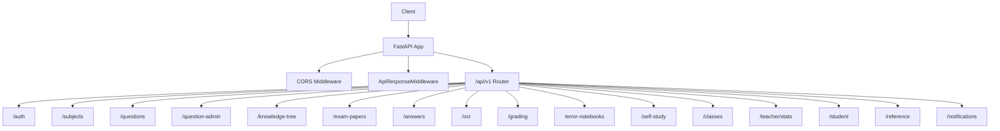
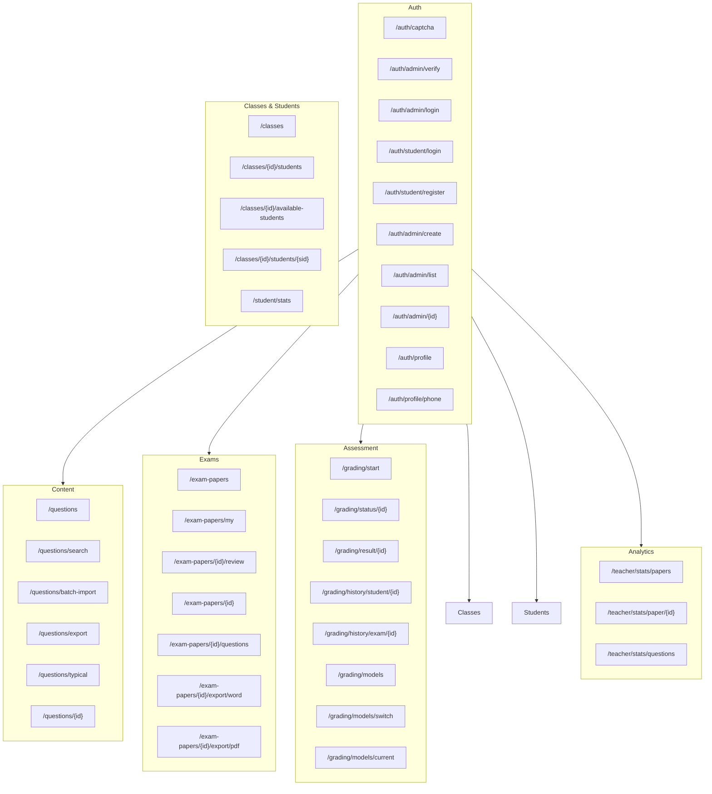
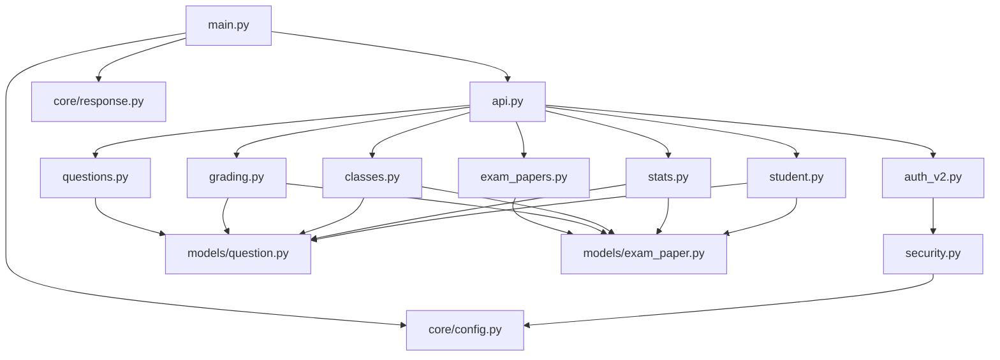
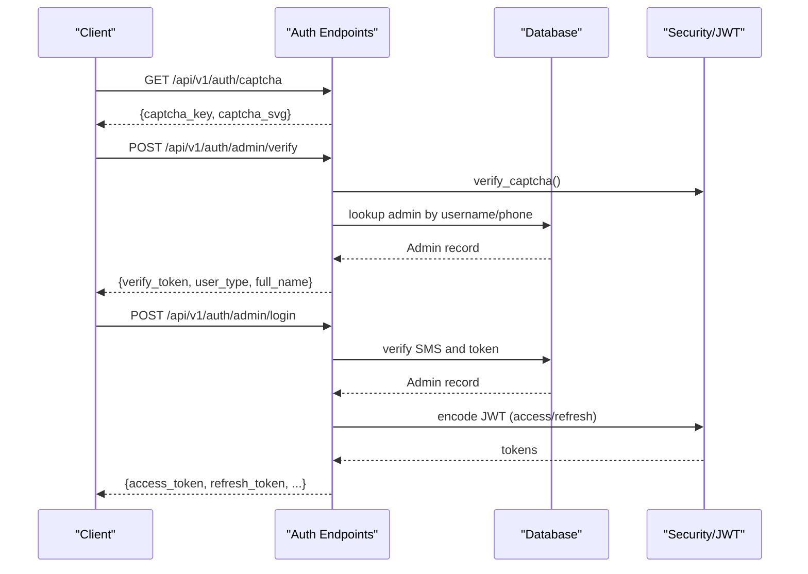

# API Documentation

<cite>
**Referenced Files in This Document**
- [backend/app/main.py](file://backend/app/main.py)
- [backend/app/api/v1/api.py](file://backend/app/api/v1/api.py)
- [backend/app/core/config.py](file://backend/app/core/config.py)
- [backend/app/core/security.py](file://backend/app/core/security.py)
- [backend/app/core/response.py](file://backend/app/core/response.py)
- [backend/app/api/v1/endpoints/auth_v2.py](file://backend/app/api/v1/endpoints/auth_v2.py)
- [backend/app/api/v1/endpoints/questions.py](file://backend/app/api/v1/endpoints/questions.py)
- [backend/app/api/v1/endpoints/exam_papers.py](file://backend/app/api/v1/endpoints/exam_papers.py)
- [backend/app/api/v1/endpoints/grading.py](file://backend/app/api/v1/endpoints/grading.py)
- [backend/app/api/v1/endpoints/student.py](file://backend/app/api/v1/endpoints/student.py)
- [backend/app/api/v1/endpoints/classes.py](file://backend/app/api/v1/endpoints/classes.py)
- [backend/app/api/v1/endpoints/stats.py](file://backend/app/api/v1/endpoints/stats.py)
- [backend/app/models/question.py](file://backend/app/models/question.py)
- [backend/app/models/exam_paper.py](file://backend/app/models/exam_paper.py)
- [backend/app/schemas/question.py](file://backend/app/schemas/question.py)
</cite>

## Table of Contents
1. [Introduction](#introduction)
2. [Project Structure](#project-structure)
3. [Core Components](#core-components)
4. [Architecture Overview](#architecture-overview)
5. [Detailed Component Analysis](#detailed-component-analysis)
6. [Dependency Analysis](#dependency-analysis)
7. [Performance Considerations](#performance-considerations)
8. [Troubleshooting Guide](#troubleshooting-guide)
9. [Conclusion](#conclusion)
10. [Appendices](#appendices)

## Introduction
This document describes the RESTful API for the Ruicheng Educational Management System. It covers authentication and authorization, user management, question management, exam administration, student assessment workflows, and administrative tools. The API follows a unified response wrapper, JWT-based authentication, and standardized pagination and filtering patterns. It also documents rate limiting, CORS, and API versioning strategy.

## Project Structure
The backend is a FastAPI application that mounts a versioned router under /api/v1. Middleware enforces CORS and wraps all responses into a consistent envelope. Authentication endpoints manage admin and student logins, while other groups expose CRUD and analytics endpoints for questions, exams, classes, and grading.

**Diagram sources**
- [backend/app/main.py:11-30](file://backend/app/main.py#L11-L30)
- [backend/app/api/v1/api.py:6-25](file://backend/app/api/v1/api.py#L6-L25)

**Section sources**
- [backend/app/main.py:11-30](file://backend/app/main.py#L11-L30)
- [backend/app/api/v1/api.py:6-25](file://backend/app/api/v1/api.py#L6-L25)

## Core Components
- Unified Response Wrapper: All responses under /api/ are wrapped in {code, message, data}. Errors are normalized to carry HTTP status semantics in the code field.
- CORS: Enabled for development with broad allowances; production should restrict origins.
- Authentication: JWT-based bearer tokens with roles (SYS_ADMIN, TEACHER, QUESTION_ADMIN, STUDENT). Tokens include user type and expiration.
- Pagination and Filtering: Many endpoints support skip/limit and various query filters; limits are enforced (e.g., max 200 per page).
- Rate Limiting: Not implemented in the provided code; consider adding at the gateway or middleware.

**Section sources**
- [backend/app/core/response.py:14-124](file://backend/app/core/response.py#L14-L124)
- [backend/app/main.py:20-27](file://backend/app/main.py#L20-L27)
- [backend/app/core/security.py:50-103](file://backend/app/core/security.py#L50-L103)
- [backend/app/core/config.py:36-46](file://backend/app/core/config.py#L36-L46)

## Architecture Overview
The API is organized into modular routers grouped by domain. Authentication is centralized, while domain-specific endpoints handle CRUD, analytics, and workflows.

**Diagram sources**
- [backend/app/api/v1/api.py:8-25](file://backend/app/api/v1/api.py#L8-L25)
- [backend/app/api/v1/endpoints/auth_v2.py:75-475](file://backend/app/api/v1/endpoints/auth_v2.py#L75-L475)
- [backend/app/api/v1/endpoints/questions.py:17-431](file://backend/app/api/v1/endpoints/questions.py#L17-L431)
- [backend/app/api/v1/endpoints/exam_papers.py:20-844](file://backend/app/api/v1/endpoints/exam_papers.py#L20-L844)
- [backend/app/api/v1/endpoints/grading.py:19-143](file://backend/app/api/v1/endpoints/grading.py#L19-L143)
- [backend/app/api/v1/endpoints/classes.py:16-243](file://backend/app/api/v1/endpoints/classes.py#L16-L243)
- [backend/app/api/v1/endpoints/student.py:16-112](file://backend/app/api/v1/endpoints/student.py#L16-L112)
- [backend/app/api/v1/endpoints/stats.py:17-251](file://backend/app/api/v1/endpoints/stats.py#L17-L251)

## Detailed Component Analysis

### Authentication and Authorization
- Base URL: /api/v1/auth
- JWT lifecycle: Access tokens and refresh tokens with configurable expiry.
- Roles: SYS_ADMIN, TEACHER, QUESTION_ADMIN, STUDENT.
- Security: OAuth2 Bearer scheme; token decoding validates presence and type; user existence verified per role.

Endpoints
- GET /auth/captcha
  - Purpose: Obtain a CAPTCHA key and SVG image.
  - Response: {captcha_key, captcha_svg}.
- POST /auth/admin/verify
  - Purpose: Verify role, password, and CAPTCHA; returns a short-lived verify token.
  - Request: {username, password, captcha_key, captcha_code, sms_code, role, verify_token}.
  - Response: {ok, verify_token, user_type, full_name, message}.
- POST /auth/admin/login
  - Purpose: Finalize admin login using verify token and SMS code.
  - Request: {verify_token, sms_code}.
  - Response: {access_token, refresh_token, token_type, user_type, full_name}.
- POST /auth/student/login
  - Purpose: Student login with CAPTCHA and SMS.
  - Request: {username, captcha_key, captcha_code, sms_code}.
  - Response: {access_token, refresh_token, token_type, user_type, full_name}.
- POST /auth/student/register
  - Purpose: Register a new student via SMS.
  - Request: {phone, sms_code, full_name, grade, school}.
  - Response: {access_token, refresh_token, token_type, user_type, full_name}.
- POST /auth/admin/create
  - Purpose: SYS_ADMIN creates teacher or question_admin.
  - Request: {username, password, full_name, admin_type, email, phone, qualification, subjects, grade_level}.
  - Response: {id, username, admin_type}.
- GET /auth/admin/list
  - Purpose: List admins with optional filters.
  - Query: {name, admin_type, is_active, subject, grade}.
  - Response: Array of admin records.
- DELETE /auth/admin/{admin_id}
  - Purpose: Delete admin.
  - Path: {admin_id}.
  - Response: {message}.
- PUT /auth/admin/{admin_id}
  - Purpose: Update admin fields; supports JSON arrays for subjects/grades.
  - Path: {admin_id}; Body fields: full_name, email, phone, qualification, admin_type, subjects, grade_level, is_active, password.
  - Response: {message}.
- PUT /auth/admin/{admin_id}/subjects
  - Purpose: Update subject assignments (JSON array string).
  - Path: {admin_id}; Body: subjects.
  - Response: {message, subjects}.
- GET /auth/profile
  - Purpose: Retrieve current user profile from the appropriate table.
  - Response: {ok, data} with role-specific fields.
- PUT /auth/profile
  - Purpose: Update profile (full_name, email, grade, school); phone excluded.
  - Body: {full_name, email, grade, school}.
  - Response: {ok, message}.
- PUT /auth/profile/phone
  - Purpose: Update phone with SMS verification.
  - Body: {phone, sms_code}.
  - Response: {ok, message, phone}.

Security and Authentication
- Token validation occurs via OAuth2 Bearer scheme; user identity resolved from token payload and validated against DB tables by role.
- Role guards enforce access to admin management endpoints.

Example cURL
- Get CAPTCHA:
  - curl -X GET "{{API_ROOT}}/api/v1/auth/captcha"
- Admin verify:
  - curl -X POST "{{API_ROOT}}/api/v1/auth/admin/verify" -H "Content-Type: application/json" -d '{"username":"admin","password":"pass","captcha_key":"KEY","captcha_code":"CODE","sms_code":"111111","role":0}'
- Admin login:
  - curl -X POST "{{API_ROOT}}/api/v1/auth/admin/login" -H "Content-Type: application/json" -d '{"verify_token":"VERIFY_TOKEN","sms_code":"111111"}'

**Section sources**
- [backend/app/api/v1/endpoints/auth_v2.py:75-475](file://backend/app/api/v1/endpoints/auth_v2.py#L75-L475)
- [backend/app/core/security.py:50-103](file://backend/app/core/security.py#L50-L103)
- [backend/app/core/config.py:36-46](file://backend/app/core/config.py#L36-L46)

### Question Management
- Base URL: /api/v1/questions
- Supported question types and difficulties are constrained by model definitions.

Endpoints
- POST ""
  - Purpose: Create a question; sets defaults for source and review_status.
  - Body: QuestionCreate schema.
  - Response: QuestionResponse.
- GET "/search"
  - Purpose: Search with filters and pagination; enforces per-request limit.
  - Query: {subject, grade_level, grade, scope, source, question_type, difficulty, keyword, knowledge_point, skip, limit}.
  - Response: {items, total}.
- GET "/tags"
  - Placeholder; returns empty list.
- GET "/knowledge-points"
  - Placeholder; returns empty list.
- POST "/batch-import"
  - Purpose: Import multiple questions from JSON array; capped at 200 per request.
  - Body: Array of question objects.
  - Response: {imported, message}.
- POST "/export"
  - Purpose: Export selected questions by IDs.
  - Body: {question_ids: [string]}.
  - Response: Array of question objects.
- GET "/export"
  - Purpose: Export filtered questions; respects configuration limit.
  - Query: {subject, grade_level, question_type, difficulty, keyword, knowledge_point, limit}.
  - Response: Array of question objects.
- POST "/deduplicate"
  - Placeholder; returns 501.
- GET "/typical"
  - Purpose: List typical questions; accessible to authenticated users.
  - Query: {skip, limit, subject, grade}.
  - Response: Array of question summaries.
- PUT "/{question_id}/typical"
  - Purpose: Toggle is_typical; requires TEACHER/QUESTION_ADMIN/SYS_ADMIN.
  - Body: {is_typical: boolean}.
  - Response: {id, is_typical, message}.
- GET "/{question_id}"
  - Purpose: Retrieve a single question.
  - Response: QuestionResponse.
- PUT "/{question_id}"
  - Purpose: Update question; creator-only unless SYS_ADMIN.
  - Body: QuestionUpdate schema.
  - Response: QuestionResponse.
- DELETE "/{question_id}"
  - Purpose: Delete question; requires TEACHER/QUESTION_ADMIN/SYS_ADMIN.
  - Response: {message, id}.
- POST "/batch-delete"
  - Purpose: Bulk delete; capped at 200 per request.
  - Body: {question_ids: [string]}.
  - Response: {deleted, message}.
- GET ""
  - Purpose: Paginated listing with filters; enforces per-request limit.
  - Query: {skip, limit, subject, grade_level, grade, scope, source, question_type, difficulty, review_status, keyword}.
  - Response: {items, total}.

Data Models and Constraints
- Question model defines allowed question types, difficulties, and positive scoring constraints.

Example cURL
- Create question:
  - curl -X POST "{{API_ROOT}}/api/v1/questions" -H "Authorization: Bearer $TOKEN" -H "Content-Type: application/json" -d '{...}'
- Search:
  - curl -X GET "{{API_ROOT}}/api/v1/questions/search?subject=math&limit=20&skip=0"

**Section sources**
- [backend/app/api/v1/endpoints/questions.py:17-431](file://backend/app/api/v1/endpoints/questions.py#L17-L431)
- [backend/app/models/question.py:10-46](file://backend/app/models/question.py#L10-L46)
- [backend/app/schemas/question.py:20-52](file://backend/app/schemas/question.py#L20-L52)

### Exam Administration
- Base URL: /api/v1/exam-papers
- Supports linking questions to papers, exporting to Word/PDF, and managing submissions.

Endpoints
- POST ""
  - Purpose: Create exam paper; optionally import questions inline.
  - Body: ExamPaperCreate with optional questions array.
  - Response: ExamPaperResponse.
- GET "/my"
  - Purpose: List papers the current student has submitted answers for; enriches with latest submission metadata.
  - Query: {skip, limit, title, status, grade}.
  - Response: Array of paper summaries with submission fields.
- GET "/{exam_paper_id}/review"
  - Purpose: Review paper with student’s submission and question answers.
  - Response: {paper, submission, questions}.
- GET "/{exam_paper_id}"
  - Purpose: Retrieve a single paper.
  - Response: ExamPaperResponse.
- PUT "/{exam_paper_id}"
  - Purpose: Update paper; allows creators and admins.
  - Body: ExamPaperUpdate.
  - Response: ExamPaperResponse.
- DELETE "/{exam_paper_id}"
  - Purpose: Delete paper; cascades related records.
  - Response: No content.
- PUT "/{exam_paper_id}/submission-status"
  - Purpose: Change current student’s latest submission status to RE_GRADED (only after GENERATED).
  - Body: {status_in: "RE_GRADED"}.
  - Response: {message, status}.
- GET ""
  - Purpose: List papers with filters and computed question_count.
  - Query: {skip, limit, title, status, scope, grade, grades, keyword}.
  - Response: Array of paper summaries.
- POST "/{exam_paper_id}/questions"
  - Purpose: Add question to paper; supports position and score.
  - Body: {question_id, position, score}.
  - Response: ExamPaperResponse.
- DELETE "/{exam_paper_id}/questions/{question_id}"
  - Purpose: Remove question from paper.
  - Response: ExamPaperResponse.
- PUT "/{exam_paper_id}/questions/sort"
  - Purpose: Sort questions in paper (placeholder).
  - Body: {question_ids}.
  - Response: ExamPaperResponse.
- GET "/{exam_paper_id}/questions"
  - Purpose: List linked questions ordered by position.
  - Response: Array of question objects.
- GET "/{exam_paper_id}/export/word"
  - Purpose: Export paper to Word stream.
  - Response: StreamingResponse (application/vnd.openxmlformats-officedocument.wordprocessingml.document).
- GET "/{exam_paper_id}/export/pdf"
  - Purpose: Export paper to PDF stream.
  - Response: StreamingResponse (application/pdf).

Data Models and Constraints
- ExamPaper and association table define many-to-many relationship with ordering and scoring.

Example cURL
- Create paper with questions:
  - curl -X POST "{{API_ROOT}}/api/v1/exam-papers" -H "Authorization: Bearer $TOKEN" -H "Content-Type: application/json" -d '{...}'
- Export to Word:
  - curl -OJ "{{API_ROOT}}/api/v1/exam-papers/{id}/export/word" -H "Authorization: Bearer $TOKEN"

**Section sources**
- [backend/app/api/v1/endpoints/exam_papers.py:20-844](file://backend/app/api/v1/endpoints/exam_papers.py#L20-L844)
- [backend/app/models/exam_paper.py:23-51](file://backend/app/models/exam_paper.py#L23-L51)

### Student Assessment Workflows
- Base URL: /api/v1/grading
- Provides manual grading orchestration and history queries.

Endpoints
- POST "/start"
  - Purpose: Start grading for a submission; transitions submission to GRADED and records GradingRecord.
  - Body: {answer_submission_id}.
  - Response: GradingRecordResponse.
- GET "/status/{grading_id}"
  - Purpose: Poll grading status.
  - Response: GradingRecordResponse.
- GET "/result/{grading_id}"
  - Purpose: Retrieve grading result.
  - Response: GradingRecordResponse.
- GET "/history/student/{student_id}"
  - Purpose: List grading history for a student (self or by teacher/SYS_ADMIN).
  - Query: {skip, limit}.
  - Response: Array of GradingRecordResponse.
- GET "/history/exam/{exam_paper_id}"
  - Purpose: List grading history for an exam (teacher/SYS_ADMIN).
  - Query: {skip, limit}.
  - Response: Array of GradingRecordResponse.
- GET "/models"
  - Purpose: List available ML models.
  - Response: Array of model descriptors.
- POST "/models/switch"
  - Purpose: Switch active model (SYS_ADMIN).
  - Body: {model_id}.
  - Response: {message}.
- GET "/models/current"
  - Purpose: Get currently used model.
  - Response: {name, version, type}.

Example cURL
- Start grading:
  - curl -X POST "{{API_ROOT}}/api/v1/grading/start" -H "Authorization: Bearer $TOKEN" -H "Content-Type: application/json" -d '{"answer_submission_id":"..."}'

**Section sources**
- [backend/app/api/v1/endpoints/grading.py:19-143](file://backend/app/api/v1/endpoints/grading.py#L19-L143)

### Student Dashboard and Analytics
- Base URL: /api/v1/student
- GET "/stats"
  - Purpose: Return real-time dashboard metrics for the current student.
  - Response: {completed_papers, accuracy_rate, error_count, highest_score, recent_papers, subject_distribution}.

- Base URL: /api/v1/teacher/stats
- GET "/papers"
  - Purpose: List papers available for statistics (teacher’s own).
  - Response: Array of paper descriptors.
- GET "/paper/{paper_id}"
  - Purpose: Per-question statistics for a paper, including choice distributions.
  - Response: {paper, total_students, questions}.
- GET "/questions"
  - Purpose: Overall question statistics across submissions, with optional filters.
  - Query: {subject, question_type}.
  - Response: {questions, total_submissions}.

Example cURL
- Get student stats:
  - curl -X GET "{{API_ROOT}}/api/v1/student/stats" -H "Authorization: Bearer $TOKEN"

**Section sources**
- [backend/app/api/v1/endpoints/student.py:16-112](file://backend/app/api/v1/endpoints/student.py#L16-L112)
- [backend/app/api/v1/endpoints/stats.py:17-251](file://backend/app/api/v1/endpoints/stats.py#L17-L251)

### Class and Student Management
- Base URL: /api/v1/classes
- POST "" (create)
  - Body: {name, subject, grade_level, description, is_active}.
  - Response: {ok, id, name, message}.
- GET "" (list)
  - Query: {search}.
  - Response: Array of classes with student_count.
- PUT "/{class_id}" (update)
  - Body: {name, subject, grade_level, description, is_active}.
  - Response: {ok, message}.
- DELETE "/{class_id}" (delete)
  - Response: {ok, message}.
- GET "/{class_id}/students" (list)
  - Response: Array of students.
- GET "/{class_id}/available-students" (list)
  - Query: {search}.
  - Response: Array of available students.
- POST "/{class_id}/students" (add)
  - Body: {student_id, full_name, phone, grade, school}.
  - Response: {ok, message}.
- DELETE "/{class_id}/students/{student_id}" (remove)
  - Response: {ok, message}.
- PUT "/{class_id}/students/{student_id}" (update)
  - Body: {full_name, email, grade, school}.
  - Response: {ok, message}.
- GET "/{class_id}/students/{student_id}" (detail)
  - Response: Student details.

Example cURL
- Create class:
  - curl -X POST "{{API_ROOT}}/api/v1/classes" -H "Authorization: Bearer $TOKEN" -H "Content-Type: application/json" -d '{"name":"Class A","subject":"Math","is_active":true}'

**Section sources**
- [backend/app/api/v1/endpoints/classes.py:16-243](file://backend/app/api/v1/endpoints/classes.py#L16-L243)

### Additional Endpoints
- Reference and Notifications routers are included in the versioned API but not detailed here due to lack of implementation specifics in the provided files.

**Section sources**
- [backend/app/api/v1/api.py:6-25](file://backend/app/api/v1/api.py#L6-L25)

## Dependency Analysis
The API depends on a shared configuration for JWT settings and database connectivity, a security module for token handling and role checks, and a response middleware to normalize outputs. Domain endpoints depend on SQLAlchemy models and schemas.

**Diagram sources**
- [backend/app/main.py:11-30](file://backend/app/main.py#L11-L30)
- [backend/app/api/v1/api.py:6-25](file://backend/app/api/v1/api.py#L6-L25)
- [backend/app/core/security.py:50-103](file://backend/app/core/security.py#L50-L103)
- [backend/app/models/question.py:10-46](file://backend/app/models/question.py#L10-L46)
- [backend/app/models/exam_paper.py:23-51](file://backend/app/models/exam_paper.py#L23-L51)

**Section sources**
- [backend/app/main.py:11-30](file://backend/app/main.py#L11-L30)
- [backend/app/core/security.py:50-103](file://backend/app/core/security.py#L50-L103)
- [backend/app/models/question.py:10-46](file://backend/app/models/question.py#L10-L46)
- [backend/app/models/exam_paper.py:23-51](file://backend/app/models/exam_paper.py#L23-L51)

## Performance Considerations
- Pagination limits: Many endpoints cap limit to 200 per page to prevent heavy queries.
- Filtering: Use indexed fields (e.g., subject) and JSONB containment where applicable to reduce scan cost.
- Export caps: Export endpoints respect configuration limits to avoid oversized payloads.
- Asynchronous sessions: Endpoints use async SQLAlchemy sessions to improve concurrency.

[No sources needed since this section provides general guidance]

## Troubleshooting Guide
Common Issues and Resolutions
- 401 Unauthorized
  - Cause: Missing or invalid Bearer token; token expired or malformed.
  - Resolution: Re-authenticate and obtain new tokens; verify tokenUrl alignment with settings.
- 403 Forbidden
  - Cause: Insufficient role or attempting unauthorized action (e.g., updating another user’s question).
  - Resolution: Ensure correct role and ownership; verify admin management endpoints require SYS_ADMIN.
- 404 Not Found
  - Cause: Resource does not exist (paper, question, admin).
  - Resolution: Validate IDs and ensure entity creation precedes updates/deletes.
- 429 Too Many Requests
  - Cause: No built-in rate limiting; excessive requests may overwhelm the server.
  - Resolution: Implement client-side throttling or deploy rate limiting at the gateway.
- CORS Errors
  - Cause: Production misconfiguration allowing only specific origins.
  - Resolution: Configure allow_origins to match frontend origin.

**Section sources**
- [backend/app/core/security.py:64-103](file://backend/app/core/security.py#L64-L103)
- [backend/app/core/response.py:70-87](file://backend/app/core/response.py#L70-L87)
- [backend/app/main.py:20-27](file://backend/app/main.py#L20-L27)

## Conclusion
The API provides a cohesive set of endpoints for educational management, with strong separation of concerns across authentication, content, assessments, and analytics. The unified response wrapper and JWT-based security simplify integration. For production, consider adding explicit rate limiting, stricter CORS policies, and standardized OpenAPI documentation generation.

[No sources needed since this section summarizes without analyzing specific files]

## Appendices

### API Versioning and Base URL
- Version: v1
- Base URL: /api/v1
- OpenAPI: /api/v1/openapi.json

**Section sources**
- [backend/app/main.py:11-15](file://backend/app/main.py#L11-L15)
- [backend/app/core/config.py:39-40](file://backend/app/core/config.py#L39-L40)

### Authentication Flow (Sequence)

**Diagram sources**
- [backend/app/api/v1/endpoints/auth_v2.py:75-183](file://backend/app/api/v1/endpoints/auth_v2.py#L75-L183)
- [backend/app/core/security.py:50-103](file://backend/app/core/security.py#L50-L103)

### Request/Response Schema Examples
- QuestionCreate
  - Fields: title, subject, grade_level, question_type, difficulty, knowledge_points, correct_answer, explanation, score, content.
- QuestionUpdate
  - Fields: title, subject, grade_level, question_type, difficulty, knowledge_points, correct_answer, explanation, score, source, review_status, is_active.
- ExamPaperCreate
  - Fields: title, description, subject, grade_level, status, total_score, duration_minutes, subtitle, instructions, questions (optional).
- GradingRecordCreate
  - Fields: answer_submission_id.
- AdminLoginRequest
  - Fields: username, password, captcha_key, captcha_code, sms_code, role, verify_token.

**Section sources**
- [backend/app/schemas/question.py:20-52](file://backend/app/schemas/question.py#L20-L52)
- [backend/app/api/v1/endpoints/exam_papers.py:20-64](file://backend/app/api/v1/endpoints/exam_papers.py#L20-L64)
- [backend/app/api/v1/endpoints/grading.py:19-55](file://backend/app/api/v1/endpoints/grading.py#L19-L55)
- [backend/app/api/v1/endpoints/auth_v2.py:25-32](file://backend/app/api/v1/endpoints/auth_v2.py#L25-L32)

### Pagination, Filtering, Sorting
- Pagination: skip, limit with enforcement (<=200).
- Filtering: subject, grade_level, grade, scope, source, question_type, difficulty, review_status, keyword, status, scope, grades, title, description.
- Sorting: Many endpoints order by created_at desc; question lists may order by updated_at desc.

**Section sources**
- [backend/app/api/v1/endpoints/questions.py:366-431](file://backend/app/api/v1/endpoints/questions.py#L366-L431)
- [backend/app/api/v1/endpoints/exam_papers.py:362-413](file://backend/app/api/v1/endpoints/exam_papers.py#L362-L413)
- [backend/app/api/v1/endpoints/classes.py:36-62](file://backend/app/api/v1/endpoints/classes.py#L36-L62)

### Security Considerations
- Transport: Use HTTPS in production.
- Secrets: Store SECRET_KEY and database passwords in environment variables; avoid committing to source control.
- Tokens: Short-lived access tokens with refresh tokens; rotate keys periodically.
- CORS: Restrict allow_origins to trusted domains in production.

**Section sources**
- [backend/app/core/config.py:15-30](file://backend/app/core/config.py#L15-L30)
- [backend/app/main.py:20-27](file://backend/app/main.py#L20-L27)