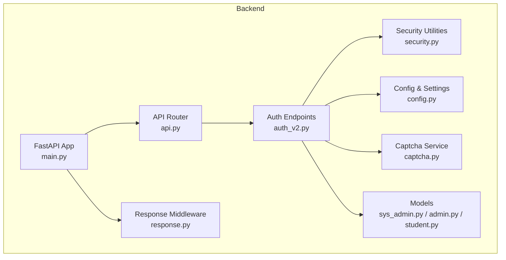
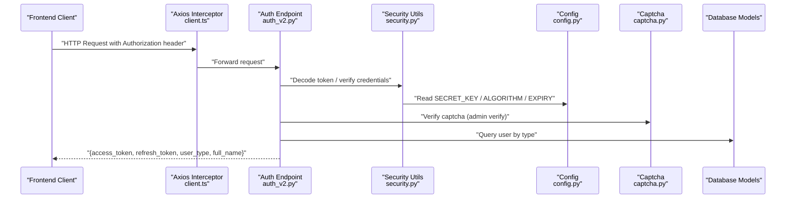
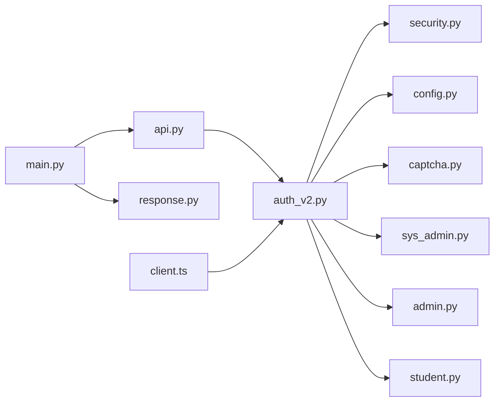

# Authentication API

<cite>
**Referenced Files in This Document**
- [auth_v2.py](file://backend/app/api/v1/endpoints/auth_v2.py)
- [security.py](file://backend/app/core/security.py)
- [config.py](file://backend/app/core/config.py)
- [api.py](file://backend/app/api/v1/api.py)
- [client.ts](file://frontend/src/api/client.ts)
- [auth.ts](file://frontend/src/store/auth.ts)
- [captcha.py](file://backend/app/services/captcha.py)
- [sys_admin.py](file://backend/app/models/sys_admin.py)
- [admin.py](file://backend/app/models/admin.py)
- [student.py](file://backend/app/models/student.py)
- [response.py](file://backend/app/core/response.py)
- [main.py](file://backend/app/main.py)
</cite>

## Table of Contents
1. [Introduction](#introduction)
2. [Project Structure](#project-structure)
3. [Core Components](#core-components)
4. [Architecture Overview](#architecture-overview)
5. [Detailed Component Analysis](#detailed-component-analysis)
6. [Dependency Analysis](#dependency-analysis)
7. [Performance Considerations](#performance-considerations)
8. [Troubleshooting Guide](#troubleshooting-guide)
9. [Conclusion](#conclusion)

## Introduction
This document provides comprehensive API documentation for the Authentication API endpoints. It covers JWT token-based authentication including login, registration, and token refresh flows for administrators and students. It also documents HTTP methods, URL patterns, request/response schemas, authentication headers, JWT token structure and expiration handling, role-based access control, and practical examples with cURL commands. Security considerations, rate limiting policies, and account lockout mechanisms are addressed.

## Project Structure
The authentication system is implemented under the FastAPI application with modular components:
- API endpoints: /api/v1/auth/*
- Security utilities: JWT encoding/decoding, password hashing, current user resolution, role checks
- Configuration: token expiration settings, secret key, algorithm
- Middleware: unified response wrapper and CORS
- Frontend integration: Axios client and auth store for token management



**Diagram sources**
- [main.py:11-31](file://backend/app/main.py#L11-L31)
- [api.py:8](file://backend/app/api/v1/api.py#L8)
- [auth_v2.py:21](file://backend/app/api/v1/endpoints/auth_v2.py#L21)
- [security.py:13-103](file://backend/app/core/security.py#L13-L103)
- [config.py:36-47](file://backend/app/core/config.py#L36-L47)
- [response.py:14-87](file://backend/app/core/response.py#L14-L87)
- [captcha.py:12-39](file://backend/app/services/captcha.py#L12-L39)
- [sys_admin.py:8-22](file://backend/app/models/sys_admin.py#L8-L22)
- [admin.py:9-27](file://backend/app/models/admin.py#L9-L27)
- [student.py:8-23](file://backend/app/models/student.py#L8-L23)

**Section sources**
- [main.py:11-31](file://backend/app/main.py#L11-L31)
- [api.py:8](file://backend/app/api/v1/api.py#L8)

## Core Components
- Authentication endpoints:
  - Admin login verification and login
  - Student login and registration
  - Profile retrieval and updates
- Security utilities:
  - Password hashing and verification
  - JWT access and refresh token creation
  - Current user extraction from bearer tokens
  - Role-based access control
- Configuration:
  - Secret key, algorithm, token expiration minutes/days
- Response middleware:
  - Wraps all /api/ responses in {code, message, data}

Key JWT claims used:
- sub: user identifier
- type: user type (SYS_ADMIN, QUESTION_ADMIN, TEACHER, STUDENT)
- exp: expiration timestamp

**Section sources**
- [auth_v2.py:25-53](file://backend/app/api/v1/endpoints/auth_v2.py#L25-L53)
- [security.py:16-47](file://backend/app/core/security.py#L16-L47)
- [config.py:43-46](file://backend/app/core/config.py#L43-L46)
- [response.py:14-87](file://backend/app/core/response.py#L14-L87)

## Architecture Overview
The authentication flow integrates frontend Axios interceptors, backend endpoints, and security utilities. Tokens are stored in frontend localStorage and attached to requests via Authorization headers.



**Diagram sources**
- [client.ts:9-52](file://frontend/src/api/client.ts#L9-L52)
- [auth_v2.py:91-183](file://backend/app/api/v1/endpoints/auth_v2.py#L91-L183)
- [security.py:64-95](file://backend/app/core/security.py#L64-L95)
- [config.py:43-46](file://backend/app/core/config.py#L43-L46)
- [captcha.py:32-39](file://backend/app/services/captcha.py#L32-L39)
- [sys_admin.py:8-22](file://backend/app/models/sys_admin.py#L8-L22)
- [admin.py:9-27](file://backend/app/models/admin.py#L9-L27)
- [student.py:8-23](file://backend/app/models/student.py#L8-L23)

## Detailed Component Analysis

### Authentication Endpoints

#### Admin Login Verification
- Method: POST
- Path: /api/v1/auth/admin/verify
- Purpose: Validate role, password, and captcha; produce a one-time verify token
- Request body:
  - username: string
  - password: string
  - captcha_key: string
  - captcha_code: string
  - sms_code: string (default "111111")
  - role: integer (0=教师, 1=题库管理员, 2=系统管理员)
  - verify_token: string (optional)
- Response:
  - ok: boolean
  - verify_token: string
  - user_type: string (SYS_ADMIN, QUESTION_ADMIN, TEACHER)
  - full_name: string
  - message: string

Validation steps:
- Verify captcha using captcha_key and captcha_code
- Find admin by username or phone; confirm role matches requested role
- Verify password hash
- Check is_active flag
- Store one-time verify token with expiry

**Section sources**
- [auth_v2.py:91-147](file://backend/app/api/v1/endpoints/auth_v2.py#L91-L147)
- [captcha.py:32-39](file://backend/app/services/captcha.py#L32-L39)

#### Admin Login
- Method: POST
- Path: /api/v1/auth/admin/login
- Purpose: Complete login using sms_code and verify_token
- Request body:
  - sms_code: string (default "111111")
  - verify_token: string (required)
- Response:
  - access_token: string
  - refresh_token: string
  - token_type: string ("bearer")
  - user_type: string (SYS_ADMIN, QUESTION_ADMIN, TEACHER)
  - full_name: string

Behavior:
- Verify SMS code
- Validate verify_token from /admin/verify
- Update last_login_at
- Issue JWT tokens with user_type in payload

**Section sources**
- [auth_v2.py:149-183](file://backend/app/api/v1/endpoints/auth_v2.py#L149-L183)

#### Student Login
- Method: POST
- Path: /api/v1/auth/student/login
- Purpose: Authenticate student via captcha and SMS
- Request body:
  - username: string (username or phone)
  - captcha_key: string
  - captcha_code: string
  - sms_code: string (default "111111")
- Response:
  - access_token: string
  - refresh_token: string
  - token_type: string ("bearer")
  - user_type: string ("STUDENT")
  - full_name: string

Behavior:
- Verify captcha
- Verify SMS code
- Find student by username or phone
- Check is_active flag
- Update last_login_at
- Issue JWT tokens

**Section sources**
- [auth_v2.py:188-209](file://backend/app/api/v1/endpoints/auth_v2.py#L188-L209)

#### Student Registration
- Method: POST
- Path: /api/v1/auth/student/register
- Purpose: Register new student with phone number
- Request body:
  - phone: string (11 digits)
  - sms_code: string (default "111111")
  - full_name: string
  - grade: string (optional)
  - school: string (optional)
- Response:
  - access_token: string
  - refresh_token: string
  - token_type: string ("bearer")
  - user_type: string ("STUDENT")
  - full_name: string

Behavior:
- Verify SMS code
- Ensure phone uniqueness
- Generate username from last 6 digits of phone
- Create student record (no password)
- Issue JWT tokens

**Section sources**
- [auth_v2.py:212-237](file://backend/app/api/v1/endpoints/auth_v2.py#L212-L237)

#### Profile Endpoints
- GET /api/v1/auth/profile
  - Returns user profile based on user_type
  - Requires Authorization: Bearer <access_token>
- PUT /api/v1/auth/profile
  - Update profile fields (full_name, email, grade, school)
- PUT /api/v1/auth/profile/phone
  - Update phone with SMS verification

**Section sources**
- [auth_v2.py:377-475](file://backend/app/api/v1/endpoints/auth_v2.py#L377-L475)

### JWT Token Structure and Expiration
- Access token payload includes:
  - sub: user UUID
  - type: user_type
  - exp: expiration timestamp
- Refresh token payload includes:
  - sub: user UUID
  - type: user_type
  - exp: expiration timestamp
- Expiration settings:
  - ACCESS_TOKEN_EXPIRE_MINUTES: configured in settings
  - REFRESH_TOKEN_EXPIRE_DAYS: configured in settings

Frontend token management:
- Axios interceptor attaches Authorization: Bearer <access_token> to requests
- On 401 Unauthorized, attempts refresh via /api/v1/auth/refresh using stored refresh_token
- Stores tokens in localStorage

**Section sources**
- [auth_v2.py:55-70](file://backend/app/api/v1/endpoints/auth_v2.py#L55-L70)
- [config.py:43-46](file://backend/app/core/config.py#L43-L46)
- [client.ts:9-52](file://frontend/src/api/client.ts#L9-L52)
- [auth.ts:3-14](file://frontend/src/store/auth.ts#L3-L14)

### Role-Based Access Control
- Current user extraction resolves user by token payload and validates existence in respective table
- Role enforcement via require_role decorator restricts endpoints to specific user_types
- Supported user_types: SYS_ADMIN, QUESTION_ADMIN, TEACHER, STUDENT

**Section sources**
- [security.py:64-103](file://backend/app/core/security.py#L64-L103)
- [auth_v2.py:242-361](file://backend/app/api/v1/endpoints/auth_v2.py#L242-L361)

### Request/Response Schemas
- AdminLoginRequest:
  - username, password, captcha_key, captcha_code, sms_code, role, verify_token
- StudentLoginRequest:
  - username, captcha_key, captcha_code, sms_code
- StudentRegisterRequest:
  - phone (11 digits), sms_code, full_name, grade, school
- TokenResponse:
  - access_token, refresh_token, token_type, user_type, full_name

**Section sources**
- [auth_v2.py:25-53](file://backend/app/api/v1/endpoints/auth_v2.py#L25-L53)

### Practical Examples

#### Get Captcha
```bash
curl -i https://your-domain/api/v1/auth/captcha
```

#### Admin Login Verification
```bash
curl -X POST https://your-domain/api/v1/auth/admin/verify \
  -H "Content-Type: application/json" \
  -d '{
    "username": "admin_username_or_phone",
    "password": "password",
    "captcha_key": "generated_key_from_captcha",
    "captcha_code": "user_input",
    "sms_code": "111111",
    "role": 0
  }'
```

#### Admin Login
```bash
curl -X POST https://your-domain/api/v1/auth/admin/login \
  -H "Content-Type: application/json" \
  -d '{
    "sms_code": "111111",
    "verify_token": "verify_token_from_verify_step"
  }'
```

#### Student Login
```bash
curl -X POST https://your-domain/api/v1/auth/student/login \
  -H "Content-Type: application/json" \
  -d '{
    "username": "student_username_or_phone",
    "captcha_key": "generated_key_from_captcha",
    "captcha_code": "user_input",
    "sms_code": "111111"
  }'
```

#### Student Registration
```bash
curl -X POST https://your-domain/api/v1/auth/student/register \
  -H "Content-Type: application/json" \
  -d '{
    "phone": "13800001111",
    "sms_code": "111111",
    "full_name": "Student Name",
    "grade": "Grade 9",
    "school": "School Name"
  }'
```

#### Using Tokens in Requests
```bash
curl -i -H "Authorization: Bearer YOUR_ACCESS_TOKEN" https://your-domain/api/v1/auth/profile
```

#### Error Responses
Common HTTP status codes:
- 400 Bad Request: Invalid captcha/SMS, missing parameters
- 401 Unauthorized: Invalid credentials, expired verify token
- 403 Forbidden: Account inactive or insufficient permissions
- 404 Not Found: User not found

Example error response structure:
- Wrapped by ApiResponseMiddleware: {"code": 401, "message": "detail", "data": null}

**Section sources**
- [response.py:64-75](file://backend/app/core/response.py#L64-L75)
- [auth_v2.py:91-147](file://backend/app/api/v1/endpoints/auth_v2.py#L91-L147)
- [auth_v2.py:149-183](file://backend/app/api/v1/endpoints/auth_v2.py#L149-L183)
- [auth_v2.py:188-209](file://backend/app/api/v1/endpoints/auth_v2.py#L188-L209)
- [auth_v2.py:212-237](file://backend/app/api/v1/endpoints/auth_v2.py#L212-L237)

### Security Considerations
- HTTPS requirement: All authentication flows must use HTTPS to protect tokens and credentials
- Token storage:
  - Frontend stores access_token and refresh_token in localStorage
  - Axios interceptor automatically attaches Authorization header
- Session management:
  - Access tokens have limited lifetime (minutes)
  - Refresh tokens enable obtaining new access tokens after expiration
- Rate limiting and lockout:
  - No explicit rate limiting or account lockout mechanisms are implemented in the provided code
  - Consider adding rate limiting at the gateway or application level for login endpoints
- Captcha and SMS:
  - Captcha is verified per request and consumed immediately
  - SMS verification uses a default code in development; production should enforce real SMS delivery

**Section sources**
- [client.ts:9-52](file://frontend/src/api/client.ts#L9-L52)
- [auth.ts:3-14](file://frontend/src/store/auth.ts#L3-L14)
- [captcha.py:32-39](file://backend/app/services/captcha.py#L32-L39)
- [config.py:43-46](file://backend/app/core/config.py#L43-L46)

## Dependency Analysis


**Diagram sources**
- [auth_v2.py:13-18](file://backend/app/api/v1/endpoints/auth_v2.py#L13-L18)
- [api.py:8](file://backend/app/api/v1/api.py#L8)
- [main.py:18-30](file://backend/app/main.py#L18-L30)
- [client.ts:1-7](file://frontend/src/api/client.ts#L1-L7)

**Section sources**
- [auth_v2.py:13-18](file://backend/app/api/v1/endpoints/auth_v2.py#L13-L18)
- [api.py:8](file://backend/app/api/v1/api.py#L8)
- [main.py:18-30](file://backend/app/main.py#L18-L30)

## Performance Considerations
- Token expiration:
  - Access tokens are short-lived; refresh tokens provide extended validity
  - Configure ACCESS_TOKEN_EXPIRE_MINUTES and REFRESH_TOKEN_EXPIRE_DAYS appropriately
- Database queries:
  - Endpoints query user records by username/phone; ensure proper indexing on username and phone fields
- Middleware overhead:
  - ApiResponseMiddleware adds minimal overhead by wrapping only JSON responses under /api/

## Troubleshooting Guide
- 401 Unauthorized:
  - Verify Authorization header format: Bearer <access_token>
  - Ensure token is not expired
  - Confirm user still exists and is active
- 403 Forbidden:
  - User account is inactive
  - Insufficient role for protected endpoint
- 400 Bad Request:
  - Invalid captcha or SMS code
  - Missing required fields in request body
- Token refresh failures:
  - Ensure refresh_token is present and valid
  - Axios interceptor handles automatic refresh; check network tab for failed refresh attempts

**Section sources**
- [security.py:64-95](file://backend/app/core/security.py#L64-L95)
- [auth_v2.py:91-147](file://backend/app/api/v1/endpoints/auth_v2.py#L91-L147)
- [auth_v2.py:149-183](file://backend/app/api/v1/endpoints/auth_v2.py#L149-L183)
- [client.ts:26-52](file://frontend/src/api/client.ts#L26-L52)

## Conclusion
The Authentication API provides robust JWT-based authentication for administrators and students with layered security, role-based access control, and seamless frontend integration. While the current implementation focuses on token issuance and validation, production deployments should incorporate rate limiting and account lockout mechanisms to strengthen security posture.