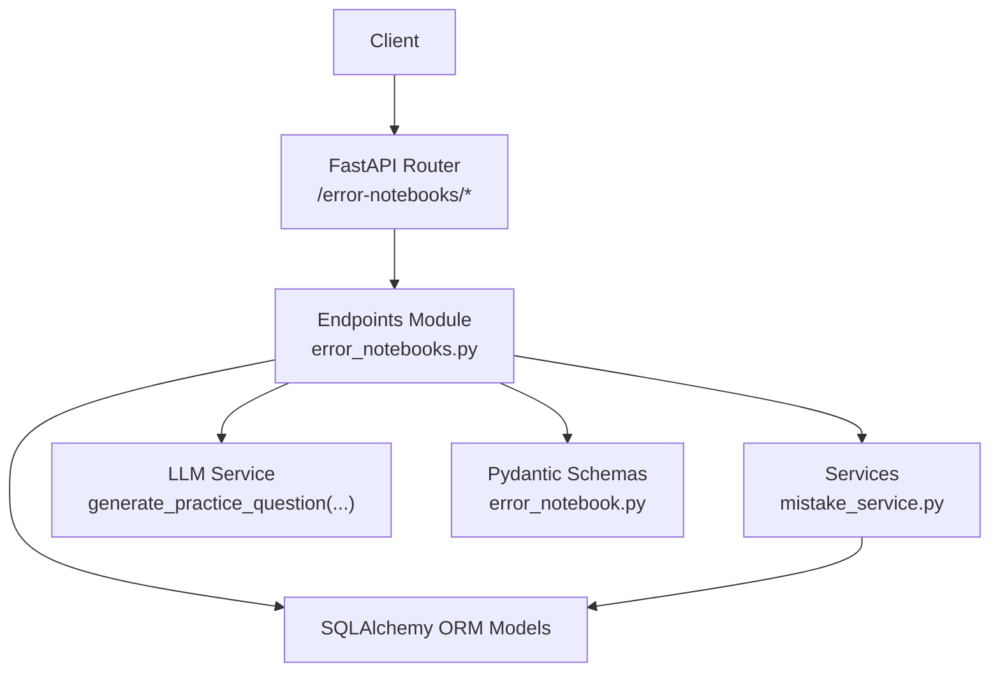
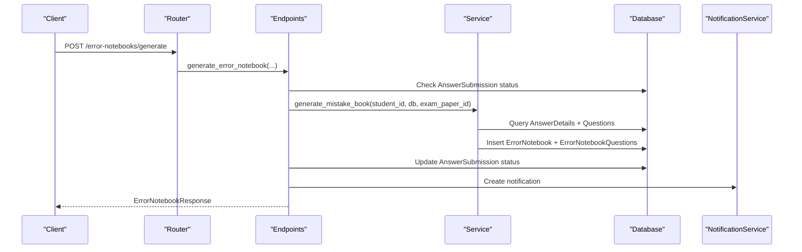
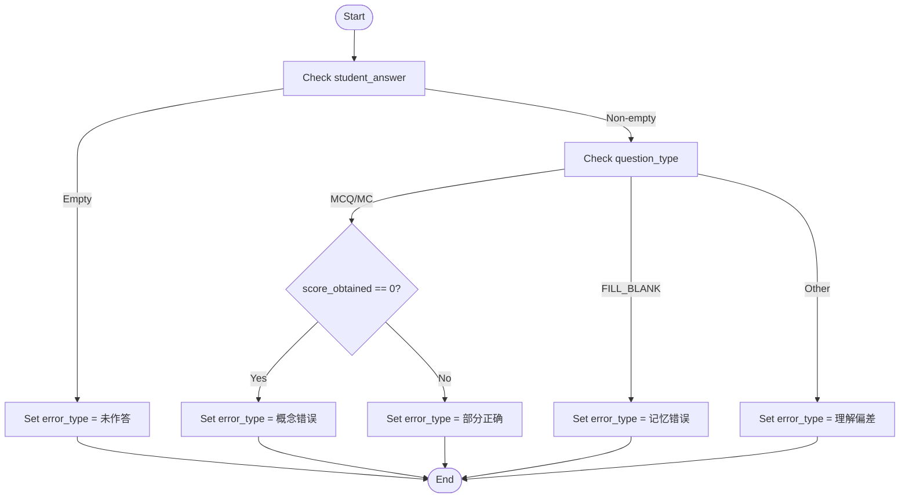
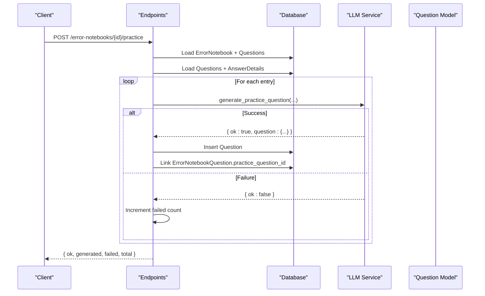
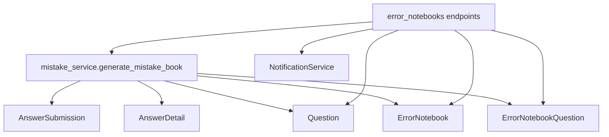
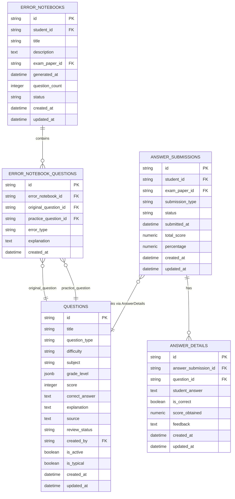

# Error Book API

<cite>
**Referenced Files in This Document**
- [error_notebooks.py](file://backend/app/api/v1/endpoints/error_notebooks.py)
- [api.py](file://backend/app/api/v1/api.py)
- [mistake_service.py](file://backend/app/services/mistake_service.py)
- [error_notebook.py](file://backend/app/models/error_notebook.py)
- [error_notebook_question.py](file://backend/app/models/error_notebook_question.py)
- [question.py](file://backend/app/models/question.py)
- [answer_detail.py](file://backend/app/models/answer_detail.py)
- [answer_submission.py](file://backend/app/models/answer_submission.py)
- [error_notebook.py](file://backend/app/schemas/error_notebook.py)
- [notification_service.py](file://backend/app/services/notification_service.py)
- [student.py](file://backend/app/models/student.py)
</cite>

## Table of Contents
1. [Introduction](#introduction)
2. [Project Structure](#project-structure)
3. [Core Components](#core-components)
4. [Architecture Overview](#architecture-overview)
5. [Detailed Component Analysis](#detailed-component-analysis)
6. [Dependency Analysis](#dependency-analysis)
7. [Performance Considerations](#performance-considerations)
8. [Troubleshooting Guide](#troubleshooting-guide)
9. [Conclusion](#conclusion)
10. [Appendices](#appendices)

## Introduction
This document provides comprehensive API documentation for the Error Book subsystem. It covers automatic error detection, manual error entry, error classification, and study recommendations. It also documents HTTP methods, URL patterns under /error-notebooks/, request/response schemas, parameter specifications for categorization and difficulty analysis, knowledge gap identification, personalized study plan generation, export functionality, error statistics, trend analysis, and progress tracking. Privacy, data retention, and learning analytics integration are addressed where applicable.

## Project Structure
The Error Book API is exposed via a dedicated router mounted under /error-notebooks/. The endpoint module orchestrates generation, retrieval, deletion, practice recommendation, export, and statistics. The generation algorithm relies on answer submissions and details, while the practice recommendation leverages an LLM service. The models define the persistence structure, and schemas define the API response shapes.

**Diagram sources**
- [api.py:19](file://backend/app/api/v1/api.py#L19)
- [error_notebooks.py:1-437](file://backend/app/api/v1/endpoints/error_notebooks.py#L1-L437)
- [mistake_service.py:1-114](file://backend/app/services/mistake_service.py#L1-L114)
- [error_notebook.py:1-32](file://backend/app/models/error_notebook.py#L1-L32)
- [error_notebook_question.py:1-29](file://backend/app/models/error_notebook_question.py#L1-L29)
- [question.py:1-46](file://backend/app/models/question.py#L1-L46)
- [answer_detail.py:1-33](file://backend/app/models/answer_detail.py#L1-L33)
- [answer_submission.py:1-37](file://backend/app/models/answer_submission.py#L1-L37)
- [error_notebook.py:1-57](file://backend/app/schemas/error_notebook.py#L1-L57)

**Section sources**
- [api.py:19](file://backend/app/api/v1/api.py#L19)

## Core Components
- ErrorNotebook model: Represents a student’s error notebook with metadata and status.
- ErrorNotebookQuestion model: Links a notebook to original and optional practice questions, captures error type and explanation.
- Question model: Stores question attributes including type, difficulty, subject, and correct answer.
- AnswerDetail and AnswerSubmission models: Provide the basis for automatic error detection.
- ErrorNotebookResponse schema: Defines the structured response shape for notebook retrieval.

Key responsibilities:
- Automatic generation: Deduplicates wrong answers and builds notebooks with error classification.
- Manual entry: Quick creation of a notebook from free-form question data.
- Practice recommendation: Generates targeted practice questions via LLM.
- Export: Provides text-based export suitable for PDF/Word conversion.
- Statistics: Aggregates student-level counts.

**Section sources**
- [error_notebook.py:8-32](file://backend/app/models/error_notebook.py#L8-L32)
- [error_notebook_question.py:8-29](file://backend/app/models/error_notebook_question.py#L8-L29)
- [question.py:10-46](file://backend/app/models/question.py#L10-L46)
- [answer_detail.py:9-33](file://backend/app/models/answer_detail.py#L9-L33)
- [answer_submission.py:9-37](file://backend/app/models/answer_submission.py#L9-L37)
- [error_notebook.py:42-57](file://backend/app/schemas/error_notebook.py#L42-L57)

## Architecture Overview
The Error Book API follows a layered architecture:
- Router layer: Mounts endpoints under /error-notebooks/.
- Endpoint layer: Implements business logic, permission checks, enrichment, and orchestration.
- Service layer: Encapsulates generation and classification logic.
- Persistence layer: SQLAlchemy models and constraints.
- Schema layer: Pydantic models for serialization.

**Diagram sources**
- [error_notebooks.py:22-59](file://backend/app/api/v1/endpoints/error_notebooks.py#L22-L59)
- [mistake_service.py:13-76](file://backend/app/services/mistake_service.py#L13-L76)
- [notification_service.py](file://backend/app/services/notification_service.py)

## Detailed Component Analysis

### URL Patterns and Endpoints
- POST /error-notebooks/generate
  - Purpose: Generate an error notebook from wrong answers.
  - Request body: exam_paper_id (optional).
  - Response: ErrorNotebookResponse.
  - Permissions: Student; prevents re-generation if status is already GENERATED.
  - Notes: Updates submission status to GENERATED and sends a notification.

- GET /error-notebooks/{notebook_id}
  - Purpose: Retrieve a notebook with enriched question details.
  - Path param: notebook_id (UUID).
  - Response: Enriched object including questions with student answer, correct answer, and optional practice question title.
  - Permissions: Owner or privileged roles (TEACHER, QUESTION_ADMIN, SYS_ADMIN).

- GET /error-notebooks/student/{student_id}
  - Purpose: List notebooks for a student with optional filters.
  - Path param: student_id (UUID).
  - Query params: date_from, date_to, paper_id.
  - Response: Array of ErrorNotebookResponse items.
  - Permissions: Owner or privileged roles.

- DELETE /error-notebooks/{notebook_id}
  - Purpose: Delete a notebook and its entries.
  - Path param: notebook_id (UUID).
  - Permissions: Owner or admin roles.
  - Behavior: Cascades deletion of child entries.

- POST /error-notebooks/{notebook_id}/practice
  - Purpose: Generate practice questions via LLM for each mistake.
  - Path param: notebook_id (UUID).
  - Permissions: Owner or admin roles.
  - Response: { ok, generated, failed, total }.
  - Behavior: Uses question metadata and student/teacher answers to prompt LLM.

- GET /error-notebooks/{notebook_id}/export/pdf
  - Purpose: Export notebook summary to a downloadable text-like PDF.
  - Path param: notebook_id (UUID).
  - Permissions: Owner or admin roles.
  - Response: Binary PDF attachment.

- GET /error-notebooks/{notebook_id}/export/word
  - Purpose: Export notebook summary to Word-compatible text.
  - Path param: notebook_id (UUID).
  - Permissions: Owner or admin roles.
  - Response: Binary Word attachment.

- GET /error-notebooks/stats/student/{student_id}
  - Purpose: Aggregate stats for a student.
  - Path param: student_id (UUID).
  - Permissions: Owner or privileged roles.
  - Response: { total_notebooks, total_wrong_questions }.

- GET /error-notebooks/stats/class/{class_id}
  - Purpose: Placeholder for class-level stats.
  - Path param: class_id (UUID).
  - Permissions: TEACHER or SYS_ADMIN.
  - Response: { class_id, total_notebooks, total_wrong_questions }.

- POST /error-notebooks/manual-entry
  - Purpose: Quick manual entry of a single mistake.
  - Permissions: STUDENT only.
  - Request body: question_title, question_type (default FILL_BLANK), subject, student_answer, correct_answer, error_type (default concept error).
  - Response: { ok, notebook_id, message }.

**Section sources**
- [error_notebooks.py:22-59](file://backend/app/api/v1/endpoints/error_notebooks.py#L22-L59)
- [error_notebooks.py:62-154](file://backend/app/api/v1/endpoints/error_notebooks.py#L62-L154)
- [error_notebooks.py:157-177](file://backend/app/api/v1/endpoints/error_notebooks.py#L157-L177)
- [error_notebooks.py:180-196](file://backend/app/api/v1/endpoints/error_notebooks.py#L180-L196)
- [error_notebooks.py:199-313](file://backend/app/api/v1/endpoints/error_notebooks.py#L199-L313)
- [error_notebooks.py:315-360](file://backend/app/api/v1/endpoints/error_notebooks.py#L315-L360)
- [error_notebooks.py:362-387](file://backend/app/api/v1/endpoints/error_notebooks.py#L362-L387)
- [error_notebooks.py:389-437](file://backend/app/api/v1/endpoints/error_notebooks.py#L389-L437)

### Request/Response Schemas
- ErrorNotebookResponse
  - Fields: id, student_id, title, description, exam_paper_id, question_count, status, generated_at, created_at, updated_at, questions.
  - Nested: questions as NotebookQuestionItem with id, error_notebook_id, original_question_id, practice_question_id, error_type, explanation, question_title, correct_answer, student_answer, practice_question.

- NotebookQuestionItem
  - Fields: id, error_notebook_id, original_question_id, practice_question_id, error_type, explanation, question_title, correct_answer, student_answer, practice_question.

- Manual Entry Request
  - Fields: question_title (required), question_type (default FILL_BLANK), subject, student_answer, correct_answer, error_type (default concept error).

- Practice Generation Response
  - Fields: ok, generated, failed, total.

- Stats Responses
  - Student stats: { total_notebooks, total_wrong_questions }.
  - Class stats: { class_id, total_notebooks, total_wrong_questions }.

**Section sources**
- [error_notebook.py:42-57](file://backend/app/schemas/error_notebook.py#L42-L57)
- [error_notebook.py:26-40](file://backend/app/schemas/error_notebook.py#L26-L40)
- [error_notebooks.py:389-437](file://backend/app/api/v1/endpoints/error_notebooks.py#L389-L437)

### Error Classification and Difficulty Analysis
Automatic classification logic:
- Unanswered: error_type = 未作答.
- For MCQ/MC: error_type = 概念错误 if score_obtained == 0, else 部分正确.
- For FILL_BLANK: error_type = 记忆错误.
- Otherwise: error_type = 理解偏差.

Difficulty analysis and knowledge gap identification:
- The generation algorithm derives question metadata from the original question record (type, difficulty, subject, grade level).
- Practice recommendation uses these attributes to guide LLM prompts for targeted practice.

**Diagram sources**
- [mistake_service.py:78-86](file://backend/app/services/mistake_service.py#L78-L86)

**Section sources**
- [mistake_service.py:78-86](file://backend/app/services/mistake_service.py#L78-L86)

### Study Recommendations and Personalized Practice
- Practice generation workflow:
  - Validates notebook ownership and presence of questions.
  - Loads original questions and recent student answers.
  - Calls LLM service to generate a new practice question per mistake.
  - Persists the new question and links it to the notebook entry.
  - Returns counts of generated and failed attempts.

**Diagram sources**
- [error_notebooks.py:199-313](file://backend/app/api/v1/endpoints/error_notebooks.py#L199-L313)

**Section sources**
- [error_notebooks.py:199-313](file://backend/app/api/v1/endpoints/error_notebooks.py#L199-L313)

### Export Functionality
- PDF/Word export:
  - Builds a text summary containing notebook title, generation time, and entries with question titles, error types, explanations, and optional practice titles.
  - Returns a binary response with appropriate Content-Disposition header for download.

**Section sources**
- [error_notebooks.py:315-360](file://backend/app/api/v1/endpoints/error_notebooks.py#L315-L360)

### Statistics, Trend Analysis, and Progress Tracking
- Student-level stats:
  - Aggregates total notebooks and total wrong questions for a given student.
- Class-level stats:
  - Placeholder endpoint for future implementation.
- Trend analysis:
  - Can be derived by filtering notebooks by date range on the student endpoint and comparing counts over time windows.

**Section sources**
- [error_notebooks.py:362-387](file://backend/app/api/v1/endpoints/error_notebooks.py#L362-L387)
- [error_notebooks.py:157-177](file://backend/app/api/v1/endpoints/error_notebooks.py#L157-L177)

### Practical Examples
- Generate error notebook from a paper:
  - Method: POST
  - URL: /error-notebooks/generate
  - Body: {"exam_paper_id": "paper-uuid-here"}

- Retrieve a notebook with enriched questions:
  - Method: GET
  - URL: /error-notebooks/{notebook_id}

- Generate practice for a notebook:
  - Method: POST
  - URL: /error-notebooks/{notebook_id}/practice

- Export notebook:
  - Method: GET
  - URL: /error-notebooks/{notebook_id}/export/pdf

- Manual entry:
  - Method: POST
  - URL: /error-notebooks/manual-entry
  - Body: {"question_title": "...", "question_type": "FILL_BLANK", "subject": "Math", "student_answer": "...", "correct_answer": "...", "error_type": "概念错误"}

- Student stats:
  - Method: GET
  - URL: /error-notebooks/stats/student/{student_id}

**Section sources**
- [error_notebooks.py:22-59](file://backend/app/api/v1/endpoints/error_notebooks.py#L22-L59)
- [error_notebooks.py:62-154](file://backend/app/api/v1/endpoints/error_notebooks.py#L62-L154)
- [error_notebooks.py:199-313](file://backend/app/api/v1/endpoints/error_notebooks.py#L199-L313)
- [error_notebooks.py:315-360](file://backend/app/api/v1/endpoints/error_notebooks.py#L315-L360)
- [error_notebooks.py:389-437](file://backend/app/api/v1/endpoints/error_notebooks.py#L389-L437)
- [error_notebooks.py:362-387](file://backend/app/api/v1/endpoints/error_notebooks.py#L362-L387)

### Privacy, Data Retention, and Learning Analytics
- Privacy:
  - Access control ensures only owners or authorized roles (teachers/admins/sys-admins) can view notebooks.
- Data retention:
  - No explicit retention policy is enforced in the code; administrators can delete notebooks and entries.
- Learning analytics:
  - The system exposes counts and basic stats; richer analytics would require additional aggregation endpoints and dashboards.

**Section sources**
- [error_notebooks.py:62-78](file://backend/app/api/v1/endpoints/error_notebooks.py#L62-L78)
- [error_notebooks.py:157-177](file://backend/app/api/v1/endpoints/error_notebooks.py#L157-L177)
- [error_notebooks.py:180-196](file://backend/app/api/v1/endpoints/error_notebooks.py#L180-L196)

## Dependency Analysis
The Error Book API depends on:
- AnswerSubmission and AnswerDetail for automatic error detection.
- Question for metadata and correct answers.
- ErrorNotebook and ErrorNotebookQuestion for persistence.
- NotificationService for user notifications upon generation.
- LLM service for generating practice questions.

**Diagram sources**
- [error_notebooks.py:22-59](file://backend/app/api/v1/endpoints/error_notebooks.py#L22-L59)
- [mistake_service.py:13-76](file://backend/app/services/mistake_service.py#L13-L76)
- [answer_submission.py:9-37](file://backend/app/models/answer_submission.py#L9-L37)
- [answer_detail.py:9-33](file://backend/app/models/answer_detail.py#L9-L33)
- [question.py:10-46](file://backend/app/models/question.py#L10-L46)
- [error_notebook.py:8-32](file://backend/app/models/error_notebook.py#L8-L32)
- [error_notebook_question.py:8-29](file://backend/app/models/error_notebook_question.py#L8-L29)

**Section sources**
- [error_notebooks.py:22-59](file://backend/app/api/v1/endpoints/error_notebooks.py#L22-L59)
- [mistake_service.py:13-76](file://backend/app/services/mistake_service.py#L13-L76)

## Performance Considerations
- Deduplication: The generation algorithm deduplicates wrong answers by question_id to avoid redundant entries.
- Lazy loading: Relationship loading uses selectinload to minimize N+1 queries.
- Batch operations: Practice generation iterates entries and performs batch inserts; consider batching LLM calls if scaling.
- Indexes: UUID indexes on student_id and exam_paper_id improve query performance for generation and listing.

[No sources needed since this section provides general guidance]

## Troubleshooting Guide
Common issues and resolutions:
- Notebook not found: Ensure the notebook_id exists and belongs to the requesting user or an authorized role.
- Permission denied: Verify user role and ownership; students cannot access others’ notebooks.
- Submission status conflict: Cannot regenerate if status is already GENERATED; reset submission status first.
- Empty notebook: Practice generation requires at least one entry.
- LLM generation failure: Inspect returned counts and logs; retry or adjust prompts.

**Section sources**
- [error_notebooks.py:62-78](file://backend/app/api/v1/endpoints/error_notebooks.py#L62-L78)
- [error_notebooks.py:180-196](file://backend/app/api/v1/endpoints/error_notebooks.py#L180-L196)
- [error_notebooks.py:199-313](file://backend/app/api/v1/endpoints/error_notebooks.py#L199-L313)

## Conclusion
The Error Book API provides a robust foundation for automatic error detection, manual entry, classification, personalized practice, and reporting. Its modular design supports future enhancements such as advanced analytics, improved export formats, and expanded class-level insights.

[No sources needed since this section summarizes without analyzing specific files]

## Appendices

### Data Models Overview

**Diagram sources**
- [error_notebook.py:8-32](file://backend/app/models/error_notebook.py#L8-L32)
- [error_notebook_question.py:8-29](file://backend/app/models/error_notebook_question.py#L8-L29)
- [question.py:10-46](file://backend/app/models/question.py#L10-L46)
- [answer_submission.py:9-37](file://backend/app/models/answer_submission.py#L9-L37)
- [answer_detail.py:9-33](file://backend/app/models/answer_detail.py#L9-L33)