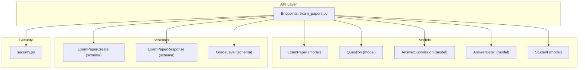
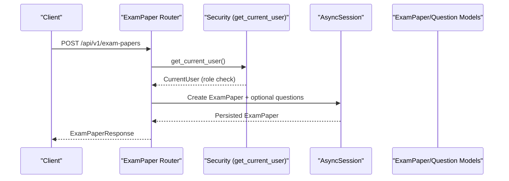
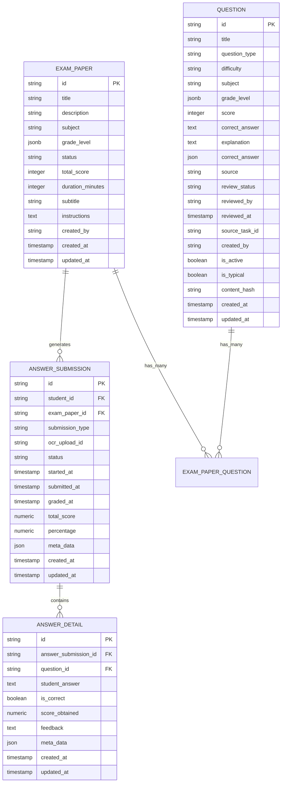
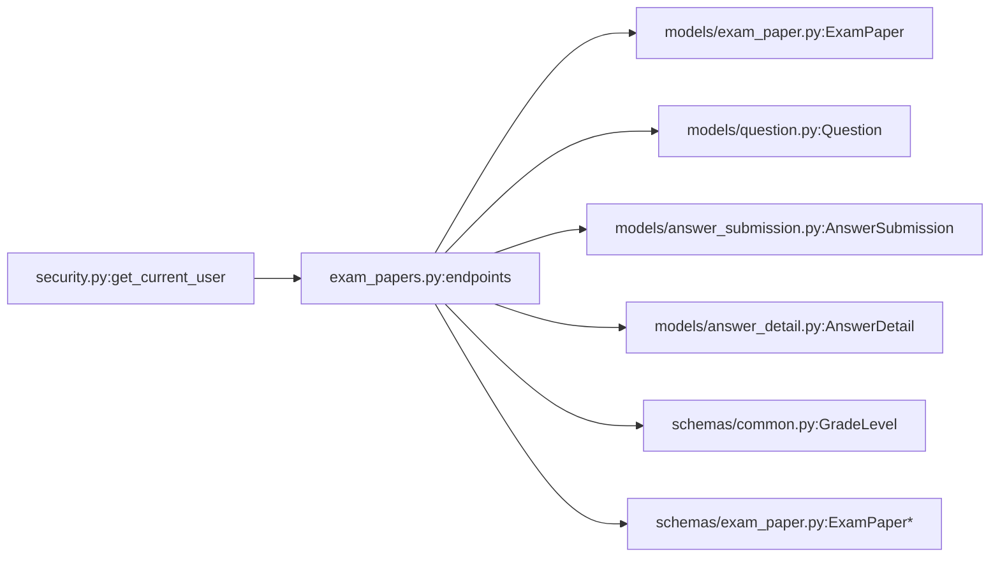
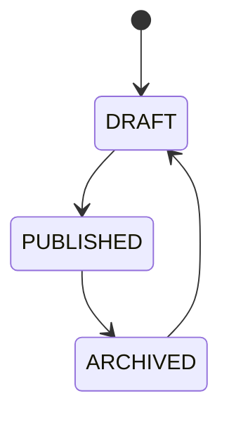

# Exam Administration API

<cite>
**Referenced Files in This Document**
- [exam_papers.py](file://backend/app/api/v1/endpoints/exam_papers.py)
- [exam_paper.py](file://backend/app/models/exam_paper.py)
- [question.py](file://backend/app/models/question.py)
- [answer_submission.py](file://backend/app/models/answer_submission.py)
- [answer_detail.py](file://backend/app/models/answer_detail.py)
- [student.py](file://backend/app/models/student.py)
- [security.py](file://backend/app/core/security.py)
- [common.py](file://backend/app/schemas/common.py)
- [exam_paper.py](file://backend/app/schemas/exam_paper.py)
</cite>

## Table of Contents
1. [Introduction](#introduction)
2. [Project Structure](#project-structure)
3. [Core Components](#core-components)
4. [Architecture Overview](#architecture-overview)
5. [Detailed Component Analysis](#detailed-component-analysis)
6. [Dependency Analysis](#dependency-analysis)
7. [Performance Considerations](#performance-considerations)
8. [Troubleshooting Guide](#troubleshooting-guide)
9. [Conclusion](#conclusion)
10. [Appendices](#appendices)

## Introduction
This document provides comprehensive API documentation for Exam Administration endpoints. It covers exam paper lifecycle operations (creation, retrieval, updates, deletion), question assignment and sorting, export capabilities, and student submission review. It also documents status management, timing constraints, and the relationships among exam papers, questions, and submissions. Practical examples are included via JSON payload paths, and security and integration considerations are addressed.

## Project Structure
The exam administration functionality is implemented under the FastAPI v1 endpoints module. Key components include:
- Endpoint router for exam papers
- SQLAlchemy models for exam papers, questions, answer submissions, and answer details
- Pydantic schemas for request/response validation
- Security utilities for role-based access control

**Diagram sources**
- [exam_papers.py:1-844](file://backend/app/api/v1/endpoints/exam_papers.py#L1-L844)
- [exam_paper.py:1-51](file://backend/app/models/exam_paper.py#L1-L51)
- [question.py:1-46](file://backend/app/models/question.py#L1-L46)
- [answer_submission.py:1-37](file://backend/app/models/answer_submission.py#L1-L37)
- [answer_detail.py:1-33](file://backend/app/models/answer_detail.py#L1-L33)
- [student.py:1-23](file://backend/app/models/student.py#L1-L23)
- [security.py:1-104](file://backend/app/core/security.py#L1-L104)
- [common.py:1-87](file://backend/app/schemas/common.py#L1-L87)
- [exam_paper.py:1-44](file://backend/app/schemas/exam_paper.py#L1-L44)

**Section sources**
- [exam_papers.py:1-844](file://backend/app/api/v1/endpoints/exam_papers.py#L1-L844)
- [security.py:64-95](file://backend/app/core/security.py#L64-L95)

## Core Components
- ExamPaper endpoint router: Provides CRUD and operational endpoints for exam papers, question assignment, sorting, and exports.
- ExamPaper model: Defines paper attributes, status constraints, and JSONB-grade-level metadata.
- Question model: Stores question metadata, type, difficulty, scoring, and correct answers.
- AnswerSubmission and AnswerDetail models: Track student submissions, statuses, scores, and per-question details.
- Security utilities: Role-based access control enforcing TEACHER, QUESTION_ADMIN, SYS_ADMIN, STUDENT roles.
- Schemas: Validation for exam paper creation/update and shared GradeLevel structure.

**Section sources**
- [exam_papers.py:20-64](file://backend/app/api/v1/endpoints/exam_papers.py#L20-L64)
- [exam_paper.py:23-48](file://backend/app/models/exam_paper.py#L23-L48)
- [question.py:10-43](file://backend/app/models/question.py#L10-L43)
- [answer_submission.py:9-31](file://backend/app/models/answer_submission.py#L9-L31)
- [answer_detail.py:9-27](file://backend/app/models/answer_detail.py#L9-L27)
- [security.py:64-95](file://backend/app/core/security.py#L64-L95)
- [common.py:23-44](file://backend/app/schemas/common.py#L23-L44)
- [exam_paper.py:9-43](file://backend/app/schemas/exam_paper.py#L9-L43)

## Architecture Overview
The exam administration API follows a layered architecture:
- Authentication and authorization via JWT bearer tokens and role checks
- Request validation via Pydantic schemas
- Database operations using SQLAlchemy ORM and async sessions
- Export endpoints stream Word/PDF documents generated from paper and question data

**Diagram sources**
- [exam_papers.py:20-64](file://backend/app/api/v1/endpoints/exam_papers.py#L20-L64)
- [security.py:64-95](file://backend/app/core/security.py#L64-L95)

## Detailed Component Analysis

### Exam Paper Endpoints
- Base path: /api/v1/exam-papers
- Methods and paths:
  - POST /api/v1/exam-papers
  - GET /api/v1/exam-papers/my
  - GET /api/v1/exam-papers/{exam_paper_id}
  - PUT /api/v1/exam-papers/{exam_paper_id}
  - DELETE /api/v1/exam-papers/{exam_paper_id}
  - GET /api/v1/exam-papers
  - POST /api/v1/exam-papers/{exam_paper_id}/questions
  - DELETE /api/v1/exam-papers/{exam_paper_id}/questions/{question_id}
  - PUT /api/v1/exam-papers/{exam_paper_id}/questions/sort
  - GET /api/v1/exam-papers/{exam_paper_id}/questions
  - GET /api/v1/exam-papers/{exam_paper_id}/export/word
  - GET /api/v1/exam-papers/{exam_paper_id}/export/pdf
  - GET /api/v1/exam-papers/{exam_paper_id}/preview
  - GET /api/v1/exam-papers/{exam_paper_id}/review
  - PUT /api/v1/exam-papers/{exam_paper_id}/submission-status

Authorization and roles:
- Creation, update, delete, question assignment, sorting, and exports require roles: TEACHER, QUESTION_ADMIN, SYS_ADMIN, or STUDENT (with constraints).
- Retrieval endpoints enforce role-specific visibility and permissions.

Request/response schemas:
- Creation: ExamPaperCreate (supports optional embedded questions array)
- Response: ExamPaperResponse (includes identifiers and timestamps)
- Update: ExamPaperUpdate (partial fields allowed)

Key behaviors:
- Creation supports importing questions inline; each imported question is created and linked with position and score.
- Question assignment accepts question_id, position, and score; sorts and removals are placeholders in current implementation.
- Exports stream downloadable Word or PDF documents derived from paper and ordered questions.

Status management:
- Paper status: DRAFT, PUBLISHED, ARCHIVED
- Submission status: GRADED, GENERATED, RE_GRADED

Timing constraints:
- duration_minutes is optional and validated to be non-negative
- total_score is validated to be non-negative

**Section sources**
- [exam_papers.py:20-844](file://backend/app/api/v1/endpoints/exam_papers.py#L20-L844)
- [exam_paper.py:23-48](file://backend/app/models/exam_paper.py#L23-L48)
- [question.py:10-43](file://backend/app/models/question.py#L10-L43)
- [answer_submission.py:9-31](file://backend/app/models/answer_submission.py#L9-L31)
- [answer_detail.py:9-27](file://backend/app/models/answer_detail.py#L9-L27)
- [security.py:26-27](file://backend/app/core/security.py#L26-L27)
- [common.py:23-44](file://backend/app/schemas/common.py#L23-L44)
- [exam_paper.py:9-43](file://backend/app/schemas/exam_paper.py#L9-L43)

### Data Models and Relationships

**Diagram sources**
- [exam_paper.py:9-48](file://backend/app/models/exam_paper.py#L9-L48)
- [question.py:10-43](file://backend/app/models/question.py#L10-L43)
- [answer_submission.py:9-31](file://backend/app/models/answer_submission.py#L9-L31)
- [answer_detail.py:9-27](file://backend/app/models/answer_detail.py#L9-L27)

### API Definitions

#### Create Exam Paper
- Method: POST
- Path: /api/v1/exam-papers
- Auth: TEACHER, QUESTION_ADMIN, SYS_ADMIN
- Request body: ExamPaperCreate
  - Example payload path: [ExamPaperCreate schema:21-23](file://backend/app/schemas/exam_paper.py#L21-L23)
- Response: ExamPaperResponse
- Behavior:
  - Creates exam paper and optionally imports questions
  - For each imported question, sets defaults and links with position and score

**Section sources**
- [exam_papers.py:20-64](file://backend/app/api/v1/endpoints/exam_papers.py#L20-L64)
- [exam_paper.py:21-23](file://backend/app/schemas/exam_paper.py#L21-L23)

#### Retrieve My Papers (Student)
- Method: GET
- Path: /api/v1/exam-papers/my
- Query params: skip, limit, title, status, grade
- Auth: STUDENT
- Response: Array of paper summary objects with submission metadata

**Section sources**
- [exam_papers.py:67-124](file://backend/app/api/v1/endpoints/exam_papers.py#L67-L124)

#### Get Paper by ID
- Method: GET
- Path: /api/v1/exam-papers/{exam_paper_id}
- Auth: Any (publicly accessible)
- Response: ExamPaperResponse

**Section sources**
- [exam_papers.py:226-239](file://backend/app/api/v1/endpoints/exam_papers.py#L226-L239)

#### Update Paper
- Method: PUT
- Path: /api/v1/exam-papers/{exam_paper_id}
- Auth: TEACHER, QUESTION_ADMIN, SYS_ADMIN, STUDENT (with constraints)
- Request body: ExamPaperUpdate
- Response: ExamPaperResponse

**Section sources**
- [exam_papers.py:242-283](file://backend/app/api/v1/endpoints/exam_papers.py#L242-L283)
- [exam_paper.py:25-34](file://backend/app/schemas/exam_paper.py#L25-L34)

#### Delete Paper
- Method: DELETE
- Path: /api/v1/exam-papers/{exam_paper_id}
- Auth: TEACHER, QUESTION_ADMIN, SYS_ADMIN, STUDENT (with constraints)
- Response: 204 No Content
- Behavior: Cascades deletes for associated question links, submissions, error notebooks, OCR uploads

**Section sources**
- [exam_papers.py:286-330](file://backend/app/api/v1/endpoints/exam_papers.py#L286-L330)

#### List Papers
- Method: GET
- Path: /api/v1/exam-papers
- Query params: skip, limit, title, status, scope, grade, grades (comma-separated), keyword
- Response: Array of paper summaries with computed question_count

**Section sources**
- [exam_papers.py:362-413](file://backend/app/api/v1/endpoints/exam_papers.py#L362-L413)

#### Add Question to Paper
- Method: POST
- Path: /api/v1/exam-papers/{exam_paper_id}/questions
- Auth: TEACHER, QUESTION_ADMIN, SYS_ADMIN
- Request body: question_id (UUID), position (int), score (int)
- Response: ExamPaperResponse

**Section sources**
- [exam_papers.py:416-471](file://backend/app/api/v1/endpoints/exam_papers.py#L416-L471)

#### Remove Question from Paper
- Method: DELETE
- Path: /api/v1/exam-papers/{exam_paper_id}/questions/{question_id}
- Auth: TEACHER, QUESTION_ADMIN, SYS_ADMIN
- Response: ExamPaperResponse
- Note: Current implementation is a placeholder

**Section sources**
- [exam_papers.py:473-522](file://backend/app/api/v1/endpoints/exam_papers.py#L473-L522)

#### Sort Questions in Paper
- Method: PUT
- Path: /api/v1/exam-papers/{exam_paper_id}/questions/sort
- Auth: TEACHER, QUESTION_ADMIN, SYS_ADMIN
- Request body: question_ids (array of UUID strings)
- Response: ExamPaperResponse
- Note: Current implementation is a placeholder

**Section sources**
- [exam_papers.py:524-563](file://backend/app/api/v1/endpoints/exam_papers.py#L524-L563)

#### Get Questions in Paper
- Method: GET
- Path: /api/v1/exam-papers/{exam_paper_id}/questions
- Auth: Any
- Response: Array of question objects with metadata

**Section sources**
- [exam_papers.py:566-582](file://backend/app/api/v1/endpoints/exam_papers.py#L566-L582)

#### Export Paper to Word
- Method: GET
- Path: /api/v1/exam-papers/{exam_paper_id}/export/word
- Auth: Any
- Response: StreamingResponse (application/vnd.openxmlformats-officedocument.wordprocessingml.document)
- Behavior: Generates a Word document grouped by question type

**Section sources**
- [exam_papers.py:632-735](file://backend/app/api/v1/endpoints/exam_papers.py#L632-L735)

#### Export Paper to PDF
- Method: GET
- Path: /api/v1/exam-papers/{exam_paper_id}/export/pdf
- Auth: Any
- Response: StreamingResponse (application/pdf)
- Behavior: Generates a PDF document grouped by question type

**Section sources**
- [exam_papers.py:738-821](file://backend/app/api/v1/endpoints/exam_papers.py#L738-L821)

#### Preview Paper
- Method: GET
- Path: /api/v1/exam-papers/{exam_paper_id}/preview
- Auth: Any
- Response: Object containing paper metadata and questions

**Section sources**
- [exam_papers.py:824-840](file://backend/app/api/v1/endpoints/exam_papers.py#L824-L840)

#### Review Paper (Student)
- Method: GET
- Path: /api/v1/exam-papers/{exam_paper_id}/review
- Auth: STUDENT
- Response: Object containing paper, latest submission, and question details with correctness and scores

**Section sources**
- [exam_papers.py:126-223](file://backend/app/api/v1/endpoints/exam_papers.py#L126-L223)

#### Update Submission Status (Student)
- Method: PUT
- Path: /api/v1/exam-papers/{exam_paper_id}/submission-status
- Auth: STUDENT
- Request body: status_in (string), allowed value: "RE_GRADED"
- Response: Object with message and new status
- Constraints: Only transitions from GENERATED to RE_GRADED are permitted

**Section sources**
- [exam_papers.py:333-359](file://backend/app/api/v1/endpoints/exam_papers.py#L333-L359)

### Request/Response Schemas

#### ExamPaperBase
- Fields: title, subtitle, description, status (DRAFT|PUBLISHED|ARCHIVED), subject, grade_level, total_score (>=0), duration_minutes (>=0), instructions
- Reference: [ExamPaperBase schema:9-19](file://backend/app/schemas/exam_paper.py#L9-L19)

#### ExamPaperCreate
- Extends ExamPaperBase
- Additional: questions (optional array of question objects)
- Reference: [ExamPaperCreate schema:21-23](file://backend/app/schemas/exam_paper.py#L21-L23)

#### ExamPaperUpdate
- Partial fields of ExamPaperBase
- Reference: [ExamPaperUpdate schema:25-34](file://backend/app/schemas/exam_paper.py#L25-L34)

#### ExamPaperResponse
- Includes id, created_by, created_at, updated_at
- Reference: [ExamPaperResponse schema:36-43](file://backend/app/schemas/exam_paper.py#L36-L43)

#### GradeLevel
- Structure: scope (comprehensive|grade_comprehensive|chapter|knowledge_point), grades (non-empty array), chapter (required for chapter/knowledge_point), knowledge_points (required for knowledge_point)
- Reference: [GradeLevel schema:23-44](file://backend/app/schemas/common.py#L23-L44)

### Question Assignment and Ordering
- Position and score are stored per question-paper linkage
- Sorting and removal endpoints are placeholders; future implementations should reorder positions and maintain referential integrity

**Section sources**
- [exam_paper.py:9-20](file://backend/app/models/exam_paper.py#L9-L20)
- [exam_papers.py:524-563](file://backend/app/api/v1/endpoints/exam_papers.py#L524-L563)

### Timing Constraints and Duration Settings
- duration_minutes is optional and validated to be non-negative
- total_score is validated to be non-negative
- Exports reflect paper duration and total score in rendered documents

**Section sources**
- [exam_paper.py:32-33](file://backend/app/models/exam_paper.py#L32-L33)
- [exam_paper.py:45-47](file://backend/app/models/exam_paper.py#L45-L47)
- [exam_papers.py:738-821](file://backend/app/api/v1/endpoints/exam_papers.py#L738-L821)

### Publishing Workflows
- Status transitions are constrained to DRAFT, PUBLISHED, ARCHIVED
- Exports and previews are available regardless of status
- Deletion cascades clean up dependent records

**Section sources**
- [exam_paper.py](file://backend/app/models/exam_paper.py#L31)
- [exam_paper.py:47-48](file://backend/app/models/exam_paper.py#L47-L48)
- [exam_papers.py:286-330](file://backend/app/api/v1/endpoints/exam_papers.py#L286-L330)

### Student Enrollment and Monitoring
- Students can list papers they have attempted and review their submissions
- Submission status progression: GENERATED → RE_GRADED (student-initiated), GRADED (system/teacher-initiated)
- Per-question correctness and scores are tracked via AnswerDetail

**Section sources**
- [exam_papers.py:67-124](file://backend/app/api/v1/endpoints/exam_papers.py#L67-L124)
- [answer_submission.py](file://backend/app/models/answer_submission.py#L17)
- [answer_detail.py:16-17](file://backend/app/models/answer_detail.py#L16-L17)

### Security Measures
- JWT bearer authentication with role-based access control
- Roles enforced per endpoint: TEACHER, QUESTION_ADMIN, SYS_ADMIN, STUDENT
- Token decoding validates presence and user existence across respective tables

**Section sources**
- [security.py:64-95](file://backend/app/core/security.py#L64-L95)

### Proctoring Integrations and Result Processing
- OCR submission support is modeled via AnswerSubmission with ocr_upload_id
- Result processing is reflected in submission status and per-question scores
- No explicit proctoring integration endpoints are present in the examined code

**Section sources**
- [answer_submission.py:16-17](file://backend/app/models/answer_submission.py#L16-L17)
- [answer_detail.py:16-17](file://backend/app/models/answer_detail.py#L16-L17)

## Dependency Analysis

**Diagram sources**
- [security.py:64-95](file://backend/app/core/security.py#L64-L95)
- [exam_papers.py:1-844](file://backend/app/api/v1/endpoints/exam_papers.py#L1-L844)
- [exam_paper.py:1-51](file://backend/app/models/exam_paper.py#L1-L51)
- [question.py:1-46](file://backend/app/models/question.py#L1-L46)
- [answer_submission.py:1-37](file://backend/app/models/answer_submission.py#L1-L37)
- [answer_detail.py:1-33](file://backend/app/models/answer_detail.py#L1-L33)
- [common.py:1-87](file://backend/app/schemas/common.py#L1-L87)
- [exam_paper.py:1-44](file://backend/app/schemas/exam_paper.py#L1-L44)

**Section sources**
- [exam_papers.py:1-844](file://backend/app/api/v1/endpoints/exam_papers.py#L1-L844)
- [security.py:64-95](file://backend/app/core/security.py#L64-L95)

## Performance Considerations
- Pagination limits: GET /api/v1/exam-papers enforces a maximum page size of 200
- Efficient queries: Paper listing computes question counts via SQL; question retrieval uses ordered joins
- Export generation streams documents to avoid large memory footprints

[No sources needed since this section provides general guidance]

## Troubleshooting Guide
- 403 Forbidden: Insufficient permissions; verify user role and ownership constraints
- 404 Not Found: Paper or question not found; confirm IDs and associations
- 400 Bad Request: Invalid status transitions or payloads; validate request bodies against schemas
- Export failures: Ensure required fonts and libraries are available for PDF/Word generation

**Section sources**
- [exam_papers.py:26-27](file://backend/app/api/v1/endpoints/exam_papers.py#L26-L27)
- [answer_submission.py:28-31](file://backend/app/models/answer_submission.py#L28-L31)

## Conclusion
The Exam Administration API provides a robust foundation for managing exam papers, assigning and ordering questions, exporting printable formats, and tracking student submissions. The design emphasizes role-based access control, data validation via Pydantic, and extensibility for future enhancements such as advanced question randomization, scheduling, and proctoring integrations.

[No sources needed since this section summarizes without analyzing specific files]

## Appendices

### Practical Examples (Payload Paths)
- Create exam paper with inline questions:
  - [ExamPaperCreate schema:21-23](file://backend/app/schemas/exam_paper.py#L21-L23)
- Add question to paper:
  - question_id (UUID), position (int), score (int)
  - [Endpoint definition:416-471](file://backend/app/api/v1/endpoints/exam_papers.py#L416-L471)
- Update paper status:
  - [ExamPaperUpdate schema:25-34](file://backend/app/schemas/exam_paper.py#L25-L34)
- Export paper:
  - Word: [Endpoint:632-735](file://backend/app/api/v1/endpoints/exam_papers.py#L632-L735)
  - PDF: [Endpoint:738-821](file://backend/app/api/v1/endpoints/exam_papers.py#L738-L821)

### Status Transition Diagram

**Diagram sources**
- [exam_paper.py](file://backend/app/models/exam_paper.py#L31)
- [exam_paper.py:47-48](file://backend/app/models/exam_paper.py#L47-L48)