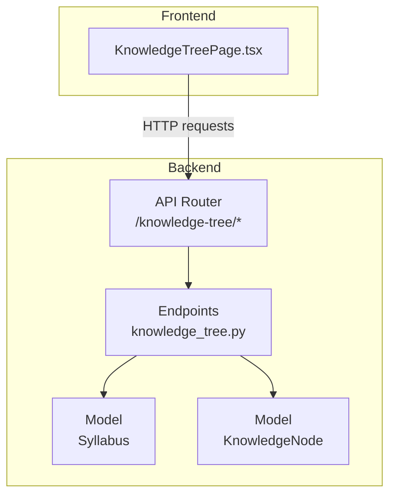
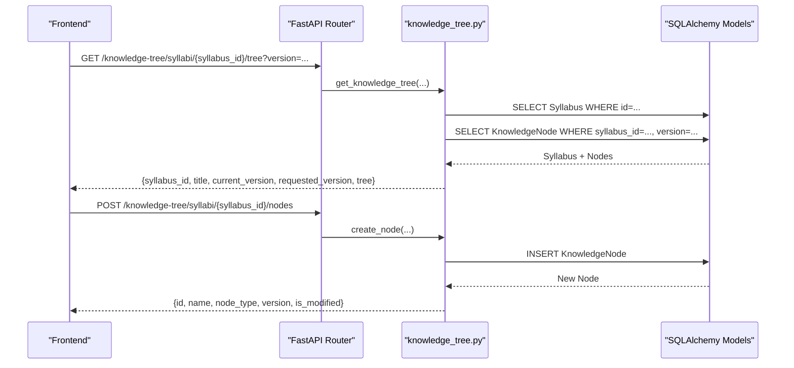
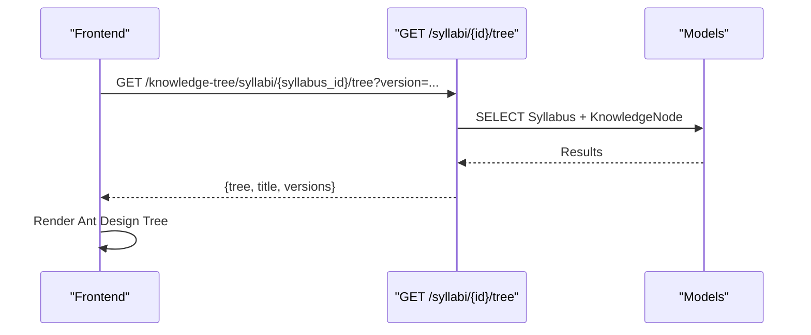
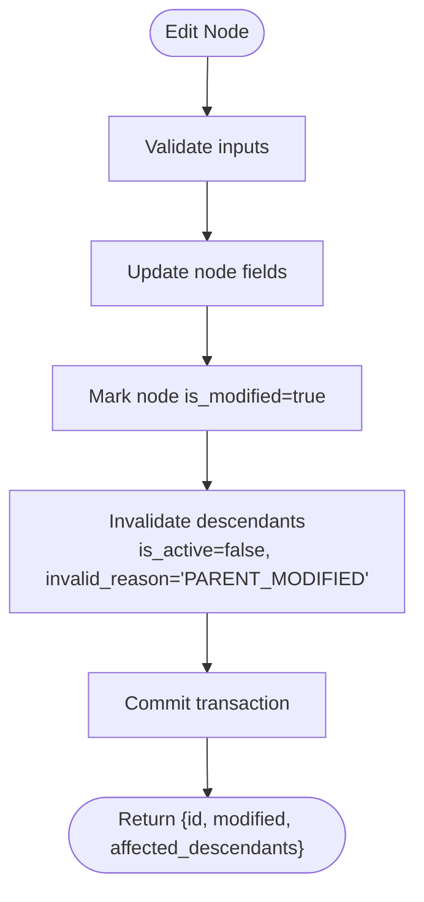
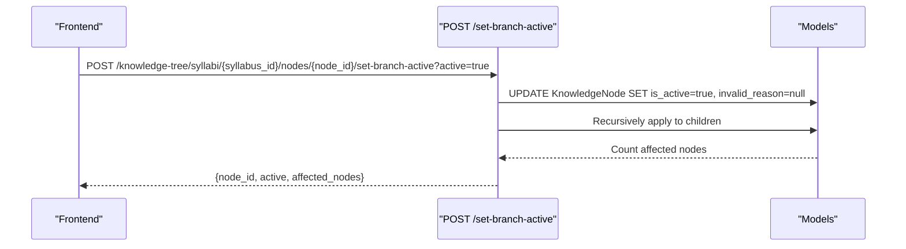
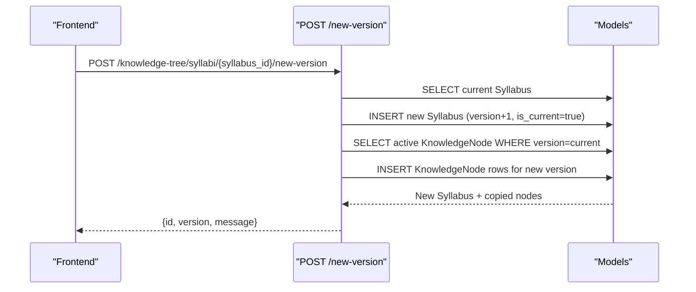
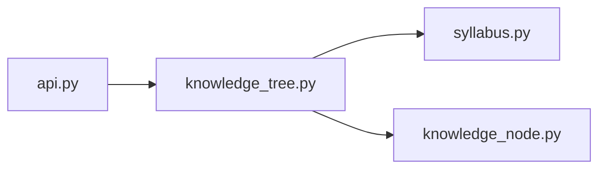
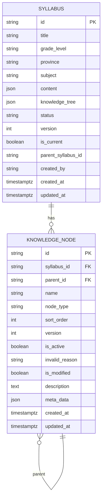

# Knowledge Tree API

<cite>
**Referenced Files in This Document**
- [knowledge_tree.py](file://backend/app/api/v1/endpoints/knowledge_tree.py)
- [syllabus.py](file://backend/app/models/syllabus.py)
- [knowledge_node.py](file://backend/app/models/knowledge_node.py)
- [KnowledgeTreePage.tsx](file://frontend/src/pages/admin/KnowledgeTreePage.tsx)
- [api.py](file://backend/app/api/v1/api.py)
- [requirements-v2.1.1.md](file://docs/requirements-v2.1.1.md)
- [database-design.md](file://nDocs/database-design.md)
- [smoke_test.py](file://backend/tests/smoke_test.py)
</cite>

## Table of Contents
1. [Introduction](#introduction)
2. [Project Structure](#project-structure)
3. [Core Components](#core-components)
4. [Architecture Overview](#architecture-overview)
5. [Detailed Component Analysis](#detailed-component-analysis)
6. [Dependency Analysis](#dependency-analysis)
7. [Performance Considerations](#performance-considerations)
8. [Troubleshooting Guide](#troubleshooting-guide)
9. [Conclusion](#conclusion)
10. [Appendices](#appendices)

## Introduction
This document provides comprehensive API documentation for the Knowledge Tree endpoints that power curriculum mapping, knowledge node management, syllabus organization, and content hierarchy. It covers HTTP methods, URL patterns under /knowledge-tree/, request/response schemas, parameter specifications for node relationships and curriculum alignment, and workflows for visualization, editing, and versioning. Practical examples and guidance for content validation and educational standards compliance are included.

## Project Structure
The Knowledge Tree API is implemented as part of the backend FastAPI application and integrated into the global API router. The frontend provides an administrative page to visualize and manage knowledge trees.

**Diagram sources**
- [api.py:14](file://backend/app/api/v1/api.py#L14)
- [knowledge_tree.py:13](file://backend/app/api/v1/endpoints/knowledge_tree.py#L13)
- [syllabus.py:9](file://backend/app/models/syllabus.py#L9)
- [knowledge_node.py:9](file://backend/app/models/knowledge_node.py#L9)
- [KnowledgeTreePage.tsx:54](file://frontend/src/pages/admin/KnowledgeTreePage.tsx#L54)

**Section sources**
- [api.py:14](file://backend/app/api/v1/api.py#L14)
- [knowledge_tree.py:13](file://backend/app/api/v1/endpoints/knowledge_tree.py#L13)

## Core Components
- Knowledge Tree Endpoints: Retrieve, create, update, delete nodes; activate/deactivate subtrees; create new versions; list versions; roll back to a historical version.
- Data Models:
  - Syllabus: Represents a curriculum with versioning and current-ness tracking.
  - KnowledgeNode: Represents hierarchical nodes (areas and points) linked to a syllabus and version.

Key capabilities:
- Curriculum mapping via hierarchical knowledge nodes aligned to syllabi.
- Content validation and educational standards compliance through controlled node types and state transitions.
- Versioning with branching and rollback to maintain traceability.

**Section sources**
- [knowledge_tree.py:37](file://backend/app/api/v1/endpoints/knowledge_tree.py#L37)
- [syllabus.py:9](file://backend/app/models/syllabus.py#L9)
- [knowledge_node.py:9](file://backend/app/models/knowledge_node.py#L9)

## Architecture Overview
The Knowledge Tree API follows a layered architecture:
- Router registration under /knowledge-tree/.
- Endpoint handlers performing CRUD operations on KnowledgeNode and Syllabus.
- SQLAlchemy ORM models for persistence.
- Frontend admin page consuming the endpoints to visualize and edit knowledge trees.

**Diagram sources**
- [knowledge_tree.py:37](file://backend/app/api/v1/endpoints/knowledge_tree.py#L37)
- [knowledge_tree.py:67](file://backend/app/api/v1/endpoints/knowledge_tree.py#L67)
- [syllabus.py:9](file://backend/app/models/syllabus.py#L9)
- [knowledge_node.py:9](file://backend/app/models/knowledge_node.py#L9)

## Detailed Component Analysis

### API Endpoints Overview
All endpoints are registered under /knowledge-tree/. Authentication requires a user with QUESTION_ADMIN or SYS_ADMIN roles.

- GET /syllabi/{syllabus_id}/tree
  - Purpose: Retrieve the knowledge tree for a syllabus version.
  - Query: version (optional).
  - Response: syllabus_id, title, current_version, requested_version, tree (nested structure).
  - Permissions: QUESTION_ADMIN or SYS_ADMIN.

- POST /syllabi/{syllabus_id}/nodes
  - Purpose: Create a new knowledge node.
  - Body Params: name, node_type (default POINT), parent_id (optional), sort_order (default 0).
  - Response: id, name, node_type, version, is_modified.
  - Permissions: QUESTION_ADMIN or SYS_ADMIN.

- PUT /syllabi/{syllabus_id}/nodes/{node_id}
  - Purpose: Update a node; triggers invalidation of descendants.
  - Query Params: name, description, sort_order (any or all optional).
  - Response: id, modified, affected_descendants.
  - Permissions: QUESTION_ADMIN or SYS_ADMIN.

- POST /syllabi/{syllabus_id}/nodes/{node_id}/set-branch-active
  - Purpose: Activate or deactivate an entire subtree.
  - Query Params: active (default true).
  - Response: node_id, active, affected_nodes.
  - Permissions: QUESTION_ADMIN or SYS_ADMIN.

- DELETE /syllabi/{syllabus_id}/nodes/{node_id}
  - Purpose: Soft-delete a node and its subtree (mark inactive).
  - Response: message indicating number of deleted/affected nodes.
  - Permissions: QUESTION_ADMIN or SYS_ADMIN.

- POST /syllabi/{syllabus_id}/new-version
  - Purpose: Create a new version by copying active nodes from the current version.
  - Response: id, version, message.
  - Permissions: QUESTION_ADMIN or SYS_ADMIN.

- PUT /syllabi/{syllabus_id}/rollback
  - Purpose: Roll back to a specific historical version in the chain.
  - Query Params: target_version.
  - Response: message, syllabus_id, version, is_current.
  - Permissions: QUESTION_ADMIN or SYS_ADMIN.

- GET /syllabi/{syllabus_id}/versions
  - Purpose: List all versions in the syllabus version chain.
  - Response: Array of {id, version, is_current}.
  - Permissions: QUESTION_ADMIN or SYS_ADMIN.

**Section sources**
- [knowledge_tree.py:37](file://backend/app/api/v1/endpoints/knowledge_tree.py#L37)
- [knowledge_tree.py:67](file://backend/app/api/v1/endpoints/knowledge_tree.py#L67)
- [knowledge_tree.py:97](file://backend/app/api/v1/endpoints/knowledge_tree.py#L97)
- [knowledge_tree.py:147](file://backend/app/api/v1/endpoints/knowledge_tree.py#L147)
- [knowledge_tree.py:180](file://backend/app/api/v1/endpoints/knowledge_tree.py#L180)
- [knowledge_tree.py:199](file://backend/app/api/v1/endpoints/knowledge_tree.py#L199)
- [knowledge_tree.py:253](file://backend/app/api/v1/endpoints/knowledge_tree.py#L253)
- [knowledge_tree.py:322](file://backend/app/api/v1/endpoints/knowledge_tree.py#L322)

### Request/Response Schemas

- GET /syllabi/{syllabus_id}/tree
  - Query:
    - version: integer (optional). If omitted, uses syllabus.version or 1.
  - Response:
    - syllabus_id: string (UUID)
    - title: string
    - current_version: integer
    - requested_version: integer
    - tree: array of nodes (see Node Schema below)

- Node Schema (used in tree response)
  - key: string (node id)
  - title: string (node name)
  - node_type: string ("AREA" or "POINT")
  - is_active: boolean
  - invalid_reason: string ("PARENT_MODIFIED" | "MANUAL" | "VERSION_CUT") or null
  - is_modified: boolean
  - sort_order: integer
  - description: string or null
  - children: array of Node
  - isLeaf: boolean (true when node_type is "POINT" and has no children)

- POST /syllabi/{syllabus_id}/nodes
  - Query Params:
    - name: string (required)
    - node_type: string ("AREA" or "POINT", default "POINT")
    - parent_id: string (UUID, optional)
    - sort_order: integer (default 0)
  - Response:
    - id: string (UUID)
    - name: string
    - node_type: string
    - version: integer
    - is_modified: boolean (always true for new nodes)

- PUT /syllabi/{syllabus_id}/nodes/{node_id}
  - Query Params:
    - name: string (optional)
    - description: string (optional)
    - sort_order: integer (optional)
  - Response:
    - id: string (UUID)
    - modified: boolean
    - affected_descendants: integer

- POST /syllabi/{syllabus_id}/nodes/{node_id}/set-branch-active
  - Query Params:
    - active: boolean (default true)
  - Response:
    - node_id: string (UUID)
    - active: boolean
    - affected_nodes: integer

- DELETE /syllabi/{syllabus_id}/nodes/{node_id}
  - Response:
    - message: string (informative)

- POST /syllabi/{syllabus_id}/new-version
  - Response:
    - id: string (UUID)
    - version: integer
    - message: string

- PUT /syllabi/{syllabus_id}/rollback
  - Query Params:
    - target_version: integer (required)
  - Response:
    - message: string
    - syllabus_id: string (UUID)
    - version: integer
    - is_current: boolean

- GET /syllabi/{syllabus_id}/versions
  - Response:
    - Array of {id: string, version: integer, is_current: boolean}

**Section sources**
- [knowledge_tree.py:37](file://backend/app/api/v1/endpoints/knowledge_tree.py#L37)
- [knowledge_tree.py:67](file://backend/app/api/v1/endpoints/knowledge_tree.py#L67)
- [knowledge_tree.py:97](file://backend/app/api/v1/endpoints/knowledge_tree.py#L97)
- [knowledge_tree.py:147](file://backend/app/api/v1/endpoints/knowledge_tree.py#L147)
- [knowledge_tree.py:180](file://backend/app/api/v1/endpoints/knowledge_tree.py#L180)
- [knowledge_tree.py:199](file://backend/app/api/v1/endpoints/knowledge_tree.py#L199)
- [knowledge_tree.py:253](file://backend/app/api/v1/endpoints/knowledge_tree.py#L253)
- [knowledge_tree.py:322](file://backend/app/api/v1/endpoints/knowledge_tree.py#L322)

### Parameter Specifications

- Node Relationships
  - parent_id: UUID of the parent node; null for root nodes.
  - sort_order: integer used for ordering within siblings.
  - node_type: "AREA" (container) or "POINT" (leaf).

- Curriculum Alignment
  - Syllabus fields include title, grade_level, province, subject, content (JSON), knowledge_tree (JSON), status, version, is_current, parent_syllabus_id.
  - KnowledgeNode fields include syllabus_id, parent_id, name, node_type, sort_order, version, is_active, invalid_reason, is_modified, description, meta_data (JSON).

- Prerequisite Mappings and Skill Hierarchies
  - Hierarchical relationships are enforced by parent_id and sort_order.
  - Activation/inactivation cascades via invalid_reason and is_active.

- Educational Standards Compliance
  - Controlled node_type values ("AREA", "POINT").
  - Validation of node updates and branch activation/deactivation.
  - Versioning ensures traceability and rollback capability.

**Section sources**
- [syllabus.py:9](file://backend/app/models/syllabus.py#L9)
- [knowledge_node.py:9](file://backend/app/models/knowledge_node.py#L9)
- [requirements-v2.1.1.md:34](file://docs/requirements-v2.1.1.md#L34)

### Workflows

#### Knowledge Tree Visualization
- Load syllabi and versions.
- Fetch tree for selected syllabus and version.
- Render nested tree with icons and status badges.
- Expand/collapse and select nodes to view details.

**Diagram sources**
- [KnowledgeTreePage.tsx:54](file://frontend/src/pages/admin/KnowledgeTreePage.tsx#L54)
- [knowledge_tree.py:37](file://backend/app/api/v1/endpoints/knowledge_tree.py#L37)

#### Node Editing Workflow
- Add node: POST /syllabi/{syllabus_id}/nodes with name, node_type, parent_id, sort_order.
- Edit node: PUT /syllabi/{syllabus_id}/nodes/{node_id} with optional name/description/sort_order.
- On edit, descendants become inactive with invalid_reason "PARENT_MODIFIED".

**Diagram sources**
- [knowledge_tree.py:97](file://backend/app/api/v1/endpoints/knowledge_tree.py#L97)
- [knowledge_tree.py:131](file://backend/app/api/v1/endpoints/knowledge_tree.py#L131)

#### Branch Activation/Deactivation
- POST /syllabi/{syllabus_id}/nodes/{node_id}/set-branch-active with active flag.
- Recursively sets is_active and clears invalid_reason for active nodes.

**Diagram sources**
- [knowledge_tree.py:147](file://backend/app/api/v1/endpoints/knowledge_tree.py#L147)
- [knowledge_tree.py:162](file://backend/app/api/v1/endpoints/knowledge_tree.py#L162)

#### Versioning and Rollback
- Create new version: POST /syllabi/{syllabus_id}/new-version copies active nodes to new version.
- List versions: GET /syllabi/{syllabus_id}/versions returns version chain.
- Rollback: PUT /syllabi/{syllabus_id}/rollback sets target version as current.

**Diagram sources**
- [knowledge_tree.py:199](file://backend/app/api/v1/endpoints/knowledge_tree.py#L199)

### Practical Examples

- Create a Root Node
  - Method: POST
  - Path: /knowledge-tree/syllabi/{syllabus_id}/nodes
  - Query Params: name="Algebra Basics", node_type="AREA", sort_order=0
  - Expected Response: {id, name, node_type, version, is_modified}

- Update a Node and Invalidate Descendants
  - Method: PUT
  - Path: /knowledge-tree/syllabi/{syllabus_id}/nodes/{node_id}
  - Query Params: name="Updated Name", description="...", sort_order=1
  - Expected Response: {id, modified: true, affected_descendants: N}

- Activate a Subtree
  - Method: POST
  - Path: /knowledge-tree/syllabi/{syllabus_id}/nodes/{node_id}/set-branch-active
  - Query Params: active=true
  - Expected Response: {node_id, active: true, affected_nodes: N}

- Create a New Version
  - Method: POST
  - Path: /knowledge-tree/syllabi/{syllabus_id}/new-version
  - Expected Response: {id, version, message}

- List Versions
  - Method: GET
  - Path: /knowledge-tree/syllabi/{syllabus_id}/versions
  - Expected Response: [{id, version, is_current}, ...]

- Rollback to Target Version
  - Method: PUT
  - Path: /knowledge-tree/syllabi/{syllabus_id}/rollback
  - Query Params: target_version=2
  - Expected Response: {message, syllabus_id, version, is_current}

**Section sources**
- [knowledge_tree.py:67](file://backend/app/api/v1/endpoints/knowledge_tree.py#L67)
- [knowledge_tree.py:97](file://backend/app/api/v1/endpoints/knowledge_tree.py#L97)
- [knowledge_tree.py:147](file://backend/app/api/v1/endpoints/knowledge_tree.py#L147)
- [knowledge_tree.py:199](file://backend/app/api/v1/endpoints/knowledge_tree.py#L199)
- [knowledge_tree.py:322](file://backend/app/api/v1/endpoints/knowledge_tree.py#L322)
- [knowledge_tree.py:253](file://backend/app/api/v1/endpoints/knowledge_tree.py#L253)

## Dependency Analysis
- Router Registration: The knowledge_tree router is included under /knowledge-tree in the global API router.
- Endpoint Dependencies: Endpoints depend on database sessions and current user authentication.
- Model Dependencies: Endpoints operate on Syllabus and KnowledgeNode models.

**Diagram sources**
- [api.py:14](file://backend/app/api/v1/api.py#L14)
- [knowledge_tree.py:8](file://backend/app/api/v1/endpoints/knowledge_tree.py#L8)
- [knowledge_tree.py:9](file://backend/app/api/v1/endpoints/knowledge_tree.py#L9)

**Section sources**
- [api.py:14](file://backend/app/api/v1/api.py#L14)
- [knowledge_tree.py:8](file://backend/app/api/v1/endpoints/knowledge_tree.py#L8)
- [knowledge_tree.py:9](file://backend/app/api/v1/endpoints/knowledge_tree.py#L9)

## Performance Considerations
- Indexes: knowledge_nodes has indexes on syllabus_id/version and parent_id to support efficient tree queries and updates.
- Cascading Updates: Descendant invalidation is recursive; keep tree depth reasonable to minimize traversal cost.
- Sorting: Nodes are ordered by sort_order and name to ensure deterministic rendering.

**Section sources**
- [database-design.md:151](file://nDocs/database-design.md#L151)

## Troubleshooting Guide
- 404 Not Found
  - Occurs when syllabus or node does not exist.
  - Verify syllabus_id and node_id.

- 403 Forbidden
  - Requires QUESTION_ADMIN or SYS_ADMIN role.
  - Ensure the authenticated user has the correct role.

- Node Invalidation Behavior
  - After editing a node, descendants become inactive with invalid_reason "PARENT_MODIFIED".
  - Use "Branch all active" to reactivate subtrees.

- Versioning
  - New version copies only active nodes from the current version.
  - Rollback sets target version as current and marks others not current.

**Section sources**
- [knowledge_tree.py:46](file://backend/app/api/v1/endpoints/knowledge_tree.py#L46)
- [knowledge_tree.py:111](file://backend/app/api/v1/endpoints/knowledge_tree.py#L111)
- [knowledge_tree.py:154](file://backend/app/api/v1/endpoints/knowledge_tree.py#L154)
- [knowledge_tree.py:299](file://backend/app/api/v1/endpoints/knowledge_tree.py#L299)

## Conclusion
The Knowledge Tree API provides robust support for curriculum mapping and content organization with hierarchical nodes, versioning, and traceable state transitions. The documented endpoints, schemas, and workflows enable administrators to build, visualize, edit, and maintain knowledge trees aligned with educational standards and syllabi.

## Appendices

### Data Models Overview

**Diagram sources**
- [syllabus.py:9](file://backend/app/models/syllabus.py#L9)
- [knowledge_node.py:9](file://backend/app/models/knowledge_node.py#L9)

### Example Test Cases
- Smoke tests exercise key Knowledge Tree operations including branch activation and version creation.

**Section sources**
- [smoke_test.py:154](file://backend/tests/smoke_test.py#L154)