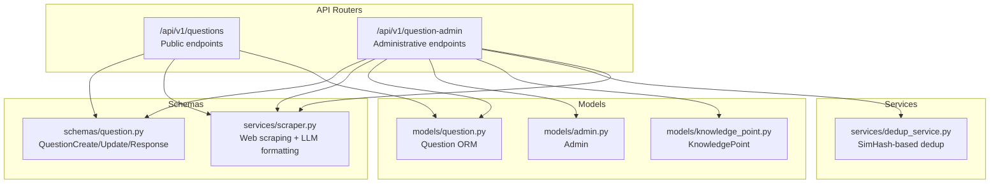
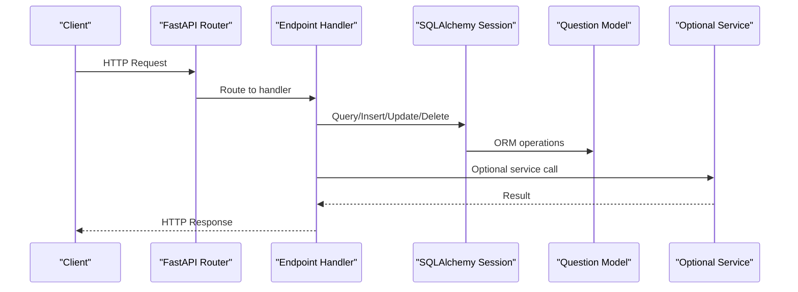
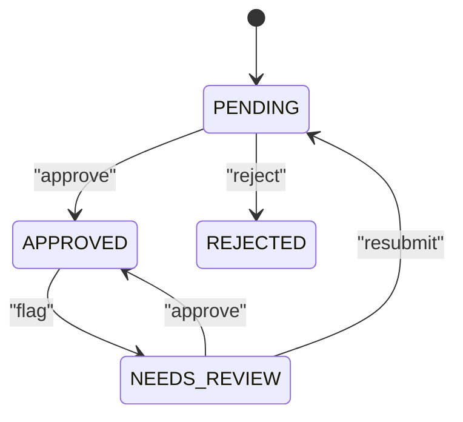
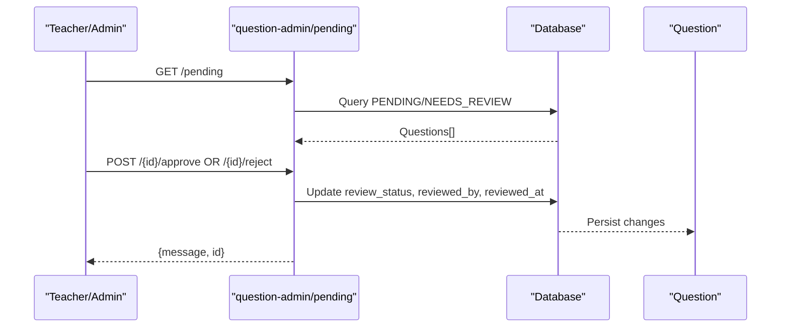
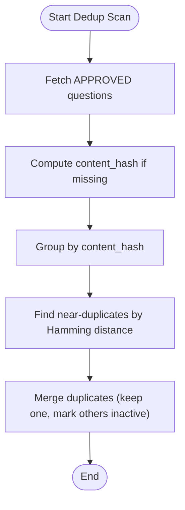
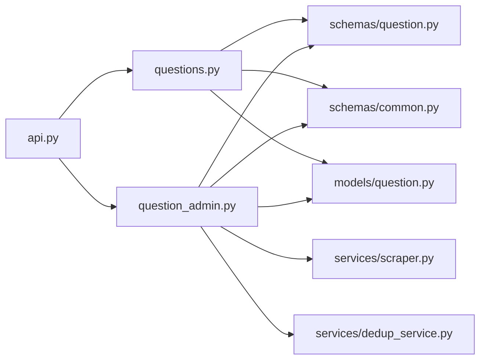

# Question Management API

<cite>
**Referenced Files in This Document**
- [backend/app/api/v1/api.py](file://backend/app/api/v1/api.py)
- [backend/app/api/v1/endpoints/questions.py](file://backend/app/api/v1/endpoints/questions.py)
- [backend/app/api/v1/endpoints/question_admin.py](file://backend/app/api/v1/endpoints/question_admin.py)
- [backend/app/schemas/question.py](file://backend/app/schemas/question.py)
- [backend/app/schemas/common.py](file://backend/app/schemas/common.py)
- [backend/app/models/question.py](file://backend/app/models/question.py)
- [backend/app/models/admin.py](file://backend/app/models/admin.py)
- [backend/app/models/knowledge_point.py](file://backend/app/models/knowledge_point.py)
- [backend/app/services/dedup_service.py](file://backend/app/services/dedup_service.py)
- [backend/app/services/scraper.py](file://backend/app/services/scraper.py)
</cite>

## Table of Contents
1. [Introduction](#introduction)
2. [Project Structure](#project-structure)
3. [Core Components](#core-components)
4. [Architecture Overview](#architecture-overview)
5. [Detailed Component Analysis](#detailed-component-analysis)
6. [Dependency Analysis](#dependency-analysis)
7. [Performance Considerations](#performance-considerations)
8. [Troubleshooting Guide](#troubleshooting-guide)
9. [Conclusion](#conclusion)
10. [Appendices](#appendices)

## Introduction
This document provides comprehensive API documentation for the Question Management system. It covers question CRUD operations, batch import/export, review workflows, and knowledge point mapping. It documents HTTP methods, URL patterns under /questions/ and /question-admin/, request/response schemas, parameter specifications for question types, difficulty levels, subject associations, and knowledge node relationships. It also describes batch operations for question import/export, review and approval workflows, status management, and quality control processes. Practical examples are included via code snippet paths, and validation rules, duplicate detection, and moderation requirements are addressed.

## Project Structure
The Question Management API is organized into routers and endpoints grouped by feature:
- Public question endpoints: /api/v1/questions
- Administrative question endpoints: /api/v1/question-admin
- Shared schemas and models define request/response contracts and database structures
- Services implement advanced features like deduplication and web scraping

**Diagram sources**
- [backend/app/api/v1/api.py:12-13](file://backend/app/api/v1/api.py#L12-L13)
- [backend/app/api/v1/endpoints/questions.py:1-431](file://backend/app/api/v1/endpoints/questions.py#L1-L431)
- [backend/app/api/v1/endpoints/question_admin.py:1-837](file://backend/app/api/v1/endpoints/question_admin.py#L1-L837)
- [backend/app/schemas/question.py:1-75](file://backend/app/schemas/question.py#L1-L75)
- [backend/app/schemas/common.py:1-87](file://backend/app/schemas/common.py#L1-L87)
- [backend/app/models/question.py:1-46](file://backend/app/models/question.py#L1-L46)
- [backend/app/models/admin.py:1-27](file://backend/app/models/admin.py#L1-L27)
- [backend/app/models/knowledge_point.py:1-27](file://backend/app/models/knowledge_point.py#L1-L27)
- [backend/app/services/dedup_service.py:1-127](file://backend/app/services/dedup_service.py#L1-L127)
- [backend/app/services/scraper.py:1-272](file://backend/app/services/scraper.py#L1-L272)

**Section sources**
- [backend/app/api/v1/api.py:1-26](file://backend/app/api/v1/api.py#L1-L26)

## Core Components
- Question CRUD and search under /questions
- Batch import/export under /questions
- Administrative workflows under /question-admin: syllabus, LLM generation, scraping, approvals, dedup, OCR paper import
- Schemas enforce question type, difficulty, scoring, and correct answer formats
- Models define database structure, indexes, and constraints
- Services implement deduplication and web scraping

**Section sources**
- [backend/app/api/v1/endpoints/questions.py:17-431](file://backend/app/api/v1/endpoints/questions.py#L17-L431)
- [backend/app/api/v1/endpoints/question_admin.py:1-837](file://backend/app/api/v1/endpoints/question_admin.py#L1-L837)
- [backend/app/schemas/question.py:10-75](file://backend/app/schemas/question.py#L10-L75)
- [backend/app/models/question.py:10-46](file://backend/app/models/question.py#L10-L46)

## Architecture Overview
The API follows a layered architecture:
- Routers expose endpoints grouped by domain (/questions, /question-admin)
- Schemas validate and normalize request payloads
- Endpoints orchestrate database operations and service integrations
- Models define persistence and constraints
- Services encapsulate advanced logic (LLM, scraping, dedup)

[No sources needed since this diagram shows conceptual workflow, not actual code structure]

## Detailed Component Analysis

### Public Question Endpoints (/questions)
- Base URL: /api/v1/questions
- Authentication: Requires authenticated user; role-based restrictions apply
- Authorization:
  - Teachers, Question Admins, and Sys Admins can create/update/delete
  - Search and listing respect teacher subject visibility

Endpoints:
- POST / (create)
  - Path: [backend/app/api/v1/endpoints/questions.py:17-36](file://backend/app/api/v1/endpoints/questions.py#L17-L36)
  - Request: QuestionCreate schema
  - Response: QuestionResponse
  - Notes: Automatically sets source and review_status; records created_by

- GET / (list with filters)
  - Path: [backend/app/api/v1/endpoints/questions.py:366-431](file://backend/app/api/v1/endpoints/questions.py#L366-L431)
  - Filters: subject, grade_level, grade, scope, source, question_type, difficulty, review_status, keyword
  - Pagination: skip, limit (max 200)
  - Response: { items: QuestionResponse[], total: number }

- GET /search (advanced search)
  - Path: [backend/app/api/v1/endpoints/questions.py:39-104](file://backend/app/api/v1/endpoints/questions.py#L39-L104)
  - Filters: subject, grade_level, grade, scope, source, question_type, difficulty, keyword, knowledge_point
  - Response: { items: QuestionResponse[], total: number }

- GET /{question_id} (retrieve)
  - Path: [backend/app/api/v1/endpoints/questions.py:276-289](file://backend/app/api/v1/endpoints/questions.py#L276-L289)

- PUT /{question_id} (update)
  - Path: [backend/app/api/v1/endpoints/questions.py:292-328](file://backend/app/api/v1/endpoints/questions.py#L292-L328)
  - Restrictions: creator or Sys Admin

- DELETE /{question_id} (delete)
  - Path: [backend/app/api/v1/endpoints/questions.py:331-347](file://backend/app/api/v1/endpoints/questions.py#L331-L347)

- POST /batch-import (bulk create from JSON array)
  - Path: [backend/app/api/v1/endpoints/questions.py:127-155](file://backend/app/api/v1/endpoints/questions.py#L127-L155)
  - Limit: up to 200 items per request

- POST /export (export selected by IDs)
  - Path: [backend/app/api/v1/endpoints/questions.py:158-168](file://backend/app/api/v1/endpoints/questions.py#L158-L168)

- GET /export (filtered export)
  - Path: [backend/app/api/v1/endpoints/questions.py:171-214](file://backend/app/api/v1/endpoints/questions.py#L171-L214)
  - Limit: up to 200; respects export_max from config

- POST /deduplicate (placeholder)
  - Path: [backend/app/api/v1/endpoints/questions.py:217-226](file://backend/app/api/v1/endpoints/questions.py#L217-L226)

- GET /typical (list typical questions)
  - Path: [backend/app/api/v1/endpoints/questions.py:227-254](file://backend/app/api/v1/endpoints/questions.py#L227-L254)

- PUT /{question_id}/typical (toggle typical)
  - Path: [backend/app/api/v1/endpoints/questions.py:257-273](file://backend/app/api/v1/endpoints/questions.py#L257-L273)

- GET /tags, GET /knowledge-points (placeholders)
  - Paths: [backend/app/api/v1/endpoints/questions.py:107-124](file://backend/app/api/v1/endpoints/questions.py#L107-L124)

Request/Response Schemas:
- QuestionCreate: [backend/app/schemas/question.py:33-36](file://backend/app/schemas/question.py#L33-L36)
- QuestionUpdate: [backend/app/schemas/question.py:38-61](file://backend/app/schemas/question.py#L38-L61)
- QuestionResponse: [backend/app/schemas/question.py:64-75](file://backend/app/schemas/question.py#L64-L75)
- Common structures:
  - GradeLevel: [backend/app/schemas/common.py:23-44](file://backend/app/schemas/common.py#L23-L44)
  - CorrectAnswerUnion and variants: [backend/app/schemas/common.py:51-86](file://backend/app/schemas/common.py#L51-L86)

Database Model:
- Question: [backend/app/models/question.py:10-46](file://backend/app/models/question.py#L10-L46)

Authorization and Visibility:
- Teachers can only see questions in their subject list (stored in Admin.subjects)
- Paths: [backend/app/api/v1/endpoints/questions.py:59-66](file://backend/app/api/v1/endpoints/questions.py#L59-L66), [backend/app/models/admin.py](file://backend/app/models/admin.py#L20)

Validation Rules:
- Question type and difficulty enums enforced in schemas and models
- Score must be positive
- Correct answer must be valid JSON when provided as string
- Paths: [backend/app/schemas/question.py:15-16](file://backend/app/schemas/question.py#L15-L16), [backend/app/schemas/question.py:22-30](file://backend/app/schemas/question.py#L22-L30), [backend/app/models/question.py:40-42](file://backend/app/models/question.py#L40-L42)

Practical Examples (paths only):
- Create single-choice question: [backend/app/api/v1/endpoints/questions.py:17-36](file://backend/app/api/v1/endpoints/questions.py#L17-L36)
- Bulk import questions: [backend/app/api/v1/endpoints/questions.py:127-155](file://backend/app/api/v1/endpoints/questions.py#L127-L155)
- Export filtered questions: [backend/app/api/v1/endpoints/questions.py:171-214](file://backend/app/api/v1/endpoints/questions.py#L171-L214)

**Section sources**
- [backend/app/api/v1/endpoints/questions.py:17-431](file://backend/app/api/v1/endpoints/questions.py#L17-L431)
- [backend/app/schemas/question.py:10-75](file://backend/app/schemas/question.py#L10-L75)
- [backend/app/schemas/common.py:23-86](file://backend/app/schemas/common.py#L23-L86)
- [backend/app/models/question.py:10-46](file://backend/app/models/question.py#L10-L46)
- [backend/app/models/admin.py:9-27](file://backend/app/models/admin.py#L9-L27)

### Administrative Question Endpoints (/question-admin)
- Base URL: /api/v1/question-admin
- Access: Question Admin, Sys Admin, and optionally Teachers for approvals

Key Workflows:
- Syllabus management
  - POST /syllabi: create syllabus
  - GET /syllabi: list syllabi
  - GET /syllabi/{syllabus_id}: get syllabus
  - PUT /syllabi/{syllabus_id}: update syllabus
  - POST /syllabi/{syllabus_id}/extract-knowledge: mock LLM knowledge extraction
  - Paths: [backend/app/api/v1/endpoints/question_admin.py:23-123](file://backend/app/api/v1/endpoints/question_admin.py#L23-L123)

- LLM question generation
  - POST /generate: generate questions via LLM, save as PENDING
  - Paths: [backend/app/api/v1/endpoints/question_admin.py:138-218](file://backend/app/api/v1/endpoints/question_admin.py#L138-L218)

- Web scraping
  - POST /scrape: search + scrape + LLM formatting, save as PENDING
  - Paths: [backend/app/api/v1/endpoints/question_admin.py:417-474](file://backend/app/api/v1/endpoints/question_admin.py#L417-L474), [backend/app/services/scraper.py:11-163](file://backend/app/services/scraper.py#L11-L163)

- Review and approval
  - GET /pending: list pending/needs_review questions
  - POST /{question_id}/approve: approve
  - POST /{question_id}/reject: reject
  - POST /batch-approve: batch approve
  - POST /batch-reject: batch reject
  - GET /stats: review statistics
  - Paths: [backend/app/api/v1/endpoints/question_admin.py:222-412](file://backend/app/api/v1/endpoints/question_admin.py#L222-L412)

- Deduplication
  - POST /deduplicate: simple title-based grouping
  - POST /dedup: SimHash-based dedup with content hashing
  - POST /dedup/merge: merge duplicates (mark others inactive)
  - Paths: [backend/app/api/v1/endpoints/question_admin.py:500-529](file://backend/app/api/v1/endpoints/question_admin.py#L500-L529), [backend/app/api/v1/endpoints/question_admin.py:730-836](file://backend/app/api/v1/endpoints/question_admin.py#L730-L836), [backend/app/services/dedup_service.py:63-127](file://backend/app/services/dedup_service.py#L63-L127)

- OCR paper import
  - POST /import-paper: upload image, call LLM vision to extract questions
  - POST /import-confirm: confirm and save recognized questions as PENDING
  - Paths: [backend/app/api/v1/endpoints/question_admin.py:561-727](file://backend/app/api/v1/endpoints/question_admin.py#L561-L727)

Review Status Lifecycle:

**Diagram sources**
- [backend/app/api/v1/endpoints/question_admin.py:222-323](file://backend/app/api/v1/endpoints/question_admin.py#L222-L323)
- [backend/app/models/question.py:24-26](file://backend/app/models/question.py#L24-L26)

**Section sources**
- [backend/app/api/v1/endpoints/question_admin.py:1-837](file://backend/app/api/v1/endpoints/question_admin.py#L1-L837)
- [backend/app/services/scraper.py:1-272](file://backend/app/services/scraper.py#L1-L272)
- [backend/app/services/dedup_service.py:1-127](file://backend/app/services/dedup_service.py#L1-L127)
- [backend/app/models/question.py:10-46](file://backend/app/models/question.py#L10-L46)

### Knowledge Point Mapping
- Knowledge points are stored in Question.meta_data.knowledge_points as a list
- Syllabus knowledge trees can be extracted and associated
- KnowledgePoint model supports hierarchical knowledge nodes

Paths:
- Knowledge points in Question: [backend/app/models/question.py](file://backend/app/models/question.py#L22)
- KnowledgePoint model: [backend/app/models/knowledge_point.py:7-27](file://backend/app/models/knowledge_point.py#L7-L27)
- Syllabus knowledge extraction: [backend/app/api/v1/endpoints/question_admin.py:85-123](file://backend/app/api/v1/endpoints/question_admin.py#L85-L123)

**Section sources**
- [backend/app/models/question.py](file://backend/app/models/question.py#L22)
- [backend/app/models/knowledge_point.py:7-27](file://backend/app/models/knowledge_point.py#L7-L27)
- [backend/app/api/v1/endpoints/question_admin.py:85-123](file://backend/app/api/v1/endpoints/question_admin.py#L85-L123)

### Batch Operations: Import/Export
- Import
  - POST /questions/batch-import: JSON array of question objects
  - POST /question-admin/import-paper: OCR-based recognition pipeline
  - POST /question-admin/import-confirm: confirm and persist recognized questions
  - Paths: [backend/app/api/v1/endpoints/questions.py:127-155](file://backend/app/api/v1/endpoints/questions.py#L127-L155), [backend/app/api/v1/endpoints/question_admin.py:561-727](file://backend/app/api/v1/endpoints/question_admin.py#L561-L727)

- Export
  - POST /questions/export: export selected IDs
  - GET /questions/export: export filtered by criteria (max 200)
  - Paths: [backend/app/api/v1/endpoints/questions.py:158-214](file://backend/app/api/v1/endpoints/questions.py#L158-L214)

**Section sources**
- [backend/app/api/v1/endpoints/questions.py:127-214](file://backend/app/api/v1/endpoints/questions.py#L127-L214)
- [backend/app/api/v1/endpoints/question_admin.py:561-727](file://backend/app/api/v1/endpoints/question_admin.py#L561-L727)

### Review and Approval Workflows
- Pending/Needs Review questions are visible to Question Admins, Sys Admins, and Teachers
- Approve/reject endpoints update review_status, reviewed_by, and reviewed_at
- Batch operations support mass actions
- Stats endpoint aggregates counts by status, type, difficulty, and source

**Diagram sources**
- [backend/app/api/v1/endpoints/question_admin.py:222-323](file://backend/app/api/v1/endpoints/question_admin.py#L222-L323)

**Section sources**
- [backend/app/api/v1/endpoints/question_admin.py:222-412](file://backend/app/api/v1/endpoints/question_admin.py#L222-L412)

### Duplicate Detection and Quality Control
- Simple grouping by truncated title for quick scanning
- Advanced SimHash-based dedup with configurable threshold
- Merge operation marks duplicates as inactive and records metadata

**Diagram sources**
- [backend/app/api/v1/endpoints/question_admin.py:730-836](file://backend/app/api/v1/endpoints/question_admin.py#L730-L836)
- [backend/app/services/dedup_service.py:63-127](file://backend/app/services/dedup_service.py#L63-L127)

**Section sources**
- [backend/app/api/v1/endpoints/question_admin.py:500-529](file://backend/app/api/v1/endpoints/question_admin.py#L500-L529)
- [backend/app/api/v1/endpoints/question_admin.py:730-836](file://backend/app/api/v1/endpoints/question_admin.py#L730-L836)
- [backend/app/services/dedup_service.py:1-127](file://backend/app/services/dedup_service.py#L1-L127)

## Dependency Analysis
- Routers registration: [backend/app/api/v1/api.py:12-13](file://backend/app/api/v1/api.py#L12-L13)
- Endpoints depend on schemas for validation and models for persistence
- Administrative endpoints depend on services for LLM, scraping, and dedup
- Teacher subject visibility depends on Admin.subjects

**Diagram sources**
- [backend/app/api/v1/api.py:6-13](file://backend/app/api/v1/api.py#L6-L13)
- [backend/app/api/v1/endpoints/questions.py:1-431](file://backend/app/api/v1/endpoints/questions.py#L1-L431)
- [backend/app/api/v1/endpoints/question_admin.py:1-837](file://backend/app/api/v1/endpoints/question_admin.py#L1-L837)
- [backend/app/schemas/question.py:1-75](file://backend/app/schemas/question.py#L1-L75)
- [backend/app/schemas/common.py:1-87](file://backend/app/schemas/common.py#L1-L87)
- [backend/app/models/question.py:1-46](file://backend/app/models/question.py#L1-L46)
- [backend/app/services/scraper.py:1-272](file://backend/app/services/scraper.py#L1-L272)
- [backend/app/services/dedup_service.py:1-127](file://backend/app/services/dedup_service.py#L1-L127)

**Section sources**
- [backend/app/api/v1/api.py:6-13](file://backend/app/api/v1/api.py#L6-L13)

## Performance Considerations
- Pagination limits: most endpoints cap limit to 200 to prevent heavy queries
- Teacher subject filtering reduces dataset size for non-admin users
- Export max configurable via system config (export_max)
- Dedup uses SimHash for scalable near-duplicate detection
- Scraper and LLM calls are asynchronous and bounded by timeouts

[No sources needed since this section provides general guidance]

## Troubleshooting Guide
- Permission errors (403): Ensure user role includes TEACHER, QUESTION_ADMIN, or SYS_ADMIN as required
  - Paths: [backend/app/api/v1/endpoints/questions.py:23-24](file://backend/app/api/v1/endpoints/questions.py#L23-L24), [backend/app/api/v1/endpoints/questions.py:299-303](file://backend/app/api/v1/endpoints/questions.py#L299-L303), [backend/app/api/v1/endpoints/question_admin.py:234-235](file://backend/app/api/v1/endpoints/question_admin.py#L234-L235), [backend/app/api/v1/endpoints/question_admin.py:274-275](file://backend/app/api/v1/endpoints/question_admin.py#L274-L275)

- Not found errors (404): Question ID does not exist
  - Paths: [backend/app/api/v1/endpoints/questions.py:308-311](file://backend/app/api/v1/endpoints/questions.py#L308-L311), [backend/app/api/v1/endpoints/questions.py:340-343](file://backend/app/api/v1/endpoints/questions.py#L340-L343), [backend/app/api/v1/endpoints/question_admin.py:276-279](file://backend/app/api/v1/endpoints/question_admin.py#L276-L279), [backend/app/api/v1/endpoints/question_admin.py:289-298](file://backend/app/api/v1/endpoints/question_admin.py#L289-L298)

- Validation errors: correct_answer must be valid JSON when provided as string
  - Paths: [backend/app/schemas/question.py:22-30](file://backend/app/schemas/question.py#L22-L30), [backend/app/schemas/question.py:53-61](file://backend/app/schemas/question.py#L53-L61)

- Export disabled: export_max is zero or negative
  - Paths: [backend/app/api/v1/endpoints/questions.py:184-188](file://backend/app/api/v1/endpoints/questions.py#L184-L188)

**Section sources**
- [backend/app/api/v1/endpoints/questions.py:23-36](file://backend/app/api/v1/endpoints/questions.py#L23-L36)
- [backend/app/api/v1/endpoints/questions.py:299-347](file://backend/app/api/v1/endpoints/questions.py#L299-L347)
- [backend/app/api/v1/endpoints/question_admin.py:222-323](file://backend/app/api/v1/endpoints/question_admin.py#L222-L323)
- [backend/app/schemas/question.py:22-61](file://backend/app/schemas/question.py#L22-L61)
- [backend/app/api/v1/endpoints/questions.py:184-188](file://backend/app/api/v1/endpoints/questions.py#L184-L188)

## Conclusion
The Question Management API provides robust public and administrative capabilities for question lifecycle management. It enforces strong validation, supports flexible search and filtering, offers batch operations, and integrates moderation and quality control features. Administrators can leverage LLM generation, web scraping, OCR, and deduplication to maintain a high-quality question bank.

[No sources needed since this section summarizes without analyzing specific files]

## Appendices

### API Reference Summary

- Base URLs
  - Public: /api/v1/questions
  - Admin: /api/v1/question-admin

- Public Endpoints
  - POST /: Create question
  - GET /: List questions with filters
  - GET /search: Advanced search
  - GET /{id}: Retrieve question
  - PUT /{id}: Update question
  - DELETE /{id}: Delete question
  - POST /batch-import: Import JSON array
  - POST /export: Export selected by IDs
  - GET /export: Export filtered
  - POST /deduplicate: Placeholder
  - GET /typical: List typical questions
  - PUT /{id}/typical: Toggle typical
  - GET /tags, GET /knowledge-points: Placeholders

- Admin Endpoints
  - /syllabi: CRUD + knowledge extraction
  - /generate: LLM generation
  - /scrape: Web scraping + LLM formatting
  - /pending: List pending
  - /{id}/approve, /{id}/reject: Approve/reject
  - /batch-approve, /batch-reject: Batch actions
  - /stats: Review stats
  - /import-paper, /import-confirm: OCR paper import
  - /deduplicate, /dedup, /dedup/merge: Dedup workflows

**Section sources**
- [backend/app/api/v1/endpoints/questions.py:17-431](file://backend/app/api/v1/endpoints/questions.py#L17-L431)
- [backend/app/api/v1/endpoints/question_admin.py:1-837](file://backend/app/api/v1/endpoints/question_admin.py#L1-L837)