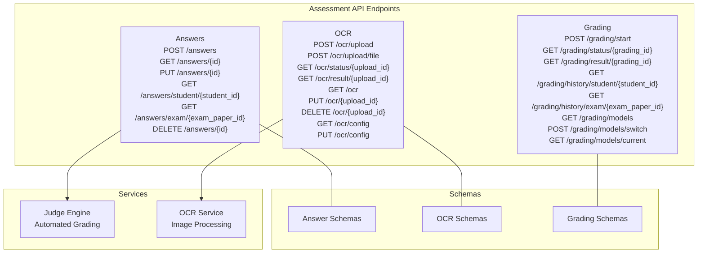
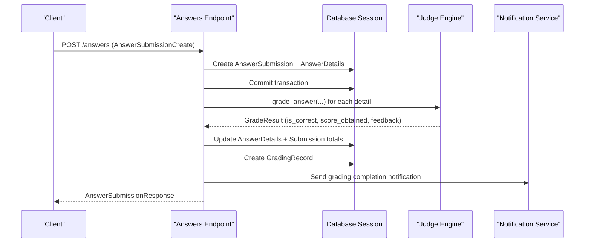
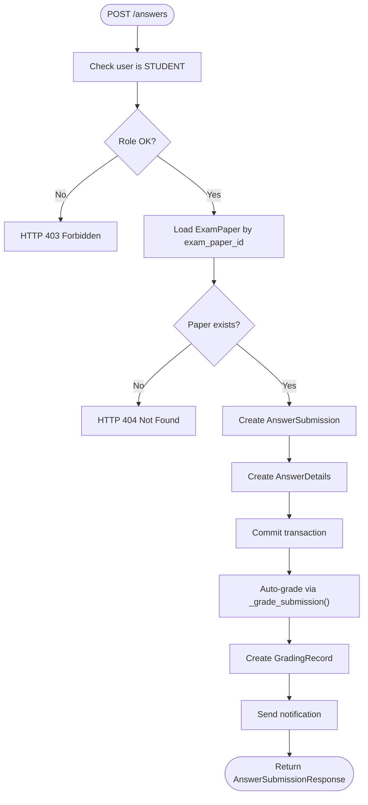
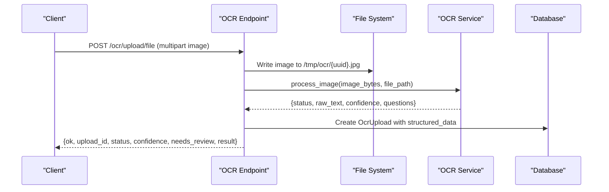
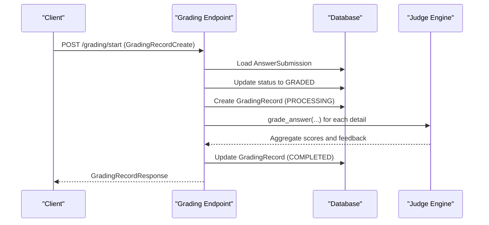
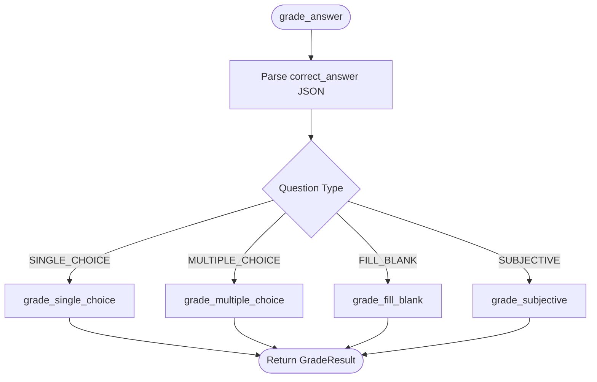
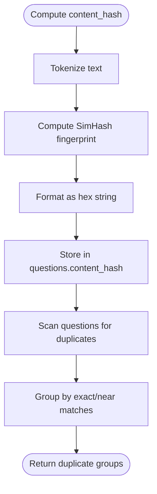
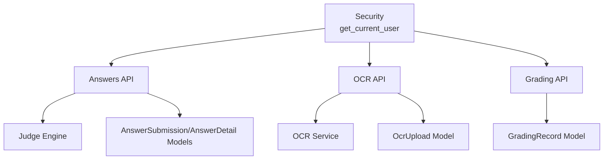

# Student Assessment API

<cite>
**Referenced Files in This Document**
- [answers.py](file://backend/app/api/v1/endpoints/answers.py)
- [ocr.py](file://backend/app/api/v1/endpoints/ocr.py)
- [grading.py](file://backend/app/api/v1/endpoints/grading.py)
- [answer.py](file://backend/app/schemas/answer.py)
- [ocr.py](file://backend/app/schemas/ocr.py)
- [grading.py](file://backend/app/schemas/grading.py)
- [answer_submission.py](file://backend/app/models/answer_submission.py)
- [answer_detail.py](file://backend/app/models/answer_detail.py)
- [ocr_upload.py](file://backend/app/models/ocr_upload.py)
- [grading_record.py](file://backend/app/models/grading_record.py)
- [judge_engine.py](file://backend/app/services/judge_engine.py)
- [ocr_service.py](file://backend/app/services/ocr_service.py)
- [security.py](file://backend/app/core/security.py)
- [dedup_service.py](file://backend/app/services/dedup_service.py)
</cite>

## Table of Contents
1. [Introduction](#introduction)
2. [Project Structure](#project-structure)
3. [Core Components](#core-components)
4. [Architecture Overview](#architecture-overview)
5. [Detailed Component Analysis](#detailed-component-analysis)
6. [Dependency Analysis](#dependency-analysis)
7. [Performance Considerations](#performance-considerations)
8. [Troubleshooting Guide](#troubleshooting-guide)
9. [Conclusion](#conclusion)

## Introduction
This document provides comprehensive API documentation for the Student Assessment system, focusing on online answer submission, OCR processing, automated grading, and score calculation. It covers HTTP methods, URL patterns, request/response schemas, parameter specifications, and operational workflows for assessment operations. It also documents answer validation, plagiarism detection, and score verification processes, along with OCR integration, image upload handling, and security/anti-cheating measures.

## Project Structure
The assessment APIs are organized under the FastAPI application with three primary endpoint modules:
- Answers: manage answer submissions, updates, queries, deletions, and auto-grading
- OCR: handle image uploads, OCR processing, and retrieval of OCR results
- Grading: initiate manual grading, query grading status/results, and manage grading history

**Diagram sources**
- [answers.py:115-421](file://backend/app/api/v1/endpoints/answers.py#L115-L421)
- [ocr.py:18-291](file://backend/app/api/v1/endpoints/ocr.py#L18-L291)
- [grading.py:19-143](file://backend/app/api/v1/endpoints/grading.py#L19-L143)
- [answer.py:7-50](file://backend/app/schemas/answer.py#L7-L50)
- [ocr.py:7-48](file://backend/app/schemas/ocr.py#L7-L48)
- [grading.py:7-36](file://backend/app/schemas/grading.py#L7-L36)
- [judge_engine.py:126-130](file://backend/app/services/judge_engine.py#L126-L130)
- [ocr_service.py:61-126](file://backend/app/services/ocr_service.py#L61-L126)

**Section sources**
- [answers.py:115-421](file://backend/app/api/v1/endpoints/answers.py#L115-L421)
- [ocr.py:18-291](file://backend/app/api/v1/endpoints/ocr.py#L18-L291)
- [grading.py:19-143](file://backend/app/api/v1/endpoints/grading.py#L19-L143)

## Core Components
- Answer Submission API: Handles creation, retrieval, updates, and deletion of answer submissions; triggers immediate auto-grading and notifications.
- OCR API: Manages image uploads, runs OCR processing, stores structured results, and supports status/result retrieval.
- Grading API: Initiates grading workflows, tracks progress, and provides historical records and model management.

Key capabilities:
- Online answer submission with immediate scoring
- OCR-based answer extraction with confidence estimation and structured output
- Automated rule-based grading engine supporting multiple question types
- Plagiarism detection via content hashing and deduplication
- Security and role-based access control

**Section sources**
- [answers.py:115-197](file://backend/app/api/v1/endpoints/answers.py#L115-L197)
- [ocr.py:18-90](file://backend/app/api/v1/endpoints/ocr.py#L18-L90)
- [grading.py:19-56](file://backend/app/api/v1/endpoints/grading.py#L19-L56)
- [judge_engine.py:126-130](file://backend/app/services/judge_engine.py#L126-L130)
- [dedup_service.py:55-127](file://backend/app/services/dedup_service.py#L55-L127)

## Architecture Overview
The assessment system integrates three core layers:
- API Layer: FastAPI routers exposing endpoints for answers, OCR, and grading
- Service Layer: Business logic for OCR processing and automated grading
- Data Layer: SQLAlchemy models and schemas for persistence and validation

**Diagram sources**
- [answers.py:115-197](file://backend/app/api/v1/endpoints/answers.py#L115-L197)
- [judge_engine.py:126-130](file://backend/app/services/judge_engine.py#L126-L130)
- [grading_record.py:8-31](file://backend/app/models/grading_record.py#L8-L31)

**Section sources**
- [answers.py:24-113](file://backend/app/api/v1/endpoints/answers.py#L24-L113)
- [grading_record.py:8-31](file://backend/app/models/grading_record.py#L8-L31)

## Detailed Component Analysis

### Answers API
Endpoints:
- POST /answers: Submit answers online; validates exam existence and question presence; persists submission and details; auto-grades and notifies
- GET /answers/{id}: Retrieve a specific submission with ownership/permission checks
- PUT /answers/{id}: Update answers for authorized users; prevents updates after mistake book generation
- GET /answers/student/{student_id}: List submissions for a student with pagination
- GET /answers/exam/{exam_paper_id}: List all submissions for an exam (teachers/admins)
- DELETE /answers/{id}: Delete a submission for authorized users; prevents deletion after mistake book generation

Request/Response schemas:
- Request: AnswerSubmissionCreate (contains exam_paper_id, submission_type, answers[])
- Response: AnswerSubmissionResponse (includes totals, percentage, and nested AnswerDetailResponse)

Processing logic:
- Validates user role and ownership
- Ensures exam and question existence
- Auto-grades using the judge engine and updates totals
- Creates grading audit records
- Triggers notifications and optional mistake book generation

**Diagram sources**
- [answers.py:115-197](file://backend/app/api/v1/endpoints/answers.py#L115-L197)
- [answer.py:29-50](file://backend/app/schemas/answer.py#L29-L50)

**Section sources**
- [answers.py:115-197](file://backend/app/api/v1/endpoints/answers.py#L115-L197)
- [answer.py:29-50](file://backend/app/schemas/answer.py#L29-L50)
- [answer_submission.py:9-37](file://backend/app/models/answer_submission.py#L9-L37)
- [answer_detail.py:9-33](file://backend/app/models/answer_detail.py#L9-L33)

### OCR API
Endpoints:
- POST /ocr/upload: Create OCR upload record with provided metadata
- POST /ocr/upload/file: Accept multipart image upload, run OCR processing, store structured results
- GET /ocr/status/{upload_id}: Retrieve OCR upload status with permission checks
- GET /ocr/result/{upload_id}: Retrieve OCR result with permission checks
- GET /ocr: List OCR uploads with optional status filter and pagination
- PUT /ocr/{upload_id}: Update OCR upload for owners
- DELETE /ocr/{upload_id}: Delete OCR upload for owners
- GET /ocr/config: Placeholder for OCR engine configuration
- PUT /ocr/config: Update OCR configuration (admin-only)
- POST /ocr/batch-upload: Placeholder for batch upload
- GET /ocr/batch-status/{batch_id}: Placeholder for batch status

Request/Response schemas:
- Request: OcrUploadCreate (minimal fields)
- Response: OcrUploadResponse (includes structured_data with questions, confidence, and status)

Processing logic:
- Validates user role (STUDENT)
- Saves uploaded image to disk
- Runs OCR processing with confidence estimation
- Builds structured questions and determines status (COMPLETED vs NEEDS_REVIEW)
- Stores OCR upload record with metadata

**Diagram sources**
- [ocr.py:18-65](file://backend/app/api/v1/endpoints/ocr.py#L18-L65)
- [ocr_service.py:61-126](file://backend/app/services/ocr_service.py#L61-L126)
- [ocr.py:19-48](file://backend/app/schemas/ocr.py#L19-L48)

**Section sources**
- [ocr.py:18-236](file://backend/app/api/v1/endpoints/ocr.py#L18-L236)
- [ocr.py:7-48](file://backend/app/schemas/ocr.py#L7-L48)
- [ocr_upload.py:8-36](file://backend/app/models/ocr_upload.py#L8-L36)
- [ocr_service.py:61-126](file://backend/app/services/ocr_service.py#L61-L126)

### Grading API
Endpoints:
- POST /grading/start: Initiate grading for an answer submission; marks submission as GRADED and creates a GradingRecord
- GET /grading/status/{grading_id}: Retrieve grading record status
- GET /grading/result/{grading_id}: Retrieve grading result details
- GET /grading/history/student/{student_id}: Get grading history for a student
- GET /grading/history/exam/{exam_paper_id}: Get grading history for an exam (teachers/admins)
- GET /grading/models: List available ML models
- POST /grading/models/switch: Switch grading model (admin-only)
- GET /grading/models/current: Get current grading model info

Processing logic:
- Validates permissions (student-owned or teacher/admin)
- Starts grading workflow and updates GradingRecord
- Supports querying history and model management

**Diagram sources**
- [grading.py:19-56](file://backend/app/api/v1/endpoints/grading.py#L19-L56)
- [answers.py:24-113](file://backend/app/api/v1/endpoints/answers.py#L24-L113)
- [grading_record.py:8-31](file://backend/app/models/grading_record.py#L8-L31)

**Section sources**
- [grading.py:19-143](file://backend/app/api/v1/endpoints/grading.py#L19-L143)
- [grading.py:7-36](file://backend/app/schemas/grading.py#L7-L36)
- [grading_record.py:8-31](file://backend/app/models/grading_record.py#L8-L31)

### Automated Grading Engine
The judge engine performs rule-based scoring across question types:
- SINGLE_CHOICE: Exact match comparison
- MULTIPLE_CHOICE: Set-based matching with partial credit
- FILL_BLANK: Acceptable answers or multi-blank scenarios
- SUBJECTIVE: Keyword-based similarity with feedback guidance

Scoring algorithm:
- Uses max_score per question derived from exam paper or question defaults
- Computes score_obtained based on correctness and partial credit rules
- Generates feedback messages for each answer detail

**Diagram sources**
- [judge_engine.py:126-130](file://backend/app/services/judge_engine.py#L126-L130)
- [judge_engine.py:31-116](file://backend/app/services/judge_engine.py#L31-L116)

**Section sources**
- [judge_engine.py:126-130](file://backend/app/services/judge_engine.py#L126-L130)

### Plagiarism Detection and Content Hashing
The system supports plagiarism detection via content hashing:
- Compute SimHash-based content hash for question titles
- Group questions by exact hash matches and near-duplicates using Hamming distance
- Provides similarity metrics and duplicate groupings

**Diagram sources**
- [dedup_service.py:55-127](file://backend/app/services/dedup_service.py#L55-L127)

**Section sources**
- [dedup_service.py:55-127](file://backend/app/services/dedup_service.py#L55-L127)

## Dependency Analysis
The assessment APIs depend on:
- Security module for JWT-based authentication and role validation
- Judge engine for automated scoring
- OCR service for image processing and text extraction
- SQLAlchemy models and schemas for data validation and persistence

**Diagram sources**
- [security.py:64-95](file://backend/app/core/security.py#L64-L95)
- [answers.py:115-197](file://backend/app/api/v1/endpoints/answers.py#L115-L197)
- [ocr.py:18-90](file://backend/app/api/v1/endpoints/ocr.py#L18-L90)
- [grading.py:19-56](file://backend/app/api/v1/endpoints/grading.py#L19-L56)
- [judge_engine.py:126-130](file://backend/app/services/judge_engine.py#L126-L130)
- [ocr_service.py:61-126](file://backend/app/services/ocr_service.py#L61-L126)
- [answer_submission.py:9-37](file://backend/app/models/answer_submission.py#L9-L37)
- [answer_detail.py:9-33](file://backend/app/models/answer_detail.py#L9-L33)
- [ocr_upload.py:8-36](file://backend/app/models/ocr_upload.py#L8-L36)
- [grading_record.py:8-31](file://backend/app/models/grading_record.py#L8-L31)

**Section sources**
- [security.py:64-95](file://backend/app/core/security.py#L64-L95)
- [answers.py:115-197](file://backend/app/api/v1/endpoints/answers.py#L115-L197)
- [ocr.py:18-90](file://backend/app/api/v1/endpoints/ocr.py#L18-L90)
- [grading.py:19-56](file://backend/app/api/v1/endpoints/grading.py#L19-L56)

## Performance Considerations
- Transaction boundaries: Submission and grading are committed atomically to maintain consistency
- Pagination limits: Enforced on list endpoints to prevent excessive loads
- Confidence thresholds: OCR status is determined by confidence heuristics to reduce manual review
- Asynchronous processing: Grading is executed in a separate transaction to avoid blocking submission
- Model selection: Grading supports model switching for future LLM-based enhancements

## Troubleshooting Guide
Common issues and resolutions:
- Authentication failures: Ensure valid JWT bearer token with correct user type
- Permission errors: Verify user role and ownership of resources
- Resource not found: Confirm IDs exist in the database
- OCR processing failures: Check Tesseract availability and image validity
- Grading exceptions: Review logs for grade computation errors

Operational checks:
- Validate JWT token decoding and user existence
- Confirm exam and question existence before submission
- Monitor OCR confidence and status transitions
- Inspect grading record details for errors

**Section sources**
- [security.py:64-95](file://backend/app/core/security.py#L64-L95)
- [answers.py:192-196](file://backend/app/api/v1/endpoints/answers.py#L192-L196)
- [ocr.py:26-28](file://backend/app/api/v1/endpoints/ocr.py#L26-L28)
- [ocr_service.py:71-78](file://backend/app/services/ocr_service.py#L71-L78)

## Conclusion
The Student Assessment API provides a robust framework for online answer submission, OCR processing, automated grading, and result auditing. It enforces strict security and role-based access controls, supports multiple question types with rule-based scoring, and includes mechanisms for plagiarism detection via content hashing. The modular design enables future enhancements such as LLM-based scoring and batch OCR processing.