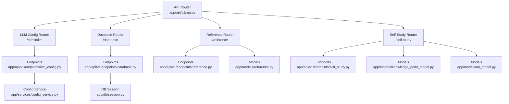
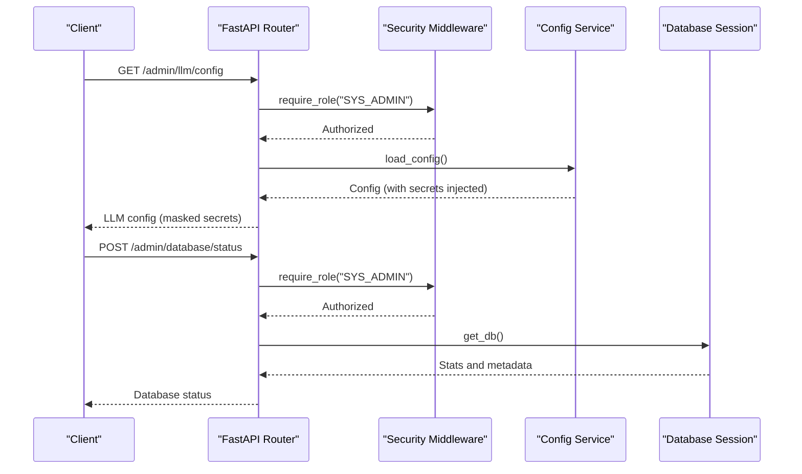
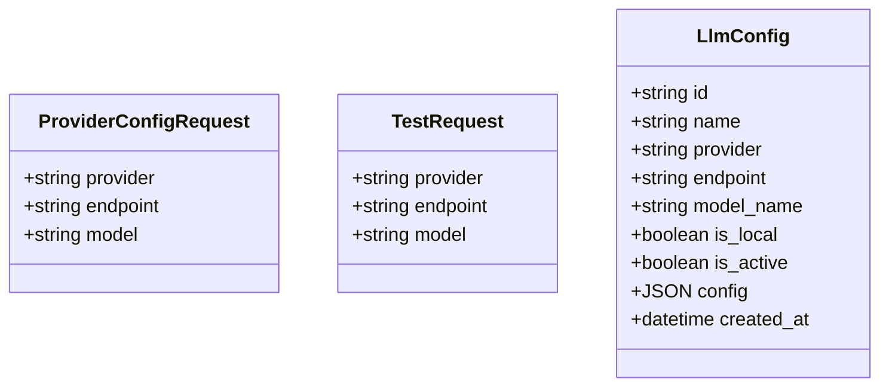
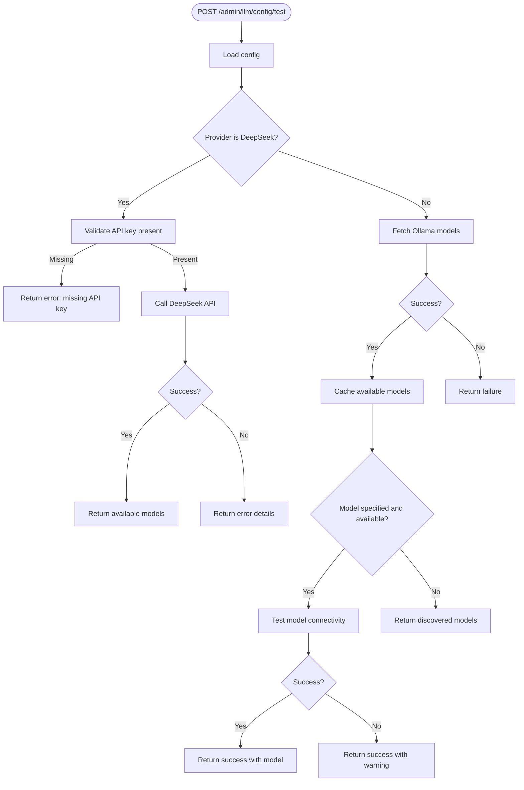
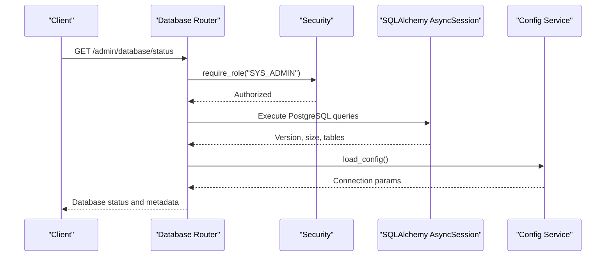
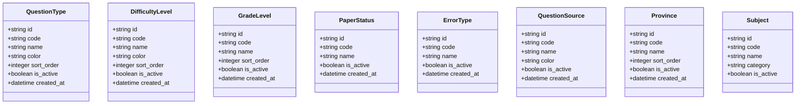
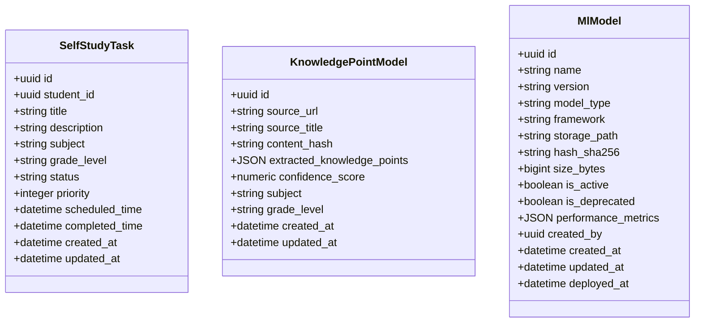
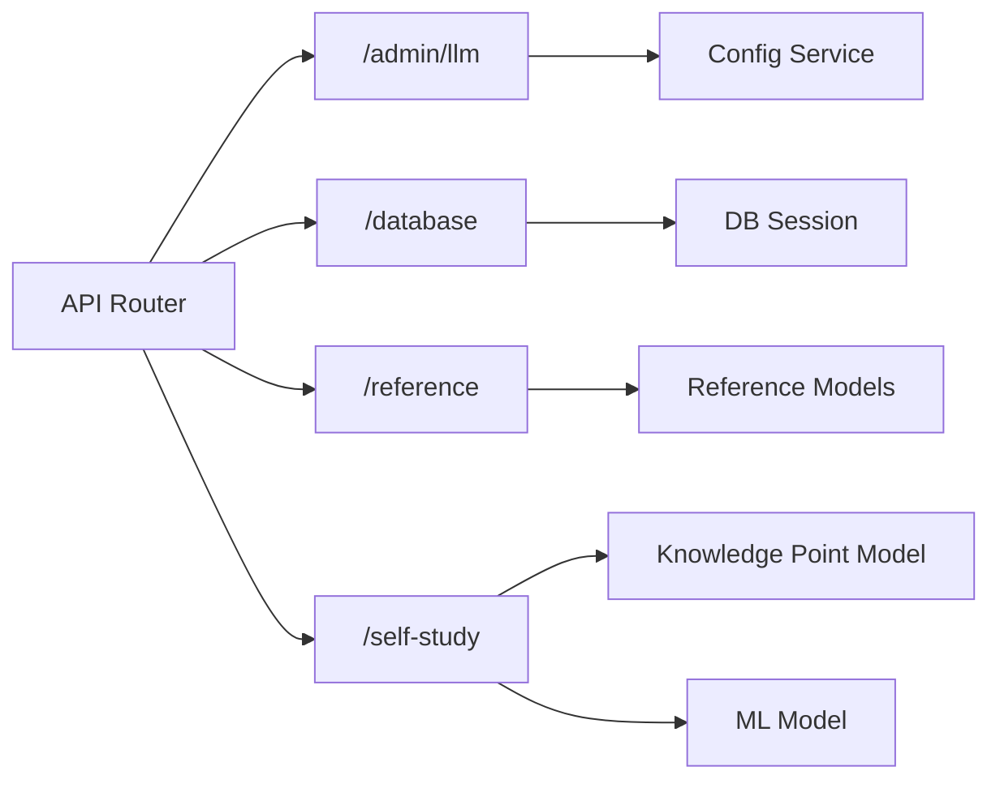

# System Configuration API

<cite>
**Referenced Files in This Document**
- [api.py](file://backend/app/api/v1/api.py)
- [llm_config.py](file://backend/app/api/v1/endpoints/llm_config.py)
- [database.py](file://backend/app/api/v1/endpoints/database.py)
- [reference.py](file://backend/app/api/v1/endpoints/reference.py)
- [self_study.py](file://backend/app/api/v1/endpoints/self_study.py)
- [config_service.py](file://backend/app/services/config_service.py)
- [security.py](file://backend/app/core/security.py)
- [session.py](file://backend/app/db/session.py)
- [llm_config.py](file://backend/app/models/llm_config.py)
- [reference.py](file://backend/app/models/reference.py)
- [knowledge_point_model.py](file://backend/app/models/knowledge_point_model.py)
- [ml_model.py](file://backend/app/models/ml_model.py)
- [sysconfig.json](file://backend/sysconfig.json)
</cite>

## Table of Contents
1. [Introduction](#introduction)
2. [Project Structure](#project-structure)
3. [Core Components](#core-components)
4. [Architecture Overview](#architecture-overview)
5. [Detailed Component Analysis](#detailed-component-analysis)
6. [Dependency Analysis](#dependency-analysis)
7. [Performance Considerations](#performance-considerations)
8. [Troubleshooting Guide](#troubleshooting-guide)
9. [Conclusion](#conclusion)
10. [Appendices](#appendices)

## Introduction
This document provides comprehensive API documentation for System Configuration endpoints. It covers:
- LLM configuration management (providers, models, testing, export limits)
- Database connection management and health monitoring
- Reference data maintenance (subjects, knowledge nodes, system constants)
- Self-study scheduling and ML model support
- Security, backup, and operational monitoring

The endpoints are grouped under the following URL prefixes:
- /admin/llm
- /database
- /reference
- /self-study

## Project Structure
The configuration APIs are implemented as FastAPI routers included in the main API router. Each endpoint module handles a specific concern: LLM configuration, database status, reference data, and self-study scheduling.

**Diagram sources**
- [api.py:1-26](file://backend/app/api/v1/api.py#L1-L26)
- [llm_config.py:1-186](file://backend/app/api/v1/endpoints/llm_config.py#L1-L186)
- [database.py:1-167](file://backend/app/api/v1/endpoints/database.py#L1-L167)
- [reference.py:1-122](file://backend/app/api/v1/endpoints/reference.py#L1-L122)
- [self_study.py:1-390](file://backend/app/api/v1/endpoints/self_study.py#L1-L390)
- [config_service.py:1-155](file://backend/app/services/config_service.py#L1-L155)
- [session.py:1-26](file://backend/app/db/session.py#L1-L26)
- [reference.py:1-76](file://backend/app/models/reference.py#L1-L76)
- [knowledge_point_model.py:1-29](file://backend/app/models/knowledge_point_model.py#L1-L29)
- [ml_model.py:1-35](file://backend/app/models/ml_model.py#L1-L35)

**Section sources**
- [api.py:1-26](file://backend/app/api/v1/api.py#L1-L26)

## Core Components
- LLM Configuration: Manage providers (Ollama, DeepSeek), current model selection, model availability discovery, connectivity testing, and export limits.
- Database Management: Retrieve database status, connection parameters, and server health metrics.
- Reference Data: Public read access to reference lists; administrative write operations for reference tables.
- Self-Study Scheduling: Task lifecycle management, knowledge point retrieval, and placeholder endpoints for advanced features.

**Section sources**
- [llm_config.py:10-186](file://backend/app/api/v1/endpoints/llm_config.py#L10-L186)
- [database.py:23-167](file://backend/app/api/v1/endpoints/database.py#L23-L167)
- [reference.py:16-122](file://backend/app/api/v1/endpoints/reference.py#L16-L122)
- [self_study.py:16-390](file://backend/app/api/v1/endpoints/self_study.py#L16-L390)

## Architecture Overview
The configuration APIs integrate with:
- Configuration service for persistent settings and secret injection
- Database session for health checks and statistics
- Security middleware for role-based access control
- Model definitions for reference and knowledge point data

**Diagram sources**
- [llm_config.py:17-25](file://backend/app/api/v1/endpoints/llm_config.py#L17-L25)
- [llm_config.py:178-185](file://backend/app/api/v1/endpoints/llm_config.py#L178-L185)
- [database.py:23-85](file://backend/app/api/v1/endpoints/database.py#L23-L85)
- [security.py:98-103](file://backend/app/core/security.py#L98-L103)
- [config_service.py:65-78](file://backend/app/services/config_service.py#L65-L78)
- [session.py:18-26](file://backend/app/db/session.py#L18-L26)

## Detailed Component Analysis

### LLM Configuration API
- Purpose: Configure LLM providers, current model, and related system parameters.
- Key endpoints:
  - GET /admin/llm/config: Retrieve current LLM configuration (secrets masked).
  - PUT /admin/llm/config: Update provider configuration (Ollama or DeepSeek).
  - POST /admin/llm/config/test: Test provider connectivity and discover models.
  - GET /admin/llm/export-max: Get export limit.
  - PUT /admin/llm/export-max: Set export limit.
  - PUT /admin/llm/section-config: Save section-specific configuration (grading, OCR, mistake book, system).
  - GET /admin/llm/config (full): Retrieve full configuration (requires SYS_ADMIN).

- Request/response schemas:
  - ProviderConfigRequest: provider, endpoint, model.
  - TestRequest: provider, endpoint, model.
  - Section config payload: arbitrary key-value pairs plus section identifier.

- Parameter specifications:
  - provider: "ollama" or "deepseek".
  - endpoint: provider endpoint URL (optional for update).
  - model: model name (optional for update).
  - export_max: integer limit for exports.
  - section: "grading", "ocr", "mistake", "system", "mistake_book".

- Security and secrets:
  - DeepSeek API key is injected from environment variable and masked in responses.
  - Database password is handled via environment variable and not persisted in sysconfig.json.

- Operational monitoring:
  - Test endpoint validates connectivity and model availability.
  - Available models are cached in configuration for quick access.

- Practical examples:
  - Update provider: Provide provider, endpoint, model in request body.
  - Test provider: Provide provider and optional endpoint/model overrides.
  - Set export limit: Send integer value in request body.

**Section sources**
- [llm_config.py:10-186](file://backend/app/api/v1/endpoints/llm_config.py#L10-L186)
- [config_service.py:65-155](file://backend/app/services/config_service.py#L65-L155)
- [sysconfig.json:1-48](file://backend/sysconfig.json#L1-L48)

#### LLM Configuration Class Diagram

**Diagram sources**
- [llm_config.py:10-15](file://backend/app/api/v1/endpoints/llm_config.py#L10-L15)
- [llm_config.py:55-59](file://backend/app/api/v1/endpoints/llm_config.py#L55-L59)
- [llm_config.py:8-20](file://backend/app/models/llm_config.py#L8-L20)

#### LLM Connectivity Flow

**Diagram sources**
- [llm_config.py:61-105](file://backend/app/api/v1/endpoints/llm_config.py#L61-L105)
- [config_service.py:108-155](file://backend/app/services/config_service.py#L108-L155)

### Database Management API
- Purpose: Monitor database health, connection parameters, and server statistics.
- Key endpoints:
  - GET /admin/dashboard/stats: Aggregate stats and server uptime.
  - GET /admin/database/status: Database version, size, table counts, and row totals.
  - POST /admin/database/config: Update connection parameters in sysconfig.json.

- Request/response schemas:
  - DatabaseConfigRequest: server, port, database, user, password (optional).

- Parameter specifications:
  - server: host address.
  - port: port number.
  - database: database name.
  - user: username.
  - password: password (optional; if provided, updates stored value).

- Security and monitoring:
  - Requires SYS_ADMIN role.
  - Reads configuration from sysconfig.json and environment variables.
  - Uses PostgreSQL-specific queries for size and table metadata.

- Practical examples:
  - Update database config: Provide server, port, database, user, and optional password.
  - View status: No body required; returns connection and metadata.

**Section sources**
- [database.py:23-167](file://backend/app/api/v1/endpoints/database.py#L23-L167)
- [config_service.py:24-62](file://backend/app/services/config_service.py#L24-L62)
- [sysconfig.json:1-48](file://backend/sysconfig.json#L1-L48)

#### Database Status Sequence

**Diagram sources**
- [database.py:96-144](file://backend/app/api/v1/endpoints/database.py#L96-L144)
- [security.py:98-103](file://backend/app/core/security.py#L98-L103)
- [session.py:18-26](file://backend/app/db/session.py#L18-L26)
- [config_service.py:65-78](file://backend/app/services/config_service.py#L65-L78)

### Reference Data API
- Purpose: Provide public reference data and enable administrative maintenance.
- Key endpoints:
  - GET /reference/all: Return all reference categories in one response.
  - GET /reference/{category}: Return a specific category list (public).
  - POST /reference/{category}: Create new reference item (SYS_ADMIN).
  - PUT /reference/{category}/{item_id}: Update reference item (SYS_ADMIN).
  - DELETE /reference/{category}/{item_id}: Deactivate reference item (SYS_ADMIN).

- Supported categories:
  - question-types, difficulty-levels, grade-levels, paper-statuses, error-types, question-sources, provinces, subjects.

- Request/response schemas:
  - Create: code, name, color (optional), sort_order (optional).
  - Update: item_id, name, color, sort_order, is_active (optional).
  - Delete: item_id.

- Parameter specifications:
  - code: unique identifier for the reference item.
  - name: display name.
  - color: optional hex color.
  - sort_order: integer ordering.
  - is_active: boolean flag to deactivate items.

- Security and data integrity:
  - Public read endpoints for reference lists.
  - Write endpoints require SYS_ADMIN role.
  - Unique constraints enforced by models (e.g., code uniqueness).

- Practical examples:
  - Create difficulty level: Provide code, name, optional color and sort_order.
  - Update subject: Provide item_id and desired fields.
  - Deactivate province: Provide item_id.

**Section sources**
- [reference.py:16-122](file://backend/app/api/v1/endpoints/reference.py#L16-L122)
- [reference.py:1-76](file://backend/app/models/reference.py#L1-L76)

#### Reference Data Class Diagram

**Diagram sources**
- [reference.py:8-76](file://backend/app/models/reference.py#L8-L76)

### Self-Study Scheduling API
- Purpose: Manage self-study tasks and related knowledge points; placeholder endpoints for advanced features.
- Key endpoints:
  - POST /self-study/tasks: Create a self-study task (student can only create for themselves).
  - GET /self-study/tasks/{task_id}: Retrieve a specific task (owner or teacher/admin).
  - PUT /self-study/tasks/{task_id}: Update a task (student owner only).
  - DELETE /self-study/tasks/{task_id}: Delete a task (student owner only).
  - GET /self-study/tasks: List all tasks (SYS_ADMIN only).
  - GET /self-study/knowledge-points: List knowledge points with filters (teacher/admin).
  - GET /self-study/knowledge-points/{kp_id}: Retrieve a knowledge point (teacher/admin).
  - POST /self-study/questions/generate: Placeholder for question generation (teacher/admin).
  - GET /self-study/questions/generate-status/{generation_id}: Placeholder for status retrieval.
  - POST /self-study/model/train: Placeholder for model training (SYS_ADMIN).
  - GET /self-study/model/train-status/{train_id}: Placeholder for training status.
  - GET /self-study/model/train-history: Placeholder for training history.
  - POST /self-study/data/sync: Placeholder for data synchronization (SYS_ADMIN).
  - GET /self-study/data/sync-status/{sync_id}: Placeholder for sync status.

- Request/response schemas:
  - SelfStudyTaskCreate: student_id, title, description, subject, grade_level, status, priority, scheduled_time, completed_time.
  - SelfStudyTaskUpdate: same fields as create, but optional.
  - SelfStudyTaskResponse: includes id, created_at, updated_at.

- Parameter specifications:
  - task_id: UUID of the task.
  - kp_id: UUID of the knowledge point.
  - generation_id: UUID for generation process.
  - train_id: UUID for training process.
  - sync_id: UUID for synchronization process.
  - Filters: subject, grade_level for knowledge point listing.

- Security and permissions:
  - Role-based access control: STUDENT, TEACHER, SYS_ADMIN.
  - Owner checks for task operations.

- Practical examples:
  - Create task: Provide student_id, title, and optional fields.
  - Update task: Provide task_id and fields to change.
  - List knowledge points: Provide optional filters and pagination.

**Section sources**
- [self_study.py:16-390](file://backend/app/api/v1/endpoints/self_study.py#L16-L390)
- [security.py:98-103](file://backend/app/core/security.py#L98-L103)
- [schemas/self_study.py:7-41](file://backend/app/schemas/self_study.py#L7-L41)

#### Self-Study Task Class Diagram

**Diagram sources**
- [self_study.py:16-390](file://backend/app/api/v1/endpoints/self_study.py#L16-L390)
- [knowledge_point_model.py:8-29](file://backend/app/models/knowledge_point_model.py#L8-L29)
- [ml_model.py:8-35](file://backend/app/models/ml_model.py#L8-L35)

## Dependency Analysis
- Router composition: The main API router includes all endpoint routers with appropriate prefixes.
- Security: Role-based decorators enforce SYS_ADMIN, TEACHER, QUESTION_ADMIN, STUDENT access.
- Persistence: Configuration service manages sysconfig.json and injects secrets from environment variables.
- Database: Async SQLAlchemy sessions are used for health checks and statistics.

**Diagram sources**
- [api.py:6-25](file://backend/app/api/v1/api.py#L6-L25)
- [config_service.py:22-105](file://backend/app/services/config_service.py#L22-L105)
- [session.py:6-26](file://backend/app/db/session.py#L6-L26)
- [reference.py:8-76](file://backend/app/models/reference.py#L8-L76)
- [knowledge_point_model.py:8-29](file://backend/app/models/knowledge_point_model.py#L8-L29)
- [ml_model.py:8-35](file://backend/app/models/ml_model.py#L8-L35)

**Section sources**
- [api.py:6-25](file://backend/app/api/v1/api.py#L6-L25)
- [security.py:98-103](file://backend/app/core/security.py#L98-L103)
- [config_service.py:22-105](file://backend/app/services/config_service.py#L22-L105)

## Performance Considerations
- LLM model testing: Warm-up requests may take several minutes; timeouts are configured accordingly.
- Database queries: Aggregation queries are efficient; avoid excessive pagination on large datasets.
- Reference data: Filtering and ordering are applied server-side; keep filters specific to reduce payload size.
- Self-study endpoints: Pagination limits are enforced to prevent heavy loads.

[No sources needed since this section provides general guidance]

## Troubleshooting Guide
- LLM connectivity failures:
  - Verify provider endpoint and model availability.
  - Check environment variables for API keys.
  - Review test endpoint responses for detailed errors.

- Database connection issues:
  - Confirm connection parameters in sysconfig.json.
  - Ensure PostgreSQL service is reachable and credentials are valid.

- Permission errors:
  - Ensure user has required role (SYS_ADMIN, TEACHER, QUESTION_ADMIN, STUDENT).
  - Check JWT token validity and user existence in respective tables.

- Reference data conflicts:
  - Ensure unique codes when creating reference items.
  - Use deactivation instead of deletion to preserve referential integrity.

**Section sources**
- [llm_config.py:61-105](file://backend/app/api/v1/endpoints/llm_config.py#L61-L105)
- [database.py:96-144](file://backend/app/api/v1/endpoints/database.py#L96-L144)
- [security.py:98-103](file://backend/app/core/security.py#L98-L103)
- [reference.py:71-114](file://backend/app/api/v1/endpoints/reference.py#L71-L114)

## Conclusion
The System Configuration API provides robust controls for LLM configuration, database management, reference data maintenance, and self-study scheduling. It enforces strict security policies, integrates with persistent configuration, and offers operational insights through health monitoring and statistics.

[No sources needed since this section summarizes without analyzing specific files]

## Appendices

### Endpoint Reference Summary
- LLM Configuration
  - GET /admin/llm/config
  - PUT /admin/llm/config
  - POST /admin/llm/config/test
  - GET /admin/llm/export-max
  - PUT /admin/llm/export-max
  - PUT /admin/llm/section-config
  - GET /admin/llm/config (full)

- Database Management
  - GET /admin/dashboard/stats
  - GET /admin/database/status
  - POST /admin/database/config

- Reference Data
  - GET /reference/all
  - GET /reference/{category}
  - POST /reference/{category}
  - PUT /reference/{category}/{item_id}
  - DELETE /reference/{category}/{item_id}

- Self-Study Scheduling
  - POST /self-study/tasks
  - GET /self-study/tasks/{task_id}
  - PUT /self-study/tasks/{task_id}
  - DELETE /self-study/tasks/{task_id}
  - GET /self-study/tasks
  - GET /self-study/knowledge-points
  - GET /self-study/knowledge-points/{kp_id}
  - POST /self-study/questions/generate
  - GET /self-study/questions/generate-status/{generation_id}
  - POST /self-study/model/train
  - GET /self-study/model/train-status/{train_id}
  - GET /self-study/model/train-history
  - POST /self-study/data/sync
  - GET /self-study/data/sync-status/{sync_id}

[No sources needed since this section provides general guidance]