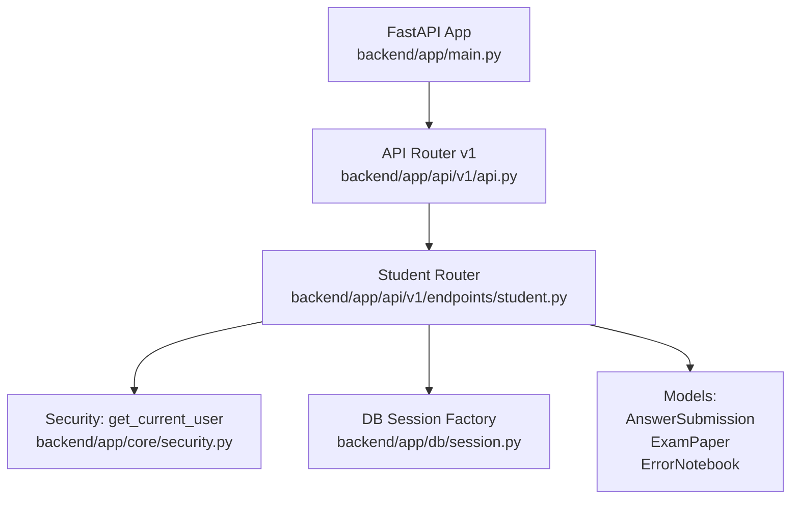
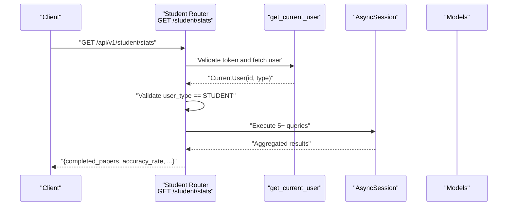
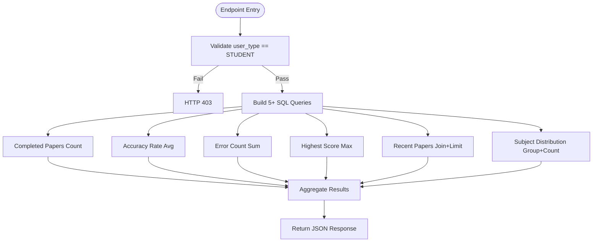
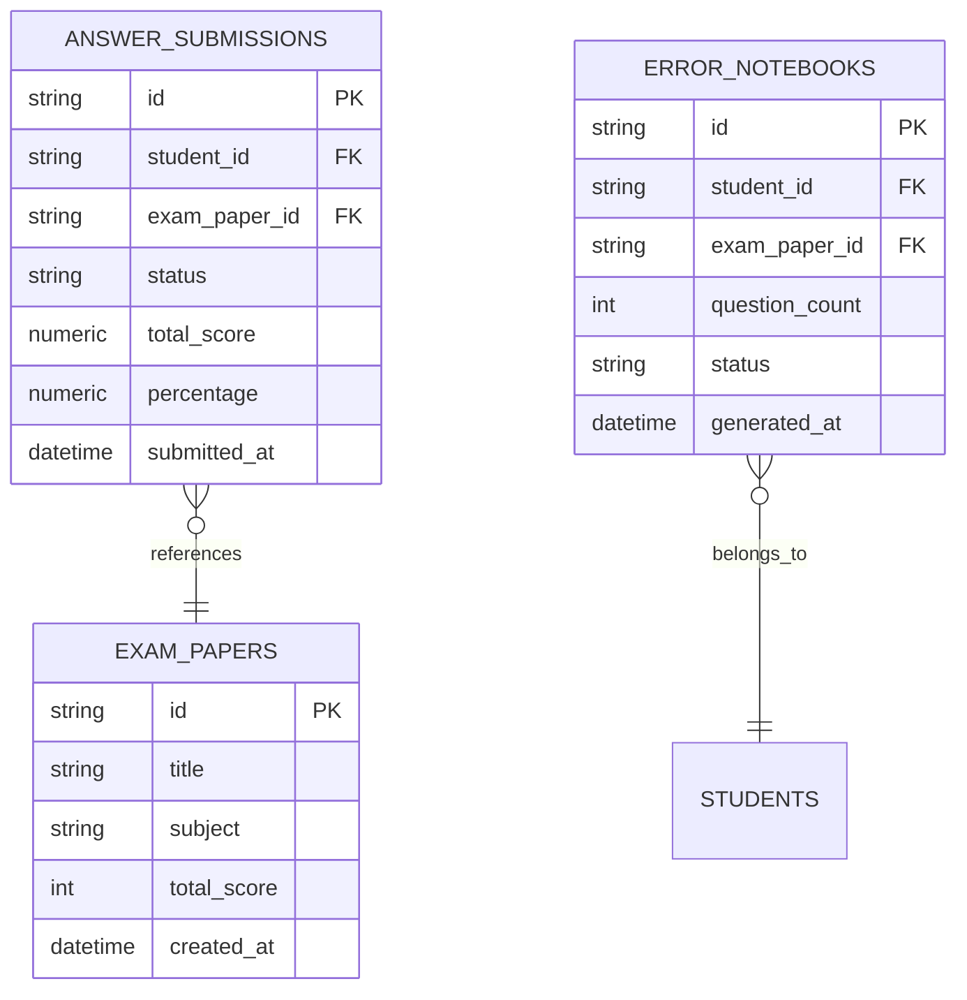
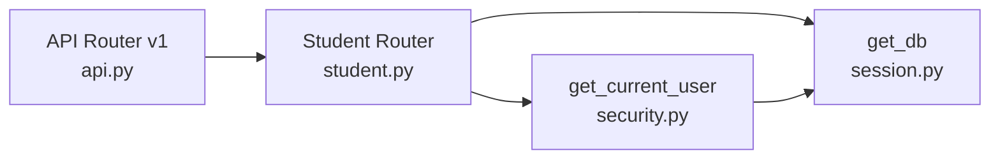

# Student Dashboard API

<cite>
**Referenced Files in This Document**
- [student.py](file://backend/app/api/v1/endpoints/student.py)
- [api.py](file://backend/app/api/v1/api.py)
- [security.py](file://backend/app/core/security.py)
- [session.py](file://backend/app/db/session.py)
- [answer_submission.py](file://backend/app/models/answer_submission.py)
- [exam_paper.py](file://backend/app/models/exam_paper.py)
- [error_notebook.py](file://backend/app/models/error_notebook.py)
- [main.py](file://backend/app/main.py)
</cite>

## Table of Contents
1. [Introduction](#introduction)
2. [Project Structure](#project-structure)
3. [Core Components](#core-components)
4. [Architecture Overview](#architecture-overview)
5. [Detailed Component Analysis](#detailed-component-analysis)
6. [Dependency Analysis](#dependency-analysis)
7. [Performance Considerations](#performance-considerations)
8. [Troubleshooting Guide](#troubleshooting-guide)
9. [Conclusion](#conclusion)

## Introduction
This document describes the Student Dashboard API endpoint for retrieving comprehensive analytics and progress tracking for students. It focuses on the HTTP GET endpoint at /student/stats, including authentication requirements, parameter specifications, response schema, and practical examples. It also covers database query optimizations, filtering by submission status, and data aggregation techniques used for dashboard calculations.

## Project Structure
The endpoint is part of the FastAPI application under the v1 API namespace. The student router is included in the main API router and mounted under the /student prefix.

**Diagram sources**
- [main.py:1-52](file://backend/app/main.py#L1-L52)
- [api.py:1-26](file://backend/app/api/v1/api.py#L1-L26)
- [student.py:1-112](file://backend/app/api/v1/endpoints/student.py#L1-L112)
- [security.py:1-104](file://backend/app/core/security.py#L1-L104)
- [session.py:1-26](file://backend/app/db/session.py#L1-L26)
- [answer_submission.py:1-37](file://backend/app/models/answer_submission.py#L1-L37)
- [exam_paper.py:1-51](file://backend/app/models/exam_paper.py#L1-L51)
- [error_notebook.py:1-32](file://backend/app/models/error_notebook.py#L1-L32)

**Section sources**
- [main.py:1-52](file://backend/app/main.py#L1-L52)
- [api.py:1-26](file://backend/app/api/v1/api.py#L1-L26)

## Core Components
- Endpoint: GET /student/stats
- Purpose: Return real-time statistics for the current student’s dashboard
- Authentication: Requires a valid bearer token; enforces STUDENT role
- Database session: Uses asynchronous SQLAlchemy sessions
- Response fields:
  - completed_papers: integer count of distinct completed exam papers
  - accuracy_rate: average percentage across completed submissions (rounded to 0.1)
  - error_count: sum of questions flagged in error notebooks for the student
  - highest_score: maximum percentage among completed submissions (rounded to 0.1)
  - recent_papers: array of up to five most recent completed exam submissions with exam metadata
  - subject_distribution: array of subject-wise counts of completed exam papers

**Section sources**
- [student.py:16-111](file://backend/app/api/v1/endpoints/student.py#L16-L111)

## Architecture Overview
The endpoint orchestrates multiple database queries to compute aggregated metrics and recent activity. It relies on:
- Security layer to extract and validate the current user
- Asynchronous database session for efficient I/O
- Joined queries to connect submissions with exam metadata
- Aggregation functions for averages, maxima, and counts

**Diagram sources**
- [student.py:16-111](file://backend/app/api/v1/endpoints/student.py#L16-L111)
- [security.py:64-95](file://backend/app/core/security.py#L64-L95)
- [session.py:18-26](file://backend/app/db/session.py#L18-L26)

## Detailed Component Analysis

### Endpoint Definition and Authentication
- URL pattern: /student/stats
- HTTP method: GET
- Authentication: Bearer token via OAuth2PasswordBearer; validated by get_current_user
- Authorization: Enforces STUDENT role; rejects non-student users
- Database session: Provided by get_db dependency

Practical notes:
- The token must contain a subject (user ID) and a user type claim.
- The endpoint raises HTTP 403 if the user is not a student.

**Section sources**
- [student.py:16-24](file://backend/app/api/v1/endpoints/student.py#L16-L24)
- [security.py:50](file://backend/app/core/security.py#L50)
- [security.py:64-95](file://backend/app/core/security.py#L64-L95)

### Request and Response Specifications
- Request
  - Method: GET
  - URL: /api/v1/student/stats
  - Headers: Authorization: Bearer <token>
  - Query parameters: none
- Response body: JSON object containing:
  - completed_papers: number
  - accuracy_rate: number (rounded to 0.1)
  - error_count: number
  - highest_score: number (rounded to 0.1)
  - recent_papers: array of objects with keys:
    - id: string (exam paper UUID)
    - title: string
    - subject: string
    - total_score: number
    - percentage: number
    - submitted_at: ISO timestamp string
  - subject_distribution: array of objects with keys:
    - subject: string
    - count: number

Example response outline:
{
  "completed_papers": 12,
  "accuracy_rate": 78.3,
  "error_count": 45,
  "highest_score": 92.0,
  "recent_papers": [
    {
      "id": "a1b2c3d4-e5f6-7890-abcd-ef1234567890",
      "title": "Mathematics Midterm 2025",
      "subject": "Mathematics",
      "total_score": 85.0,
      "percentage": 82.0,
      "submitted_at": "2025-04-01T14:22:00Z"
    },
    ...
  ],
  "subject_distribution": [
    {"subject": "Mathematics", "count": 5},
    {"subject": "Physics", "count": 3},
    {"subject": "Chemistry", "count": 4}
  ]
}

**Section sources**
- [student.py:104-111](file://backend/app/api/v1/endpoints/student.py#L104-L111)

### Data Aggregation and Filtering Logic
The endpoint computes metrics using SQL aggregations and joins:
- Completed papers count: distinct count of exam_paper_id where submission status is in ["GRADED", "GENERATED", "RE_GRADED"]
- Accuracy rate: average of percentage across matching submissions, rounded to 0.1
- Error count: sum of question_count from error notebooks for the student
- Highest score: maximum percentage across matching submissions, rounded to 0.1
- Recent papers: top 5 submissions ordered by submitted_at descending, joined with exam paper metadata
- Subject distribution: group by subject and count distinct completed exam papers

**Diagram sources**
- [student.py:27-102](file://backend/app/api/v1/endpoints/student.py#L27-L102)

**Section sources**
- [student.py:27-102](file://backend/app/api/v1/endpoints/student.py#L27-L102)

### Database Models and Relationships
The endpoint interacts with three core models:
- AnswerSubmission: stores student exam submissions, scores, and status
- ExamPaper: stores exam paper metadata including subject
- ErrorNotebook: stores student error notebook entries with question counts

**Diagram sources**
- [answer_submission.py:9-37](file://backend/app/models/answer_submission.py#L9-L37)
- [exam_paper.py:23-51](file://backend/app/models/exam_paper.py#L23-L51)
- [error_notebook.py:8-32](file://backend/app/models/error_notebook.py#L8-L32)

**Section sources**
- [answer_submission.py:9-37](file://backend/app/models/answer_submission.py#L9-L37)
- [exam_paper.py:23-51](file://backend/app/models/exam_paper.py#L23-L51)
- [error_notebook.py:8-32](file://backend/app/models/error_notebook.py#L8-L32)

### Endpoint Implementation Notes
- Submission status filtering: Only considers submissions with status in ["GRADED", "GENERATED", "RE_GRADED"]
- Percentage normalization: Results are rounded to 0.1 precision for readability
- Recent papers limit: Hard limit of 5 to keep the response lightweight
- Subject classification: Unknown subjects are labeled as "未分类" (Uncategorized)

**Section sources**
- [student.py:31-32](file://backend/app/api/v1/endpoints/student.py#L31-L32)
- [student.py:70-76](file://backend/app/api/v1/endpoints/student.py#L70-L76)
- [student.py:95-97](file://backend/app/api/v1/endpoints/student.py#L95-L97)
- [student.py:100](file://backend/app/api/v1/endpoints/student.py#L100)

## Dependency Analysis
- Router registration: The student router is included in the v1 API router under /student
- Endpoint routing: GET /student/stats is handled by the student router
- Security dependency: get_current_user validates JWT and checks user existence across user types
- Database dependency: get_db provides an async session factory with proper lifecycle management

**Diagram sources**
- [api.py:6](file://backend/app/api/v1/api.py#L6)
- [api.py:23](file://backend/app/api/v1/api.py#L23)
- [student.py:18-19](file://backend/app/api/v1/endpoints/student.py#L18-L19)
- [security.py:64-95](file://backend/app/core/security.py#L64-L95)
- [session.py:18-26](file://backend/app/db/session.py#L18-L26)

**Section sources**
- [api.py:6-23](file://backend/app/api/v1/api.py#L6-L23)
- [student.py:18-19](file://backend/app/api/v1/endpoints/student.py#L18-L19)
- [security.py:64-95](file://backend/app/core/security.py#L64-L95)
- [session.py:18-26](file://backend/app/db/session.py#L18-L26)

## Performance Considerations
- Asynchronous I/O: Uses async SQLAlchemy to minimize blocking during database operations
- Indexes: Submission and paper IDs are indexed to speed up joins and filters
- Aggregation efficiency: Uses SQL aggregate functions (COUNT, AVG, MAX) to reduce application-side computation
- Filtering by status: Limits rows early to avoid unnecessary processing
- Pagination limit: Restricts recent papers to 5 to bound response size
- Token verification: Validates JWT and checks user existence in a single pass

Recommendations:
- Add composite indexes on (student_id, status) and (student_id, submitted_at) to further optimize queries
- Consider caching periodic aggregates for frequently accessed metrics if traffic increases
- Monitor slow queries and consider materialized summaries for subject_distribution if needed

**Section sources**
- [session.py:6-15](file://backend/app/db/session.py#L6-L15)
- [answer_submission.py:13-14](file://backend/app/models/answer_submission.py#L13-L14)
- [answer_submission.py:30](file://backend/app/models/answer_submission.py#L30)
- [student.py:31-32](file://backend/app/api/v1/endpoints/student.py#L31-L32)
- [student.py:74](file://backend/app/api/v1/endpoints/student.py#L74)

## Troubleshooting Guide
Common issues and resolutions:
- Authentication failures:
  - Symptom: HTTP 401 when calling the endpoint
  - Cause: Missing or invalid Authorization header
  - Resolution: Ensure a valid Bearer token is provided
- Role restrictions:
  - Symptom: HTTP 403 when calling the endpoint
  - Cause: Token user_type is not STUDENT
  - Resolution: Authenticate as a student user
- Empty or partial data:
  - Symptom: Some metrics are zero or missing
  - Cause: No completed submissions or error notebooks yet
  - Resolution: Complete exams and generate error notebooks to populate data
- Database connectivity:
  - Symptom: Internal server errors during endpoint execution
  - Cause: Database session failure or connection issues
  - Resolution: Check database availability and connection settings

**Section sources**
- [student.py:22-23](file://backend/app/api/v1/endpoints/student.py#L22-L23)
- [security.py:68-79](file://backend/app/core/security.py#L68-L79)
- [session.py:18-26](file://backend/app/db/session.py#L18-L26)

## Conclusion
The /student/stats endpoint delivers a comprehensive snapshot of a student’s performance and progress. It leverages secure authentication, efficient database queries, and targeted aggregations to present meaningful insights. By adhering to the documented request/response specifications and understanding the underlying data model and filtering logic, developers can integrate and extend the endpoint effectively while maintaining optimal performance.