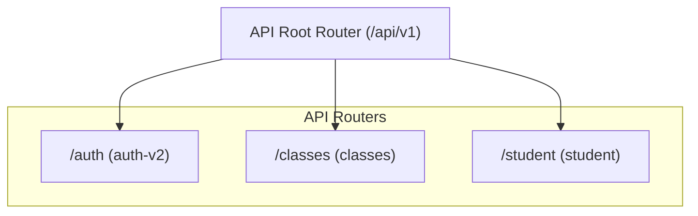
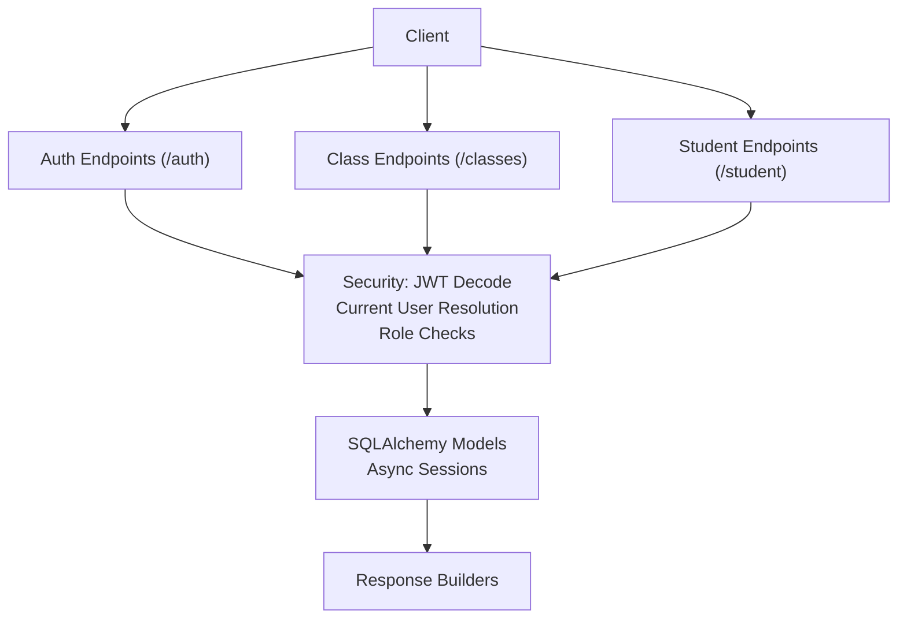
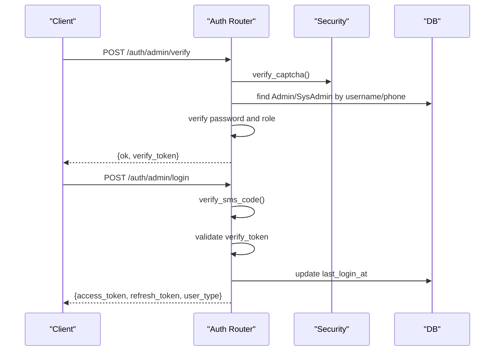
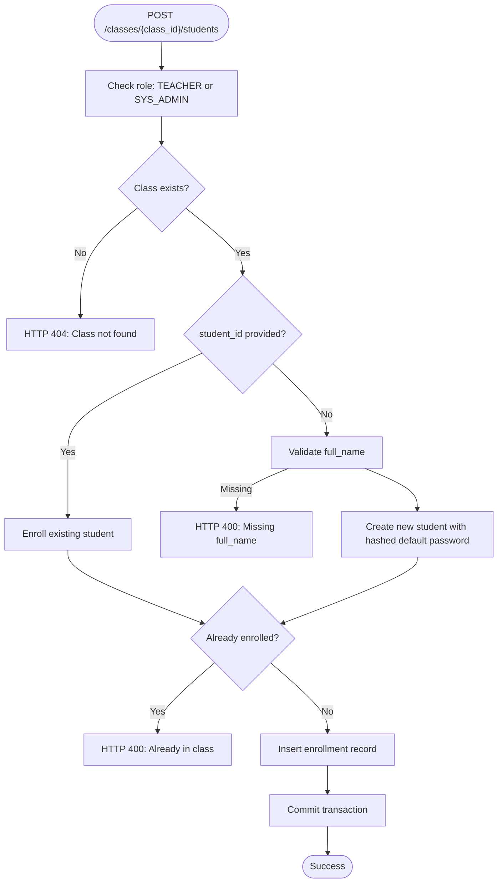
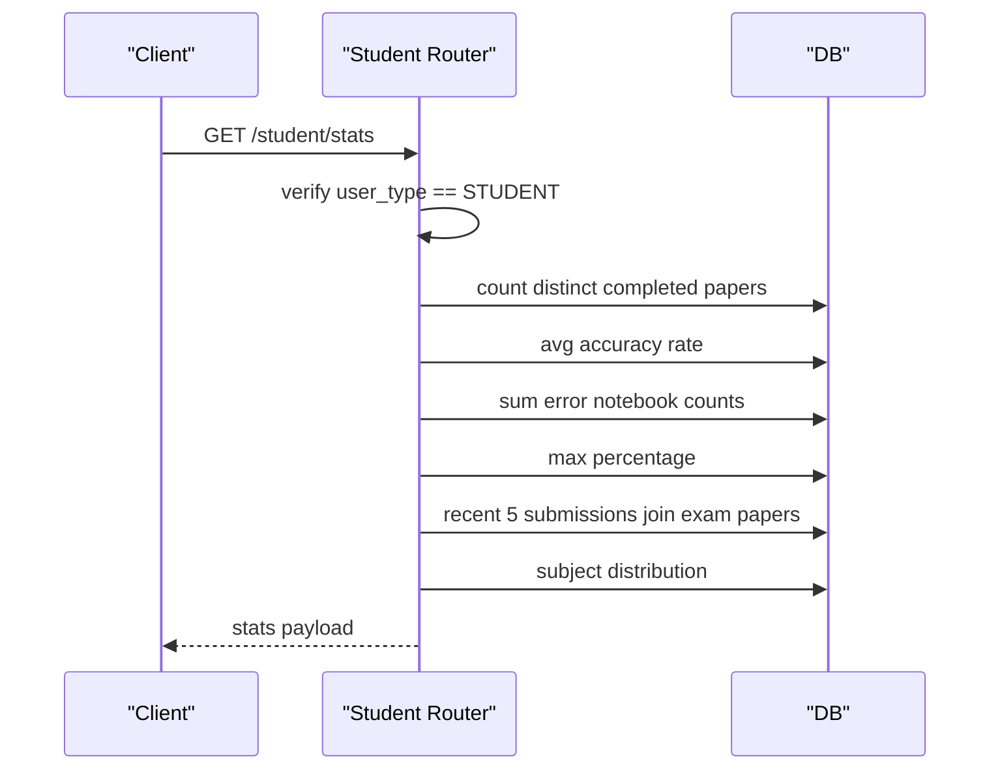
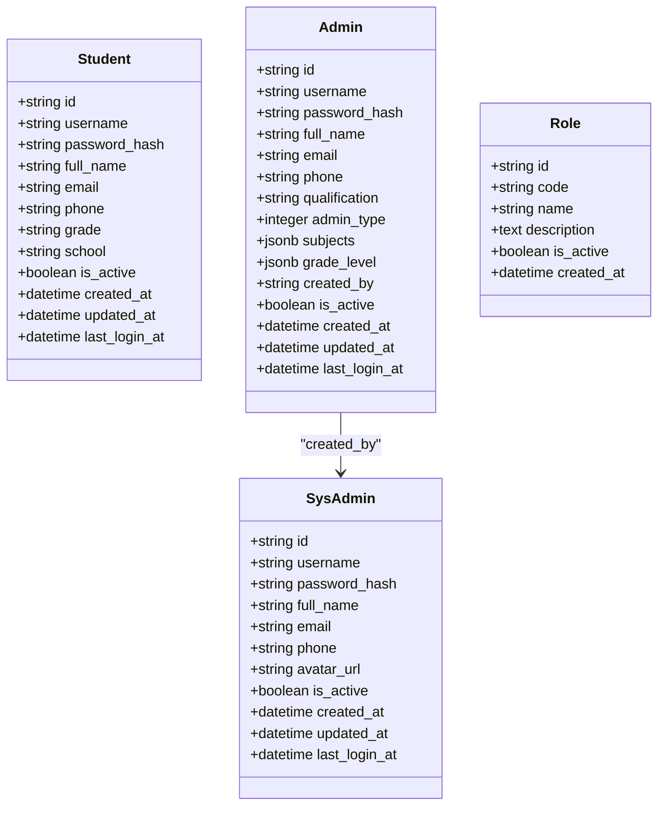
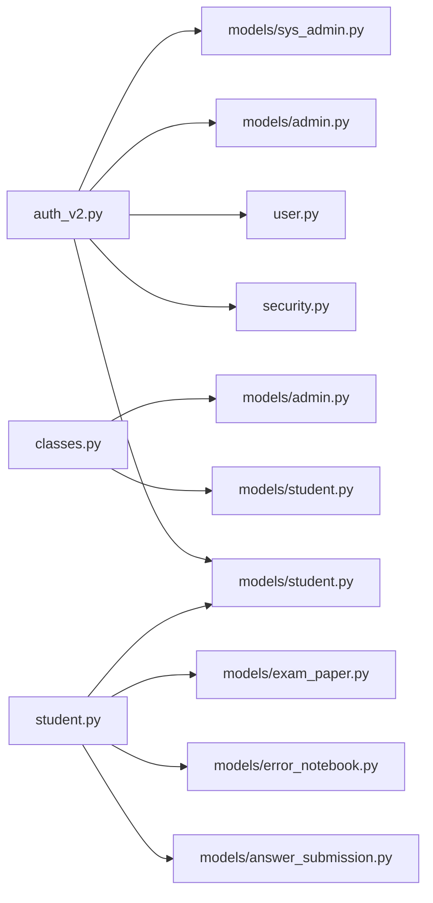

# User Management API

<cite>
**Referenced Files in This Document**
- [api.py](file://backend/app/api/v1/api.py)
- [auth_v2.py](file://backend/app/api/v1/endpoints/auth_v2.py)
- [classes.py](file://backend/app/api/v1/endpoints/classes.py)
- [student.py](file://backend/app/api/v1/endpoints/student.py)
- [user.py](file://backend/app/schemas/user.py)
- [security.py](file://backend/app/core/security.py)
- [student.py](file://backend/app/models/student.py)
- [admin.py](file://backend/app/models/admin.py)
- [sys_admin.py](file://backend/app/models/sys_admin.py)
- [role.py](file://backend/app/models/role.py)
</cite>

## Table of Contents
1. [Introduction](#introduction)
2. [Project Structure](#project-structure)
3. [Core Components](#core-components)
4. [Architecture Overview](#architecture-overview)
5. [Detailed Component Analysis](#detailed-component-analysis)
6. [Dependency Analysis](#dependency-analysis)
7. [Performance Considerations](#performance-considerations)
8. [Troubleshooting Guide](#troubleshooting-guide)
9. [Conclusion](#conclusion)
10. [Appendices](#appendices)

## Introduction
This document provides comprehensive API documentation for User Management endpoints across three user types: student, teacher/administrator, and system administrator. It covers authentication, profile management, role-based access control, and specialized features such as class enrollment and student progress tracking. The documentation specifies HTTP methods, URL patterns, request/response schemas, parameter validations, and error handling behaviors.

## Project Structure
The backend organizes user-related APIs under a versioned router. Authentication and user profile endpoints are grouped under the auth-v2 module, while class management and student statistics are exposed under dedicated routers. The API router aggregates all endpoints and prefixes them appropriately.

**Diagram sources**
- [api.py:8-23](file://backend/app/api/v1/api.py#L8-L23)

**Section sources**
- [api.py:1-26](file://backend/app/api/v1/api.py#L1-L26)

## Core Components
- Authentication and Authorization
  - JWT-based bearer tokens with user_type embedded in the token payload.
  - Role enforcement via a decorator that restricts endpoints to specific user types.
  - Captcha and SMS verification for admin login and phone updates.
- User Types and Roles
  - Student, Teacher/Admin (Admin), Question Admin, Principal, Dean, Academic Manager, Head Teacher, System Administrator.
  - Role codes and labels are enforced and validated during registration and updates.
- Data Models
  - Students, Admins (including teacher and question admin), System Admins, and Roles reference table.
- Schemas
  - Pydantic models define request/response shapes for user creation, login, and profile operations.

**Section sources**
- [security.py:53-103](file://backend/app/core/security.py#L53-L103)
- [user.py:7-37](file://backend/app/schemas/user.py#L7-L37)
- [student.py:8-23](file://backend/app/models/student.py#L8-L23)
- [admin.py:9-27](file://backend/app/models/admin.py#L9-L27)
- [sys_admin.py:8-22](file://backend/app/models/sys_admin.py#L8-L22)
- [role.py:8-17](file://backend/app/models/role.py#L8-L17)

## Architecture Overview
The User Management API follows a layered architecture:
- Endpoint Layer: FastAPI routers expose HTTP endpoints.
- Security Layer: JWT decoding, current user resolution, and role checks.
- Persistence Layer: SQLAlchemy models and async sessions.
- Service Layer: Optional services for captcha, SMS, OCR, and LLM integrations.

**Diagram sources**
- [auth_v2.py:13-17](file://backend/app/api/v1/endpoints/auth_v2.py#L13-L17)
- [classes.py:9](file://backend/app/api/v1/endpoints/classes.py#L9)
- [student.py:11](file://backend/app/api/v1/endpoints/student.py#L11)
- [security.py:64-95](file://backend/app/core/security.py#L64-L95)

## Detailed Component Analysis

### Authentication and Profile Endpoints
- Purpose: User login/register, profile retrieval/update, and admin user administration.
- Key Endpoints:
  - GET /auth/captcha: Retrieve captcha challenge.
  - POST /auth/admin/verify: Verify role, password, and captcha; issue a short-lived verify token.
  - POST /auth/admin/login: Complete admin login using SMS code and verify token.
  - POST /auth/student/login: Login student via captcha and SMS.
  - POST /auth/student/register: Self-register student via SMS.
  - POST /auth/admin/create: Create teacher or question admin (SysAdmin only).
  - GET /auth/admin/list: List admins with filters.
  - PUT /auth/admin/{admin_id}: Update admin details (including subjects/grades).
  - DELETE /auth/admin/{admin_id}: Delete admin.
  - GET /auth/profile: Retrieve current user profile from appropriate table.
  - PUT /auth/profile: Update profile fields (full_name, email, grade, school).
  - PUT /auth/profile/phone: Update phone with SMS verification.

- Request/Response Schemas:
  - AdminLoginRequest: username, password, captcha_key, captcha_code, sms_code, role, verify_token.
  - StudentLoginRequest: username, captcha_key, captcha_code, sms_code.
  - StudentRegisterRequest: phone, sms_code, full_name, grade, school.
  - TokenResponse: access_token, refresh_token, token_type, user_type, full_name.
  - UserCreate: email, username, full_name, password, role.
  - UserResponse: id, email, username, full_name, is_active, role, created_at, updated_at.

- Parameter Validation:
  - Username length constraints.
  - Password minimum length.
  - Email format validation.
  - Role pattern validation (STUDENT, TEACHER, QUESTION_ADMIN, ADMIN).
  - Phone length validation (11 digits).
  - SMS code verification (default test value used in code).

- Access Control:
  - require_role decorator enforces SYS_ADMIN for admin creation/list/delete/update.
  - Role checks for admin login steps.
  - Profile updates exclude phone changes (use phone update endpoint).

- Error Handling:
  - HTTP 400 for invalid captcha/SMS.
  - HTTP 401 for invalid credentials or expired verify token.
  - HTTP 403 for insufficient permissions.
  - HTTP 404 for missing users/admins/classes/students.

**Diagram sources**
- [auth_v2.py:91-183](file://backend/app/api/v1/endpoints/auth_v2.py#L91-L183)
- [security.py:64-95](file://backend/app/core/security.py#L64-L95)

**Section sources**
- [auth_v2.py:25-53](file://backend/app/api/v1/endpoints/auth_v2.py#L25-L53)
- [auth_v2.py:75-237](file://backend/app/api/v1/endpoints/auth_v2.py#L75-L237)
- [auth_v2.py:242-373](file://backend/app/api/v1/endpoints/auth_v2.py#L242-L373)
- [auth_v2.py:377-475](file://backend/app/api/v1/endpoints/auth_v2.py#L377-L475)
- [user.py:13-28](file://backend/app/schemas/user.py#L13-L28)
- [security.py:98-103](file://backend/app/core/security.py#L98-L103)

### Class Management Endpoints (Teacher/Admin)
- Purpose: Manage classes and enroll students.
- Key Endpoints:
  - POST /classes: Create class (requires TEACHER or SYS_ADMIN).
  - GET /classes: List classes (filters by teacher for TEACHER, optional search).
  - PUT /classes/{class_id}: Update class fields.
  - DELETE /classes/{class_id}: Delete class and associated enrollments.
  - GET /classes/{class_id}/students: List enrolled students.
  - GET /classes/{class_id}/available-students: List students not in class (with optional search).
  - POST /classes/{class_id}/students: Add student (existing or new).
  - DELETE /classes/{class_id}/students/{student_id}: Remove student.
  - PUT /classes/{class_id}/students/{student_id}: Update student info (excluding phone).
  - GET /classes/{class_id}/students/{student_id}: Get student detail.

- Request/Response Schemas:
  - Create class: name, subject, grade_level, description, is_active.
  - Update class: name, subject, grade_level, description, is_active.
  - Add student: student_id (optional) or full_name, phone, grade, school.
  - Update student: full_name, email, grade, school.

- Access Control:
  - TEACHER or SYS_ADMIN required for class operations.
  - Student updates exclude phone changes.

- Error Handling:
  - HTTP 403 for insufficient permissions.
  - HTTP 404 for missing class/student.
  - HTTP 400 for duplicate enrollment or missing required fields.

**Diagram sources**
- [classes.py:143-189](file://backend/app/api/v1/endpoints/classes.py#L143-L189)

**Section sources**
- [classes.py:16-100](file://backend/app/api/v1/endpoints/classes.py#L16-L100)
- [classes.py:104-242](file://backend/app/api/v1/endpoints/classes.py#L104-L242)

### Student Statistics Endpoints
- Purpose: Provide dashboard statistics for students.
- Endpoint: GET /student/stats
- Access Control: STUDENT only.
- Response Fields:
  - completed_papers, accuracy_rate, error_count, highest_score.
  - recent_papers: id, title, subject, total_score, percentage, submitted_at.
  - subject_distribution: subject, count.

- Data Sources:
  - AnswerSubmission, ExamPaper, ErrorNotebook.

**Diagram sources**
- [student.py:16-111](file://backend/app/api/v1/endpoints/student.py#L16-L111)

**Section sources**
- [student.py:16-111](file://backend/app/api/v1/endpoints/student.py#L16-L111)

### User Data Models and Role Definitions
- Student Model
  - Fields: id, username, password_hash, full_name, email, phone, grade, school, is_active, timestamps.
- Admin Model
  - Fields: id, username, password_hash, full_name, email, phone, qualification, admin_type, subjects, grade_level, created_by, is_active, timestamps.
- SysAdmin Model
  - Fields: id, username, password_hash, full_name, email, phone, avatar_url, is_active, timestamps.
- Role Model
  - Fields: id, code, name, description, is_active, created_at.

**Diagram sources**
- [student.py:8-23](file://backend/app/models/student.py#L8-L23)
- [admin.py:9-27](file://backend/app/models/admin.py#L9-L27)
- [sys_admin.py:8-22](file://backend/app/models/sys_admin.py#L8-L22)
- [role.py:8-17](file://backend/app/models/role.py#L8-L17)

**Section sources**
- [student.py:8-23](file://backend/app/models/student.py#L8-L23)
- [admin.py:9-27](file://backend/app/models/admin.py#L9-L27)
- [sys_admin.py:8-22](file://backend/app/models/sys_admin.py#L8-L22)
- [role.py:8-17](file://backend/app/models/role.py#L8-L17)

## Dependency Analysis
- Endpoint Dependencies
  - auth_v2 depends on security utilities for JWT encoding/decoding, password hashing, and role checks.
  - classes depends on SchoolClass and Student models and uses a many-to-many association table.
  - student depends on AnswerSubmission, AnswerDetail, ErrorNotebook, and ExamPaper models.
- Cohesion and Coupling
  - Strong cohesion within each router by responsibility.
  - Low coupling via shared security utilities and SQLAlchemy models.
- External Integrations
  - Optional services for captcha, SMS, OCR, and LLM are invoked conditionally.

**Diagram sources**
- [auth_v2.py:13-17](file://backend/app/api/v1/endpoints/auth_v2.py#L13-L17)
- [classes.py:7-9](file://backend/app/api/v1/endpoints/classes.py#L7-L9)
- [student.py:7-11](file://backend/app/api/v1/endpoints/student.py#L7-L11)
- [security.py:13-17](file://backend/app/core/security.py#L13-L17)

**Section sources**
- [auth_v2.py:13-17](file://backend/app/api/v1/endpoints/auth_v2.py#L13-L17)
- [classes.py:7-9](file://backend/app/api/v1/endpoints/classes.py#L7-L9)
- [student.py:7-11](file://backend/app/api/v1/endpoints/student.py#L7-L11)

## Performance Considerations
- Asynchronous Operations: Endpoints use async SQLAlchemy sessions to minimize blocking.
- Efficient Queries: Aggregation queries for student stats leverage SQL functions and joins to reduce Python-side computation.
- Pagination: Admin listing endpoints should implement pagination to avoid large payloads.
- Indexing: Ensure indexes on frequently filtered fields (username, phone, email, role) for optimal lookup performance.

## Troubleshooting Guide
- Authentication Failures
  - Verify captcha and SMS codes are correct.
  - Ensure verify token is present and not expired.
  - Confirm user is active and credentials are valid.
- Authorization Errors
  - Check role requirements for endpoints (e.g., SYS_ADMIN for admin management).
  - Ensure JWT bearer token includes correct user_type.
- Enrollment Issues
  - Validate student_id uniqueness per class.
  - Confirm phone length and uniqueness for new student creation.
- Profile Updates
  - Use PUT /auth/profile/phone for phone changes; other fields use PUT /auth/profile.

**Section sources**
- [auth_v2.py:100-130](file://backend/app/api/v1/endpoints/auth_v2.py#L100-L130)
- [auth_v2.py:156-165](file://backend/app/api/v1/endpoints/auth_v2.py#L156-L165)
- [classes.py:156-189](file://backend/app/api/v1/endpoints/classes.py#L156-L189)
- [security.py:98-103](file://backend/app/core/security.py#L98-L103)

## Conclusion
The User Management API provides a robust, role-aware system for managing students, teachers/administrators, and system administrators. It supports secure authentication, flexible profile management, class enrollment workflows, and student-centric analytics. Adhering to the documented schemas, validations, and access controls ensures reliable operation across environments.

## Appendices

### Endpoint Reference Summary
- Authentication
  - GET /auth/captcha
  - POST /auth/admin/verify
  - POST /auth/admin/login
  - POST /auth/student/login
  - POST /auth/student/register
- Admin Management (SysAdmin only)
  - POST /auth/admin/create
  - GET /auth/admin/list
  - PUT /auth/admin/{id}
  - DELETE /auth/admin/{id}
  - PUT /auth/admin/{id}/subjects
- Profile
  - GET /auth/profile
  - PUT /auth/profile
  - PUT /auth/profile/phone
- Classes
  - POST /classes
  - GET /classes
  - PUT /classes/{id}
  - DELETE /classes/{id}
  - GET /classes/{id}/students
  - GET /classes/{id}/available-students
  - POST /classes/{id}/students
  - DELETE /classes/{id}/students/{student_id}
  - PUT /classes/{id}/students/{student_id}
  - GET /classes/{id}/students/{student_id}
- Student Stats
  - GET /student/stats

**Section sources**
- [api.py:8-23](file://backend/app/api/v1/api.py#L8-L23)
- [auth_v2.py:75-475](file://backend/app/api/v1/endpoints/auth_v2.py#L75-L475)
- [classes.py:16-242](file://backend/app/api/v1/endpoints/classes.py#L16-L242)
- [student.py:16-111](file://backend/app/api/v1/endpoints/student.py#L16-L111)