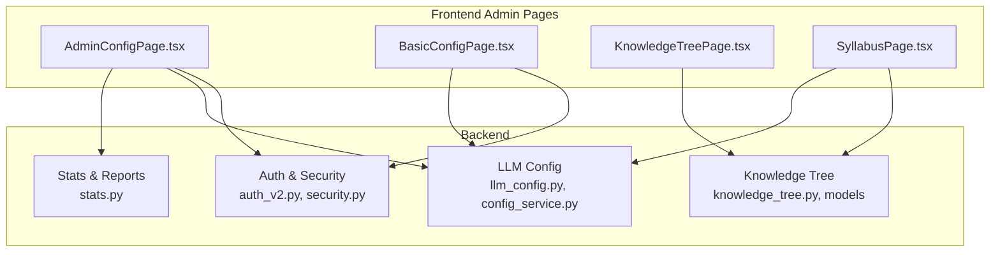
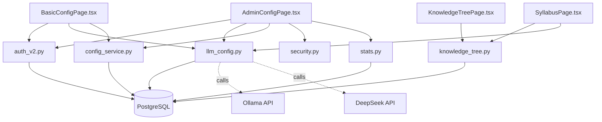
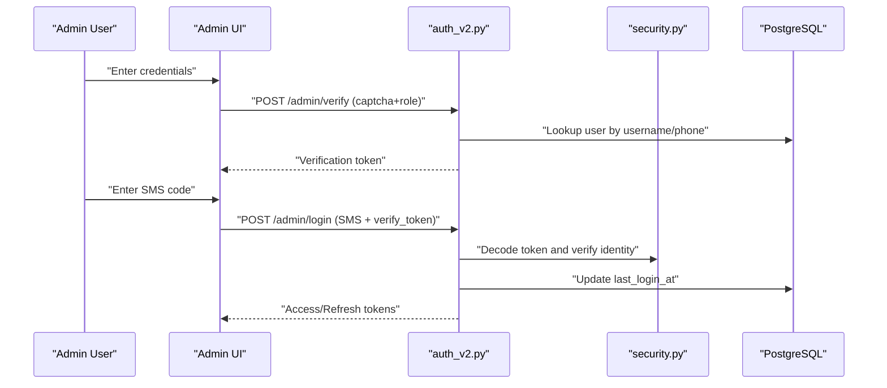
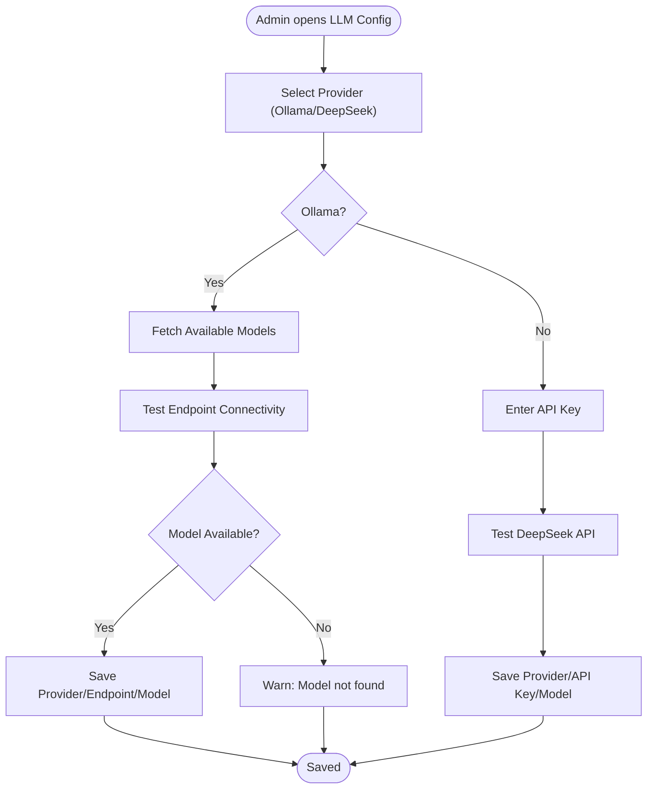
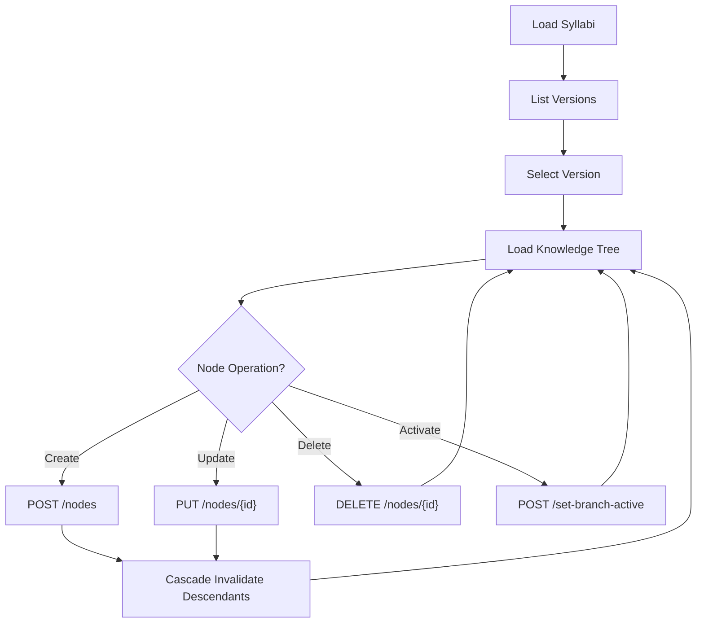
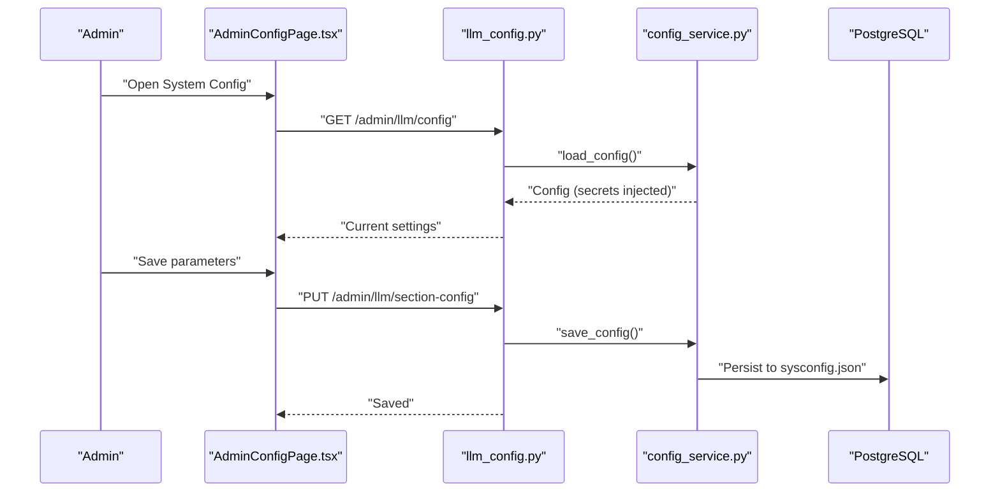
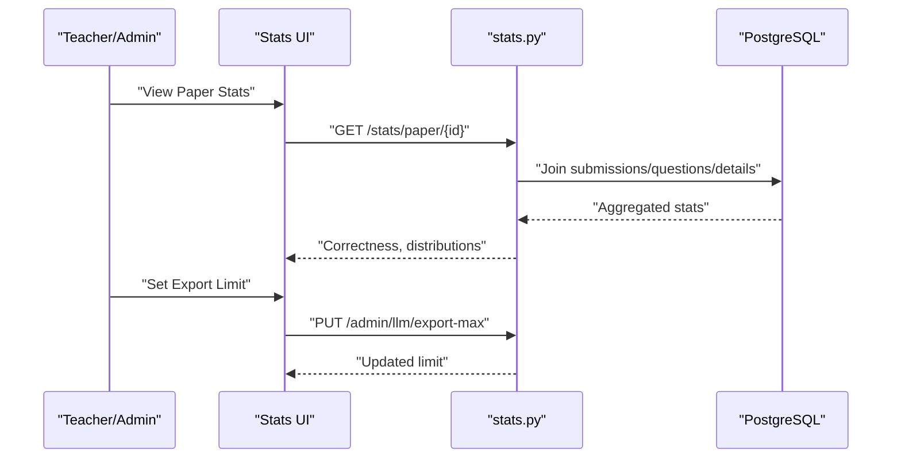
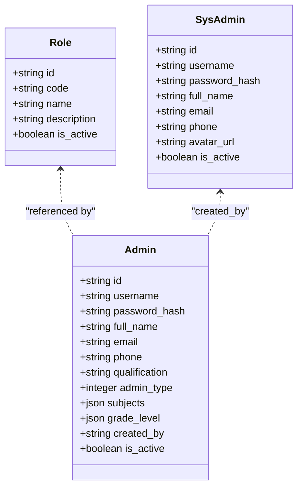
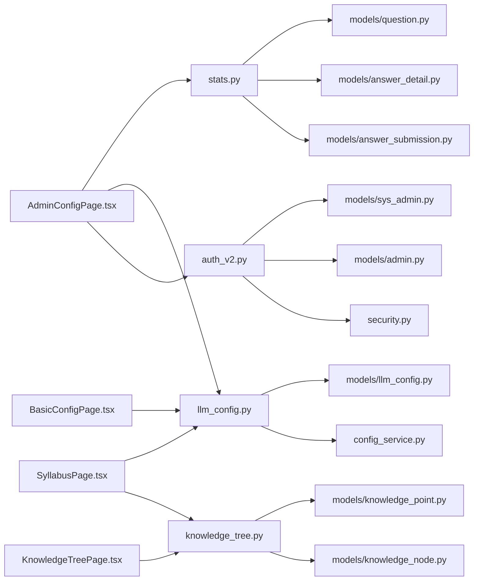

# Administrator Tools

<cite>
**Referenced Files in This Document**
- [backend/app/api/v1/endpoints/auth_v2.py](file://backend/app/api/v1/endpoints/auth_v2.py)
- [backend/app/core/security.py](file://backend/app/core/security.py)
- [backend/app/models/admin.py](file://backend/app/models/admin.py)
- [backend/app/models/sys_admin.py](file://backend/app/models/sys_admin.py)
- [backend/app/models/role.py](file://backend/app/models/role.py)
- [backend/app/api/v1/endpoints/llm_config.py](file://backend/app/api/v1/endpoints/llm_config.py)
- [backend/app/services/config_service.py](file://backend/app/services/config_service.py)
- [backend/app/models/llm_config.py](file://backend/app/models/llm_config.py)
- [backend/app/api/v1/endpoints/knowledge_tree.py](file://backend/app/api/v1/endpoints/knowledge_tree.py)
- [backend/app/models/knowledge_node.py](file://backend/app/models/knowledge_node.py)
- [backend/app/models/knowledge_point.py](file://backend/app/models/knowledge_point.py)
- [backend/app/api/v1/endpoints/stats.py](file://backend/app/api/v1/endpoints/stats.py)
- [frontend/src/pages/admin/AdminConfigPage.tsx](file://frontend/src/pages/admin/AdminConfigPage.tsx)
- [frontend/src/pages/admin/BasicConfigPage.tsx](file://frontend/src/pages/admin/BasicConfigPage.tsx)
- [frontend/src/pages/admin/KnowledgeTreePage.tsx](file://frontend/src/pages/admin/KnowledgeTreePage.tsx)
- [frontend/src/pages/admin/SyllabusPage.tsx](file://frontend/src/pages/admin/SyllabusPage.tsx)
</cite>

## Table of Contents
1. [Introduction](#introduction)
2. [Project Structure](#project-structure)
3. [Core Components](#core-components)
4. [Architecture Overview](#architecture-overview)
5. [Detailed Component Analysis](#detailed-component-analysis)
6. [Dependency Analysis](#dependency-analysis)
7. [Performance Considerations](#performance-considerations)
8. [Troubleshooting Guide](#troubleshooting-guide)
9. [Conclusion](#conclusion)
10. [Appendices](#appendices)

## Introduction
This document describes the system administration capabilities for the educational platform, focusing on:
- System configuration and maintenance
- User and role management
- LLM configuration, model management, and AI service integration
- Knowledge tree management, syllabus administration, and content organization
- Monitoring, performance metrics, and operational workflows
- Backup and recovery procedures, data migration tools, and system health monitoring
- Practical setup and administration workflows

It targets administrators who need to configure, operate, and maintain the system effectively.

## Project Structure
The administration surface spans backend API endpoints and models, plus frontend admin pages that expose configuration and management features.

**Diagram sources**
- [backend/app/api/v1/endpoints/auth_v2.py:1-476](file://backend/app/api/v1/endpoints/auth_v2.py#L1-L476)
- [backend/app/core/security.py:1-104](file://backend/app/core/security.py#L1-L104)
- [backend/app/api/v1/endpoints/llm_config.py:1-186](file://backend/app/api/v1/endpoints/llm_config.py#L1-L186)
- [backend/app/services/config_service.py:1-155](file://backend/app/services/config_service.py#L1-L155)
- [backend/app/api/v1/endpoints/knowledge_tree.py:1-357](file://backend/app/api/v1/endpoints/knowledge_tree.py#L1-L357)
- [backend/app/models/knowledge_node.py:1-26](file://backend/app/models/knowledge_node.py#L1-L26)
- [backend/app/models/knowledge_point.py:1-27](file://backend/app/models/knowledge_point.py#L1-L27)
- [backend/app/api/v1/endpoints/stats.py:1-251](file://backend/app/api/v1/endpoints/stats.py#L1-L251)
- [frontend/src/pages/admin/AdminConfigPage.tsx:1-401](file://frontend/src/pages/admin/AdminConfigPage.tsx#L1-L401)
- [frontend/src/pages/admin/BasicConfigPage.tsx:1-282](file://frontend/src/pages/admin/BasicConfigPage.tsx#L1-L282)
- [frontend/src/pages/admin/KnowledgeTreePage.tsx:1-340](file://frontend/src/pages/admin/KnowledgeTreePage.tsx#L1-L340)
- [frontend/src/pages/admin/SyllabusPage.tsx:1-239](file://frontend/src/pages/admin/SyllabusPage.tsx#L1-L239)

**Section sources**
- [backend/app/api/v1/endpoints/auth_v2.py:1-476](file://backend/app/api/v1/endpoints/auth_v2.py#L1-L476)
- [backend/app/core/security.py:1-104](file://backend/app/core/security.py#L1-L104)
- [backend/app/api/v1/endpoints/llm_config.py:1-186](file://backend/app/api/v1/endpoints/llm_config.py#L1-L186)
- [backend/app/services/config_service.py:1-155](file://backend/app/services/config_service.py#L1-L155)
- [backend/app/api/v1/endpoints/knowledge_tree.py:1-357](file://backend/app/api/v1/endpoints/knowledge_tree.py#L1-L357)
- [backend/app/models/knowledge_node.py:1-26](file://backend/app/models/knowledge_node.py#L1-L26)
- [backend/app/models/knowledge_point.py:1-27](file://backend/app/models/knowledge_point.py#L1-L27)
- [backend/app/api/v1/endpoints/stats.py:1-251](file://backend/app/api/v1/endpoints/stats.py#L1-L251)
- [frontend/src/pages/admin/AdminConfigPage.tsx:1-401](file://frontend/src/pages/admin/AdminConfigPage.tsx#L1-L401)
- [frontend/src/pages/admin/BasicConfigPage.tsx:1-282](file://frontend/src/pages/admin/BasicConfigPage.tsx#L1-L282)
- [frontend/src/pages/admin/KnowledgeTreePage.tsx:1-340](file://frontend/src/pages/admin/KnowledgeTreePage.tsx#L1-L340)
- [frontend/src/pages/admin/SyllabusPage.tsx:1-239](file://frontend/src/pages/admin/SyllabusPage.tsx#L1-L239)

## Core Components
- Authentication and Authorization
  - Admin login with captcha and SMS verification, JWT token issuance, and role-based access control.
  - Admin user creation, listing, updates, and deletion restricted to system administrators.
- LLM Configuration and AI Services
  - Provider selection (Ollama or DeepSeek), endpoint/model testing, and persistent configuration via sysconfig.json.
  - Environment-based secret injection for sensitive keys.
- Knowledge Tree and Syllabus Administration
  - Versioned knowledge nodes, hierarchical tree operations, branch activation/deactivation, and rollback to historical versions.
  - Syllabus creation/import and knowledge extraction using configured LLM.
- System Configuration and Maintenance
  - Application parameters (grading, OCR, mistake book, export limits), database status, and connection parameter editing.
- Monitoring and Reporting
  - Statistics endpoints for paper and question-level analytics.

**Section sources**
- [backend/app/api/v1/endpoints/auth_v2.py:1-476](file://backend/app/api/v1/endpoints/auth_v2.py#L1-L476)
- [backend/app/core/security.py:1-104](file://backend/app/core/security.py#L1-L104)
- [backend/app/api/v1/endpoints/llm_config.py:1-186](file://backend/app/api/v1/endpoints/llm_config.py#L1-L186)
- [backend/app/services/config_service.py:1-155](file://backend/app/services/config_service.py#L1-L155)
- [backend/app/api/v1/endpoints/knowledge_tree.py:1-357](file://backend/app/api/v1/endpoints/knowledge_tree.py#L1-L357)
- [backend/app/api/v1/endpoints/stats.py:1-251](file://backend/app/api/v1/endpoints/stats.py#L1-L251)

## Architecture Overview
The admin tools integrate frontend pages with backend endpoints secured by JWT and role checks. Configuration is persisted to sysconfig.json with secrets injected from environment variables. Knowledge tree operations enforce versioning and cascading invalidation. LLM and OCR settings are centrally managed and validated.

**Diagram sources**
- [frontend/src/pages/admin/AdminConfigPage.tsx:1-401](file://frontend/src/pages/admin/AdminConfigPage.tsx#L1-L401)
- [frontend/src/pages/admin/BasicConfigPage.tsx:1-282](file://frontend/src/pages/admin/BasicConfigPage.tsx#L1-L282)
- [frontend/src/pages/admin/KnowledgeTreePage.tsx:1-340](file://frontend/src/pages/admin/KnowledgeTreePage.tsx#L1-L340)
- [frontend/src/pages/admin/SyllabusPage.tsx:1-239](file://frontend/src/pages/admin/SyllabusPage.tsx#L1-L239)
- [backend/app/api/v1/endpoints/auth_v2.py:1-476](file://backend/app/api/v1/endpoints/auth_v2.py#L1-L476)
- [backend/app/core/security.py:1-104](file://backend/app/core/security.py#L1-L104)
- [backend/app/api/v1/endpoints/llm_config.py:1-186](file://backend/app/api/v1/endpoints/llm_config.py#L1-L186)
- [backend/app/services/config_service.py:1-155](file://backend/app/services/config_service.py#L1-L155)
- [backend/app/api/v1/endpoints/knowledge_tree.py:1-357](file://backend/app/api/v1/endpoints/knowledge_tree.py#L1-L357)
- [backend/app/api/v1/endpoints/stats.py:1-251](file://backend/app/api/v1/endpoints/stats.py#L1-L251)

## Detailed Component Analysis

### Authentication and Authorization
- Admin login flow:
  - Step 1: Verify captcha and role/password, issue a short-lived verification token.
  - Step 2: Validate SMS code and verification token to issue JWT access/refresh tokens.
- Admin management:
  - System administrators can create, list, update, and delete admin accounts.
  - Filtering supports name, role, activity, subject, and grade.
- Role enforcement:
  - Decorators restrict endpoints to specific roles (e.g., SYS_ADMIN).

**Diagram sources**
- [backend/app/api/v1/endpoints/auth_v2.py:91-183](file://backend/app/api/v1/endpoints/auth_v2.py#L91-L183)
- [backend/app/core/security.py:64-95](file://backend/app/core/security.py#L64-L95)

**Section sources**
- [backend/app/api/v1/endpoints/auth_v2.py:1-476](file://backend/app/api/v1/endpoints/auth_v2.py#L1-L476)
- [backend/app/core/security.py:1-104](file://backend/app/core/security.py#L1-L104)

### LLM Configuration and AI Service Integration
- Provider configuration:
  - Choose Ollama or DeepSeek; persist current provider and model.
  - For Ollama: fetch available models and optionally test model availability.
  - For DeepSeek: validate API connectivity with configured key.
- Secrets handling:
  - API keys are read from environment variables and injected at runtime; never written to sysconfig.json.
- Application parameters:
  - Configure grading concurrency and model, OCR engine and thresholds, mistake book practice counts, and export limits.

**Diagram sources**
- [backend/app/api/v1/endpoints/llm_config.py:28-105](file://backend/app/api/v1/endpoints/llm_config.py#L28-L105)
- [backend/app/services/config_service.py:108-154](file://backend/app/services/config_service.py#L108-L154)

**Section sources**
- [backend/app/api/v1/endpoints/llm_config.py:1-186](file://backend/app/api/v1/endpoints/llm_config.py#L1-L186)
- [backend/app/services/config_service.py:1-155](file://backend/app/services/config_service.py#L1-L155)
- [backend/app/models/llm_config.py:1-20](file://backend/app/models/llm_config.py#L1-L20)

### Knowledge Tree and Syllabus Administration
- Knowledge tree operations:
  - Create/update/delete nodes; set branches active/inactive; cascade invalidation of descendants.
  - Convert flat nodes to nested tree structure for rendering.
- Syllabus lifecycle:
  - Create/import syllabi; extract knowledge using LLM; manage versions and rollbacks.
- Frontend UX:
  - Interactive tree with context menus, version switching, and batch activation controls.

**Diagram sources**
- [backend/app/api/v1/endpoints/knowledge_tree.py:37-357](file://backend/app/api/v1/endpoints/knowledge_tree.py#L37-L357)
- [backend/app/models/knowledge_node.py:9-26](file://backend/app/models/knowledge_node.py#L9-L26)

**Section sources**
- [backend/app/api/v1/endpoints/knowledge_tree.py:1-357](file://backend/app/api/v1/endpoints/knowledge_tree.py#L1-L357)
- [backend/app/models/knowledge_node.py:1-26](file://backend/app/models/knowledge_node.py#L1-L26)
- [backend/app/models/knowledge_point.py:1-27](file://backend/app/models/knowledge_point.py#L1-L27)
- [frontend/src/pages/admin/KnowledgeTreePage.tsx:1-340](file://frontend/src/pages/admin/KnowledgeTreePage.tsx#L1-L340)
- [frontend/src/pages/admin/SyllabusPage.tsx:1-239](file://frontend/src/pages/admin/SyllabusPage.tsx#L1-L239)

### System Configuration and Maintenance
- Application parameters:
  - Grading: concurrent grading threads and model selection.
  - OCR: engine, concurrency, and confidence threshold.
  - Mistake book: practice question count per error.
  - Export limits: maximum exported items.
- Database status and configuration:
  - View PostgreSQL status (size, tables, rows, version).
  - Edit connection parameters; password changes are supported but require restart to take effect.

**Diagram sources**
- [backend/app/api/v1/endpoints/llm_config.py:151-175](file://backend/app/api/v1/endpoints/llm_config.py#L151-L175)
- [backend/app/services/config_service.py:65-106](file://backend/app/services/config_service.py#L65-L106)
- [frontend/src/pages/admin/AdminConfigPage.tsx:95-111](file://frontend/src/pages/admin/AdminConfigPage.tsx#L95-L111)

**Section sources**
- [backend/app/api/v1/endpoints/llm_config.py:138-175](file://backend/app/api/v1/endpoints/llm_config.py#L138-L175)
- [backend/app/services/config_service.py:1-155](file://backend/app/services/config_service.py#L1-L155)
- [frontend/src/pages/admin/AdminConfigPage.tsx:1-401](file://frontend/src/pages/admin/AdminConfigPage.tsx#L1-L401)
- [frontend/src/pages/admin/BasicConfigPage.tsx:1-282](file://frontend/src/pages/admin/BasicConfigPage.tsx#L1-L282)

### Monitoring, Performance Metrics, and Reporting
- Paper and question statistics:
  - Teachers and administrators can list papers and view question-level correctness, attempts, and choice distributions.
- Export limits:
  - Administrators can set maximum export counts to control resource usage.

**Diagram sources**
- [backend/app/api/v1/endpoints/stats.py:17-137](file://backend/app/api/v1/endpoints/stats.py#L17-L137)
- [backend/app/api/v1/endpoints/llm_config.py:138-148](file://backend/app/api/v1/endpoints/llm_config.py#L138-L148)

**Section sources**
- [backend/app/api/v1/endpoints/stats.py:1-251](file://backend/app/api/v1/endpoints/stats.py#L1-L251)
- [backend/app/api/v1/endpoints/llm_config.py:138-148](file://backend/app/api/v1/endpoints/llm_config.py#L138-L148)

### User and Role Management
- Roles and permissions:
  - Role reference table and role-based access control enforced via decorators.
- Admin users:
  - System administrators can create teacher and question administrator accounts with subjects and grades.
  - Listing supports filtering by name, role, activity, subject, and grade.

**Diagram sources**
- [backend/app/models/role.py:8-17](file://backend/app/models/role.py#L8-L17)
- [backend/app/models/sys_admin.py:8-22](file://backend/app/models/sys_admin.py#L8-L22)
- [backend/app/models/admin.py:9-27](file://backend/app/models/admin.py#L9-L27)

**Section sources**
- [backend/app/models/role.py:1-17](file://backend/app/models/role.py#L1-L17)
- [backend/app/models/sys_admin.py:1-22](file://backend/app/models/sys_admin.py#L1-L22)
- [backend/app/models/admin.py:1-27](file://backend/app/models/admin.py#L1-L27)
- [backend/app/api/v1/endpoints/auth_v2.py:242-361](file://backend/app/api/v1/endpoints/auth_v2.py#L242-L361)

## Dependency Analysis
- Backend dependencies:
  - Authentication depends on security utilities and database models.
  - LLM configuration depends on config service and external LLM APIs.
  - Knowledge tree depends on syllabus and node models.
  - Stats depend on submission and question models.
- Frontend dependencies:
  - Admin pages consume backend endpoints and present forms and tables.
- Coupling and cohesion:
  - Endpoints are cohesive around domain concerns (auth, LLM, knowledge tree, stats).
  - Security decorators centralize role checks.

**Diagram sources**
- [backend/app/api/v1/endpoints/auth_v2.py:1-476](file://backend/app/api/v1/endpoints/auth_v2.py#L1-L476)
- [backend/app/core/security.py:1-104](file://backend/app/core/security.py#L1-L104)
- [backend/app/api/v1/endpoints/llm_config.py:1-186](file://backend/app/api/v1/endpoints/llm_config.py#L1-L186)
- [backend/app/services/config_service.py:1-155](file://backend/app/services/config_service.py#L1-L155)
- [backend/app/api/v1/endpoints/knowledge_tree.py:1-357](file://backend/app/api/v1/endpoints/knowledge_tree.py#L1-L357)
- [backend/app/models/knowledge_node.py:1-26](file://backend/app/models/knowledge_node.py#L1-L26)
- [backend/app/models/knowledge_point.py:1-27](file://backend/app/models/knowledge_point.py#L1-L27)
- [backend/app/api/v1/endpoints/stats.py:1-251](file://backend/app/api/v1/endpoints/stats.py#L1-L251)
- [frontend/src/pages/admin/AdminConfigPage.tsx:1-401](file://frontend/src/pages/admin/AdminConfigPage.tsx#L1-L401)
- [frontend/src/pages/admin/BasicConfigPage.tsx:1-282](file://frontend/src/pages/admin/BasicConfigPage.tsx#L1-L282)
- [frontend/src/pages/admin/KnowledgeTreePage.tsx:1-340](file://frontend/src/pages/admin/KnowledgeTreePage.tsx#L1-L340)
- [frontend/src/pages/admin/SyllabusPage.tsx:1-239](file://frontend/src/pages/admin/SyllabusPage.tsx#L1-L239)

**Section sources**
- [backend/app/api/v1/endpoints/auth_v2.py:1-476](file://backend/app/api/v1/endpoints/auth_v2.py#L1-L476)
- [backend/app/api/v1/endpoints/llm_config.py:1-186](file://backend/app/api/v1/endpoints/llm_config.py#L1-L186)
- [backend/app/api/v1/endpoints/knowledge_tree.py:1-357](file://backend/app/api/v1/endpoints/knowledge_tree.py#L1-L357)
- [backend/app/api/v1/endpoints/stats.py:1-251](file://backend/app/api/v1/endpoints/stats.py#L1-L251)

## Performance Considerations
- Concurrency controls:
  - Grading and OCR concurrency are configurable to balance throughput and resource usage.
- Export limits:
  - Enforce upper bounds on exports to prevent excessive load.
- Model warm-up:
  - Ollama model testing triggers initial load to reduce latency for subsequent requests.
- Database indexing:
  - Knowledge nodes and syllabi are indexed appropriately to support queries on version and hierarchy.

[No sources needed since this section provides general guidance]

## Troubleshooting Guide
- Admin login issues:
  - Verify captcha and role/password; ensure the user exists and is active.
  - Confirm SMS verification and that the verification token is fresh.
- LLM configuration failures:
  - For Ollama: confirm endpoint accessibility and that the chosen model appears in the fetched model list.
  - For DeepSeek: ensure API key is present and reachable.
- Knowledge tree invalidation:
  - Updating a node cascades invalidation to descendants; reactivate subtrees as needed.
- Database connectivity:
  - After updating connection parameters, restart the backend for changes to take effect.

**Section sources**
- [backend/app/api/v1/endpoints/auth_v2.py:91-183](file://backend/app/api/v1/endpoints/auth_v2.py#L91-L183)
- [backend/app/api/v1/endpoints/llm_config.py:61-105](file://backend/app/api/v1/endpoints/llm_config.py#L61-L105)
- [backend/app/api/v1/endpoints/knowledge_tree.py:131-144](file://backend/app/api/v1/endpoints/knowledge_tree.py#L131-L144)
- [frontend/src/pages/admin/AdminConfigPage.tsx:143-152](file://frontend/src/pages/admin/AdminConfigPage.tsx#L143-L152)

## Conclusion
The administrator tools provide a comprehensive toolkit for configuring and operating the system. Administrators can manage users and roles, configure LLM and OCR services, maintain knowledge trees and syllabi, monitor performance, and adjust system parameters. The design emphasizes secure authentication, centralized configuration, and intuitive frontend interfaces.

[No sources needed since this section summarizes without analyzing specific files]

## Appendices

### Administrative Workflows

- System setup workflow
  - Configure LLM provider and endpoint/model; test connectivity; save configuration.
  - Set OCR parameters and export limits.
  - Review database status and update connection parameters if needed.

- User administration process
  - Create admin accounts with appropriate roles and subject/grade assignments.
  - List, filter, update, and deactivate accounts as needed.

- Knowledge tree and syllabus management
  - Create or import syllabi; extract knowledge using the configured LLM.
  - Build and organize knowledge trees; activate/deactivate branches; create new versions; rollback when necessary.

- Monitoring and reporting
  - Review paper and question statistics; adjust export limits; track system logs and database metrics.

[No sources needed since this section provides general guidance]