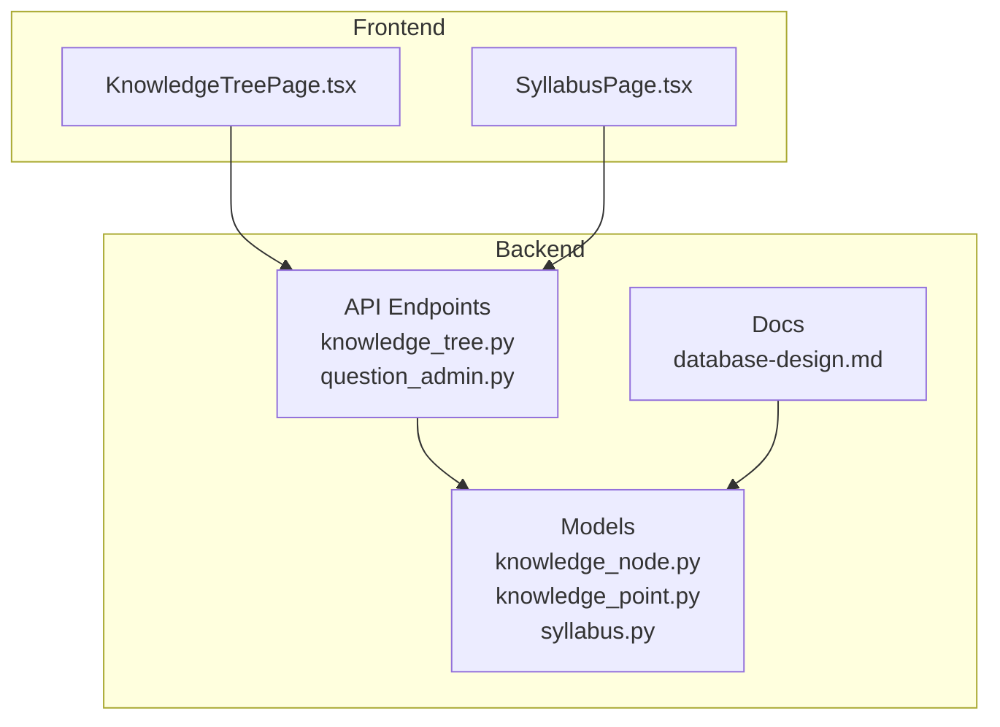
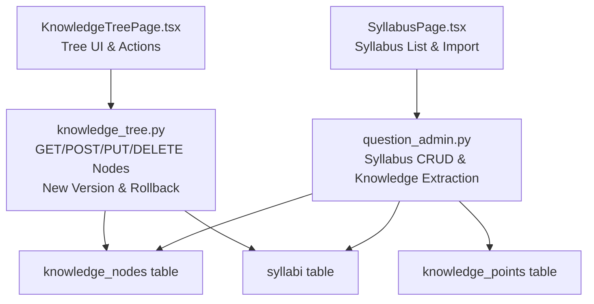
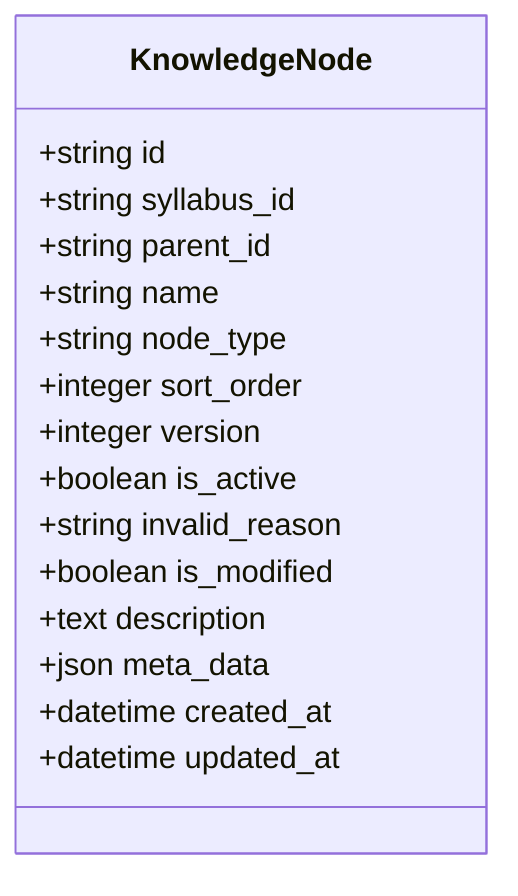
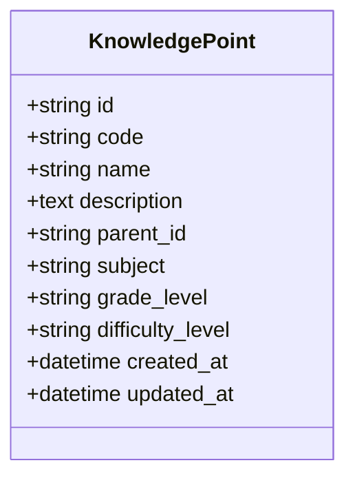
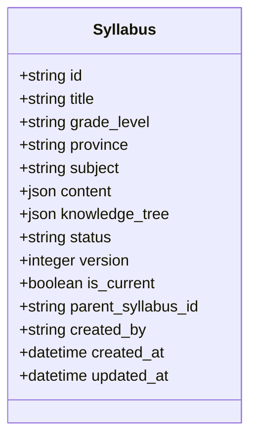
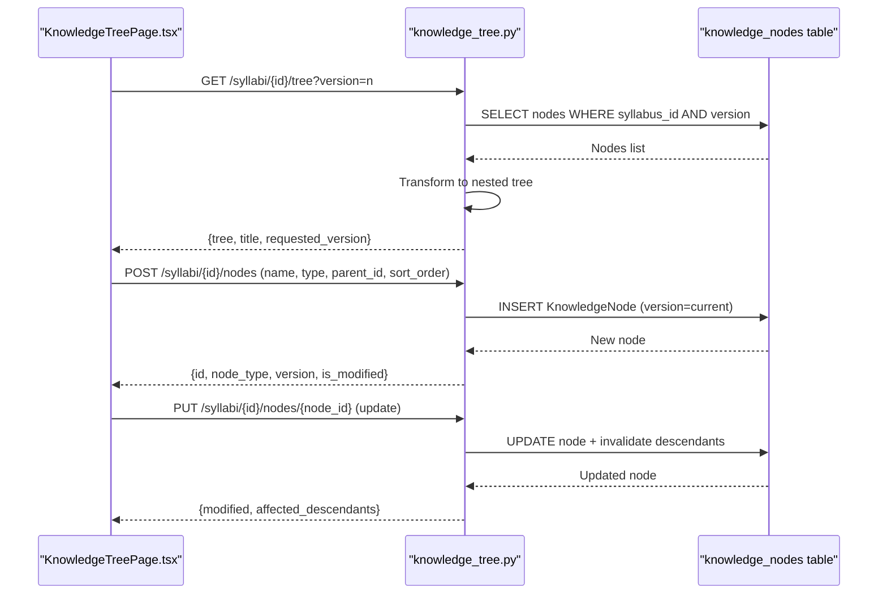
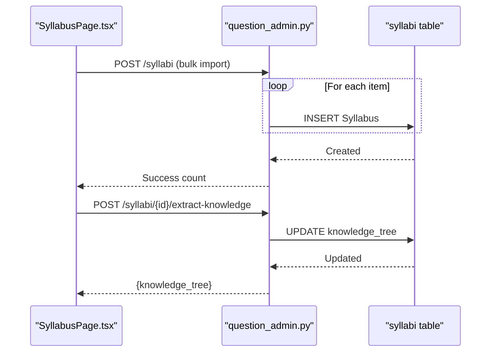
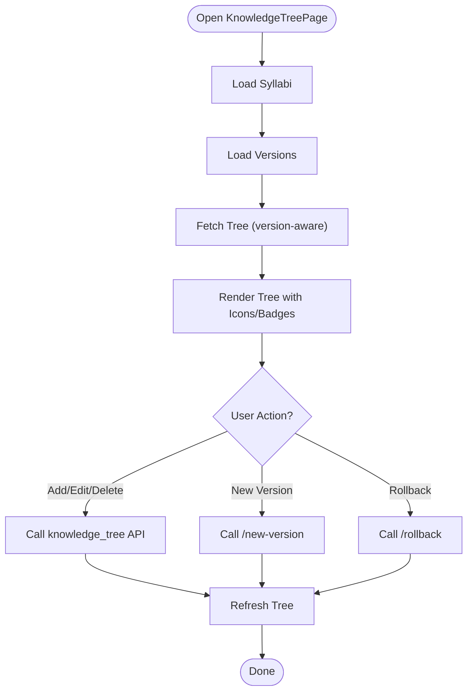
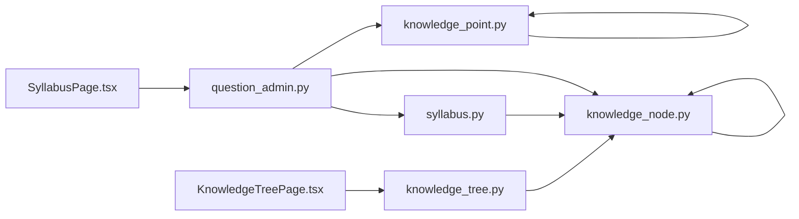

# Knowledge Tree Management

<cite>
**Referenced Files in This Document**
- [knowledge_node.py](file://backend/app/models/knowledge_node.py)
- [knowledge_point.py](file://backend/app/models/knowledge_point.py)
- [syllabus.py](file://backend/app/models/syllabus.py)
- [knowledge_tree.py](file://backend/app/api/v1/endpoints/knowledge_tree.py)
- [question_admin.py](file://backend/app/api/v1/endpoints/question_admin.py)
- [KnowledgeTreePage.tsx](file://frontend/src/pages/admin/KnowledgeTreePage.tsx)
- [SyllabusPage.tsx](file://frontend/src/pages/admin/SyllabusPage.tsx)
- [database-design.md](file://docs/database-design.md)
</cite>

## Table of Contents
1. [Introduction](#introduction)
2. [Project Structure](#project-structure)
3. [Core Components](#core-components)
4. [Architecture Overview](#architecture-overview)
5. [Detailed Component Analysis](#detailed-component-analysis)
6. [Dependency Analysis](#dependency-analysis)
7. [Performance Considerations](#performance-considerations)
8. [Troubleshooting Guide](#troubleshooting-guide)
9. [Conclusion](#conclusion)
10. [Appendices](#appendices)

## Introduction
This document explains the Knowledge Tree Management subsystem responsible for curriculum mapping, knowledge node organization, and syllabus administration. It covers the knowledge tree structure, node hierarchy management, point-to-node relationships, syllabus creation and versioning, content organization, prerequisite relationships, learning pathway design, bulk content import, tree visualization tools, and practical workflows for setup and administration.

## Project Structure
The Knowledge Tree Management spans backend models and endpoints, and a frontend UI for administration and visualization.

**Diagram sources**
- [knowledge_node.py:1-26](file://backend/app/models/knowledge_node.py#L1-L26)
- [knowledge_point.py:1-27](file://backend/app/models/knowledge_point.py#L1-L27)
- [syllabus.py:1-26](file://backend/app/models/syllabus.py#L1-L26)
- [knowledge_tree.py:1-357](file://backend/app/api/v1/endpoints/knowledge_tree.py#L1-L357)
- [question_admin.py:1-800](file://backend/app/api/v1/endpoints/question_admin.py#L1-L800)
- [KnowledgeTreePage.tsx:1-340](file://frontend/src/pages/admin/KnowledgeTreePage.tsx#L1-L340)
- [SyllabusPage.tsx:1-239](file://frontend/src/pages/admin/SyllabusPage.tsx#L1-L239)
- [database-design.md:1-540](file://docs/database-design.md#L1-L540)

**Section sources**
- [knowledge_node.py:1-26](file://backend/app/models/knowledge_node.py#L1-L26)
- [knowledge_point.py:1-27](file://backend/app/models/knowledge_point.py#L1-L27)
- [syllabus.py:1-26](file://backend/app/models/syllabus.py#L1-L26)
- [knowledge_tree.py:1-357](file://backend/app/api/v1/endpoints/knowledge_tree.py#L1-L357)
- [question_admin.py:1-800](file://backend/app/api/v1/endpoints/question_admin.py#L1-L800)
- [KnowledgeTreePage.tsx:1-340](file://frontend/src/pages/admin/KnowledgeTreePage.tsx#L1-L340)
- [SyllabusPage.tsx:1-239](file://frontend/src/pages/admin/SyllabusPage.tsx#L1-L239)
- [database-design.md:1-540](file://docs/database-design.md#L1-L540)

## Core Components
- KnowledgeNode: Hierarchical nodes representing syllabus knowledge areas and points, versioned and trackable.
- KnowledgePoint: Independent knowledge concept records with subject and grade-level tagging.
- Syllabus: Curriculum container with structured content and embedded knowledge tree snapshots.
- Knowledge Tree API: CRUD and versioning operations for knowledge nodes and tree retrieval.
- Syllabus API: Creation, knowledge extraction, and bulk import of syllabi.
- Frontend Pages: Interactive UI for managing syllabi, extracting knowledge, and editing knowledge trees.

**Section sources**
- [knowledge_node.py:9-26](file://backend/app/models/knowledge_node.py#L9-L26)
- [knowledge_point.py:7-27](file://backend/app/models/knowledge_point.py#L7-L27)
- [syllabus.py:9-26](file://backend/app/models/syllabus.py#L9-L26)
- [knowledge_tree.py:37-357](file://backend/app/api/v1/endpoints/knowledge_tree.py#L37-L357)
- [question_admin.py:23-106](file://backend/app/api/v1/endpoints/question_admin.py#L23-L106)
- [KnowledgeTreePage.tsx:30-340](file://frontend/src/pages/admin/KnowledgeTreePage.tsx#L30-L340)
- [SyllabusPage.tsx:11-239](file://frontend/src/pages/admin/SyllabusPage.tsx#L11-L239)

## Architecture Overview
The system separates concerns across models, endpoints, and UI:
- Models define the persistent structures for syllabi, knowledge nodes, and knowledge points.
- Endpoints expose RESTful operations for syllabus and knowledge tree management.
- Frontend pages provide interactive controls for syllabus creation, knowledge extraction, and tree editing.

**Diagram sources**
- [knowledge_tree.py:37-357](file://backend/app/api/v1/endpoints/knowledge_tree.py#L37-L357)
- [question_admin.py:23-106](file://backend/app/api/v1/endpoints/question_admin.py#L23-L106)
- [knowledge_node.py:9-26](file://backend/app/models/knowledge_node.py#L9-L26)
- [syllabus.py:9-26](file://backend/app/models/syllabus.py#L9-L26)
- [knowledge_point.py:7-27](file://backend/app/models/knowledge_point.py#L7-L27)
- [KnowledgeTreePage.tsx:30-340](file://frontend/src/pages/admin/KnowledgeTreePage.tsx#L30-L340)
- [SyllabusPage.tsx:11-239](file://frontend/src/pages/admin/SyllabusPage.tsx#L11-L239)

## Detailed Component Analysis

### KnowledgeNode Model and Hierarchy
- Purpose: Store hierarchical knowledge nodes linked to a syllabus, supporting area and point types, ordering, activity tracking, and versioning.
- Key attributes:
  - syllabus_id: Links node to a syllabus.
  - parent_id: Self-reference forming the tree.
  - node_type: AREA or POINT.
  - version: Tracks node version for curriculum changes.
  - is_active and invalid_reason: Track validity and reason for deactivation.
  - sort_order: Controls display order.
  - meta_data and description: Optional metadata and notes.
- Behavior:
  - Updating a node marks it modified and invalidates descendants to maintain curriculum consistency.
  - Deleting a branch sets subtree inactive and updates reasons.

**Diagram sources**
- [knowledge_node.py:9-26](file://backend/app/models/knowledge_node.py#L9-L26)

**Section sources**
- [knowledge_node.py:9-26](file://backend/app/models/knowledge_node.py#L9-L26)
- [knowledge_tree.py:131-144](file://backend/app/api/v1/endpoints/knowledge_tree.py#L131-L144)
- [knowledge_tree.py:162-177](file://backend/app/api/v1/endpoints/knowledge_tree.py#L162-L177)
- [knowledge_tree.py:180-196](file://backend/app/api/v1/endpoints/knowledge_tree.py#L180-L196)

### KnowledgePoint Model
- Purpose: Represent standalone knowledge concepts with subject and grade-level tagging.
- Use cases:
  - Content mapping to knowledge nodes.
  - Prerequisite modeling via parent_id.
  - Difficulty and categorization for learning pathways.

**Diagram sources**
- [knowledge_point.py:7-27](file://backend/app/models/knowledge_point.py#L7-L27)

**Section sources**
- [knowledge_point.py:7-27](file://backend/app/models/knowledge_point.py#L7-L27)

### Syllabus Model and Knowledge Tree Snapshot
- Purpose: Encapsulate curriculum metadata and embed a knowledge tree snapshot for quick retrieval.
- Fields:
  - title, grade_level, province, subject.
  - content and knowledge_tree: Structured JSON snapshots.
  - status, version, is_current, parent_syllabus_id: Versioning chain.
  - created_by: Audit trail.

**Diagram sources**
- [syllabus.py:9-26](file://backend/app/models/syllabus.py#L9-L26)

**Section sources**
- [syllabus.py:9-26](file://backend/app/models/syllabus.py#L9-L26)
- [database-design.md:138-150](file://docs/database-design.md#L138-L150)

### Knowledge Tree API Workflow
- Retrieval:
  - GET /knowledge-tree/syllabi/{syllabus_id}/tree?version={n}
  - Returns flattened nodes transformed into a nested tree with metadata.
- Creation:
  - POST /knowledge-tree/syllabi/{syllabus_id}/nodes
  - Creates a node at the specified version and marks it modified.
- Update:
  - PUT /knowledge-tree/syllabi/{syllabus_id}/nodes/{node_id}
  - Updates node attributes and invalidates descendants.
- Activation Control:
  - POST /knowledge-tree/syllabi/{syllabus_id}/nodes/{node_id}/set-branch-active
  - Recursively activates or deactivates subtrees.
- Deletion:
  - DELETE /knowledge-tree/syllabi/{syllabus_id}/nodes/{node_id}
  - Marks subtree inactive and sets reason.
- Versioning:
  - POST /knowledge-tree/syllabi/{syllabus_id}/new-version
  - Copies active nodes to a new version.
  - PUT /knowledge-tree/syllabi/{syllabus_id}/rollback
  - Rolls back to a specific historical version.

**Diagram sources**
- [knowledge_tree.py:37-128](file://backend/app/api/v1/endpoints/knowledge_tree.py#L37-L128)
- [knowledge_node.py:9-26](file://backend/app/models/knowledge_node.py#L9-L26)
- [KnowledgeTreePage.tsx:54-109](file://frontend/src/pages/admin/KnowledgeTreePage.tsx#L54-L109)

**Section sources**
- [knowledge_tree.py:37-357](file://backend/app/api/v1/endpoints/knowledge_tree.py#L37-L357)
- [KnowledgeTreePage.tsx:54-137](file://frontend/src/pages/admin/KnowledgeTreePage.tsx#L54-L137)

### Syllabus API and Knowledge Extraction
- Creation:
  - POST /question-admin/syllabi with title, grade_level, province, subject.
- Listing and retrieval:
  - GET /question-admin/syllabi and GET /question-admin/syllabi/{id}.
- Knowledge extraction:
  - POST /question-admin/syllabi/{id}/extract-knowledge
  - Stores a generated knowledge_tree into the syllabus record.
- Bulk import:
  - SyllabusPage downloads template, parses Excel/JSON, and posts multiple syllabi.

**Diagram sources**
- [question_admin.py:23-106](file://backend/app/api/v1/endpoints/question_admin.py#L23-L106)
- [SyllabusPage.tsx:64-114](file://frontend/src/pages/admin/SyllabusPage.tsx#L64-L114)

**Section sources**
- [question_admin.py:23-106](file://backend/app/api/v1/endpoints/question_admin.py#L23-L106)
- [SyllabusPage.tsx:64-114](file://frontend/src/pages/admin/SyllabusPage.tsx#L64-L114)

### Frontend Administration and Visualization
- KnowledgeTreePage:
  - Loads syllabi and versions, renders nested tree with icons and badges.
  - Supports adding/editing/deleting nodes, activating subtrees, and creating new versions.
- SyllabusPage:
  - Lists syllabi with filters, extracts knowledge, and displays knowledge tree preview.
  - Provides import modal with template download and JSON paste support.

**Diagram sources**
- [KnowledgeTreePage.tsx:46-137](file://frontend/src/pages/admin/KnowledgeTreePage.tsx#L46-L137)
- [knowledge_tree.py:199-357](file://backend/app/api/v1/endpoints/knowledge_tree.py#L199-L357)

**Section sources**
- [KnowledgeTreePage.tsx:30-340](file://frontend/src/pages/admin/KnowledgeTreePage.tsx#L30-L340)
- [SyllabusPage.tsx:11-239](file://frontend/src/pages/admin/SyllabusPage.tsx#L11-L239)

## Dependency Analysis
- Models:
  - KnowledgeNode depends on Syllabus via syllabus_id and supports self-referencing via parent_id.
  - KnowledgePoint supports hierarchical relationships via parent_id and is tagged by subject and grade.
- Endpoints:
  - Knowledge Tree API orchestrates node lifecycle and versioning.
  - Syllabus API manages syllabus lifecycle and integrates knowledge extraction.
- Frontend:
  - UI components call endpoints and reflect state changes.

**Diagram sources**
- [syllabus.py:9-26](file://backend/app/models/syllabus.py#L9-L26)
- [knowledge_node.py:9-26](file://backend/app/models/knowledge_node.py#L9-L26)
- [knowledge_point.py:7-27](file://backend/app/models/knowledge_point.py#L7-L27)
- [knowledge_tree.py:37-357](file://backend/app/api/v1/endpoints/knowledge_tree.py#L37-L357)
- [question_admin.py:23-106](file://backend/app/api/v1/endpoints/question_admin.py#L23-L106)
- [KnowledgeTreePage.tsx:30-340](file://frontend/src/pages/admin/KnowledgeTreePage.tsx#L30-L340)
- [SyllabusPage.tsx:11-239](file://frontend/src/pages/admin/SyllabusPage.tsx#L11-L239)

**Section sources**
- [database-design.md:497-512](file://docs/database-design.md#L497-L512)

## Performance Considerations
- Indexing:
  - KnowledgeNode: syllabus_id and version combination, parent_id for tree navigation.
  - KnowledgePoint: subject and grade_level indexing for filtering and mapping.
- Query patterns:
  - Prefer fetching nodes by syllabus_id and version to minimize scans.
  - Use ordered queries by sort_order for predictable rendering.
- Invalidation:
  - Descendant invalidation is recursive; batch updates and limit deep trees to reduce cascade costs.
- Frontend:
  - Expand only visible branches and lazy-load tree data when possible.

**Section sources**
- [database-design.md:170](file://docs/database-design.md#L170)
- [knowledge_tree.py:131-144](file://backend/app/api/v1/endpoints/knowledge_tree.py#L131-L144)

## Troubleshooting Guide
- Permission errors:
  - Certain endpoints require QUESTION_ADMIN or SYS_ADMIN roles.
- Not found errors:
  - Syllabus or node missing returns 404; verify identifiers and versioning.
- Validation:
  - Node updates mark descendants invalid; confirm upstream changes if downstream nodes appear deactivated.
- Rollback:
  - Ensure target version exists in the version chain; otherwise, rollback fails.

**Section sources**
- [knowledge_tree.py:75-81](file://backend/app/api/v1/endpoints/knowledge_tree.py#L75-L81)
- [knowledge_tree.py:254-300](file://backend/app/api/v1/endpoints/knowledge_tree.py#L254-L300)
- [question_admin.py:92-97](file://backend/app/api/v1/endpoints/question_admin.py#L92-L97)

## Conclusion
The Knowledge Tree Management system provides a robust framework for curriculum mapping and syllabus administration. It supports hierarchical knowledge organization, versioning, and bulk operations, with a responsive frontend for interactive management. The modular design enables scalable content organization and curriculum alignment across subjects and grade levels.

## Appendices

### Practical Workflows

- Knowledge Tree Setup
  - Create a syllabus via SyllabusPage.
  - Extract knowledge to populate knowledge_tree.
  - Navigate to KnowledgeTreePage, select syllabus and version, and build the tree using add/edit/delete actions.

- Syllabus Configuration
  - Use SyllabusPage to create, filter, and manage syllabi.
  - Bulk import syllabi using the provided template and import modal.

- Content Mapping Workflows
  - Map KnowledgePoints to KnowledgeNodes by aligning subject and grade-level tags.
  - Use parent_id in KnowledgePoint to define prerequisites and learning pathways.

- Tree Visualization Tools
  - KnowledgeTreePage renders a nested tree with icons indicating node type and badges for activity and modification status.

- Curriculum Versioning
  - Use “New Version” to copy active nodes to a new version.
  - Use “Rollback” to revert to a previous version safely.

[No sources needed since this section summarizes workflows without analyzing specific files]