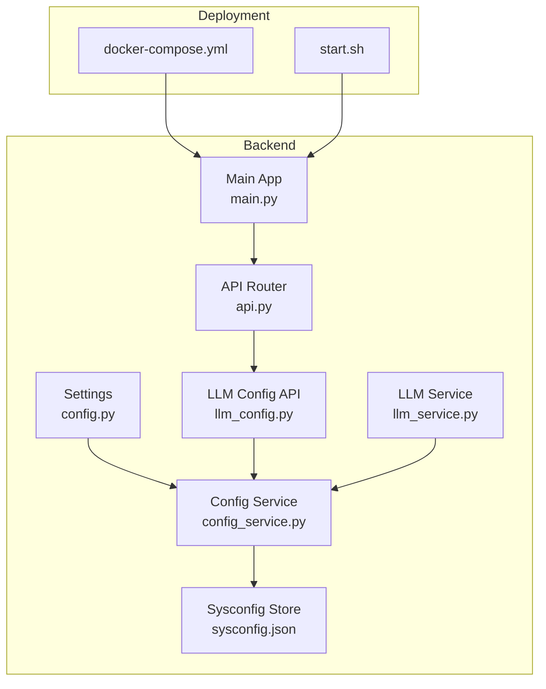
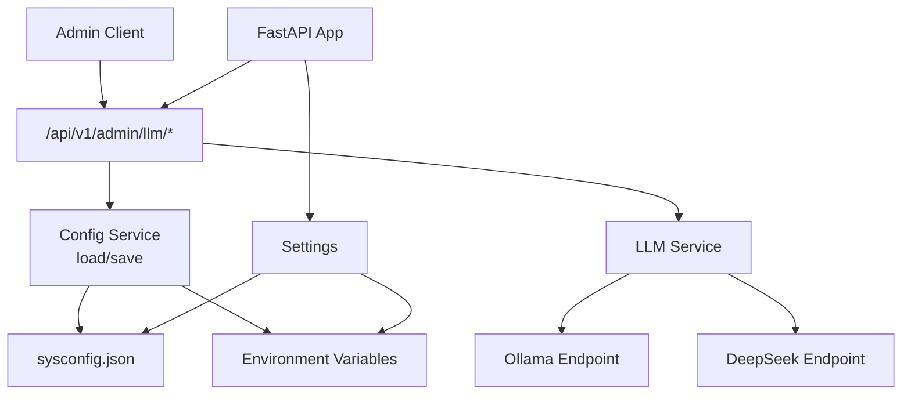
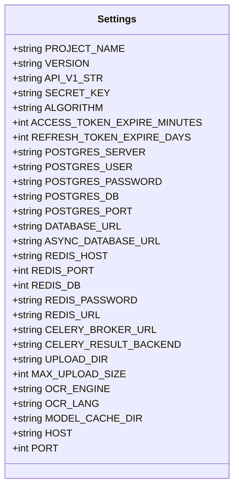
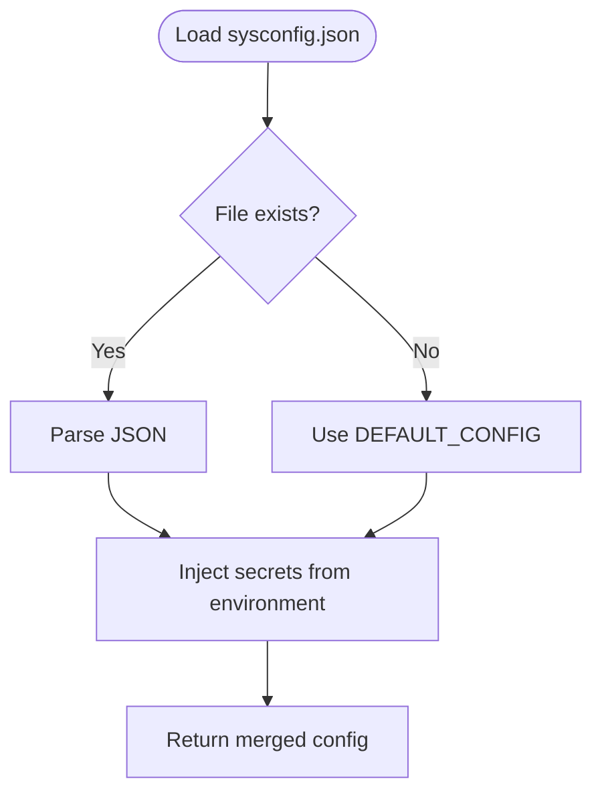
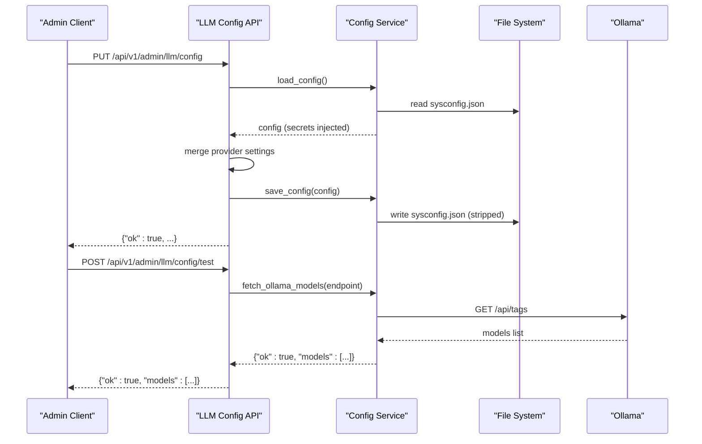
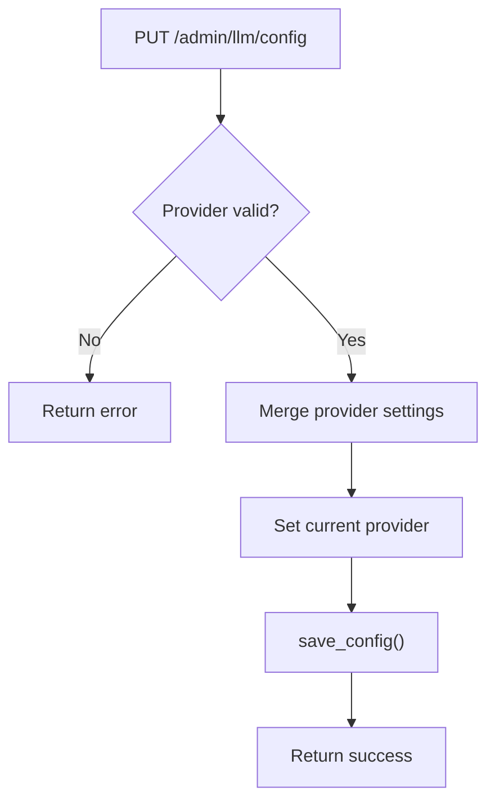
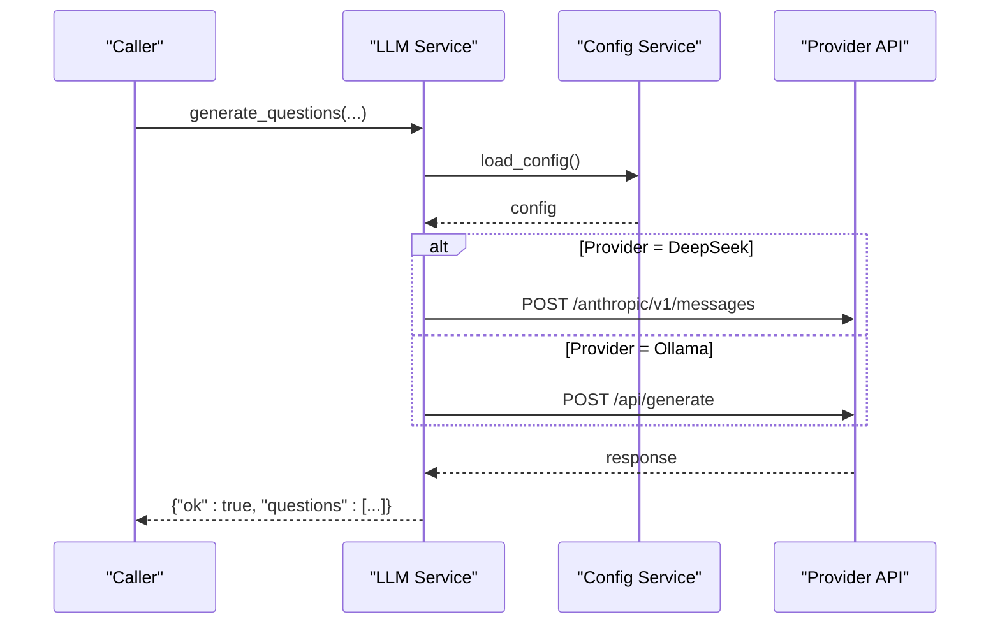
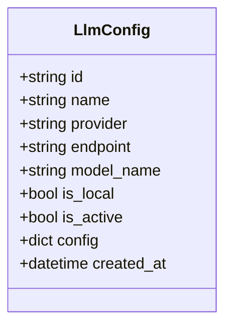
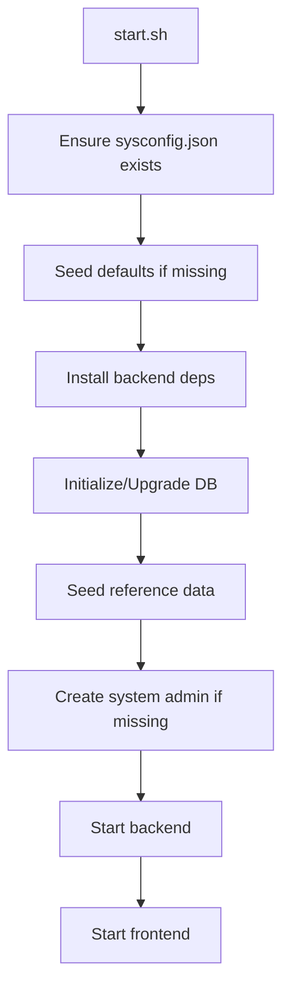
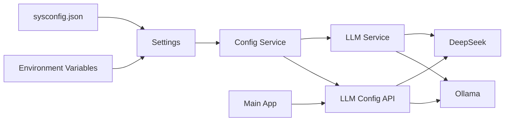

# System Configuration

<cite>
**Referenced Files in This Document**
- [config.py](file://backend/app/core/config.py)
- [config_service.py](file://backend/app/services/config_service.py)
- [llm_config.py](file://backend/app/api/v1/endpoints/llm_config.py)
- [llm_config_model.py](file://backend/app/models/llm_config.py)
- [llm_service.py](file://backend/app/services/llm_service.py)
- [sysconfig.json](file://backend/sysconfig.json)
- [api.py](file://backend/app/api/v1/api.py)
- [main.py](file://backend/app/main.py)
- [docker-compose.yml](file://docker-compose.yml)
- [start.sh](file://start.sh)
- [requirements.txt](file://backend/requirements.txt)
</cite>

## Table of Contents
1. [Introduction](#introduction)
2. [Project Structure](#project-structure)
3. [Core Components](#core-components)
4. [Architecture Overview](#architecture-overview)
5. [Detailed Component Analysis](#detailed-component-analysis)
6. [Dependency Analysis](#dependency-analysis)
7. [Performance Considerations](#performance-considerations)
8. [Troubleshooting Guide](#troubleshooting-guide)
9. [Conclusion](#conclusion)
10. [Appendices](#appendices)

## Introduction
This document provides comprehensive system configuration documentation for the education platform, focusing on Large Language Model (LLM) configuration management, system-wide settings, and AI service integration. It explains how configuration is loaded, validated, persisted, and updated at runtime, and how environment variables and deployment settings influence behavior. It also covers model parameter management, AI service endpoints, and operational procedures such as backup and restore, along with practical examples for setting up LLM models and tuning system behavior.

## Project Structure
The configuration system spans backend configuration classes, a persistent configuration store (sysconfig.json), API endpoints for managing LLM settings, and services that consume these configurations at runtime. Deployment and orchestration are supported via Docker Compose and a bootstrap script.

**Diagram sources**
- [config.py:36-97](file://backend/app/core/config.py#L36-L97)
- [config_service.py:65-105](file://backend/app/services/config_service.py#L65-L105)
- [llm_config.py:17-185](file://backend/app/api/v1/endpoints/llm_config.py#L17-L185)
- [llm_service.py:54-104](file://backend/app/services/llm_service.py#L54-L104)
- [sysconfig.json:1-48](file://backend/sysconfig.json#L1-L48)
- [api.py:1-26](file://backend/app/api/v1/api.py#L1-L26)
- [main.py:1-52](file://backend/app/main.py#L1-L52)
- [docker-compose.yml:1-33](file://docker-compose.yml#L1-L33)
- [start.sh:91-136](file://start.sh#L91-L136)

**Section sources**
- [config.py:1-98](file://backend/app/core/config.py#L1-L98)
- [config_service.py:1-155](file://backend/app/services/config_service.py#L1-L155)
- [llm_config.py:1-186](file://backend/app/api/v1/endpoints/llm_config.py#L1-L186)
- [llm_service.py:1-350](file://backend/app/services/llm_service.py#L1-L350)
- [sysconfig.json:1-48](file://backend/sysconfig.json#L1-L48)
- [api.py:1-26](file://backend/app/api/v1/api.py#L1-L26)
- [main.py:1-52](file://backend/app/main.py#L1-L52)
- [docker-compose.yml:1-33](file://docker-compose.yml#L1-L33)
- [start.sh:91-136](file://start.sh#L91-L136)

## Core Components
- Settings and Environment Integration: Centralized configuration class loads non-sensitive defaults from sysconfig.json and overrides sensitive values from environment variables. It exposes derived properties for database and Redis URLs.
- Persistent Configuration Store: sysconfig.json holds non-sensitive system settings, including database, LLM providers, OCR, grading, and system-level preferences. Secrets are injected at runtime.
- Configuration Service: Provides load/save routines, secret stripping, and helper functions to discover available LLM models and test connectivity.
- LLM Configuration API: Admin endpoints to view/update LLM settings, test connections, and manage per-section configuration.
- LLM Service: Runtime consumer of configuration to call Ollama or DeepSeek APIs for question generation and practice question creation.
- Deployment and Bootstrap: Docker Compose defines environment variables and volume mounts; start.sh ensures sysconfig.json exists, seeds default values, and initializes the database.

**Section sources**
- [config.py:36-97](file://backend/app/core/config.py#L36-L97)
- [config_service.py:65-105](file://backend/app/services/config_service.py#L65-L105)
- [llm_config.py:17-185](file://backend/app/api/v1/endpoints/llm_config.py#L17-L185)
- [llm_service.py:54-104](file://backend/app/services/llm_service.py#L54-L104)
- [sysconfig.json:1-48](file://backend/sysconfig.json#L1-L48)
- [docker-compose.yml:13-20](file://docker-compose.yml#L13-L20)
- [start.sh:91-136](file://start.sh#L91-L136)

## Architecture Overview
The configuration architecture separates concerns:
- Settings encapsulates environment-driven configuration.
- Config Service mediates access to sysconfig.json, ensuring secrets are not persisted.
- API endpoints expose administrative controls for LLM configuration and system settings.
- Services consume configuration for runtime behavior.

**Diagram sources**
- [llm_config.py:17-185](file://backend/app/api/v1/endpoints/llm_config.py#L17-L185)
- [config_service.py:65-105](file://backend/app/services/config_service.py#L65-L105)
- [llm_service.py:54-104](file://backend/app/services/llm_service.py#L54-L104)
- [config.py:36-97](file://backend/app/core/config.py#L36-L97)
- [sysconfig.json:1-48](file://backend/sysconfig.json#L1-L48)

## Detailed Component Analysis

### Settings and Environment Integration
- Loads non-sensitive defaults from sysconfig.json and merges environment overrides for secrets.
- Exposes DATABASE_URL and ASYNC_DATABASE_URL for SQLAlchemy and asyncpg.
- Reads Redis, Celery, upload, OCR, and model cache settings from environment variables.
- Defines project metadata and API versioning.

**Diagram sources**
- [config.py:36-97](file://backend/app/core/config.py#L36-L97)

**Section sources**
- [config.py:36-97](file://backend/app/core/config.py#L36-L97)

### Persistent Configuration Store (sysconfig.json)
- Contains non-sensitive defaults for database, LLM providers, OCR, grading, and system settings.
- Provides default values for current provider, endpoints, and available models.
- Export limit and system log level are configurable.

**Diagram sources**
- [config_service.py:65-78](file://backend/app/services/config_service.py#L65-L78)
- [sysconfig.json:1-48](file://backend/sysconfig.json#L1-L48)

**Section sources**
- [sysconfig.json:1-48](file://backend/sysconfig.json#L1-L48)
- [config_service.py:24-78](file://backend/app/services/config_service.py#L24-L78)

### Configuration Service
- load_config: Reads sysconfig.json and injects secrets from environment variables.
- save_config: Strips sensitive keys before persisting to sysconfig.json.
- fetch_ollama_models: Queries Ollama tags endpoint to discover available models.
- test_llm_connection: Validates endpoint and model availability with a warm-up call.

**Diagram sources**
- [llm_config.py:28-105](file://backend/app/api/v1/endpoints/llm_config.py#L28-L105)
- [config_service.py:108-154](file://backend/app/services/config_service.py#L108-L154)

**Section sources**
- [config_service.py:65-154](file://backend/app/services/config_service.py#L65-L154)

### LLM Configuration API
- GET /api/v1/admin/llm/config: Returns current LLM configuration with secrets redacted.
- PUT /api/v1/admin/llm/config: Updates provider settings and sets current provider.
- POST /api/v1/admin/llm/config/test: Tests connectivity to Ollama or DeepSeek and discovers models.
- GET /api/v1/admin/llm/export-max and PUT /api/v1/admin/llm/export-max: Manages export limit.
- PUT /api/v1/admin/llm/section-config: Saves per-section configuration (grading, OCR, mistake book, system).
- GET /api/v1/admin/llm/config (admin-only): Returns full configuration with secrets redacted.

**Diagram sources**
- [llm_config.py:28-52](file://backend/app/api/v1/endpoints/llm_config.py#L28-L52)

**Section sources**
- [llm_config.py:17-185](file://backend/app/api/v1/endpoints/llm_config.py#L17-L185)

### LLM Service
- Generates questions using either Ollama or DeepSeek based on current provider.
- Builds prompts tailored to question type and difficulty.
- Parses LLM responses robustly, including JSON embedded in code blocks.
- Deduplicates generated questions and supports practice question generation.

**Diagram sources**
- [llm_service.py:54-104](file://backend/app/services/llm_service.py#L54-L104)
- [config_service.py:65-78](file://backend/app/services/config_service.py#L65-L78)

**Section sources**
- [llm_service.py:54-180](file://backend/app/services/llm_service.py#L54-L180)

### LLM Configuration Data Model
- LlmConfig entity stores provider-specific settings, endpoint, model name, and optional JSON configuration.
- Supports active/inactive state and timestamps.

**Diagram sources**
- [llm_config_model.py:8-20](file://backend/app/models/llm_config.py#L8-L20)

**Section sources**
- [llm_config_model.py:1-20](file://backend/app/models/llm_config.py#L1-L20)

### Deployment and Bootstrap
- docker-compose sets environment variables for secrets and binds backend/frontend directories.
- start.sh ensures sysconfig.json exists, seeds defaults if missing, checks dependencies, initializes database, seeds reference data, creates system admin, and starts backend/frontend.

**Diagram sources**
- [start.sh:91-136](file://start.sh#L91-L136)
- [start.sh:171-217](file://start.sh#L171-L217)
- [start.sh:220-264](file://start.sh#L220-L264)
- [docker-compose.yml:13-20](file://docker-compose.yml#L13-L20)

**Section sources**
- [docker-compose.yml:1-33](file://docker-compose.yml#L1-L33)
- [start.sh:91-136](file://start.sh#L91-L136)
- [start.sh:171-217](file://start.sh#L171-L217)
- [start.sh:220-264](file://start.sh#L220-L264)

## Dependency Analysis
- Settings depends on environment variables and sysconfig.json for non-sensitive values.
- Config Service depends on sysconfig.json and environment variables for secrets.
- LLM Config API depends on Config Service for persistence and on external LLM endpoints for validation.
- LLM Service depends on Config Service for runtime configuration and on external LLM endpoints for inference.
- Main app wires middleware and includes API routes.

**Diagram sources**
- [config.py:36-97](file://backend/app/core/config.py#L36-L97)
- [config_service.py:65-105](file://backend/app/services/config_service.py#L65-L105)
- [llm_config.py:17-185](file://backend/app/api/v1/endpoints/llm_config.py#L17-L185)
- [llm_service.py:54-104](file://backend/app/services/llm_service.py#L54-L104)
- [main.py:1-52](file://backend/app/main.py#L1-L52)

**Section sources**
- [config.py:36-97](file://backend/app/core/config.py#L36-L97)
- [config_service.py:65-105](file://backend/app/services/config_service.py#L65-L105)
- [llm_config.py:17-185](file://backend/app/api/v1/endpoints/llm_config.py#L17-L185)
- [llm_service.py:54-104](file://backend/app/services/llm_service.py#L54-L104)
- [main.py:1-52](file://backend/app/main.py#L1-L52)

## Performance Considerations
- Model warm-up: The service performs a lightweight generation call to warm up the model before accepting full workloads.
- Timeout tuning: HTTP timeouts are configured for model discovery and generation to prevent long blocking.
- Concurrency: Grading and OCR concurrency limits are configurable to balance throughput and resource usage.
- Export limits: A configurable cap prevents excessive export operations.

[No sources needed since this section provides general guidance]

## Troubleshooting Guide
- Ollama connectivity failures: Verify endpoint URL and that the service is reachable; use the test endpoint to enumerate available models.
- DeepSeek authentication errors: Confirm the API key environment variable is set and the endpoint is correct.
- Database connection issues: Ensure PostgreSQL is running and credentials match sysconfig.json or environment variables.
- Missing sysconfig.json: The bootstrap script seeds defaults; re-run to regenerate the file if corrupted.
- Secret exposure: Secrets are injected at runtime and stripped before saving; do not rely on storing secrets in sysconfig.json.

**Section sources**
- [config_service.py:108-154](file://backend/app/services/config_service.py#L108-L154)
- [llm_config.py:61-105](file://backend/app/api/v1/endpoints/llm_config.py#L61-L105)
- [start.sh:91-136](file://start.sh#L91-L136)

## Conclusion
The system employs a layered configuration approach: environment variables for secrets, sysconfig.json for non-sensitive defaults, and runtime injection for dynamic values. Administrative endpoints enable safe, audited updates to LLM providers and system settings, while services consume configuration consistently for reliable operation. Deployment scripts streamline initialization and environment setup.

[No sources needed since this section summarizes without analyzing specific files]

## Appendices

### Configuration Validation and Runtime Updates
- Validation occurs during configuration load and endpoint updates. Sensitive fields are redacted in responses.
- Runtime updates are persisted atomically after stripping secrets.

**Section sources**
- [config_service.py:87-98](file://backend/app/services/config_service.py#L87-L98)
- [llm_config.py:17-52](file://backend/app/api/v1/endpoints/llm_config.py#L17-L52)

### Environment Variable Configuration
- Secrets: SECRET_KEY, DATABASE_PASSWORD, DEEPSEEK_API_KEY.
- Database: POSTGRES_SERVER, POSTGRES_PORT, POSTGRES_DB, POSTGRES_USER.
- Redis: REDIS_HOST, REDIS_PORT, REDIS_DB, REDIS_PASSWORD.
- Celery: CELERY_BROKER_URL, CELERY_RESULT_BACKEND.
- Upload and OCR: UPLOAD_DIR, OCR_ENGINE, OCR_LANG.
- Model cache: MODEL_CACHE_DIR.

**Section sources**
- [config.py:42-86](file://backend/app/core/config.py#L42-L86)
- [config_service.py:13-20](file://backend/app/services/config_service.py#L13-L20)

### Service Discovery Mechanisms
- Ollama models discovery via tags endpoint.
- DeepSeek connectivity tested via Anthropic-compatible messages API.

**Section sources**
- [config_service.py:108-126](file://backend/app/services/config_service.py#L108-L126)
- [llm_config.py:108-136](file://backend/app/api/v1/endpoints/llm_config.py#L108-L136)

### Backup, Restore, and Version Management
- Backup toggle exists in sysconfig.json under system settings.
- Version management is demonstrated conceptually in documentation for syllabus/versioning features; the configuration store itself is a JSON file that can be version-controlled externally.

**Section sources**
- [sysconfig.json:44-47](file://backend/sysconfig.json#L44-L47)
- [docs/ram-requirements-v2.4.md:55-103](file://docs/ram-requirements-v2.4.md#L55-L103)

### Examples and Workflows
- LLM model setup:
  - Configure provider and endpoint in sysconfig.json or via the admin endpoint.
  - Use the test endpoint to discover models and validate connectivity.
  - Set the current provider and save configuration.
- Configuration workflows:
  - Update export_max for bulk operations.
  - Save per-section settings for grading, OCR, and mistake book.
- System tuning:
  - Adjust OCR concurrency and confidence thresholds.
  - Tune grading concurrency and model selection.

**Section sources**
- [llm_config.py:28-105](file://backend/app/api/v1/endpoints/llm_config.py#L28-L105)
- [sysconfig.json:31-47](file://backend/sysconfig.json#L31-L47)
- [llm_service.py:54-104](file://backend/app/services/llm_service.py#L54-L104)