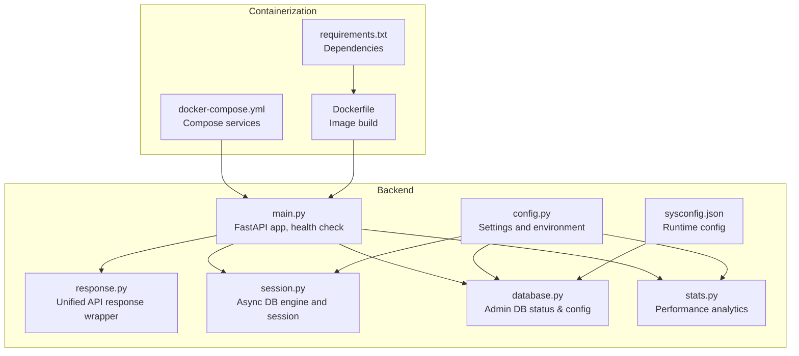
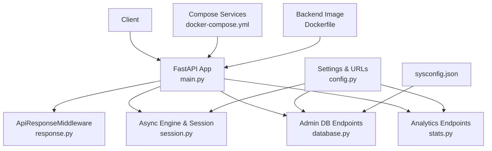
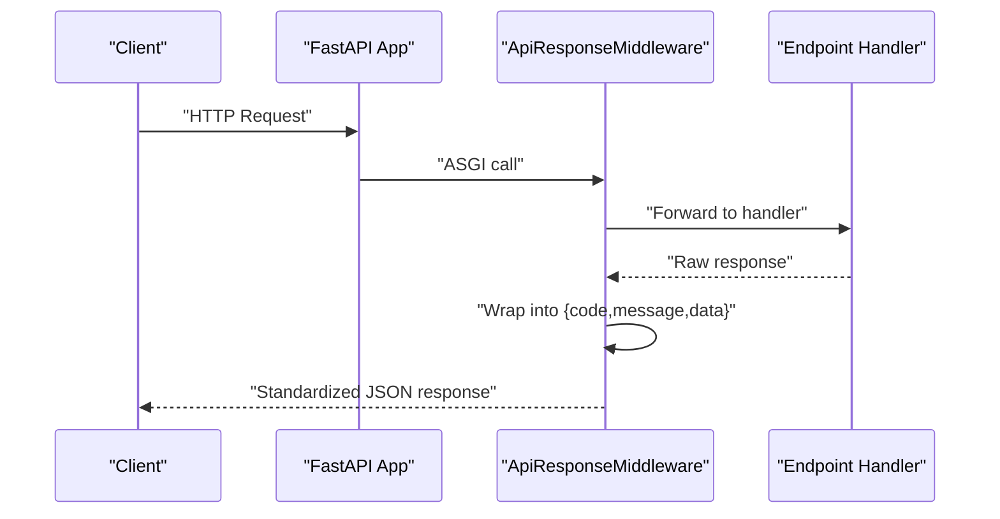
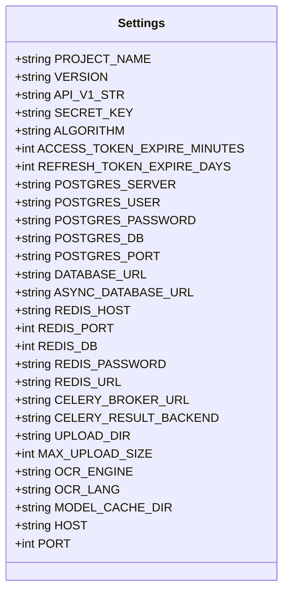
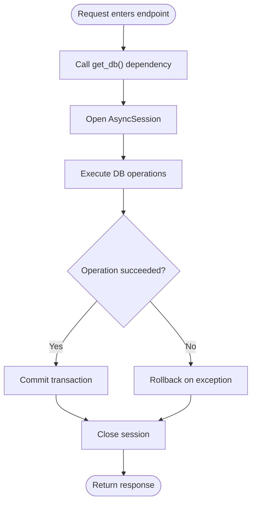
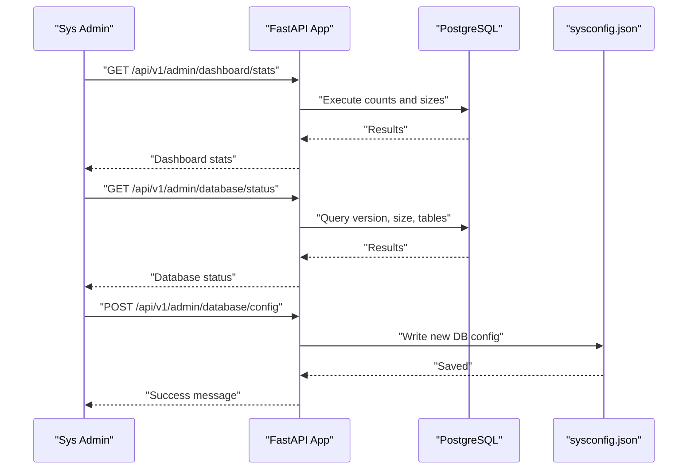
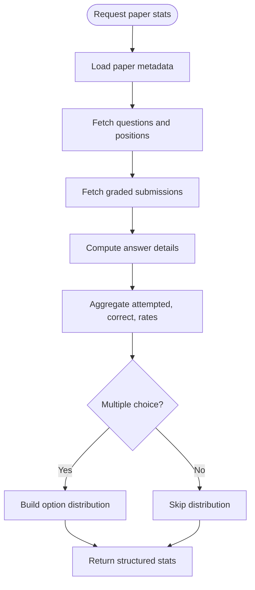
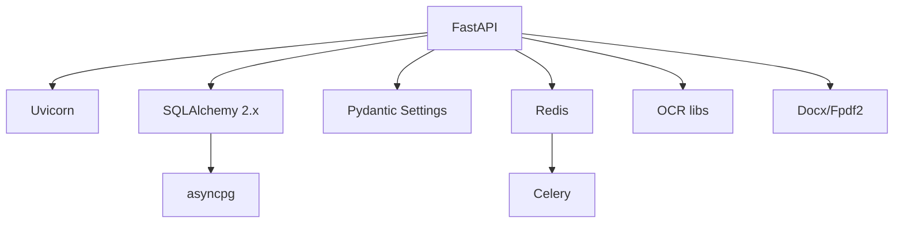

# System Monitoring

<cite>
**Referenced Files in This Document**
- [main.py](file://backend/app/main.py)
- [response.py](file://backend/app/core/response.py)
- [config.py](file://backend/app/core/config.py)
- [session.py](file://backend/app/db/session.py)
- [database.py](file://backend/app/api/v1/endpoints/database.py)
- [stats.py](file://backend/app/api/v1/endpoints/stats.py)
- [docker-compose.yml](file://docker-compose.yml)
- [Dockerfile](file://backend/Dockerfile)
- [requirements.txt](file://backend/requirements.txt)
- [sysconfig.json](file://backend/sysconfig.json)
</cite>

## Table of Contents
1. [Introduction](#introduction)
2. [Project Structure](#project-structure)
3. [Core Components](#core-components)
4. [Architecture Overview](#architecture-overview)
5. [Detailed Component Analysis](#detailed-component-analysis)
6. [Dependency Analysis](#dependency-analysis)
7. [Performance Considerations](#performance-considerations)
8. [Troubleshooting Guide](#troubleshooting-guide)
9. [Conclusion](#conclusion)
10. [Appendices](#appendices)

## Introduction
This document provides comprehensive system monitoring documentation for the educational system backend. It covers system health tracking, performance metrics, database monitoring, storage management, resource tracking, performance analytics, error tracking, alert mechanisms, maintenance workflows, backup procedures, diagnostics, monitoring dashboards, log analysis tools, and troubleshooting procedures. The goal is to enable operators to maintain system reliability, optimize performance, and quickly diagnose issues.

## Project Structure
The monitoring-related components are primarily located in the backend service:
- Application entrypoint and health endpoint
- Unified response wrapper for consistent API responses
- Configuration and environment settings
- Database session management and async engine
- Database status and configuration endpoints for administrators
- Statistics endpoints for performance analytics
- Container orchestration and runtime configuration

**Diagram sources**
- [main.py:1-52](file://backend/app/main.py#L1-L52)
- [response.py:1-124](file://backend/app/core/response.py#L1-L124)
- [config.py:1-98](file://backend/app/core/config.py#L1-L98)
- [session.py:1-26](file://backend/app/db/session.py#L1-L26)
- [database.py:1-167](file://backend/app/api/v1/endpoints/database.py#L1-L167)
- [stats.py:1-251](file://backend/app/api/v1/endpoints/stats.py#L1-L251)
- [docker-compose.yml:1-33](file://docker-compose.yml#L1-L33)
- [Dockerfile:1-11](file://backend/Dockerfile#L1-L11)
- [requirements.txt:1-27](file://backend/requirements.txt#L1-L27)
- [sysconfig.json:1-48](file://backend/sysconfig.json#L1-L48)

**Section sources**
- [main.py:1-52](file://backend/app/main.py#L1-L52)
- [response.py:1-124](file://backend/app/core/response.py#L1-L124)
- [config.py:1-98](file://backend/app/core/config.py#L1-L98)
- [session.py:1-26](file://backend/app/db/session.py#L1-L26)
- [database.py:1-167](file://backend/app/api/v1/endpoints/database.py#L1-L167)
- [stats.py:1-251](file://backend/app/api/v1/endpoints/stats.py#L1-L251)
- [docker-compose.yml:1-33](file://docker-compose.yml#L1-L33)
- [Dockerfile:1-11](file://backend/Dockerfile#L1-L11)
- [requirements.txt:1-27](file://backend/requirements.txt#L1-L27)
- [sysconfig.json:1-48](file://backend/sysconfig.json#L1-L48)

## Core Components
- Health and readiness: The application exposes a health endpoint for basic system status checks.
- Unified response wrapper: Ensures consistent API response format and robust error handling.
- Configuration management: Centralized settings for database, Redis/Celery, uploads, OCR, and model caching.
- Database connectivity: Async SQLAlchemy engine and session factory for efficient database operations.
- Admin database monitoring: Endpoints to fetch database status, size, table counts, and configuration updates.
- Performance analytics: Teacher-focused statistics endpoints for paper and question-level analytics.
- Containerization: Docker Compose and Dockerfile define runtime environment and service composition.

**Section sources**
- [main.py:50-52](file://backend/app/main.py#L50-L52)
- [response.py:14-124](file://backend/app/core/response.py#L14-L124)
- [config.py:36-98](file://backend/app/core/config.py#L36-L98)
- [session.py:5-26](file://backend/app/db/session.py#L5-L26)
- [database.py:23-167](file://backend/app/api/v1/endpoints/database.py#L23-L167)
- [stats.py:17-251](file://backend/app/api/v1/endpoints/stats.py#L17-L251)
- [docker-compose.yml:3-33](file://docker-compose.yml#L3-L33)
- [Dockerfile:1-11](file://backend/Dockerfile#L1-L11)

## Architecture Overview
The monitoring architecture integrates the FastAPI application with database, configuration, and containerization layers. The admin endpoints provide database insights and configuration updates, while the unified response wrapper ensures consistent error reporting. Container orchestration defines service exposure and volume mounts for persistent storage.

**Diagram sources**
- [main.py:11-31](file://backend/app/main.py#L11-L31)
- [response.py:14-95](file://backend/app/core/response.py#L14-L95)
- [session.py:5-26](file://backend/app/db/session.py#L5-L26)
- [config.py:55-71](file://backend/app/core/config.py#L55-L71)
- [database.py:23-167](file://backend/app/api/v1/endpoints/database.py#L23-L167)
- [stats.py:17-251](file://backend/app/api/v1/endpoints/stats.py#L17-L251)
- [sysconfig.json:1-48](file://backend/sysconfig.json#L1-L48)
- [docker-compose.yml:3-33](file://docker-compose.yml#L3-L33)
- [Dockerfile:1-11](file://backend/Dockerfile#L1-L11)

## Detailed Component Analysis

### Health and Readiness
- Endpoint: GET /
- Purpose: Application welcome message and basic availability.
- Endpoint: GET /health
- Purpose: Lightweight health check returning system status.

Operational guidance:
- Use /health for basic liveness/readiness probes.
- Combine with database connectivity checks for deeper readiness.

**Section sources**
- [main.py:45-52](file://backend/app/main.py#L45-L52)

### Unified API Response Wrapper
- Middleware: ApiResponseMiddleware
- Purpose: Wraps all /api/ responses into a standardized {code, message, data} format.
- Behavior: Intercepts ASGI responses, detects JSON content type, and wraps non-wrapped payloads.
- Error handling: Converts unhandled exceptions into a standardized error response.

Operational guidance:
- Ensures consistent client-side handling of API responses.
- Facilitates centralized error tracking and alerting.

**Diagram sources**
- [response.py:20-95](file://backend/app/core/response.py#L20-L95)

**Section sources**
- [response.py:14-124](file://backend/app/core/response.py#L14-L124)

### Configuration Management
- Settings class aggregates environment variables and sysconfig.json overrides.
- Database URLs: synchronous and asynchronous Postgres connections.
- Redis and Celery settings for caching and background tasks.
- Upload directory and OCR/model cache configurations.

Operational guidance:
- Use sysconfig.json for non-sensitive defaults; override with environment variables for secrets.
- Validate DATABASE_URL and ASYNC_DATABASE_URL for connectivity.

**Diagram sources**
- [config.py:36-98](file://backend/app/core/config.py#L36-L98)

**Section sources**
- [config.py:1-98](file://backend/app/core/config.py#L1-L98)
- [sysconfig.json:1-48](file://backend/sysconfig.json#L1-L48)

### Database Connectivity and Sessions
- Async engine creation using ASYNC_DATABASE_URL.
- Session factory with AsyncSession and automatic rollback on exceptions.
- get_db dependency yields a scoped async session.

Operational guidance:
- Monitor session lifecycle to prevent leaks.
- Use get_db in endpoints to ensure proper transaction handling.

**Diagram sources**
- [session.py:18-26](file://backend/app/db/session.py#L18-L26)

**Section sources**
- [session.py:1-26](file://backend/app/db/session.py#L1-L26)

### Admin Database Monitoring
Endpoints:
- GET /api/v1/admin/dashboard/stats
  - Returns counts for users, questions, papers, classes.
  - Database size, table count, total rows.
  - LLM provider and model information.
  - Server Python version, backend version, uptime seconds.
- GET /api/v1/admin/database/status
  - Database version, size in bytes and MB.
  - Public table list and row counts per table.
  - Total rows across tables.
  - Current database connection parameters from sysconfig.json.
- POST /api/v1/admin/database/config
  - Updates database connection parameters in sysconfig.json.
  - Requires SYS_ADMIN role.

Operational guidance:
- Use /admin/dashboard/stats for quick system overview.
- Use /admin/database/status for detailed database diagnostics.
- Apply configuration changes via /admin/database/config and restart backend.

**Diagram sources**
- [database.py:23-167](file://backend/app/api/v1/endpoints/database.py#L23-L167)

**Section sources**
- [database.py:23-167](file://backend/app/api/v1/endpoints/database.py#L23-L167)

### Performance Analytics
Endpoints:
- GET /api/v1/papers
  - Lists papers available for statistics; filters by teacher-created when applicable.
- GET /api/v1/paper/{paper_id}
  - Computes question-level statistics including attempted, correct count, correct rate.
  - Choice distribution for multiple-choice questions.
- GET /api/v1/questions
  - Aggregates question-level statistics across papers.
  - Supports filtering by subject and question type.

Operational guidance:
- Use /paper/{paper_id} to analyze individual paper performance.
- Use /questions to identify challenging questions and review teaching focus.

**Diagram sources**
- [stats.py:37-137](file://backend/app/api/v1/endpoints/stats.py#L37-L137)

**Section sources**
- [stats.py:17-251](file://backend/app/api/v1/endpoints/stats.py#L17-L251)

### Containerization and Runtime Environment
- docker-compose.yml
  - Defines backend and frontend services.
  - Exposes ports 8000 (backend) and 3000 (frontend).
  - Mounts volumes for code and SQLite database persistence.
  - Sets environment variables for secrets and algorithm settings.
  - Uses Uvicorn with reload for development.
- Dockerfile
  - Builds backend image from Python slim base.
  - Installs dependencies from requirements.txt.
  - Runs Uvicorn with host and port configured.

Operational guidance:
- Use docker-compose for local development and staging.
- Adjust environment variables for production deployment.
- Persist volumes for logs and uploaded content.

**Section sources**
- [docker-compose.yml:1-33](file://docker-compose.yml#L1-L33)
- [Dockerfile:1-11](file://backend/Dockerfile#L1-L11)
- [requirements.txt:1-27](file://backend/requirements.txt#L1-L27)

## Dependency Analysis
Key dependencies impacting monitoring:
- FastAPI and Uvicorn for web server and ASGI runtime.
- SQLAlchemy 2.x with asyncpg for async database operations.
- Pydantic and Pydantic Settings for configuration management.
- Redis and Celery for caching and background tasks.
- OCR libraries and document export dependencies.

Operational guidance:
- Pin versions in requirements.txt to ensure reproducible deployments.
- Monitor dependency updates for security patches and compatibility.

**Diagram sources**
- [requirements.txt:2-27](file://backend/requirements.txt#L2-L27)

**Section sources**
- [requirements.txt:1-27](file://backend/requirements.txt#L1-L27)

## Performance Considerations
- Database performance:
  - Use async sessions to reduce blocking and improve throughput.
  - Monitor database size and table counts via admin endpoints.
  - Optimize queries in analytics endpoints; consider indexing frequently queried columns.
- Response handling:
  - The unified response wrapper adds minimal overhead; ensure JSON responses remain small.
- Container resources:
  - Scale backend and Celery workers based on concurrent OCR and grading loads.
  - Monitor CPU and memory usage of OCR engines and model caches.

[No sources needed since this section provides general guidance]

## Troubleshooting Guide
Common issues and resolutions:
- Health check failures:
  - Verify /health endpoint responds and inspect startup logs.
  - Confirm database connectivity using admin endpoints.
- Database connectivity:
  - Check ASYNC_DATABASE_URL and credentials.
  - Validate PostgreSQL availability and network access.
- API response anomalies:
  - Review ApiResponseMiddleware logs for wrapping errors.
  - Inspect standardized error responses for actionable messages.
- Configuration drift:
  - Apply database config changes via /admin/database/config and restart backend.
  - Ensure sysconfig.json permissions are appropriate for the runtime environment.
- Container issues:
  - Rebuild images and restart services using docker-compose.
  - Verify volume mounts for persistent data and logs.

**Section sources**
- [main.py:33-43](file://backend/app/main.py#L33-L43)
- [response.py:84-101](file://backend/app/core/response.py#L84-L101)
- [database.py:147-167](file://backend/app/api/v1/endpoints/database.py#L147-L167)
- [docker-compose.yml:20-21](file://docker-compose.yml#L20-L21)

## Conclusion
The system provides a solid foundation for monitoring through health checks, unified API responses, admin database insights, and analytics endpoints. By leveraging these components and following the operational guidance, teams can maintain system health, track performance, manage storage, and troubleshoot effectively. Extending monitoring with external tools (e.g., Prometheus/Grafana, centralized logging) is recommended for production environments.

[No sources needed since this section summarizes without analyzing specific files]

## Appendices

### Monitoring Dashboard
- Use GET /api/v1/admin/dashboard/stats for a consolidated overview of users, content, database metrics, and server uptime.
- Integrate with frontend dashboards to visualize trends over time.

**Section sources**
- [database.py:23-85](file://backend/app/api/v1/endpoints/database.py#L23-L85)

### Log Analysis Tools
- Enable DEBUG logging via sysconfig.json system.log_level for development.
- Use container logs from docker-compose to capture application and dependency logs.
- Standardized error responses simplify parsing and alerting.

**Section sources**
- [sysconfig.json:44-46](file://backend/sysconfig.json#L44-L46)
- [response.py:84-101](file://backend/app/core/response.py#L84-L101)

### Maintenance Workflows
- Backup procedures:
  - For SQLite (development): Back up the mounted database file from the compose volume.
  - For PostgreSQL (production): Use logical backups (e.g., pg_dump) and automate retention policies.
- Database maintenance:
  - Periodically review table sizes and indexes using /admin/database/status.
  - Apply configuration changes via /admin/database/config and restart backend.
- Model and OCR cache:
  - Monitor MODEL_CACHE_DIR and OCR_MAX_CONCURRENT_* settings to balance performance and resource usage.

**Section sources**
- [docker-compose.yml:10-12](file://docker-compose.yml#L10-L12)
- [database.py:147-167](file://backend/app/api/v1/endpoints/database.py#L147-L167)
- [sysconfig.json:35-42](file://backend/sysconfig.json#L35-L42)

### System Diagnostics
- Health checks:
  - GET /health for basic availability.
  - GET / for application identity and version.
- Database diagnostics:
  - GET /api/v1/admin/database/status for version, size, tables, and row counts.
- Performance diagnostics:
  - Use analytics endpoints to identify bottlenecks in question answering and grading.

**Section sources**
- [main.py:45-52](file://backend/app/main.py#L45-L52)
- [database.py:96-144](file://backend/app/api/v1/endpoints/database.py#L96-L144)
- [stats.py:17-251](file://backend/app/api/v1/endpoints/stats.py#L17-L251)