# User Management

<cite>
**Referenced Files in This Document**
- [backend/app/api/v1/endpoints/auth_v2.py](file://backend/app/api/v1/endpoints/auth_v2.py)
- [backend/app/api/v1/endpoints/classes.py](file://backend/app/api/v1/endpoints/classes.py)
- [backend/app/api/v1/endpoints/student.py](file://backend/app/api/v1/endpoints/student.py)
- [backend/app/api/v1/endpoints/question_admin.py](file://backend/app/api/v1/endpoints/question_admin.py)
- [backend/app/api/v1/endpoints/answers.py](file://backend/app/api/v1/endpoints/answers.py)
- [backend/app/core/security.py](file://backend/app/core/security.py)
- [backend/app/core/config.py](file://backend/app/core/config.py)
- [backend/app/models/admin.py](file://backend/app/models/admin.py)
- [backend/app/models/sys_admin.py](file://backend/app/models/sys_admin.py)
- [backend/app/models/student.py](file://backend/app/models/student.py)
- [backend/app/models/school_class.py](file://backend/app/models/school_class.py)
- [backend/app/schemas/user.py](file://backend/app/schemas/user.py)
- [frontend/src/pages/auth/AdminLoginPage.tsx](file://frontend/src/pages/auth/AdminLoginPage.tsx)
- [frontend/src/pages/admin/AdminUsersPage.tsx](file://frontend/src/pages/admin/AdminUsersPage.tsx)
</cite>

## Table of Contents
1. [Introduction](#introduction)
2. [Project Structure](#project-structure)
3. [Core Components](#core-components)
4. [Architecture Overview](#architecture-overview)
5. [Detailed Component Analysis](#detailed-component-analysis)
6. [Dependency Analysis](#dependency-analysis)
7. [Performance Considerations](#performance-considerations)
8. [Troubleshooting Guide](#troubleshooting-guide)
9. [Conclusion](#conclusion)
10. [Appendices](#appendices)

## Introduction
This document provides comprehensive user management documentation for the education platform. It covers administrative user accounts, role assignment, and permission management. It explains the admin user creation workflow, role-based access control, and user lifecycle management. It also documents teacher and question administrator account management, student enrollment processes, and class assignment workflows. Additional topics include user profile management, authentication configuration, account status controls, bulk user operations, user import/export functionality, and audit trail management. The document concludes with practical examples of user administration procedures, role assignment workflows, and account maintenance tasks.

## Project Structure
The user management system spans backend API endpoints, models, schemas, and frontend pages:
- Backend API endpoints implement authentication, admin management, class management, student statistics, and question admin workflows.
- Models define the persistent entities for administrators, system administrators, students, and classes.
- Schemas define request/response structures for user-related operations.
- Frontend pages provide admin login and user management UI.

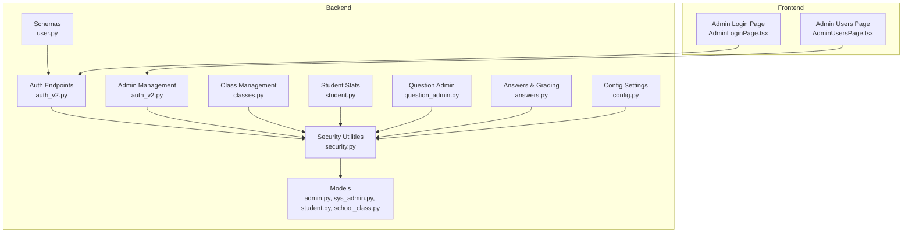

**Diagram sources**
- [backend/app/api/v1/endpoints/auth_v2.py:1-476](file://backend/app/api/v1/endpoints/auth_v2.py#L1-L476)
- [backend/app/api/v1/endpoints/classes.py:1-243](file://backend/app/api/v1/endpoints/classes.py#L1-L243)
- [backend/app/api/v1/endpoints/student.py:1-112](file://backend/app/api/v1/endpoints/student.py#L1-L112)
- [backend/app/api/v1/endpoints/question_admin.py:1-837](file://backend/app/api/v1/endpoints/question_admin.py#L1-L837)
- [backend/app/api/v1/endpoints/answers.py:1-421](file://backend/app/api/v1/endpoints/answers.py#L1-L421)
- [backend/app/core/security.py:1-104](file://backend/app/core/security.py#L1-L104)
- [backend/app/core/config.py:1-98](file://backend/app/core/config.py#L1-L98)
- [backend/app/models/admin.py:1-27](file://backend/app/models/admin.py#L1-L27)
- [backend/app/models/sys_admin.py:1-22](file://backend/app/models/sys_admin.py#L1-L22)
- [backend/app/models/student.py:1-23](file://backend/app/models/student.py#L1-L23)
- [backend/app/models/school_class.py:1-39](file://backend/app/models/school_class.py#L1-L39)
- [backend/app/schemas/user.py:1-37](file://backend/app/schemas/user.py#L1-L37)
- [frontend/src/pages/auth/AdminLoginPage.tsx:1-171](file://frontend/src/pages/auth/AdminLoginPage.tsx#L1-L171)
- [frontend/src/pages/admin/AdminUsersPage.tsx:1-128](file://frontend/src/pages/admin/AdminUsersPage.tsx#L1-L128)

**Section sources**
- [backend/app/api/v1/endpoints/auth_v2.py:1-476](file://backend/app/api/v1/endpoints/auth_v2.py#L1-L476)
- [backend/app/models/admin.py:1-27](file://backend/app/models/admin.py#L1-L27)
- [backend/app/models/sys_admin.py:1-22](file://backend/app/models/sys_admin.py#L1-L22)
- [backend/app/models/student.py:1-23](file://backend/app/models/student.py#L1-L23)
- [backend/app/models/school_class.py:1-39](file://backend/app/models/school_class.py#L1-L39)
- [backend/app/schemas/user.py:1-37](file://backend/app/schemas/user.py#L1-L37)
- [frontend/src/pages/auth/AdminLoginPage.tsx:1-171](file://frontend/src/pages/auth/AdminLoginPage.tsx#L1-L171)
- [frontend/src/pages/admin/AdminUsersPage.tsx:1-128](file://frontend/src/pages/admin/AdminUsersPage.tsx#L1-L128)

## Core Components
- Authentication and Authorization
  - JWT-based authentication with role-aware token decoding and middleware enforcement.
  - Admin login flow with CAPTCHA verification, password validation, and SMS verification.
  - Role-based access control enforcing permissions for endpoints.

- User Types and Profiles
  - System Administrator (built-in, non-deletable).
  - Admin (teachers and question administrators) with role-specific attributes.
  - Student users (self-registration via SMS-based login).

- Class and Enrollment Management
  - Class creation and management with teacher ownership.
  - Student enrollment and class assignment workflows.

- Question Administration
  - Question bank management, approval workflows, scraping, and deduplication.
  - Bulk operations for approvals and OCR-based paper import.

- Audit Trail
  - Grading records capture detailed audit trails for answer submissions.

**Section sources**
- [backend/app/core/security.py:53-104](file://backend/app/core/security.py#L53-L104)
- [backend/app/api/v1/endpoints/auth_v2.py:24-183](file://backend/app/api/v1/endpoints/auth_v2.py#L24-L183)
- [backend/app/models/sys_admin.py:1-22](file://backend/app/models/sys_admin.py#L1-L22)
- [backend/app/models/admin.py:1-27](file://backend/app/models/admin.py#L1-L27)
- [backend/app/models/student.py:1-23](file://backend/app/models/student.py#L1-L23)
- [backend/app/api/v1/endpoints/classes.py:16-206](file://backend/app/api/v1/endpoints/classes.py#L16-L206)
- [backend/app/api/v1/endpoints/question_admin.py:220-412](file://backend/app/api/v1/endpoints/question_admin.py#L220-L412)
- [backend/app/api/v1/endpoints/answers.py:24-113](file://backend/app/api/v1/endpoints/answers.py#L24-L113)

## Architecture Overview
The user management architecture integrates frontend UI with backend endpoints and persistence. Authentication is centralized with role-aware token handling. Admins are managed by system administrators, while students self-enroll. Teachers manage classes and enroll students. Question administrators maintain the question bank and support bulk operations.

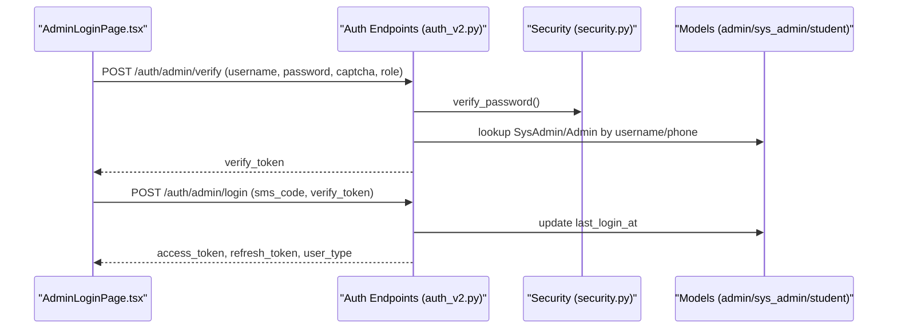

**Diagram sources**
- [frontend/src/pages/auth/AdminLoginPage.tsx:36-84](file://frontend/src/pages/auth/AdminLoginPage.tsx#L36-L84)
- [backend/app/api/v1/endpoints/auth_v2.py:91-183](file://backend/app/api/v1/endpoints/auth_v2.py#L91-L183)
- [backend/app/core/security.py:16-47](file://backend/app/core/security.py#L16-L47)

**Section sources**
- [backend/app/api/v1/endpoints/auth_v2.py:91-183](file://backend/app/api/v1/endpoints/auth_v2.py#L91-L183)
- [backend/app/core/security.py:64-95](file://backend/app/core/security.py#L64-L95)

## Detailed Component Analysis

### Authentication and Authorization
- JWT token creation and refresh with user_type embedded.
- CAPTCHA verification and SMS verification steps for admin login.
- Role enforcement via dependency injection requiring specific roles.
- Profile retrieval and updates across user types.

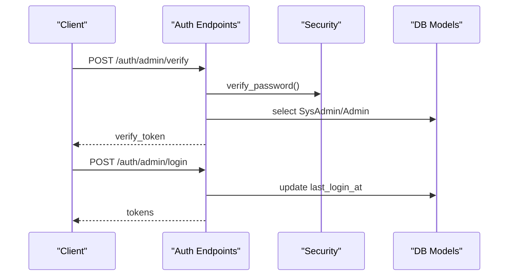

**Diagram sources**
- [backend/app/api/v1/endpoints/auth_v2.py:91-183](file://backend/app/api/v1/endpoints/auth_v2.py#L91-L183)
- [backend/app/core/security.py:64-95](file://backend/app/core/security.py#L64-L95)

**Section sources**
- [backend/app/api/v1/endpoints/auth_v2.py:25-183](file://backend/app/api/v1/endpoints/auth_v2.py#L25-L183)
- [backend/app/core/security.py:53-104](file://backend/app/core/security.py#L53-L104)

### Admin User Creation and Lifecycle
- System administrators create teacher or question administrator accounts.
- Admin profiles include role, subjects, grades, and contact info.
- Admin listing supports filtering by name, role, activity, subject, and grade.
- Admin update supports toggling activity, updating personal info, and changing passwords.
- Admin deletion removes the record.

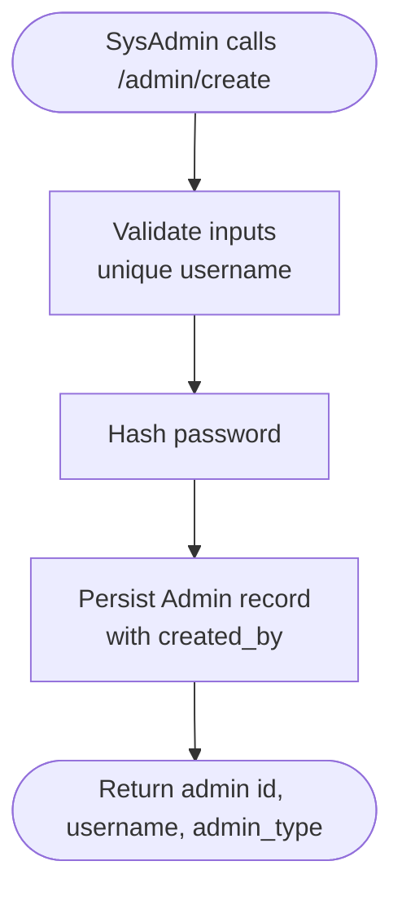

**Diagram sources**
- [backend/app/api/v1/endpoints/auth_v2.py:242-283](file://backend/app/api/v1/endpoints/auth_v2.py#L242-L283)

**Section sources**
- [backend/app/api/v1/endpoints/auth_v2.py:242-361](file://backend/app/api/v1/endpoints/auth_v2.py#L242-L361)

### Role-Based Access Control
- require_role decorator enforces role-based access to endpoints.
- Different roles (SYS_ADMIN, TEACHER, QUESTION_ADMIN, STUDENT) gate access to features.
- Teacher-only endpoints restrict class management to the logged-in teacher.

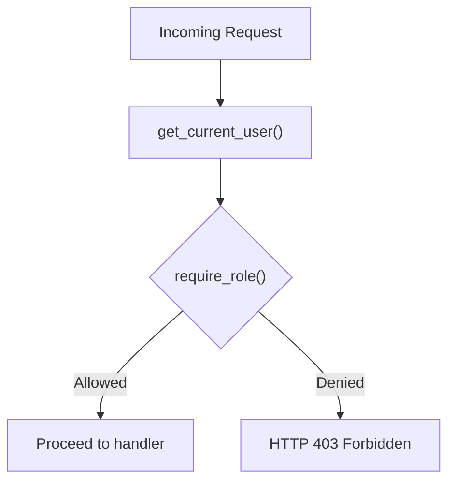

**Diagram sources**
- [backend/app/core/security.py:98-103](file://backend/app/core/security.py#L98-L103)
- [backend/app/api/v1/endpoints/classes.py:22-23](file://backend/app/api/v1/endpoints/classes.py#L22-L23)

**Section sources**
- [backend/app/core/security.py:98-103](file://backend/app/core/security.py#L98-L103)
- [backend/app/api/v1/endpoints/classes.py:22-23](file://backend/app/api/v1/endpoints/classes.py#L22-L23)

### Teacher and Class Assignment Workflows
- Teachers create classes and manage enrollment.
- Students can be enrolled by ID or created on-the-fly with generated credentials.
- Class listing and filtering by teacher and search terms.
- Student removal from class and single student updates.

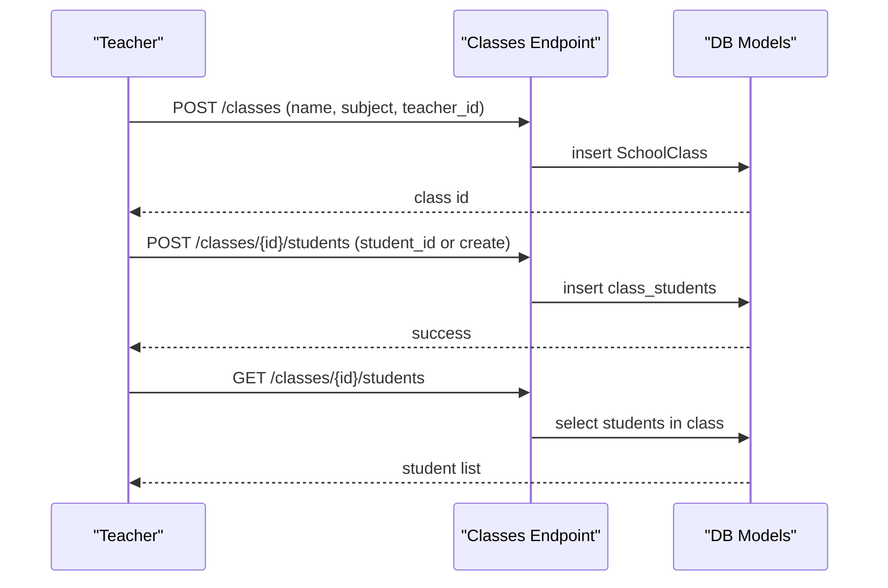

**Diagram sources**
- [backend/app/api/v1/endpoints/classes.py:16-206](file://backend/app/api/v1/endpoints/classes.py#L16-L206)
- [backend/app/models/school_class.py:7-39](file://backend/app/models/school_class.py#L7-L39)

**Section sources**
- [backend/app/api/v1/endpoints/classes.py:16-206](file://backend/app/api/v1/endpoints/classes.py#L16-L206)
- [backend/app/models/school_class.py:7-39](file://backend/app/models/school_class.py#L7-L39)

### Student Enrollment and Self-Registration
- Students self-register via SMS-based login without setting a password.
- Student login validates CAPTCHA and SMS, updates last login, and issues tokens.
- Student statistics endpoint aggregates performance metrics.

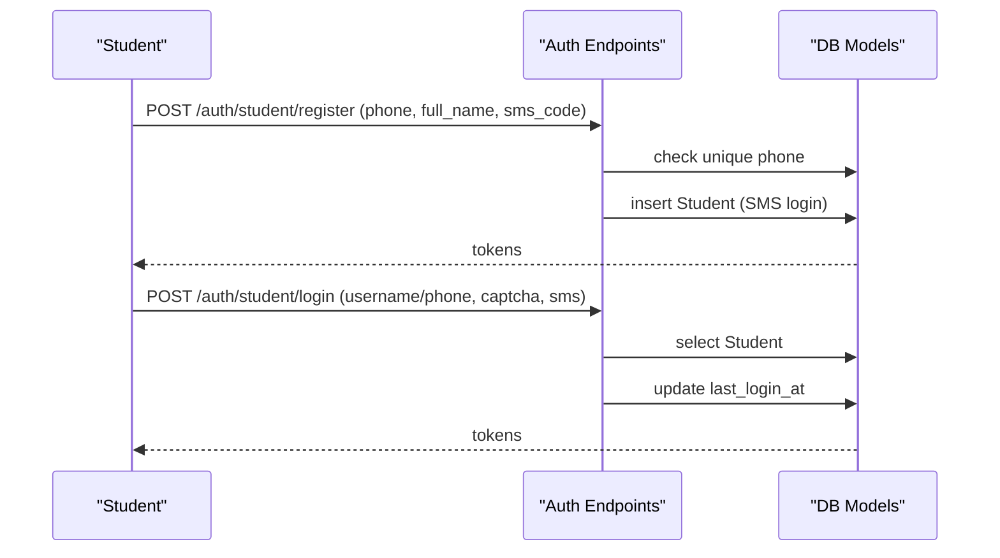

**Diagram sources**
- [backend/app/api/v1/endpoints/auth_v2.py:212-237](file://backend/app/api/v1/endpoints/auth_v2.py#L212-L237)
- [backend/app/api/v1/endpoints/auth_v2.py:188-209](file://backend/app/api/v1/endpoints/auth_v2.py#L188-L209)
- [backend/app/api/v1/endpoints/student.py:16-111](file://backend/app/api/v1/endpoints/student.py#L16-L111)

**Section sources**
- [backend/app/api/v1/endpoints/auth_v2.py:212-237](file://backend/app/api/v1/endpoints/auth_v2.py#L212-L237)
- [backend/app/api/v1/endpoints/auth_v2.py:188-209](file://backend/app/api/v1/endpoints/auth_v2.py#L188-L209)
- [backend/app/api/v1/endpoints/student.py:16-111](file://backend/app/api/v1/endpoints/student.py#L16-L111)

### Question Administrator Account Management and Question Bank Operations
- Question administrators maintain syllabi, generate questions via LLM, scrape content, and approve/reject questions.
- Bulk approval and rejection endpoints streamline moderation.
- OCR-based paper import extracts questions and saves them for review.

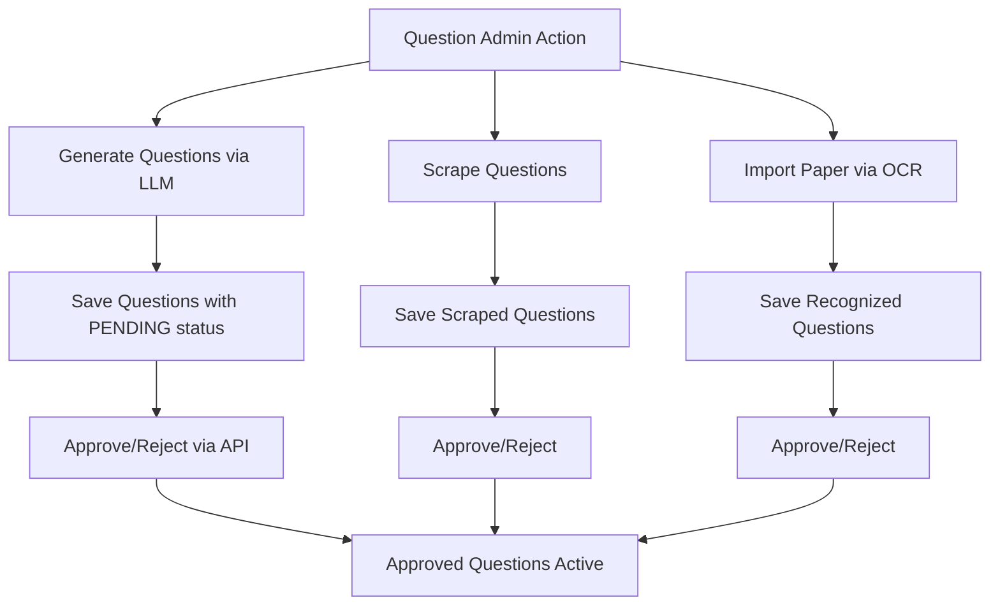

**Diagram sources**
- [backend/app/api/v1/endpoints/question_admin.py:138-217](file://backend/app/api/v1/endpoints/question_admin.py#L138-L217)
- [backend/app/api/v1/endpoints/question_admin.py:417-474](file://backend/app/api/v1/endpoints/question_admin.py#L417-L474)
- [backend/app/api/v1/endpoints/question_admin.py:680-727](file://backend/app/api/v1/endpoints/question_admin.py#L680-L727)

**Section sources**
- [backend/app/api/v1/endpoints/question_admin.py:220-412](file://backend/app/api/v1/endpoints/question_admin.py#L220-L412)
- [backend/app/api/v1/endpoints/question_admin.py:500-797](file://backend/app/api/v1/endpoints/question_admin.py#L500-L797)

### User Profile Management
- Unified profile retrieval across SYS_ADMIN, TEACHER, QUESTION_ADMIN, and STUDENT.
- Profile updates support full_name, email, grade, and school; phone updates require SMS verification.

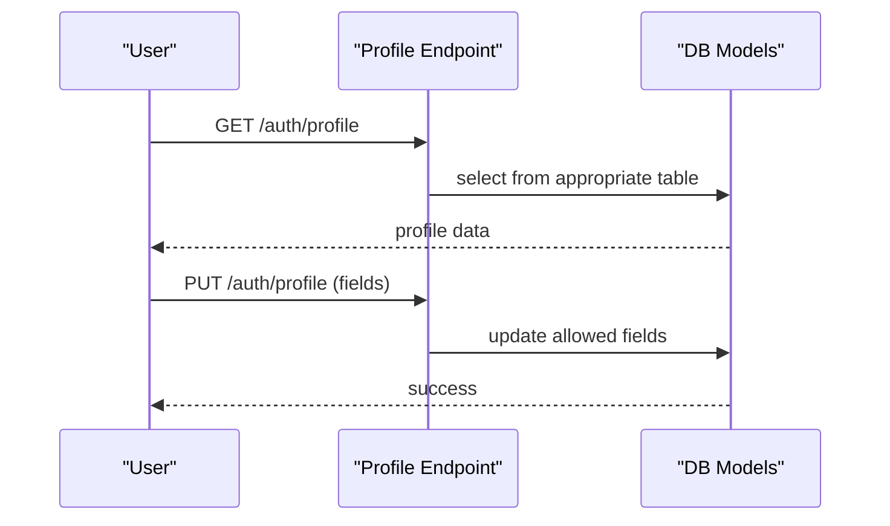

**Diagram sources**
- [backend/app/api/v1/endpoints/auth_v2.py:377-445](file://backend/app/api/v1/endpoints/auth_v2.py#L377-L445)

**Section sources**
- [backend/app/api/v1/endpoints/auth_v2.py:377-475](file://backend/app/api/v1/endpoints/auth_v2.py#L377-L475)

### Audit Trail Management
- Grading audit records capture per-question correctness, scores, and totals for each submission.
- Notifications are triggered upon grading completion.

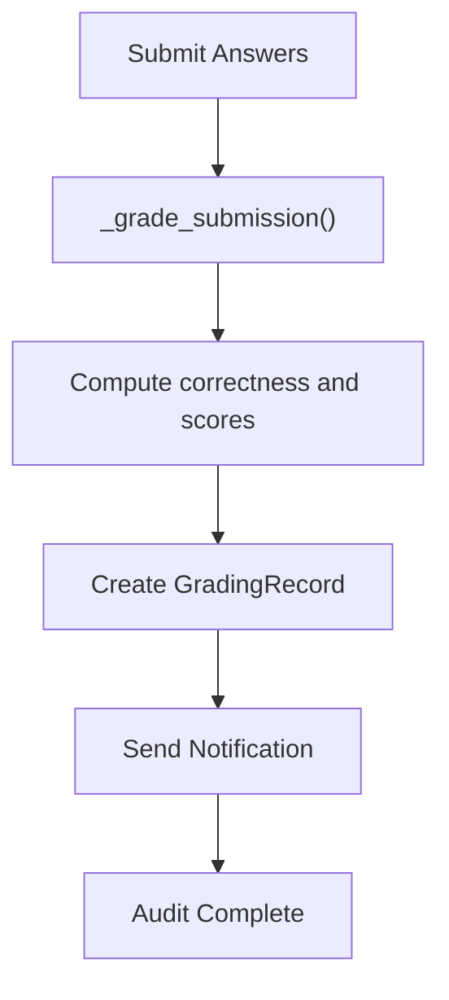

**Diagram sources**
- [backend/app/api/v1/endpoints/answers.py:24-113](file://backend/app/api/v1/endpoints/answers.py#L24-L113)

**Section sources**
- [backend/app/api/v1/endpoints/answers.py:24-113](file://backend/app/api/v1/endpoints/answers.py#L24-L113)

## Dependency Analysis
- Authentication depends on security utilities for hashing, token creation, and role checks.
- Admin endpoints depend on models for SysAdmin and Admin tables.
- Class endpoints depend on SchoolClass and association table for enrollment.
- Question admin endpoints depend on Question, Syllabus, and LLM services.
- Student endpoints depend on AnswerSubmission and related models.

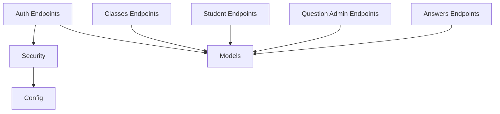

**Diagram sources**
- [backend/app/api/v1/endpoints/auth_v2.py:1-476](file://backend/app/api/v1/endpoints/auth_v2.py#L1-L476)
- [backend/app/core/security.py:1-104](file://backend/app/core/security.py#L1-L104)
- [backend/app/core/config.py:1-98](file://backend/app/core/config.py#L1-L98)
- [backend/app/models/admin.py:1-27](file://backend/app/models/admin.py#L1-L27)
- [backend/app/models/sys_admin.py:1-22](file://backend/app/models/sys_admin.py#L1-L22)
- [backend/app/models/student.py:1-23](file://backend/app/models/student.py#L1-L23)
- [backend/app/models/school_class.py:1-39](file://backend/app/models/school_class.py#L1-L39)

**Section sources**
- [backend/app/api/v1/endpoints/auth_v2.py:1-476](file://backend/app/api/v1/endpoints/auth_v2.py#L1-L476)
- [backend/app/core/security.py:1-104](file://backend/app/core/security.py#L1-L104)
- [backend/app/core/config.py:1-98](file://backend/app/core/config.py#L1-L98)
- [backend/app/models/admin.py:1-27](file://backend/app/models/admin.py#L1-L27)
- [backend/app/models/sys_admin.py:1-22](file://backend/app/models/sys_admin.py#L1-L22)
- [backend/app/models/student.py:1-23](file://backend/app/models/student.py#L1-L23)
- [backend/app/models/school_class.py:1-39](file://backend/app/models/school_class.py#L1-L39)

## Performance Considerations
- Token expiration and refresh strategies balance security and usability.
- Database queries for admin listing and class enrollment use filtering and ordering to limit result sets.
- Grading operations are performed asynchronously to avoid blocking submission processing.
- Frontend paginates user listings and limits query sizes to reduce load.

## Troubleshooting Guide
- Authentication failures
  - Verify CAPTCHA and SMS codes are accepted during admin login.
  - Ensure user exists and is active before login attempts.
  - Confirm role selection matches the user’s actual role.

- Admin management issues
  - Username uniqueness constraint prevents duplicate admin creation.
  - Update endpoints validate presence of admin before modifying.

- Class enrollment problems
  - Prevent duplicate enrollment by checking existing associations.
  - Ensure class existence before adding students.

- Question admin operations
  - LLM and OCR integrations may fail if model endpoints are unreachable or unsupported.
  - Deduplication relies on computed content hashes; ensure questions have titles.

**Section sources**
- [backend/app/api/v1/endpoints/auth_v2.py:91-183](file://backend/app/api/v1/endpoints/auth_v2.py#L91-L183)
- [backend/app/api/v1/endpoints/auth_v2.py:242-361](file://backend/app/api/v1/endpoints/auth_v2.py#L242-L361)
- [backend/app/api/v1/endpoints/classes.py:143-206](file://backend/app/api/v1/endpoints/classes.py#L143-L206)
- [backend/app/api/v1/endpoints/question_admin.py:561-646](file://backend/app/api/v1/endpoints/question_admin.py#L561-L646)
- [backend/app/api/v1/endpoints/question_admin.py:730-797](file://backend/app/api/v1/endpoints/question_admin.py#L730-L797)

## Conclusion
The user management system provides robust role-based access control, secure authentication, and streamlined workflows for admin creation, class enrollment, and question bank maintenance. The architecture separates concerns between frontend UI and backend endpoints, with clear models and schemas ensuring data integrity. Audit trails and notifications enhance transparency and user feedback. Administrators can efficiently manage users, classes, and question content while maintaining strong security and operational controls.

## Appendices

### Examples of User Administration Procedures
- Admin user creation
  - SysAdmin invokes admin creation endpoint with username, password, full_name, role, and optional metadata.
  - The system validates uniqueness and persists the Admin record.

- Role assignment workflows
  - Assign subjects and grade levels to Admin profiles via dedicated endpoints.
  - Filter and list Admins by role and attributes for oversight.

- Account maintenance tasks
  - Toggle account activity to enable/disable logins.
  - Update personal information and reset passwords as needed.

- Student enrollment processes
  - Enroll existing students by ID or create new students with generated credentials.
  - Remove students from classes when necessary.

- Class assignment workflows
  - Teachers create classes and manage enrollment lists.
  - Search and filter available students for class assignment.

- User profile management
  - Retrieve and update profile information across all user types.
  - Update phone numbers with SMS verification.

- Authentication configuration
  - Configure secret keys, token expiration, and database connections via settings.
  - Adjust security parameters for production deployments.

- Account status controls
  - Monitor last login timestamps and enforce active/inactive states.
  - Restrict access to inactive accounts during authentication.

- Bulk user operations
  - Use admin listing filters to target specific groups for updates.
  - Apply bulk approval/rejection for question moderation.

- User import/export functionality
  - Utilize question admin endpoints for OCR-based paper import and deduplication.
  - Export question statistics and moderation summaries for reporting.

- Audit trail management
  - Review grading records for detailed correctness and scoring logs.
  - Track moderation actions and question lifecycle events.

**Section sources**
- [backend/app/api/v1/endpoints/auth_v2.py:242-361](file://backend/app/api/v1/endpoints/auth_v2.py#L242-L361)
- [backend/app/api/v1/endpoints/classes.py:143-206](file://backend/app/api/v1/endpoints/classes.py#L143-L206)
- [backend/app/api/v1/endpoints/student.py:16-111](file://backend/app/api/v1/endpoints/student.py#L16-L111)
- [backend/app/api/v1/endpoints/question_admin.py:561-727](file://backend/app/api/v1/endpoints/question_admin.py#L561-L727)
- [backend/app/api/v1/endpoints/answers.py:24-113](file://backend/app/api/v1/endpoints/answers.py#L24-L113)
- [backend/app/core/config.py:36-98](file://backend/app/core/config.py#L36-L98)
- [frontend/src/pages/auth/AdminLoginPage.tsx:36-84](file://frontend/src/pages/auth/AdminLoginPage.tsx#L36-L84)
- [frontend/src/pages/admin/AdminUsersPage.tsx:34-70](file://frontend/src/pages/admin/AdminUsersPage.tsx#L34-L70)