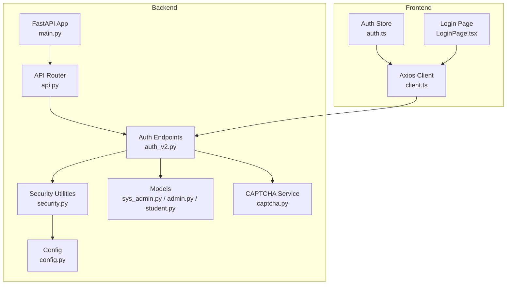
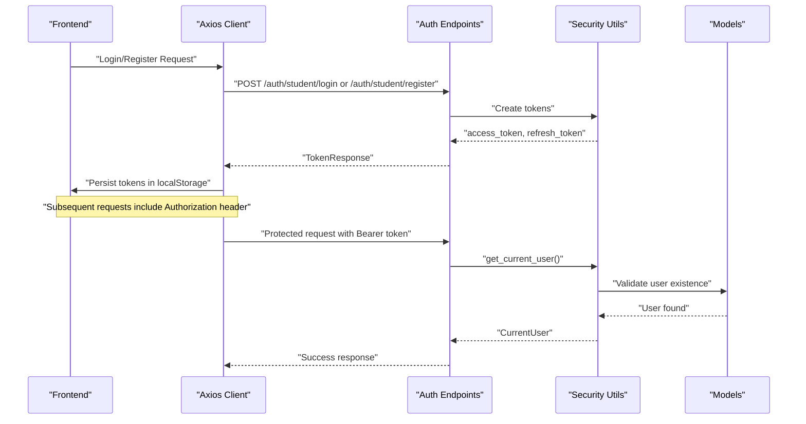
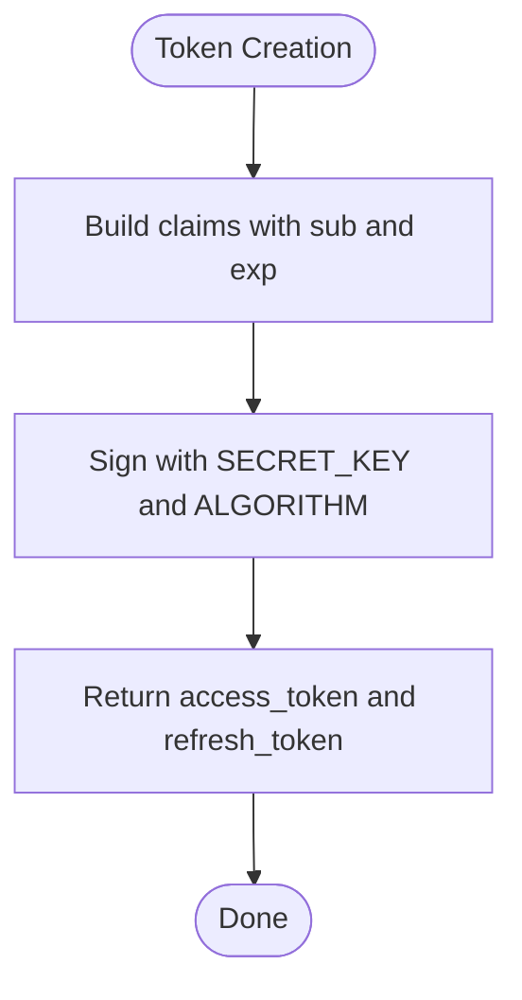
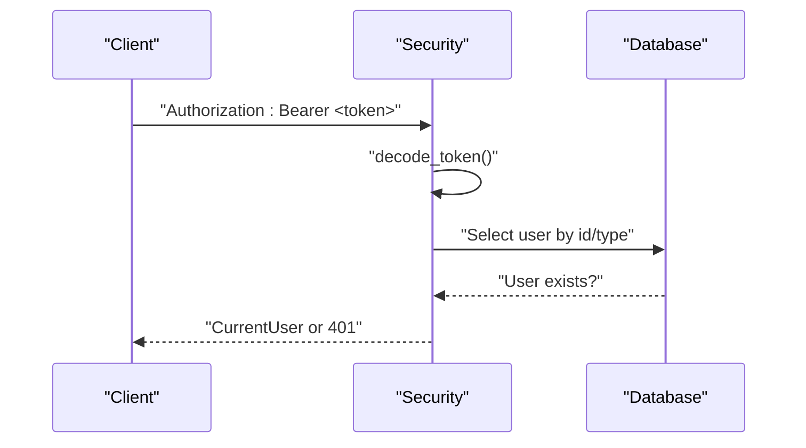
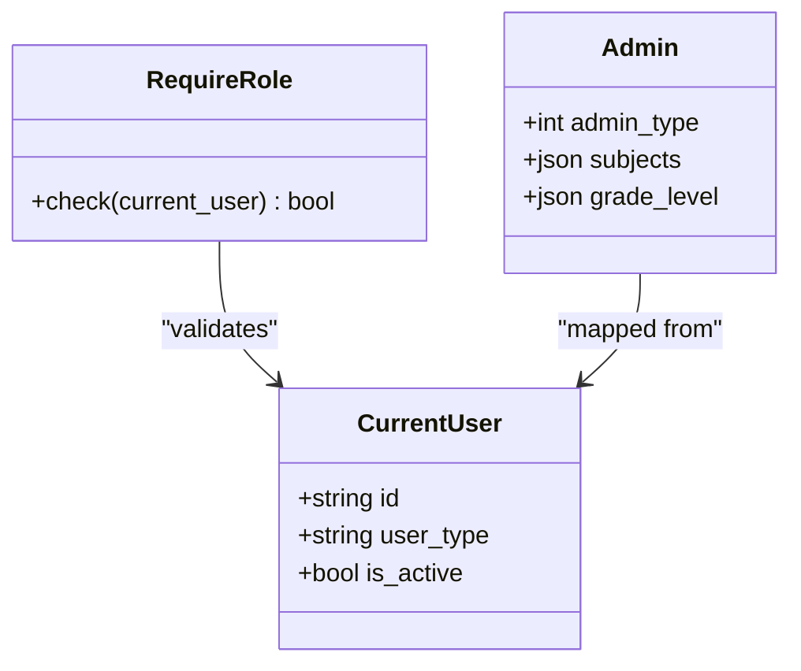
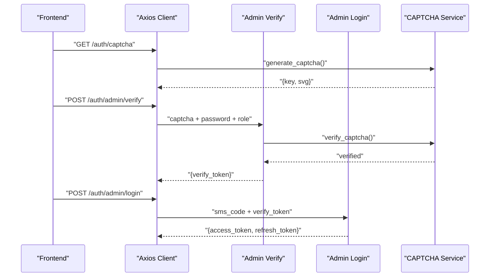
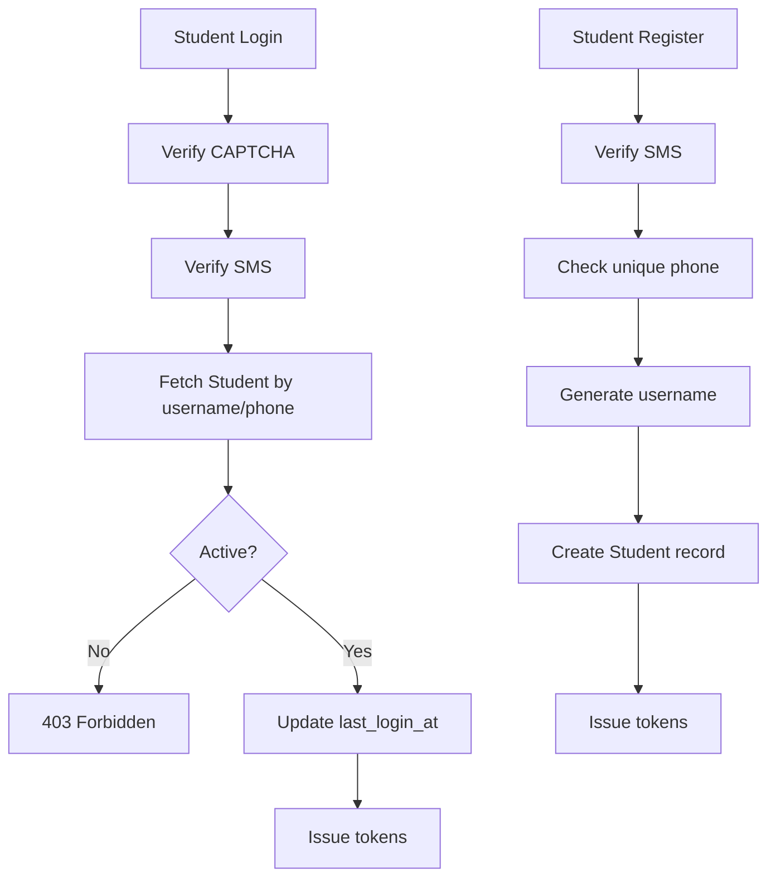
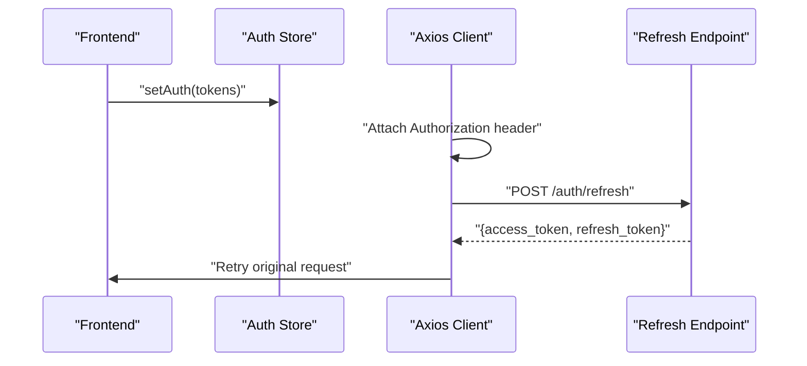
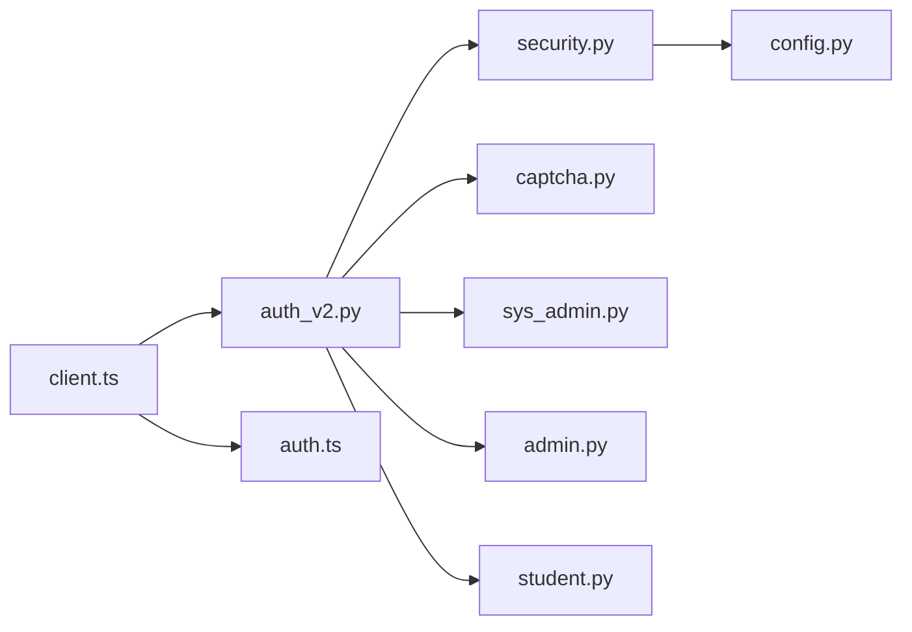

# Authentication & Authorization

<cite>
**Referenced Files in This Document**
- [auth_v2.py](file://backend/app/api/v1/endpoints/auth_v2.py)
- [security.py](file://backend/app/core/security.py)
- [config.py](file://backend/app/core/config.py)
- [api.py](file://backend/app/api/v1/api.py)
- [main.py](file://backend/app/main.py)
- [sys_admin.py](file://backend/app/models/sys_admin.py)
- [admin.py](file://backend/app/models/admin.py)
- [student.py](file://backend/app/models/student.py)
- [captcha.py](file://backend/app/services/captcha.py)
- [client.ts](file://frontend/src/api/client.ts)
- [auth.ts](file://frontend/src/store/auth.ts)
- [LoginPage.tsx](file://frontend/src/pages/auth/LoginPage.tsx)
</cite>

## Table of Contents
1. [Introduction](#introduction)
2. [Project Structure](#project-structure)
3. [Core Components](#core-components)
4. [Architecture Overview](#architecture-overview)
5. [Detailed Component Analysis](#detailed-component-analysis)
6. [Dependency Analysis](#dependency-analysis)
7. [Performance Considerations](#performance-considerations)
8. [Troubleshooting Guide](#troubleshooting-guide)
9. [Conclusion](#conclusion)
10. [Appendices](#appendices)

## Introduction
This document provides comprehensive authentication and authorization documentation for the multi-role educational management system. It covers JWT-based authentication flows, token generation and validation, refresh token mechanisms, role-based access control (RBAC) with four distinct user roles, password hashing, session management, and security middleware. It also documents login/logout flows, password reset procedures, account management features, security best practices, CSRF protection, secure cookie handling, implementation examples for protected routes and role checking utilities, and integration with frontend authentication state management and automatic token refresh.

## Project Structure
The authentication system spans backend endpoints, core security utilities, models, and frontend state management. The backend exposes authentication endpoints under /api/v1/auth, while the frontend manages tokens and integrates with Axios interceptors for seamless token refresh.

**Diagram sources**
- [main.py:11-31](file://backend/app/main.py#L11-L31)
- [api.py:8](file://backend/app/api/v1/api.py#L8)
- [auth_v2.py:21](file://backend/app/api/v1/endpoints/auth_v2.py#L21)
- [security.py:1-104](file://backend/app/core/security.py#L1-L104)
- [sys_admin.py:8-22](file://backend/app/models/sys_admin.py#L8-L22)
- [admin.py:9-27](file://backend/app/models/admin.py#L9-L27)
- [student.py:8-23](file://backend/app/models/student.py#L8-L23)
- [captcha.py:12-40](file://backend/app/services/captcha.py#L12-L40)
- [config.py:36-98](file://backend/app/core/config.py#L36-L98)
- [client.ts:1-55](file://frontend/src/api/client.ts#L1-L55)
- [auth.ts:1-96](file://frontend/src/store/auth.ts#L1-L96)
- [LoginPage.tsx:11-217](file://frontend/src/pages/auth/LoginPage.tsx#L11-L217)

**Section sources**
- [main.py:11-31](file://backend/app/main.py#L11-L31)
- [api.py:8](file://backend/app/api/v1/api.py#L8)
- [auth_v2.py:21](file://backend/app/api/v1/endpoints/auth_v2.py#L21)
- [security.py:1-104](file://backend/app/core/security.py#L1-L104)
- [config.py:36-98](file://backend/app/core/config.py#L36-L98)
- [client.ts:1-55](file://frontend/src/api/client.ts#L1-L55)
- [auth.ts:1-96](file://frontend/src/store/auth.ts#L1-L96)
- [LoginPage.tsx:11-217](file://frontend/src/pages/auth/LoginPage.tsx#L11-L217)

## Core Components
- JWT-based authentication with access and refresh tokens
- Password hashing using bcrypt via passlib
- Role-based access control (RBAC) with four user roles
- CAPTCHA-based anti-bot measures
- Frontend token storage and automatic refresh via Axios interceptors

Key implementation references:
- Token creation and validation: [security.py:24-47](file://backend/app/core/security.py#L24-L47)
- Access/refresh token helpers: [security.py:24-40](file://backend/app/core/security.py#L24-L40)
- Current user extraction: [security.py:64-95](file://backend/app/core/security.py#L64-L95)
- Role requirement decorator: [security.py:98-103](file://backend/app/core/security.py#L98-L103)
- Admin login flow: [auth_v2.py:91-183](file://backend/app/api/v1/endpoints/auth_v2.py#L91-L183)
- Student login/register flow: [auth_v2.py:188-237](file://backend/app/api/v1/endpoints/auth_v2.py#L188-L237)
- CAPTCHA service: [captcha.py:12-40](file://backend/app/services/captcha.py#L12-L40)
- Frontend auth store: [auth.ts:47-96](file://frontend/src/store/auth.ts#L47-L96)
- Axios client with token refresh: [client.ts:9-52](file://frontend/src/api/client.ts#L9-L52)

**Section sources**
- [security.py:24-47](file://backend/app/core/security.py#L24-L47)
- [security.py:64-95](file://backend/app/core/security.py#L64-L95)
- [security.py:98-103](file://backend/app/core/security.py#L98-L103)
- [auth_v2.py:91-183](file://backend/app/api/v1/endpoints/auth_v2.py#L91-L183)
- [auth_v2.py:188-237](file://backend/app/api/v1/endpoints/auth_v2.py#L188-L237)
- [captcha.py:12-40](file://backend/app/services/captcha.py#L12-L40)
- [auth.ts:47-96](file://frontend/src/store/auth.ts#L47-L96)
- [client.ts:9-52](file://frontend/src/api/client.ts#L9-L52)

## Architecture Overview
The authentication architecture comprises:
- Backend endpoints for admin and student authentication
- Security utilities for token generation, validation, and role checks
- Models representing user types and their attributes
- CAPTCHA service for bot prevention
- Frontend store and Axios interceptors for token lifecycle management

**Diagram sources**
- [auth_v2.py:55-71](file://backend/app/api/v1/endpoints/auth_v2.py#L55-L71)
- [security.py:64-95](file://backend/app/core/security.py#L64-L95)
- [sys_admin.py:8-22](file://backend/app/models/sys_admin.py#L8-L22)
- [admin.py:9-27](file://backend/app/models/admin.py#L9-L27)
- [student.py:8-23](file://backend/app/models/student.py#L8-L23)
- [client.ts:9-52](file://frontend/src/api/client.ts#L9-L52)
- [auth.ts:47-96](file://frontend/src/store/auth.ts#L47-L96)

## Detailed Component Analysis

### JWT-Based Authentication Flow
- Token generation uses HS256 with a secret key configured in settings.
- Access tokens carry expiration and are short-lived; refresh tokens are long-lived.
- Token decoding validates signature and expiration; missing or invalid tokens trigger unauthorized responses.

Implementation references:
- Token creation: [security.py:24-40](file://backend/app/core/security.py#L24-L40)
- Token decoding: [security.py:43-47](file://backend/app/core/security.py#L43-L47)
- Access token expiration: [config.py:45](file://backend/app/core/config.py#L45)
- Refresh token expiration: [config.py:46](file://backend/app/core/config.py#L46)

**Diagram sources**
- [security.py:24-40](file://backend/app/core/security.py#L24-L40)
- [config.py:43-46](file://backend/app/core/config.py#L43-L46)

**Section sources**
- [security.py:24-40](file://backend/app/core/security.py#L24-L40)
- [security.py:43-47](file://backend/app/core/security.py#L43-L47)
- [config.py:43-46](file://backend/app/core/config.py#L43-L46)

### Token Validation and Current User Extraction
- The OAuth2 bearer scheme extracts the token from Authorization headers.
- Decoding retrieves user identity and type; existence checks ensure the user still exists in the database.
- The CurrentUser object standardizes access across user types.

Implementation references:
- OAuth2 scheme: [security.py:50](file://backend/app/core/security.py#L50)
- get_current_user: [security.py:64-95](file://backend/app/core/security.py#L64-L95)

**Diagram sources**
- [security.py:64-95](file://backend/app/core/security.py#L64-L95)
- [sys_admin.py:8-22](file://backend/app/models/sys_admin.py#L8-L22)
- [admin.py:9-27](file://backend/app/models/admin.py#L9-L27)
- [student.py:8-23](file://backend/app/models/student.py#L8-L23)

**Section sources**
- [security.py:64-95](file://backend/app/core/security.py#L64-L95)

### Role-Based Access Control (RBAC)
- Four user roles: SYS_ADMIN, QUESTION_ADMIN, TEACHER, STUDENT.
- Role checking via require_role decorator restricts access to endpoints.
- Admins include admin_type and metadata (subjects, grade_level) for granular permissions.

Implementation references:
- Role requirement: [security.py:98-103](file://backend/app/core/security.py#L98-L103)
- Admin role mapping: [auth_v2.py:130](file://backend/app/api/v1/endpoints/auth_v2.py#L130)
- Admin model fields: [admin.py:19-26](file://backend/app/models/admin.py#L19-L26)

**Diagram sources**
- [security.py:53-62](file://backend/app/core/security.py#L53-L62)
- [security.py:98-103](file://backend/app/core/security.py#L98-L103)
- [admin.py:19-26](file://backend/app/models/admin.py#L19-L26)

**Section sources**
- [security.py:98-103](file://backend/app/core/security.py#L98-L103)
- [auth_v2.py:130](file://backend/app/api/v1/endpoints/auth_v2.py#L130)
- [admin.py:19-26](file://backend/app/models/admin.py#L19-L26)

### Password Hashing
- Passwords are hashed using bcrypt via passlib.
- Hash verification compares plaintext against stored hash.

Implementation references:
- Hashing: [security.py:20-21](file://backend/app/core/security.py#L20-L21)
- Verification: [security.py:16-17](file://backend/app/core/security.py#L16-L17)

Best practices:
- Never store plaintext passwords.
- Use strong hashing with salt (handled by bcrypt).

**Section sources**
- [security.py:16-21](file://backend/app/core/security.py#L16-L21)

### Session Management and Middleware
- CORS is enabled with credentials support.
- No server-side session storage; authentication is stateless via JWT.
- Frontend stores tokens in localStorage and attaches Authorization headers.

Implementation references:
- CORS middleware: [main.py:20-27](file://backend/app/main.py#L20-L27)
- Frontend token injection: [client.ts:9-15](file://frontend/src/api/client.ts#L9-L15)
- Frontend token persistence: [auth.ts:56-70](file://frontend/src/store/auth.ts#L56-L70)

**Section sources**
- [main.py:20-27](file://backend/app/main.py#L20-L27)
- [client.ts:9-15](file://frontend/src/api/client.ts#L9-L15)
- [auth.ts:56-70](file://frontend/src/store/auth.ts#L56-L70)

### Admin Login Flow (Captcha + SMS)
- Step 1: Verify captcha and password, then issue a one-time verify token.
- Step 2: Validate SMS code and verify token to finalize login and issue JWT tokens.
- Last login timestamps are updated.

Implementation references:
- Admin verify endpoint: [auth_v2.py:91-147](file://backend/app/api/v1/endpoints/auth_v2.py#L91-L147)
- Admin login endpoint: [auth_v2.py:149-183](file://backend/app/api/v1/endpoints/auth_v2.py#L149-L183)
- CAPTCHA service: [captcha.py:12-40](file://backend/app/services/captcha.py#L12-L40)

**Diagram sources**
- [auth_v2.py:91-183](file://backend/app/api/v1/endpoints/auth_v2.py#L91-L183)
- [captcha.py:12-40](file://backend/app/services/captcha.py#L12-L40)

**Section sources**
- [auth_v2.py:91-183](file://backend/app/api/v1/endpoints/auth_v2.py#L91-L183)
- [captcha.py:12-40](file://backend/app/services/captcha.py#L12-L40)

### Student Login and Registration
- Student login uses captcha and SMS code; last login timestamp is updated.
- Registration enforces unique phone numbers and auto-generates username.

Implementation references:
- Student login: [auth_v2.py:188-209](file://backend/app/api/v1/endpoints/auth_v2.py#L188-L209)
- Student registration: [auth_v2.py:212-237](file://backend/app/api/v1/endpoints/auth_v2.py#L212-L237)

**Diagram sources**
- [auth_v2.py:188-237](file://backend/app/api/v1/endpoints/auth_v2.py#L188-L237)
- [student.py:8-23](file://backend/app/models/student.py#L8-L23)

**Section sources**
- [auth_v2.py:188-237](file://backend/app/api/v1/endpoints/auth_v2.py#L188-L237)
- [student.py:8-23](file://backend/app/models/student.py#L8-L23)

### Protected Routes and Role Checking Utilities
- Use require_role decorator to enforce role-based access on endpoints.
- get_current_user dependency injects the authenticated user.

Implementation references:
- Protected admin management: [auth_v2.py:242-361](file://backend/app/api/v1/endpoints/auth_v2.py#L242-L361)
- Role checker: [security.py:98-103](file://backend/app/core/security.py#L98-L103)
- Current user dependency: [security.py:64-95](file://backend/app/core/security.py#L64-L95)

Example usage patterns:
- Enforce SYS_ADMIN for admin creation: [auth_v2.py:249](file://backend/app/api/v1/endpoints/auth_v2.py#L249)
- Enforce SYS_ADMIN for admin deletion: [auth_v2.py:320](file://backend/app/api/v1/endpoints/auth_v2.py#L320)

**Section sources**
- [auth_v2.py:242-361](file://backend/app/api/v1/endpoints/auth_v2.py#L242-L361)
- [security.py:98-103](file://backend/app/core/security.py#L98-L103)
- [security.py:64-95](file://backend/app/core/security.py#L64-L95)

### Frontend Authentication State Management and Automatic Token Refresh
- Tokens are stored in localStorage via Zustand store.
- Axios interceptor attaches Authorization header automatically.
- On 401 Unauthorized, the client attempts to refresh tokens and retries the request.

Implementation references:
- Auth store: [auth.ts:47-96](file://frontend/src/store/auth.ts#L47-L96)
- Axios request interceptor: [client.ts:9-15](file://frontend/src/api/client.ts#L9-L15)
- Axios response interceptor (refresh): [client.ts:26-52](file://frontend/src/api/client.ts#L26-L52)
- Login page integration: [LoginPage.tsx:55-71](file://frontend/src/pages/auth/LoginPage.tsx#L55-L71)

**Diagram sources**
- [auth.ts:47-96](file://frontend/src/store/auth.ts#L47-L96)
- [client.ts:26-52](file://frontend/src/api/client.ts#L26-L52)

**Section sources**
- [auth.ts:47-96](file://frontend/src/store/auth.ts#L47-L96)
- [client.ts:9-15](file://frontend/src/api/client.ts#L9-L15)
- [client.ts:26-52](file://frontend/src/api/client.ts#L26-L52)
- [LoginPage.tsx:55-71](file://frontend/src/pages/auth/LoginPage.tsx#L55-L71)

### Logout Flow
- Remove tokens from localStorage and reset auth state.
- Redirect to login page.

Implementation references:
- Logout action: [auth.ts:72-87](file://frontend/src/store/auth.ts#L72-L87)

**Section sources**
- [auth.ts:72-87](file://frontend/src/store/auth.ts#L72-L87)

### Password Reset Procedures
- Not implemented in the current codebase.
- Recommended approach: Issue time-limited reset tokens, invalidate on use, and enforce password policies.

[No sources needed since this section provides general guidance]

### Account Management Features
- Profile retrieval and updates for all user types.
- Phone number updates require SMS verification.

Implementation references:
- Profile endpoint: [auth_v2.py:377-446](file://backend/app/api/v1/endpoints/auth_v2.py#L377-L446)
- Phone update endpoint: [auth_v2.py:453-476](file://backend/app/api/v1/endpoints/auth_v2.py#L453-L476)

**Section sources**
- [auth_v2.py:377-446](file://backend/app/api/v1/endpoints/auth_v2.py#L377-L446)
- [auth_v2.py:453-476](file://backend/app/api/v1/endpoints/auth_v2.py#L453-L476)

## Dependency Analysis
The authentication system exhibits low coupling and clear separation of concerns:
- Endpoints depend on security utilities and models.
- Security utilities depend on configuration and database sessions.
- Frontend depends on backend endpoints and local storage.

**Diagram sources**
- [auth_v2.py:13-18](file://backend/app/api/v1/endpoints/auth_v2.py#L13-L18)
- [security.py:1-11](file://backend/app/core/security.py#L1-L11)
- [config.py:36-46](file://backend/app/core/config.py#L36-L46)
- [client.ts:1-7](file://frontend/src/api/client.ts#L1-L7)
- [auth.ts:1-8](file://frontend/src/store/auth.ts#L1-L8)

**Section sources**
- [auth_v2.py:13-18](file://backend/app/api/v1/endpoints/auth_v2.py#L13-L18)
- [security.py:1-11](file://backend/app/core/security.py#L1-L11)
- [config.py:36-46](file://backend/app/core/config.py#L36-L46)
- [client.ts:1-7](file://frontend/src/api/client.ts#L1-L7)
- [auth.ts:1-8](file://frontend/src/store/auth.ts#L1-L8)

## Performance Considerations
- Keep token lifetimes balanced: short access tokens reduce exposure; reasonable refresh windows minimize refresh frequency.
- Use indexed fields for user lookups (username, phone) to optimize login queries.
- Avoid storing sensitive data in localStorage; consider HttpOnly cookies for production deployments.

[No sources needed since this section provides general guidance]

## Troubleshooting Guide
Common issues and resolutions:
- 401 Unauthorized: Verify token presence and validity; ensure Authorization header is attached.
- 403 Forbidden: Confirm user role matches required roles.
- CAPTCHA errors: Regenerate CAPTCHA and ensure case-insensitive comparison.
- Expiration: Implement automatic token refresh via Axios interceptors.

Implementation references:
- Unauthorized handling: [security.py:68-72](file://backend/app/core/security.py#L68-L72)
- Role enforcement: [security.py:100-101](file://backend/app/core/security.py#L100-L101)
- CAPTCHA verification: [captcha.py:32-39](file://backend/app/services/captcha.py#L32-L39)
- Token refresh interceptor: [client.ts:26-52](file://frontend/src/api/client.ts#L26-L52)

**Section sources**
- [security.py:68-72](file://backend/app/core/security.py#L68-L72)
- [security.py:100-101](file://backend/app/core/security.py#L100-L101)
- [captcha.py:32-39](file://backend/app/services/captcha.py#L32-L39)
- [client.ts:26-52](file://frontend/src/api/client.ts#L26-L52)

## Conclusion
The system implements a robust, stateless JWT-based authentication and RBAC framework with admin and student flows, CAPTCHA protection, and frontend token lifecycle management. By leveraging decorators for role checks and Axios interceptors for automatic refresh, it provides a scalable and maintainable foundation for multi-role access control in the educational platform.

[No sources needed since this section summarizes without analyzing specific files]

## Appendices

### Security Best Practices
- Use HTTPS in production to protect tokens in transit.
- Consider HttpOnly and SameSite cookies for CSRF protection.
- Rotate SECRET_KEY periodically and invalidate refresh tokens during key rotation.
- Implement rate limiting for login endpoints and CAPTCHA regeneration.

[No sources needed since this section provides general guidance]