# Application Structure

<cite>
**Referenced Files in This Document**
- [main.py](file://backend/app/main.py)
- [api.py](file://backend/app/api/v1/api.py)
- [config.py](file://backend/app/core/config.py)
- [session.py](file://backend/app/db/session.py)
- [security.py](file://backend/app/core/security.py)
- [response.py](file://backend/app/core/response.py)
- [seed_reference.py](file://backend/app/seed_reference.py)
- [auth_v2.py](file://backend/app/api/v1/endpoints/auth_v2.py)
- [questions.py](file://backend/app/api/v1/endpoints/questions.py)
- [subjects.py](file://backend/app/api/v1/endpoints/subjects.py)
- [common.py](file://backend/app/schemas/common.py)
- [sysconfig.json](file://backend/sysconfig.json)
- [requirements.txt](file://backend/requirements.txt)
- [Dockerfile](file://backend/Dockerfile)
- [docker-compose.yml](file://docker-compose.yml)
- [question.py](file://backend/app/models/question.py)
- [__init__.py](file://backend/app/models/__init__.py)
</cite>

## Table of Contents
1. [Introduction](#introduction)
2. [Project Structure](#project-structure)
3. [Core Components](#core-components)
4. [Architecture Overview](#architecture-overview)
5. [Detailed Component Analysis](#detailed-component-analysis)
6. [Dependency Analysis](#dependency-analysis)
7. [Performance Considerations](#performance-considerations)
8. [Troubleshooting Guide](#troubleshooting-guide)
9. [Conclusion](#conclusion)
10. [Appendices](#appendices)

## Introduction
This document explains the FastAPI application structure for the educational system backend. It covers the main application entry point, router organization, modular API endpoint grouping, configuration and environment management, initialization and startup events, health checks, routing strategy and URL namespaces, dependency injection patterns, and lifecycle management. It also provides practical guidelines for adding new API modules while maintaining a clean and scalable architecture.

## Project Structure
The backend follows a layered and modular FastAPI structure:
- Application entry point initializes the FastAPI app, middleware, and includes the versioned API router.
- Versioned API routing groups endpoints under a versioned prefix and tags them for clarity.
- Core modules encapsulate configuration, security, response wrapping, and database sessions.
- Feature-specific endpoint modules implement domain logic and depend on shared security and database utilities.
- Models define the persistent schema and relationships.
- Schemas provide reusable Pydantic models and pagination helpers.
- Services encapsulate cross-cutting concerns like OCR, LLM, and storage.
- Tests provide smoke and specialized tests.

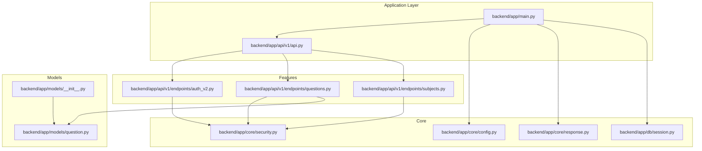

**Diagram sources**
- [main.py:1-52](file://backend/app/main.py#L1-L52)
- [api.py:1-26](file://backend/app/api/v1/api.py#L1-L26)
- [config.py:1-98](file://backend/app/core/config.py#L1-L98)
- [security.py:1-104](file://backend/app/core/security.py#L1-L104)
- [response.py:1-124](file://backend/app/core/response.py#L1-L124)
- [session.py:1-26](file://backend/app/db/session.py#L1-L26)
- [auth_v2.py:1-476](file://backend/app/api/v1/endpoints/auth_v2.py#L1-L476)
- [questions.py:1-431](file://backend/app/api/v1/endpoints/questions.py#L1-L431)
- [subjects.py:1-83](file://backend/app/api/v1/endpoints/subjects.py#L1-L83)
- [__init__.py:1-34](file://backend/app/models/__init__.py#L1-L34)
- [question.py:1-46](file://backend/app/models/question.py#L1-L46)

**Section sources**
- [main.py:1-52](file://backend/app/main.py#L1-L52)
- [api.py:1-26](file://backend/app/api/v1/api.py#L1-L26)

## Core Components
- Application entry point: Creates the FastAPI app, sets metadata, registers middleware, includes the versioned router, and defines startup and health endpoints.
- Configuration system: Centralized settings with environment overrides and fallbacks, including database, Redis, Celery, uploads, OCR, and model cache settings.
- Response wrapper: ASGI middleware that standardizes all API responses under a consistent envelope.
- Security and auth: Password hashing, token creation/refresh/verification, bearer token extraction, current user resolution, and role-based access control.
- Database session: Asynchronous SQLAlchemy engine and session factory with dependency provider and automatic rollback semantics.
- Reference data seeding: Startup routine to initialize reference lookup tables idempotently.

**Section sources**
- [main.py:11-52](file://backend/app/main.py#L11-L52)
- [config.py:36-98](file://backend/app/core/config.py#L36-L98)
- [response.py:14-124](file://backend/app/core/response.py#L14-L124)
- [security.py:16-104](file://backend/app/core/security.py#L16-L104)
- [session.py:5-26](file://backend/app/db/session.py#L5-L26)
- [seed_reference.py:61-72](file://backend/app/seed_reference.py#L61-L72)

## Architecture Overview
The system uses a versioned API approach with a dedicated router that aggregates feature-specific routers. Middleware ensures consistent response formatting and CORS policy. Authentication is centralized with a unified current user abstraction supporting multiple roles. Dependency injection is used extensively to inject database sessions and current user context into endpoints.

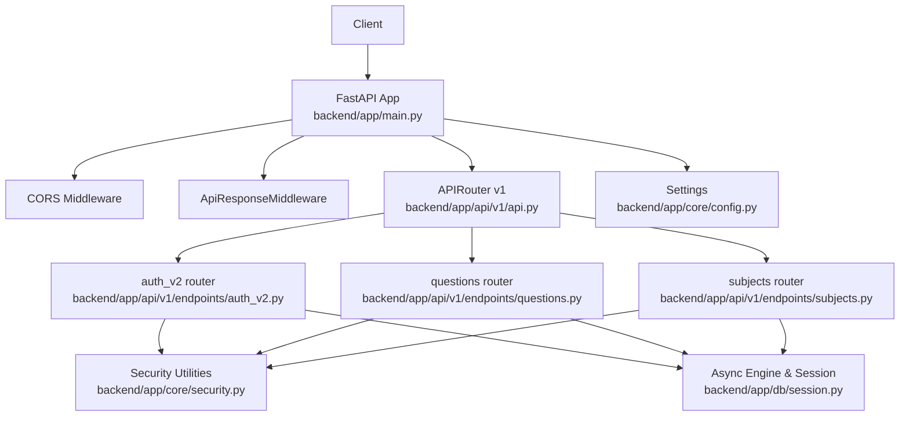

**Diagram sources**
- [main.py:11-31](file://backend/app/main.py#L11-L31)
- [api.py:3-26](file://backend/app/api/v1/api.py#L3-L26)
- [auth_v2.py:21-476](file://backend/app/api/v1/endpoints/auth_v2.py#L21-L476)
- [questions.py:14-431](file://backend/app/api/v1/endpoints/questions.py#L14-L431)
- [subjects.py:10-83](file://backend/app/api/v1/endpoints/subjects.py#L10-L83)
- [session.py:5-26](file://backend/app/db/session.py#L5-L26)
- [security.py:64-96](file://backend/app/core/security.py#L64-L96)
- [config.py:36-98](file://backend/app/core/config.py#L36-L98)

## Detailed Component Analysis

### Application Initialization and Startup
- The application initializes FastAPI with project metadata and OpenAPI path derived from settings.
- Middleware stack:
  - ApiResponseMiddleware wraps all API responses into a uniform envelope.
  - CORS middleware allows all origins for development; adjust in production.
- Router inclusion binds the versioned API router under the configured prefix.
- Startup event:
  - Seeds reference data idempotently on startup using an async database session.
- Health check:
  - Provides a lightweight GET endpoint to verify service availability.

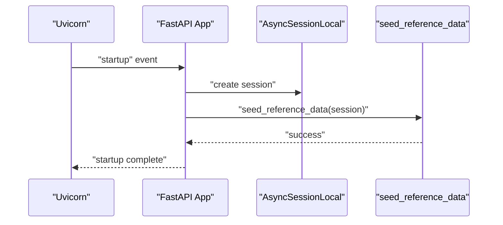

**Diagram sources**
- [main.py:33-43](file://backend/app/main.py#L33-L43)
- [seed_reference.py:61-72](file://backend/app/seed_reference.py#L61-L72)
- [session.py:18-26](file://backend/app/db/session.py#L18-L26)

**Section sources**
- [main.py:11-52](file://backend/app/main.py#L11-L52)
- [seed_reference.py:61-72](file://backend/app/seed_reference.py#L61-L72)

### Routing Strategy and Namespace Separation
- Versioned API:
  - A single APIRouter aggregates feature routers under a versioned prefix.
  - Each feature router is mounted with a descriptive prefix and tag for OpenAPI grouping.
- URL pattern organization:
  - Examples include /api/v1/auth, /api/v1/questions, /api/v1/subjects, etc.
- Tagging:
  - Tags enable logical grouping in the generated OpenAPI documentation.

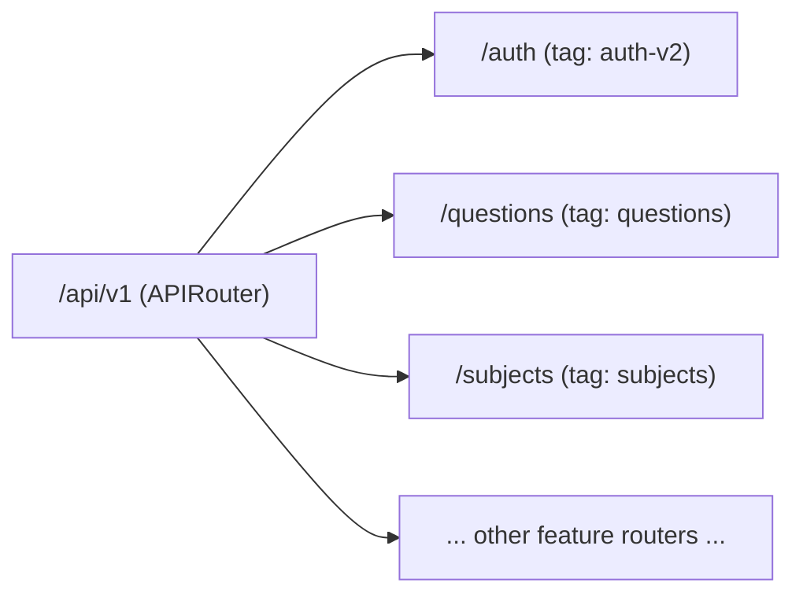

**Diagram sources**
- [api.py:3-26](file://backend/app/api/v1/api.py#L3-L26)

**Section sources**
- [api.py:3-26](file://backend/app/api/v1/api.py#L3-L26)

### Configuration System and Environment Management
- Settings hierarchy:
  - Defaults are defined in the Settings class.
  - Environment variables override defaults via pydantic-settings.
  - Non-sensitive defaults can be loaded from sysconfig.json with environment overrides for secrets.
- Database URLs:
  - Both synchronous and asynchronous database URLs are exposed for compatibility.
- Redis, Celery, uploads, OCR, and model cache settings are centrally managed.
- Environment file:
  - The settings class references an environment file for loading variables.

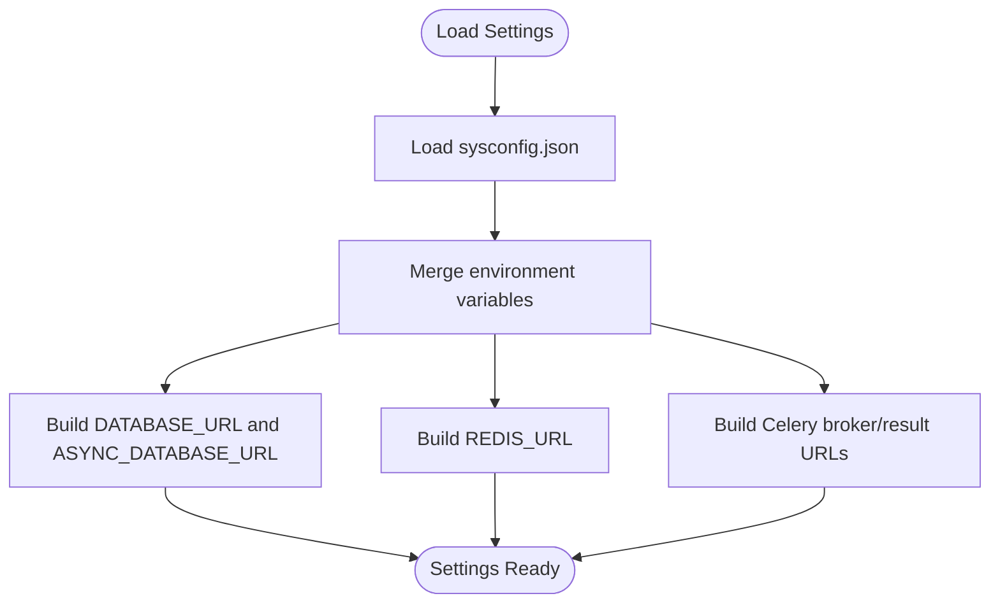

**Diagram sources**
- [config.py:6-98](file://backend/app/core/config.py#L6-L98)
- [sysconfig.json:1-48](file://backend/sysconfig.json#L1-L48)

**Section sources**
- [config.py:36-98](file://backend/app/core/config.py#L36-L98)
- [sysconfig.json:1-48](file://backend/sysconfig.json#L1-L48)

### Security and Authentication Patterns
- Password hashing and verification use bcrypt.
- JWT token creation and refresh support configurable expiration.
- Token extraction uses OAuth2PasswordBearer with a token URL derived from settings.
- Current user resolution:
  - Validates token and resolves the user across multiple roles.
  - Performs role-based access control via a decorator.
- Endpoint dependencies:
  - Many endpoints depend on get_current_user and get_db to enforce auth and inject DB sessions.

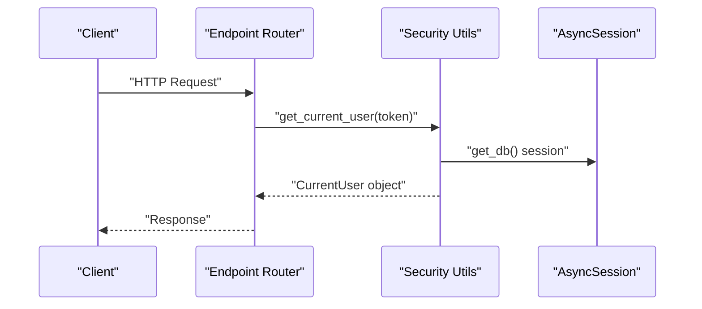

**Diagram sources**
- [security.py:64-96](file://backend/app/core/security.py#L64-L96)
- [session.py:18-26](file://backend/app/db/session.py#L18-L26)

**Section sources**
- [security.py:16-104](file://backend/app/core/security.py#L16-L104)
- [session.py:18-26](file://backend/app/db/session.py#L18-L26)

### Response Wrapping Middleware
- ApiResponseMiddleware intercepts all API responses and wraps them into a standardized envelope.
- It preserves non-JSON responses and handles exceptions gracefully.
- Provides helper functions to construct consistent responses and errors.

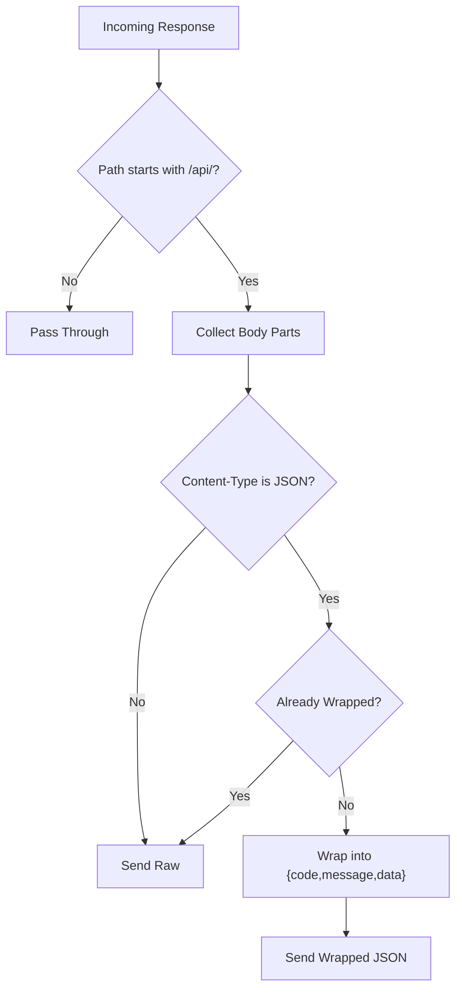

**Diagram sources**
- [response.py:20-101](file://backend/app/core/response.py#L20-L101)

**Section sources**
- [response.py:14-124](file://backend/app/core/response.py#L14-L124)

### Database Session and Dependency Injection
- Asynchronous SQLAlchemy engine and session factory are created from settings.
- A dependency provider yields a session per request and ensures rollback on exceptions.
- Endpoints commonly depend on get_db to access the session.

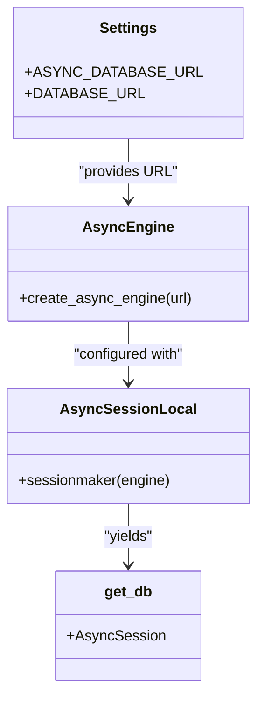

**Diagram sources**
- [config.py:56-61](file://backend/app/core/config.py#L56-L61)
- [session.py:5-26](file://backend/app/db/session.py#L5-L26)

**Section sources**
- [session.py:5-26](file://backend/app/db/session.py#L5-L26)

### Modular Architecture and Endpoint Organization
- Feature routers are imported and included in the versioned router with prefixes and tags.
- Example routers:
  - Authentication and user profile management.
  - Question CRUD, search, export, and typical marking.
  - Subject management for administrators.
- Endpoints depend on get_current_user and get_db to enforce auth and access the database.

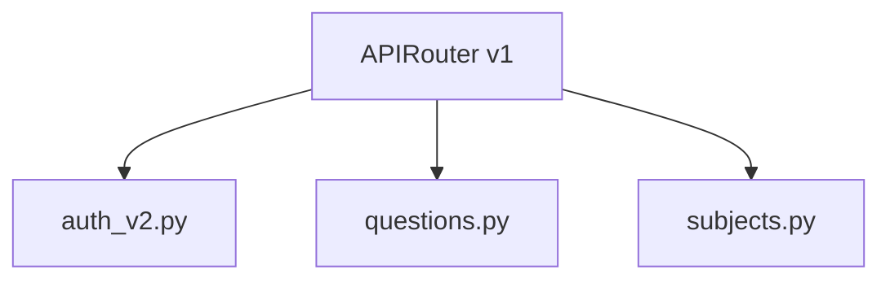

**Diagram sources**
- [api.py:6-26](file://backend/app/api/v1/api.py#L6-L26)
- [auth_v2.py:21-476](file://backend/app/api/v1/endpoints/auth_v2.py#L21-L476)
- [questions.py:14-431](file://backend/app/api/v1/endpoints/questions.py#L14-L431)
- [subjects.py:10-83](file://backend/app/api/v1/endpoints/subjects.py#L10-L83)

**Section sources**
- [api.py:6-26](file://backend/app/api/v1/api.py#L6-L26)
- [auth_v2.py:1-476](file://backend/app/api/v1/endpoints/auth_v2.py#L1-L476)
- [questions.py:1-431](file://backend/app/api/v1/endpoints/questions.py#L1-L431)
- [subjects.py:1-83](file://backend/app/api/v1/endpoints/subjects.py#L1-L83)

### Adding New API Modules: Guidelines
- Create a new endpoint module under the versioned endpoints directory with a descriptive filename.
- Define an APIRouter instance and implement endpoints with:
  - Proper dependencies (get_current_user, get_db).
  - Input validation via Pydantic models.
  - Clear HTTP methods and path parameters.
- Register the new router in the versioned API router with a unique prefix and tag.
- Add any required models and schemas to the models and schemas packages.
- Keep endpoint logic focused and delegate cross-cutting concerns to services.
- Maintain consistent response patterns using the standardized middleware.

**Section sources**
- [api.py:6-26](file://backend/app/api/v1/api.py#L6-L26)
- [auth_v2.py:21-476](file://backend/app/api/v1/endpoints/auth_v2.py#L21-L476)
- [questions.py:14-431](file://backend/app/api/v1/endpoints/questions.py#L14-L431)
- [subjects.py:10-83](file://backend/app/api/v1/endpoints/subjects.py#L10-L83)

## Dependency Analysis
- External dependencies include FastAPI, SQLAlchemy 2.x, asyncpg, Alembic, Pydantic, pydantic-settings, bcrypt, redis, celery, and optional OCR/document libraries.
- The application relies on environment variables and an environment file for configuration.
- Docker and docker-compose define containerization and orchestration for local development.

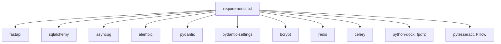

**Diagram sources**
- [requirements.txt:1-27](file://backend/requirements.txt#L1-L27)

**Section sources**
- [requirements.txt:1-27](file://backend/requirements.txt#L1-L27)
- [docker-compose.yml:1-33](file://docker-compose.yml#L1-L33)
- [Dockerfile:1-11](file://backend/Dockerfile#L1-L11)

## Performance Considerations
- Use pagination parameters to limit result sizes and reduce payload overhead.
- Prefer filtering and indexing on frequently queried fields (e.g., subject, grade level).
- Minimize nested queries and leverage bulk operations for imports and exports.
- Ensure database connections are properly closed after use via the dependency provider.
- Monitor and tune Redis and Celery configurations for background tasks.

[No sources needed since this section provides general guidance]

## Troubleshooting Guide
- Health endpoint:
  - Use the health check endpoint to verify service availability.
- CORS issues:
  - Adjust allowed origins in the CORS middleware for production environments.
- Database connectivity:
  - Verify DATABASE_URL and ASYNC_DATABASE_URL from settings.
- Token validation failures:
  - Confirm SECRET_KEY and ALGORITHM match between client and server.
- Reference data seeding:
  - Startup seeding is idempotent; if missing, verify database permissions and connection.

**Section sources**
- [main.py:50-52](file://backend/app/main.py#L50-L52)
- [main.py:21-27](file://backend/app/main.py#L21-L27)
- [config.py:56-61](file://backend/app/core/config.py#L56-L61)
- [security.py:43-47](file://backend/app/core/security.py#L43-L47)
- [seed_reference.py:61-72](file://backend/app/seed_reference.py#L61-L72)

## Conclusion
The application employs a clean, modular FastAPI architecture with versioned routing, centralized configuration, robust security, and standardized response handling. Dependency injection and middleware ensure consistent behavior across endpoints. The structure supports easy extension with new modules while maintaining scalability and maintainability.

[No sources needed since this section summarizes without analyzing specific files]

## Appendices

### Data Model Overview
The question model demonstrates JSONB fields for flexible metadata and constraints for data integrity. Relationships and indexes support efficient querying.

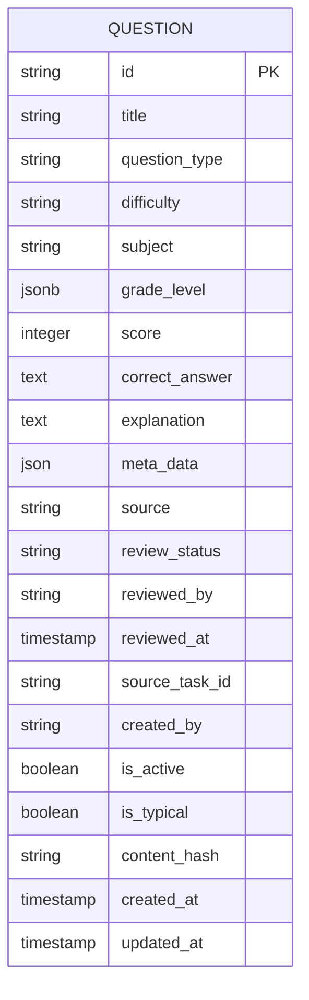

**Diagram sources**
- [question.py:10-46](file://backend/app/models/question.py#L10-L46)

**Section sources**
- [question.py:10-46](file://backend/app/models/question.py#L10-L46)
- [__init__.py:1-34](file://backend/app/models/__init__.py#L1-L34)

### Pagination Helper
A reusable pagination dependency enforces minimum and maximum limits and provides skip/limit parameters for endpoints.

**Section sources**
- [common.py:5-14](file://backend/app/schemas/common.py#L5-L14)