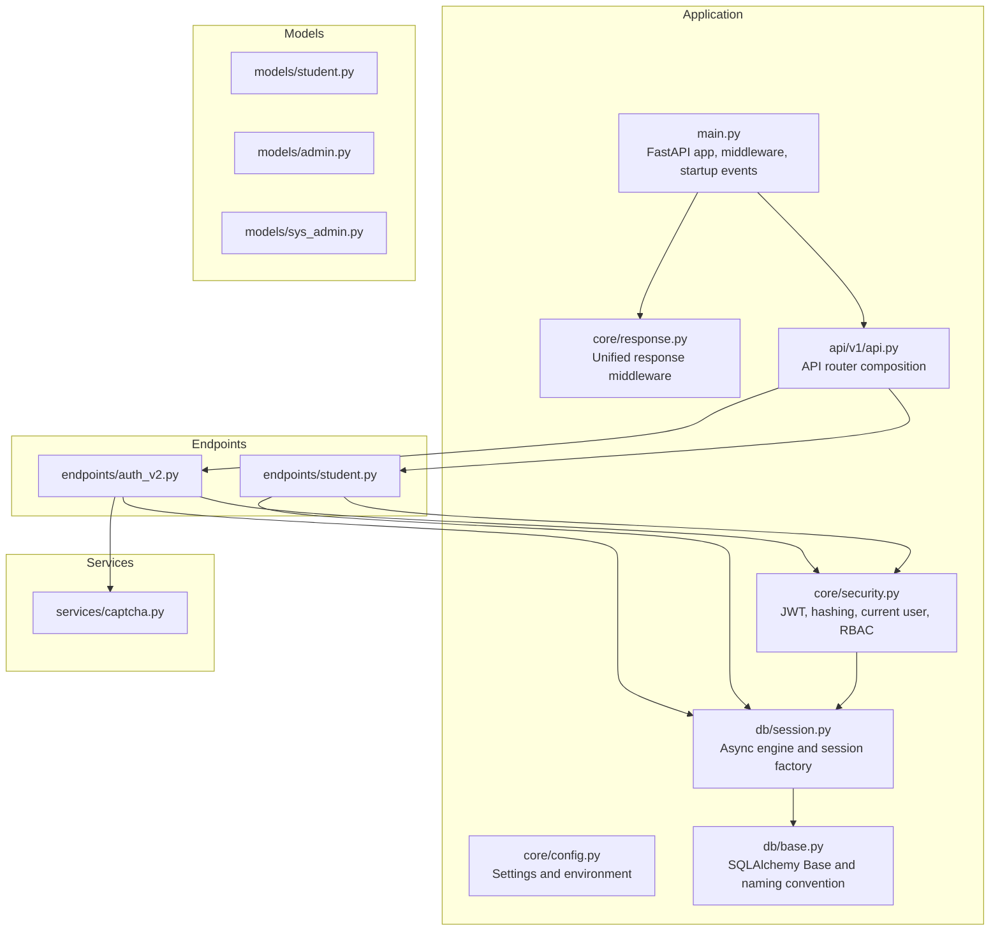
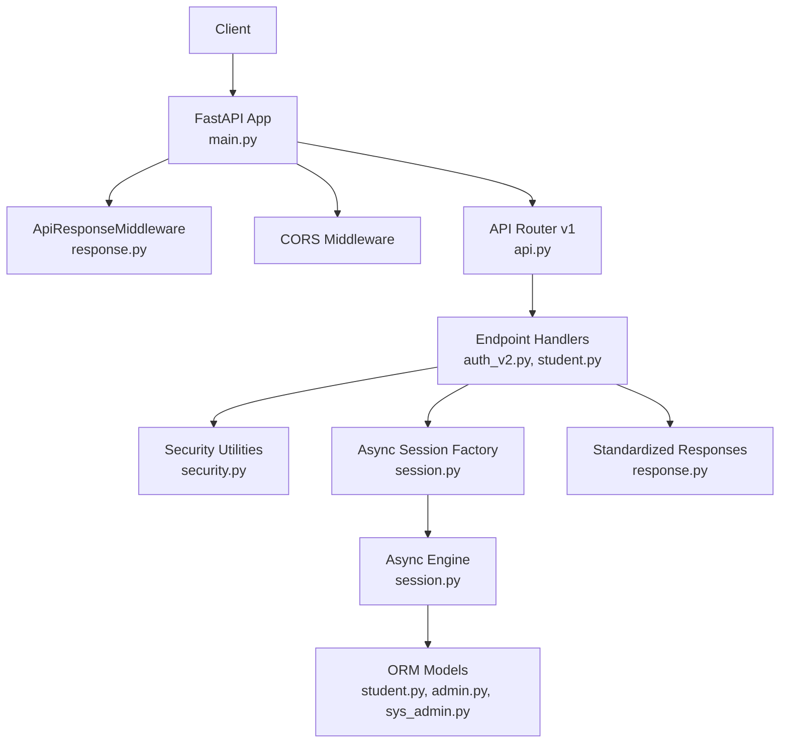
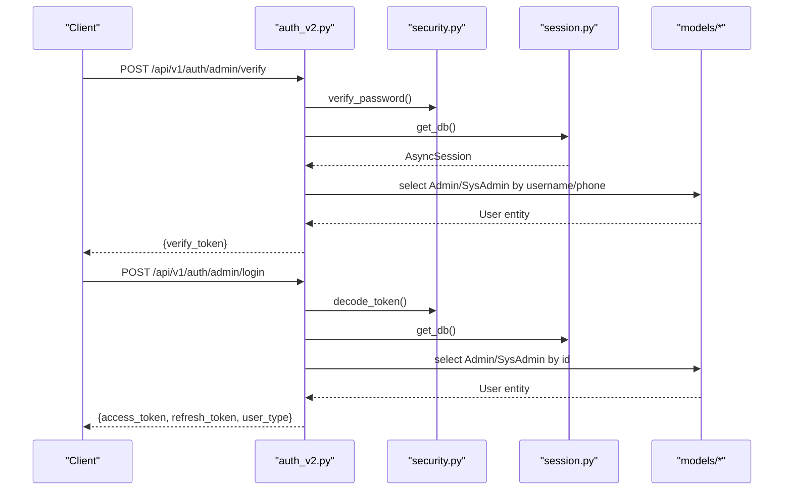
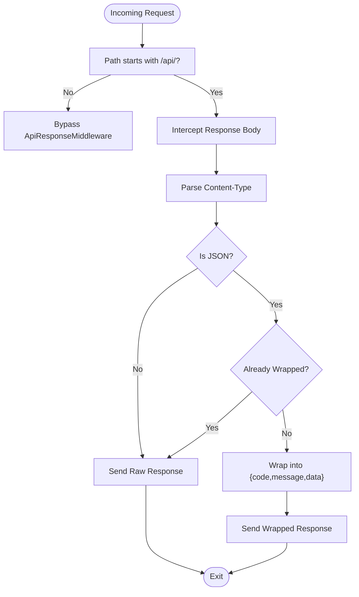
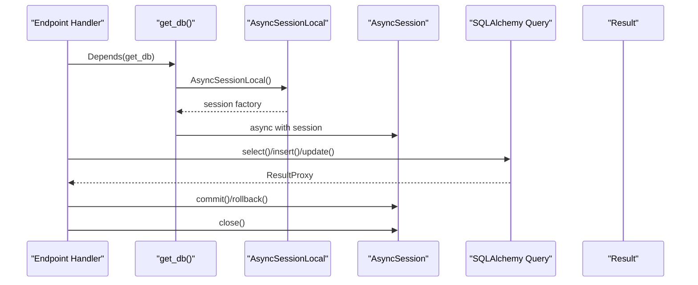
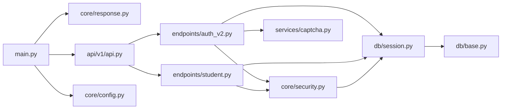

# Backend Architecture

<cite>
**Referenced Files in This Document**
- [main.py](file://backend/app/main.py)
- [config.py](file://backend/app/core/config.py)
- [response.py](file://backend/app/core/response.py)
- [security.py](file://backend/app/core/security.py)
- [session.py](file://backend/app/db/session.py)
- [base.py](file://backend/app/db/base.py)
- [api.py](file://backend/app/api/v1/api.py)
- [auth_v2.py](file://backend/app/api/v1/endpoints/auth_v2.py)
- [student.py](file://backend/app/api/v1/endpoints/student.py)
- [captcha.py](file://backend/app/services/captcha.py)
- [student_model.py](file://backend/app/models/student.py)
- [admin_model.py](file://backend/app/models/admin.py)
- [sys_admin_model.py](file://backend/app/models/sys_admin.py)
- [alembic env.py](file://backend/alembic/env.py)
</cite>

## Table of Contents
1. [Introduction](#introduction)
2. [Project Structure](#project-structure)
3. [Core Components](#core-components)
4. [Architecture Overview](#architecture-overview)
5. [Detailed Component Analysis](#detailed-component-analysis)
6. [Dependency Analysis](#dependency-analysis)
7. [Performance Considerations](#performance-considerations)
8. [Troubleshooting Guide](#troubleshooting-guide)
9. [Conclusion](#conclusion)
10. [Appendices](#appendices)

## Introduction
This document describes the backend architecture of the FastAPI application. It focuses on the layered architecture pattern, dependency injection, middleware configuration, service layer design, repository pattern implementation, database session management, authentication and authorization with JWT and role-based access control, error handling and response formatting, CORS configuration, middleware chain, request/response processing, exception handling, service orchestration, external API integrations, and background task processing. It also provides practical guidelines for adding new endpoints, implementing business logic, and maintaining code quality.

## Project Structure
The backend follows a modular structure organized by layers:
- Application entrypoint and middleware registration
- Core configuration and response formatting
- Database layer with async SQLAlchemy engine and session management
- API versioning with v1 endpoints grouped under a single router
- Domain models and security utilities
- Services for external integrations and utilities

**Diagram sources**
- [main.py:11-31](file://backend/app/main.py#L11-L31)
- [api.py:1-26](file://backend/app/api/v1/api.py#L1-L26)
- [auth_v2.py:1-22](file://backend/app/api/v1/endpoints/auth_v2.py#L1-L22)
- [student.py:1-14](file://backend/app/api/v1/endpoints/student.py#L1-L14)
- [config.py:36-98](file://backend/app/core/config.py#L36-L98)
- [response.py:14-124](file://backend/app/core/response.py#L14-L124)
- [security.py:13-104](file://backend/app/core/security.py#L13-L104)
- [session.py:1-26](file://backend/app/db/session.py#L1-L26)
- [base.py:17-21](file://backend/app/db/base.py#L17-L21)
- [captcha.py:12-40](file://backend/app/services/captcha.py#L12-L40)
- [student_model.py:8-23](file://backend/app/models/student.py#L8-L23)
- [admin_model.py:9-27](file://backend/app/models/admin.py#L9-L27)
- [sys_admin_model.py:8-22](file://backend/app/models/sys_admin.py#L8-L22)

**Section sources**
- [main.py:11-31](file://backend/app/main.py#L11-L31)
- [api.py:1-26](file://backend/app/api/v1/api.py#L1-L26)

## Core Components
- Application entrypoint and middleware:
  - FastAPI app initialization with project metadata and OpenAPI URL
  - Unified response middleware that wraps all /api/ responses into a standardized format
  - CORS middleware configured for development (allow all origins)
  - API router inclusion under the v1 prefix
  - Startup event seeds reference data using an async database session
- Configuration:
  - Centralized settings class loading from sysconfig.json with environment overrides
  - Database URLs for sync/async engines, Redis, Celery, upload limits, OCR defaults, model cache directory
- Response formatting:
  - ASGI middleware that intercepts HTTP responses, detects JSON content, and wraps them into {code, message, data}
  - Helpers for constructing standardized success and error responses
- Security:
  - Password hashing with bcrypt
  - JWT creation/refresh with configurable expiration
  - OAuth2 password bearer scheme pointing to the login endpoint
  - Current user extraction from JWT with cross-table verification
  - Role-based access control decorator enforcing allowed roles
- Database:
  - Async SQLAlchemy engine and session factory
  - Dependency provider yielding sessions per request with automatic rollback and close
  - Shared Base class with naming convention for constraints

**Section sources**
- [main.py:11-52](file://backend/app/main.py#L11-L52)
- [config.py:36-98](file://backend/app/core/config.py#L36-L98)
- [response.py:14-124](file://backend/app/core/response.py#L14-L124)
- [security.py:13-104](file://backend/app/core/security.py#L13-L104)
- [session.py:1-26](file://backend/app/db/session.py#L1-L26)
- [base.py:17-21](file://backend/app/db/base.py#L17-L21)

## Architecture Overview
The system uses a layered architecture:
- Presentation Layer: FastAPI routes and routers under v1
- Service Layer: Business logic orchestrators (external service integrations, OCR, LLM, storage)
- Persistence Layer: SQLAlchemy ORM models and async sessions
- Infrastructure Layer: Configuration, middleware, security utilities

**Diagram sources**
- [main.py:11-31](file://backend/app/main.py#L11-L31)
- [response.py:14-124](file://backend/app/core/response.py#L14-L124)
- [api.py:1-26](file://backend/app/api/v1/api.py#L1-L26)
- [auth_v2.py:1-22](file://backend/app/api/v1/endpoints/auth_v2.py#L1-L22)
- [student.py:1-14](file://backend/app/api/v1/endpoints/student.py#L1-L14)
- [security.py:64-96](file://backend/app/core/security.py#L64-L96)
- [session.py:1-26](file://backend/app/db/session.py#L1-L26)
- [student_model.py:8-23](file://backend/app/models/student.py#L8-L23)
- [admin_model.py:9-27](file://backend/app/models/admin.py#L9-L27)
- [sys_admin_model.py:8-22](file://backend/app/models/sys_admin.py#L8-L22)

## Detailed Component Analysis

### Authentication and Authorization System
- JWT token handling:
  - Access and refresh tokens created with expiration deltas
  - Decoding validates signature and algorithm
- User identity extraction:
  - OAuth2 password bearer scheme resolves token from Authorization header
  - get_current_user decodes token, verifies existence in the appropriate user table based on type
- Role-based access control:
  - require_role enforces allowed roles and raises HTTP 403 if unauthorized
- Endpoint examples:
  - Admin login with captcha and SMS verification, followed by token issuance
  - Student login/register with SMS verification and token issuance
  - Profile retrieval and updates across user types

**Diagram sources**
- [auth_v2.py:91-184](file://backend/app/api/v1/endpoints/auth_v2.py#L91-L184)
- [security.py:64-96](file://backend/app/core/security.py#L64-L96)
- [session.py:18-26](file://backend/app/db/session.py#L18-L26)
- [admin_model.py:9-27](file://backend/app/models/admin.py#L9-L27)
- [sys_admin_model.py:8-22](file://backend/app/models/sys_admin.py#L8-L22)

**Section sources**
- [auth_v2.py:25-71](file://backend/app/api/v1/endpoints/auth_v2.py#L25-L71)
- [auth_v2.py:91-184](file://backend/app/api/v1/endpoints/auth_v2.py#L91-L184)
- [security.py:64-104](file://backend/app/core/security.py#L64-L104)

### Response Formatting and Middleware Chain
- ApiResponseMiddleware:
  - Intercepts HTTP responses for /api/ paths
  - Wraps successful responses into {code, message, data} and sets status to 200
  - Wraps error responses into {code, message, detail, data} preserving HTTP status
  - Sends raw responses when content is not JSON or already wrapped
  - Provides fallback 500 response on unhandled exceptions
- CORS:
  - Configured globally with allow-all for development
- Startup seeding:
  - Seeds reference data during app startup using AsyncSessionLocal

**Diagram sources**
- [response.py:20-101](file://backend/app/core/response.py#L20-L101)

**Section sources**
- [response.py:14-124](file://backend/app/core/response.py#L14-L124)
- [main.py:17-27](file://backend/app/main.py#L17-L27)
- [main.py:33-43](file://backend/app/main.py#L33-L43)

### Database Session Management and Repository Pattern
- Async engine and session factory:
  - Async engine created from ASYNC_DATABASE_URL
  - Session factory yields AsyncSession instances
- Session dependency:
  - get_db provides a context manager that ensures rollback on exceptions and closes the session
- Repository pattern:
  - Endpoints perform SQLAlchemy queries using AsyncSession
  - Models define table schemas and relationships
- Alembic integration:
  - env.py configures migration environment for schema evolution

**Diagram sources**
- [session.py:18-26](file://backend/app/db/session.py#L18-L26)
- [auth_v2.py:92-107](file://backend/app/api/v1/endpoints/auth_v2.py#L92-L107)
- [student.py:18-25](file://backend/app/api/v1/endpoints/student.py#L18-L25)

**Section sources**
- [session.py:1-26](file://backend/app/db/session.py#L1-L26)
- [base.py:17-21](file://backend/app/db/base.py#L17-L21)
- [alembic env.py](file://backend/alembic/env.py)

### Service Layer Design and External Integrations
- Captcha service:
  - Generates SVG captchas and stores codes in memory with expiration
  - Verifies captcha codes once and removes them
- OCR and LLM services:
  - Located under services/ for OCR and LLM integrations
- Storage and background tasks:
  - Redis and Celery settings present in configuration for potential background task processing

**Section sources**
- [captcha.py:12-40](file://backend/app/services/captcha.py#L12-L40)
- [config.py:73-76](file://backend/app/core/config.py#L73-L76)

### Endpoint Orchestration Examples
- Authentication endpoints:
  - Admin verification and login with SMS and captcha checks
  - Student login/register with SMS verification and token issuance
- Student statistics:
  - Aggregates submission counts, accuracy, error notebook totals, recent papers, and subject distribution

**Section sources**
- [auth_v2.py:91-184](file://backend/app/api/v1/endpoints/auth_v2.py#L91-L184)
- [auth_v2.py:188-238](file://backend/app/api/v1/endpoints/auth_v2.py#L188-L238)
- [student.py:16-112](file://backend/app/api/v1/endpoints/student.py#L16-L112)

## Dependency Analysis
- Application dependencies:
  - main.py depends on core/config, core/response, api/v1/api, and db/session
  - API router composes multiple endpoint routers
  - Endpoints depend on security utilities and database sessions
- Security and models:
  - security.py depends on models for cross-table verification
  - models depend on db/base for declarative base and naming conventions
- Configuration:
  - All components read from centralized settings

**Diagram sources**
- [main.py:11-31](file://backend/app/main.py#L11-L31)
- [api.py:1-26](file://backend/app/api/v1/api.py#L1-L26)
- [auth_v2.py:1-22](file://backend/app/api/v1/endpoints/auth_v2.py#L1-L22)
- [student.py:1-14](file://backend/app/api/v1/endpoints/student.py#L1-L14)
- [security.py:64-96](file://backend/app/core/security.py#L64-L96)
- [session.py:1-26](file://backend/app/db/session.py#L1-L26)
- [base.py:17-21](file://backend/app/db/base.py#L17-L21)
- [config.py:36-98](file://backend/app/core/config.py#L36-L98)
- [captcha.py:12-40](file://backend/app/services/captcha.py#L12-L40)

**Section sources**
- [main.py:11-31](file://backend/app/main.py#L11-L31)
- [api.py:1-26](file://backend/app/api/v1/api.py#L1-L26)
- [security.py:64-96](file://backend/app/core/security.py#L64-L96)
- [session.py:1-26](file://backend/app/db/session.py#L1-L26)
- [base.py:17-21](file://backend/app/db/base.py#L17-L21)
- [config.py:36-98](file://backend/app/core/config.py#L36-L98)

## Performance Considerations
- Use async database sessions to avoid blocking I/O
- Minimize ORM overhead by selecting only required columns and using efficient joins
- Cache frequently accessed reference data and reduce repeated queries
- Keep response bodies small; avoid serializing large objects unnecessarily
- Use pagination for list endpoints to limit payload sizes

## Troubleshooting Guide
- CORS issues:
  - Ensure allow_origins is restricted to specific domains in production
- JWT validation failures:
  - Confirm SECRET_KEY matches across deployments and token issuer
  - Verify token expiration and algorithm alignment
- Session errors:
  - Ensure get_db dependency is used consistently and exceptions trigger rollback
- Response wrapping anomalies:
  - Confirm endpoints return JSON-compatible structures; non-JSON responses bypass wrapping intentionally
- Startup seeding:
  - If seeding fails, check database connectivity and permissions

**Section sources**
- [main.py:21-27](file://backend/app/main.py#L21-L27)
- [security.py:43-47](file://backend/app/core/security.py#L43-L47)
- [session.py:18-26](file://backend/app/db/session.py#L18-L26)
- [response.py:50-87](file://backend/app/core/response.py#L50-L87)
- [main.py:33-43](file://backend/app/main.py#L33-L43)

## Conclusion
The backend employs a clean layered architecture with explicit separation of concerns. FastAPI’s dependency injection integrates seamlessly with SQLAlchemy’s async sessions, while middleware ensures consistent response formatting. The security layer centralizes JWT handling and RBAC enforcement. The modular endpoint design and service utilities support scalable growth. Following the guidelines below will help maintain consistency and reliability as new features are added.

## Appendices

### Guidelines for Adding New Endpoints
- Create a new router module under api/v1/endpoints and define route handlers
- Register the router in api/v1/api.py with appropriate prefix and tags
- Use get_current_user and require_role decorators for authorization
- Inject AsyncSession via Depends(get_db) and handle commits/rollbacks appropriately
- Return standardized responses using helpers from response.py or rely on ApiResponseMiddleware
- Add Pydantic models for request/response schemas alongside handlers

**Section sources**
- [api.py:6-26](file://backend/app/api/v1/api.py#L6-L26)
- [auth_v2.py:1-22](file://backend/app/api/v1/endpoints/auth_v2.py#L1-L22)
- [response.py:116-124](file://backend/app/core/response.py#L116-L124)

### Implementing Business Logic
- Encapsulate complex workflows in service modules under services/
- Integrate external APIs (OCR, LLM, storage) via service classes
- Keep endpoints thin: delegate to services and return structured results
- Validate inputs early and raise HTTPException with clear messages
- Use transactions carefully; ensure rollback on exceptions

**Section sources**
- [captcha.py:12-40](file://backend/app/services/captcha.py#L12-L40)
- [config.py:73-86](file://backend/app/core/config.py#L73-L86)

### Maintaining Code Quality
- Centralize configuration in core/config.py and load from sysconfig.json with environment overrides
- Enforce consistent response formatting with ApiResponseMiddleware
- Use async patterns throughout: async handlers, async sessions, and async services
- Keep models in models/ with clear relationships; leverage db/base.py naming conventions
- Apply RBAC via require_role and fetch current user via get_current_user
- Document endpoint behavior and schemas in router modules

**Section sources**
- [config.py:6-31](file://backend/app/core/config.py#L6-L31)
- [response.py:14-124](file://backend/app/core/response.py#L14-L124)
- [security.py:98-104](file://backend/app/core/security.py#L98-L104)
- [base.py:17-21](file://backend/app/db/base.py#L17-L21)