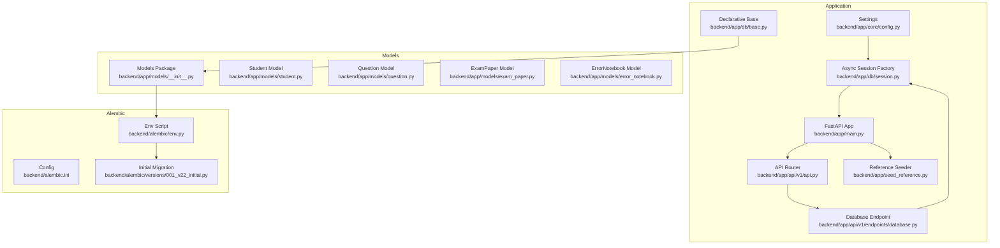
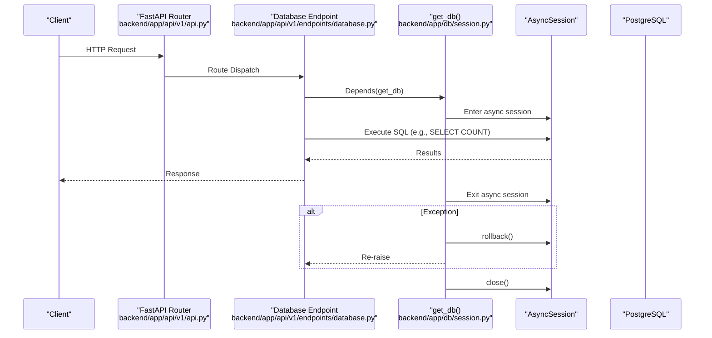
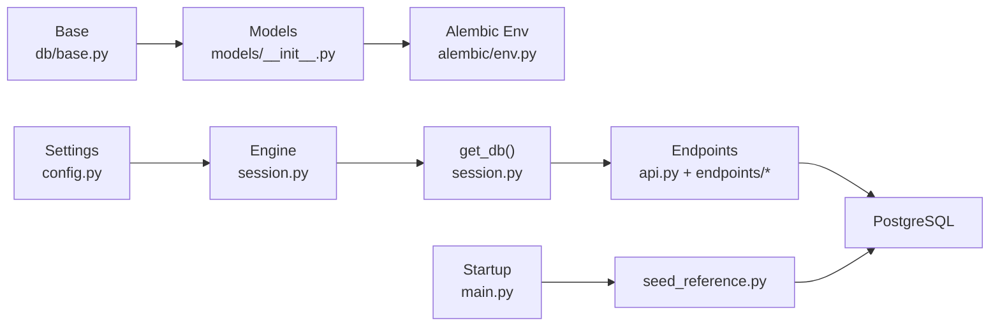

# Database Session Management

<cite>
**Referenced Files in This Document**
- [backend/app/db/base.py](file://backend/app/db/base.py)
- [backend/app/db/session.py](file://backend/app/db/session.py)
- [backend/app/core/config.py](file://backend/app/core/config.py)
- [backend/app/main.py](file://backend/app/main.py)
- [backend/app/api/v1/endpoints/database.py](file://backend/app/api/v1/endpoints/database.py)
- [backend/app/api/v1/api.py](file://backend/app/api/v1/api.py)
- [backend/app/seed_reference.py](file://backend/app/seed_reference.py)
- [backend/alembic/env.py](file://backend/alembic/env.py)
- [backend/alembic.ini](file://backend/alembic.ini)
- [backend/alembic/versions/001_v22_initial.py](file://backend/alembic/versions/001_v22_initial.py)
- [backend/app/models/__init__.py](file://backend/app/models/__init__.py)
- [backend/app/models/student.py](file://backend/app/models/student.py)
- [backend/app/models/question.py](file://backend/app/models/question.py)
- [backend/app/models/exam_paper.py](file://backend/app/models/exam_paper.py)
- [backend/app/models/error_notebook.py](file://backend/app/models/error_notebook.py)
</cite>

## Table of Contents
1. [Introduction](#introduction)
2. [Project Structure](#project-structure)
3. [Core Components](#core-components)
4. [Architecture Overview](#architecture-overview)
5. [Detailed Component Analysis](#detailed-component-analysis)
6. [Dependency Analysis](#dependency-analysis)
7. [Performance Considerations](#performance-considerations)
8. [Troubleshooting Guide](#troubleshooting-guide)
9. [Conclusion](#conclusion)
10. [Appendices](#appendices)

## Introduction
This document explains the database session management and ORM configuration used by the backend. It covers SQLAlchemy async session configuration, connection pooling, transaction management, the declarative base class, model inheritance patterns, and relationship definitions. It also documents the database initialization process, session lifecycle, resource cleanup, error handling strategies, connection recovery, performance optimization, Alembic integration for migrations, and schema evolution. Finally, it provides guidelines for implementing new models, optimizing queries, and maintaining database consistency.

## Project Structure
The database layer is organized around a shared declarative base, an async session factory, and a dependency provider that supplies sessions to FastAPI endpoints. Models are grouped under a single package and imported into Alembic’s target metadata for migrations. Alembic configuration reads the runtime database URL from application settings and applies migrations offline or online.

**Diagram sources**
- [backend/app/db/base.py:1-21](file://backend/app/db/base.py#L1-L21)
- [backend/app/db/session.py:1-26](file://backend/app/db/session.py#L1-L26)
- [backend/app/core/config.py:1-98](file://backend/app/core/config.py#L1-L98)
- [backend/app/main.py:1-52](file://backend/app/main.py#L1-L52)
- [backend/app/api/v1/api.py:1-26](file://backend/app/api/v1/api.py#L1-L26)
- [backend/app/api/v1/endpoints/database.py:1-167](file://backend/app/api/v1/endpoints/database.py#L1-L167)
- [backend/app/seed_reference.py:1-72](file://backend/app/seed_reference.py#L1-L72)
- [backend/alembic/env.py:1-80](file://backend/alembic/env.py#L1-L80)
- [backend/alembic.ini:1-150](file://backend/alembic.ini#L1-L150)
- [backend/alembic/versions/001_v22_initial.py:1-426](file://backend/alembic/versions/001_v22_initial.py#L1-L426)
- [backend/app/models/__init__.py:1-34](file://backend/app/models/__init__.py#L1-L34)
- [backend/app/models/student.py:1-23](file://backend/app/models/student.py#L1-L23)
- [backend/app/models/question.py:1-46](file://backend/app/models/question.py#L1-L46)
- [backend/app/models/exam_paper.py:1-51](file://backend/app/models/exam_paper.py#L1-L51)
- [backend/app/models/error_notebook.py:1-32](file://backend/app/models/error_notebook.py#L1-L32)

**Section sources**
- [backend/app/db/base.py:1-21](file://backend/app/db/base.py#L1-L21)
- [backend/app/db/session.py:1-26](file://backend/app/db/session.py#L1-L26)
- [backend/app/core/config.py:1-98](file://backend/app/core/config.py#L1-L98)
- [backend/app/main.py:1-52](file://backend/app/main.py#L1-L52)
- [backend/app/api/v1/api.py:1-26](file://backend/app/api/v1/api.py#L1-L26)
- [backend/app/api/v1/endpoints/database.py:1-167](file://backend/app/api/v1/endpoints/database.py#L1-L167)
- [backend/app/seed_reference.py:1-72](file://backend/app/seed_reference.py#L1-L72)
- [backend/alembic/env.py:1-80](file://backend/alembic/env.py#L1-L80)
- [backend/alembic.ini:1-150](file://backend/alembic.ini#L1-L150)
- [backend/alembic/versions/001_v22_initial.py:1-426](file://backend/alembic/versions/001_v22_initial.py#L1-L426)
- [backend/app/models/__init__.py:1-34](file://backend/app/models/__init__.py#L1-L34)
- [backend/app/models/student.py:1-23](file://backend/app/models/student.py#L1-L23)
- [backend/app/models/question.py:1-46](file://backend/app/models/question.py#L1-L46)
- [backend/app/models/exam_paper.py:1-51](file://backend/app/models/exam_paper.py#L1-L51)
- [backend/app/models/error_notebook.py:1-32](file://backend/app/models/error_notebook.py#L1-L32)

## Core Components
- Declarative Base: A shared DeclarativeBase subclass with a centralized MetaData object and naming convention for constraints.
- Async Engine and Session Factory: An async engine configured via application settings and an async session factory with expire_on_commit disabled.
- Dependency Provider: A FastAPI dependency that yields an AsyncSession, ensuring rollback on exceptions and closure in finally.
- Settings: Provides DATABASE_URL and ASYNC_DATABASE_URL derived from environment and sysconfig.json.
- Startup Seed: On application startup, seeds reference data using an AsyncSession.

Key responsibilities:
- Centralized constraint naming and metadata.
- Async-only ORM usage with explicit transaction boundaries.
- Idempotent reference data seeding on startup.
- Alembic integration for schema evolution.

**Section sources**
- [backend/app/db/base.py:1-21](file://backend/app/db/base.py#L1-L21)
- [backend/app/db/session.py:1-26](file://backend/app/db/session.py#L1-L26)
- [backend/app/core/config.py:55-62](file://backend/app/core/config.py#L55-L62)
- [backend/app/main.py:33-43](file://backend/app/main.py#L33-L43)
- [backend/app/seed_reference.py:61-72](file://backend/app/seed_reference.py#L61-L72)

## Architecture Overview
The system uses FastAPI with SQLAlchemy async ORM. Sessions are dependency-injected into endpoints. Alembic manages schema changes, sourcing the database URL from runtime settings. Models register themselves with the shared Base, enabling Alembic to track metadata.

**Diagram sources**
- [backend/app/api/v1/api.py:1-26](file://backend/app/api/v1/api.py#L1-L26)
- [backend/app/api/v1/endpoints/database.py:1-167](file://backend/app/api/v1/endpoints/database.py#L1-L167)
- [backend/app/db/session.py:18-26](file://backend/app/db/session.py#L18-L26)

**Section sources**
- [backend/app/db/session.py:18-26](file://backend/app/db/session.py#L18-L26)
- [backend/app/api/v1/endpoints/database.py:23-85](file://backend/app/api/v1/endpoints/database.py#L23-L85)

## Detailed Component Analysis

### Declarative Base and Naming Conventions
- Defines a shared MetaData with a naming convention for indexes, unique constraints, check constraints, foreign keys, and primary keys.
- Provides a Base class that all models inherit from, ensuring consistent constraint names across the schema.

Implementation highlights:
- Centralized naming convention improves maintainability and readability of constraint names.
- Base.metadata is imported by Alembic to track model metadata.

**Section sources**
- [backend/app/db/base.py:5-21](file://backend/app/db/base.py#L5-L21)
- [backend/alembic/env.py:31](file://backend/alembic/env.py#L31)

### Async Engine and Session Factory
- Creates an async engine using ASYNC_DATABASE_URL from settings.
- Builds an AsyncSessionLocal session factory with expire_on_commit disabled to avoid expired object errors after commit.
- Provides a dependency get_db that yields a session, rolls back on exceptions, and closes the session in finally.

Operational notes:
- No explicit pool configuration is set; defaults apply. Consider tuning pool_size, max_overflow, pool_recycle, and pool_pre_ping for production.
- expire_on_commit=False allows accessing objects after commit but requires careful handling of stale data.

**Section sources**
- [backend/app/db/session.py:6-15](file://backend/app/db/session.py#L6-L15)
- [backend/app/db/session.py:18-26](file://backend/app/db/session.py#L18-L26)
- [backend/app/core/config.py:60-61](file://backend/app/core/config.py#L60-L61)

### Transaction Management and Session Lifecycle
- get_db ensures a try/except/finally block: on exception, the session is rolled back and re-raised; the session is closed in finally.
- This pattern guarantees deterministic cleanup and prevents dangling transactions.

Best practices:
- Keep transactions short; avoid long-running work inside a session.
- Use flush strategically to persist intermediate state when needed.

**Section sources**
- [backend/app/db/session.py:20-25](file://backend/app/db/session.py#L20-L25)

### Database Initialization and Reference Data Seeding
- On startup, the application opens a session from AsyncSessionLocal and runs seed_reference_data.
- seed_reference_data checks if reference records exist; if not, it inserts them idempotently and commits.

Guidelines:
- Keep seed operations lightweight and idempotent.
- Run seed logic outside of request handlers to avoid latency spikes.

**Section sources**
- [backend/app/main.py:33-43](file://backend/app/main.py#L33-L43)
- [backend/app/seed_reference.py:61-72](file://backend/app/seed_reference.py#L61-L72)

### Model Definitions and Relationship Patterns
- Models inherit from Base and define columns, indices, and constraints.
- Many-to-many relationships are implemented via association tables (e.g., exam_paper_questions).
- Relationships use back_populates and lazy loading strategies (e.g., selectin).

Examples:
- Question defines relationships to ExamPaper via an association table and includes multiple CheckConstraints.
- ExamPaper defines a many-to-many relationship to Question using the association table.
- ErrorNotebook defines a relationship with ErrorNotebookQuestion using lazy="selectin".

**Section sources**
- [backend/app/models/question.py:10-46](file://backend/app/models/question.py#L10-L46)
- [backend/app/models/exam_paper.py:9-51](file://backend/app/models/exam_paper.py#L9-L51)
- [backend/app/models/error_notebook.py:8-32](file://backend/app/models/error_notebook.py#L8-L32)
- [backend/app/models/student.py:8-23](file://backend/app/models/student.py#L8-L23)

### Alembic Integration and Schema Evolution
- Alembic env.py imports Base and all models to register them with target_metadata.
- Overrides sqlalchemy.url with DATABASE_URL from settings and normalizes PostgreSQL driver prefixes.
- Supports offline and online migrations using NullPool for online connections.

Migration workflow:
- Use alembic commands to stamp, migrate, and downgrade.
- Initial migration creates the complete schema; subsequent migrations evolve it.

**Section sources**
- [backend/alembic/env.py:7-31](file://backend/alembic/env.py#L7-L31)
- [backend/alembic/env.py:17-20](file://backend/alembic/env.py#L17-L20)
- [backend/alembic/env.py:63-80](file://backend/alembic/env.py#L63-L80)
- [backend/alembic/versions/001_v22_initial.py:10-426](file://backend/alembic/versions/001_v22_initial.py#L10-L426)
- [backend/alembic.ini:89-91](file://backend/alembic.ini#L89-L91)

### Endpoint Usage of Async Sessions
- The database endpoint demonstrates typical async session usage: dependency injection, executing raw SQL, and returning structured results.
- It also exposes a database status endpoint that queries PostgreSQL internals.

**Section sources**
- [backend/app/api/v1/endpoints/database.py:23-85](file://backend/app/api/v1/endpoints/database.py#L23-L85)
- [backend/app/api/v1/endpoints/database.py:96-144](file://backend/app/api/v1/endpoints/database.py#L96-L144)

## Dependency Analysis
The following diagram shows how components depend on each other for database operations and migrations.

**Diagram sources**
- [backend/app/core/config.py:55-62](file://backend/app/core/config.py#L55-L62)
- [backend/app/db/base.py:17-21](file://backend/app/db/base.py#L17-L21)
- [backend/app/models/__init__.py:1-34](file://backend/app/models/__init__.py#L1-L34)
- [backend/alembic/env.py:7-31](file://backend/alembic/env.py#L7-L31)
- [backend/app/db/session.py:6-15](file://backend/app/db/session.py#L6-L15)
- [backend/app/db/session.py:18-26](file://backend/app/db/session.py#L18-L26)
- [backend/app/api/v1/api.py:1-26](file://backend/app/api/v1/api.py#L1-L26)
- [backend/app/api/v1/endpoints/database.py:1-167](file://backend/app/api/v1/endpoints/database.py#L1-L167)
- [backend/app/main.py:33-43](file://backend/app/main.py#L33-L43)
- [backend/app/seed_reference.py:61-72](file://backend/app/seed_reference.py#L61-L72)

**Section sources**
- [backend/app/db/session.py:6-15](file://backend/app/db/session.py#L6-L15)
- [backend/app/db/session.py:18-26](file://backend/app/db/session.py#L18-L26)
- [backend/app/models/__init__.py:1-34](file://backend/app/models/__init__.py#L1-L34)
- [backend/alembic/env.py:7-31](file://backend/alembic/env.py#L7-L31)
- [backend/app/api/v1/endpoints/database.py:1-167](file://backend/app/api/v1/endpoints/database.py#L1-L167)

## Performance Considerations
- Pool configuration: Consider setting pool_size, max_overflow, pool_recycle, and pool_pre_ping in the async engine for production environments.
- Expire on commit: With expire_on_commit=False, avoid long-lived objects; refresh or re-fetch when stale data is suspected.
- Query patterns: Use selectin loading for relationships that are frequently accessed (e.g., ErrorNotebook.questions).
- Indexes: Ensure selective columns are indexed (e.g., subject, is_active, content_hash) to speed up filtering and joins.
- Transactions: Keep transactions short; batch writes when inserting large datasets.
- Alembic migrations: Plan schema changes carefully; avoid expensive schema alterations on large tables without downtime or background jobs.

[No sources needed since this section provides general guidance]

## Troubleshooting Guide
Common issues and strategies:
- Connection failures: Verify ASYNC_DATABASE_URL and network connectivity. Use pool_pre_ping and retry logic at the application level.
- Stale object errors: With expire_on_commit=False, re-fetch objects or use fresh sessions for long operations.
- Deadlocks and timeouts: Reduce transaction duration, avoid holding locks across requests, and tune PostgreSQL parameters.
- Migration errors: Check Alembic env overrides and ensure DATABASE_URL matches the target environment. Use offline mode to inspect SQL before applying.
- Resource leaks: Ensure get_db is used consistently; sessions are closed in finally blocks.

**Section sources**
- [backend/app/db/session.py:20-25](file://backend/app/db/session.py#L20-L25)
- [backend/app/core/config.py:55-62](file://backend/app/core/config.py#L55-L62)
- [backend/alembic/env.py:17-20](file://backend/alembic/env.py#L17-L20)

## Conclusion
The backend employs a clean separation of concerns for database access: a shared declarative base, an async session factory with robust dependency management, and Alembic-driven migrations. By following the outlined patterns—short transactions, appropriate indexing, careful relationship loading, and idempotent seeding—you can build scalable and maintainable database features while keeping migrations predictable and safe.

[No sources needed since this section summarizes without analyzing specific files]

## Appendices

### Guidelines for Implementing New Models
- Inherit from Base and define columns, indices, and constraints.
- Use association tables for many-to-many relationships and define them alongside the related models.
- Add relationships with appropriate lazy loading (e.g., selectin) for frequently accessed collections.
- Keep naming conventions consistent; rely on Base.metadata naming convention.
- Register the model in the models package __init__ to ensure Alembic tracks it.

**Section sources**
- [backend/app/db/base.py:17-21](file://backend/app/db/base.py#L17-L21)
- [backend/app/models/exam_paper.py:9-21](file://backend/app/models/exam_paper.py#L9-L21)
- [backend/app/models/error_notebook.py:29](file://backend/app/models/error_notebook.py#L29)
- [backend/app/models/__init__.py:1-34](file://backend/app/models/__init__.py#L1-L34)

### Query Optimization Tips
- Use selectin for N+1 scenarios in relationships.
- Add indexes on filter/select columns (e.g., subject, is_active, content_hash).
- Prefer bulk operations for inserts/updates.
- Avoid selecting unnecessary columns; use specific column selection.

[No sources needed since this section provides general guidance]

### Maintaining Database Consistency
- Use CheckConstraints to enforce domain rules at the database level.
- Keep migrations minimal and reversible; test upgrades/downgrades.
- Seed reference data idempotently during startup.

**Section sources**
- [backend/app/models/question.py:39-43](file://backend/app/models/question.py#L39-L43)
- [backend/app/models/exam_paper.py:44-48](file://backend/app/models/exam_paper.py#L44-L48)
- [backend/app/seed_reference.py:61-72](file://backend/app/seed_reference.py#L61-L72)