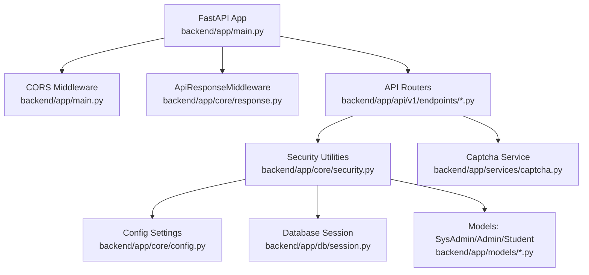
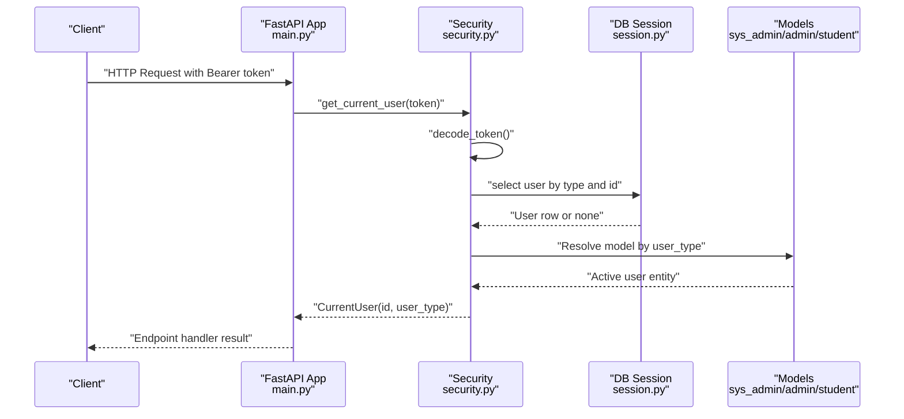
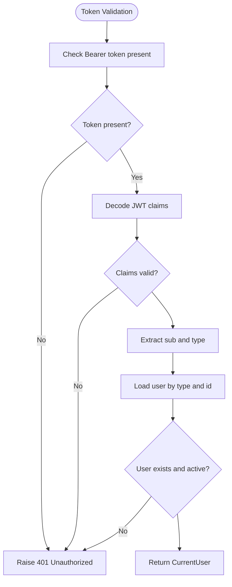
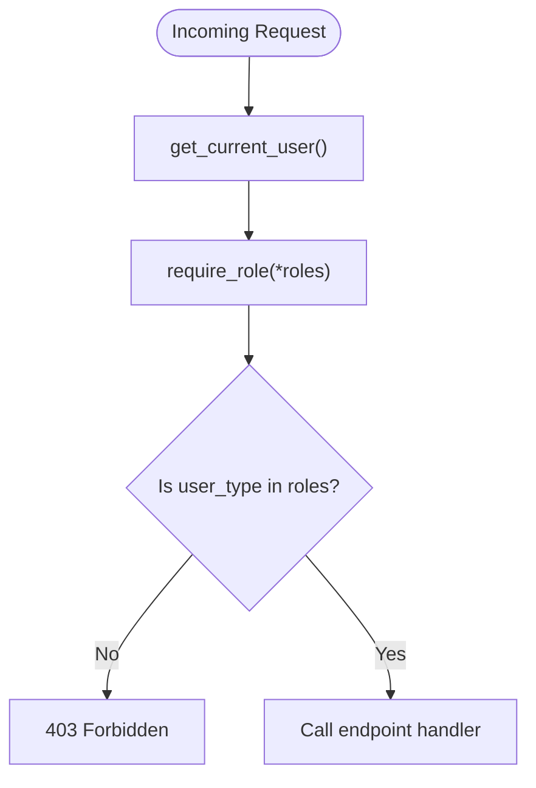
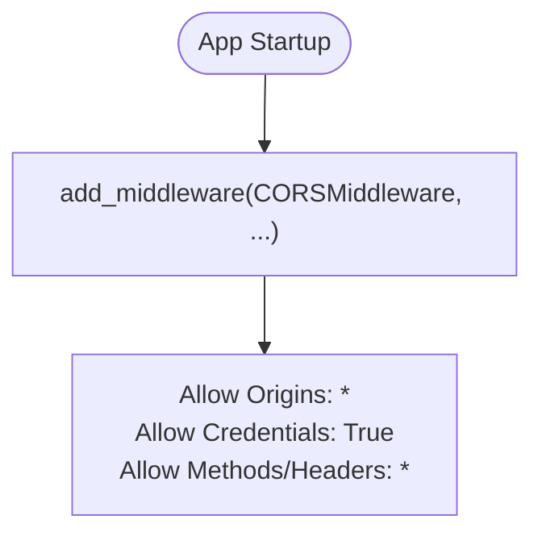
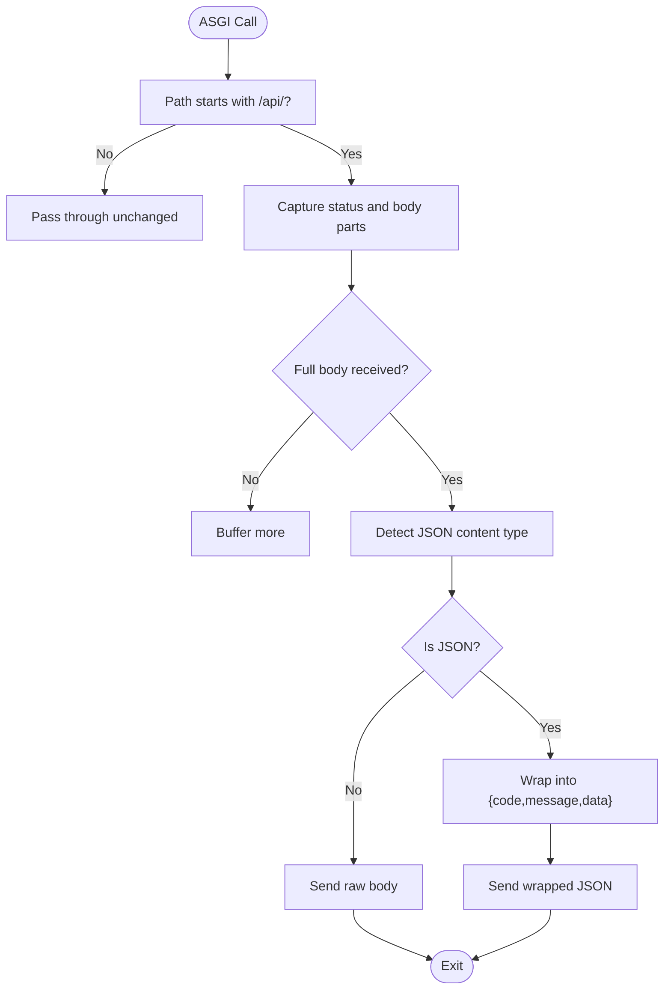
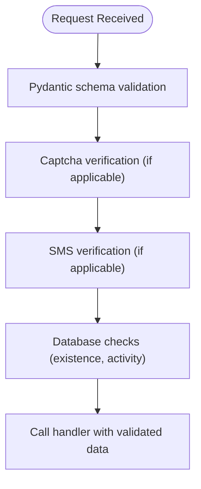
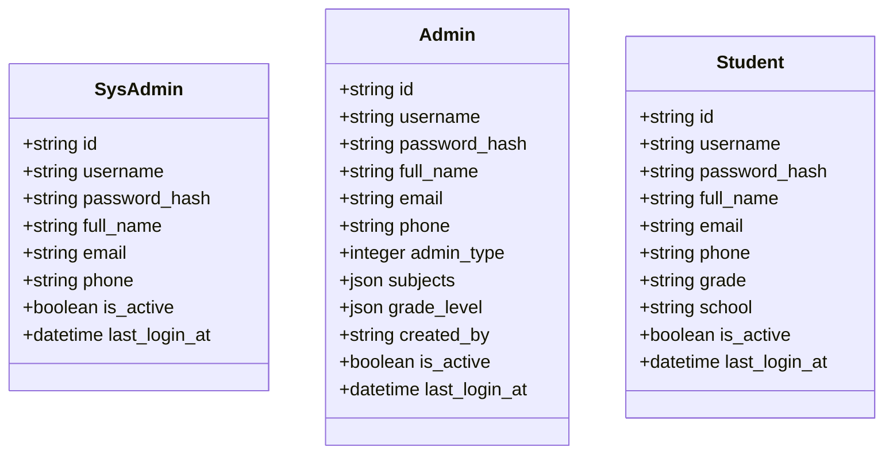
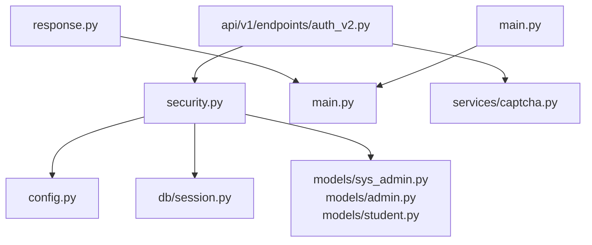

# Middleware and Security

<cite>
**Referenced Files in This Document**
- [backend/app/main.py](file://backend/app/main.py)
- [backend/app/core/security.py](file://backend/app/core/security.py)
- [backend/app/core/config.py](file://backend/app/core/config.py)
- [backend/app/core/response.py](file://backend/app/core/response.py)
- [backend/app/api/v1/endpoints/auth_v2.py](file://backend/app/api/v1/endpoints/auth_v2.py)
- [backend/app/api/v1/endpoints/answers.py](file://backend/app/api/v1/endpoints/answers.py)
- [backend/app/api/v1/endpoints/classes.py](file://backend/app/api/v1/endpoints/classes.py)
- [backend/app/db/session.py](file://backend/app/db/session.py)
- [backend/app/models/sys_admin.py](file://backend/app/models/sys_admin.py)
- [backend/app/models/admin.py](file://backend/app/models/admin.py)
- [backend/app/models/student.py](file://backend/app/models/student.py)
- [backend/app/services/captcha.py](file://backend/app/services/captcha.py)
- [backend/sysconfig.json](file://backend/sysconfig.json)
</cite>

## Table of Contents
1. [Introduction](#introduction)
2. [Project Structure](#project-structure)
3. [Core Components](#core-components)
4. [Architecture Overview](#architecture-overview)
5. [Detailed Component Analysis](#detailed-component-analysis)
6. [Dependency Analysis](#dependency-analysis)
7. [Performance Considerations](#performance-considerations)
8. [Troubleshooting Guide](#troubleshooting-guide)
9. [Conclusion](#conclusion)
10. [Appendices](#appendices)

## Introduction
This document explains the middleware configuration and security implementation in the backend. It covers JWT authentication, token creation and validation, refresh mechanisms, role-based access control (RBAC), permission checking, authorization decorators, CORS configuration, unified response formatting, request preprocessing, and security best practices. It also provides guidance on middleware ordering, custom middleware development, and maintaining security compliance.

## Project Structure
The security and middleware stack is centered around the FastAPI application factory, configuration, and core security utilities. Authentication spans three user types (system administrators, admins, and students), with a unified current user abstraction and role checks. Responses are normalized via an ASGI middleware wrapper. CORS is configured globally.

**Diagram sources**
- [backend/app/main.py:11-30](file://backend/app/main.py#L11-L30)
- [backend/app/core/response.py:14-101](file://backend/app/core/response.py#L14-L101)
- [backend/app/core/security.py:50-103](file://backend/app/core/security.py#L50-L103)
- [backend/app/core/config.py:36-97](file://backend/app/core/config.py#L36-L97)
- [backend/app/db/session.py:18-26](file://backend/app/db/session.py#L18-L26)
- [backend/app/models/sys_admin.py:8-22](file://backend/app/models/sys_admin.py#L8-L22)
- [backend/app/models/admin.py:9-27](file://backend/app/models/admin.py#L9-L27)
- [backend/app/models/student.py:8-23](file://backend/app/models/student.py#L8-L23)
- [backend/app/services/captcha.py:12-40](file://backend/app/services/captcha.py#L12-L40)

**Section sources**
- [backend/app/main.py:11-30](file://backend/app/main.py#L11-L30)

## Core Components
- JWT utilities: password hashing, token creation, token decoding, and OAuth2 bearer scheme.
- Current user resolver: validates token and loads the active user from the appropriate table.
- RBAC decorator: enforces role-based authorization.
- Unified response middleware: normalizes all API responses to a consistent envelope.
- CORS middleware: controls cross-origin requests.
- Configuration: centralizes secrets and algorithm settings.
- Database session: async SQLAlchemy session management.

**Section sources**
- [backend/app/core/security.py:16-103](file://backend/app/core/security.py#L16-L103)
- [backend/app/core/response.py:14-124](file://backend/app/core/response.py#L14-L124)
- [backend/app/core/config.py:36-97](file://backend/app/core/config.py#L36-L97)
- [backend/app/db/session.py:18-26](file://backend/app/db/session.py#L18-L26)

## Architecture Overview
The authentication pipeline relies on a single OAuth2 bearer scheme. Tokens carry a subject identifier and a user type. The current user resolver decodes the token, verifies the presence of the user in the appropriate table, and returns a unified user object. Authorization decorators enforce allowed roles. All API responses are wrapped by a middleware that ensures consistent structure.

**Diagram sources**
- [backend/app/main.py:11-30](file://backend/app/main.py#L11-L30)
- [backend/app/core/security.py:64-95](file://backend/app/core/security.py#L64-L95)
- [backend/app/db/session.py:18-26](file://backend/app/db/session.py#L18-L26)
- [backend/app/models/sys_admin.py:8-22](file://backend/app/models/sys_admin.py#L8-L22)
- [backend/app/models/admin.py:9-27](file://backend/app/models/admin.py#L9-L27)
- [backend/app/models/student.py:8-23](file://backend/app/models/student.py#L8-L23)

## Detailed Component Analysis

### JWT Authentication and Token Lifecycle
- Token creation: Access and refresh tokens are created with expiration deltas and signed using a shared secret and algorithm.
- Token decoding: Validates signature and extracts claims; malformed tokens return empty payloads.
- OAuth2 bearer: Uses a dynamic token URL derived from configuration.
- Current user resolution: Validates token presence, decodes claims, resolves user existence in the appropriate model, and returns a unified user object.

**Diagram sources**
- [backend/app/core/security.py:64-95](file://backend/app/core/security.py#L64-L95)

**Section sources**
- [backend/app/core/security.py:24-47](file://backend/app/core/security.py#L24-L47)
- [backend/app/core/security.py:50-50](file://backend/app/core/security.py#L50-L50)
- [backend/app/core/security.py:64-95](file://backend/app/core/security.py#L64-L95)
- [backend/app/core/config.py:42-46](file://backend/app/core/config.py#L42-L46)

### Role-Based Access Control (RBAC) and Authorization Decorators
- Role checker: An authorization dependency that enforces allowed roles and raises forbidden if mismatched.
- Usage patterns: Endpoints apply the role checker via dependency injection to restrict access to system administrators.

**Diagram sources**
- [backend/app/core/security.py:98-103](file://backend/app/core/security.py#L98-L103)
- [backend/app/api/v1/endpoints/auth_v2.py:248-249](file://backend/app/api/v1/endpoints/auth_v2.py#L248-L249)

**Section sources**
- [backend/app/core/security.py:98-103](file://backend/app/core/security.py#L98-L103)
- [backend/app/api/v1/endpoints/auth_v2.py:242-283](file://backend/app/api/v1/endpoints/auth_v2.py#L242-L283)

### CORS Middleware Configuration
- Global CORS configuration is applied during app initialization with permissive defaults.
- In production, origins should be narrowed to specific domains.

**Diagram sources**
- [backend/app/main.py:20-27](file://backend/app/main.py#L20-L27)

**Section sources**
- [backend/app/main.py:20-27](file://backend/app/main.py#L20-L27)

### Response Formatting Middleware
- Wraps all responses under the /api/ prefix into a standardized envelope with code, message, and data.
- Handles JSON detection, prevents double-wrapping, and ensures consistent error responses.
- Sends raw bytes via ASGI to avoid streaming issues.

**Diagram sources**
- [backend/app/core/response.py:20-101](file://backend/app/core/response.py#L20-L101)

**Section sources**
- [backend/app/core/response.py:14-124](file://backend/app/core/response.py#L14-L124)

### Request Preprocessing and Input Validation
- Endpoint schemas define strict validation for login, registration, and profile updates.
- Captcha and SMS verification are enforced for administrative login and student registration.
- Profile update endpoints whitelist allowed fields to prevent unauthorized mutations.

**Diagram sources**
- [backend/app/api/v1/endpoints/auth_v2.py:25-53](file://backend/app/api/v1/endpoints/auth_v2.py#L25-L53)
- [backend/app/api/v1/endpoints/auth_v2.py:91-183](file://backend/app/api/v1/endpoints/auth_v2.py#L91-L183)
- [backend/app/api/v1/endpoints/auth_v2.py:212-237](file://backend/app/api/v1/endpoints/auth_v2.py#L212-L237)
- [backend/app/api/v1/endpoints/auth_v2.py:420-445](file://backend/app/api/v1/endpoints/auth_v2.py#L420-L445)

**Section sources**
- [backend/app/api/v1/endpoints/auth_v2.py:25-53](file://backend/app/api/v1/endpoints/auth_v2.py#L25-L53)
- [backend/app/api/v1/endpoints/auth_v2.py:91-183](file://backend/app/api/v1/endpoints/auth_v2.py#L91-L183)
- [backend/app/api/v1/endpoints/auth_v2.py:212-237](file://backend/app/api/v1/endpoints/auth_v2.py#L212-L237)
- [backend/app/api/v1/endpoints/auth_v2.py:420-445](file://backend/app/api/v1/endpoints/auth_v2.py#L420-L445)

### Refresh Token Mechanism
- Refresh tokens are created with a longer expiration and signed with the same secret and algorithm.
- The current implementation does not include a dedicated refresh endpoint in the provided files; tokens are generated on successful login and returned to clients.

**Section sources**
- [backend/app/core/security.py:37-40](file://backend/app/core/security.py#L37-L40)
- [backend/app/api/v1/endpoints/auth_v2.py:55-71](file://backend/app/api/v1/endpoints/auth_v2.py#L55-L71)

### Database Session and User Models
- Async SQLAlchemy sessions are created from configuration-derived URLs.
- Users are stored in separate tables per type; the current user resolver selects the correct table based on the token’s user type.

**Diagram sources**
- [backend/app/models/sys_admin.py:8-22](file://backend/app/models/sys_admin.py#L8-L22)
- [backend/app/models/admin.py:9-27](file://backend/app/models/admin.py#L9-L27)
- [backend/app/models/student.py:8-23](file://backend/app/models/student.py#L8-L23)

**Section sources**
- [backend/app/db/session.py:18-26](file://backend/app/db/session.py#L18-L26)
- [backend/app/core/security.py:82-93](file://backend/app/core/security.py#L82-L93)

### CAPTCHA and SMS Verification
- CAPTCHA generation produces a short-lived token and SVG image; verification consumes the token and enforces expiration.
- SMS verification is currently stubbed with a fixed code in the provided endpoints.

**Section sources**
- [backend/app/services/captcha.py:12-40](file://backend/app/services/captcha.py#L12-L40)
- [backend/app/api/v1/endpoints/auth_v2.py:91-183](file://backend/app/api/v1/endpoints/auth_v2.py#L91-L183)
- [backend/app/api/v1/endpoints/auth_v2.py:188-237](file://backend/app/api/v1/endpoints/auth_v2.py#L188-L237)

## Dependency Analysis
The security layer depends on configuration for secrets and algorithms, database sessions for user lookup, and models for user identity. The response middleware depends on ASGI internals and JSON parsing. CORS is configured at the application level.

**Diagram sources**
- [backend/app/core/security.py:50-103](file://backend/app/core/security.py#L50-L103)
- [backend/app/core/config.py:36-97](file://backend/app/core/config.py#L36-L97)
- [backend/app/db/session.py:18-26](file://backend/app/db/session.py#L18-L26)
- [backend/app/models/sys_admin.py:8-22](file://backend/app/models/sys_admin.py#L8-L22)
- [backend/app/models/admin.py:9-27](file://backend/app/models/admin.py#L9-L27)
- [backend/app/models/student.py:8-23](file://backend/app/models/student.py#L8-L23)
- [backend/app/core/response.py:14-101](file://backend/app/core/response.py#L14-L101)
- [backend/app/main.py:11-30](file://backend/app/main.py#L11-L30)
- [backend/app/api/v1/endpoints/auth_v2.py:13-18](file://backend/app/api/v1/endpoints/auth_v2.py#L13-L18)
- [backend/app/services/captcha.py:12-40](file://backend/app/services/captcha.py#L12-L40)

**Section sources**
- [backend/app/core/security.py:50-103](file://backend/app/core/security.py#L50-L103)
- [backend/app/core/response.py:14-101](file://backend/app/core/response.py#L14-L101)
- [backend/app/main.py:11-30](file://backend/app/main.py#L11-L30)

## Performance Considerations
- Token decoding and database lookups occur per request; caching decoded claims or lightweight user metadata can reduce latency.
- Keep access token lifetimes reasonable to minimize long-lived sessions.
- Avoid heavy synchronous operations inside middleware; the response wrapper already uses ASGI send to prevent blocking.
- Narrow CORS origins in production to reduce preflight overhead.

## Troubleshooting Guide
- 401 Unauthorized: Indicates missing or invalid token, or user not found in the expected table.
- 403 Forbidden: Raised by role checks when the current user lacks required permissions.
- 500 Internal Server Error: Wrapped by the response middleware; inspect logs for unhandled exceptions.
- CORS issues: Verify allowed origins, methods, and headers; ensure credentials are configured correctly.
- Response not wrapped: Confirm the path starts with the configured API prefix.

**Section sources**
- [backend/app/core/security.py:68-80](file://backend/app/core/security.py#L68-L80)
- [backend/app/core/security.py:100-102](file://backend/app/core/security.py#L100-L102)
- [backend/app/core/response.py:92-101](file://backend/app/core/response.py#L92-L101)
- [backend/app/main.py:20-27](file://backend/app/main.py#L20-L27)

## Conclusion
The system implements a cohesive JWT-based authentication and RBAC framework with a unified current user abstraction and consistent response formatting. CORS and response normalization are handled centrally. To harden the system, introduce a refresh endpoint, enforce stricter CORS, add rate limiting, and consider adding CSRF protections for browser clients. Extend the RBAC model with fine-grained permissions and audit trails.

## Appendices

### Middleware Ordering and Best Practices
- Order: CORS should generally precede other middleware to handle preflight requests early.
- Response wrapper: Apply only to API routes to avoid interfering with static assets or non-JSON responses.
- Security middleware: Place authentication and authorization dependencies close to endpoints to fail fast.

**Section sources**
- [backend/app/main.py:20-27](file://backend/app/main.py#L20-L27)
- [backend/app/core/response.py:25-28](file://backend/app/core/response.py#L25-L28)

### Implementing New Security Measures
- Add a refresh endpoint: Create a route that accepts a refresh token, validates it, and issues a new access token.
- Introduce CSRF protection: For cookie-based sessions, add anti-CSRF tokens and SameSite cookies.
- Add rate limiting: Limit login attempts and sensitive endpoints.
- Audit logs: Log authentication events and authorization failures.

### Extending Authentication Methods
- OIDC/SAML: Integrate an OAuth provider and adapt the current user resolver to accept external identifiers.
- Multi-factor: Add TOTP/HOTP alongside SMS verification.
- Session rotation: Rotate refresh tokens on use and maintain a revocation list.

### Security Compliance Guidelines
- Secrets management: Store SECRET_KEY and database passwords in environment variables; avoid committing secrets.
- Algorithm and key strength: Use strong algorithms and rotate keys periodically.
- Least privilege: Enforce RBAC strictly and log access decisions.
- Input sanitization: Combine Pydantic validation with ORM usage to prevent injection.
- Transport security: Enforce HTTPS in production and secure cookie attributes.

**Section sources**
- [backend/app/core/config.py:42-46](file://backend/app/core/config.py#L42-L46)
- [backend/sysconfig.json:1-48](file://backend/sysconfig.json#L1-L48)