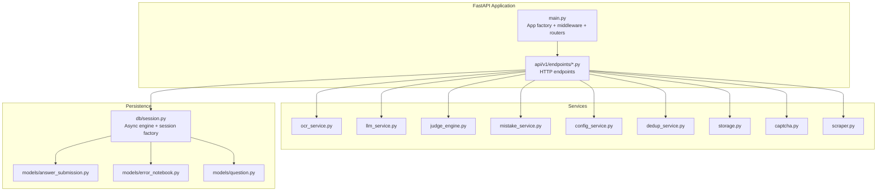
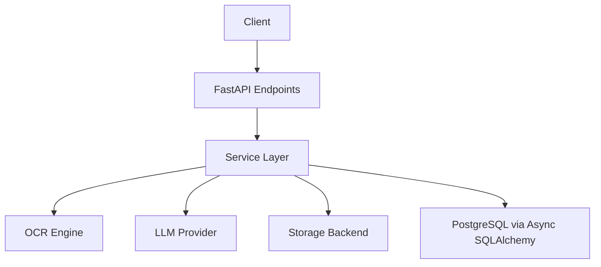
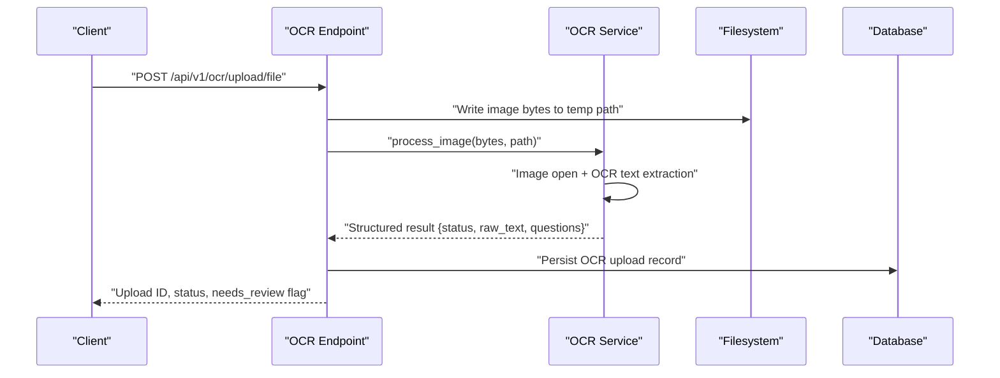
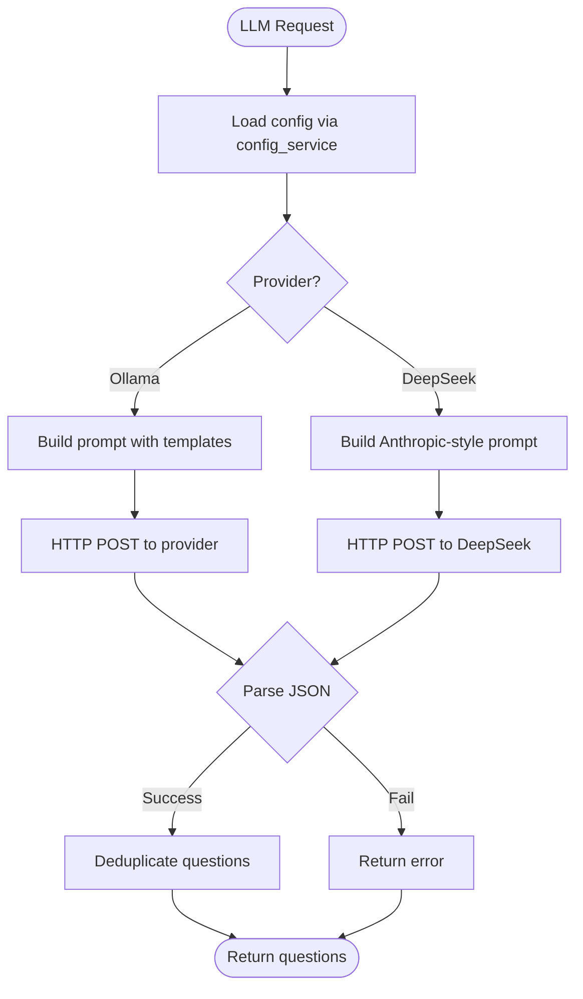
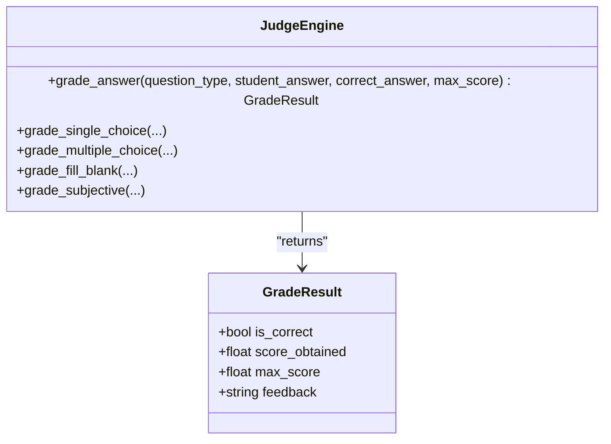
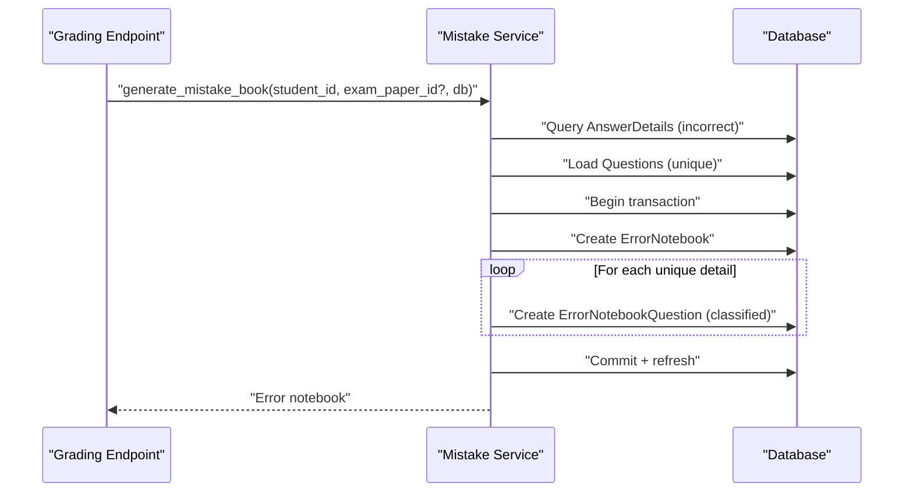
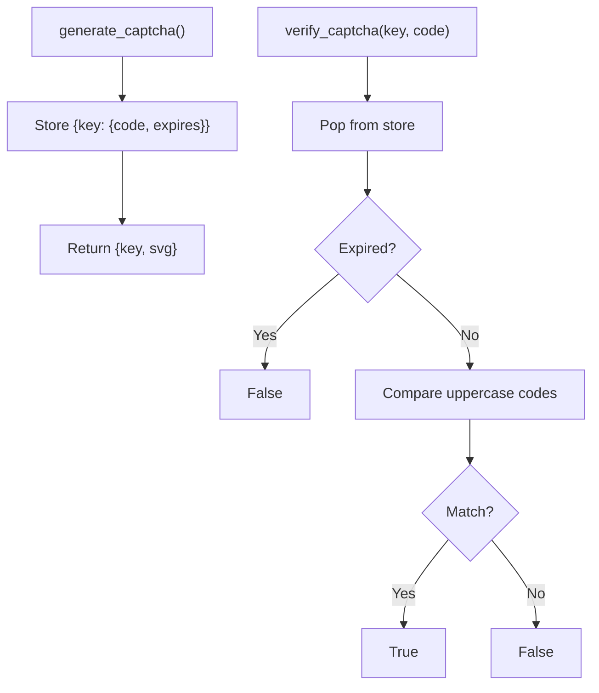
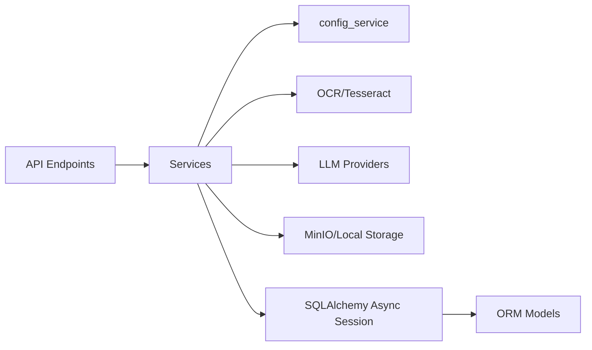

# Service Layer Design

<cite>
**Referenced Files in This Document**
- [main.py](file://backend/app/main.py)
- [config.py](file://backend/app/core/config.py)
- [session.py](file://backend/app/db/session.py)
- [ocr.py](file://backend/app/api/v1/endpoints/ocr.py)
- [grading.py](file://backend/app/api/v1/endpoints/grading.py)
- [ocr_service.py](file://backend/app/services/ocr_service.py)
- [llm_service.py](file://backend/app/services/llm_service.py)
- [judge_engine.py](file://backend/app/services/judge_engine.py)
- [mistake_service.py](file://backend/app/services/mistake_service.py)
- [captcha.py](file://backend/app/services/captcha.py)
- [config_service.py](file://backend/app/services/config_service.py)
- [dedup_service.py](file://backend/app/services/dedup_service.py)
- [storage.py](file://backend/app/services/storage.py)
- [scraper.py](file://backend/app/services/scraper.py)
- [answer_submission.py](file://backend/app/models/answer_submission.py)
- [error_notebook.py](file://backend/app/models/error_notebook.py)
- [question.py](file://backend/app/models/question.py)
</cite>

## Table of Contents
1. [Introduction](#introduction)
2. [Project Structure](#project-structure)
3. [Core Components](#core-components)
4. [Architecture Overview](#architecture-overview)
5. [Detailed Component Analysis](#detailed-component-analysis)
6. [Dependency Analysis](#dependency-analysis)
7. [Performance Considerations](#performance-considerations)
8. [Troubleshooting Guide](#troubleshooting-guide)
9. [Conclusion](#conclusion)
10. [Appendices](#appendices)

## Introduction
This document describes the service layer architecture and business logic implementation for the backend. It explains how services are organized, how they integrate with FastAPI endpoints, and how business workflows are orchestrated. It covers OCR processing, LLM orchestration, grading engine, mistake detection, captcha generation, and external API integrations. It also documents service lifecycle, error handling, performance characteristics, testing strategies, and guidelines for extending the service layer.

## Project Structure
The backend is built with FastAPI and SQLAlchemy’s async ORM. Services live under app/services and are consumed by API endpoints under app/api/v1/endpoints. Database sessions are managed centrally and injected into endpoints. Configuration is centralized in app/core/config.py and extended by app/services/config_service.py to manage runtime configuration and secrets.

**Diagram sources**
- [main.py:1-52](file://backend/app/main.py#L1-L52)
- [ocr.py:1-291](file://backend/app/api/v1/endpoints/ocr.py#L1-L291)
- [grading.py:1-143](file://backend/app/api/v1/endpoints/grading.py#L1-L143)
- [ocr_service.py:1-126](file://backend/app/services/ocr_service.py#L1-L126)
- [llm_service.py:1-350](file://backend/app/services/llm_service.py#L1-L350)
- [judge_engine.py:1-130](file://backend/app/services/judge_engine.py#L1-L130)
- [mistake_service.py:1-114](file://backend/app/services/mistake_service.py#L1-L114)
- [config_service.py:1-155](file://backend/app/services/config_service.py#L1-L155)
- [dedup_service.py:1-127](file://backend/app/services/dedup_service.py#L1-L127)
- [storage.py:1-55](file://backend/app/services/storage.py#L1-L55)
- [captcha.py:1-40](file://backend/app/services/captcha.py#L1-L40)
- [scraper.py:1-272](file://backend/app/services/scraper.py#L1-L272)
- [session.py:1-26](file://backend/app/db/session.py#L1-L26)
- [answer_submission.py:1-37](file://backend/app/models/answer_submission.py#L1-L37)
- [error_notebook.py:1-32](file://backend/app/models/error_notebook.py#L1-L32)
- [question.py:1-46](file://backend/app/models/question.py#L1-L46)

**Section sources**
- [main.py:1-52](file://backend/app/main.py#L1-L52)
- [config.py:1-98](file://backend/app/core/config.py#L1-L98)
- [session.py:1-26](file://backend/app/db/session.py#L1-L26)

## Core Components
- OCR service: Processes uploaded images via Tesseract, extracts text and questions, estimates confidence, and returns structured results.
- LLM service: Orchestrates question generation and practice question creation using configurable providers (Ollama or DeepSeek).
- Judge engine: Rule-based grading for all question types with explicit scoring and feedback.
- Mistake service: Generates error notebooks from incorrect answers and classifies error types.
- Configuration service: Loads sysconfig.json, injects secrets from environment variables, and validates LLM connectivity.
- Deduplication service: Computes SimHash-based content hashes and detects duplicates.
- Storage service: Provides MinIO/local file storage abstraction for uploaded files.
- Captcha service: Generates and verifies transient SVG captchas for anti-bot measures.
- Scraper service: Web scraping + LLM formatting to produce structured questions.

**Section sources**
- [ocr_service.py:1-126](file://backend/app/services/ocr_service.py#L1-L126)
- [llm_service.py:1-350](file://backend/app/services/llm_service.py#L1-L350)
- [judge_engine.py:1-130](file://backend/app/services/judge_engine.py#L1-L130)
- [mistake_service.py:1-114](file://backend/app/services/mistake_service.py#L1-L114)
- [config_service.py:1-155](file://backend/app/services/config_service.py#L1-L155)
- [dedup_service.py:1-127](file://backend/app/services/dedup_service.py#L1-L127)
- [storage.py:1-55](file://backend/app/services/storage.py#L1-L55)
- [captcha.py:1-40](file://backend/app/services/captcha.py#L1-L40)
- [scraper.py:1-272](file://backend/app/services/scraper.py#L1-L272)

## Architecture Overview
The service layer follows a clean separation of concerns:
- Endpoints depend on services, not on persistence directly.
- Services encapsulate business logic and integrate with external systems.
- Persistence is accessed via SQLAlchemy async sessions supplied by a shared dependency.
- Configuration is centralized and environment-aware.

**Diagram sources**
- [ocr.py:1-291](file://backend/app/api/v1/endpoints/ocr.py#L1-L291)
- [grading.py:1-143](file://backend/app/api/v1/endpoints/grading.py#L1-L143)
- [ocr_service.py:1-126](file://backend/app/services/ocr_service.py#L1-L126)
- [llm_service.py:1-350](file://backend/app/services/llm_service.py#L1-L350)
- [storage.py:1-55](file://backend/app/services/storage.py#L1-L55)
- [session.py:1-26](file://backend/app/db/session.py#L1-L26)

## Detailed Component Analysis

### OCR Service Integration
The OCR service converts uploaded images to structured question data. It saves temporary files, runs Tesseract, parses heuristics, estimates confidence, and classifies status.

**Diagram sources**
- [ocr.py:18-64](file://backend/app/api/v1/endpoints/ocr.py#L18-L64)
- [ocr_service.py:61-126](file://backend/app/services/ocr_service.py#L61-L126)

**Section sources**
- [ocr.py:18-64](file://backend/app/api/v1/endpoints/ocr.py#L18-L64)
- [ocr_service.py:20-126](file://backend/app/services/ocr_service.py#L20-L126)

### LLM Service Orchestration
The LLM service supports multiple providers and builds prompts tailored to question types. It validates responses, deduplicates, and supports practice question generation.

**Diagram sources**
- [llm_service.py:54-104](file://backend/app/services/llm_service.py#L54-L104)
- [llm_service.py:132-179](file://backend/app/services/llm_service.py#L132-L179)
- [llm_service.py:320-350](file://backend/app/services/llm_service.py#L320-L350)

**Section sources**
- [llm_service.py:7-350](file://backend/app/services/llm_service.py#L7-L350)
- [config_service.py:65-78](file://backend/app/services/config_service.py#L65-L78)

### Grading Engine Functionality
The rule-based grading engine evaluates answers per question type and produces a standardized result with correctness, scored points, and feedback.

**Diagram sources**
- [judge_engine.py:12-130](file://backend/app/services/judge_engine.py#L12-L130)

**Section sources**
- [judge_engine.py:126-130](file://backend/app/services/judge_engine.py#L126-L130)

### Mistake Detection Service
The mistake service aggregates incorrect answers into an error notebook, deduplicating by question and classifying error types.

**Diagram sources**
- [grading.py:19-55](file://backend/app/api/v1/endpoints/grading.py#L19-L55)
- [mistake_service.py:13-76](file://backend/app/services/mistake_service.py#L13-L76)

**Section sources**
- [mistake_service.py:13-114](file://backend/app/services/mistake_service.py#L13-L114)
- [answer_submission.py:9-37](file://backend/app/models/answer_submission.py#L9-L37)
- [error_notebook.py:8-32](file://backend/app/models/error_notebook.py#L8-L32)
- [question.py:10-46](file://backend/app/models/question.py#L10-L46)

### Captcha Generation Service
The captcha service generates transient SVG captchas and validates them once.

**Diagram sources**
- [captcha.py:12-40](file://backend/app/services/captcha.py#L12-L40)

**Section sources**
- [captcha.py:12-40](file://backend/app/services/captcha.py#L12-L40)

### External API Integrations
- OCR: Uses Tesseract via pytesseract and PIL; falls back gracefully when unavailable.
- LLM: Calls Ollama generate endpoint or DeepSeek Messages API depending on configuration.
- Storage: MinIO client initialization with fallback to local filesystem.
- Web scraping: Bing search + BeautifulSoup parsing, then LLM formatting.

**Section sources**
- [ocr_service.py:9-14](file://backend/app/services/ocr_service.py#L9-L14)
- [llm_service.py:74-104](file://backend/app/services/llm_service.py#L74-L104)
- [llm_service.py:132-179](file://backend/app/services/llm_service.py#L132-L179)
- [storage.py:11-22](file://backend/app/services/storage.py#L11-L22)
- [scraper.py:62-88](file://backend/app/services/scraper.py#L62-L88)

## Dependency Analysis
- Endpoints depend on services and SQLAlchemy async sessions.
- Services depend on configuration service and external APIs.
- Persistence is isolated behind a single async session factory.
- Configuration is environment-aware and avoids storing secrets in JSON.

**Diagram sources**
- [ocr.py:1-291](file://backend/app/api/v1/endpoints/ocr.py#L1-L291)
- [grading.py:1-143](file://backend/app/api/v1/endpoints/grading.py#L1-L143)
- [config_service.py:65-78](file://backend/app/services/config_service.py#L65-L78)
- [session.py:18-26](file://backend/app/db/session.py#L18-L26)

**Section sources**
- [session.py:18-26](file://backend/app/db/session.py#L18-L26)
- [config_service.py:65-78](file://backend/app/services/config_service.py#L65-L78)

## Performance Considerations
- Asynchronous I/O: All external calls (OCR, LLM, storage) use async clients to avoid blocking.
- Timeout tuning: HTTP clients specify connect/read timeouts appropriate for long-running LLM calls.
- Deduplication: SimHash-based hashing reduces repeated question processing overhead.
- Concurrency limits: Configuration exposes concurrency knobs for OCR and grading to prevent resource saturation.
- Caching: Model availability and LLM connectivity checks reduce repeated failures.

[No sources needed since this section provides general guidance]

## Troubleshooting Guide
- OCR failures: Check Tesseract availability and language packs; verify file write permissions.
- LLM connectivity: Validate endpoint URLs, API keys, and model availability; use connectivity helpers.
- Storage errors: Confirm MinIO credentials and bucket existence; fallback to local storage logs.
- Database session issues: Inspect session factory and ensure exceptions trigger rollbacks.
- Misconfigured secrets: Ensure sensitive values are provided via environment variables, not sysconfig.json.

**Section sources**
- [ocr_service.py:71-96](file://backend/app/services/ocr_service.py#L71-L96)
- [llm_service.py:100-103](file://backend/app/services/llm_service.py#L100-L103)
- [llm_service.py:176-179](file://backend/app/services/llm_service.py#L176-L179)
- [storage.py:11-22](file://backend/app/services/storage.py#L11-L22)
- [session.py:20-24](file://backend/app/db/session.py#L20-L24)
- [config_service.py:74-78](file://backend/app/services/config_service.py#L74-L78)

## Conclusion
The service layer cleanly separates business logic from HTTP concerns, enabling testability, maintainability, and scalability. By centralizing configuration, enforcing strict error handling, and leveraging async I/O, the system remains robust against external provider variability and resource constraints.

[No sources needed since this section summarizes without analyzing specific files]

## Appendices

### Service Lifecycle Management
- Initialization: Startup seeds reference data using an async session.
- Session lifecycle: AsyncSessionLocal yields sessions per request; rollbacks on exceptions.
- Cleanup: Sessions are closed in finally blocks.

**Section sources**
- [main.py:33-42](file://backend/app/main.py#L33-L42)
- [session.py:18-26](file://backend/app/db/session.py#L18-L26)

### Error Handling Strategies
- Service-level: Return structured error objects with messages and optional raw data.
- Endpoint-level: Convert service errors to HTTP exceptions with appropriate status codes.
- External integrations: Catch network errors and timeouts; provide actionable messages.

**Section sources**
- [llm_service.py:100-103](file://backend/app/services/llm_service.py#L100-L103)
- [llm_service.py:176-179](file://backend/app/services/llm_service.py#L176-L179)
- [ocr.py:26-27](file://backend/app/api/v1/endpoints/ocr.py#L26-L27)

### Performance Optimization Techniques
- Use async HTTP clients for external calls.
- Tune timeouts and retry policies at the service level.
- Cache model lists and connectivity checks.
- Limit concurrent OCR and grading tasks via configuration.

**Section sources**
- [llm_service.py:83-89](file://backend/app/services/llm_service.py#L83-L89)
- [llm_service.py:145-152](file://backend/app/services/llm_service.py#L145-L152)
- [config_service.py:108-125](file://backend/app/services/config_service.py#L108-L125)

### Testing Approaches and Mocking Strategies
- Mock external services: Patch HTTPX clients and OCR libraries to simulate success/failure scenarios.
- Use in-memory stores: Replace persistent stores (e.g., captcha store) with mocks for unit tests.
- Dependency injection: Prefer passing services and clients as parameters to enable easy mocking.
- Test isolation: Keep tests focused on single service boundaries; avoid cross-service coupling.

[No sources needed since this section provides general guidance]

### Guidelines for Implementing New Services
- Define a clear responsibility boundary aligned with domain concepts.
- Accept dependencies explicitly (e.g., config_service, storage, database session).
- Return structured results and errors; avoid leaking implementation details.
- Add timeouts and retries for external calls; handle network errors gracefully.
- Keep persistence access inside services; do not leak ORM details to endpoints.
- Add configuration entries in sysconfig.json and inject environment secrets via config_service.

[No sources needed since this section provides general guidance]

### Maintaining Service Isolation and Ensuring Proper Error Propagation
- Encapsulate side effects behind service methods; expose pure business functions where possible.
- Propagate errors upward as structured dictionaries or exceptions; avoid swallowing errors silently.
- Avoid cross-service coupling; if coordination is needed, introduce a coordinator service or orchestrate at the endpoint level.

[No sources needed since this section provides general guidance]