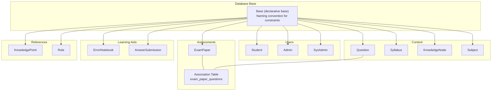
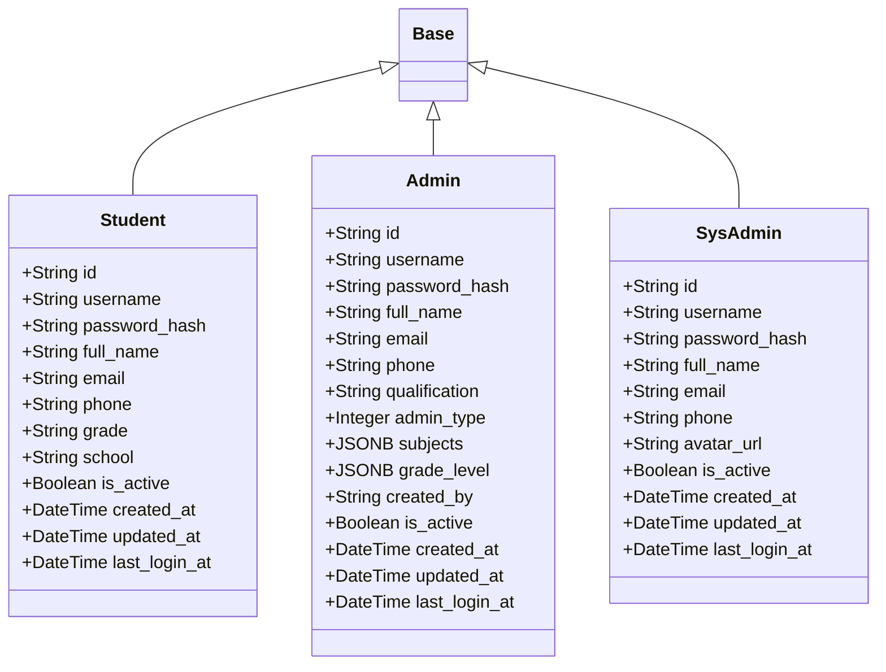
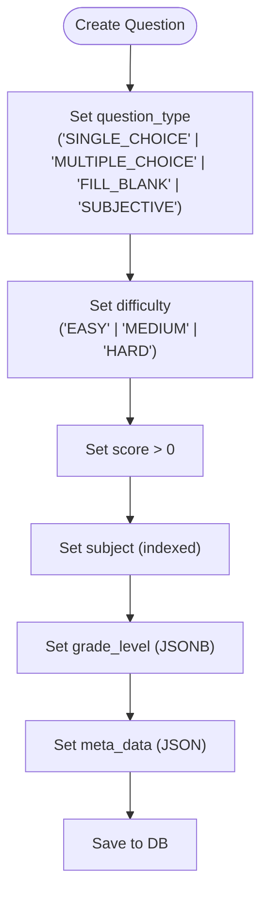
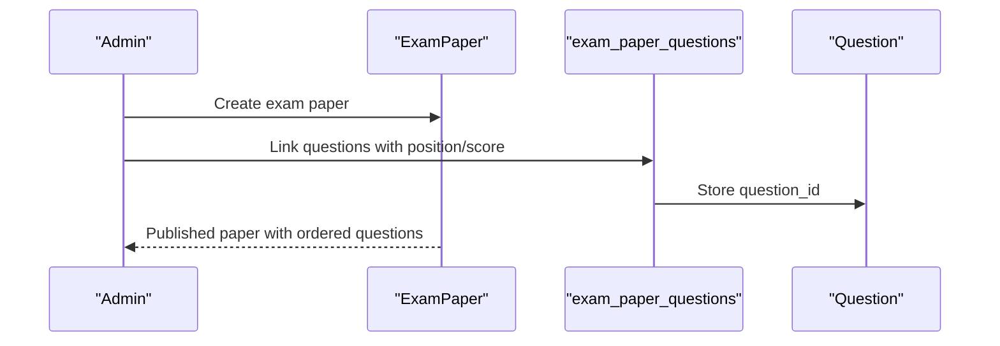
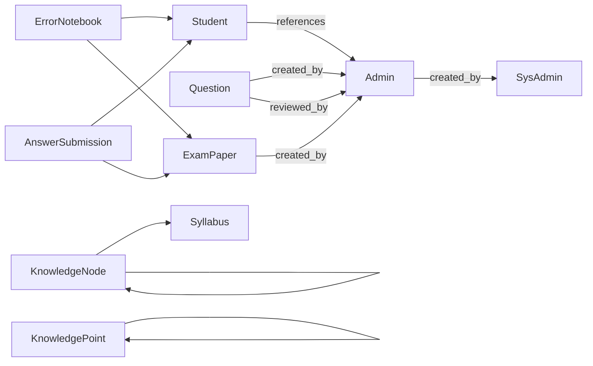

# Data Models and Schemas

<cite>
**Referenced Files in This Document**
- [backend/app/db/base.py](file://backend/app/db/base.py)
- [backend/app/models/__init__.py](file://backend/app/models/__init__.py)
- [backend/app/models/student.py](file://backend/app/models/student.py)
- [backend/app/models/admin.py](file://backend/app/models/admin.py)
- [backend/app/models/sys_admin.py](file://backend/app/models/sys_admin.py)
- [backend/app/models/question.py](file://backend/app/models/question.py)
- [backend/app/models/syllabus.py](file://backend/app/models/syllabus.py)
- [backend/app/models/knowledge_node.py](file://backend/app/models/knowledge_node.py)
- [backend/app/models/subject.py](file://backend/app/models/subject.py)
- [backend/app/models/exam_paper.py](file://backend/app/models/exam_paper.py)
- [backend/app/models/error_notebook.py](file://backend/app/models/error_notebook.py)
- [backend/app/models/answer_submission.py](file://backend/app/models/answer_submission.py)
- [backend/app/models/knowledge_point.py](file://backend/app/models/knowledge_point.py)
- [backend/app/models/role.py](file://backend/app/models/role.py)
</cite>

## Table of Contents
1. [Introduction](#introduction)
2. [Project Structure](#project-structure)
3. [Core Components](#core-components)
4. [Architecture Overview](#architecture-overview)
5. [Detailed Component Analysis](#detailed-component-analysis)
6. [Dependency Analysis](#dependency-analysis)
7. [Performance Considerations](#performance-considerations)
8. [Troubleshooting Guide](#troubleshooting-guide)
9. [Conclusion](#conclusion)
10. [Appendices](#appendices)

## Introduction
This document provides comprehensive data model documentation for the Ruicheng Educational Management System. It covers SQLAlchemy model classes, field definitions, data types, constraints, and validation rules. Special attention is given to JSONB usage for flexible metadata storage in questions, syllabi, and knowledge nodes, polymorphic-like user roles via separate tables (Student, Admin, SysAdmin), composite and check constraints, audit trail fields, and indexes. Guidance on model instantiation, relationship access patterns, and query optimization strategies is included.

## Project Structure
The data models are organized under backend/app/models with a shared declarative base that enforces consistent naming conventions for database constraints. The models are grouped by domain: users, content (questions, syllabi, knowledge nodes), assessments (exam papers), learning aids (error notebooks, answer submissions), and reference entities (subjects, roles).



**Diagram sources**
- [backend/app/db/base.py:17-21](file://backend/app/db/base.py#L17-L21)
- [backend/app/models/student.py:8-23](file://backend/app/models/student.py#L8-L23)
- [backend/app/models/admin.py:9-27](file://backend/app/models/admin.py#L9-L27)
- [backend/app/models/sys_admin.py:8-22](file://backend/app/models/sys_admin.py#L8-L22)
- [backend/app/models/question.py:10-46](file://backend/app/models/question.py#L10-L46)
- [backend/app/models/syllabus.py:9-26](file://backend/app/models/syllabus.py#L9-L26)
- [backend/app/models/knowledge_node.py:9-26](file://backend/app/models/knowledge_node.py#L9-L26)
- [backend/app/models/subject.py:8-17](file://backend/app/models/subject.py#L8-L17)
- [backend/app/models/exam_paper.py:23-51](file://backend/app/models/exam_paper.py#L23-L51)
- [backend/app/models/error_notebook.py:8-32](file://backend/app/models/error_notebook.py#L8-L32)
- [backend/app/models/answer_submission.py:9-37](file://backend/app/models/answer_submission.py#L9-L37)
- [backend/app/models/knowledge_point.py:7-27](file://backend/app/models/knowledge_point.py#L7-L27)
- [backend/app/models/role.py:8-17](file://backend/app/models/role.py#L8-L17)

**Section sources**
- [backend/app/db/base.py:1-21](file://backend/app/db/base.py#L1-L21)
- [backend/app/models/__init__.py:1-34](file://backend/app/models/__init__.py#L1-L34)

## Core Components
This section summarizes the central models and their primary responsibilities.

- Base: Central declarative base with naming convention for indexes, unique constraints, check constraints, foreign keys, and primary keys.
- Users: Separate tables for Student, Admin, and SysAdmin, each with standard identity fields, credentials, activity flag, timestamps, and optional profile fields.
- Content: Question, Syllabus, KnowledgeNode, Subject define educational content and metadata.
- Assessments: ExamPaper manages exam templates and relationships to Questions via an association table with ordering and scoring.
- Learning Aids: ErrorNotebook groups mistakes per student and per exam paper; AnswerSubmission captures answer attempts and scores.
- References: KnowledgePoint and Role provide structured taxonomy and role definitions.

**Section sources**
- [backend/app/db/base.py:5-18](file://backend/app/db/base.py#L5-L18)
- [backend/app/models/student.py:8-23](file://backend/app/models/student.py#L8-L23)
- [backend/app/models/admin.py:9-27](file://backend/app/models/admin.py#L9-L27)
- [backend/app/models/sys_admin.py:8-22](file://backend/app/models/sys_admin.py#L8-L22)
- [backend/app/models/question.py:10-46](file://backend/app/models/question.py#L10-L46)
- [backend/app/models/syllabus.py:9-26](file://backend/app/models/syllabus.py#L9-L26)
- [backend/app/models/knowledge_node.py:9-26](file://backend/app/models/knowledge_node.py#L9-L26)
- [backend/app/models/subject.py:8-17](file://backend/app/models/subject.py#L8-L17)
- [backend/app/models/exam_paper.py:9-51](file://backend/app/models/exam_paper.py#L9-L51)
- [backend/app/models/error_notebook.py:8-32](file://backend/app/models/error_notebook.py#L8-L32)
- [backend/app/models/answer_submission.py:9-37](file://backend/app/models/answer_submission.py#L9-L37)
- [backend/app/models/knowledge_point.py:7-27](file://backend/app/models/knowledge_point.py#L7-L27)
- [backend/app/models/role.py:8-17](file://backend/app/models/role.py#L8-L17)

## Architecture Overview
The system uses a flat relational schema with explicit foreign keys and association tables. JSONB fields enable flexible metadata storage for dynamic content structures. Audit fields created_at and updated_at track entity lifecycles. Indexes are strategically placed on frequently filtered or joined columns.

```mermaid
classDiagram
class Base {
+metadata
+__repr__()
}
class Student {
+String id
+String username
+String password_hash
+String full_name
+String email
+String phone
+String grade
+String school
+Boolean is_active
+DateTime created_at
+DateTime updated_at
+DateTime last_login_at
}
class Admin {
+String id
+String username
+String password_hash
+String full_name
+String email
+String phone
+String qualification
+Integer admin_type
+JSONB subjects
+JSONB grade_level
+String created_by
+Boolean is_active
+DateTime created_at
+DateTime updated_at
+DateTime last_login_at
}
class SysAdmin {
+String id
+String username
+String password_hash
+String full_name
+String email
+String phone
+String avatar_url
+Boolean is_active
+DateTime created_at
+DateTime updated_at
+DateTime last_login_at
}
class Question {
+String id
+String title
+String question_type
+String difficulty
+String subject
+JSONB grade_level
+Integer score
+Text correct_answer
+Text explanation
+JSON meta_data
+String source
+String review_status
+String reviewed_by
+DateTime reviewed_at
+String source_task_id
+String created_by
+Boolean is_active
+Boolean is_typical
+String content_hash
+DateTime created_at
+DateTime updated_at
}
class Syllabus {
+String id
+String title
+String grade_level
+String province
+String subject
+JSON content
+JSON knowledge_tree
+String status
+Integer version
+Boolean is_current
+String parent_syllabus_id
+String created_by
+DateTime created_at
+DateTime updated_at
}
class KnowledgeNode {
+String id
+String syllabus_id
+String parent_id
+String name
+String node_type
+Integer sort_order
+Integer version
+Boolean is_active
+String invalid_reason
+Boolean is_modified
+Text description
+JSON meta_data
+DateTime created_at
+DateTime updated_at
}
class Subject {
+String id
+String code
+String name
+String category
+Boolean is_active
+DateTime created_at
}
class ExamPaper {
+String id
+String title
+Text description
+String subject
+JSONB grade_level
+String status
+Integer total_score
+Integer duration_minutes
+String subtitle
+Text instructions
+String created_by
+DateTime created_at
+DateTime updated_at
}
class ExamPaperQuestions {
+String id
+String exam_paper_id
+String question_id
+Integer position
+Integer score
}
class ErrorNotebook {
+String id
+String student_id
+String title
+Text description
+String exam_paper_id
+DateTime generated_at
+Integer question_count
+String status
+DateTime created_at
+DateTime updated_at
}
class AnswerSubmission {
+String id
+String student_id
+String exam_paper_id
+String submission_type
+String ocr_upload_id
+String status
+DateTime started_at
+DateTime submitted_at
+DateTime graded_at
+Numeric total_score
+Numeric percentage
+JSON meta_data
+DateTime created_at
+DateTime updated_at
}
class KnowledgePoint {
+String id
+String code
+String name
+Text description
+String parent_id
+String subject
+String grade_level
+String difficulty_level
+DateTime created_at
+DateTime updated_at
}
class Role {
+String id
+String code
+String name
+Text description
+Boolean is_active
+DateTime created_at
}
Base <|-- Student
Base <|-- Admin
Base <|-- SysAdmin
Base <|-- Question
Base <|-- Syllabus
Base <|-- KnowledgeNode
Base <|-- Subject
Base <|-- ExamPaper
Base <|-- ErrorNotebook
Base <|-- AnswerSubmission
Base <|-- KnowledgePoint
Base <|-- Role
ExamPaper "1" <---> "M" ExamPaperQuestions : "many-to-many"
Question "M" <---> "1" ExamPaperQuestions : "many-to-many"
```

**Diagram sources**
- [backend/app/db/base.py:17-21](file://backend/app/db/base.py#L17-L21)
- [backend/app/models/student.py:8-23](file://backend/app/models/student.py#L8-L23)
- [backend/app/models/admin.py:9-27](file://backend/app/models/admin.py#L9-L27)
- [backend/app/models/sys_admin.py:8-22](file://backend/app/models/sys_admin.py#L8-L22)
- [backend/app/models/question.py:10-46](file://backend/app/models/question.py#L10-L46)
- [backend/app/models/syllabus.py:9-26](file://backend/app/models/syllabus.py#L9-L26)
- [backend/app/models/knowledge_node.py:9-26](file://backend/app/models/knowledge_node.py#L9-L26)
- [backend/app/models/subject.py:8-17](file://backend/app/models/subject.py#L8-L17)
- [backend/app/models/exam_paper.py:9-51](file://backend/app/models/exam_paper.py#L9-L51)
- [backend/app/models/error_notebook.py:8-32](file://backend/app/models/error_notebook.py#L8-L32)
- [backend/app/models/answer_submission.py:9-37](file://backend/app/models/answer_submission.py#L9-L37)
- [backend/app/models/knowledge_point.py:7-27](file://backend/app/models/knowledge_point.py#L7-L27)
- [backend/app/models/role.py:8-17](file://backend/app/models/role.py#L8-L17)

## Detailed Component Analysis

### Base and Naming Conventions
- Purpose: Centralized declarative base with a naming convention for database constraints.
- Constraints:
  - Index: ix_%(column_0_label)s
  - Unique: uq_%(table_name)s_%(column_0_name)s
  - Check: ck_%(table_name)s_%(constraint_name)s
  - Foreign key: fk_%(table_name)s_%(column_0_name)s_%(referred_table_name)s
  - Primary key: pk_%(table_name)s
- Impact: Ensures consistent constraint names across migrations and simplifies maintenance.

**Section sources**
- [backend/app/db/base.py:5-18](file://backend/app/db/base.py#L5-L18)

### Users: Student, Admin, SysAdmin
- Identity and Credentials:
  - id: String(36), primary key, UUID-based default.
  - username: String(50), unique, not null.
  - password_hash: String(255), not null.
  - full_name: String(100), not null.
  - email/phone: Optional contact fields.
- Activity and Timestamps:
  - is_active: Boolean, default True.
  - created_at/updated_at: DateTime with timezone, server_default and onupdate.
  - last_login_at: Optional timestamp.
- Admin specifics:
  - qualification: String for teacher certification number.
  - admin_type: Integer with default 0; values enumerate roles (TEACHER, QUESTION_ADMIN, PRINCIPAL, DEAN, ACADEMIC_MGR, HEAD_TEACHER).
  - subjects/grade_level: JSONB arrays for permitted subjects and grade levels.
  - created_by: Foreign key to SysAdmin.
- SysAdmin specifics:
  - avatar_url: Optional profile image URL.
- Notes:
  - No polymorphic inheritance is used; each role has its own table.
  - Composite unique constraints are not defined for users; uniqueness is enforced via individual unique indexes on username.



**Diagram sources**
- [backend/app/models/student.py:8-23](file://backend/app/models/student.py#L8-L23)
- [backend/app/models/admin.py:9-27](file://backend/app/models/admin.py#L9-L27)
- [backend/app/models/sys_admin.py:8-22](file://backend/app/models/sys_admin.py#L8-L22)

**Section sources**
- [backend/app/models/student.py:8-23](file://backend/app/models/student.py#L8-L23)
- [backend/app/models/admin.py:9-27](file://backend/app/models/admin.py#L9-L27)
- [backend/app/models/sys_admin.py:8-22](file://backend/app/models/sys_admin.py#L8-L22)

### Question
- Fields:
  - title: String(500), not null.
  - question_type: String(20), not null; constrained to SINGLE_CHOICE, MULTIPLE_CHOICE, FILL_BLANK, SUBJECTIVE.
  - difficulty: String(10), not null; constrained to EASY, MEDIUM, HARD.
  - subject: String(50), indexed.
  - grade_level: JSONB; supports scope, grades array, optional chapter and knowledge_points.
  - score: Integer, not null; positive via check constraint.
  - correct_answer/explanation: Text; optional.
  - meta_data: JSON; optional.
  - source: String(20), default MANUAL.
  - review_status: String(20), default APPROVED.
  - reviewed_by: Foreign key to Admin; optional.
  - reviewed_at: DateTime; optional.
  - source_task_id: String(36); optional.
  - created_by: Foreign key to Admin; not null; indexed.
  - is_active: Boolean, default True; indexed.
  - is_typical: Boolean, default False; indexed.
  - content_hash: String(64); indexed.
  - created_at/updated_at: Audit timestamps.
- Relationships:
  - Many-to-many with ExamPaper via association table.
- Constraints:
  - Check constraints enforce enumerations and positivity.
- JSONB usage:
  - grade_level stores flexible grading scope and grade arrays.
  - meta_data stores arbitrary question metadata.



**Diagram sources**
- [backend/app/models/question.py:38-43](file://backend/app/models/question.py#L38-L43)

**Section sources**
- [backend/app/models/question.py:10-46](file://backend/app/models/question.py#L10-L46)

### Syllabus
- Fields:
  - title: String(200), not null.
  - grade_level/province/subject: Optional filters.
  - content/knowledge_tree: JSON; flexible curriculum content and knowledge tree structures.
  - status: String(20), default DRAFT.
  - version/is_current: Integer and Boolean for versioning.
  - parent_syllabus_id: Self-referencing; optional.
  - created_by: Foreign key to Admin; not null.
  - created_at/updated_at: Audit timestamps.
- JSONB usage:
  - grade_level in ExamPaper also uses JSONB for flexible scope and grades.

**Section sources**
- [backend/app/models/syllabus.py:9-26](file://backend/app/models/syllabus.py#L9-L26)
- [backend/app/models/exam_paper.py:30](file://backend/app/models/exam_paper.py#L30)

### KnowledgeNode
- Versioned knowledge tree nodes:
  - syllabus_id: Foreign key to Syllabus; indexed.
  - parent_id: Self-referencing; indexed.
  - name: String(100), not null.
  - node_type: String(20), default POINT; values include AREA and POINT.
  - sort_order/version: Integer defaults for ordering and versioning.
  - is_active: Boolean, default True.
  - invalid_reason: String(30); indicates why a node became inactive.
  - is_modified: Boolean, default False.
  - description: Text; optional.
  - meta_data: JSON; optional.
  - created_at/updated_at: Audit timestamps.
- JSON usage:
  - meta_data stores flexible node metadata.

**Section sources**
- [backend/app/models/knowledge_node.py:9-26](file://backend/app/models/knowledge_node.py#L9-L26)

### Subject
- Reference entity for courses:
  - code: String(30), unique.
  - name: String(50), unique, not null.
  - category: String(30); optional.
  - is_active: Boolean, default True.
  - created_at: DateTime with timezone.

**Section sources**
- [backend/app/models/subject.py:8-17](file://backend/app/models/subject.py#L8-L17)

### ExamPaper and Association Table
- ExamPaper:
  - title/description: String/Text; subject indexed.
  - grade_level: JSONB; scope and grades.
  - status: String(20), default DRAFT; constrained to DRAFT, PUBLISHED, ARCHIVED.
  - total_score: Integer, default 0; non-negative via check.
  - duration_minutes: Integer; non-negative when present.
  - subtitle/instructions: Optional.
  - created_by: Foreign key to Admin; indexed.
  - created_at/updated_at: Audit timestamps.
- Association Table (exam_paper_questions):
  - Links ExamPaper and Question.
  - position/score: Integers; non-negative via check constraints.
- Relationships:
  - Many-to-many between ExamPaper and Question.



**Diagram sources**
- [backend/app/models/exam_paper.py:9-51](file://backend/app/models/exam_paper.py#L9-L51)

**Section sources**
- [backend/app/models/exam_paper.py:9-51](file://backend/app/models/exam_paper.py#L9-L51)

### ErrorNotebook
- Purpose: Student-specific mistake book.
- Fields:
  - student_id: Foreign key to Student; indexed.
  - title/description: String/Text; not null title.
  - exam_paper_id: Foreign key to ExamPaper; optional; indexed.
  - generated_at: DateTime; not null.
  - question_count: Integer; non-negative via check.
  - status: String(20); constrained to DRAFT, GENERATED, EXPORTED.
  - created_at/updated_at: Audit timestamps.
- Relationships:
  - One-to-many with ErrorNotebookQuestion (not defined here) via selectin loading.

**Section sources**
- [backend/app/models/error_notebook.py:8-32](file://backend/app/models/error_notebook.py#L8-L32)

### AnswerSubmission
- Purpose: Captures a single student’s attempt for an exam paper.
- Fields:
  - student_id/exam_paper_id: Foreign keys; indexed.
  - submission_type: Enumerated; ONLINE or OCR.
  - ocr_upload_id: Foreign key to OcrUpload; optional; indexed.
  - status: Enumerated; GRADED, GENERATED, RE_GRADED.
  - started_at/submitted_at/graded_at: DateTime; optional or not null depending on lifecycle.
  - total_score/percentage: Numeric with precision and scale.
  - meta_data: JSON; optional.
  - created_at/updated_at: Audit timestamps.
- Relationships:
  - One-to-many with AnswerDetail via selectin loading.

**Section sources**
- [backend/app/models/answer_submission.py:9-37](file://backend/app/models/answer_submission.py#L9-L37)

### KnowledgePoint
- Purpose: Hierarchical knowledge taxonomy.
- Fields:
  - code: String(50), unique and indexed.
  - name: String(100), not null.
  - description: Text; optional.
  - parent_id: Self-referencing; indexed.
  - subject/grade_level/difficulty_level: Filters and categorization.
  - created_at/updated_at: Audit timestamps.

**Section sources**
- [backend/app/models/knowledge_point.py:7-27](file://backend/app/models/knowledge_point.py#L7-L27)

### Role
- Purpose: Reference table for roles.
- Fields:
  - code: String(30), unique.
  - name: String(50), not null.
  - description: Text; optional.
  - is_active: Boolean, default True.
  - created_at: DateTime with timezone.

**Section sources**
- [backend/app/models/role.py:8-17](file://backend/app/models/role.py#L8-L17)

## Dependency Analysis
- Constraint naming: All models inherit naming conventions from Base, ensuring consistent constraint identifiers.
- Foreign keys:
  - Students do not reference Admin/SysAdmin.
  - Admin references SysAdmin via created_by.
  - Questions reference Admin for created_by and reviewed_by.
  - ExamPaper references Admin via created_by.
  - ErrorNotebook references Student and ExamPaper.
  - AnswerSubmission references Student, ExamPaper, and OcrUpload.
  - KnowledgeNode references Syllabus and itself for hierarchy.
  - KnowledgePoint references itself for hierarchy.
- JSONB usage:
  - Questions: grade_level, meta_data.
  - Syllabi: content, knowledge_tree.
  - KnowledgeNodes: meta_data.
  - ExamPaper: grade_level.
- Indexes:
  - Frequently filtered/joined columns are indexed (subject, created_by, student_id, exam_paper_id, question_id, parent_id, code).
- Check constraints:
  - Enforce enumerations and non-negativity across multiple models.



**Diagram sources**
- [backend/app/models/student.py:12](file://backend/app/models/student.py#L12)
- [backend/app/models/admin.py:22](file://backend/app/models/admin.py#L22)
- [backend/app/models/question.py:25](file://backend/app/models/question.py#L25)
- [backend/app/models/exam_paper.py:36](file://backend/app/models/exam_paper.py#L36)
- [backend/app/models/error_notebook.py:12](file://backend/app/models/error_notebook.py#L12)
- [backend/app/models/error_notebook.py:15](file://backend/app/models/error_notebook.py#L15)
- [backend/app/models/answer_submission.py:13](file://backend/app/models/answer_submission.py#L13)
- [backend/app/models/answer_submission.py:14](file://backend/app/models/answer_submission.py#L14)
- [backend/app/models/knowledge_node.py:13](file://backend/app/models/knowledge_node.py#L13)
- [backend/app/models/knowledge_point.py:14](file://backend/app/models/knowledge_point.py#L14)

**Section sources**
- [backend/app/models/__init__.py:1-34](file://backend/app/models/__init__.py#L1-L34)

## Performance Considerations
- Index recommendations:
  - Ensure subject, created_by, student_id, exam_paper_id, question_id, parent_id, and code are indexed as implemented.
  - Consider adding composite indexes for frequent filter combinations (e.g., subject + difficulty, student_id + status).
- JSONB queries:
  - Use appropriate operators and avoid unnecessary selects; denormalize rarely accessed metadata into typed columns if queries become hotspots.
- Audit fields:
  - created_at and updated_at are server-defaulted; leverage them for time-range scans and change tracking without additional triggers.
- Relationship loading:
  - Prefer selectin loading for collections (e.g., AnswerSubmission.answers) to reduce N+1 queries.

[No sources needed since this section provides general guidance]

## Troubleshooting Guide
- Constraint violations:
  - Check constraint failures for question_type, difficulty, score positivity, and enumerations in ExamPaper and ErrorNotebook.
  - Verify admin_type and status values align with allowed sets.
- JSONB parsing errors:
  - Ensure grade_level and meta_data structures match expected schemas (arrays, objects) before insertion or updates.
- Unique violations:
  - username uniqueness is enforced per user type; conflicts arise if duplicates exist across Student/Admin/SysAdmin.
- Timestamp anomalies:
  - Confirm timezone-aware DateTime handling and server_default/onupdate behavior.

**Section sources**
- [backend/app/models/question.py:38-43](file://backend/app/models/question.py#L38-L43)
- [backend/app/models/exam_paper.py:44-48](file://backend/app/models/exam_paper.py#L44-L48)
- [backend/app/models/error_notebook.py:22-26](file://backend/app/models/error_notebook.py#L22-L26)
- [backend/app/models/admin.py:19](file://backend/app/models/admin.py#L19)

## Conclusion
The Ruicheng Educational Management System employs a clean, relational schema with deliberate use of JSONB for flexible metadata and robust constraint enforcement. Separate tables for user roles simplify permissions and auditing. Indexes and check constraints optimize query performance and data integrity. The documented models and relationships provide a solid foundation for application development, reporting, and future enhancements.

[No sources needed since this section summarizes without analyzing specific files]

## Appendices

### Model Instantiation Examples (paths only)
- Instantiate a Student:
  - [backend/app/models/student.py:8-23](file://backend/app/models/student.py#L8-L23)
- Instantiate an Admin:
  - [backend/app/models/admin.py:9-27](file://backend/app/models/admin.py#L9-L27)
- Instantiate a SysAdmin:
  - [backend/app/models/sys_admin.py:8-22](file://backend/app/models/sys_admin.py#L8-L22)
- Instantiate a Question:
  - [backend/app/models/question.py:10-46](file://backend/app/models/question.py#L10-L46)
- Instantiate a Syllabus:
  - [backend/app/models/syllabus.py:9-26](file://backend/app/models/syllabus.py#L9-L26)
- Instantiate a KnowledgeNode:
  - [backend/app/models/knowledge_node.py:9-26](file://backend/app/models/knowledge_node.py#L9-L26)
- Instantiate an ExamPaper:
  - [backend/app/models/exam_paper.py:23-51](file://backend/app/models/exam_paper.py#L23-L51)
- Instantiate an ErrorNotebook:
  - [backend/app/models/error_notebook.py:8-32](file://backend/app/models/error_notebook.py#L8-L32)
- Instantiate an AnswerSubmission:
  - [backend/app/models/answer_submission.py:9-37](file://backend/app/models/answer_submission.py#L9-L37)
- Instantiate a KnowledgePoint:
  - [backend/app/models/knowledge_point.py:7-27](file://backend/app/models/knowledge_point.py#L7-L27)
- Instantiate a Role:
  - [backend/app/models/role.py:8-17](file://backend/app/models/role.py#L8-L17)

### Relationship Access Patterns (paths only)
- Question to ExamPaper (many-to-many via association table):
  - [backend/app/models/question.py:36](file://backend/app/models/question.py#L36)
  - [backend/app/models/exam_paper.py:41](file://backend/app/models/exam_paper.py#L41)
- AnswerSubmission to AnswerDetail (one-to-many):
  - [backend/app/models/answer_submission.py:34](file://backend/app/models/answer_submission.py#L34)

### Query Optimization Strategies (paths only)
- Use indexes on subject, created_by, student_id, exam_paper_id, question_id, parent_id, code:
  - [backend/app/models/question.py:17](file://backend/app/models/question.py#L17)
  - [backend/app/models/question.py:28](file://backend/app/models/question.py#L28)
  - [backend/app/models/question.py:29](file://backend/app/models/question.py#L29)
  - [backend/app/models/question.py:31](file://backend/app/models/question.py#L31)
  - [backend/app/models/exam_paper.py:29](file://backend/app/models/exam_paper.py#L29)
  - [backend/app/models/exam_paper.py:36](file://backend/app/models/exam_paper.py#L36)
  - [backend/app/models/error_notebook.py:12](file://backend/app/models/error_notebook.py#L12)
  - [backend/app/models/error_notebook.py:15](file://backend/app/models/error_notebook.py#L15)
  - [backend/app/models/knowledge_point.py:11](file://backend/app/models/knowledge_point.py#L11)
  - [backend/app/models/knowledge_point.py:14](file://backend/app/models/knowledge_point.py#L14)
  - [backend/app/models/knowledge_point.py:15](file://backend/app/models/knowledge_point.py#L15)
  - [backend/app/models/knowledge_point.py:16](file://backend/app/models/knowledge_point.py#L16)
- Prefer selectin loading for AnswerSubmission.answers:
  - [backend/app/models/answer_submission.py:34](file://backend/app/models/answer_submission.py#L34)