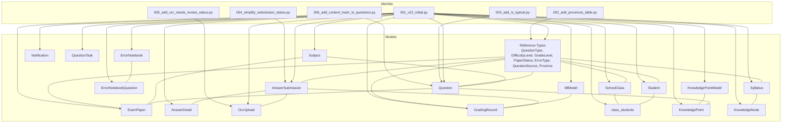
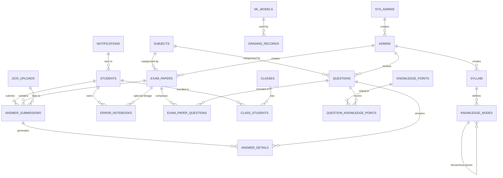
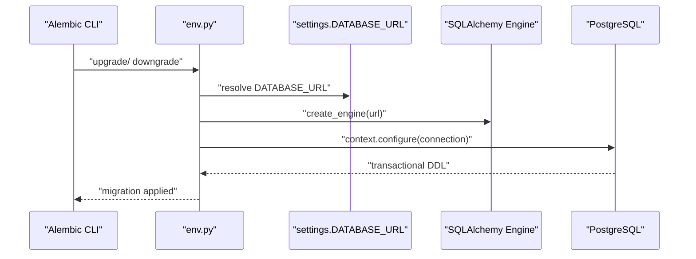
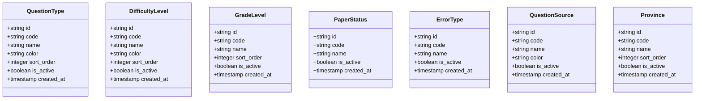
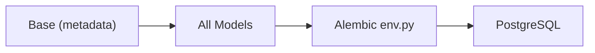

# Database Design

<cite>
**Referenced Files in This Document**
- [backend/app/db/base.py](file://backend/app/db/base.py)
- [backend/app/models/__init__.py](file://backend/app/models/__init__.py)
- [backend/app/models/question.py](file://backend/app/models/question.py)
- [backend/app/models/exam_paper.py](file://backend/app/models/exam_paper.py)
- [backend/app/models/answer_submission.py](file://backend/app/models/answer_submission.py)
- [backend/app/models/error_notebook.py](file://backend/app/models/error_notebook.py)
- [backend/app/models/school_class.py](file://backend/app/models/school_class.py)
- [backend/app/models/student.py](file://backend/app/models/student.py)
- [backend/app/models/reference.py](file://backend/app/models/reference.py)
- [backend/alembic/env.py](file://backend/alembic/env.py)
- [backend/alembic/versions/001_v22_initial.py](file://backend/alembic/versions/001_v22_initial.py)
- [backend/alembic/versions/002_add_provinces_table.py](file://backend/alembic/versions/002_add_provinces_table.py)
- [backend/alembic/versions/003_add_is_typical.py](file://backend/alembic/versions/003_add_is_typical.py)
- [backend/alembic/versions/004_simplify_submission_status.py](file://backend/alembic/versions/004_simplify_submission_status.py)
- [backend/alembic/versions/005_add_ocr_needs_review_status.py](file://backend/alembic/versions/005_add_ocr_needs_review_status.py)
- [backend/alembic/versions/006_add_content_hash_to_questions.py](file://backend/alembic/versions/006_add_content_hash_to_questions.py)
- [backend/app/seed_reference.py](file://backend/app/seed_reference.py)
</cite>

## Table of Contents
1. [Introduction](#introduction)
2. [Project Structure](#project-structure)
3. [Core Components](#core-components)
4. [Architecture Overview](#architecture-overview)
5. [Detailed Component Analysis](#detailed-component-analysis)
6. [Dependency Analysis](#dependency-analysis)
7. [Performance Considerations](#performance-considerations)
8. [Troubleshooting Guide](#troubleshooting-guide)
9. [Conclusion](#conclusion)
10. [Appendices](#appendices)

## Introduction
This document describes the database design for the Ruicheng Educational Management System. It covers the entity-relationship model, PostgreSQL schema with JSON/JSONB fields, migration strategy using Alembic, reference data and master data management, indexing and performance considerations, data integrity and constraints, and operational aspects such as backup and lifecycle management. The goal is to provide a clear, maintainable, and extensible schema suitable for educational content authoring, assessment delivery, OCR processing, grading, and personalized learning.

## Project Structure
The database layer is implemented with SQLAlchemy declarative models and Alembic migrations. The models define tables, relationships, constraints, and JSON/JSONB fields for flexible metadata. Alembic manages schema evolution across versions. Reference data is modeled as lookup tables seeded via administrative actions.

**Diagram sources**
- [backend/app/models/question.py:10-46](file://backend/app/models/question.py#L10-L46)
- [backend/app/models/exam_paper.py:23-51](file://backend/app/models/exam_paper.py#L23-L51)
- [backend/app/models/answer_submission.py:9-37](file://backend/app/models/answer_submission.py#L9-L37)
- [backend/app/models/error_notebook.py:8-32](file://backend/app/models/error_notebook.py#L8-L32)
- [backend/app/models/school_class.py:7-39](file://backend/app/models/school_class.py#L7-L39)
- [backend/app/models/student.py:8-23](file://backend/app/models/student.py#L8-L23)
- [backend/app/models/reference.py:8-76](file://backend/app/models/reference.py#L8-L76)
- [backend/alembic/versions/001_v22_initial.py:10-426](file://backend/alembic/versions/001_v22_initial.py#L10-L426)
- [backend/alembic/versions/002_add_provinces_table.py:11-42](file://backend/alembic/versions/002_add_provinces_table.py#L11-L42)
- [backend/alembic/versions/003_add_is_typical.py:11-17](file://backend/alembic/versions/003_add_is_typical.py#L11-L17)
- [backend/alembic/versions/004_simplify_submission_status.py](file://backend/alembic/versions/004_simplify_submission_status.py)
- [backend/alembic/versions/005_add_ocr_needs_review_status.py](file://backend/alembic/versions/005_add_ocr_needs_review_status.py)
- [backend/alembic/versions/006_add_content_hash_to_questions.py](file://backend/alembic/versions/006_add_content_hash_to_questions.py)

**Section sources**
- [backend/app/db/base.py:5-21](file://backend/app/db/base.py#L5-L21)
- [backend/app/models/__init__.py:1-34](file://backend/app/models/__init__.py#L1-L34)
- [backend/alembic/env.py:1-80](file://backend/alembic/env.py#L1-L80)

## Core Components
This section outlines the core entities and their roles in the educational domain.

- Users and Roles
  - Students: self-register and participate in assessments.
  - Admins and SysAdmins: manage content, classes, and system configuration.
- Assessment and Content
  - Questions: authored content with flexible metadata and review workflow.
  - Exam Papers: structured assessments composed of questions.
  - Answer Submissions and Details: capture student responses and outcomes.
  - Grading Records: track automated and manual grading runs.
  - Error Notebooks: curated collections of incorrect answers for targeted practice.
  - OCR Uploads: scanned answer sheets processed via OCR.
- Learning and Knowledge
  - Knowledge Points and Nodes: hierarchical knowledge structures.
  - Syllabi: curriculum content and knowledge trees.
  - ML/Knowledge Point Models: extracted knowledge for content modeling.
- Reference Data
  - Lookup tables for question types, difficulty levels, grade levels, paper statuses, error types, question sources, and provinces.

Key design characteristics:
- UUID primary keys for global uniqueness and auditability.
- JSON/JSONB fields for flexible metadata and structured content.
- Explicit check constraints for data integrity.
- Many-to-many associations via explicit association tables for clarity and extensibility.

**Section sources**
- [backend/app/models/student.py:8-23](file://backend/app/models/student.py#L8-L23)
- [backend/app/models/school_class.py:7-39](file://backend/app/models/school_class.py#L7-L39)
- [backend/app/models/question.py:10-46](file://backend/app/models/question.py#L10-L46)
- [backend/app/models/exam_paper.py:23-51](file://backend/app/models/exam_paper.py#L23-L51)
- [backend/app/models/answer_submission.py:9-37](file://backend/app/models/answer_submission.py#L9-L37)
- [backend/app/models/error_notebook.py:8-32](file://backend/app/models/error_notebook.py#L8-L32)
- [backend/app/models/reference.py:8-76](file://backend/app/models/reference.py#L8-L76)

## Architecture Overview
The database architecture centers on a PostgreSQL schema with:
- Strongly typed columns for core attributes.
- JSON/JSONB for evolving metadata and structured content.
- Alembic-managed migrations ensuring reproducible schema evolution.
- Reference tables for master data governance.

**Diagram sources**
- [backend/alembic/versions/001_v22_initial.py:10-426](file://backend/alembic/versions/001_v22_initial.py#L10-L426)
- [backend/app/models/exam_paper.py:9-20](file://backend/app/models/exam_paper.py#L9-L20)
- [backend/app/models/school_class.py:31-39](file://backend/app/models/school_class.py#L31-L39)
- [backend/app/models/reference.py:8-76](file://backend/app/models/reference.py#L8-L76)

## Detailed Component Analysis

### Entity-Relationship Model and Constraints
- Naming Convention and Metadata
  - Centralized naming convention for indexes, unique constraints, foreign keys, and primary keys ensures consistent constraint names across environments.
- Core Entities and Relationships
  - Students and Classes: many-to-many via an explicit association table with timestamps and activity flags.
  - Questions and Exam Papers: many-to-many via an association table supporting position and per-exam scoring.
  - Questions and Knowledge Points: many-to-many via an association table with weights.
  - Knowledge Nodes and Syllabi: hierarchical nodes under syllabi with metadata and versioning.
  - Answer Submissions and Details: one-to-many capturing per-question results.
  - Error Notebooks and Questions: one-to-many linking original and recommended practice questions.
- Integrity Constraints
  - Check constraints enforce enumerations and non-negativity for numeric fields.
  - Unique constraints on usernames and lookup codes ensure referential integrity.
  - Foreign keys define cascade-less relationships to preserve auditability and prevent orphaning.

**Section sources**
- [backend/app/db/base.py:5-21](file://backend/app/db/base.py#L5-L21)
- [backend/app/models/school_class.py:31-39](file://backend/app/models/school_class.py#L31-L39)
- [backend/app/models/exam_paper.py:9-20](file://backend/app/models/exam_paper.py#L9-L20)
- [backend/app/models/question.py:38-43](file://backend/app/models/question.py#L38-L43)
- [backend/app/models/answer_submission.py:27-31](file://backend/app/models/answer_submission.py#L27-L31)
- [backend/app/models/error_notebook.py:22-26](file://backend/app/models/error_notebook.py#L22-L26)

### PostgreSQL Schema with JSON/JSONB Fields
- Flexible Metadata
  - Questions and Exam Papers use JSONB for dynamic metadata such as grade scope and chapters.
  - Other entities store structured data in JSON/JSONB for OCR results, grading details, syllabi content, and knowledge trees.
- Data Types and Precision
  - Numeric precision tailored for scores and percentages.
  - Timezone-aware timestamps for auditability and temporal queries.
- Indexing Strategy
  - Strategic indexes on frequently filtered and joined columns (e.g., subject, created_by, is_active, is_typical, content_hash).
  - Composite unique constraints on association tables to prevent duplicates.

**Section sources**
- [backend/app/models/question.py:17-33](file://backend/app/models/question.py#L17-L33)
- [backend/app/models/exam_paper.py:30-38](file://backend/app/models/exam_paper.py#L30-L38)
- [backend/app/models/answer_submission.py:23-25](file://backend/app/models/answer_submission.py#L23-L25)

### Migration Strategy Using Alembic
- Environment Configuration
  - Alembic loads the SQLAlchemy metadata from the shared Base and imports all models to register them.
  - The database URL is resolved from application settings, ensuring offline and online modes use the correct target.
- Version Control Approach
  - Each migration encapsulates a single logical change (initial schema, adding reference tables, adding flags, simplifying enums, adding new statuses, hashing content).
  - Downgrades drop tables in reverse dependency order to avoid foreign key conflicts.
- Execution Flow
  - Offline mode generates SQL scripts against a configured URL.
  - Online mode connects to the live database and applies migrations transactionally.

**Diagram sources**
- [backend/alembic/env.py:15-80](file://backend/alembic/env.py#L15-L80)

**Section sources**
- [backend/alembic/env.py:1-80](file://backend/alembic/env.py#L1-L80)
- [backend/alembic/versions/001_v22_initial.py:10-426](file://backend/alembic/versions/001_v22_initial.py#L10-L426)
- [backend/alembic/versions/002_add_provinces_table.py:11-42](file://backend/alembic/versions/002_add_provinces_table.py#L11-L42)
- [backend/alembic/versions/003_add_is_typical.py:11-17](file://backend/alembic/versions/003_add_is_typical.py#L11-L17)
- [backend/alembic/versions/004_simplify_submission_status.py](file://backend/alembic/versions/004_simplify_submission_status.py)
- [backend/alembic/versions/005_add_ocr_needs_review_status.py](file://backend/alembic/versions/005_add_ocr_needs_review_status.py)
- [backend/alembic/versions/006_add_content_hash_to_questions.py](file://backend/alembic/versions/006_add_content_hash_to_questions.py)

### Reference Data System and Master Data Management
- Reference Entities
  - QuestionType, DifficultyLevel, GradeLevel, PaperStatus, ErrorType, QuestionSource, Province.
- Governance
  - Managed by SysAdmins and Admins; codes and names are unique and sortable.
  - Active flag supports soft-deactivation without losing historical references.
- Seeding
  - Seed data is inserted via administrative actions; the presence of a seed module indicates planned initialization routines.

**Diagram sources**
- [backend/app/models/reference.py:8-76](file://backend/app/models/reference.py#L8-L76)

**Section sources**
- [backend/app/models/reference.py:8-76](file://backend/app/models/reference.py#L8-L76)
- [backend/app/seed_reference.py](file://backend/app/seed_reference.py)

### Data Seeding Processes
- Purpose
  - Populate reference tables with canonical values for question types, difficulty levels, grade levels, statuses, error types, sources, and provinces.
- Method
  - Administrative UI or scripts insert rows with unique codes and sort orders; active flags enable/disable entries without deletion.
- Auditability
  - Created timestamps and creators are tracked for governance and lineage.

**Section sources**
- [backend/app/models/reference.py:8-76](file://backend/app/models/reference.py#L8-L76)
- [backend/app/seed_reference.py](file://backend/app/seed_reference.py)

### Audit Trail Mechanisms
- Timestamps
  - created_at and updated_at fields with server defaults and onupdate triggers capture creation and modification times.
- Review and Ownership
  - Questions and Exam Papers track created_by and reviewed_by, enabling audit trails for authorship and approvals.
- Status Tracking
  - Submission and notebook statuses evolve over time; OCR and grading records capture lifecycle timestamps.

**Section sources**
- [backend/app/models/question.py:25-33](file://backend/app/models/question.py#L25-L33)
- [backend/app/models/exam_paper.py:36-38](file://backend/app/models/exam_paper.py#L36-L38)
- [backend/app/models/answer_submission.py:18-25](file://backend/app/models/answer_submission.py#L18-L25)

## Dependency Analysis
- Model Registration
  - Alembic’s env.py imports all models to register them with the shared Base metadata, ensuring migrations reflect the current schema.
- Foreign Keys and Cascades
  - Current design avoids automatic ON DELETE CASCADE to preserve auditability and prevent accidental data loss.
- Coupling and Cohesion
  - Association tables increase cohesion around many-to-many relationships while keeping core entities lean.

**Diagram sources**
- [backend/app/db/base.py:17-21](file://backend/app/db/base.py#L17-L21)
- [backend/app/models/__init__.py:27-34](file://backend/app/models/__init__.py#L27-L34)
- [backend/alembic/env.py:7-31](file://backend/alembic/env.py#L7-L31)

**Section sources**
- [backend/app/db/base.py:17-21](file://backend/app/db/base.py#L17-L21)
- [backend/app/models/__init__.py:27-34](file://backend/app/models/__init__.py#L27-L34)
- [backend/alembic/env.py:7-31](file://backend/alembic/env.py#L7-L31)

## Performance Considerations
- Indexing Strategy
  - Frequently filtered columns: subject, created_by, is_active, is_typical, content_hash.
  - Composite unique indexes on association tables prevent duplicates and speed up joins.
- JSON/JSONB Efficiency
  - Use JSONB for searchable metadata; consider GIN indexes for high-cardinality JSONB fields if queries require array/text searches.
- Query Patterns
  - Prefer selective filters on indexed columns; leverage composite indexes for multi-column predicates.
  - Denormalize minimal metadata in core tables to reduce joins for common reports.
- Storage and Data Types
  - Numeric precision chosen for scores and percentages; adjust scales if needed for higher resolution.
  - Timezone-aware timestamps support accurate analytics across regions.
- Concurrency and Locking
  - Batch operations should use transactions; consider advisory locks for idempotent seeds.

[No sources needed since this section provides general guidance]

## Troubleshooting Guide
- Migration Failures
  - Verify DATABASE_URL resolves correctly in settings; Alembic replaces the dialect prefix when needed.
  - Ensure all models are imported so Alembic sees the latest metadata.
- Constraint Violations
  - Check check constraints for enumerations and non-negative values.
  - Confirm unique constraints on usernames and lookup codes.
- Data Integrity
  - If deleting related records, disable automatic cascades to maintain auditability; implement controlled archival or soft-delete patterns.
- JSON/JSONB Queries
  - Validate JSON shapes in meta_data and structured_data; ensure consistent schema evolution.

**Section sources**
- [backend/alembic/env.py:15-20](file://backend/alembic/env.py#L15-L20)
- [backend/app/models/question.py:38-43](file://backend/app/models/question.py#L38-L43)
- [backend/app/models/answer_submission.py:27-31](file://backend/app/models/answer_submission.py#L27-L31)

## Conclusion
The database design for the Ruicheng Educational Management System emphasizes flexibility, integrity, and maintainability. JSON/JSONB fields accommodate evolving metadata, while Alembic ensures controlled schema evolution. Reference data is centralized for governance, and auditability is preserved through timestamps and ownership fields. With strategic indexing and careful constraint enforcement, the schema supports efficient querying and robust operations across assessment, content authoring, and personalized learning.

[No sources needed since this section summarizes without analyzing specific files]

## Appendices

### Appendix A: Migration Timeline and Changes
- Initial Schema: establishes core entities, relationships, and reference tables.
- Add Provinces and Subjects Code: extends reference data and adds subject codes.
- Add is_typical Flag: marks typical questions for curation.
- Simplify Submission Status: reduces enumeration complexity.
- Add OCR Needs Review Status: accommodates OCR quality workflows.
- Add Content Hash to Questions: enables de-duplication and content tracking.

**Section sources**
- [backend/alembic/versions/001_v22_initial.py:10-426](file://backend/alembic/versions/001_v22_initial.py#L10-L426)
- [backend/alembic/versions/002_add_provinces_table.py:11-42](file://backend/alembic/versions/002_add_provinces_table.py#L11-L42)
- [backend/alembic/versions/003_add_is_typical.py:11-17](file://backend/alembic/versions/003_add_is_typical.py#L11-L17)
- [backend/alembic/versions/004_simplify_submission_status.py](file://backend/alembic/versions/004_simplify_submission_status.py)
- [backend/alembic/versions/005_add_ocr_needs_review_status.py](file://backend/alembic/versions/005_add_ocr_needs_review_status.py)
- [backend/alembic/versions/006_add_content_hash_to_questions.py](file://backend/alembic/versions/006_add_content_hash_to_questions.py)

### Appendix B: Sample Data Guidance
- Reference Data
  - Insert canonical rows for question types, difficulty levels, grade levels, paper statuses, error types, question sources, and provinces with unique codes and sort orders.
- Questions
  - Provide subject, question_type, difficulty, score, and optional grade_level JSONB metadata.
- Exam Papers
  - Set subject, status, total_score, and optional grade_level JSONB metadata.
- Answer Submissions
  - Record submission_type, status, and optional meta_data JSON.
- OCR Uploads
  - Store file metadata, confidence scores, and structured_data JSON.
- Grading Records
  - Capture model_used, status, total_score, percentage, and details JSON.

[No sources needed since this section provides general guidance]

### Appendix C: Backup and Data Lifecycle
- Backups
  - Schedule regular logical backups of PostgreSQL databases; retain multiple retention cycles.
- Data Lifecycle
  - Archive old exam papers and submissions after retention periods; mark records as inactive where applicable.
- Compliance
  - Enforce data minimization, secure storage of credentials, and audit logs for sensitive operations.

[No sources needed since this section provides general guidance]