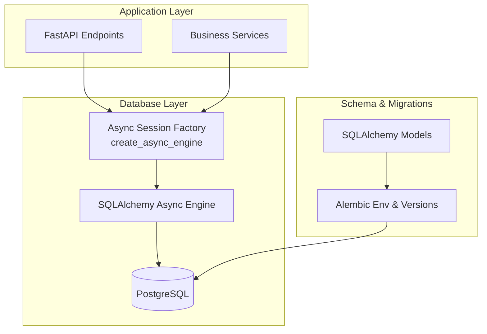
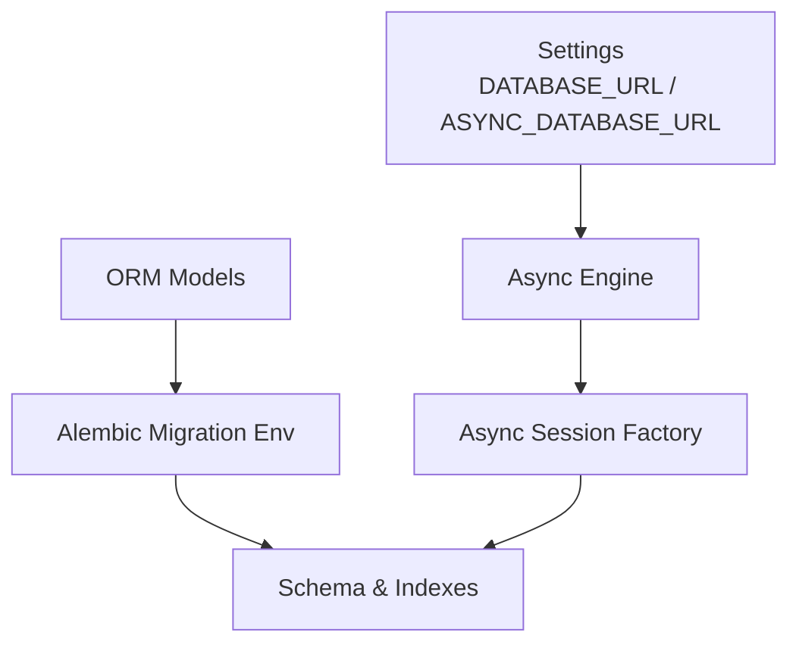
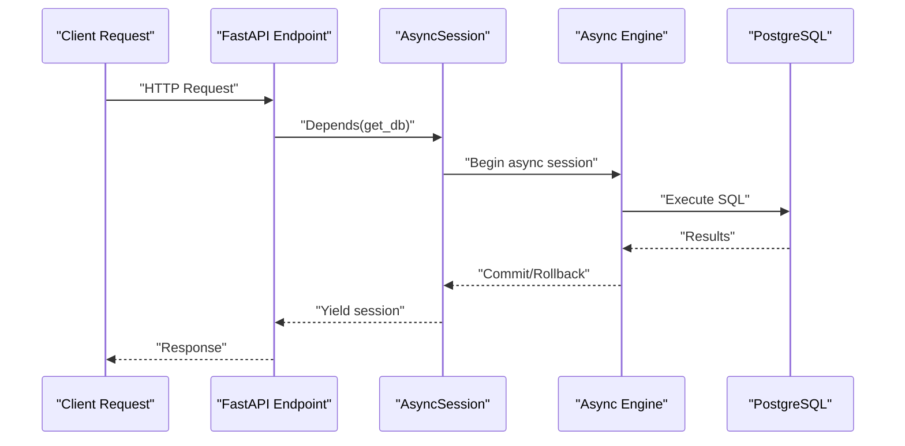
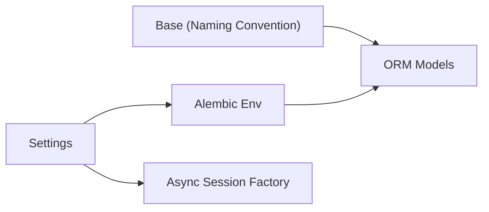

# Database Performance

<cite>
**Referenced Files in This Document**
- [backend/app/db/base.py](file://backend/app/db/base.py)
- [backend/app/db/session.py](file://backend/app/db/session.py)
- [backend/app/core/config.py](file://backend/app/core/config.py)
- [backend/alembic/env.py](file://backend/alembic/env.py)
- [backend/alembic/versions/001_v22_initial.py](file://backend/alembic/versions/001_v22_initial.py)
- [backend/alembic/versions/006_add_content_hash_to_questions.py](file://backend/alembic/versions/006_add_content_hash_to_questions.py)
- [backend/app/models/question.py](file://backend/app/models/question.py)
- [backend/app/models/knowledge_point.py](file://backend/app/models/knowledge_point.py)
- [backend/app/models/knowledge_node.py](file://backend/app/models/knowledge_node.py)
- [backend/app/models/exam_paper.py](file://backend/app/models/exam_paper.py)
- [backend/app/models/answer_submission.py](file://backend/app/models/answer_submission.py)
- [backend/app/models/syllabus.py](file://backend/app/models/syllabus.py)
</cite>

## Table of Contents
1. [Introduction](#introduction)
2. [Project Structure](#project-structure)
3. [Core Components](#core-components)
4. [Architecture Overview](#architecture-overview)
5. [Detailed Component Analysis](#detailed-component-analysis)
6. [Dependency Analysis](#dependency-analysis)
7. [Performance Considerations](#performance-considerations)
8. [Troubleshooting Guide](#troubleshooting-guide)
9. [Conclusion](#conclusion)
10. [Appendices](#appendices)

## Introduction
This document provides comprehensive database performance guidance for the Ruicheng Educational Management System. It focuses on PostgreSQL optimization strategies, including index creation patterns, query optimization techniques, connection pooling configuration, and async session management. It explains the UUID-based primary key strategy advantages for distributed environments and its performance implications, along with JSONB field indexing strategies for flexible metadata queries. Recommendations include read replica setup, partitioning strategies for large datasets, caching integration patterns, maintenance tasks (vacuum/analyze), backup optimization, and transaction isolation levels aligned with concurrent access patterns.

## Project Structure
The backend uses SQLAlchemy ORM with Alembic for migrations and FastAPI for APIs. Database configuration and async sessions are centralized under app/db and app/core. Migrations define the schema and indexes. Models define entities, relationships, and JSON/JSONB fields used for flexible metadata.



**Diagram sources**
- [backend/app/db/session.py:1-26](file://backend/app/db/session.py#L1-L26)
- [backend/app/core/config.py:55-62](file://backend/app/core/config.py#L55-L62)
- [backend/alembic/env.py:17-21](file://backend/alembic/env.py#L17-L21)

**Section sources**
- [backend/app/db/base.py:1-21](file://backend/app/db/base.py#L1-L21)
- [backend/app/db/session.py:1-26](file://backend/app/db/session.py#L1-L26)
- [backend/app/core/config.py:36-98](file://backend/app/core/config.py#L36-L98)
- [backend/alembic/env.py:1-80](file://backend/alembic/env.py#L1-L80)

## Core Components
- Async database configuration and connection URL generation
- Async engine and session factory
- Alembic environment overriding the migration URL to PostgreSQL
- Naming convention for constraints and indexes
- UUID-based primary keys across entities
- JSON/JSONB fields for flexible metadata
- Many-to-many relationships via association tables

Key implementation references:
- Async engine and session factory: [backend/app/db/session.py:6-15](file://backend/app/db/session.py#L6-L15)
- Connection URL properties: [backend/app/core/config.py:55-62](file://backend/app/core/config.py#L55-L62)
- Alembic migration URL override: [backend/alembic/env.py:17-21](file://backend/alembic/env.py#L17-L21)
- Constraint naming convention: [backend/app/db/base.py:6-12](file://backend/app/db/base.py#L6-L12)
- UUID primary keys in models: [backend/app/models/question.py:13](file://backend/app/models/question.py#L13), [backend/app/models/knowledge_point.py:10](file://backend/app/models/knowledge_point.py#L10), [backend/app/models/knowledge_node.py:12](file://backend/app/models/knowledge_node.py#L12), [backend/app/models/exam_paper.py:26](file://backend/app/models/exam_paper.py#L26), [backend/app/models/answer_submission.py:12](file://backend/app/models/answer_submission.py#L12), [backend/app/models/syllabus.py:12](file://backend/app/models/syllabus.py#L12)
- JSON/JSONB fields: [backend/app/models/question.py:18](file://backend/app/models/question.py#L18), [backend/app/models/exam_paper.py:30](file://backend/app/models/exam_paper.py#L30), [backend/app/models/syllabus.py:17](file://backend/app/models/syllabus.py#L17), [backend/app/models/knowledge_node.py:23](file://backend/app/models/knowledge_node.py#L23)

**Section sources**
- [backend/app/db/session.py:1-26](file://backend/app/db/session.py#L1-L26)
- [backend/app/core/config.py:55-62](file://backend/app/core/config.py#L55-L62)
- [backend/alembic/env.py:17-21](file://backend/alembic/env.py#L17-L21)
- [backend/app/db/base.py:6-12](file://backend/app/db/base.py#L6-L12)
- [backend/app/models/question.py:10-46](file://backend/app/models/question.py#L10-L46)
- [backend/app/models/exam_paper.py:23-51](file://backend/app/models/exam_paper.py#L23-L51)
- [backend/app/models/knowledge_node.py:9-26](file://backend/app/models/knowledge_node.py#L9-L26)
- [backend/app/models/answer_submission.py:9-37](file://backend/app/models/answer_submission.py#L9-L37)
- [backend/app/models/syllabus.py:9-26](file://backend/app/models/syllabus.py#L9-L26)

## Architecture Overview
The system uses asynchronous SQLAlchemy sessions with an asyncpg driver. Alembic manages schema and indexes. Constraints and indexes follow a consistent naming convention. Entities use UUID primary keys for distributed environments. Many-to-many relationships are implemented via explicit association tables. JSON/JSONB fields enable flexible metadata storage.



**Diagram sources**
- [backend/app/core/config.py:55-62](file://backend/app/core/config.py#L55-L62)
- [backend/app/db/session.py:6-15](file://backend/app/db/session.py#L6-L15)
- [backend/alembic/env.py:17-21](file://backend/alembic/env.py#L17-L21)
- [backend/app/db/base.py:6-12](file://backend/app/db/base.py#L6-L12)

## Detailed Component Analysis

### Index Creation Patterns
- Explicit indexes on frequently filtered columns:
  - Questions: subject, created_by, is_active, is_typical, content_hash
  - KnowledgePoints: code (unique), parent_id, subject, grade_level
  - AnswerSubmissions: student_id, exam_paper_id, ocr_upload_id
  - ExamPaper: subject, created_by
  - KnowledgeNodes: syllabus_id, parent_id
- Unique constraints on composite keys for many-to-many and uniqueness guarantees
- Alembic-managed indexes and constraints ensure reproducible schema across environments

Recommended additions based on observed usage:
- Composite indexes for frequent filter combinations (e.g., Questions by subject and is_active)
- Partial indexes for boolean flags (e.g., active records only)
- Expression indexes for JSON/JSONB filtering when applicable

**Section sources**
- [backend/app/models/question.py:17-31](file://backend/app/models/question.py#L17-L31)
- [backend/app/models/knowledge_point.py:11-16](file://backend/app/models/knowledge_point.py#L11-L16)
- [backend/app/models/answer_submission.py:13-16](file://backend/app/models/answer_submission.py#L13-L16)
- [backend/app/models/exam_paper.py:29, 36](file://backend/app/models/exam_paper.py#L29,L36)
- [backend/app/models/knowledge_node.py:13, 14](file://backend/app/models/knowledge_node.py#L13,L14)
- [backend/alembic/versions/001_v22_initial.py:102-124](file://backend/alembic/versions/001_v22_initial.py#L102-L124)
- [backend/alembic/versions/001_v22_initial.py:163-170](file://backend/alembic/versions/001_v22_initial.py#L163-L170)
- [backend/alembic/versions/006_add_content_hash_to_questions.py:18-19](file://backend/alembic/versions/006_add_content_hash_to_questions.py#L18-L19)

### Query Optimization Techniques
- Prefer indexed columns in WHERE clauses and JOIN conditions
- Use LIMIT and pagination for large result sets
- Minimize SELECT *; fetch only required columns
- Leverage EXPLAIN/EXPLAIN ANALYZE to identify slow scans and missing indexes
- Use EXISTS for subqueries when appropriate
- Avoid volatile functions in WHERE clauses (e.g., random())

### Connection Pooling Configuration
- Current setup uses default asyncpg connection parameters via SQLAlchemy async engine
- Recommended tuning parameters (to be configured in application settings):
  - pool_size: 10–20 for moderate concurrency
  - max_overflow: 10–15
  - pool_recycle: 3600 seconds
  - pool_pre_ping: True
  - echo: False in production

These values balance throughput and resource usage while preventing stale connections.

### Transaction Isolation Levels
- Default READ COMMITTED is suitable for most OLTP workloads
- For long-running analytical reads or batch jobs, consider READ ONLY transactions with SNAPSHOT level where appropriate
- Avoid SERIALIZABLE unless strict serializability is required

### UUID-Based Primary Keys
Advantages:
- Globally unique identifiers reduce conflicts in distributed systems
- Support for sharding/partitioning by UUID ranges or hash
- Reduced risk of identity collisions across replicas or imports

Performance considerations:
- UUIDs are less index-friendly than integers; consider:
  - Using UUID v1 with embedded timestamps for locality
  - Hash-based partitioning strategies
  - Maintaining separate integer sequences per tenant or shard if feasible

### JSONB Field Indexing Strategies
Observed usage:
- Questions.grade_level stored as JSONB
- ExamPaper.grade_level stored as JSONB
- Flexible metadata stored as JSON/JSONB in multiple entities

Recommendations:
- GIN indexes for JSONB containment queries
- Consider expression indexes for frequent filter keys inside JSONB
- Normalize frequently queried JSONB fields into relational columns if query patterns stabilize

**Section sources**
- [backend/app/models/question.py:18](file://backend/app/models/question.py#L18)
- [backend/app/models/exam_paper.py:30](file://backend/app/models/exam_paper.py#L30)
- [backend/app/models/syllabus.py:17](file://backend/app/models/syllabus.py#L17)
- [backend/app/models/knowledge_node.py:23](file://backend/app/models/knowledge_node.py#L23)

### Async Database Session Management
- Async engine created with ASYNC_DATABASE_URL
- AsyncSessionLocal configured with expire_on_commit=False
- get_db yields a scoped async session with automatic rollback on exceptions and close in finally



**Diagram sources**
- [backend/app/db/session.py:18-26](file://backend/app/db/session.py#L18-L26)
- [backend/app/core/config.py:60-61](file://backend/app/core/config.py#L60-L61)

**Section sources**
- [backend/app/db/session.py:1-26](file://backend/app/db/session.py#L1-L26)
- [backend/app/core/config.py:55-62](file://backend/app/core/config.py#L55-L62)

### Knowledge Tree and Many-to-Many Relationships
- Knowledge tree modeled via KnowledgeNode with parent_id foreign key
- Many-to-many relationships:
  - ExamPaper ↔ Question via exam_paper_questions
  - Question ↔ KnowledgePoint via question_knowledge_points
- These structures benefit from:
  - Proper indexing on foreign keys and association table keys
  - Denormalized position/sort fields for ordering
  - Partitioning by syllabus/version for large knowledge trees

```mermaid
erDiagram
KNOWLEDGE_NODES {
string id PK
string syllabus_id FK
string parent_id FK
string name
string node_type
integer sort_order
integer version
boolean is_active
}
SYLLABI {
string id PK
string title
string grade_level
string province
string subject
json content
json knowledge_tree
string status
integer version
boolean is_current
string parent_syllabus_id
string created_by
}
EXAM_PAPER_QUESTIONS {
string id PK
string exam_paper_id FK
string question_id FK
integer position
integer score
}
EXAM_PAPERS {
string id PK
string title
string description
string subject
jsonb grade_level
string status
integer total_score
integer duration_minutes
string subtitle
text instructions
string created_by
}
QUESTIONS {
string id PK
string title
string question_type
string difficulty
string subject
jsonb grade_level
integer score
text correct_answer
text explanation
json meta_data
string source
string review_status
string reviewed_by
timestamp timezone reviewed_at
string source_task_id
string created_by
boolean is_active
boolean is_typical
string content_hash
}
KNOWLEDGE_POINTS {
string id PK
string code UK
string name
text description
string parent_id FK
string subject
string grade_level
string difficulty_level
}
SYLLABI ||--o{ KNOWLEDGE_NODES : contains
KNOWLEDGE_NODES ||--o{ KNOWLEDGE_NODES : parent_child
EXAM_PAPERS ||--o{ EXAM_PAPER_QUESTIONS : has
QUESTIONS ||--o{ EXAM_PAPER_QUESTIONS : included_in
KNOWLEDGE_POINTS ||--o{ QUESTION_KNOWLEDGE_POINTS : linked_to
QUESTIONS ||--o{ QUESTION_KNOWLEDGE_POINTS : mapped_to
```

**Diagram sources**
- [backend/app/models/knowledge_node.py:9-26](file://backend/app/models/knowledge_node.py#L9-L26)
- [backend/app/models/syllabus.py:9-26](file://backend/app/models/syllabus.py#L9-L26)
- [backend/app/models/exam_paper.py:9-20](file://backend/app/models/exam_paper.py#L9-L20)
- [backend/app/models/exam_paper.py:23-51](file://backend/app/models/exam_paper.py#L23-L51)
- [backend/app/models/question.py:10-46](file://backend/app/models/question.py#L10-L46)
- [backend/app/models/knowledge_point.py:7-27](file://backend/app/models/knowledge_point.py#L7-L27)
- [backend/alembic/versions/001_v22_initial.py:143-151](file://backend/alembic/versions/001_v22_initial.py#L143-L151)
- [backend/alembic/versions/001_v22_initial.py:163-170](file://backend/alembic/versions/001_v22_initial.py#L163-L170)

**Section sources**
- [backend/app/models/knowledge_node.py:9-26](file://backend/app/models/knowledge_node.py#L9-L26)
- [backend/app/models/exam_paper.py:9-51](file://backend/app/models/exam_paper.py#L9-L51)
- [backend/app/models/question.py:10-46](file://backend/app/models/question.py#L10-L46)
- [backend/app/models/knowledge_point.py:7-27](file://backend/app/models/knowledge_point.py#L7-L27)
- [backend/alembic/versions/001_v22_initial.py:143-170](file://backend/alembic/versions/001_v22_initial.py#L143-L170)

### Concurrent Access Patterns
- High write concurrency on answer submissions and OCR uploads
- Moderate read concurrency on questions and exam papers
- Recommendation:
  - Separate read replicas for reporting/analytics
  - Use snapshot isolation for read-only reports
  - Apply row-level locking only when necessary

## Dependency Analysis
- Alembic overrides the migration URL to PostgreSQL using settings.DATABASE_URL
- Models depend on Base with naming convention for constraints/indexes
- Sessions depend on settings.ASYNC_DATABASE_URL



**Diagram sources**
- [backend/app/core/config.py:55-62](file://backend/app/core/config.py#L55-L62)
- [backend/alembic/env.py:17-21](file://backend/alembic/env.py#L17-L21)
- [backend/app/db/base.py:6-12](file://backend/app/db/base.py#L6-L12)

**Section sources**
- [backend/app/core/config.py:55-62](file://backend/app/core/config.py#L55-L62)
- [backend/alembic/env.py:17-21](file://backend/alembic/env.py#L17-L21)
- [backend/app/db/base.py:6-12](file://backend/app/db/base.py#L6-L12)

## Performance Considerations
- Indexing
  - Add composite indexes for frequent filter pairs
  - Consider partial indexes for active records
  - Evaluate expression indexes for JSONB queries
- Query Plans
  - Use EXPLAIN/EXPLAIN ANALYZE regularly
  - Monitor slow query logs and plan cache misses
- Connection Pooling
  - Tune pool_size and max_overflow based on workload
  - Enable pool_pre_ping and set pool_recycle
- Transactions
  - Keep transactions short; avoid long-held locks
  - Use READ COMMITTED for typical operations
- JSON/JSONB
  - Prefer GIN for containment; normalize when patterns stabilize
- Partitioning
  - Consider range/hash partitioning by UUID or tenant for large tables
- Caching
  - Cache hot metadata and lookup tables (e.g., subjects, provinces)
  - Use Redis with TTL for session and derived data
- Maintenance
  - Schedule VACUUM/ANALYZE during low-traffic windows
  - Use autovacuum parameters tuned for write-heavy workloads
- Backups
  - Use logical backups for fast restores; validate restore times
  - Consider continuous archiving and PITR for point-in-time recovery

## Troubleshooting Guide
- Slow Queries
  - Identify missing indexes via EXPLAIN
  - Add targeted indexes for hot filters
- Connection Issues
  - Verify ASYNC_DATABASE_URL correctness
  - Check pool exhaustion symptoms and adjust pool_size/max_overflow
- Migration Failures
  - Confirm Alembic env overrides URL to PostgreSQL
  - Ensure target_metadata is set and models are imported
- JSONB Filtering
  - Add GIN indexes for containment queries
  - Revisit normalization if queries become complex

**Section sources**
- [backend/alembic/env.py:17-21](file://backend/alembic/env.py#L17-L21)
- [backend/app/core/config.py:55-62](file://backend/app/core/config.py#L55-L62)

## Conclusion
The system’s use of UUID primary keys, JSON/JSONB flexibility, and async sessions provides a solid foundation for distributed and scalable operations. Performance gains come from strategic indexing, careful connection pooling, normalized many-to-many relationships, and thoughtful maintenance routines. Implementing read replicas, partitioning, and caching will further improve scalability under higher concurrency and larger datasets.

## Appendices

### Appendix A: Recommended Indexes Based on Models
- Questions: subject, created_by, is_active, is_typical, content_hash
- KnowledgePoints: code (unique), parent_id, subject, grade_level
- AnswerSubmissions: student_id, exam_paper_id, ocr_upload_id
- ExamPaper: subject, created_by
- KnowledgeNodes: syllabus_id, parent_id
- Many-to-many association tables: foreign keys and composite keys

**Section sources**
- [backend/app/models/question.py:17-31](file://backend/app/models/question.py#L17-L31)
- [backend/app/models/knowledge_point.py:11-16](file://backend/app/models/knowledge_point.py#L11-L16)
- [backend/app/models/answer_submission.py:13-16](file://backend/app/models/answer_submission.py#L13-L16)
- [backend/app/models/exam_paper.py:29, 36](file://backend/app/models/exam_paper.py#L29,L36)
- [backend/app/models/knowledge_node.py:13, 14](file://backend/app/models/knowledge_node.py#L13,L14)
- [backend/alembic/versions/001_v22_initial.py:143-170](file://backend/alembic/versions/001_v22_initial.py#L143-L170)