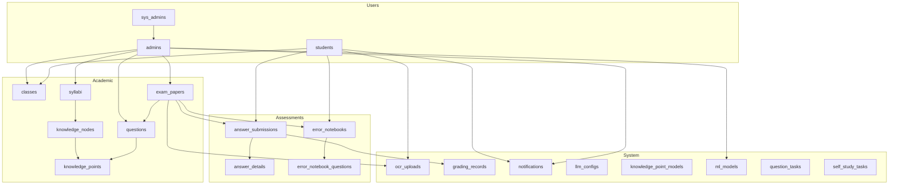
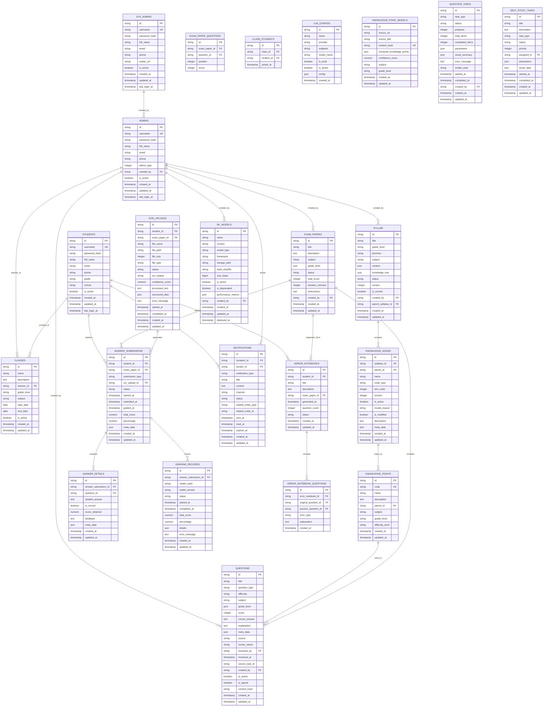
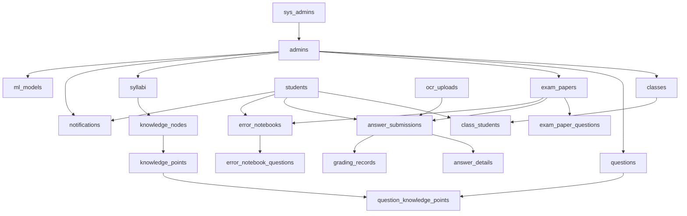

# Entity Relationship Model

<cite>
**Referenced Files in This Document**
- [001_v22_initial.py](file://backend/alembic/versions/001_v22_initial.py)
- [database-design.md](file://docs/database-design.md)
- [student.py](file://backend/app/models/student.py)
- [admin.py](file://backend/app/models/admin.py)
- [sys_admin.py](file://backend/app/models/sys_admin.py)
- [school_class.py](file://backend/app/models/school_class.py)
- [knowledge_point.py](file://backend/app/models/knowledge_point.py)
- [question.py](file://backend/app/models/question.py)
- [exam_paper.py](file://backend/app/models/exam_paper.py)
- [answer_submission.py](file://backend/app/models/answer_submission.py)
- [answer_detail.py](file://backend/app/models/answer_detail.py)
- [error_notebook.py](file://backend/app/models/error_notebook.py)
- [error_notebook_question.py](file://backend/app/models/error_notebook_question.py)
- [notification.py](file://backend/app/models/notification.py)
- [base.py](file://backend/app/db/base.py)
</cite>

## Table of Contents
1. [Introduction](#introduction)
2. [Project Structure](#project-structure)
3. [Core Components](#core-components)
4. [Architecture Overview](#architecture-overview)
5. [Detailed Component Analysis](#detailed-component-analysis)
6. [Dependency Analysis](#dependency-analysis)
7. [Performance Considerations](#performance-considerations)
8. [Troubleshooting Guide](#troubleshooting-guide)
9. [Conclusion](#conclusion)
10. [Appendices](#appendices)

## Introduction
This document presents the comprehensive entity relationship model for the Ruicheng Educational Management System. It details all database tables, their primary keys, foreign key relationships, cardinality constraints, and referential integrity rules. The model covers users (students, admins, sys_admins), educational content (questions, syllabi, knowledge nodes), assessment components (exam papers, answer submissions), and system components (notifications, ML models). It also explains hierarchical relationships in knowledge trees, many-to-many associations in class enrollment and question-knowledge mapping, and audit trail relationships. Finally, it provides the table dependency order for proper database initialization and outlines cascade behaviors.

## Project Structure
The database schema is defined via SQLAlchemy declarative models and Alembic migrations. The base metadata naming convention ensures consistent constraint naming. The initial schema defines 20+ tables and their relationships.

**Diagram sources**
- [001_v22_initial.py](file://backend/alembic/versions/001_v22_initial.py)
- [student.py](file://backend/app/models/student.py)
- [admin.py](file://backend/app/models/admin.py)
- [sys_admin.py](file://backend/app/models/sys_admin.py)
- [school_class.py](file://backend/app/models/school_class.py)
- [knowledge_point.py](file://backend/app/models/knowledge_point.py)
- [question.py](file://backend/app/models/question.py)
- [exam_paper.py](file://backend/app/models/exam_paper.py)
- [answer_submission.py](file://backend/app/models/answer_submission.py)
- [answer_detail.py](file://backend/app/models/answer_detail.py)
- [error_notebook.py](file://backend/app/models/error_notebook.py)
- [error_notebook_question.py](file://backend/app/models/error_notebook_question.py)
- [notification.py](file://backend/app/models/notification.py)

**Section sources**
- [001_v22_initial.py](file://backend/alembic/versions/001_v22_initial.py)
- [base.py](file://backend/app/db/base.py)

## Core Components
Below are the 20+ tables with their primary keys and key attributes. All primary keys are UUID-based strings (36 characters), enabling distributed system compatibility and global uniqueness.

- sys_admins
  - Primary key: id
  - Attributes: username, password_hash, full_name, email, phone, avatar_url, is_active, created_at, updated_at, last_login_at

- admins
  - Primary key: id
  - Foreign keys: created_by → sys_admins.id
  - Attributes: username, password_hash, full_name, email, phone, admin_type, is_active, created_at, updated_at, last_login_at

- students
  - Primary key: id
  - Attributes: username, password_hash, full_name, email, phone, grade, school, is_active, created_at, updated_at, last_login_at

- classes
  - Primary key: id
  - Foreign keys: teacher_id → admins.id
  - Attributes: name, description, teacher_id, grade_level, subject, start_date, end_date, is_active, created_at, updated_at

- knowledge_points
  - Primary key: id
  - Foreign keys: parent_id → knowledge_points.id
  - Attributes: code, name, description, parent_id, subject, grade_level, difficulty_level, created_at, updated_at

- questions
  - Primary key: id
  - Foreign keys: created_by → admins.id, reviewed_by → admins.id
  - Attributes: title, question_type, difficulty, subject, grade_level, score, correct_answer, explanation, meta_data, source, review_status, reviewed_by, reviewed_at, source_task_id, is_active, is_typical, content_hash, created_at, updated_at

- exam_papers
  - Primary key: id
  - Foreign keys: created_by → admins.id
  - Attributes: title, description, subject, grade_level, status, total_score, duration_minutes, instructions, created_by, created_at, updated_at

- exam_paper_questions (association)
  - Primary key: id
  - Foreign keys: exam_paper_id → exam_papers.id, question_id → questions.id
  - Attributes: position, score

- class_students (association)
  - Primary key: id
  - Foreign keys: class_id → classes.id, student_id → students.id
  - Attributes: joined_at
  - Unique constraint: (class_id, student_id)

- ocr_uploads
  - Primary key: id
  - Foreign keys: student_id → students.id, exam_paper_id → exam_papers.id
  - Attributes: file_name, file_path, file_size, file_type, status, ocr_engine, confidence_score, processed_text, structured_data, error_message, started_at, completed_at, created_at, updated_at

- answer_submissions
  - Primary key: id
  - Foreign keys: student_id → students.id, exam_paper_id → exam_papers.id, ocr_upload_id → ocr_uploads.id
  - Attributes: submission_type, status, started_at, submitted_at, graded_at, total_score, percentage, meta_data, created_at, updated_at

- answer_details
  - Primary key: id
  - Foreign keys: answer_submission_id → answer_submissions.id, question_id → questions.id
  - Attributes: student_answer, is_correct, score_obtained, feedback, meta_data, created_at, updated_at
  - Unique constraint: (answer_submission_id, question_id)

- grading_records
  - Primary key: id
  - Foreign keys: answer_submission_id → answer_submissions.id
  - Attributes: model_used, model_version, status, started_at, completed_at, total_score, percentage, details, error_message, created_at, updated_at

- error_notebooks
  - Primary key: id
  - Foreign keys: student_id → students.id, exam_paper_id → exam_papers.id
  - Attributes: title, description, exam_paper_id, generated_at, question_count, status, created_at, updated_at

- error_notebook_questions
  - Primary key: id
  - Foreign keys: error_notebook_id → error_notebooks.id, original_question_id → questions.id, practice_question_id → questions.id
  - Attributes: error_type, explanation, created_at
  - Unique constraint: (error_notebook_id, original_question_id)

- notifications
  - Primary key: id
  - Foreign keys: recipient_id → students.id, sender_id → admins.id
  - Attributes: notification_type, title, content, channel, status, related_entity_type, related_entity_id, sent_at, read_at, expires_at, created_at, updated_at

- llm_configs
  - Primary key: id
  - Attributes: name, provider, endpoint, model_name, is_local, is_active, config, created_at

- syllabi
  - Primary key: id
  - Foreign keys: created_by → admins.id, parent_syllabus_id → syllabi.id
  - Attributes: title, grade_level, province, subject, content, knowledge_tree, status, version, is_current, parent_syllabus_id, created_by, created_at, updated_at

- knowledge_nodes
  - Primary key: id
  - Foreign keys: syllabus_id → syllabi.id, parent_id → knowledge_nodes.id
  - Attributes: name, node_type, sort_order, version, is_active, invalid_reason, is_modified, description, meta_data, created_at, updated_at

- knowledge_point_models
  - Primary key: id
  - Attributes: source_url, source_title, content_hash, extracted_knowledge_points, confidence_score, subject, grade_level, created_at, updated_at
  - Unique constraint: content_hash

- ml_models
  - Primary key: id
  - Foreign keys: created_by → admins.id
  - Attributes: name, version, model_type, framework, storage_path, hash_sha256, size_bytes, is_active, is_deprecated, performance_metrics, created_by, created_at, updated_at, deployed_at
  - Unique constraint: (name, version)

- question_tasks
  - Primary key: id
  - Foreign keys: created_by → admins.id
  - Attributes: task_type, status, progress, total_items, completed_items, parameters, result_summary, error_message, model_used, started_at, completed_at, created_by, created_at, updated_at

- self_study_tasks
  - Primary key: id
  - Foreign keys: assigned_to → admins.id
  - Attributes: title, description, task_type, status, priority, parameters, result_data, started_at, completed_at, created_at, updated_at

**Section sources**
- [001_v22_initial.py](file://backend/alembic/versions/001_v22_initial.py)
- [student.py](file://backend/app/models/student.py)
- [admin.py](file://backend/app/models/admin.py)
- [sys_admin.py](file://backend/app/models/sys_admin.py)
- [school_class.py](file://backend/app/models/school_class.py)
- [knowledge_point.py](file://backend/app/models/knowledge_point.py)
- [question.py](file://backend/app/models/question.py)
- [exam_paper.py](file://backend/app/models/exam_paper.py)
- [answer_submission.py](file://backend/app/models/answer_submission.py)
- [answer_detail.py](file://backend/app/models/answer_detail.py)
- [error_notebook.py](file://backend/app/models/error_notebook.py)
- [error_notebook_question.py](file://backend/app/models/error_notebook_question.py)
- [notification.py](file://backend/app/models/notification.py)

## Architecture Overview
The schema follows a normalized relational design with UUID primary keys. It supports:
- Hierarchical knowledge structures via self-referencing foreign keys (knowledge_points, knowledge_nodes)
- Many-to-many relationships via explicit association tables (class_students, exam_paper_questions, question_knowledge_points)
- Audit trails through created_at/updated_at timestamps and review metadata
- Distributed-friendly identifiers via UUID strings

**Diagram sources**
- [001_v22_initial.py](file://backend/alembic/versions/001_v22_initial.py)
- [student.py](file://backend/app/models/student.py)
- [admin.py](file://backend/app/models/admin.py)
- [sys_admin.py](file://backend/app/models/sys_admin.py)
- [school_class.py](file://backend/app/models/school_class.py)
- [knowledge_point.py](file://backend/app/models/knowledge_point.py)
- [question.py](file://backend/app/models/question.py)
- [exam_paper.py](file://backend/app/models/exam_paper.py)
- [answer_submission.py](file://backend/app/models/answer_submission.py)
- [answer_detail.py](file://backend/app/models/answer_detail.py)
- [error_notebook.py](file://backend/app/models/error_notebook.py)
- [error_notebook_question.py](file://backend/app/models/error_notebook_question.py)
- [notification.py](file://backend/app/models/notification.py)

## Detailed Component Analysis

### Users and Roles
- sys_admins: System-level administrators who create and manage admins. No cascading deletes for referential integrity.
- admins: Teachers and question administrators created by sys_admins. Cascades: none implied by migration; deletion behavior depends on application policy.
- students: Learners with profile and enrollment records.

Cardinality:
- One-to-many: sys_admins → admins
- Many-to-one: admins → sys_admins
- Many-to-one: students → classes (via class_students)
- Many-to-many: classes ↔ students via class_students

**Section sources**
- [001_v22_initial.py](file://backend/alembic/versions/001_v22_initial.py)
- [student.py](file://backend/app/models/student.py)
- [admin.py](file://backend/app/models/admin.py)
- [sys_admin.py](file://backend/app/models/sys_admin.py)
- [school_class.py](file://backend/app/models/school_class.py)

### Knowledge Hierarchy
- knowledge_points: Hierarchical structure via parent_id → knowledge_points.id
- knowledge_nodes: Hierarchical structure under syllabi via parent_id → knowledge_nodes.id
- syllabi: Root container with optional parent_syllabus_id → syllabi.id

Cardinality:
- One-to-many: knowledge_points.parent_id → knowledge_points.id
- One-to-many: knowledge_nodes.parent_id → knowledge_nodes.id
- One-to-many: syllabi.parent_syllabus_id → syllabi.id
- Many-to-one: knowledge_nodes.syllabus_id → syllabi.id

**Section sources**
- [001_v22_initial.py](file://backend/alembic/versions/001_v22_initial.py)
- [knowledge_point.py](file://backend/app/models/knowledge_point.py)

### Educational Content and Questions
- questions: Core item with metadata, review tracking, and optional content_hash for deduplication.
- question_knowledge_points: Many-to-many mapping with weight.
- syllabi and knowledge_nodes: Store structured curriculum content.

Cardinality:
- Many-to-many: questions ↔ knowledge_points via question_knowledge_points
- One-to-many: syllabi → knowledge_nodes
- One-to-many: knowledge_nodes → knowledge_points

**Section sources**
- [001_v22_initial.py](file://backend/alembic/versions/001_v22_initial.py)
- [question.py](file://backend/app/models/question.py)
- [knowledge_point.py](file://backend/app/models/knowledge_point.py)

### Assessments and Submissions
- exam_papers: Assessment definition with status and scoring.
- exam_paper_questions: Many-to-many with ordering and per-question scores.
- answer_submissions: Per-student, per-paper submission record.
- answer_details: Per-question answer and scoring.
- ocr_uploads: OCR processing linkage to submissions.
- grading_records: Automated grading logs.

Cardinality:
- Many-to-many: exam_papers ↔ questions via exam_paper_questions
- One-to-many: answer_submissions → answer_details
- One-to-one/zero-or-one: answer_submissions → ocr_uploads
- One-to-many: answer_submissions → grading_records

**Section sources**
- [001_v22_initial.py](file://backend/alembic/versions/001_v22_initial.py)
- [answer_submission.py](file://backend/app/models/answer_submission.py)
- [answer_detail.py](file://backend/app/models/answer_detail.py)
- [exam_paper.py](file://backend/app/models/exam_paper.py)

### Error Notebook and Practice
- error_notebooks: Aggregated mistakes for a student and optionally a paper.
- error_notebook_questions: Links original and recommended practice questions.

Cardinality:
- One-to-many: error_notebooks → error_notebook_questions
- One-to-many: questions → error_notebook_questions (original and practice)

**Section sources**
- [001_v22_initial.py](file://backend/alembic/versions/001_v22_initial.py)
- [error_notebook.py](file://backend/app/models/error_notebook.py)
- [error_notebook_question.py](file://backend/app/models/error_notebook_question.py)

### System Components
- notifications: Inter-user communication with channels and related entities.
- llm_configs: LLM endpoint configurations.
- ml_models: Model registry with versioning and deployment metadata.
- knowledge_point_models: Extracted knowledge modeling results with content_hash uniqueness.
- question_tasks and self_study_tasks: Background job orchestration.

Cardinality:
- Many-to-one: notifications.recipient_id → students
- Many-to-one: notifications.sender_id → admins
- Many-to-one: ml_models.created_by → admins

**Section sources**
- [001_v22_initial.py](file://backend/alembic/versions/001_v22_initial.py)
- [notification.py](file://backend/app/models/notification.py)

## Dependency Analysis
The Alembic initial migration defines the creation order and foreign key dependencies. The order below reflects forward dependencies (tables must exist before referencing tables):

1. sys_admins
2. admins
3. students
4. classes
5. knowledge_points
6. subjects
7. questions
8. exam_papers
9. exam_paper_questions
10. class_students
11. question_knowledge_points
12. ocr_uploads
13. answer_submissions
14. answer_details
15. grading_records
16. error_notebooks
17. error_notebook_questions
18. notifications
19. llm_configs
20. syllabi
21. knowledge_nodes
22. knowledge_point_models
23. ml_models
24. question_tasks
25. self_study_tasks

Downgrade order is the reverse for safe removal.

**Diagram sources**
- [001_v22_initial.py](file://backend/alembic/versions/001_v22_initial.py)

**Section sources**
- [001_v22_initial.py](file://backend/alembic/versions/001_v22_initial.py)

## Performance Considerations
- Indexes: The migration creates indexes on frequently filtered columns (e.g., subject, grade_level, status, created_by). Consider composite indexes for common join patterns (e.g., student_id + exam_paper_id).
- JSON fields: Use targeted GIN/JSON operators for meta_data queries where applicable.
- Partitioning: For large temporal tables (answer_submissions, grading_records, ocr_uploads), consider partitioning by time to improve query performance and maintenance.
- UUIDs: While UUIDs are globally unique and support distributed writes, ensure appropriate indexing and consider partitioning strategies aligned with write locality.

[No sources needed since this section provides general guidance]

## Troubleshooting Guide
Common issues and resolutions:
- Integrity errors on delete: Ensure referential actions align with business rules. For example, prevent deletion of classes with enrolled students or papers with submissions.
- Duplicate enrollments: class_students enforces (class_id, student_id) uniqueness; check for duplicate inserts.
- Missing answer details: answer_details requires unique (answer_submission_id, question_id); verify one answer per question per submission.
- Content hash conflicts: knowledge_point_models enforces unique content_hash; handle duplicates by de-duplicating content extraction.

**Section sources**
- [001_v22_initial.py](file://backend/alembic/versions/001_v22_initial.py)
- [answer_detail.py](file://backend/app/models/answer_detail.py)
- [error_notebook_question.py](file://backend/app/models/error_notebook_question.py)

## Conclusion
The Ruicheng Educational Management System employs a robust, normalized relational schema with UUID primary keys to support distributed environments. Clear foreign key relationships define academic workflows from users and classes to assessments and error notebooks. The initial Alembic migration establishes a consistent dependency order and naming convention for constraints. By leveraging indexes, partitioning, and careful referential integrity policies, the system achieves scalability and maintainability.

[No sources needed since this section summarizes without analyzing specific files]

## Appendices

### Referential Integrity and Cascade Behaviors
- Enforced in migration scripts; explicit cascade/delete behaviors are not defined in the initial migration. Application-level policies should define:
  - Restrict deletes on parents with children (e.g., classes with students, papers with submissions).
  - Set null on parent deletion where appropriate (e.g., question.reviewed_by when admin deleted).
  - Cascade deletes for child entities when parent is removed (e.g., exam_paper_questions when paper deleted).

**Section sources**
- [001_v22_initial.py](file://backend/alembic/versions/001_v22_initial.py)

### UUID Strategy Benefits
- Global uniqueness across distributed nodes
- Reduced contention for auto-increment sequences
- Easier sharding and horizontal scaling
- Improved auditability with immutable identifiers

**Section sources**
- [base.py](file://backend/app/db/base.py)
- [001_v22_initial.py](file://backend/alembic/versions/001_v22_initial.py)