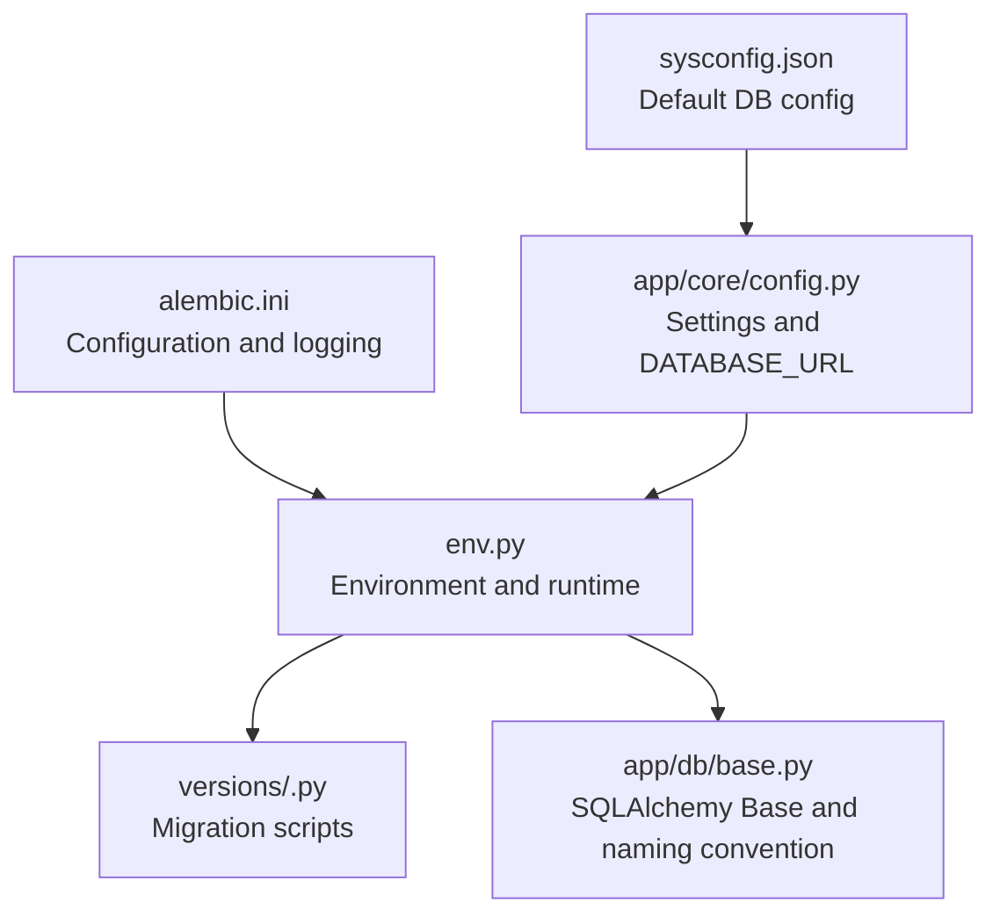
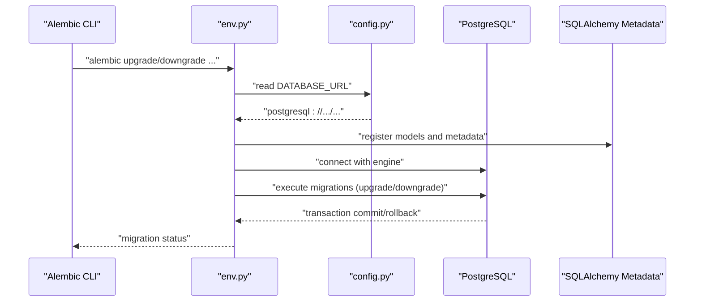
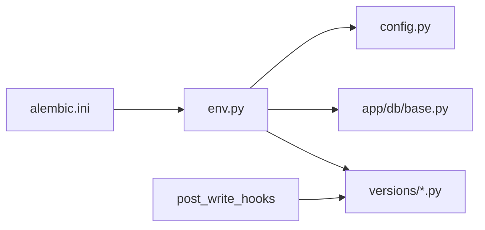

# Migration Management

<cite>
**Referenced Files in This Document**
- [alembic.ini](file://backend/alembic.ini)
- [env.py](file://backend/alembic/env.py)
- [script.py.mako](file://backend/alembic/script.py.mako)
- [001_v22_initial.py](file://backend/alembic/versions/001_v22_initial.py)
- [002_add_provinces_table.py](file://backend/alembic/versions/002_add_provinces_table.py)
- [003_add_is_typical.py](file://backend/alembic/versions/003_add_is_typical.py)
- [004_simplify_submission_status.py](file://backend/alembic/versions/004_simplify_submission_status.py)
- [005_add_ocr_needs_review_status.py](file://backend/alembic/versions/005_add_ocr_needs_review_status.py)
- [006_add_content_hash_to_questions.py](file://backend/alembic/versions/006_add_content_hash_to_questions.py)
- [base.py](file://backend/app/db/base.py)
- [config.py](file://backend/app/core/config.py)
- [sysconfig.json](file://backend/sysconfig.json)
</cite>

## Table of Contents
1. [Introduction](#introduction)
2. [Project Structure](#project-structure)
3. [Core Components](#core-components)
4. [Architecture Overview](#architecture-overview)
5. [Detailed Component Analysis](#detailed-component-analysis)
6. [Dependency Analysis](#dependency-analysis)
7. [Performance Considerations](#performance-considerations)
8. [Troubleshooting Guide](#troubleshooting-guide)
9. [Conclusion](#conclusion)
10. [Appendices](#appendices)

## Introduction
This document explains the Alembic-based database versioning system used by the backend. It covers the migration workflow from initial schema creation through incremental updates, the semantic versioning approach with revision IDs, and the execution commands and environment configuration. It also documents the relationship between migration files and database state evolution, best practices for writing safe migrations, and strategies for production deployments.

## Project Structure
The Alembic configuration and migration files live under backend/alembic/. The migration scripts are stored under backend/alembic/versions/, named with semantic revision IDs. The environment configuration in env.py reads the database URL from application settings, while alembic.ini defines logging, hooks, and SQLAlchemy URL defaults.

**Diagram sources**
- [alembic.ini:1-150](file://backend/alembic.ini#L1-L150)
- [env.py:1-80](file://backend/alembic/env.py#L1-L80)
- [base.py:1-21](file://backend/app/db/base.py#L1-L21)
- [config.py:1-98](file://backend/app/core/config.py#L1-L98)
- [sysconfig.json:1-48](file://backend/sysconfig.json#L1-L48)

**Section sources**
- [alembic.ini:1-150](file://backend/alembic.ini#L1-L150)
- [env.py:1-80](file://backend/alembic/env.py#L1-L80)
- [base.py:1-21](file://backend/app/db/base.py#L1-L21)
- [config.py:1-98](file://backend/app/core/config.py#L1-L98)
- [sysconfig.json:1-48](file://backend/sysconfig.json#L1-L48)

## Core Components
- Alembic configuration: Defines script location, logging, hooks, and default SQLAlchemy URL.
- Environment runtime: Loads the real database URL from application settings and registers models for metadata discovery.
- Migration templates: Provide a reusable skeleton for upgrade and downgrade functions.
- Migration scripts: Define schema changes and data transformations for each revision.
- SQLAlchemy Base: Provides naming conventions for constraints and indexes.

Key responsibilities:
- alembic.ini: Centralized configuration for Alembic behavior and logging.
- env.py: Runtime wiring of database URL and model metadata for autogenerate and migrations.
- script.py.mako: Template for generating revision scripts with placeholders for upgrade/downgrade logic.
- versions/*.py: Individual migrations that evolve the schema and data safely.

**Section sources**
- [alembic.ini:1-150](file://backend/alembic.ini#L1-L150)
- [env.py:1-80](file://backend/alembic/env.py#L1-L80)
- [script.py.mako:1-29](file://backend/alembic/script.py.mako#L1-L29)
- [base.py:1-21](file://backend/app/db/base.py#L1-L21)

## Architecture Overview
The migration system integrates with the application’s SQLAlchemy models and settings. At runtime, Alembic loads the configured database URL from the application settings, discovers model metadata, and executes migrations either offline or online against the real database.

**Diagram sources**
- [env.py:15-20](file://backend/alembic/env.py#L15-L20)
- [config.py:55-61](file://backend/app/core/config.py#L55-L61)
- [env.py:63-80](file://backend/alembic/env.py#L63-L80)

## Detailed Component Analysis

### Alembic Configuration (alembic.ini)
- script_location: Points to the alembic directory for migration scripts.
- prepend_sys_path: Prepends current working directory to sys.path for imports.
- timezone: Uses UTC for timestamps in filenames and logs.
- sqlalchemy.url: Defaults to a local SQLite database; overridden at runtime by env.py.
- post_write_hooks: Black and Ruff hooks to format and lint new revision scripts.
- Logging: Separate loggers for root, SQLAlchemy, and Alembic.

Operational impact:
- Ensures consistent formatting of generated migrations.
- Provides centralized logging configuration for migration runs.

**Section sources**
- [alembic.ini:1-150](file://backend/alembic.ini#L1-L150)

### Environment Runtime (env.py)
- Overrides sqlalchemy.url with the real database URL from application settings.
- Imports all models to register them with Base.metadata for autogenerate.
- Supports offline and online migration modes:
  - Offline: Uses a URL without an engine.
  - Online: Creates a real engine and runs within a transaction.

Key behaviors:
- Reads DATABASE_URL from settings and normalizes PostgreSQL driver variants.
- Sets target_metadata to Base.metadata for model discovery.

**Section sources**
- [env.py:15-20](file://backend/alembic/env.py#L15-L20)
- [env.py:39-80](file://backend/alembic/env.py#L39-L80)

### Migration Template (script.py.mako)
- Provides placeholders for revision identifiers and upgrade/downgrade logic.
- Generates boilerplate with imports and function stubs.

Usage:
- New revisions are generated using Alembic’s revision command, which renders this template.

**Section sources**
- [script.py.mako:1-29](file://backend/alembic/script.py.mako#L1-L29)

### Migration Scripts (versions/*.py)

#### Revision 001_v22_initial
- Purpose: Complete rebuild of the initial schema.
- Scope: Creates numerous tables (users, classes, questions, exam papers, submissions, grading, OCR, error notebooks, notifications, LLM configs, syllabi, tasks, knowledge nodes, ML models, self-study tasks).
- Downgrade: Drops tables in reverse dependency order to preserve referential integrity.

Best practices shown:
- Explicit primary keys and unique constraints.
- Foreign key relationships defined early.
- Index-friendly naming conventions via SQLAlchemy metadata.

**Section sources**
- [001_v22_initial.py:1-426](file://backend/alembic/versions/001_v22_initial.py#L1-L426)

#### Revision 002_add_provinces
- Purpose: Adds a reference table for provinces and a code column to subjects.
- Upgrade: Creates provinces table and conditionally adds code column to subjects if not present, then creates a unique constraint.
- Downgrade: Drops the unique constraint and column if present, then drops the provinces table.

Safety note:
- Uses information_schema checks to avoid duplicate operations.

**Section sources**
- [002_add_provinces_table.py:1-42](file://backend/alembic/versions/002_add_provinces_table.py#L1-L42)

#### Revision 003_add_is_typical
- Purpose: Adds a boolean flag is_typical to questions.
- Upgrade: Adds the column with a default value.
- Downgrade: Drops the column.

**Section sources**
- [003_add_is_typical.py:1-17](file://backend/alembic/versions/003_add_is_typical.py#L1-L17)

#### Revision 004_simplify_submission_status
- Purpose: Standardizes answer_submissions.status to English enum values.
- Upgrade: Drops existing check constraint if present, normalizes statuses to English values, and applies a new check constraint.
- Downgrade: Restores the original check constraint and reverts statuses.

Safety note:
- Checks for existing constraints before dropping.
- Updates data to match new enum values.

**Section sources**
- [004_simplify_submission_status.py:1-53](file://backend/alembic/versions/004_simplify_submission_status.py#L1-L53)

#### Revision 005_add_ocr_needs_review_status
- Purpose: Extends ocr_uploads.status enumeration to include NEEDS_REVIEW.
- Upgrade: Drops the old check constraint and recreates it with the new status set.
- Downgrade: Reverts to the previous status set.

**Section sources**
- [005_add_ocr_needs_review_status.py:1-33](file://backend/alembic/versions/005_add_ocr_needs_review_status.py#L1-L33)

#### Revision 006_add_content_hash_to_questions
- Purpose: Adds content_hash to questions and an index for efficient lookups.
- Upgrade: Adds the column and creates an index.
- Downgrade: Drops the index and column.

**Section sources**
- [006_add_content_hash_to_questions.py:1-25](file://backend/alembic/versions/006_add_content_hash_to_questions.py#L1-L25)

### SQLAlchemy Base and Naming Conventions
- Defines a naming convention for indexes, unique constraints, check constraints, foreign keys, and primary keys.
- Applied to metadata to ensure consistent constraint names across environments.

Impact:
- Improves readability and maintainability of migrations that alter constraints.
- Reduces ambiguity when dropping constraints by name.

**Section sources**
- [base.py:5-18](file://backend/app/db/base.py#L5-L18)

### Application Settings and Database URL
- Settings class constructs DATABASE_URL from environment variables or sysconfig.json defaults.
- env.py reads DATABASE_URL and normalizes PostgreSQL driver variants.

Operational implications:
- Production databases are configured via environment variables.
- Local development can fall back to defaults from sysconfig.json.

**Section sources**
- [config.py:55-61](file://backend/app/core/config.py#L55-L61)
- [env.py:15-20](file://backend/alembic/env.py#L15-L20)
- [sysconfig.json:2-7](file://backend/sysconfig.json#L2-L7)

## Dependency Analysis
The migration system depends on:
- Alembic configuration and environment runtime.
- SQLAlchemy Base metadata for model discovery.
- Application settings for the database URL.
- Post-write hooks for formatting new migrations.

**Diagram sources**
- [alembic.ini:1-150](file://backend/alembic.ini#L1-L150)
- [env.py:1-80](file://backend/alembic/env.py#L1-L80)
- [config.py:1-98](file://backend/app/core/config.py#L1-L98)
- [base.py:1-21](file://backend/app/db/base.py#L1-L21)

**Section sources**
- [alembic.ini:1-150](file://backend/alembic.ini#L1-L150)
- [env.py:1-80](file://backend/alembic/env.py#L1-L80)
- [config.py:1-98](file://backend/app/core/config.py#L1-L98)
- [base.py:1-21](file://backend/app/db/base.py#L1-L21)

## Performance Considerations
- Prefer batch operations for large datasets when updating statuses or adding columns with defaults.
- Use indexes judiciously; they improve read performance but can slow writes.
- Keep migrations atomic and reversible to minimize downtime.
- Test migrations on staging to validate performance and correctness before production deployment.

[No sources needed since this section provides general guidance]

## Troubleshooting Guide
Common issues and resolutions:
- Incorrect database URL: Ensure DATABASE_URL is set via environment variables or sysconfig.json defaults. env.py normalizes PostgreSQL driver variants.
- Missing model registration: Verify that all models are imported so Base.metadata includes them for autogenerate and migration discovery.
- Constraint naming conflicts: Use consistent naming conventions via SQLAlchemy metadata to avoid ambiguous constraint names.
- Status normalization failures: For enum updates, check for existing constraints before dropping and update data accordingly.
- Post-write hook errors: Confirm Black and Ruff are installed and available on PATH.

**Section sources**
- [env.py:15-20](file://backend/alembic/env.py#L15-L20)
- [config.py:55-61](file://backend/app/core/config.py#L55-L61)
- [base.py:5-18](file://backend/app/db/base.py#L5-L18)
- [004_simplify_submission_status.py:21-42](file://backend/alembic/versions/004_simplify_submission_status.py#L21-L42)

## Conclusion
The Alembic-based migration system in this project provides a robust, versioned approach to evolving the database schema. By leveraging environment-driven configuration, consistent naming conventions, and carefully crafted upgrade/downgrade logic, it supports safe, repeatable deployments across environments. Following the best practices outlined here will help maintain a reliable migration history and reduce risks during production changes.

[No sources needed since this section summarizes without analyzing specific files]

## Appendices

### Semantic Versioning Approach with Revision IDs
- Revision IDs use a human-readable format (for example, 001_v22_initial, 002_add_provinces).
- Down_revision links define the sequence of migrations.
- Each migration encapsulates a single logical change with explicit upgrade and downgrade steps.

**Section sources**
- [001_v22_initial.py:5-8](file://backend/alembic/versions/001_v22_initial.py#L5-L8)
- [002_add_provinces_table.py:5-8](file://backend/alembic/versions/002_add_provinces_table.py#L5-L8)
- [003_add_is_typical.py:5-8](file://backend/alembic/versions/003_add_is_typical.py#L5-L8)
- [004_simplify_submission_status.py:3-6](file://backend/alembic/versions/004_simplify_submission_status.py#L3-L6)
- [005_add_ocr_needs_review_status.py:3-6](file://backend/alembic/versions/005_add_ocr_needs_review_status.py#L3-L6)
- [006_add_content_hash_to_questions.py:3-6](file://backend/alembic/versions/006_add_content_hash_to_questions.py#L3-L6)

### Migration Execution Commands and Environment Configuration
- Alembic CLI commands:
  - Upgrade to head: alembic upgrade head
  - Downgrade to a specific revision: alembic downgrade -1 or alembic downgrade <revision>
  - Generate a new revision: alembic revision --autogenerate -m "<message>"
- Environment configuration:
  - DATABASE_URL is read from application settings and normalized in env.py.
  - Defaults are taken from sysconfig.json if environment variables are not set.

**Section sources**
- [env.py:15-20](file://backend/alembic/env.py#L15-L20)
- [config.py:55-61](file://backend/app/core/config.py#L55-L61)
- [sysconfig.json:2-7](file://backend/sysconfig.json#L2-L7)

### Rollback Procedures
- Use alembic downgrade to revert to a previous revision.
- Ensure downgrade functions drop indexes, constraints, and columns in reverse dependency order.
- For data normalization migrations, revert statuses and restore previous constraints.

**Section sources**
- [001_v22_initial.py:417-426](file://backend/alembic/versions/001_v22_initial.py#L417-L426)
- [002_add_provinces_table.py:32-42](file://backend/alembic/versions/002_add_provinces_table.py#L32-L42)
- [003_add_is_typical.py:15-17](file://backend/alembic/versions/003_add_is_typical.py#L15-L17)
- [004_simplify_submission_status.py:45-53](file://backend/alembic/versions/004_simplify_submission_status.py#L45-L53)
- [005_add_ocr_needs_review_status.py:26-33](file://backend/alembic/versions/005_add_ocr_needs_review_status.py#L26-L33)
- [006_add_content_hash_to_questions.py:22-25](file://backend/alembic/versions/006_add_content_hash_to_questions.py#L22-L25)

### Best Practices for Writing Safe Migrations
- Always write explicit downgrade steps.
- Use information_schema checks to avoid duplicate operations.
- Normalize data before altering constraints or enums.
- Add indexes after data is populated when possible.
- Keep migrations small and focused on a single logical change.
- Test on staging before applying to production.

**Section sources**
- [002_add_provinces_table.py:21-30](file://backend/alembic/versions/002_add_provinces_table.py#L21-L30)
- [004_simplify_submission_status.py:21-42](file://backend/alembic/versions/004_simplify_submission_status.py#L21-L42)
- [006_add_content_hash_to_questions.py:17-24](file://backend/alembic/versions/006_add_content_hash_to_questions.py#L17-L24)

### Testing Strategies for Database Schema Changes
- Run migrations in a separate test database.
- Validate constraint names and indexes using SQLAlchemy metadata.
- Verify data transformations (for example, status normalization) produce expected results.
- Use Alembic’s offline mode to review SQL before applying.

**Section sources**
- [env.py:39-61](file://backend/alembic/env.py#L39-L61)
- [base.py:5-18](file://backend/app/db/base.py#L5-L18)