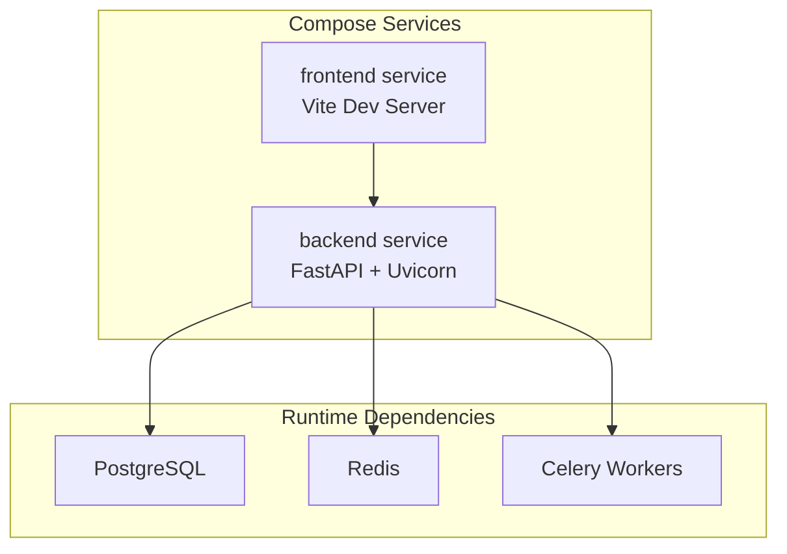
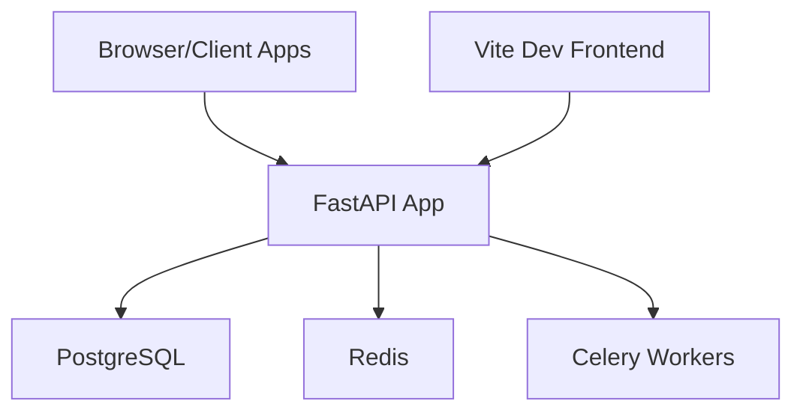
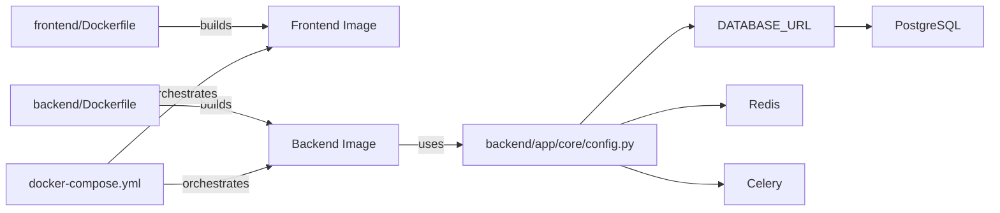

# Deployment & Operations

<cite>
**Referenced Files in This Document**
- [docker-compose.yml](file://docker-compose.yml)
- [backend/Dockerfile](file://backend/Dockerfile)
- [frontend/Dockerfile](file://frontend/Dockerfile)
- [start.sh](file://start.sh)
- [backend/requirements.txt](file://backend/requirements.txt)
- [backend/alembic.ini](file://backend/alembic.ini)
- [backend/alembic/env.py](file://backend/alembic/env.py)
- [backend/app/core/config.py](file://backend/app/core/config.py)
- [backend/app/main.py](file://backend/app/main.py)
- [backend/app/db/base.py](file://backend/app/db/base.py)
- [backend/sysconfig.json](file://backend/sysconfig.json)
- [docs/database-design.md](file://docs/database-design.md)
- [docs/PROJECT_STATUS.md](file://docs/PROJECT_STATUS.md)
</cite>

## Table of Contents
1. [Introduction](#introduction)
2. [Project Structure](#project-structure)
3. [Core Components](#core-components)
4. [Architecture Overview](#architecture-overview)
5. [Detailed Component Analysis](#detailed-component-analysis)
6. [Dependency Analysis](#dependency-analysis)
7. [Performance Considerations](#performance-considerations)
8. [Troubleshooting Guide](#troubleshooting-guide)
9. [Conclusion](#conclusion)
10. [Appendices](#appendices)

## Introduction
This document provides comprehensive deployment and operations guidance for the education platform. It covers containerization with Docker and Docker Compose, production deployment strategies, environment management, database migration and backup/recovery, monitoring/logging, performance optimization, scaling, maintenance procedures, and operational runbooks for administrators.

## Project Structure
The project consists of:
- Backend service built with FastAPI/Uvicorn, using PostgreSQL via SQLAlchemy/asyncpg, Alembic for migrations, and Redis/Celery for async tasks.
- Frontend service built with Vite/React, served in development mode.
- Operational automation via a shell script that provisions dependencies, runs migrations, seeds data, and starts services.
- Container images defined by per-service Dockerfiles and orchestrated by Docker Compose.

**Diagram sources**
- [docker-compose.yml:3-32](file://docker-compose.yml#L3-L32)
- [backend/app/core/config.py:63-76](file://backend/app/core/config.py#L63-L76)

**Section sources**
- [docker-compose.yml:1-33](file://docker-compose.yml#L1-L33)
- [backend/Dockerfile:1-11](file://backend/Dockerfile#L1-L11)
- [frontend/Dockerfile:1-11](file://frontend/Dockerfile#L1-L11)
- [start.sh:1-359](file://start.sh#L1-L359)

## Core Components
- Backend service
  - Exposes REST API with unified response wrapper and CORS.
  - Reads configuration from sysconfig.json with environment overrides.
  - Uses PostgreSQL for persistence and Redis/Celery for async tasks.
- Frontend service
  - Serves React SPA in development mode.
- Operational automation
  - One-click bootstrap script that installs dependencies, checks/creates DB, runs migrations, seeds data, and starts services.
- Database
  - Alembic-managed migrations targeting PostgreSQL.
  - SQLAlchemy declarative base with naming conventions.
  - Rich entity model set for educational domain.

**Section sources**
- [backend/app/main.py:1-52](file://backend/app/main.py#L1-L52)
- [backend/app/core/config.py:1-98](file://backend/app/core/config.py#L1-L98)
- [backend/app/db/base.py:1-21](file://backend/app/db/base.py#L1-L21)
- [backend/alembic/env.py:1-80](file://backend/alembic/env.py#L1-L80)
- [backend/alembic.ini:1-150](file://backend/alembic.ini#L1-L150)
- [backend/sysconfig.json:1-48](file://backend/sysconfig.json#L1-L48)
- [docs/database-design.md:1-727](file://docs/database-design.md#L1-L727)

## Architecture Overview
The system is composed of:
- Web/API tier: FastAPI application exposing REST endpoints.
- Data tier: PostgreSQL database with Alembic migrations.
- Task/async tier: Redis broker and Celery workers.
- Frontend tier: SPA served by Vite dev server.
- Orchestration: Docker Compose for local development; production can adopt container orchestration platforms.

**Diagram sources**
- [backend/app/main.py:1-52](file://backend/app/main.py#L1-L52)
- [backend/app/core/config.py:63-76](file://backend/app/core/config.py#L63-L76)
- [docker-compose.yml:3-32](file://docker-compose.yml#L3-L32)

## Detailed Component Analysis

### Docker Compose Configuration
- Services
  - backend: builds from backend/Dockerfile, exposes port 8000, mounts backend code and SQLite DB file, sets environment variables for database type and keys, runs Uvicorn with reload.
  - frontend: builds from frontend/Dockerfile, exposes port 3000, mounts frontend/src, depends_on backend, runs Vite dev server.
- Environment management
  - DATABASE_TYPE and SQLITE_DB_PATH control local SQLite usage in compose.
  - SECRET_KEY, ALGORITHM, token expirations configured for development.
- Notes
  - The compose file currently uses SQLite for the backend DB path mount. Production should align environment variables to PostgreSQL.

**Section sources**
- [docker-compose.yml:1-33](file://docker-compose.yml#L1-L33)

### Backend Container Image
- Base image: python:3.12-slim.
- Working directory: /app.
- Installs Python dependencies from requirements.txt.
- Copies application code and runs Uvicorn on port 8000.

**Section sources**
- [backend/Dockerfile:1-11](file://backend/Dockerfile#L1-L11)
- [backend/requirements.txt:1-27](file://backend/requirements.txt#L1-L27)

### Frontend Container Image
- Base image: node:22-alpine.
- Working directory: /app.
- Installs npm dependencies and runs Vite dev server.

**Section sources**
- [frontend/Dockerfile:1-11](file://frontend/Dockerfile#L1-L11)

### One-Click Bootstrap Script
- Responsibilities
  - Initialize Conda environment and Python packages.
  - Generate sysconfig.json if missing with defaults.
  - Parse sysconfig.json for database settings, with environment overrides.
  - Check and clean conflicting ports, install backend dependencies, and verify PostgreSQL connectivity.
  - Run Alembic migrations; fallback to direct table creation if migration fails.
  - Seed reference data and ensure system admin account exists.
  - Install frontend dependencies and start backend (Uvicorn) and frontend (Vite) services.
  - Health-check endpoints and provide access URLs.
- Observations
  - Uses sysconfig.json for database credentials and other settings.
  - Provides a safe, repeatable bootstrap process for local development.

**Section sources**
- [start.sh:1-359](file://start.sh#L1-L359)
- [backend/sysconfig.json:1-48](file://backend/sysconfig.json#L1-L48)
- [backend/app/core/config.py:6-31](file://backend/app/core/config.py#L6-L31)

### Database Migration and Initialization
- Alembic configuration
  - Script location under backend/alembic.
  - Logging configuration and hooks for formatting.
  - Default SQLAlchemy URL points to SQLite for development; overridden at runtime to PostgreSQL via settings.
- Runtime environment
  - env.py reads DATABASE_URL from settings and configures migrations accordingly.
- Migration execution
  - The script runs Alembic upgrade head; if it fails, it falls back to creating tables directly using SQLAlchemy Base.

**Section sources**
- [backend/alembic.ini:1-150](file://backend/alembic.ini#L1-L150)
- [backend/alembic/env.py:1-80](file://backend/alembic/env.py#L1-L80)
- [start.sh:198-217](file://start.sh#L198-L217)

### Configuration Management
- Settings class loads from sysconfig.json with environment variable overrides for sensitive values.
- Provides DATABASE_URL and ASYNC_DATABASE_URL for SQLAlchemy and asyncpg.
- Supports Redis and Celery broker/result backend URLs.
- Upload and OCR/model cache settings.

**Section sources**
- [backend/app/core/config.py:1-98](file://backend/app/core/config.py#L1-L98)
- [backend/sysconfig.json:1-48](file://backend/sysconfig.json#L1-L48)

### API Startup and Health
- FastAPI app initializes CORS and unified response wrapper.
- On startup, seeds reference data.
- Health endpoint exposed at /health.

**Section sources**
- [backend/app/main.py:1-52](file://backend/app/main.py#L1-L52)

### Entity Model Overview
- SQLAlchemy DeclarativeBase with naming convention for constraints.
- Comprehensive model set for users, classes, questions, exams, submissions, OCR, grading, error notebooks, ML models, notifications, syllabi, knowledge nodes, and more.

**Section sources**
- [backend/app/db/base.py:1-21](file://backend/app/db/base.py#L1-L21)
- [docs/database-design.md:1-727](file://docs/database-design.md#L1-L727)

## Dependency Analysis
- Backend depends on PostgreSQL for persistence and Redis/Celery for async tasks.
- Frontend depends on backend API.
- Alembic depends on settings for database URL resolution.
- The bootstrap script orchestrates dependencies and ensures readiness.

**Diagram sources**
- [docker-compose.yml:3-32](file://docker-compose.yml#L3-L32)
- [backend/Dockerfile:1-11](file://backend/Dockerfile#L1-L11)
- [frontend/Dockerfile:1-11](file://frontend/Dockerfile#L1-L11)
- [backend/app/core/config.py:55-76](file://backend/app/core/config.py#L55-L76)

**Section sources**
- [backend/app/core/config.py:55-76](file://backend/app/core/config.py#L55-L76)
- [backend/alembic/env.py:15-20](file://backend/alembic/env.py#L15-L20)

## Performance Considerations
- Database partitioning and indexing
  - Partition large tables by time (e.g., answer_submissions) to improve query performance and manageability.
  - Create composite and partial indexes to optimize frequent queries.
- Connection pooling and async I/O
  - Use asyncpg with SQLAlchemy for efficient asynchronous database access.
- Caching and background tasks
  - Use Redis for caching hot data and Celery for offloading long-running tasks.
- Monitoring and logging
  - Enable structured logging and integrate metrics collection for database and application performance.

[No sources needed since this section provides general guidance]

## Troubleshooting Guide
- Port conflicts
  - The bootstrap script checks and kills processes bound to ports 8000 and 3000 before starting services.
- PostgreSQL connectivity
  - Verify credentials and service availability; the script creates the database if it does not exist.
- Migration failures
  - Alembic upgrade head is attempted first; if it fails, the script falls back to direct table creation using SQLAlchemy Base.
- Health checks
  - Confirm backend health endpoint responds; frontend may require compilation time before becoming ready.
- Logs and diagnostics
  - Inspect container logs for backend and frontend services; review Alembic logs and PostgreSQL logs for errors.

**Section sources**
- [start.sh:159-196](file://start.sh#L159-L196)
- [start.sh:198-217](file://start.sh#L198-L217)
- [backend/alembic.ini:116-150](file://backend/alembic.ini#L116-L150)
- [backend/app/main.py:50-52](file://backend/app/main.py#L50-L52)

## Conclusion
The platform provides a robust local development stack using Docker Compose and a comprehensive bootstrap script. For production, align environment variables to PostgreSQL, externalize Redis/Celery, and adopt container orchestration. Implement standardized CI/CD pipelines, automate migrations, and establish backup/recovery and monitoring procedures to ensure reliability and scalability.

[No sources needed since this section summarizes without analyzing specific files]

## Appendices

### A. Production Deployment Pipeline and CI/CD Integration
- Build stages
  - Build backend and frontend images from their respective Dockerfiles.
  - Tag images with semantic versions or commit hashes.
- Orchestration
  - Use a container orchestrator (e.g., Kubernetes) to deploy backend, frontend, PostgreSQL, Redis, and Celery.
  - Externalize secrets via secret managers and environment injection.
- Automated deployment
  - Trigger deployments on successful tests and approved releases.
  - Rollout with rolling updates and health checks.
- Canary and rollback
  - Gradually shift traffic and monitor metrics; rollback on failure.

[No sources needed since this section provides general guidance]

### B. Environment Management
- Local development
  - Use docker-compose.yml for local services; mount code directories for live reload.
- Staging
  - Mirror production configuration with staging databases and queues.
- Production
  - Use environment variables and secrets for database credentials, Redis, and tokens.
  - Ensure DATABASE_TYPE and DB path variables are aligned with PostgreSQL.

**Section sources**
- [docker-compose.yml:13-20](file://docker-compose.yml#L13-L20)
- [backend/app/core/config.py:14-30](file://backend/app/core/config.py#L14-L30)

### C. Database Migration Procedures
- Pre-deploy checklist
  - Back up production database.
  - Test migration scripts in staging.
- Execution
  - Run Alembic upgrade head against production database.
  - Monitor for errors and roll back if necessary.
- Post-migration
  - Validate data integrity and reseed reference data if needed.

**Section sources**
- [backend/alembic/env.py:63-80](file://backend/alembic/env.py#L63-L80)
- [backend/alembic.ini:86-91](file://backend/alembic.ini#L86-L91)
- [start.sh:198-217](file://start.sh#L198-L217)

### D. Backup and Recovery Processes
- Backup strategy
  - Schedule daily logical backups of PostgreSQL.
  - Archive WAL segments for point-in-time recovery.
  - Store backups in secure, offsite storage.
- Recovery drills
  - Conduct quarterly recovery drills to validate restore procedures and measure RTO/RPO.

**Section sources**
- [docs/database-design.md:681-693](file://docs/database-design.md#L681-L693)

### E. Disaster Recovery Planning
- Multi-region replication
  - Configure streaming replication or managed failover groups.
- Failover procedures
  - Automate failover and DNS changes; test regularly.
- Documentation
  - Maintain runbooks with step-by-step recovery instructions.

[No sources needed since this section provides general guidance]

### F. Monitoring and Logging Configuration
- Application logs
  - Enable structured logging in FastAPI and capture container logs.
- Database monitoring
  - Track connection counts, slow queries, and disk usage.
- Metrics
  - Export metrics for CPU, memory, and queue lengths; alert on thresholds.

[No sources needed since this section provides general guidance]

### G. Performance Optimization and Scaling
- Horizontal scaling
  - Scale backend replicas behind a load balancer.
  - Use read replicas for reporting workloads.
- Asynchronous processing
  - Offload heavy tasks to Celery workers with Redis as broker.
- Caching
  - Cache frequently accessed data in Redis; invalidate on data changes.

[No sources needed since this section provides general guidance]

### H. System Maintenance Procedures
- Routine maintenance
  - Apply patches to containers and OS; rotate secrets periodically.
- Patching strategy
  - Test patches in staging; deploy during low-traffic windows.
- Health and readiness probes
  - Configure Kubernetes probes to ensure smooth rolling updates.

[No sources needed since this section provides general guidance]

### I. Operational Runbooks
- Start/stop services
  - Use docker-compose commands to start and stop services.
- Restart failed containers
  - Inspect logs and restart unhealthy containers.
- Investigate performance issues
  - Review application logs, database slow query logs, and queue backlog.

**Section sources**
- [docker-compose.yml:20-32](file://docker-compose.yml#L20-L32)
- [start.sh:46-55](file://start.sh#L46-L55)

### J. Example Deployment Scripts and Configuration References
- Backend Dockerfile
  - [backend/Dockerfile:1-11](file://backend/Dockerfile#L1-L11)
- Frontend Dockerfile
  - [frontend/Dockerfile:1-11](file://frontend/Dockerfile#L1-L11)
- Docker Compose
  - [docker-compose.yml:1-33](file://docker-compose.yml#L1-L33)
- Bootstrap script
  - [start.sh:1-359](file://start.sh#L1-L359)
- Requirements
  - [backend/requirements.txt:1-27](file://backend/requirements.txt#L1-L27)
- Alembic configuration
  - [backend/alembic.ini:1-150](file://backend/alembic.ini#L1-L150)
- Alembic environment
  - [backend/alembic/env.py:1-80](file://backend/alembic/env.py#L1-L80)
- Settings and configuration
  - [backend/app/core/config.py:1-98](file://backend/app/core/config.py#L1-L98)
  - [backend/sysconfig.json:1-48](file://backend/sysconfig.json#L1-L48)
- API entrypoint
  - [backend/app/main.py:1-52](file://backend/app/main.py#L1-L52)
- Models overview
  - [backend/app/db/base.py:1-21](file://backend/app/db/base.py#L1-L21)
  - [docs/database-design.md:1-727](file://docs/database-design.md#L1-L727)
- Project status
  - [docs/PROJECT_STATUS.md:1-75](file://docs/PROJECT_STATUS.md#L1-L75)