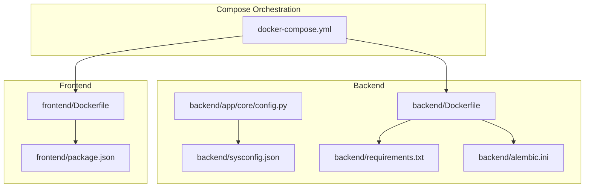
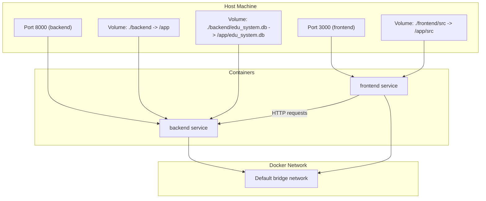
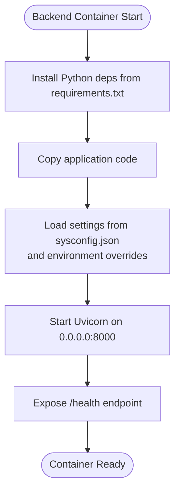
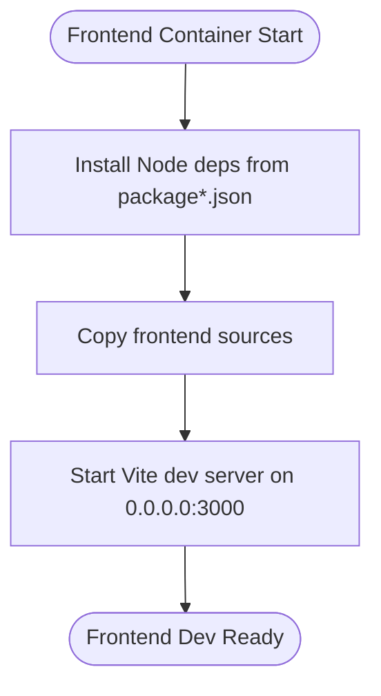
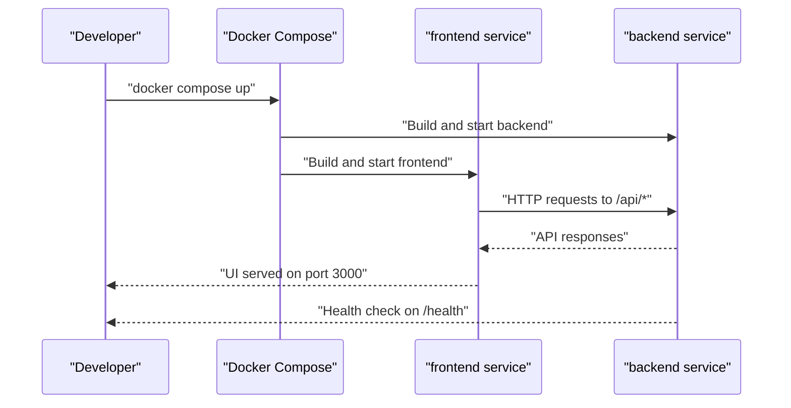
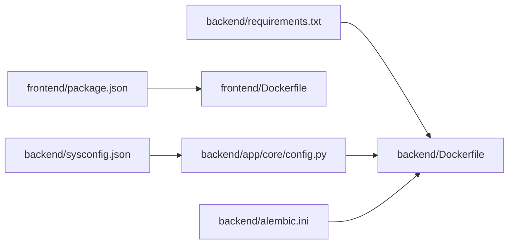

# Docker Configuration

<cite>
**Referenced Files in This Document**
- [docker-compose.yml](file://docker-compose.yml)
- [backend/Dockerfile](file://backend/Dockerfile)
- [frontend/Dockerfile](file://frontend/Dockerfile)
- [backend/app/core/config.py](file://backend/app/core/config.py)
- [backend/app/main.py](file://backend/app/main.py)
- [backend/sysconfig.json](file://backend/sysconfig.json)
- [backend/requirements.txt](file://backend/requirements.txt)
- [backend/alembic.ini](file://backend/alembic.ini)
- [frontend/package.json](file://frontend/package.json)
- [start.sh](file://start.sh)
</cite>

## Table of Contents
1. [Introduction](#introduction)
2. [Project Structure](#project-structure)
3. [Core Components](#core-components)
4. [Architecture Overview](#architecture-overview)
5. [Detailed Component Analysis](#detailed-component-analysis)
6. [Dependency Analysis](#dependency-analysis)
7. [Performance Considerations](#performance-considerations)
8. [Troubleshooting Guide](#troubleshooting-guide)
9. [Conclusion](#conclusion)
10. [Appendices](#appendices)

## Introduction
This document explains the Docker configuration for the education platform, covering container setup, image building, orchestration, networking, volumes, environment variables, and operational best practices. It also documents the backend and frontend Dockerfiles, build contexts, and how to customize configurations for different environments. Guidance on health checks, restart policies, resource limits, security, and troubleshooting is included.

## Project Structure
The repository provides:
- A Docker Compose file orchestrating two services: backend and frontend.
- Standalone Dockerfiles for backend and frontend applications.
- Backend configuration that reads from a JSON configuration file and supports environment overrides.
- A shell bootstrap script that demonstrates local development behavior and health checks.

**Diagram sources**
- [docker-compose.yml](file://docker-compose.yml)
- [backend/Dockerfile](file://backend/Dockerfile)
- [frontend/Dockerfile](file://frontend/Dockerfile)
- [backend/app/core/config.py](file://backend/app/core/config.py)
- [backend/sysconfig.json](file://backend/sysconfig.json)
- [backend/requirements.txt](file://backend/requirements.txt)
- [backend/alembic.ini](file://backend/alembic.ini)
- [frontend/package.json](file://frontend/package.json)

**Section sources**
- [docker-compose.yml](file://docker-compose.yml)
- [backend/Dockerfile](file://backend/Dockerfile)
- [frontend/Dockerfile](file://frontend/Dockerfile)
- [backend/app/core/config.py](file://backend/app/core/config.py)
- [backend/sysconfig.json](file://backend/sysconfig.json)
- [backend/requirements.txt](file://backend/requirements.txt)
- [backend/alembic.ini](file://backend/alembic.ini)
- [frontend/package.json](file://frontend/package.json)

## Core Components
- Docker Compose orchestration defines two services:
  - backend: Python FastAPI application built from ./backend with a Dockerfile, exposing port 8000, mounting backend code and a SQLite database file, and setting environment variables for secrets and database configuration.
  - frontend: Node.js Vite application built from ./frontend with a Dockerfile, exposing port 3000, mounting frontend source code, and depending on backend readiness.
- Backend configuration:
  - Reads database credentials from a JSON configuration file and supports environment variable overrides for sensitive values.
  - Provides a health endpoint for readiness checks.
- Frontend configuration:
  - Uses npm scripts for development and build, with a Dockerfile installing dependencies and copying sources.

Key runtime behaviors:
- Health checks are performed via a GET /health endpoint.
- The backend service is started with hot reload enabled in development mode.
- The frontend service runs in development mode with host binding.

**Section sources**
- [docker-compose.yml](file://docker-compose.yml)
- [backend/app/core/config.py](file://backend/app/core/config.py)
- [backend/app/main.py](file://backend/app/main.py)
- [backend/sysconfig.json](file://backend/sysconfig.json)
- [backend/Dockerfile](file://backend/Dockerfile)
- [frontend/Dockerfile](file://frontend/Dockerfile)

## Architecture Overview
The system uses Docker Compose to run backend and frontend containers. The backend exposes a FastAPI server and a health endpoint. The frontend serves the React/Vite UI and communicates with the backend API. Volume mounts enable live development for both services.

**Diagram sources**
- [docker-compose.yml](file://docker-compose.yml)
- [backend/app/main.py](file://backend/app/main.py)

## Detailed Component Analysis

### Backend Service
- Build context and Dockerfile:
  - Build context: ./backend
  - Dockerfile installs Python dependencies from requirements.txt and copies application code.
  - Default CMD starts Uvicorn with host binding to 0.0.0.0 and port 8000.
- Environment variables:
  - DATABASE_TYPE and SQLITE_DB_PATH are set in Compose for SQLite usage.
  - SECRET_KEY, ALGORITHM, ACCESS_TOKEN_EXPIRE_MINUTES, and REFRESH_TOKEN_EXPIRE_DAYS are configured for JWT behavior.
  - The backend reads database credentials from sysconfig.json and supports environment overrides for sensitive values.
- Health endpoint:
  - A GET /health endpoint returns a simple health status.
- Alembic configuration:
  - Alembic uses a SQLite URL by default in development; can be adapted for PostgreSQL in production.

**Diagram sources**
- [backend/Dockerfile](file://backend/Dockerfile)
- [backend/requirements.txt](file://backend/requirements.txt)
- [backend/app/core/config.py](file://backend/app/core/config.py)
- [backend/app/main.py](file://backend/app/main.py)
- [backend/alembic.ini](file://backend/alembic.ini)

**Section sources**
- [docker-compose.yml](file://docker-compose.yml)
- [backend/Dockerfile](file://backend/Dockerfile)
- [backend/requirements.txt](file://backend/requirements.txt)
- [backend/app/core/config.py](file://backend/app/core/config.py)
- [backend/app/main.py](file://backend/app/main.py)
- [backend/alembic.ini](file://backend/alembic.ini)

### Frontend Service
- Build context and Dockerfile:
  - Build context: ./frontend
  - Dockerfile installs Node dependencies and copies sources.
  - Default CMD runs the development server bound to 0.0.0.0.
- Development workflow:
  - Port 3000 is exposed for the Vite dev server.
  - Frontend depends on backend being reachable for API calls.
- Package scripts:
  - Development, build, lint, and preview scripts are defined in package.json.

**Diagram sources**
- [frontend/Dockerfile](file://frontend/Dockerfile)
- [frontend/package.json](file://frontend/package.json)

**Section sources**
- [docker-compose.yml](file://docker-compose.yml)
- [frontend/Dockerfile](file://frontend/Dockerfile)
- [frontend/package.json](file://frontend/package.json)

### Compose Orchestration
- Services:
  - backend: Builds from ./backend, maps port 8000, mounts backend code and SQLite database file, sets environment variables for secrets and database type/path, and runs Uvicorn with hot reload.
  - frontend: Builds from ./frontend, maps port 3000, mounts frontend source code, depends_on backend, and runs npm run dev with host binding.
- Networking:
  - Both services share the default Docker bridge network; the frontend can reach the backend using service names.
- Volumes:
  - Live code sync for both backend and frontend.
  - Persistent SQLite database file mounted at a fixed path inside the backend container.

**Diagram sources**
- [docker-compose.yml](file://docker-compose.yml)
- [backend/app/main.py](file://backend/app/main.py)

**Section sources**
- [docker-compose.yml](file://docker-compose.yml)

## Dependency Analysis
- Backend dependencies are declared in requirements.txt and installed in the backend Dockerfile.
- Frontend dependencies are declared in package.json and installed in the frontend Dockerfile.
- Backend configuration supports environment overrides for secrets and database connection details.
- Alembic configuration defaults to SQLite for development but can be adapted for PostgreSQL.

**Diagram sources**
- [backend/requirements.txt](file://backend/requirements.txt)
- [frontend/package.json](file://frontend/package.json)
- [backend/app/core/config.py](file://backend/app/core/config.py)
- [backend/sysconfig.json](file://backend/sysconfig.json)
- [backend/alembic.ini](file://backend/alembic.ini)
- [backend/Dockerfile](file://backend/Dockerfile)
- [frontend/Dockerfile](file://frontend/Dockerfile)

**Section sources**
- [backend/requirements.txt](file://backend/requirements.txt)
- [frontend/package.json](file://frontend/package.json)
- [backend/app/core/config.py](file://backend/app/core/config.py)
- [backend/sysconfig.json](file://backend/sysconfig.json)
- [backend/alembic.ini](file://backend/alembic.ini)
- [backend/Dockerfile](file://backend/Dockerfile)
- [frontend/Dockerfile](file://frontend/Dockerfile)

## Performance Considerations
- Multi-stage builds:
  - Consider adding a multi-stage Dockerfile for both backend and frontend to reduce image size and attack surface. Example stages: builder, runtime.
- Dependency caching:
  - Pin dependency versions and reorder COPY instructions to leverage Docker layer caching.
- Resource limits:
  - Add memory and CPU limits in Compose for production deployments.
- Health checks:
  - Use Compose healthcheck directives to monitor backend readiness and auto-restart unhealthy containers.
- Restart policies:
  - Set restart policies in Compose for resilience in production.
- Database choice:
  - Alembic defaults to SQLite for development; switch to PostgreSQL in production and configure environment variables accordingly.

[No sources needed since this section provides general guidance]

## Troubleshooting Guide
Common issues and resolutions:
- Backend not reachable on port 8000:
  - Verify the backend container is running and listening on 0.0.0.0:8000.
  - Confirm the health endpoint responds to GET /health.
- Frontend fails to load or shows blank page:
  - Ensure the frontend container is running and port 3000 is mapped.
  - Confirm the backend is reachable from the frontend container.
- Database connectivity:
  - For SQLite, ensure the database file path exists inside the container.
  - For PostgreSQL, verify environment variables for host, port, database, user, and password.
- Alembic migrations:
  - If migrations fail, confirm the database URL and permissions.
- Hot reload and live sync:
  - Confirm volume mounts for backend and frontend code are correct.

Operational references:
- Health endpoint path and method are defined in the backend application.
- Compose commands and service dependencies are defined in the orchestration file.

**Section sources**
- [docker-compose.yml](file://docker-compose.yml)
- [backend/app/main.py](file://backend/app/main.py)

## Conclusion
The repository provides a straightforward Docker-based development setup with separate backend and frontend services. The backend Dockerfile installs dependencies and runs Uvicorn, while the frontend Dockerfile installs Node dependencies and runs the Vite dev server. Compose orchestrates both services, mounts code and database files, and exposes ports for local development. For production, consider multi-stage builds, health checks, restart policies, resource limits, and switching from SQLite to PostgreSQL.

[No sources needed since this section summarizes without analyzing specific files]

## Appendices

### Environment Variables Reference
- Backend service environment variables:
  - DATABASE_TYPE: Selects database type (e.g., sqlite).
  - SQLITE_DB_PATH: Path to the SQLite database file inside the container.
  - SECRET_KEY: Secret key for JWT signing.
  - ALGORITHM: JWT algorithm.
  - ACCESS_TOKEN_EXPIRE_MINUTES: Access token expiration in minutes.
  - REFRESH_TOKEN_EXPIRE_DAYS: Refresh token expiration in days.
  - Additional backend settings include database host, port, user, password, Redis, Celery, upload directories, OCR, model cache, and host/port.

- Frontend service environment variables:
  - Not explicitly defined in Compose; pass via environment block if needed.

**Section sources**
- [docker-compose.yml](file://docker-compose.yml)
- [backend/app/core/config.py](file://backend/app/core/config.py)
- [backend/sysconfig.json](file://backend/sysconfig.json)

### Customizing for Different Environments
- Development:
  - Use SQLite with the provided alembic configuration and mount the database file.
  - Keep hot reload enabled for both backend and frontend.
- Staging/Production:
  - Switch to PostgreSQL by updating environment variables and Alembic configuration.
  - Add healthchecks, restart policies, and resource limits in Compose.
  - Implement multi-stage Dockerfiles to optimize images.

[No sources needed since this section provides general guidance]

### Security Considerations
- Secrets management:
  - Override sensitive values via environment variables rather than hardcoding in images.
- Network exposure:
  - Bind to 0.0.0.0 only in development; restrict in production.
- Image hardening:
  - Use non-root users, minimal base images, and remove unnecessary packages after installation.
- CORS:
  - Limit allowed origins in production.

[No sources needed since this section provides general guidance]