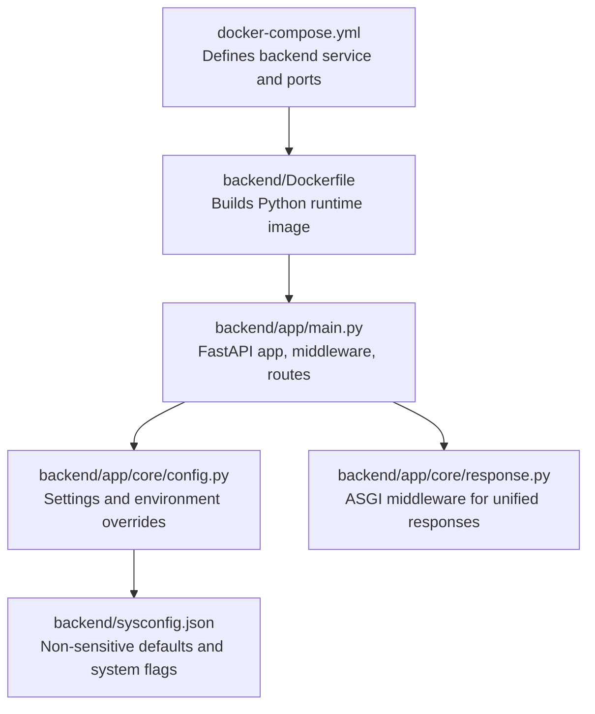
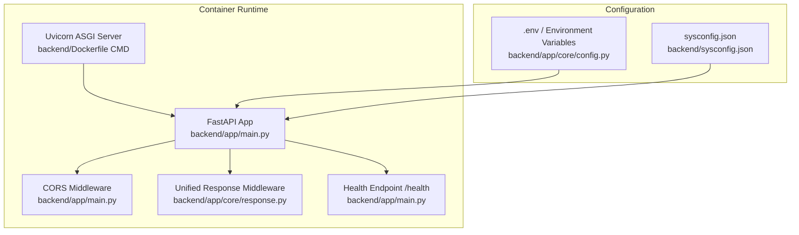
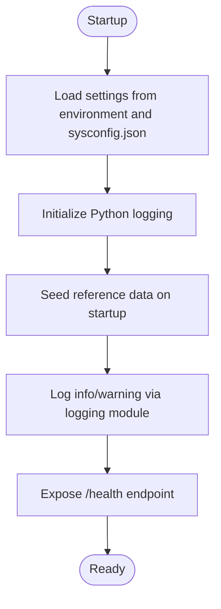
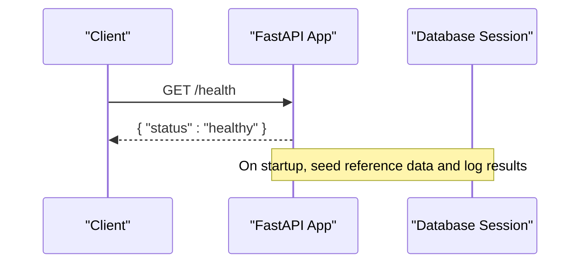
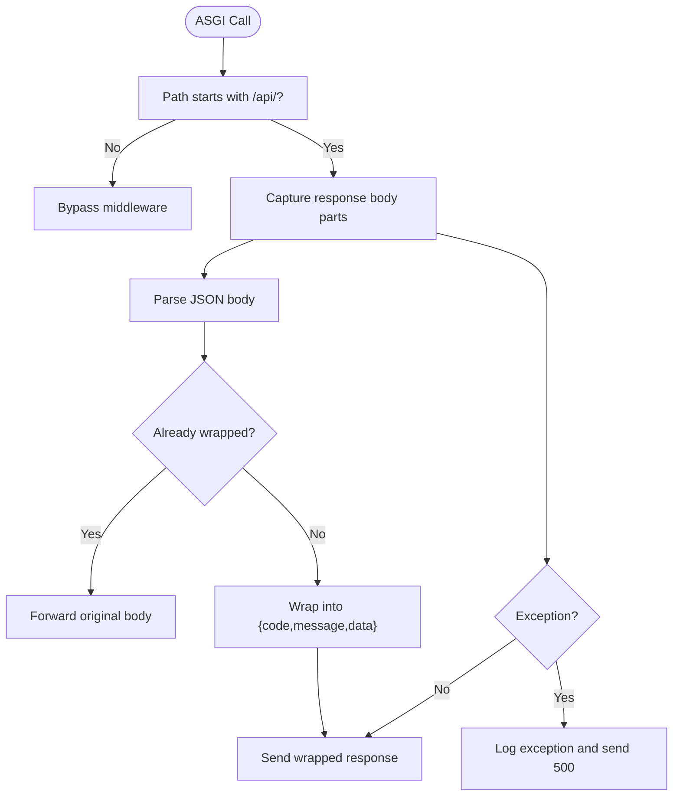
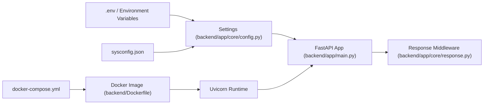

# Monitoring & Logging

<cite>
**Referenced Files in This Document**
- [backend/app/main.py](file://backend/app/main.py)
- [backend/app/core/config.py](file://backend/app/core/config.py)
- [backend/app/core/response.py](file://backend/app/core/response.py)
- [backend/sysconfig.json](file://backend/sysconfig.json)
- [docker-compose.yml](file://docker-compose.yml)
- [backend/Dockerfile](file://backend/Dockerfile)
- [backend/requirements.txt](file://backend/requirements.txt)
</cite>

## Table of Contents
1. [Introduction](#introduction)
2. [Project Structure](#project-structure)
3. [Core Components](#core-components)
4. [Architecture Overview](#architecture-overview)
5. [Detailed Component Analysis](#detailed-component-analysis)
6. [Dependency Analysis](#dependency-analysis)
7. [Performance Considerations](#performance-considerations)
8. [Troubleshooting Guide](#troubleshooting-guide)
9. [Conclusion](#conclusion)
10. [Appendices](#appendices)

## Introduction
This document provides comprehensive monitoring and logging guidance for the backend service. It covers logging configuration, log levels, structured logging formats, health checks, performance metrics, alerting mechanisms, centralized log aggregation, log rotation and retention, distributed tracing, correlation IDs, request tracking, integration with monitoring tools, and operational troubleshooting workflows. The backend is a FastAPI application configured via environment variables and a system configuration file, with a SQLite development setup managed by Docker Compose.

## Project Structure
The backend service is organized around a FastAPI application with modular components:
- Application entrypoint and lifecycle events
- Configuration management
- Middleware for unified API responses
- Health check endpoint
- Containerization and orchestration

**Diagram sources**
- [docker-compose.yml:1-33](file://docker-compose.yml#L1-L33)
- [backend/Dockerfile:1-11](file://backend/Dockerfile#L1-L11)
- [backend/app/main.py:1-52](file://backend/app/main.py#L1-L52)
- [backend/app/core/config.py:1-98](file://backend/app/core/config.py#L1-L98)
- [backend/app/core/response.py:1-124](file://backend/app/core/response.py#L1-L124)
- [backend/sysconfig.json:1-48](file://backend/sysconfig.json#L1-L48)

**Section sources**
- [docker-compose.yml:1-33](file://docker-compose.yml#L1-L33)
- [backend/Dockerfile:1-11](file://backend/Dockerfile#L1-L11)
- [backend/app/main.py:1-52](file://backend/app/main.py#L1-L52)
- [backend/app/core/config.py:1-98](file://backend/app/core/config.py#L1-L98)
- [backend/app/core/response.py:1-124](file://backend/app/core/response.py#L1-L124)
- [backend/sysconfig.json:1-48](file://backend/sysconfig.json#L1-L48)

## Core Components
- Logging and health checks
  - The application exposes a health endpoint and uses Python’s logging module for operational messages during startup and seeding.
  - Reference: [backend/app/main.py:33-52](file://backend/app/main.py#L33-L52)
- Configuration and environment overrides
  - Settings are loaded from environment variables and a system configuration file, including database credentials and host/port.
  - Reference: [backend/app/core/config.py:36-98](file://backend/app/core/config.py#L36-L98)
- Unified API response middleware
  - An ASGI middleware wraps all API responses into a standardized structure and logs exceptions.
  - Reference: [backend/app/core/response.py:14-124](file://backend/app/core/response.py#L14-L124)
- System configuration
  - Non-sensitive defaults and flags are stored in a JSON file, including logging level and backup enablement.
  - Reference: [backend/sysconfig.json:44-47](file://backend/sysconfig.json#L44-L47)

**Section sources**
- [backend/app/main.py:33-52](file://backend/app/main.py#L33-L52)
- [backend/app/core/config.py:36-98](file://backend/app/core/config.py#L36-L98)
- [backend/app/core/response.py:14-124](file://backend/app/core/response.py#L14-L124)
- [backend/sysconfig.json:44-47](file://backend/sysconfig.json#L44-L47)

## Architecture Overview
The backend service runs inside a containerized environment. The FastAPI application initializes middleware and routes, and the Docker Compose configuration defines port mappings and environment variables for development.

**Diagram sources**
- [backend/Dockerfile:10-10](file://backend/Dockerfile#L10-L10)
- [backend/app/main.py:11-31](file://backend/app/main.py#L11-L31)
- [backend/app/core/response.py:14-28](file://backend/app/core/response.py#L14-L28)
- [backend/app/core/config.py:91-98](file://backend/app/core/config.py#L91-L98)
- [backend/sysconfig.json:1-48](file://backend/sysconfig.json#L1-L48)

**Section sources**
- [backend/Dockerfile:10-10](file://backend/Dockerfile#L10-L10)
- [backend/app/main.py:11-31](file://backend/app/main.py#L11-L31)
- [backend/app/core/response.py:14-28](file://backend/app/core/response.py#L14-L28)
- [backend/app/core/config.py:91-98](file://backend/app/core/config.py#L91-L98)
- [backend/sysconfig.json:1-48](file://backend/sysconfig.json#L1-L48)

## Detailed Component Analysis

### Logging Configuration and Log Levels
- Python logging usage
  - The application uses Python’s logging module for informational and warning messages during startup and seeding.
  - Reference: [backend/app/main.py:35-42](file://backend/app/main.py#L35-L42)
- Structured logging format
  - The unified response middleware logs exceptions and unexpected errors with exception traces.
  - Reference: [backend/app/core/response.py:84-94](file://backend/app/core/response.py#L84-L94)
- Log levels and system flags
  - The system configuration file includes a log level flag suitable for development environments.
  - Reference: [backend/sysconfig.json:44-47](file://backend/sysconfig.json#L44-L47)
- Environment-driven configuration
  - Sensitive and environment-specific settings are loaded from environment variables, enabling log level tuning via environment variables.
  - Reference: [backend/app/core/config.py:91-98](file://backend/app/core/config.py#L91-L98)

**Diagram sources**
- [backend/app/main.py:33-52](file://backend/app/main.py#L33-L52)
- [backend/app/core/config.py:91-98](file://backend/app/core/config.py#L91-L98)
- [backend/sysconfig.json:44-47](file://backend/sysconfig.json#L44-L47)

**Section sources**
- [backend/app/main.py:33-52](file://backend/app/main.py#L33-L52)
- [backend/app/core/response.py:84-94](file://backend/app/core/response.py#L84-L94)
- [backend/app/core/config.py:91-98](file://backend/app/core/config.py#L91-L98)
- [backend/sysconfig.json:44-47](file://backend/sysconfig.json#L44-L47)

### Health Checks and Readiness
- Health endpoint
  - The application exposes a simple health check returning a status payload.
  - Reference: [backend/app/main.py:50-52](file://backend/app/main.py#L50-L52)
- Startup readiness
  - On startup, the application attempts to seed reference data and logs outcomes.
  - Reference: [backend/app/main.py:33-42](file://backend/app/main.py#L33-L42)

**Diagram sources**
- [backend/app/main.py:33-52](file://backend/app/main.py#L33-L52)

**Section sources**
- [backend/app/main.py:33-52](file://backend/app/main.py#L33-L52)

### Unified API Response Middleware
- Purpose
  - Wraps all API responses into a standardized structure and handles exceptions gracefully while logging errors.
- Key behaviors
  - Detects JSON responses, avoids rewrapping already wrapped responses, and logs exceptions.
  - Reference: [backend/app/core/response.py:14-124](file://backend/app/core/response.py#L14-L124)

**Diagram sources**
- [backend/app/core/response.py:20-101](file://backend/app/core/response.py#L20-L101)

**Section sources**
- [backend/app/core/response.py:14-124](file://backend/app/core/response.py#L14-L124)

### Distributed Tracing and Correlation IDs
- Current state
  - No explicit tracing library or correlation ID propagation is present in the codebase.
- Recommended approach
  - Integrate OpenTelemetry SDK for automatic tracing and inject correlation IDs via request headers or context managers.
  - Propagate trace identifiers across service boundaries and correlate logs with trace IDs.
  - Reference: [backend/app/main.py:1-52](file://backend/app/main.py#L1-L52), [backend/app/core/response.py:1-124](file://backend/app/core/response.py#L1-L124)

[No sources needed since this section provides general guidance]

### Metrics Collection and Alerting
- Current state
  - No built-in metrics exporter or Prometheus instrumentation is present.
- Recommended approach
  - Add Prometheus metrics endpoint and instrument key endpoints and background tasks.
  - Define alerting rules for latency, error rates, and saturation metrics.
  - Reference: [backend/app/main.py:1-52](file://backend/app/main.py#L1-L52), [backend/requirements.txt:1-27](file://backend/requirements.txt#L1-L27)

[No sources needed since this section provides general guidance]

### Centralized Log Aggregation, Rotation, and Retention
- Current state
  - No centralized log collector or rotation configuration is present.
- Recommended approach
  - Ship logs to a central collector (e.g., Fluent Bit/Fluentd, Logstash) and configure rotation and retention policies.
  - Use container logging drivers and external log stores for long-term retention.
  - Reference: [docker-compose.yml:1-33](file://docker-compose.yml#L1-L33), [backend/Dockerfile:1-11](file://backend/Dockerfile#L1-L11)

[No sources needed since this section provides general guidance]

### Monitoring Dashboards and Metric Endpoints
- Current state
  - No dashboards or metrics endpoints are defined.
- Recommended approach
  - Expose metrics via a dedicated endpoint and visualize with Grafana dashboards for throughput, latency, error rates, and resource utilization.
  - Reference: [backend/app/main.py:1-52](file://backend/app/main.py#L1-L52), [backend/requirements.txt:1-27](file://backend/requirements.txt#L1-L27)

[No sources needed since this section provides general guidance]

### Integration with Monitoring Tools
- Prometheus
  - Instrument endpoints and background tasks; expose metrics and scrape via Prometheus.
- Grafana
  - Build dashboards for API performance, database queries, OCR/grading throughput, and error trends.
- ELK Stack
  - Stream application logs to Elasticsearch/Logstash and visualize via Kibana.
  - Reference: [docker-compose.yml:1-33](file://docker-compose.yml#L1-L33), [backend/Dockerfile:1-11](file://backend/Dockerfile#L1-L11)

[No sources needed since this section provides general guidance]

## Dependency Analysis
The backend service relies on environment variables and a system configuration file to load settings. The Docker Compose configuration defines runtime environment and port mappings.

**Diagram sources**
- [backend/app/core/config.py:91-98](file://backend/app/core/config.py#L91-L98)
- [backend/sysconfig.json:1-48](file://backend/sysconfig.json#L1-L48)
- [backend/app/main.py:1-52](file://backend/app/main.py#L1-L52)
- [backend/app/core/response.py:1-124](file://backend/app/core/response.py#L1-L124)
- [docker-compose.yml:1-33](file://docker-compose.yml#L1-L33)
- [backend/Dockerfile:1-11](file://backend/Dockerfile#L1-L11)

**Section sources**
- [backend/app/core/config.py:91-98](file://backend/app/core/config.py#L91-L98)
- [backend/sysconfig.json:1-48](file://backend/sysconfig.json#L1-L48)
- [backend/app/main.py:1-52](file://backend/app/main.py#L1-L52)
- [backend/app/core/response.py:1-124](file://backend/app/core/response.py#L1-L124)
- [docker-compose.yml:1-33](file://docker-compose.yml#L1-L33)
- [backend/Dockerfile:1-11](file://backend/Dockerfile#L1-L11)

## Performance Considerations
- Logging overhead
  - Prefer asynchronous logging and structured logging to minimize I/O impact.
- Middleware efficiency
  - Keep middleware lightweight; the current response wrapper is ASGI-based and avoids unnecessary JSON parsing.
- Resource limits
  - Configure container CPU/memory limits and health checks to prevent resource exhaustion.
- Database and OCR/grading concurrency
  - Tune concurrency settings exposed in the system configuration to balance throughput and stability.
  - Reference: [backend/sysconfig.json:31-39](file://backend/sysconfig.json#L31-L39)

[No sources needed since this section provides general guidance]

## Troubleshooting Guide
- Verify health status
  - Call the health endpoint to confirm service availability.
  - Reference: [backend/app/main.py:50-52](file://backend/app/main.py#L50-L52)
- Inspect startup logs
  - Review INFO/WARNING logs emitted during seeding and initialization.
  - Reference: [backend/app/main.py:35-42](file://backend/app/main.py#L35-L42)
- Diagnose API response issues
  - Use the unified response middleware behavior to identify malformed responses or unhandled exceptions.
  - Reference: [backend/app/core/response.py:84-101](file://backend/app/core/response.py#L84-L101)
- Adjust logging verbosity
  - Set appropriate log levels via environment variables and review the system configuration flag.
  - Reference: [backend/app/core/config.py:91-98](file://backend/app/core/config.py#L91-L98), [backend/sysconfig.json:44-47](file://backend/sysconfig.json#L44-L47)
- Container runtime checks
  - Confirm port mappings and environment variable injection via Docker Compose.
  - Reference: [docker-compose.yml:13-20](file://docker-compose.yml#L13-L20), [backend/Dockerfile:10-10](file://backend/Dockerfile#L10-L10)

**Section sources**
- [backend/app/main.py:35-52](file://backend/app/main.py#L35-L52)
- [backend/app/core/response.py:84-101](file://backend/app/core/response.py#L84-L101)
- [backend/app/core/config.py:91-98](file://backend/app/core/config.py#L91-L98)
- [backend/sysconfig.json:44-47](file://backend/sysconfig.json#L44-L47)
- [docker-compose.yml:13-20](file://docker-compose.yml#L13-L20)
- [backend/Dockerfile:10-10](file://backend/Dockerfile#L10-L10)

## Conclusion
The backend currently provides a health endpoint, basic logging, and a unified response wrapper. To achieve comprehensive observability, integrate Prometheus metrics, OpenTelemetry tracing, centralized log aggregation, and operational dashboards. Align logging levels with environment variables and the system configuration file, and establish rotation and retention policies for logs. Use the health endpoint and structured logs to troubleshoot issues and drive capacity planning.

[No sources needed since this section summarizes without analyzing specific files]

## Appendices
- Example environment variables to tune logging and runtime behavior
  - Reference: [backend/app/core/config.py:91-98](file://backend/app/core/config.py#L91-L98)
- Development runtime configuration
  - Reference: [docker-compose.yml:1-33](file://docker-compose.yml#L1-L33), [backend/Dockerfile:1-11](file://backend/Dockerfile#L1-L11)

[No sources needed since this section provides general guidance]