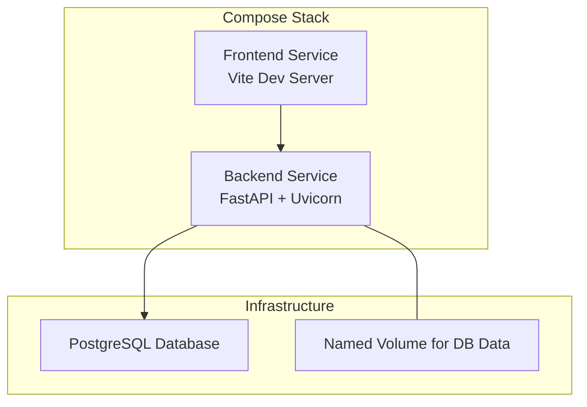
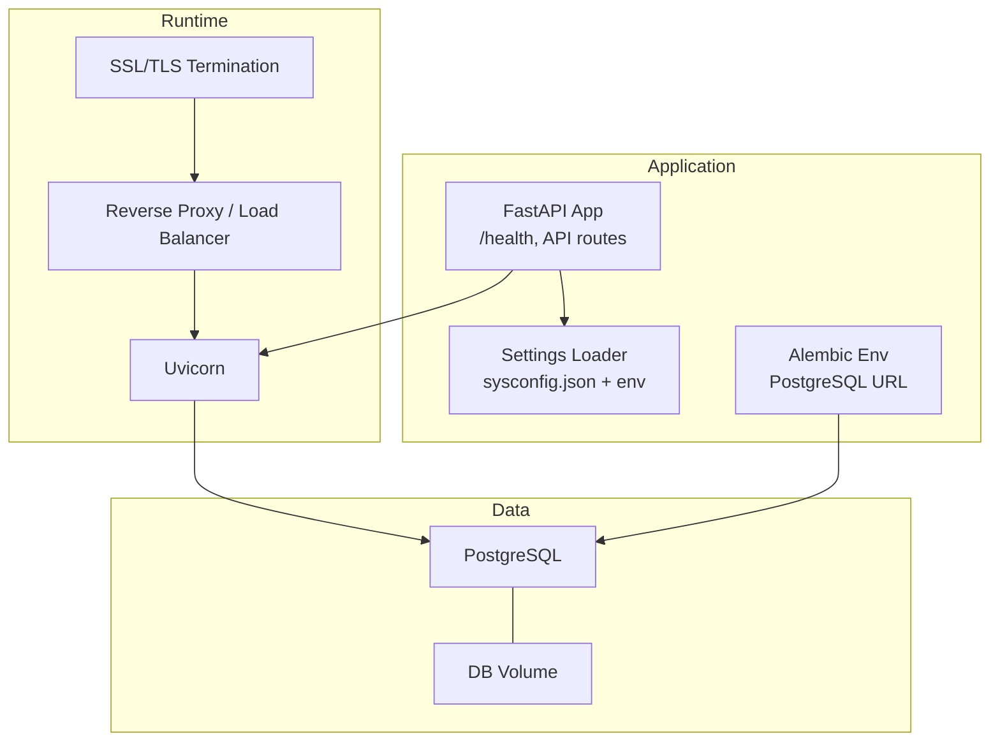
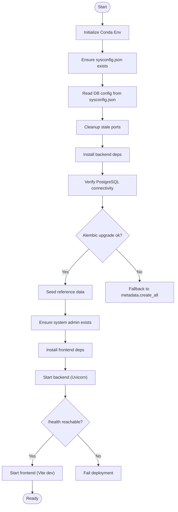
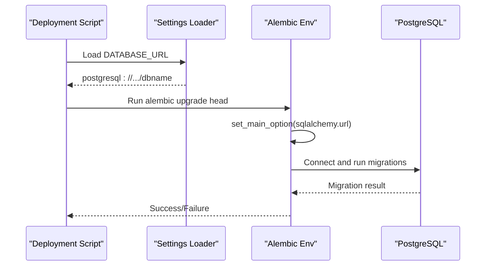
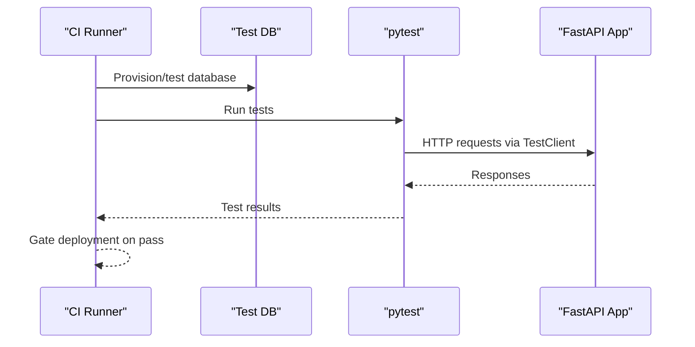
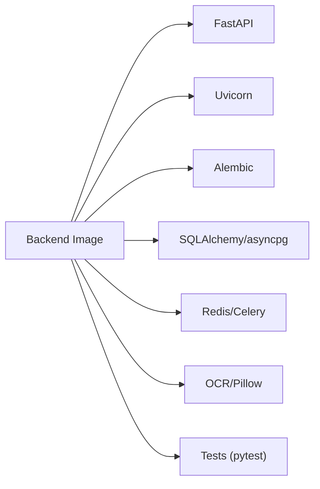

# Production Deployment

<cite>
**Referenced Files in This Document**
- [docker-compose.yml](file://docker-compose.yml)
- [start.sh](file://start.sh)
- [backend/Dockerfile](file://backend/Dockerfile)
- [frontend/Dockerfile](file://frontend/Dockerfile)
- [backend/alembic.ini](file://backend/alembic.ini)
- [backend/alembic/env.py](file://backend/alembic/env.py)
- [backend/alembic/versions/001_v22_initial.py](file://backend/alembic/versions/001_v22_initial.py)
- [backend/app/core/config.py](file://backend/app/core/config.py)
- [backend/sysconfig.json](file://backend/sysconfig.json)
- [backend/requirements.txt](file://backend/requirements.txt)
- [backend/app/main.py](file://backend/app/main.py)
- [backend/tests/smoke_test.py](file://backend/tests/smoke_test.py)
</cite>

## Table of Contents
1. [Introduction](#introduction)
2. [Project Structure](#project-structure)
3. [Core Components](#core-components)
4. [Architecture Overview](#architecture-overview)
5. [Detailed Component Analysis](#detailed-component-analysis)
6. [Dependency Analysis](#dependency-analysis)
7. [Performance Considerations](#performance-considerations)
8. [Troubleshooting Guide](#troubleshooting-guide)
9. [Conclusion](#conclusion)
10. [Appendices](#appendices)

## Introduction
This document provides a complete production deployment guide for the education platform. It covers the deployment pipeline, environment preparation, step-by-step deployment workflow, database migration using Alembic, production configuration and secrets management, CI/CD integration, automated testing, rollback strategies, load balancing, SSL/TLS and reverse proxy setup, and operational runbooks for system administrators.

## Project Structure
The project consists of:
- Backend service built with FastAPI and Uvicorn, packaged in a container image
- Frontend built with Vite/React, packaged in a container image
- Database migrations managed by Alembic
- A development orchestration file for local runs
- A production-like deployment script for environment preparation and service startup

**Diagram sources**
- [docker-compose.yml:3-32](file://docker-compose.yml#L3-L32)

**Section sources**
- [docker-compose.yml:1-33](file://docker-compose.yml#L1-L33)

## Core Components
- Backend service: exposes REST APIs, health checks, and serves as the primary application entrypoint
- Frontend service: development server for UI
- Database: PostgreSQL configured via environment variables and Alembic migrations
- Configuration: centralized via sysconfig.json and environment overrides
- Migrations: Alembic-managed schema evolution

Key runtime behaviors:
- Health endpoint for readiness/liveness checks
- Alembic upgrades to latest head during startup
- Seed data initialization on startup
- CORS enabled for development; should be restricted in production

**Section sources**
- [backend/app/main.py:11-52](file://backend/app/main.py#L11-L52)
- [backend/app/core/config.py:36-98](file://backend/app/core/config.py#L36-L98)
- [backend/sysconfig.json:1-48](file://backend/sysconfig.json#L1-L48)

## Architecture Overview
The production-ready deployment uses containers for backend and frontend, with PostgreSQL as the persistent datastore. Alembic manages schema evolution. The deployment script automates environment preparation, database migration, seeding, and service startup.

**Diagram sources**
- [backend/app/main.py:11-52](file://backend/app/main.py#L11-L52)
- [backend/app/core/config.py:36-98](file://backend/app/core/config.py#L36-L98)
- [backend/alembic/env.py:15-20](file://backend/alembic/env.py#L15-L20)

## Detailed Component Analysis

### Deployment Script Execution and Environment Preparation
The script performs:
- Conda environment setup and dependency installation
- PostgreSQL connectivity verification and database creation
- Alembic migration execution or fallback table creation
- Reference data seeding and system admin account creation
- Frontend dependency installation
- Backend and frontend service startup with health checks

**Diagram sources**
- [start.sh:63-359](file://start.sh#L63-L359)

Operational highlights:
- Database configuration is loaded from sysconfig.json with environment overrides for secrets
- Alembic uses the real PostgreSQL URL derived from settings
- Health checks ensure services are ready before proceeding

**Section sources**
- [start.sh:26-44](file://start.sh#L26-L44)
- [start.sh:187-217](file://start.sh#L187-L217)
- [start.sh:275-332](file://start.sh#L275-L332)
- [backend/app/core/config.py:6-30](file://backend/app/core/config.py#L6-L30)
- [backend/alembic/env.py:15-20](file://backend/alembic/env.py#L15-L20)

### Database Migration with Alembic
- Alembic configuration points to PostgreSQL via DATABASE_URL
- env.py overrides sqlalchemy.url to use the production database URL
- Migrations are applied automatically during deployment
- Downgrade removes tables in reverse dependency order

**Diagram sources**
- [start.sh:198-217](file://start.sh#L198-L217)
- [backend/alembic/env.py:15-20](file://backend/alembic/env.py#L15-L20)
- [backend/alembic/env.py:63-80](file://backend/alembic/env.py#L63-L80)
- [backend/alembic/versions/001_v22_initial.py:10-426](file://backend/alembic/versions/001_v22_initial.py#L10-L426)

Rollback and version management:
- Use downgrade in reverse order to revert schema changes
- Maintain migration files in alembic/versions

**Section sources**
- [backend/alembic.ini:86-90](file://backend/alembic.ini#L86-L90)
- [backend/alembic/env.py:15-20](file://backend/alembic/env.py#L15-L20)
- [backend/alembic/versions/001_v22_initial.py:417-426](file://backend/alembic/versions/001_v22_initial.py#L417-L426)

### Production Environment Configuration and Secrets Management
- Non-sensitive configuration is stored in sysconfig.json
- Secrets are overridden via environment variables:
  - SECRET_KEY
  - DATABASE_PASSWORD
  - DEEPSEEK_API_KEY (when using DeepSeek)
- Settings loader prefers environment variables for sensitive values

Recommended production overrides:
- DATABASE_TYPE=postgresql
- POSTGRES_SERVER, POSTGRES_PORT, POSTGRES_DB, POSTGRES_USER, DATABASE_PASSWORD
- SECRET_KEY (strong, random)
- REDIS_HOST/PORT/PASSWORD if used
- UPLOAD_DIR and MAX_UPLOAD_SIZE as needed

**Section sources**
- [backend/sysconfig.json:1-48](file://backend/sysconfig.json#L1-L48)
- [backend/app/core/config.py:6-30](file://backend/app/core/config.py#L6-L30)
- [backend/app/core/config.py:42-98](file://backend/app/core/config.py#L42-L98)

### CI/CD Pipeline Integration and Automated Testing
- Local smoke tests validate core API paths and JWT flows
- Integrate pytest in CI to run tests against a provisioned database
- Gate deployments on passing tests and successful migrations

**Diagram sources**
- [backend/tests/smoke_test.py:1-172](file://backend/tests/smoke_test.py#L1-L172)
- [backend/requirements.txt:24-27](file://backend/requirements.txt#L24-L27)

### Load Balancing, SSL/TLS, and Reverse Proxy Setup
- Deploy multiple backend instances behind a reverse proxy/load balancer
- Terminate TLS at the reverse proxy; configure HTTPS listeners and certificates
- Route frontend static assets via the same reverse proxy or CDN
- Ensure health checks target the /health endpoint

[No sources needed since this section provides general guidance]

### Deployment Checklist
Pre-deployment:
- Confirm PostgreSQL availability and credentials
- Set environment variables for secrets and overrides
- Prepare sysconfig.json with non-sensitive settings
- Build images or pull artifacts
- Provision persistent volumes for PostgreSQL

Deployment:
- Stop old instances gracefully
- Apply migrations using Alembic
- Seed reference data and ensure admin accounts
- Start backend and frontend
- Verify /health and basic API responses

Post-deployment:
- Run smoke tests in staging-like environment
- Monitor logs and metrics
- Validate database schema version
- Perform manual smoke checks

[No sources needed since this section provides general guidance]

### Operational Runbooks
- Startup: use the deployment script to initialize environment, migrate, seed, and start services
- Health monitoring: probe /health endpoint
- Database maintenance: use Alembic for schema changes; keep backups
- Rollback: downgrade migrations and restart services
- Scaling: deploy multiple backend replicas behind a load balancer

**Section sources**
- [start.sh:198-217](file://start.sh#L198-L217)
- [backend/app/main.py:50-52](file://backend/app/main.py#L50-L52)

## Dependency Analysis
Runtime dependencies include FastAPI, Uvicorn, SQLAlchemy, Alembic, asyncpg, bcrypt, redis/celery, and OCR libraries. The deployment script ensures these are installed and PostgreSQL is reachable.

**Diagram sources**
- [backend/requirements.txt:1-27](file://backend/requirements.txt#L1-L27)

**Section sources**
- [backend/requirements.txt:1-27](file://backend/requirements.txt#L1-L27)

## Performance Considerations
- Use production-grade ASGI server and worker processes for backend scaling
- Tune PostgreSQL connection pooling and queries
- Enable compression and caching at the reverse proxy
- Monitor CPU, memory, and I/O under realistic load

[No sources needed since this section provides general guidance]

## Troubleshooting Guide
Common issues and resolutions:
- PostgreSQL connection failures: verify host, port, user, and password; ensure database exists
- Alembic upgrade errors: inspect migration logs; consider downgrade and re-apply
- Health check timeouts: confirm backend started successfully and listens on configured host/port
- Missing frontend dependencies: reinstall node_modules and rebuild

**Section sources**
- [start.sh:187-196](file://start.sh#L187-L196)
- [start.sh:198-217](file://start.sh#L198-L217)
- [start.sh:288-303](file://start.sh#L288-L303)
- [start.sh:266-273](file://start.sh#L266-L273)

## Conclusion
This guide outlines a repeatable, test-driven production deployment for the education platform. By leveraging Alembic for schema management, environment-based secrets, and a scripted startup routine, teams can reliably deploy, validate, and operate the system at scale.

[No sources needed since this section summarizes without analyzing specific files]

## Appendices

### Example Deployment Commands
- Initialize environment and start services:
  - [start.sh:1-359](file://start.sh#L1-L359)
- Build backend image:
  - [backend/Dockerfile:1-11](file://backend/Dockerfile#L1-L11)
- Build frontend image:
  - [frontend/Dockerfile:1-11](file://frontend/Dockerfile#L1-L11)
- Run smoke tests:
  - [backend/tests/smoke_test.py:1-172](file://backend/tests/smoke_test.py#L1-L172)

### Configuration Templates
- sysconfig.json (non-sensitive settings):
  - [backend/sysconfig.json:1-48](file://backend/sysconfig.json#L1-L48)
- Alembic configuration:
  - [backend/alembic.ini:86-90](file://backend/alembic.ini#L86-L90)
- Alembic environment:
  - [backend/alembic/env.py:15-20](file://backend/alembic/env.py#L15-L20)

### Post-Deployment Verification
- Health check:
  - [backend/app/main.py:50-52](file://backend/app/main.py#L50-L52)
- Alembic version:
  - [backend/alembic/env.py:63-80](file://backend/alembic/env.py#L63-L80)