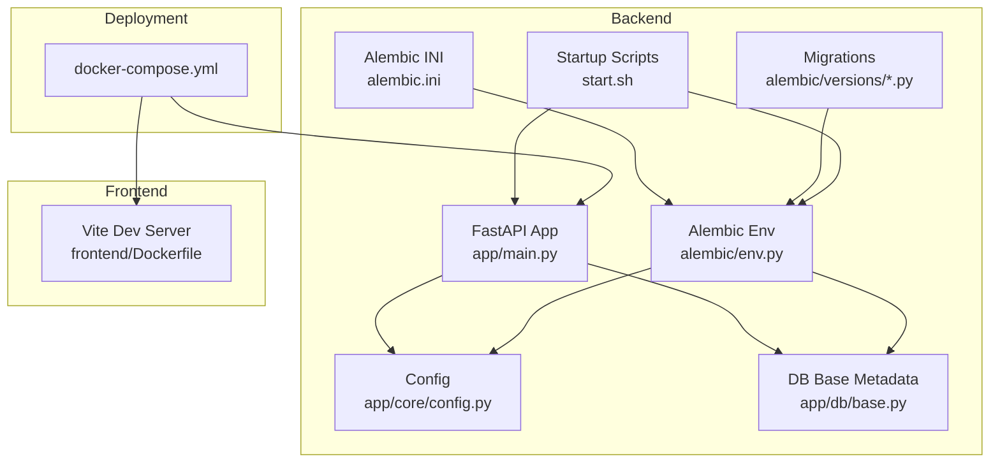
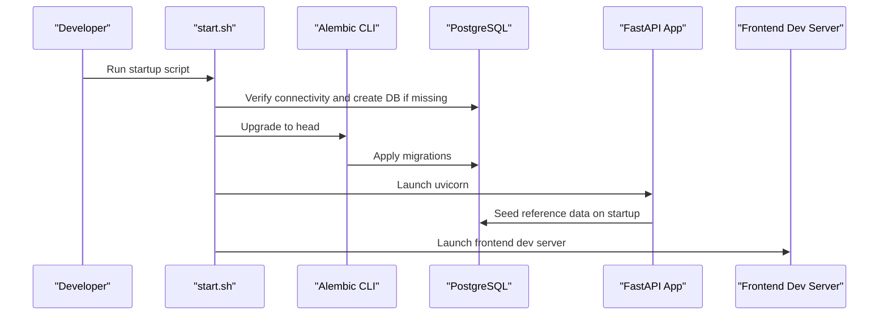
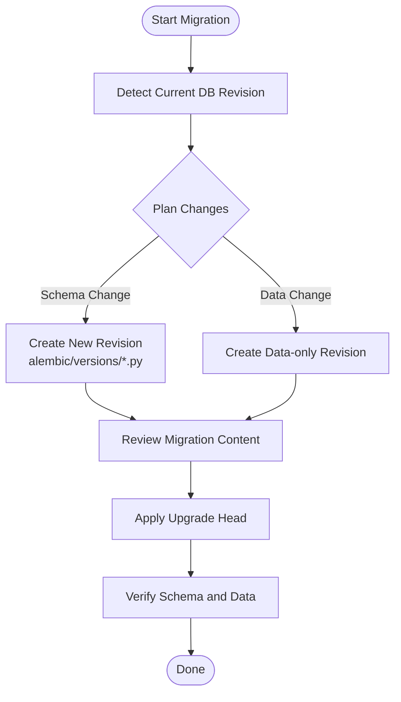
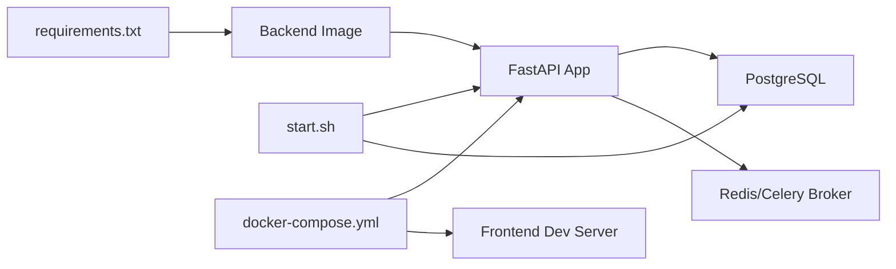

# System Maintenance

<cite>
**Referenced Files in This Document**
- [alembic.ini](file://backend/alembic.ini)
- [env.py](file://backend/alembic/env.py)
- [001_v22_initial.py](file://backend/alembic/versions/001_v22_initial.py)
- [002_add_provinces_table.py](file://backend/alembic/versions/002_add_provinces_table.py)
- [base.py](file://backend/app/db/base.py)
- [config.py](file://backend/app/core/config.py)
- [main.py](file://backend/app/main.py)
- [requirements.txt](file://backend/requirements.txt)
- [Dockerfile](file://backend/Dockerfile)
- [docker-compose.yml](file://docker-compose.yml)
- [start.sh](file://start.sh)
- [sysconfig.json](file://backend/sysconfig.json)
- [seed_reference.py](file://backend/app/seed_reference.py)
</cite>

## Table of Contents
1. [Introduction](#introduction)
2. [Project Structure](#project-structure)
3. [Core Components](#core-components)
4. [Architecture Overview](#architecture-overview)
5. [Detailed Component Analysis](#detailed-component-analysis)
6. [Dependency Analysis](#dependency-analysis)
7. [Performance Considerations](#performance-considerations)
8. [Troubleshooting Guide](#troubleshooting-guide)
9. [Conclusion](#conclusion)
10. [Appendices](#appendices)

## Introduction
This document provides comprehensive system maintenance procedures for the education platform, focusing on database migrations, updates, backups, and routine maintenance. It explains the Alembic-based migration strategy, backup and recovery procedures for databases and configuration data, update processes for backend and frontend components, and operational tasks such as log cleanup, database optimization, and performance tuning. It also covers security patches, dependency updates, vulnerability management, maintenance schedules, change management, and incident response protocols.

## Project Structure
The system consists of:
- Backend service built with FastAPI and SQLAlchemy, using Alembic for database migrations.
- Frontend service built with Vite/React.
- Shared configuration via sysconfig.json and environment variables.
- Dockerized deployment with docker-compose for local development.

**Diagram sources**
- [main.py:1-52](file://backend/app/main.py#L1-L52)
- [config.py:1-98](file://backend/app/core/config.py#L1-L98)
- [base.py:1-21](file://backend/app/db/base.py#L1-L21)
- [env.py:1-80](file://backend/alembic/env.py#L1-L80)
- [alembic.ini:1-150](file://backend/alembic.ini#L1-L150)
- [docker-compose.yml:1-33](file://docker-compose.yml#L1-L33)
- [Dockerfile:1-11](file://backend/Dockerfile#L1-L11)
- [start.sh:1-359](file://start.sh#L1-L359)

**Section sources**
- [docker-compose.yml:1-33](file://docker-compose.yml#L1-L33)
- [Dockerfile:1-11](file://backend/Dockerfile#L1-L11)
- [start.sh:1-359](file://start.sh#L1-L359)

## Core Components
- Database configuration and connection strings are derived from sysconfig.json and environment variables.
- Alembic manages schema migrations and is configured via alembic.ini and env.py.
- Startup script orchestrates dependency checks, database migrations, seeding, and service startup.
- Dockerfiles define container images for backend and frontend.

Key responsibilities:
- Configuration loading and DATABASE_URL construction.
- Migration environment setup and online/offline modes.
- Health endpoint and startup seeding.

**Section sources**
- [config.py:36-98](file://backend/app/core/config.py#L36-L98)
- [alembic.ini:86-90](file://backend/alembic.ini#L86-L90)
- [env.py:15-21](file://backend/alembic/env.py#L15-L21)
- [main.py:33-52](file://backend/app/main.py#L33-L52)
- [start.sh:198-217](file://start.sh#L198-L217)

## Architecture Overview
The backend uses asynchronous SQLAlchemy with Alembic for schema evolution. The startup script ensures the database is migrated and seeded before launching the API server. docker-compose runs both backend and frontend services locally.

**Diagram sources**
- [start.sh:187-217](file://start.sh#L187-L217)
- [env.py:63-80](file://backend/alembic/env.py#L63-L80)
- [main.py:33-43](file://backend/app/main.py#L33-L43)
- [docker-compose.yml:22-32](file://docker-compose.yml#L22-L32)

## Detailed Component Analysis

### Database Migration Strategy with Alembic
- Alembic configuration is centralized in alembic.ini, including logging and hooks.
- The env.py script loads the SQLAlchemy metadata from app.db.base and overrides the database URL from settings.
- Migration files reside under alembic/versions and are applied incrementally.
- The startup script runs Alembic upgrade head automatically during local setup.

Operational steps:
- Creating a new migration:
  - Use Alembic’s autogenerate or write a new revision file in alembic/versions.
  - Ensure the env.py target metadata includes all models.
- Applying migrations:
  - From the backend directory, run the Alembic upgrade command to head.
  - The startup script demonstrates this process.
- Maintaining migration history:
  - Keep migrations linear and deterministic.
  - Avoid editing applied revisions; create new revisions for schema changes.

**Diagram sources**
- [alembic.ini:1-150](file://backend/alembic.ini#L1-L150)
- [env.py:15-31](file://backend/alembic/env.py#L15-L31)
- [001_v22_initial.py:10-426](file://backend/alembic/versions/001_v22_initial.py#L10-L426)
- [002_add_provinces_table.py:11-42](file://backend/alembic/versions/002_add_provinces_table.py#L11-L42)
- [start.sh:198-217](file://start.sh#L198-L217)

**Section sources**
- [alembic.ini:86-108](file://backend/alembic.ini#L86-L108)
- [env.py:15-31](file://backend/alembic/env.py#L15-L31)
- [001_v22_initial.py:10-426](file://backend/alembic/versions/001_v22_initial.py#L10-L426)
- [002_add_provinces_table.py:11-42](file://backend/alembic/versions/002_add_provinces_table.py#L11-L42)
- [start.sh:198-217](file://start.sh#L198-L217)

### Backup and Recovery Procedures
Current configuration and deployment:
- Database URL is constructed from sysconfig.json and environment variables.
- docker-compose mounts a local SQLite file path for development, but the Alembic env.py switches to PostgreSQL in production contexts.
- No dedicated backup scripts are included in the repository.

Recommended backup and recovery actions:
- Database:
  - For PostgreSQL, use logical backups (e.g., pg_dump) and store offsite.
  - For SQLite (development), copy the mounted database file.
  - Automate periodic backups and retention policies.
- Configuration data:
  - Back up sysconfig.json and any environment-specific JSON files.
- File storage:
  - Back up the upload directory configured in settings (default ./uploads).
- Recovery:
  - Restore database from the latest successful backup.
  - Recreate application state by re-running migrations and seeding.
  - Validate service health endpoints after restoration.

Verification procedure:
- After restore, run Alembic upgrade head to ensure schema alignment.
- Confirm health endpoint availability and basic API responses.

**Section sources**
- [config.py:55-80](file://backend/app/core/config.py#L55-L80)
- [docker-compose.yml:10-15](file://docker-compose.yml#L10-L15)
- [sysconfig.json:1-48](file://backend/sysconfig.json#L1-L48)

### Update Procedures: Backend and Frontend
Backend:
- Build a new image using the backend Dockerfile.
- Update dependencies via requirements.txt.
- Run Alembic upgrade head to apply schema changes.
- Restart backend service and verify health endpoint.

Frontend:
- Rebuild frontend image using the frontend Dockerfile.
- Install dependencies if needed.
- Restart frontend service and verify UI availability.

Zero-downtime deployment (conceptual):
- Use blue/green or rolling updates with load balancer switching.
- Ensure migrations are backward-compatible or staged carefully.
- Validate new version via health checks before switching traffic.

Rollback process (conceptual):
- Roll back to previous backend image tag.
- Downgrade database schema using Alembic downgrade to the prior revision.
- Switch traffic back to the stable version.

**Section sources**
- [Dockerfile:1-11](file://backend/Dockerfile#L1-L11)
- [requirements.txt:1-27](file://backend/requirements.txt#L1-L27)
- [docker-compose.yml:4-32](file://docker-compose.yml#L4-L32)

### Routine Maintenance Tasks
- Log cleanup:
  - Configure application logging levels and rotation via environment variables.
  - Remove or compress old logs periodically.
- Database optimization:
  - Analyze and vacuum/analyze tables regularly.
  - Monitor slow queries and add appropriate indexes.
- Performance tuning:
  - Adjust connection pooling and worker counts.
  - Tune PostgreSQL parameters and query plans.

Security and dependency updates:
- Pin dependency versions and monitor advisories.
- Regularly update packages and rebuild containers.
- Scan images for vulnerabilities and remediate.

Change management:
- Document all changes, approvals, and rollback plans.
- Use feature flags or staged rollouts for risky changes.

Incident response:
- Define escalation paths and communication channels.
- Maintain runbooks for common incidents (database outages, API errors).
- Conduct post-mortems and update procedures accordingly.

[No sources needed since this section provides general guidance]

### Maintenance Schedule and Change Management
- Daily:
  - Monitor health endpoints and logs.
  - Verify backups are recent and restorable.
- Weekly:
  - Review dependency updates and security advisories.
  - Perform database maintenance tasks (vacuum/analyze).
- Monthly:
  - Disaster recovery drills and backup verification.
  - Full system update and rollout testing.

Change management:
- Require approvals for schema changes and major releases.
- Use feature branches and pull requests.
- Maintain a changelog and release notes.

Incident response:
- Define RTO/RPO targets.
- Assign roles (on-call, responders, communicators).
- Document and share runbooks.

[No sources needed since this section provides general guidance]

## Dependency Analysis
The backend relies on FastAPI, SQLAlchemy, Alembic, and PostgreSQL. The startup script coordinates dependency installation, database connectivity, migrations, and service startup. docker-compose defines service dependencies and ports.

**Diagram sources**
- [requirements.txt:1-27](file://backend/requirements.txt#L1-L27)
- [start.sh:171-185](file://start.sh#L171-L185)
- [docker-compose.yml:1-33](file://docker-compose.yml#L1-L33)

**Section sources**
- [requirements.txt:1-27](file://backend/requirements.txt#L1-L27)
- [start.sh:171-185](file://start.sh#L171-L185)
- [docker-compose.yml:1-33](file://docker-compose.yml#L1-L33)

## Performance Considerations
- Database:
  - Use connection pooling and async drivers.
  - Monitor slow queries and add indexes on frequently filtered columns.
- Application:
  - Scale workers and optimize API response sizes.
  - Enable compression and caching where appropriate.
- Infrastructure:
  - Ensure adequate CPU/memory and disk I/O for PostgreSQL and Redis.

[No sources needed since this section provides general guidance]

## Troubleshooting Guide
Common issues and resolutions:
- Database connection failures:
  - Verify sysconfig.json and environment variables.
  - Ensure PostgreSQL is running and reachable.
- Migration errors:
  - Check Alembic logs and fix conflicting revisions.
  - Re-run upgrade head after resolving conflicts.
- Service startup timeouts:
  - Confirm health endpoint responds and dependencies are ready.
- Frontend build issues:
  - Install dependencies and rebuild the frontend image.

Validation steps:
- Use the health endpoint to confirm service readiness.
- Test critical API endpoints after updates.

**Section sources**
- [config.py:55-61](file://backend/app/core/config.py#L55-L61)
- [start.sh:288-303](file://start.sh#L288-L303)
- [docker-compose.yml:22-32](file://docker-compose.yml#L22-L32)

## Conclusion
This maintenance guide consolidates database migrations, backups, updates, and routine tasks for the education platform. By following Alembic-driven schema management, automating backups, validating deployments, and implementing robust change and incident management processes, the system can maintain reliability and continuity.

[No sources needed since this section summarizes without analyzing specific files]

## Appendices

### Appendix A: Example Commands and Paths
- Alembic upgrade head:
  - Path: [start.sh](file://start.sh#L201)
- Alembic configuration:
  - Path: [alembic.ini:86-90](file://backend/alembic.ini#L86-L90)
- Environment override for database URL:
  - Path: [env.py:15-21](file://backend/alembic/env.py#L15-L21)
- Database URL construction:
  - Path: [config.py:55-61](file://backend/app/core/config.py#L55-L61)
- Startup seeding:
  - Path: [main.py:33-43](file://backend/app/main.py#L33-L43), [seed_reference.py](file://backend/app/seed_reference.py)
- Container builds:
  - Backend: [Dockerfile:1-11](file://backend/Dockerfile#L1-L11)
  - Frontend: [Dockerfile:1-11](file://frontend/Dockerfile#L1-L11)
- Local orchestration:
  - Path: [docker-compose.yml:1-33](file://docker-compose.yml#L1-L33)

[No sources needed since this appendix lists existing paths without analysis]