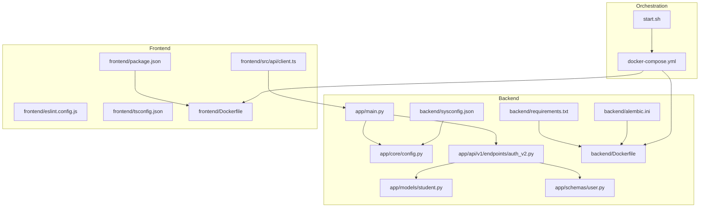
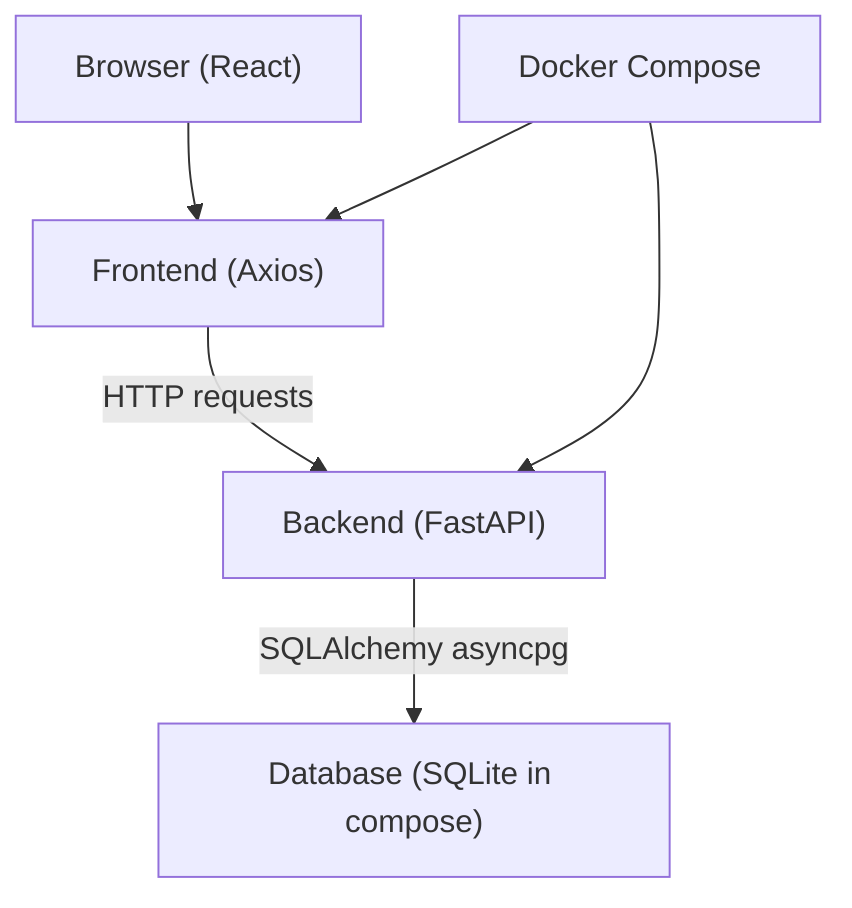
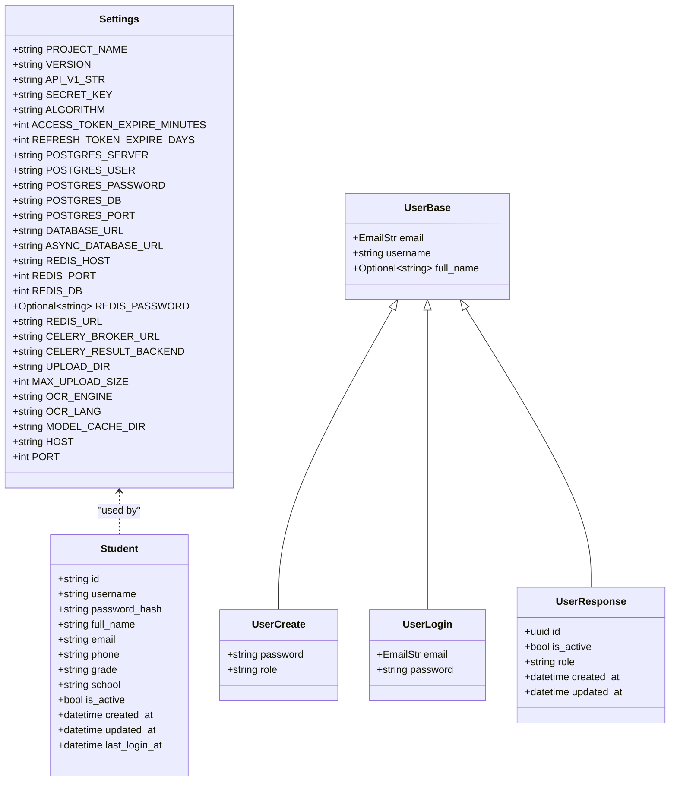
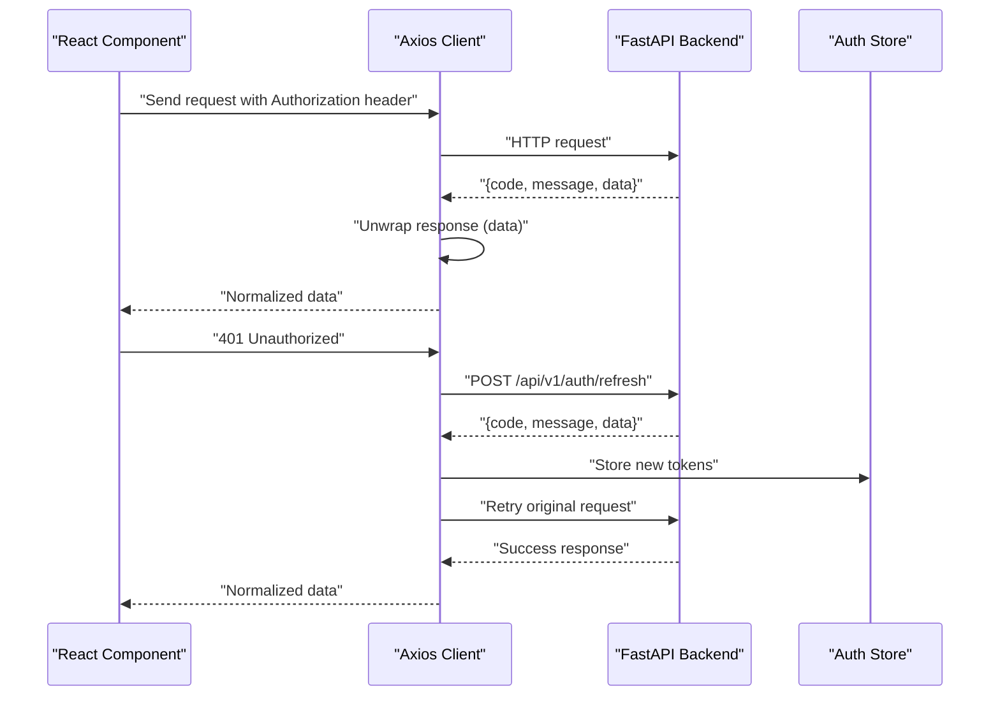
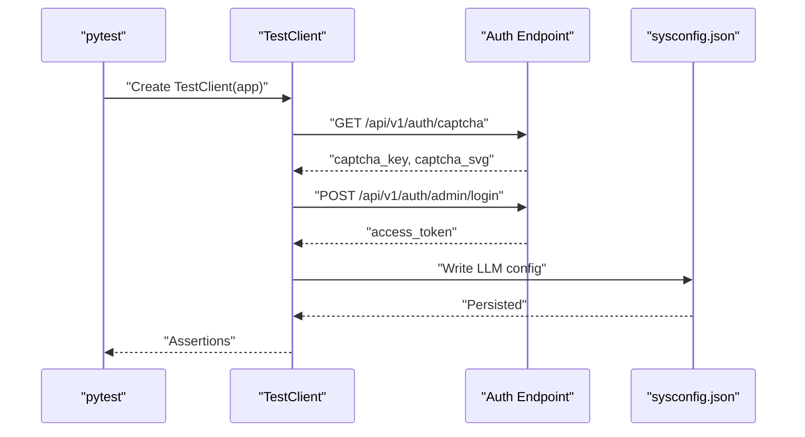
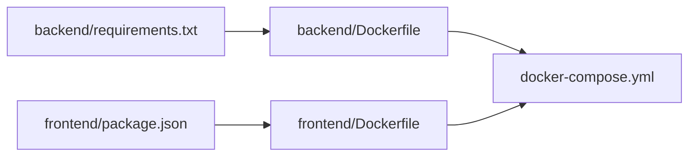

# Development Guidelines

<cite>
**Referenced Files in This Document**
- [backend/requirements.txt](file://backend/requirements.txt)
- [frontend/package.json](file://frontend/package.json)
- [backend/Dockerfile](file://backend/Dockerfile)
- [frontend/Dockerfile](file://frontend/Dockerfile)
- [docker-compose.yml](file://docker-compose.yml)
- [start.sh](file://start.sh)
- [backend/app/main.py](file://backend/app/main.py)
- [backend/app/core/config.py](file://backend/app/core/config.py)
- [backend/alembic.ini](file://backend/alembic.ini)
- [backend/sysconfig.json](file://backend/sysconfig.json)
- [backend/app/api/v1/endpoints/auth_v2.py](file://backend/app/api/v1/endpoints/auth_v2.py)
- [backend/app/models/student.py](file://backend/app/models/student.py)
- [backend/app/schemas/user.py](file://backend/app/schemas/user.py)
- [frontend/src/api/client.ts](file://frontend/src/api/client.ts)
- [backend/tests/test_llm.py](file://backend/tests/test_llm.py)
- [backend/tests/smoke_test.py](file://backend/tests/smoke_test.py)
- [frontend/eslint.config.js](file://frontend/eslint.config.js)
- [frontend/tsconfig.json](file://frontend/tsconfig.json)
</cite>

## Table of Contents
1. [Introduction](#introduction)
2. [Project Structure](#project-structure)
3. [Core Components](#core-components)
4. [Architecture Overview](#architecture-overview)
5. [Detailed Component Analysis](#detailed-component-analysis)
6. [Dependency Analysis](#dependency-analysis)
7. [Performance Considerations](#performance-considerations)
8. [Troubleshooting Guide](#troubleshooting-guide)
9. [Conclusion](#conclusion)
10. [Appendices](#appendices)

## Introduction
This document provides comprehensive development guidelines for the project, covering code standards, development workflows, team collaboration practices, and operational procedures. It documents Python (FastAPI, SQLAlchemy) and TypeScript (React) conventions, Git workflow, branching and pull request procedures, code review guidelines, testing requirements, documentation standards, development environment setup, IDE configuration, debugging procedures, continuous integration practices, automated quality checks, and deployment validation. Examples of code formatting, commit message standards, and collaborative development best practices are included to ensure consistency across the team.

## Project Structure
The project is organized into a backend service (Python/FastAPI), a frontend application (TypeScript/React), shared configuration and documentation, and orchestration via Docker Compose. The backend exposes a REST API with unified response wrapping, while the frontend consumes the API with Axios interceptors and manages authentication state.

**Diagram sources**
- [backend/app/main.py:1-52](file://backend/app/main.py#L1-L52)
- [backend/app/core/config.py:1-98](file://backend/app/core/config.py#L1-L98)
- [backend/app/api/v1/endpoints/auth_v2.py:1-476](file://backend/app/api/v1/endpoints/auth_v2.py#L1-L476)
- [backend/app/models/student.py:1-23](file://backend/app/models/student.py#L1-L23)
- [backend/app/schemas/user.py:1-37](file://backend/app/schemas/user.py#L1-L37)
- [backend/requirements.txt:1-27](file://backend/requirements.txt#L1-L27)
- [backend/Dockerfile:1-11](file://backend/Dockerfile#L1-L11)
- [backend/alembic.ini:1-150](file://backend/alembic.ini#L1-L150)
- [backend/sysconfig.json:1-48](file://backend/sysconfig.json#L1-L48)
- [frontend/src/api/client.ts:1-55](file://frontend/src/api/client.ts#L1-L55)
- [frontend/package.json:1-38](file://frontend/package.json#L1-L38)
- [frontend/eslint.config.js:1-23](file://frontend/eslint.config.js#L1-L23)
- [frontend/tsconfig.json:1-8](file://frontend/tsconfig.json#L1-L8)
- [frontend/Dockerfile:1-11](file://frontend/Dockerfile#L1-L11)
- [docker-compose.yml:1-33](file://docker-compose.yml#L1-L33)
- [start.sh:1-359](file://start.sh#L1-L359)

**Section sources**
- [docker-compose.yml:1-33](file://docker-compose.yml#L1-L33)
- [start.sh:1-359](file://start.sh#L1-L359)
- [backend/Dockerfile:1-11](file://backend/Dockerfile#L1-L11)
- [frontend/Dockerfile:1-11](file://frontend/Dockerfile#L1-L11)

## Core Components
- Backend API server built with FastAPI, including unified response wrapper and CORS middleware.
- Configuration management using Pydantic settings with environment overrides and sysconfig.json.
- Asynchronous SQLAlchemy ORM models and schemas validated with Pydantic.
- Frontend client using Axios with request/response interceptors for token injection and response unwrapping.
- Automated quality hooks for Alembic migrations (black and ruff).
- Testing suite with smoke tests and LLM provider tests using TestClient.

Key implementation references:
- API bootstrap and middleware: [backend/app/main.py:1-52](file://backend/app/main.py#L1-L52)
- Settings and environment configuration: [backend/app/core/config.py:1-98](file://backend/app/core/config.py#L1-L98)
- Alembic hooks for formatting and linting: [backend/alembic.ini:98-114](file://backend/alembic.ini#L98-L114)
- Frontend API client and interceptors: [frontend/src/api/client.ts:1-55](file://frontend/src/api/client.ts#L1-L55)
- Example authentication endpoints: [backend/app/api/v1/endpoints/auth_v2.py:1-476](file://backend/app/api/v1/endpoints/auth_v2.py#L1-L476)
- Example model and schema: [backend/app/models/student.py:1-23](file://backend/app/models/student.py#L1-L23), [backend/app/schemas/user.py:1-37](file://backend/app/schemas/user.py#L1-L37)
- Tests: [backend/tests/smoke_test.py:1-172](file://backend/tests/smoke_test.py#L1-L172), [backend/tests/test_llm.py:1-23](file://backend/tests/test_llm.py#L1-L23)

**Section sources**
- [backend/app/main.py:1-52](file://backend/app/main.py#L1-L52)
- [backend/app/core/config.py:1-98](file://backend/app/core/config.py#L1-L98)
- [backend/alembic.ini:98-114](file://backend/alembic.ini#L98-L114)
- [frontend/src/api/client.ts:1-55](file://frontend/src/api/client.ts#L1-L55)
- [backend/app/api/v1/endpoints/auth_v2.py:1-476](file://backend/app/api/v1/endpoints/auth_v2.py#L1-L476)
- [backend/app/models/student.py:1-23](file://backend/app/models/student.py#L1-L23)
- [backend/app/schemas/user.py:1-37](file://backend/app/schemas/user.py#L1-L37)
- [backend/tests/smoke_test.py:1-172](file://backend/tests/smoke_test.py#L1-L172)
- [backend/tests/test_llm.py:1-23](file://backend/tests/test_llm.py#L1-L23)

## Architecture Overview
The system consists of a FastAPI backend exposing REST endpoints, an asynchronous SQLAlchemy ORM layer, and a React frontend consuming the API via Axios. Docker Compose orchestrates backend and frontend containers, mounting source directories for hot reload and sharing a SQLite database file for development.

**Diagram sources**
- [docker-compose.yml:1-33](file://docker-compose.yml#L1-L33)
- [frontend/src/api/client.ts:1-55](file://frontend/src/api/client.ts#L1-L55)
- [backend/app/main.py:1-52](file://backend/app/main.py#L1-L52)
- [backend/app/core/config.py:56-61](file://backend/app/core/config.py#L56-L61)

**Section sources**
- [docker-compose.yml:1-33](file://docker-compose.yml#L1-L33)
- [frontend/src/api/client.ts:1-55](file://frontend/src/api/client.ts#L1-L55)
- [backend/app/main.py:1-52](file://backend/app/main.py#L1-L52)
- [backend/app/core/config.py:56-61](file://backend/app/core/config.py#L56-L61)

## Detailed Component Analysis

### Backend API Standards (FastAPI, SQLAlchemy)
- Use unified response wrapper middleware to standardize API responses across all endpoints.
- Define Pydantic models for request/response schemas and enforce validation.
- Use async SQLAlchemy sessions for database operations and ensure proper transaction handling.
- Centralize configuration via Pydantic settings with environment variable overrides and sysconfig.json for non-sensitive defaults.
- Apply CORS middleware with allow-all for development; restrict origins in production.

References:
- Middleware and router setup: [backend/app/main.py:11-30](file://backend/app/main.py#L11-L30)
- Settings and environment overrides: [backend/app/core/config.py:36-97](file://backend/app/core/config.py#L36-L97)
- Example authentication endpoints: [backend/app/api/v1/endpoints/auth_v2.py:25-71](file://backend/app/api/v1/endpoints/auth_v2.py#L25-L71)
- Model definition: [backend/app/models/student.py:8-23](file://backend/app/models/student.py#L8-L23)
- Schema definition: [backend/app/schemas/user.py:7-37](file://backend/app/schemas/user.py#L7-L37)

**Diagram sources**
- [backend/app/core/config.py:36-97](file://backend/app/core/config.py#L36-L97)
- [backend/app/models/student.py:8-23](file://backend/app/models/student.py#L8-L23)
- [backend/app/schemas/user.py:7-37](file://backend/app/schemas/user.py#L7-L37)

**Section sources**
- [backend/app/main.py:11-30](file://backend/app/main.py#L11-L30)
- [backend/app/core/config.py:36-97](file://backend/app/core/config.py#L36-L97)
- [backend/app/api/v1/endpoints/auth_v2.py:25-71](file://backend/app/api/v1/endpoints/auth_v2.py#L25-L71)
- [backend/app/models/student.py:8-23](file://backend/app/models/student.py#L8-L23)
- [backend/app/schemas/user.py:7-37](file://backend/app/schemas/user.py#L7-L37)

### Frontend Standards (React, TypeScript)
- Use Axios with interceptors to inject Authorization headers and unwrap backend responses.
- Manage tokens in localStorage and handle 401 responses by refreshing tokens or redirecting to login.
- Configure ESLint with TypeScript and React hooks/recommended plugins.
- Use tsconfig references for app and node configurations.

References:
- API client and interceptors: [frontend/src/api/client.ts:1-55](file://frontend/src/api/client.ts#L1-L55)
- Package scripts and dependencies: [frontend/package.json:6-11](file://frontend/package.json#L6-L11)
- ESLint configuration: [frontend/eslint.config.js:1-23](file://frontend/eslint.config.js#L1-L23)
- TypeScript configuration: [frontend/tsconfig.json:1-8](file://frontend/tsconfig.json#L1-L8)

**Diagram sources**
- [frontend/src/api/client.ts:9-52](file://frontend/src/api/client.ts#L9-L52)
- [backend/app/main.py:11-30](file://backend/app/main.py#L11-L30)

**Section sources**
- [frontend/src/api/client.ts:1-55](file://frontend/src/api/client.ts#L1-L55)
- [frontend/package.json:6-11](file://frontend/package.json#L6-L11)
- [frontend/eslint.config.js:1-23](file://frontend/eslint.config.js#L1-L23)
- [frontend/tsconfig.json:1-8](file://frontend/tsconfig.json#L1-L8)

### Database and Migrations (Alembic)
- Alembic is configured with hooks to automatically format and lint migration files.
- Development uses SQLite by default; production can target PostgreSQL via DATABASE_URL.
- Migration scripts are generated under alembic/versions and formatted via black and ruff.

References:
- Alembic hooks: [backend/alembic.ini:98-114](file://backend/alembic.ini#L98-L114)
- Database URL construction: [backend/app/core/config.py:56-61](file://backend/app/core/config.py#L56-L61)

```mermaid
flowchart TD
Start(["Run Alembic"]) --> Generate["Generate migration script"]
Generate --> Black["Format with black"]
Black --> Ruff["Lint and fix with ruff"]
Ruff --> Commit["Commit migration"]
Commit --> End(["Done"])
```

**Diagram sources**
- [backend/alembic.ini:98-114](file://backend/alembic.ini#L98-L114)

**Section sources**
- [backend/alembic.ini:98-114](file://backend/alembic.ini#L98-L114)
- [backend/app/core/config.py:56-61](file://backend/app/core/config.py#L56-L61)

### Testing Standards
- Use pytest with pytest-asyncio for async tests.
- Smoke tests validate core endpoints and flows end-to-end.
- LLM provider tests validate connectivity and configuration persistence.

References:
- Dependencies: [backend/requirements.txt:24-27](file://backend/requirements.txt#L24-L27)
- Smoke tests: [backend/tests/smoke_test.py:1-172](file://backend/tests/smoke_test.py#L1-L172)
- LLM tests: [backend/tests/test_llm.py:1-23](file://backend/tests/test_llm.py#L1-L23)

**Diagram sources**
- [backend/tests/test_llm.py:1-23](file://backend/tests/test_llm.py#L1-L23)
- [backend/app/api/v1/endpoints/auth_v2.py:75-183](file://backend/app/api/v1/endpoints/auth_v2.py#L75-L183)
- [backend/sysconfig.json:8-29](file://backend/sysconfig.json#L8-L29)

**Section sources**
- [backend/requirements.txt:24-27](file://backend/requirements.txt#L24-L27)
- [backend/tests/smoke_test.py:1-172](file://backend/tests/smoke_test.py#L1-L172)
- [backend/tests/test_llm.py:1-23](file://backend/tests/test_llm.py#L1-L23)

## Dependency Analysis
- Backend runtime dependencies are declared in requirements.txt and installed in a Python slim image.
- Frontend dependencies and devDependencies are declared in package.json, with ESLint and TypeScript tooling.
- Docker Compose builds images from respective Dockerfiles and mounts source directories for live development.

**Diagram sources**
- [backend/requirements.txt:1-27](file://backend/requirements.txt#L1-L27)
- [backend/Dockerfile:1-11](file://backend/Dockerfile#L1-L11)
- [frontend/package.json:1-38](file://frontend/package.json#L1-L38)
- [frontend/Dockerfile:1-11](file://frontend/Dockerfile#L1-L11)
- [docker-compose.yml:1-33](file://docker-compose.yml#L1-L33)

**Section sources**
- [backend/requirements.txt:1-27](file://backend/requirements.txt#L1-L27)
- [frontend/package.json:1-38](file://frontend/package.json#L1-L38)
- [backend/Dockerfile:1-11](file://backend/Dockerfile#L1-L11)
- [frontend/Dockerfile:1-11](file://frontend/Dockerfile#L1-L11)
- [docker-compose.yml:1-33](file://docker-compose.yml#L1-L33)

## Performance Considerations
- Prefer async database operations to avoid blocking the event loop.
- Minimize payload sizes by returning only necessary fields in responses.
- Use pagination for list endpoints to reduce memory overhead.
- Cache frequently accessed configuration values in memory where safe.
- Keep migrations small and incremental to reduce downtime during upgrades.

## Troubleshooting Guide
Common issues and resolutions:
- Backend fails to start: verify DATABASE_URL and credentials; check logs for startup exceptions.
- Frontend cannot connect: confirm backend health endpoint is reachable and CORS settings are correct.
- Database migration errors: run alembic upgrade/downgrade commands; inspect migration hooks for formatting/linting.
- Token expiration: implement automatic refresh via interceptors and handle 401 by redirecting to login.
- Port conflicts: use the provided start.sh script to clean ports before launching services.

References:
- Health endpoint: [backend/app/main.py:50-52](file://backend/app/main.py#L50-L52)
- Startup seeding: [backend/app/main.py:33-43](file://backend/app/main.py#L33-L43)
- Alembic hooks: [backend/alembic.ini:98-114](file://backend/alembic.ini#L98-L114)
- Frontend interceptors: [frontend/src/api/client.ts:17-52](file://frontend/src/api/client.ts#L17-L52)
- Port cleanup and service startup: [start.sh:159-332](file://start.sh#L159-L332)

**Section sources**
- [backend/app/main.py:33-52](file://backend/app/main.py#L33-L52)
- [backend/alembic.ini:98-114](file://backend/alembic.ini#L98-L114)
- [frontend/src/api/client.ts:17-52](file://frontend/src/api/client.ts#L17-L52)
- [start.sh:159-332](file://start.sh#L159-L332)

## Conclusion
These guidelines establish consistent standards for Python and TypeScript development, Git workflows, code review, testing, documentation, environment setup, debugging, CI practices, and deployment validation. Adhering to these practices ensures maintainable, secure, and scalable development across the team.

## Appendices

### Development Environment Setup
- Backend: Install dependencies from requirements.txt in a Python 3.12 environment; configure environment variables and sysconfig.json.
- Frontend: Install dependencies from package.json; run ESLint and build scripts as defined.
- Docker: Build and run services via docker-compose; mount source directories for hot reload.
- One-click launcher: Use start.sh to initialize Conda environment, install dependencies, run migrations, seed data, and launch backend and frontend.

References:
- Backend dependencies: [backend/requirements.txt:1-27](file://backend/requirements.txt#L1-L27)
- Frontend dependencies: [frontend/package.json:12-36](file://frontend/package.json#L12-L36)
- Docker Compose: [docker-compose.yml:1-33](file://docker-compose.yml#L1-L33)
- One-click launcher: [start.sh:63-332](file://start.sh#L63-L332)

**Section sources**
- [backend/requirements.txt:1-27](file://backend/requirements.txt#L1-L27)
- [frontend/package.json:12-36](file://frontend/package.json#L12-L36)
- [docker-compose.yml:1-33](file://docker-compose.yml#L1-L33)
- [start.sh:63-332](file://start.sh#L63-L332)

### IDE Configuration
- Python: Enable type checking and linting with pyright/mypy and ruff/black; configure virtual environment to match requirements.txt.
- TypeScript: Configure ESLint with recommended plugins and TypeScript parser; enable auto-fix on save.
- React: Enable React Hooks and React Refresh ESLint plugins; configure tsconfig references.

References:
- ESLint configuration: [frontend/eslint.config.js:1-23](file://frontend/eslint.config.js#L1-L23)
- TypeScript configuration: [frontend/tsconfig.json:1-8](file://frontend/tsconfig.json#L1-L8)

**Section sources**
- [frontend/eslint.config.js:1-23](file://frontend/eslint.config.js#L1-L23)
- [frontend/tsconfig.json:1-8](file://frontend/tsconfig.json#L1-L8)

### Git Workflow, Branching, and Pull Requests
- Branching strategy: feature branches from develop; release branches for releases; hotfix branches from main.
- Commit messages: use imperative mood; separate subject from body; reference issue numbers.
- Pull requests: include summary, rationale, testing performed, and screenshots if UI changes; assign reviewers; ensure CI passes.

[No sources needed since this section provides general guidance]

### Code Review Guidelines
- Focus on correctness, readability, maintainability, and security.
- Ensure schema validation and error handling are present.
- Verify async patterns and database transactions.
- Confirm API responses are wrapped consistently.
- Check token handling and refresh logic in the frontend.

[No sources needed since this section provides general guidance]

### Testing Requirements
- Unit and integration tests using pytest and TestClient.
- Smoke tests validating end-to-end flows.
- LLM provider connectivity tests.
- Run tests locally before opening PRs; ensure coverage for critical paths.

References:
- Dependencies: [backend/requirements.txt:24-27](file://backend/requirements.txt#L24-L27)
- Smoke tests: [backend/tests/smoke_test.py:1-172](file://backend/tests/smoke_test.py#L1-L172)
- LLM tests: [backend/tests/test_llm.py:1-23](file://backend/tests/test_llm.py#L1-L23)

**Section sources**
- [backend/requirements.txt:24-27](file://backend/requirements.txt#L24-L27)
- [backend/tests/smoke_test.py:1-172](file://backend/tests/smoke_test.py#L1-L172)
- [backend/tests/test_llm.py:1-23](file://backend/tests/test_llm.py#L1-L23)

### Documentation Standards
- Keep READMEs and inline comments concise and actionable.
- Document API endpoints with request/response schemas and error codes.
- Maintain changelog entries for significant changes.
- Update architecture diagrams when major components change.

[No sources needed since this section provides general guidance]

### Continuous Integration and Deployment Validation
- Automated quality checks: Alembic hooks for formatting and linting; ESLint for frontend.
- Local validation: use start.sh to provision environment and run health checks.
- Production readiness: restrict CORS origins; rotate secrets; monitor logs.

References:
- Alembic hooks: [backend/alembic.ini:98-114](file://backend/alembic.ini#L98-L114)
- Frontend linting: [frontend/package.json:6-11](file://frontend/package.json#L6-L11)
- One-click launcher: [start.sh:288-332](file://start.sh#L288-L332)

**Section sources**
- [backend/alembic.ini:98-114](file://backend/alembic.ini#L98-L114)
- [frontend/package.json:6-11](file://frontend/package.json#L6-L11)
- [start.sh:288-332](file://start.sh#L288-L332)

### Examples
- Code formatting: rely on Alembic hooks (black) and ESLint configuration.
- Commit message standards: imperative mood, concise subject/body, issue references.
- Collaborative development best practices: small PRs, clear descriptions, reviewer assignment, passing CI.

[No sources needed since this section provides general guidance]