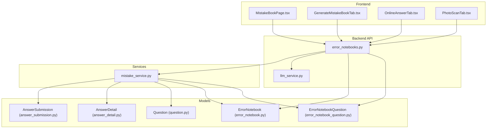
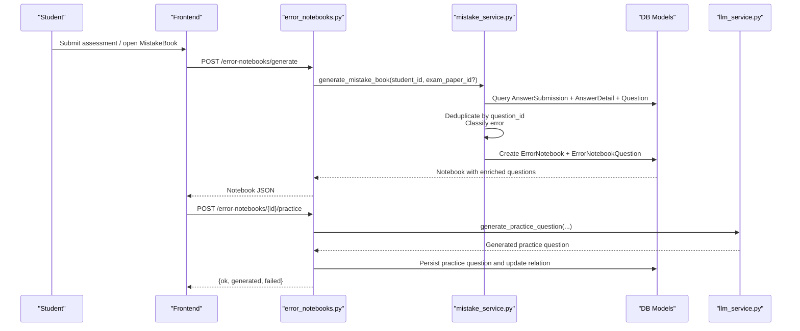
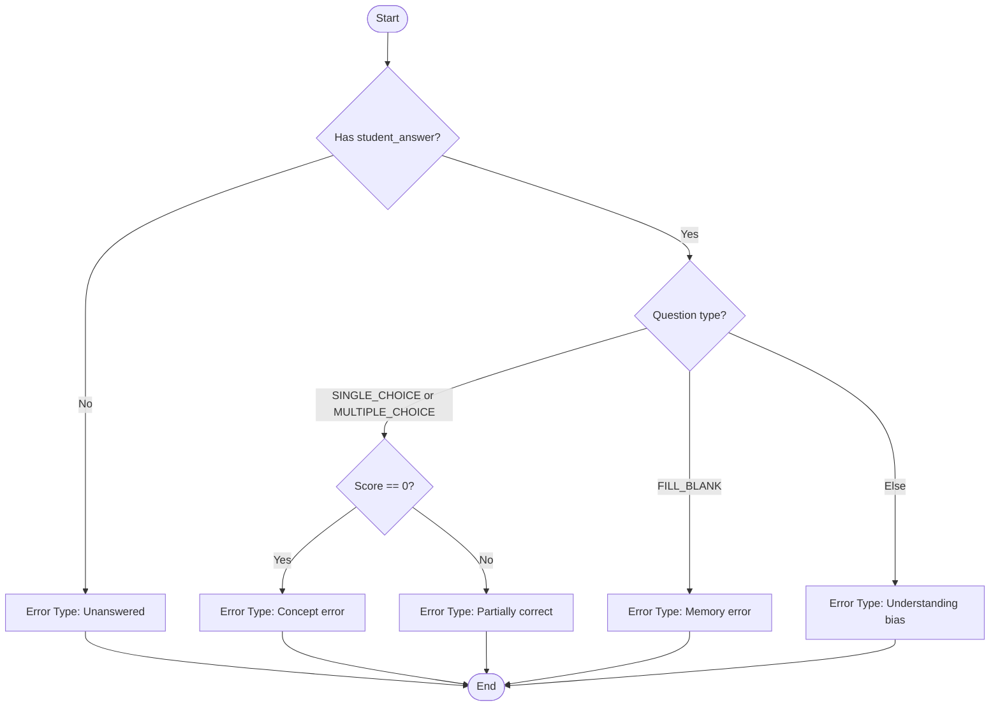
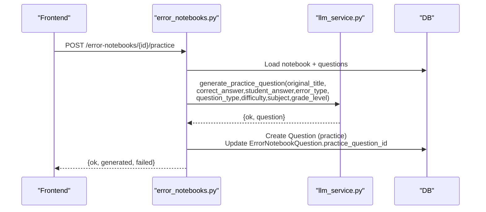
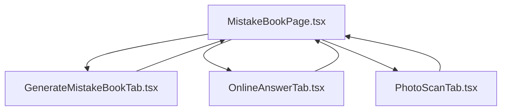
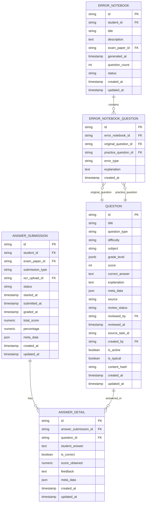
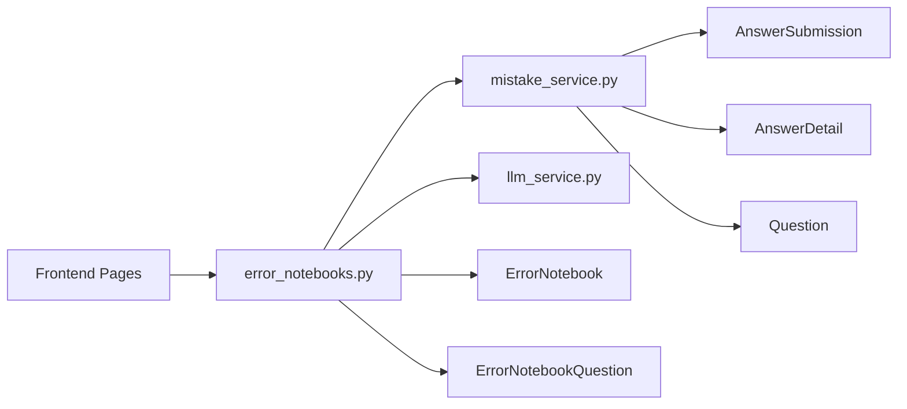

# Error Book System

<cite>
**Referenced Files in This Document**
- [error_notebook.py](file://backend/app/models/error_notebook.py)
- [error_notebook_question.py](file://backend/app/models/error_notebook_question.py)
- [error_notebook.py](file://backend/app/schemas/error_notebook.py)
- [error_notebooks.py](file://backend/app/api/v1/endpoints/error_notebooks.py)
- [mistake_service.py](file://backend/app/services/mistake_service.py)
- [llm_service.py](file://backend/app/services/llm_service.py)
- [question.py](file://backend/app/models/question.py)
- [answer_detail.py](file://backend/app/models/answer_detail.py)
- [answer_submission.py](file://backend/app/models/answer_submission.py)
- [question.py](file://backend/app/schemas/question.py)
- [answer.py](file://backend/app/schemas/answer.py)
- [MistakeBookPage.tsx](file://frontend/src/pages/mistake-book/MistakeBookPage.tsx)
- [GenerateMistakeBookTab.tsx](file://frontend/src/pages/exam-mistakes/GenerateMistakeBookTab.tsx)
- [OnlineAnswerTab.tsx](file://frontend/src/pages/exam-mistakes/OnlineAnswerTab.tsx)
- [PhotoScanTab.tsx](file://frontend/src/pages/exam-mistakes/PhotoScanTab.tsx)
</cite>

## Table of Contents
1. [Introduction](#introduction)
2. [Project Structure](#project-structure)
3. [Core Components](#core-components)
4. [Architecture Overview](#architecture-overview)
5. [Detailed Component Analysis](#detailed-component-analysis)
6. [Dependency Analysis](#dependency-analysis)
7. [Performance Considerations](#performance-considerations)
8. [Troubleshooting Guide](#troubleshooting-guide)
9. [Conclusion](#conclusion)
10. [Appendices](#appendices)

## Introduction
The Error Book System automates the creation of personalized mistake notebooks from assessment results, supports manual entry for self-study, and generates targeted practice questions powered by an LLM. It integrates with assessment workflows, tracks question difficulty and student performance, and provides exportable reports and teacher analytics. The system offers:
- Automatic error detection from assessment submissions
- Manual entry for self-study
- Error classification and frequency analysis
- Practice recommendation engine
- Export/reporting and teacher analytics

## Project Structure
The system comprises:
- Backend API and services for error book generation, classification, and practice question generation
- Frontend pages for managing error books, generating paper-based books, and scanning photos
- Assessment models for submissions, details, and questions
- LLM service for generating practice questions

**Diagram sources**
- [error_notebooks.py:1-437](file://backend/app/api/v1/endpoints/error_notebooks.py#L1-L437)
- [mistake_service.py:1-114](file://backend/app/services/mistake_service.py#L1-L114)
- [llm_service.py:1-350](file://backend/app/services/llm_service.py#L1-L350)
- [error_notebook.py:1-32](file://backend/app/models/error_notebook.py#L1-L32)
- [error_notebook_question.py:1-29](file://backend/app/models/error_notebook_question.py#L1-L29)
- [question.py:1-46](file://backend/app/models/question.py#L1-L46)
- [answer_detail.py:1-33](file://backend/app/models/answer_detail.py#L1-L33)
- [answer_submission.py:1-37](file://backend/app/models/answer_submission.py#L1-L37)
- [MistakeBookPage.tsx:1-637](file://frontend/src/pages/mistake-book/MistakeBookPage.tsx#L1-L637)
- [GenerateMistakeBookTab.tsx:1-131](file://frontend/src/pages/exam-mistakes/GenerateMistakeBookTab.tsx#L1-L131)
- [OnlineAnswerTab.tsx:1-317](file://frontend/src/pages/exam-mistakes/OnlineAnswerTab.tsx#L1-L317)
- [PhotoScanTab.tsx:1-186](file://frontend/src/pages/exam-mistakes/PhotoScanTab.tsx#L1-L186)

**Section sources**
- [error_notebooks.py:1-437](file://backend/app/api/v1/endpoints/error_notebooks.py#L1-L437)
- [mistake_service.py:1-114](file://backend/app/services/mistake_service.py#L1-L114)
- [llm_service.py:1-350](file://backend/app/services/llm_service.py#L1-L350)
- [error_notebook.py:1-32](file://backend/app/models/error_notebook.py#L1-L32)
- [error_notebook_question.py:1-29](file://backend/app/models/error_notebook_question.py#L1-L29)
- [question.py:1-46](file://backend/app/models/question.py#L1-L46)
- [answer_detail.py:1-33](file://backend/app/models/answer_detail.py#L1-L33)
- [answer_submission.py:1-37](file://backend/app/models/answer_submission.py#L1-L37)
- [MistakeBookPage.tsx:1-637](file://frontend/src/pages/mistake-book/MistakeBookPage.tsx#L1-L637)
- [GenerateMistakeBookTab.tsx:1-131](file://frontend/src/pages/exam-mistakes/GenerateMistakeBookTab.tsx#L1-L131)
- [OnlineAnswerTab.tsx:1-317](file://frontend/src/pages/exam-mistakes/OnlineAnswerTab.tsx#L1-L317)
- [PhotoScanTab.tsx:1-186](file://frontend/src/pages/exam-mistakes/PhotoScanTab.tsx#L1-L186)

## Core Components
- ErrorNotebook: Represents a student’s mistake notebook with metadata and status.
- ErrorNotebookQuestion: Links a notebook to original and optional practice questions, captures error type and explanation.
- Mistake Generation Service: Builds notebooks from incorrect answers, deduplicates by question, classifies errors, and enriches with explanations.
- LLM Practice Generator: Creates targeted practice questions aligned to error type, question type, difficulty, and subject.
- Frontend Pages:
  - MistakeBookPage: Lists notebooks, previews, prints, generates practice, and batch operations.
  - GenerateMistakeBookTab: Generates paper-based mistake books from assessments.
  - OnlineAnswerTab: Manages assessment taking and viewing results.
  - PhotoScanTab: OCR upload and mock recognition flow for photo-based entry.

**Section sources**
- [error_notebook.py:8-32](file://backend/app/models/error_notebook.py#L8-L32)
- [error_notebook_question.py:8-29](file://backend/app/models/error_notebook_question.py#L8-L29)
- [mistake_service.py:13-114](file://backend/app/services/mistake_service.py#L13-L114)
- [llm_service.py:227-350](file://backend/app/services/llm_service.py#L227-L350)
- [MistakeBookPage.tsx:1-637](file://frontend/src/pages/mistake-book/MistakeBookPage.tsx#L1-L637)
- [GenerateMistakeBookTab.tsx:1-131](file://frontend/src/pages/exam-mistakes/GenerateMistakeBookTab.tsx#L1-L131)
- [OnlineAnswerTab.tsx:1-317](file://frontend/src/pages/exam-mistakes/OnlineAnswerTab.tsx#L1-L317)
- [PhotoScanTab.tsx:1-186](file://frontend/src/pages/exam-mistakes/PhotoScanTab.tsx#L1-L186)

## Architecture Overview
End-to-end flow:
- Students submit assessments (online or OCR).
- Backend identifies incorrect answers and builds a mistake notebook.
- Optional: Generate practice questions via LLM.
- Export/print paper-based books.
- Teachers and admins access analytics and manage content.

**Diagram sources**
- [error_notebooks.py:22-60](file://backend/app/api/v1/endpoints/error_notebooks.py#L22-L60)
- [mistake_service.py:13-76](file://backend/app/services/mistake_service.py#L13-L76)
- [llm_service.py:227-317](file://backend/app/services/llm_service.py#L227-L317)
- [answer_submission.py:9-37](file://backend/app/models/answer_submission.py#L9-L37)
- [answer_detail.py:9-33](file://backend/app/models/answer_detail.py#L9-L33)
- [question.py:10-46](file://backend/app/models/question.py#L10-L46)
- [error_notebook.py:8-32](file://backend/app/models/error_notebook.py#L8-L32)
- [error_notebook_question.py:8-29](file://backend/app/models/error_notebook_question.py#L8-L29)

## Detailed Component Analysis

### Error Classification System
Classification logic:
- Unanswered: No student answer
- Concept error: Multiple-choice with zero score
- Partially correct: Multiple-choice with partial score
- Memory error: Fill-in-the-blank
- Understanding bias: Other types

**Diagram sources**
- [mistake_service.py:78-86](file://backend/app/services/mistake_service.py#L78-L86)

**Section sources**
- [mistake_service.py:78-86](file://backend/app/services/mistake_service.py#L78-L86)

### Frequency Analysis Algorithms
Frequency analysis aggregates mistakes by:
- Error type counts per student
- Question difficulty distribution
- Subject-wise breakdown
- Trend over time (by generated_at)

Implementation approach:
- Group ErrorNotebookQuestion entries by error_type and difficulty
- Count occurrences and compute percentages
- Provide endpoints for student/class statistics

Current endpoints:
- Student stats: total notebooks and total wrong questions
- Class stats: placeholder for future aggregation

**Section sources**
- [error_notebooks.py:362-387](file://backend/app/api/v1/endpoints/error_notebooks.py#L362-L387)

### Study Recommendation Engine
Recommendation strategy:
- For each mistake, generate a variant practice question with:
  - Same knowledge focus (via question metadata)
  - Same question type and difficulty
  - Similar error type emphasis
- Use LLM prompts tailored to error type and question format

**Diagram sources**
- [error_notebooks.py:199-313](file://backend/app/api/v1/endpoints/error_notebooks.py#L199-L313)
- [llm_service.py:227-317](file://backend/app/services/llm_service.py#L227-L317)

**Section sources**
- [error_notebooks.py:199-313](file://backend/app/api/v1/endpoints/error_notebooks.py#L199-L313)
- [llm_service.py:194-225](file://backend/app/services/llm_service.py#L194-L225)

### Export Functionality and Reports
Export options:
- PDF/Word export of notebook content (text-based)
- Paper-based printing with original and practice questions

Frontend capabilities:
- Single notebook print preview
- Batch print of uncompleted notebooks
- Export to downloadable text

**Section sources**
- [error_notebooks.py:315-360](file://backend/app/api/v1/endpoints/error_notebooks.py#L315-L360)
- [MistakeBookPage.tsx:88-136](file://frontend/src/pages/mistake-book/MistakeBookPage.tsx#L88-L136)
- [MistakeBookPage.tsx:158-219](file://frontend/src/pages/mistake-book/MistakeBookPage.tsx#L158-L219)

### Frontend Interfaces and Workflows
- MistakeBookPage: CRUD for notebooks, preview, print, batch actions, and quick/manual entry
- GenerateMistakeBookTab: Generate paper-based books from assessments
- OnlineAnswerTab: Take assessments online and view results
- PhotoScanTab: Upload images for OCR (mock flow currently)

**Diagram sources**
- [MistakeBookPage.tsx:1-637](file://frontend/src/pages/mistake-book/MistakeBookPage.tsx#L1-L637)
- [GenerateMistakeBookTab.tsx:1-131](file://frontend/src/pages/exam-mistakes/GenerateMistakeBookTab.tsx#L1-L131)
- [OnlineAnswerTab.tsx:1-317](file://frontend/src/pages/exam-mistakes/OnlineAnswerTab.tsx#L1-L317)
- [PhotoScanTab.tsx:1-186](file://frontend/src/pages/exam-mistakes/PhotoScanTab.tsx#L1-L186)

**Section sources**
- [MistakeBookPage.tsx:1-637](file://frontend/src/pages/mistake-book/MistakeBookPage.tsx#L1-L637)
- [GenerateMistakeBookTab.tsx:1-131](file://frontend/src/pages/exam-mistakes/GenerateMistakeBookTab.tsx#L1-L131)
- [OnlineAnswerTab.tsx:1-317](file://frontend/src/pages/exam-mistakes/OnlineAnswerTab.tsx#L1-L317)
- [PhotoScanTab.tsx:1-186](file://frontend/src/pages/exam-mistakes/PhotoScanTab.tsx#L1-L186)

### Data Models Overview

**Diagram sources**
- [error_notebook.py:8-32](file://backend/app/models/error_notebook.py#L8-L32)
- [error_notebook_question.py:8-29](file://backend/app/models/error_notebook_question.py#L8-L29)
- [question.py:10-46](file://backend/app/models/question.py#L10-L46)
- [answer_submission.py:9-37](file://backend/app/models/answer_submission.py#L9-L37)
- [answer_detail.py:9-33](file://backend/app/models/answer_detail.py#L9-L33)

**Section sources**
- [error_notebook.py:8-32](file://backend/app/models/error_notebook.py#L8-L32)
- [error_notebook_question.py:8-29](file://backend/app/models/error_notebook_question.py#L8-L29)
- [question.py:10-46](file://backend/app/models/question.py#L10-L46)
- [answer_detail.py:9-33](file://backend/app/models/answer_detail.py#L9-L33)
- [answer_submission.py:9-37](file://backend/app/models/answer_submission.py#L9-L37)

## Dependency Analysis
- Backend API depends on:
  - Mistake service for automatic notebook generation
  - LLM service for practice question generation
  - Assessment models for retrieving submissions and details
- Frontend depends on:
  - API endpoints for CRUD, generation, and export
  - Reference values for question types and error types

**Diagram sources**
- [error_notebooks.py:1-437](file://backend/app/api/v1/endpoints/error_notebooks.py#L1-L437)
- [mistake_service.py:1-114](file://backend/app/services/mistake_service.py#L1-L114)
- [llm_service.py:1-350](file://backend/app/services/llm_service.py#L1-L350)
- [answer_submission.py:1-37](file://backend/app/models/answer_submission.py#L1-L37)
- [answer_detail.py:1-33](file://backend/app/models/answer_detail.py#L1-L33)
- [question.py:1-46](file://backend/app/models/question.py#L1-L46)
- [error_notebook.py:1-32](file://backend/app/models/error_notebook.py#L1-L32)
- [error_notebook_question.py:1-29](file://backend/app/models/error_notebook_question.py#L1-L29)

**Section sources**
- [error_notebooks.py:1-437](file://backend/app/api/v1/endpoints/error_notebooks.py#L1-L437)
- [mistake_service.py:1-114](file://backend/app/services/mistake_service.py#L1-L114)
- [llm_service.py:1-350](file://backend/app/services/llm_service.py#L1-L350)
- [answer_submission.py:1-37](file://backend/app/models/answer_submission.py#L1-L37)
- [answer_detail.py:1-33](file://backend/app/models/answer_detail.py#L1-L33)
- [question.py:1-46](file://backend/app/models/question.py#L1-L46)
- [error_notebook.py:1-32](file://backend/app/models/error_notebook.py#L1-L32)
- [error_notebook_question.py:1-29](file://backend/app/models/error_notebook_question.py#L1-L29)

## Performance Considerations
- Deduplication by question_id during notebook generation prevents redundant entries.
- Select-in loading optimizes fetching related questions and practice questions.
- LLM calls are asynchronous and timeout-configured; consider rate limiting and caching repeated prompts.
- Export/print operations build HTML in-memory; for large books, consider streaming or server-side rendering.

## Troubleshooting Guide
Common issues and resolutions:
- No mistakes found: Ensure assessments have incorrect answers; verify submission status.
- Practice generation fails: Confirm LLM provider configuration and connectivity; check prompt parsing.
- Permission denied: Verify user roles and ownership checks for notebook access.
- Export/print blank: Confirm notebook has questions loaded; refresh after generating practice.

**Section sources**
- [error_notebooks.py:22-60](file://backend/app/api/v1/endpoints/error_notebooks.py#L22-L60)
- [error_notebooks.py:199-313](file://backend/app/api/v1/endpoints/error_notebooks.py#L199-L313)
- [llm_service.py:82-103](file://backend/app/services/llm_service.py#L82-L103)
- [MistakeBookPage.tsx:221-237](file://frontend/src/pages/mistake-book/MistakeBookPage.tsx#L221-L237)

## Conclusion
The Error Book System provides a robust pipeline from assessment results to personalized practice and reporting. Its modular design enables easy extension for advanced analytics, richer export formats, and expanded LLM capabilities.

## Appendices

### API Definitions
- Generate error notebook
  - Method: POST
  - Path: /error-notebooks/generate
  - Query: exam_paper_id (optional)
  - Response: ErrorNotebookResponse

- Get error notebook
  - Method: GET
  - Path: /error-notebooks/{notebook_id}
  - Response: Enriched notebook with questions

- Get student error notebooks
  - Method: GET
  - Path: /error-notebooks/student/{student_id}
  - Query: date_from, date_to, paper_id
  - Response: List of ErrorNotebookResponse

- Delete error notebook
  - Method: DELETE
  - Path: /error-notebooks/{notebook_id}

- Generate practice questions
  - Method: POST
  - Path: /error-notebooks/{notebook_id}/practice
  - Response: {ok, generated, failed, total}

- Export notebook
  - Method: GET
  - Path: /error-notebooks/{notebook_id}/export/pdf
  - Path: /error-notebooks/{notebook_id}/export/word

- Student stats
  - Method: GET
  - Path: /error-notebooks/stats/student/{student_id}
  - Response: {total_notebooks, total_wrong_questions}

- Manual entry
  - Method: POST
  - Path: /error-notebooks/manual-entry
  - Body: question_title, question_type, subject, student_answer, correct_answer, error_type

**Section sources**
- [error_notebooks.py:22-387](file://backend/app/api/v1/endpoints/error_notebooks.py#L22-L387)

### Example Recommendation Strategies
- Concept error in multiple-choice: Generate a variant with altered scenario but same concept and difficulty.
- Memory error in fill-in-the-blank: Produce a semantically similar question with different numbers or context.
- Understanding bias: Offer a guided problem-solving question emphasizing reasoning steps.

**Section sources**
- [llm_service.py:194-225](file://backend/app/services/llm_service.py#L194-L225)

### Learning Analytics Dashboards
- Student-level: Total notebooks, total wrong questions, completion status
- Class-level: Aggregate totals (placeholder for future implementation)
- Export-ready summaries for teacher review and planning

**Section sources**
- [error_notebooks.py:362-387](file://backend/app/api/v1/endpoints/error_notebooks.py#L362-L387)