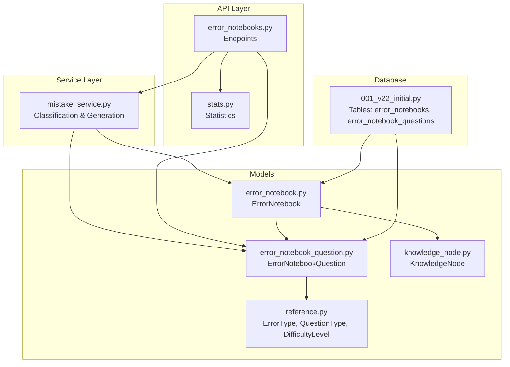
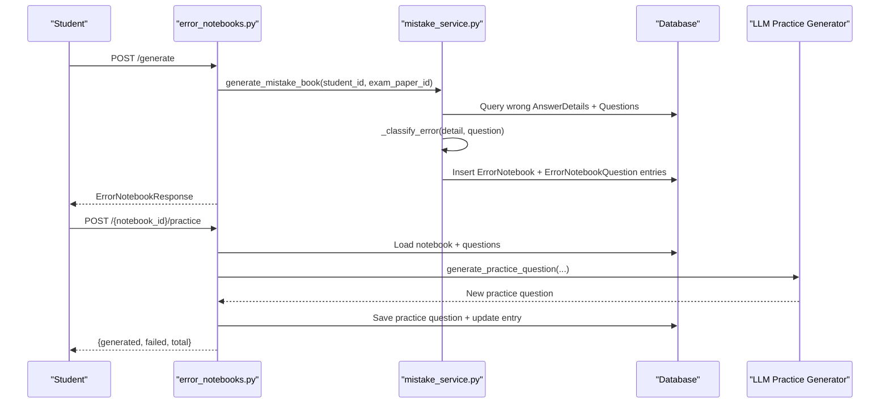
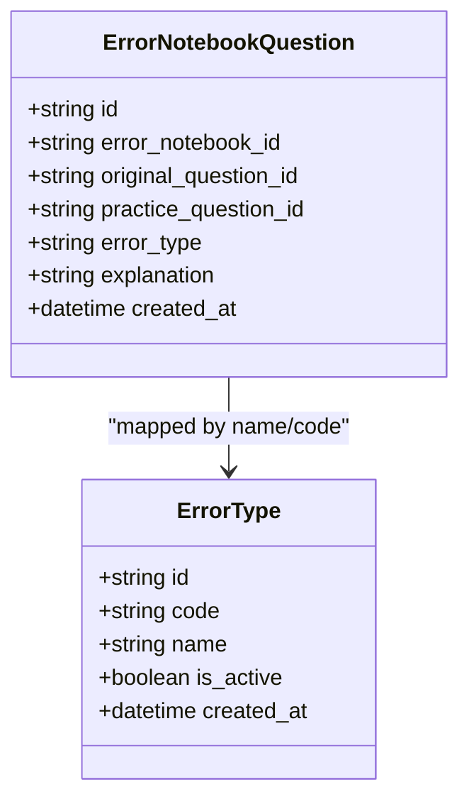
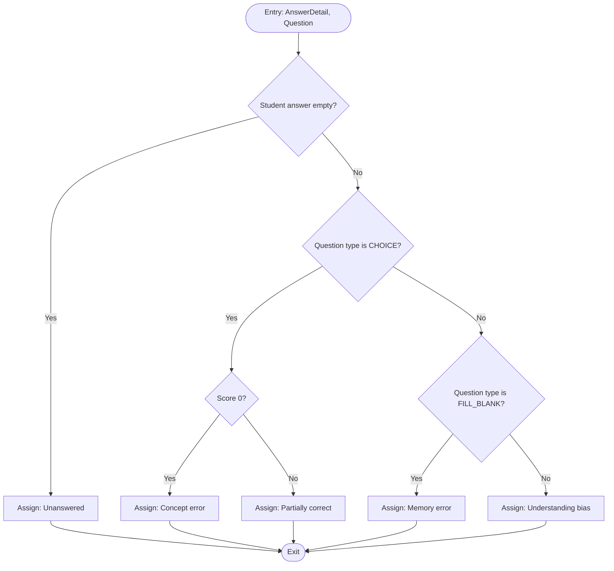
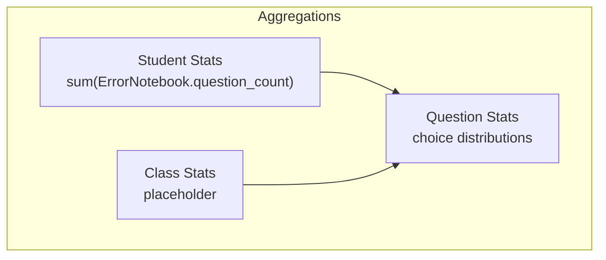
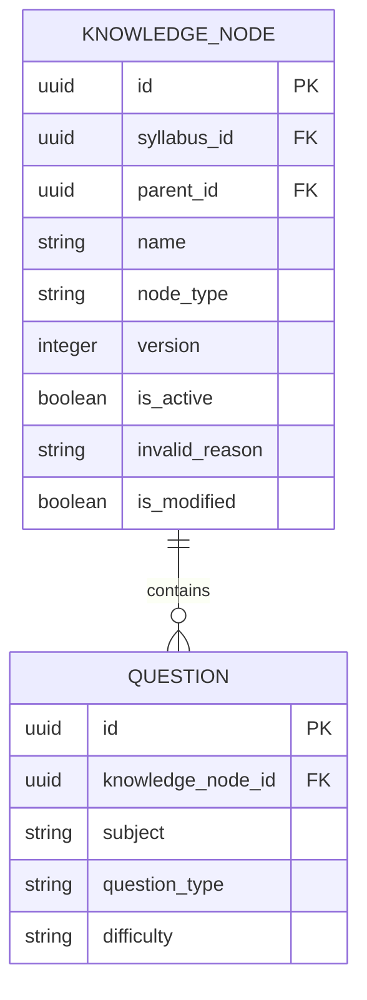
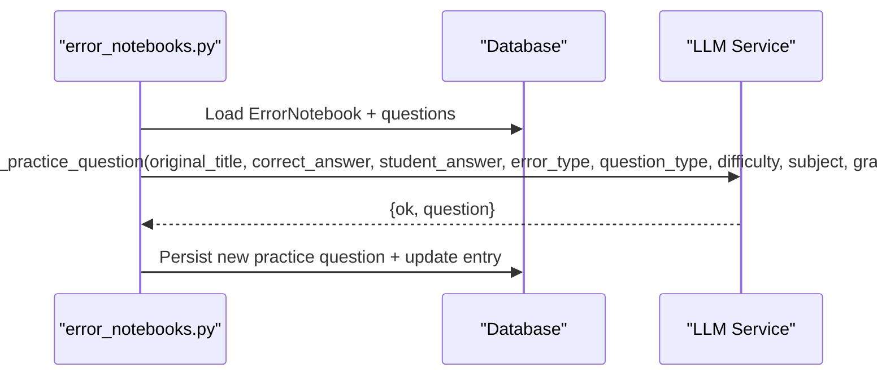
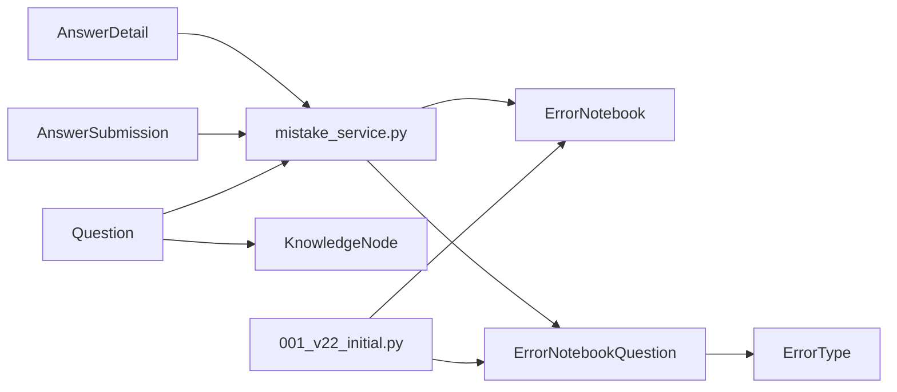

# Error Classification System

<cite>
**Referenced Files in This Document**
- [error_notebooks.py](file://backend/app/api/v1/endpoints/error_notebooks.py)
- [mistake_service.py](file://backend/app/services/mistake_service.py)
- [error_notebook.py](file://backend/app/models/error_notebook.py)
- [error_notebook_question.py](file://backend/app/models/error_notebook_question.py)
- [reference.py](file://backend/app/models/reference.py)
- [knowledge_node.py](file://backend/app/models/knowledge_node.py)
- [stats.py](file://backend/app/api/v1/endpoints/stats.py)
- [student.py](file://backend/app/api/v1/endpoints/student.py)
- [001_v22_initial.py](file://backend/alembic/versions/001_v22_initial.py)
- [requirements-v2.1.1.md](file://docs/requirements-v2.1.1.md)
</cite>

## Table of Contents
1. [Introduction](#introduction)
2. [Project Structure](#project-structure)
3. [Core Components](#core-components)
4. [Architecture Overview](#architecture-overview)
5. [Detailed Component Analysis](#detailed-component-analysis)
6. [Dependency Analysis](#dependency-analysis)
7. [Performance Considerations](#performance-considerations)
8. [Troubleshooting Guide](#troubleshooting-guide)
9. [Conclusion](#conclusion)

## Introduction
This document describes the error classification system that automatically detects and categorizes student mistakes, generates error notebooks, and supports manual overrides for teachers and administrators. It explains the taxonomy of error types, the automated classification rules, the integration with knowledge nodes for curriculum alignment, and the statistical analysis used to identify patterns in student performance.

## Project Structure
The error classification system spans API endpoints, services, models, and migrations. The key areas are:
- API endpoints for generating error notebooks, manual entry, and statistics
- Service layer for automated classification and practice question generation
- Data models for error notebooks, error notebook questions, and reference types
- Knowledge node models for curriculum alignment
- Statistics endpoints for class and question-level analytics

**Diagram sources**
- [error_notebooks.py:1-437](file://backend/app/api/v1/endpoints/error_notebooks.py#L1-L437)
- [mistake_service.py:1-114](file://backend/app/services/mistake_service.py#L1-L114)
- [error_notebook.py:1-32](file://backend/app/models/error_notebook.py#L1-L32)
- [error_notebook_question.py:1-29](file://backend/app/models/error_notebook_question.py#L1-L29)
- [reference.py:1-76](file://backend/app/models/reference.py#L1-L76)
- [knowledge_node.py:1-26](file://backend/app/models/knowledge_node.py#L1-L26)
- [001_v22_initial.py:246-426](file://backend/alembic/versions/001_v22_initial.py#L246-L426)

**Section sources**
- [error_notebooks.py:1-437](file://backend/app/api/v1/endpoints/error_notebooks.py#L1-L437)
- [mistake_service.py:1-114](file://backend/app/services/mistake_service.py#L1-L114)
- [error_notebook.py:1-32](file://backend/app/models/error_notebook.py#L1-L32)
- [error_notebook_question.py:1-29](file://backend/app/models/error_notebook_question.py#L1-L29)
- [reference.py:1-76](file://backend/app/models/reference.py#L1-L76)
- [knowledge_node.py:1-26](file://backend/app/models/knowledge_node.py#L1-L26)
- [001_v22_initial.py:246-426](file://backend/alembic/versions/001_v22_initial.py#L246-L426)

## Core Components
- ErrorNotebook: Container for a student’s mistakes, linked to a paper submission and populated with ErrorNotebookQuestion entries.
- ErrorNotebookQuestion: Individual mistake record with error_type and explanation, linking to the original question and optional practice question.
- ErrorType reference: Lookup table for standardized error categories.
- Classification service: Automated assignment of error types based on question type and scoring.
- Manual entry endpoint: Allows students or staff to quickly add a mistake with a chosen error type.
- KnowledgeNode: Curriculum-aligned nodes enabling mapping of mistakes to syllabi and topics.

Key implementation references:
- ErrorNotebook and ErrorNotebookQuestion models and constraints
- Automated classification logic
- Manual entry endpoint for quick mistake recording
- KnowledgeNode model for curriculum alignment

**Section sources**
- [error_notebook.py:1-32](file://backend/app/models/error_notebook.py#L1-L32)
- [error_notebook_question.py:1-29](file://backend/app/models/error_notebook_question.py#L1-L29)
- [reference.py:49-55](file://backend/app/models/reference.py#L49-L55)
- [mistake_service.py:78-86](file://backend/app/services/mistake_service.py#L78-L86)
- [error_notebooks.py:390-436](file://backend/app/api/v1/endpoints/error_notebooks.py#L390-L436)
- [knowledge_node.py:1-26](file://backend/app/models/knowledge_node.py#L1-L26)

## Architecture Overview
The system integrates automatic classification with manual overrides and curriculum mapping. Automatic classification assigns error types during error notebook generation. Teachers and administrators can manually adjust error types. The system also supports generating practice questions aligned to the original question’s subject, difficulty, and type.

**Diagram sources**
- [error_notebooks.py:22-59](file://backend/app/api/v1/endpoints/error_notebooks.py#L22-L59)
- [mistake_service.py:13-75](file://backend/app/services/mistake_service.py#L13-L75)
- [error_notebooks.py:199-313](file://backend/app/api/v1/endpoints/error_notebooks.py#L199-L313)

**Section sources**
- [error_notebooks.py:22-59](file://backend/app/api/v1/endpoints/error_notebooks.py#L22-L59)
- [mistake_service.py:13-75](file://backend/app/services/mistake_service.py#L13-L75)
- [error_notebooks.py:199-313](file://backend/app/api/v1/endpoints/error_notebooks.py#L199-L313)

## Detailed Component Analysis

### Taxonomy of Error Types
The system defines a standardized set of error categories via the ErrorType reference table. The automated classifier currently assigns categories based on question type and score:
- Unanswered
- Concept error
- Partially correct
- Memory error
- Understanding bias

Manual classification allows overriding these defaults.

**Diagram sources**
- [reference.py:49-55](file://backend/app/models/reference.py#L49-L55)
- [error_notebook_question.py:1-29](file://backend/app/models/error_notebook_question.py#L1-L29)

**Section sources**
- [reference.py:49-55](file://backend/app/models/reference.py#L49-L55)
- [mistake_service.py:78-86](file://backend/app/services/mistake_service.py#L78-L86)
- [error_notebook_question.py:1-29](file://backend/app/models/error_notebook_question.py#L1-L29)

### Automated Classification Rules
The classification algorithm assigns error types based on:
- Whether the student left the question unanswered
- Question type and score thresholds

**Diagram sources**
- [mistake_service.py:78-86](file://backend/app/services/mistake_service.py#L78-L86)

**Section sources**
- [mistake_service.py:78-86](file://backend/app/services/mistake_service.py#L78-L86)

### Manual Classification Options
Teachers and administrators can override error types when viewing or editing error notebooks. The manual entry endpoint enables quick addition of mistakes with a selected error type.

- Override capability: Teachers/admins can change error_type on ErrorNotebookQuestion entries.
- Manual entry: Students or staff can add a mistake with a chosen error type.

**Section sources**
- [error_notebooks.py:362-376](file://backend/app/api/v1/endpoints/error_notebooks.py#L362-L376)
- [error_notebooks.py:390-436](file://backend/app/api/v1/endpoints/error_notebooks.py#L390-L436)

### Hierarchical Structure of Categories
The ErrorType reference table supports hierarchical categorization through code/name fields. While the current implementation focuses on broad categories, the schema accommodates hierarchical grouping via code prefixes or parent-child relationships if extended.

**Section sources**
- [reference.py:49-55](file://backend/app/models/reference.py#L49-L55)

### Frequency-Based Pattern Recognition
The system aggregates error notebooks and question counts to identify patterns:
- Student-level: Total number of wrong questions across notebooks
- Class-level: Aggregated totals (placeholder endpoint available)
- Question-level: Choice distributions for multiple-choice items

These aggregations support identifying frequent error types and recurring misconceptions.

**Diagram sources**
- [student.py:47-64](file://backend/app/api/v1/endpoints/student.py#L47-L64)
- [error_notebooks.py:378-386](file://backend/app/api/v1/endpoints/error_notebooks.py#L378-L386)
- [stats.py:97-131](file://backend/app/api/v1/endpoints/stats.py#L97-L131)

**Section sources**
- [student.py:47-64](file://backend/app/api/v1/endpoints/student.py#L47-L64)
- [error_notebooks.py:378-386](file://backend/app/api/v1/endpoints/error_notebooks.py#L378-L386)
- [stats.py:97-131](file://backend/app/api/v1/endpoints/stats.py#L97-L131)

### Integration with Knowledge Node Mapping
Mistakes can be aligned to curriculum knowledge nodes to support targeted instruction:
- KnowledgeNode model stores syllabus-linked nodes with versioning and status
- Questions can be associated with knowledge nodes to connect mistakes to standards
- Versioned syllabi enable tracking of curriculum changes and their impact on error patterns

**Diagram sources**
- [knowledge_node.py:1-26](file://backend/app/models/knowledge_node.py#L1-L26)
- [requirements-v2.1.1.md:84-89](file://docs/requirements-v2.1.1.md#L84-L89)

**Section sources**
- [knowledge_node.py:1-26](file://backend/app/models/knowledge_node.py#L1-L26)
- [requirements-v2.1.1.md:84-89](file://docs/requirements-v2.1.1.md#L84-L89)

### Statistical Analysis for Similar Errors
The system computes:
- Correct rates per question and per paper
- Choice distributions for multiple-choice questions
- Aggregated totals for student and class performance

These statistics help group similar errors by identifying common incorrect responses and frequent missteps.

**Section sources**
- [stats.py:17-137](file://backend/app/api/v1/endpoints/stats.py#L17-L137)
- [stats.py:140-251](file://backend/app/api/v1/endpoints/stats.py#L140-L251)

### Practice Question Generation
For each mistake, the system can generate a tailored practice question using LLM. The generator receives the original question’s subject, difficulty, type, and the student’s error type to produce a focused exercise.

**Diagram sources**
- [error_notebooks.py:249-305](file://backend/app/api/v1/endpoints/error_notebooks.py#L249-L305)

**Section sources**
- [error_notebooks.py:249-305](file://backend/app/api/v1/endpoints/error_notebooks.py#L249-L305)

## Dependency Analysis
The error classification system relies on:
- AnswerDetail and AnswerSubmission for identifying wrong answers
- Question metadata for classification rules
- ErrorNotebook and ErrorNotebookQuestion for storing categorized mistakes
- Reference tables for standardized categories and attributes
- KnowledgeNode for curriculum alignment
- Alembic migrations for schema initialization

**Diagram sources**
- [mistake_service.py:1-114](file://backend/app/services/mistake_service.py#L1-L114)
- [error_notebook.py:1-32](file://backend/app/models/error_notebook.py#L1-L32)
- [error_notebook_question.py:1-29](file://backend/app/models/error_notebook_question.py#L1-L29)
- [reference.py:49-55](file://backend/app/models/reference.py#L49-L55)
- [knowledge_node.py:1-26](file://backend/app/models/knowledge_node.py#L1-L26)
- [001_v22_initial.py:246-426](file://backend/alembic/versions/001_v22_initial.py#L246-L426)

**Section sources**
- [mistake_service.py:1-114](file://backend/app/services/mistake_service.py#L1-L114)
- [error_notebook.py:1-32](file://backend/app/models/error_notebook.py#L1-L32)
- [error_notebook_question.py:1-29](file://backend/app/models/error_notebook_question.py#L1-L29)
- [reference.py:49-55](file://backend/app/models/reference.py#L49-L55)
- [knowledge_node.py:1-26](file://backend/app/models/knowledge_node.py#L1-L26)
- [001_v22_initial.py:246-426](file://backend/alembic/versions/001_v22_initial.py#L246-L426)

## Performance Considerations
- Deduplication: The service deduplicates mistakes by question_id to avoid redundant entries.
- Asynchronous operations: Database transactions and LLM calls are executed asynchronously to minimize latency.
- Indexes: Tables include appropriate indexes (e.g., on student_id, question_id) to optimize queries.
- Pagination and limits: Statistics endpoints limit result sets to manageable sizes.

[No sources needed since this section provides general guidance]

## Troubleshooting Guide
Common issues and resolutions:
- No mistakes found: The generation process returns a 404 if there are no wrong answers for the given student/paper.
- Permission denied: Access to error notebooks and stats requires proper user roles (student, teacher, administrator).
- Submission status conflicts: The system prevents regenerating an error notebook if the submission status indicates it was already generated.
- LLM generation failures: Practice question generation logs failures and continues; check LLM service availability and parameters.

**Section sources**
- [error_notebooks.py:40-59](file://backend/app/api/v1/endpoints/error_notebooks.py#L40-L59)
- [error_notebooks.py:362-376](file://backend/app/api/v1/endpoints/error_notebooks.py#L362-L376)
- [error_notebooks.py:384-386](file://backend/app/api/v1/endpoints/error_notebooks.py#L384-L386)
- [error_notebooks.py:306-312](file://backend/app/api/v1/endpoints/error_notebooks.py#L306-L312)

## Conclusion
The error classification system combines automated categorization, manual overrides, and curriculum alignment to support targeted learning interventions. Its modular design integrates seamlessly with statistics and practice generation, enabling teachers to identify patterns, address misconceptions, and reinforce learning through personalized exercises.