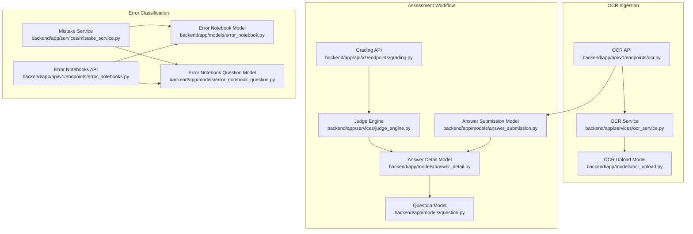
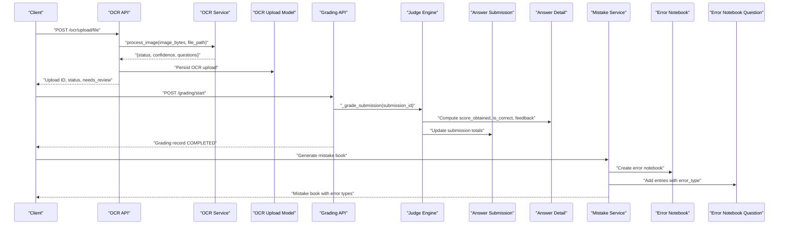
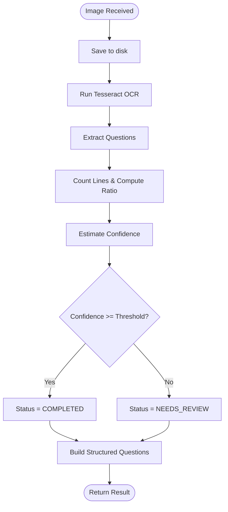
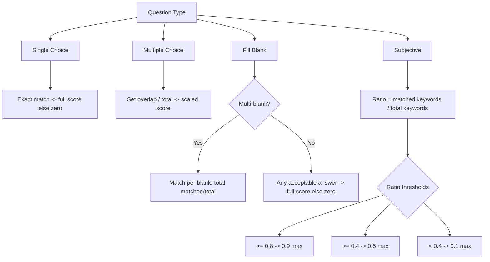
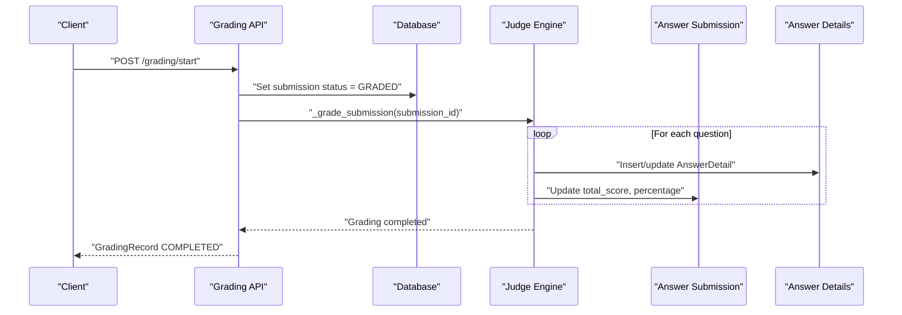
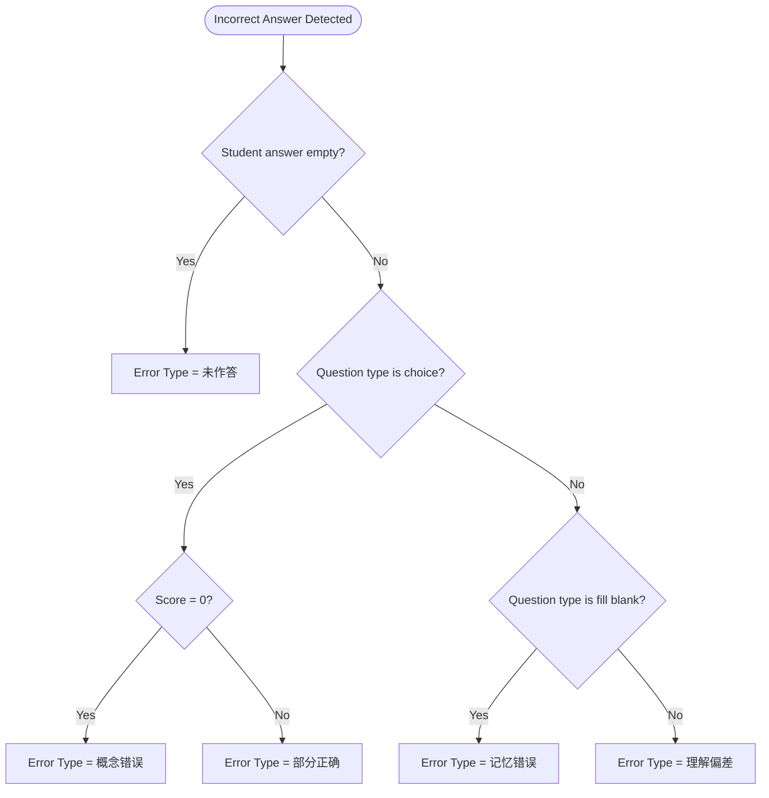
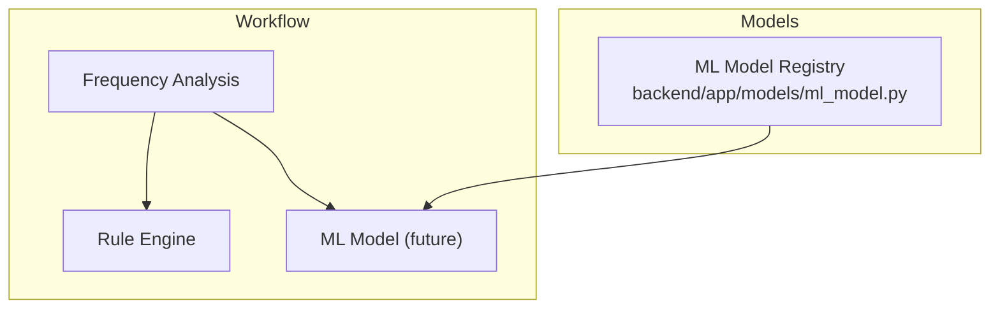
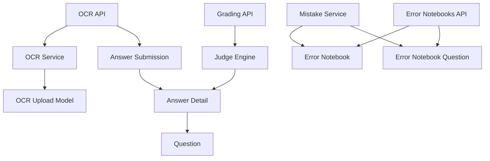

# Error Detection Algorithms

<cite>
**Referenced Files in This Document**
- [ocr_service.py](file://backend/app/services/ocr_service.py)
- [ocr.py](file://backend/app/api/v1/endpoints/ocr.py)
- [ocr_upload.py](file://backend/app/models/ocr_upload.py)
- [judge_engine.py](file://backend/app/services/judge_engine.py)
- [grading.py](file://backend/app/api/v1/endpoints/grading.py)
- [answer_detail.py](file://backend/app/models/answer_detail.py)
- [answer_submission.py](file://backend/app/models/answer_submission.py)
- [question.py](file://backend/app/models/question.py)
- [mistake_service.py](file://backend/app/services/mistake_service.py)
- [error_notebook.py](file://backend/app/models/error_notebook.py)
- [error_notebook_question.py](file://backend/app/models/error_notebook_question.py)
- [error_notebooks.py](file://backend/app/api/v1/endpoints/error_notebooks.py)
- [grading-implementation-plan.md](file://docs/grading-implementation-plan.md)
- [database-design.md](file://docs/database-design.md)
- [ml_model.py](file://backend/app/models/ml_model.py)
</cite>

## Table of Contents
1. [Introduction](#introduction)
2. [Project Structure](#project-structure)
3. [Core Components](#core-components)
4. [Architecture Overview](#architecture-overview)
5. [Detailed Component Analysis](#detailed-component-analysis)
6. [Dependency Analysis](#dependency-analysis)
7. [Performance Considerations](#performance-considerations)
8. [Troubleshooting Guide](#troubleshooting-guide)
9. [Conclusion](#conclusion)
10. [Appendices](#appendices)

## Introduction
This document details the error detection algorithms that automatically analyze student answer submissions to identify mistakes. It explains the pattern matching and scoring mechanisms used across question types (single choice, multiple choice, fill in the blank, and subjective), the OCR integration for scanned answers, and the frequency-based error classification that supports intelligent error categorization. It also outlines threshold configurations, tolerance levels for subjective answers, and the integration with the assessment workflow.

## Project Structure
The error detection pipeline spans OCR ingestion, structured answer extraction, rule-based grading, and error classification for mistake books. The following diagram maps the key components and their relationships.

**Diagram sources**
- [ocr.py:18-64](file://backend/app/api/v1/endpoints/ocr.py#L18-L64)
- [ocr_service.py:61-125](file://backend/app/services/ocr_service.py#L61-L125)
- [ocr_upload.py:8-35](file://backend/app/models/ocr_upload.py#L8-L35)
- [grading.py:19-55](file://backend/app/api/v1/endpoints/grading.py#L19-L55)
- [judge_engine.py:126-129](file://backend/app/services/judge_engine.py#L126-L129)
- [answer_submission.py:9-37](file://backend/app/models/answer_submission.py#L9-L37)
- [answer_detail.py:9-33](file://backend/app/models/answer_detail.py#L9-L33)
- [question.py:10-46](file://backend/app/models/question.py#L10-L46)
- [mistake_service.py:13-75](file://backend/app/services/mistake_service.py#L13-L75)
- [error_notebook.py:8-32](file://backend/app/models/error_notebook.py#L8-L32)
- [error_notebook_question.py:8-29](file://backend/app/models/error_notebook_question.py#L8-L29)
- [error_notebooks.py:1-84](file://backend/app/api/v1/endpoints/error_notebooks.py#L1-L84)

**Section sources**
- [ocr.py:18-64](file://backend/app/api/v1/endpoints/ocr.py#L18-L64)
- [ocr_service.py:61-125](file://backend/app/services/ocr_service.py#L61-L125)
- [ocr_upload.py:8-35](file://backend/app/models/ocr_upload.py#L8-L35)
- [grading.py:19-55](file://backend/app/api/v1/endpoints/grading.py#L19-L55)
- [judge_engine.py:126-129](file://backend/app/services/judge_engine.py#L126-L129)
- [answer_submission.py:9-37](file://backend/app/models/answer_submission.py#L9-L37)
- [answer_detail.py:9-33](file://backend/app/models/answer_detail.py#L9-L33)
- [question.py:10-46](file://backend/app/models/question.py#L10-L46)
- [mistake_service.py:13-75](file://backend/app/services/mistake_service.py#L13-L75)
- [error_notebook.py:8-32](file://backend/app/models/error_notebook.py#L8-L32)
- [error_notebook_question.py:8-29](file://backend/app/models/error_notebook_question.py#L8-L29)
- [error_notebooks.py:1-84](file://backend/app/api/v1/endpoints/error_notebooks.py#L1-L84)

## Core Components
- OCR processing and confidence estimation for scanned answer sheets
- Structured question extraction and classification by question type
- Rule-based grading engine supporting multiple question types with scoring thresholds
- Subjective answer tolerance via keyword matching ratios
- Error classification and mistake book generation with frequency-aware categorization
- Assessment workflow integration for grading records and model metadata

**Section sources**
- [ocr_service.py:17-125](file://backend/app/services/ocr_service.py#L17-L125)
- [judge_engine.py:31-123](file://backend/app/services/judge_engine.py#L31-L123)
- [mistake_service.py:78-85](file://backend/app/services/mistake_service.py#L78-L85)
- [grading.py:19-55](file://backend/app/api/v1/endpoints/grading.py#L19-L55)

## Architecture Overview
The error detection architecture integrates OCR ingestion, structured extraction, rule-based grading, and error classification. The flow below maps the end-to-end process from uploaded images to scored submissions and mistake book generation.

**Diagram sources**
- [ocr.py:18-64](file://backend/app/api/v1/endpoints/ocr.py#L18-L64)
- [ocr_service.py:61-125](file://backend/app/services/ocr_service.py#L61-L125)
- [ocr_upload.py:8-35](file://backend/app/models/ocr_upload.py#L8-L35)
- [grading.py:19-55](file://backend/app/api/v1/endpoints/grading.py#L19-L55)
- [judge_engine.py:126-129](file://backend/app/services/judge_engine.py#L126-L129)
- [answer_submission.py:9-37](file://backend/app/models/answer_submission.py#L9-L37)
- [answer_detail.py:9-33](file://backend/app/models/answer_detail.py#L9-L33)
- [mistake_service.py:13-75](file://backend/app/services/mistake_service.py#L13-L75)
- [error_notebook.py:8-32](file://backend/app/models/error_notebook.py#L8-L32)
- [error_notebook_question.py:8-29](file://backend/app/models/error_notebook_question.py#L8-L29)

## Detailed Component Analysis

### OCR Processing and Confidence Estimation
OCR extracts raw text from uploaded images, segments questions, detects options and answers, and estimates confidence. Confidence determines whether the result requires manual review.

Key behaviors:
- Question extraction uses heuristic patterns for question numbering, options, and answer lines.
- Confidence estimation considers Chinese character ratio and line count; normalized to [0, 1].
- Threshold-based status assignment separates low-confidence outputs requiring review.

**Diagram sources**
- [ocr_service.py:61-125](file://backend/app/services/ocr_service.py#L61-L125)

**Section sources**
- [ocr_service.py:17-125](file://backend/app/services/ocr_service.py#L17-L125)
- [ocr.py:18-64](file://backend/app/api/v1/endpoints/ocr.py#L18-L64)
- [ocr_upload.py:8-35](file://backend/app/models/ocr_upload.py#L8-L35)

### Pattern Matching and Scoring Across Question Types
The rule-based judge engine compares student answers against correct answers using type-specific logic and scoring thresholds.

- Single choice: Exact uppercase match against a single correct option.
- Multiple choice: Set comparison; partial credit computed as overlap/total × max_score.
- Fill in the blank: Supports single or multi-blank modes; accepts equivalent answers with tolerance for whitespace and separators.
- Subjective: Keyword matching ratio drives score scaling with explicit feedback tiers.

Scoring thresholds and tolerances:
- Single/multiple choice: Full score for correct answers; partial for subset matches.
- Fill in the blank: Full score for all blanks correct; partial proportional to matched blanks.
- Subjective: Keyword match ratio thresholds determine score scaling and feedback categories.

**Diagram sources**
- [judge_engine.py:31-116](file://backend/app/services/judge_engine.py#L31-L116)

**Section sources**
- [judge_engine.py:20-129](file://backend/app/services/judge_engine.py#L20-L129)
- [grading-implementation-plan.md:168-198](file://docs/grading-implementation-plan.md#L168-L198)

### Integration with Assessment Workflow
The grading workflow ties OCR outputs and manual submissions into a unified scoring pipeline. It updates submission totals, persists answer details, and records grading metadata.

**Diagram sources**
- [grading.py:19-55](file://backend/app/api/v1/endpoints/grading.py#L19-L55)
- [judge_engine.py:126-129](file://backend/app/services/judge_engine.py#L126-L129)
- [answer_submission.py:9-37](file://backend/app/models/answer_submission.py#L9-L37)
- [answer_detail.py:9-33](file://backend/app/models/answer_detail.py#L9-L33)

**Section sources**
- [grading.py:19-55](file://backend/app/api/v1/endpoints/grading.py#L19-L55)
- [answer_submission.py:9-37](file://backend/app/models/answer_submission.py#L9-L37)
- [answer_detail.py:9-33](file://backend/app/models/answer_detail.py#L9-L33)

### Error Classification and Mistake Book Generation
Mistake book generation aggregates incorrect answers, deduplicates by question, and classifies errors by type. Classification logic considers question type and achieved scores.

Classification rules:
- Unanswered: No student answer recorded.
- Conceptual error: For choice questions with zero score.
- Partially correct: For choice questions with non-zero but less-than-max score.
- Memory error: For fill-in-the-blank questions.
- Understanding bias: For other question types.

**Diagram sources**
- [mistake_service.py:78-85](file://backend/app/services/mistake_service.py#L78-L85)

**Section sources**
- [mistake_service.py:13-75](file://backend/app/services/mistake_service.py#L13-L75)
- [error_notebook.py:8-32](file://backend/app/models/error_notebook.py#L8-L32)
- [error_notebook_question.py:8-29](file://backend/app/models/error_notebook_question.py#L8-L29)
- [error_notebooks.py:1-84](file://backend/app/api/v1/endpoints/error_notebooks.py#L1-L84)
- [database-design.md:337-355](file://docs/database-design.md#L337-L355)

### Frequency Analysis and Machine Learning Integration
Frequency analysis identifies recurring error patterns across students and questions, enabling targeted interventions. The system includes a model registry for ML models used in grading and related tasks.

- Frequency analysis: Aggregates incorrect answers by question, type, and knowledge area to detect trends.
- ML model registry: Stores model metadata and deployment status for grading-related models.
- Current model: The rule engine is currently active for grading; model switching endpoints exist for future ML integration.

**Diagram sources**
- [ml_model.py:8-35](file://backend/app/models/ml_model.py#L8-L35)
- [grading.py:126-143](file://backend/app/api/v1/endpoints/grading.py#L126-L143)

**Section sources**
- [ml_model.py:8-35](file://backend/app/models/ml_model.py#L8-L35)
- [grading.py:126-143](file://backend/app/api/v1/endpoints/grading.py#L126-L143)

## Dependency Analysis
The following diagram highlights dependencies among core components involved in error detection and assessment.

**Diagram sources**
- [ocr.py:18-64](file://backend/app/api/v1/endpoints/ocr.py#L18-L64)
- [ocr_service.py:61-125](file://backend/app/services/ocr_service.py#L61-L125)
- [ocr_upload.py:8-35](file://backend/app/models/ocr_upload.py#L8-L35)
- [grading.py:19-55](file://backend/app/api/v1/endpoints/grading.py#L19-L55)
- [judge_engine.py:126-129](file://backend/app/services/judge_engine.py#L126-L129)
- [answer_submission.py:9-37](file://backend/app/models/answer_submission.py#L9-L37)
- [answer_detail.py:9-33](file://backend/app/models/answer_detail.py#L9-L33)
- [question.py:10-46](file://backend/app/models/question.py#L10-L46)
- [mistake_service.py:13-75](file://backend/app/services/mistake_service.py#L13-L75)
- [error_notebook.py:8-32](file://backend/app/models/error_notebook.py#L8-L32)
- [error_notebook_question.py:8-29](file://backend/app/models/error_notebook_question.py#L8-L29)
- [error_notebooks.py:1-84](file://backend/app/api/v1/endpoints/error_notebooks.py#L1-L84)

**Section sources**
- [ocr.py:18-64](file://backend/app/api/v1/endpoints/ocr.py#L18-L64)
- [ocr_service.py:61-125](file://backend/app/services/ocr_service.py#L61-L125)
- [ocr_upload.py:8-35](file://backend/app/models/ocr_upload.py#L8-L35)
- [grading.py:19-55](file://backend/app/api/v1/endpoints/grading.py#L19-L55)
- [judge_engine.py:126-129](file://backend/app/services/judge_engine.py#L126-L129)
- [answer_submission.py:9-37](file://backend/app/models/answer_submission.py#L9-L37)
- [answer_detail.py:9-33](file://backend/app/models/answer_detail.py#L9-L33)
- [question.py:10-46](file://backend/app/models/question.py#L10-L46)
- [mistake_service.py:13-75](file://backend/app/services/mistake_service.py#L13-L75)
- [error_notebook.py:8-32](file://backend/app/models/error_notebook.py#L8-L32)
- [error_notebook_question.py:8-29](file://backend/app/models/error_notebook_question.py#L8-L29)
- [error_notebooks.py:1-84](file://backend/app/api/v1/endpoints/error_notebooks.py#L1-L84)

## Performance Considerations
- OCR confidence threshold tuning: Adjusting the threshold balances automation versus manual review overhead.
- Keyword matching for subjective answers: Ratio thresholds should be calibrated to maintain fairness and reduce false positives.
- Deduplication in mistake book generation: Efficient de-duplication by question ID prevents redundant entries and reduces downstream processing cost.
- Database constraints: Enforcing non-negative scores and valid statuses ensures data integrity and simplifies analytics.

[No sources needed since this section provides general guidance]

## Troubleshooting Guide
Common issues and resolutions:
- OCR engine unavailable: The service returns a failure status with installation guidance; ensure Tesseract and language packs are installed.
- Low OCR confidence: Outputs marked as needing review; verify image quality and scanning conditions.
- Missing or malformed correct answers: Some graders require structured answer data; ensure correct_answer is properly formatted JSON or acceptable plain text variants.
- Permission errors: OCR and mistake book endpoints enforce ownership and role checks; verify user roles and resource ownership.
- Grading model configuration: Model switching endpoints exist for administrators; confirm current model usage and availability.

**Section sources**
- [ocr_service.py:71-96](file://backend/app/services/ocr_service.py#L71-L96)
- [ocr.py:26-27](file://backend/app/api/v1/endpoints/ocr.py#L26-L27)
- [error_notebooks.py:76-77](file://backend/app/api/v1/endpoints/error_notebooks.py#L76-L77)
- [grading.py:133-137](file://backend/app/api/v1/endpoints/grading.py#L133-L137)

## Conclusion
The error detection system combines robust OCR processing, structured question extraction, and a flexible rule-based grading engine to automatically identify mistakes across multiple question types. Confidence thresholds guide human-in-the-loop decisions for low-quality OCR outputs, while keyword-based scoring provides tolerance for subjective answers. Mistake book generation leverages frequency-aware classification to support targeted learning interventions. The assessment workflow integrates these components seamlessly, and the ML model registry prepares the system for future intelligent grading enhancements.

[No sources needed since this section summarizes without analyzing specific files]

## Appendices

### Threshold and Tolerance Configuration Reference
- OCR confidence threshold: Controls whether OCR results require manual review.
- Subjective scoring thresholds: Derived from keyword match ratios to determine score scaling and feedback categories.
- Choice question scoring: Full credit for exact matches; partial credit for subset matches based on set overlap.
- Fill in the blank scoring: Full credit for all blanks correct; partial credit proportional to matched blanks.

**Section sources**
- [ocr_service.py:17-125](file://backend/app/services/ocr_service.py#L17-L125)
- [judge_engine.py:96-116](file://backend/app/services/judge_engine.py#L96-L116)
- [grading-implementation-plan.md:168-198](file://docs/grading-implementation-plan.md#L168-L198)