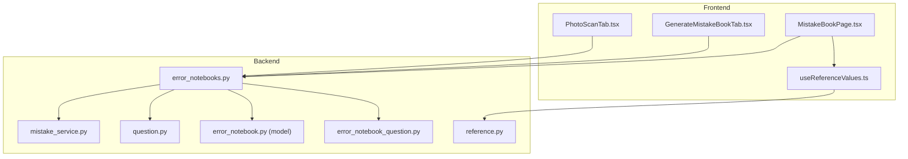
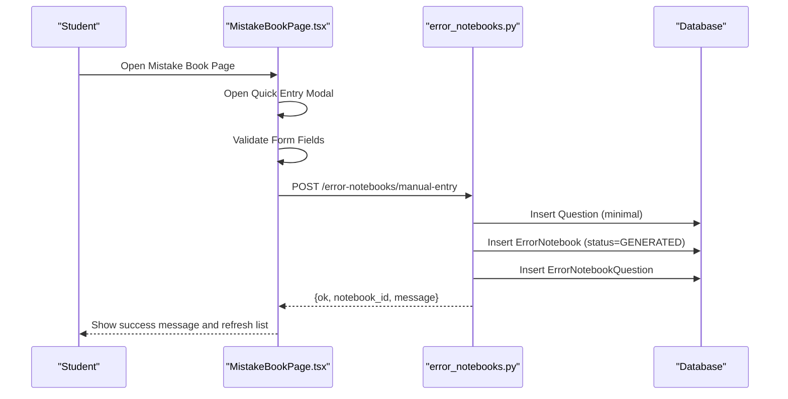
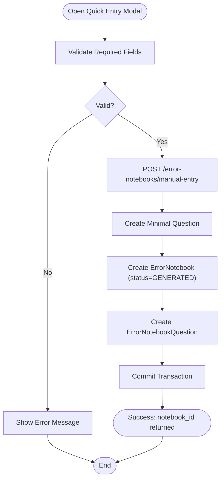
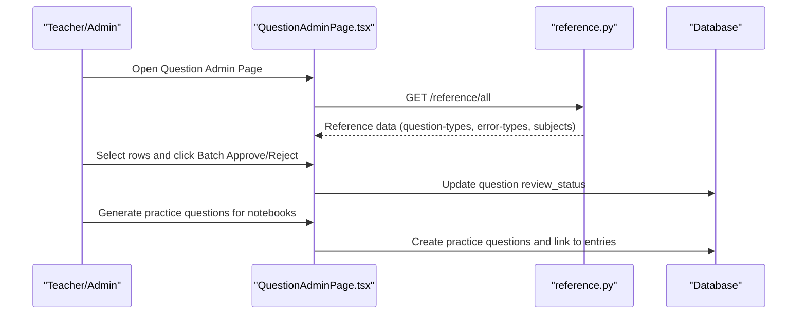
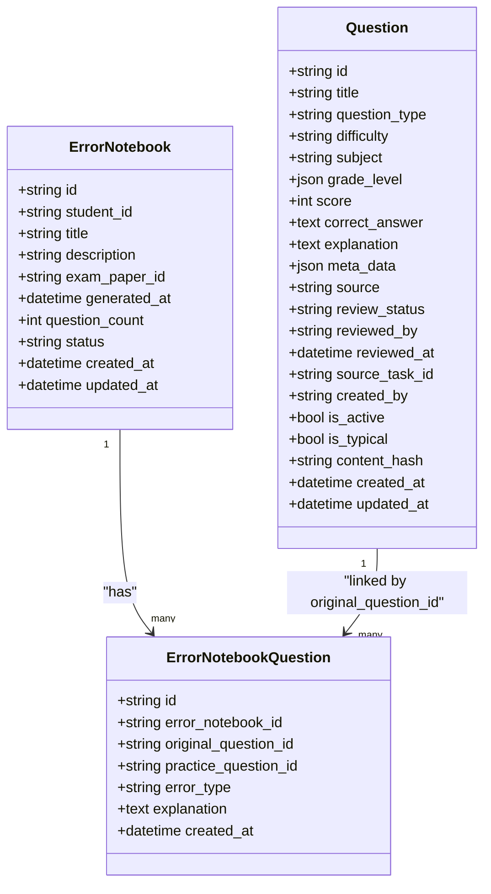
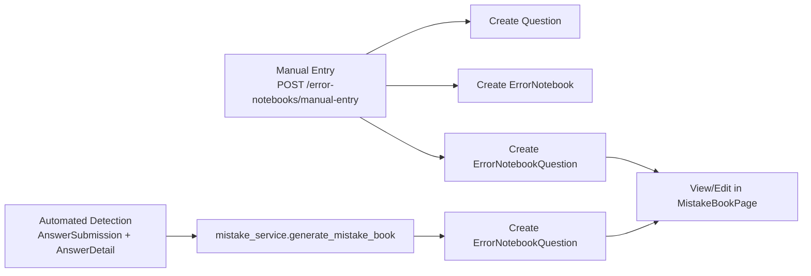
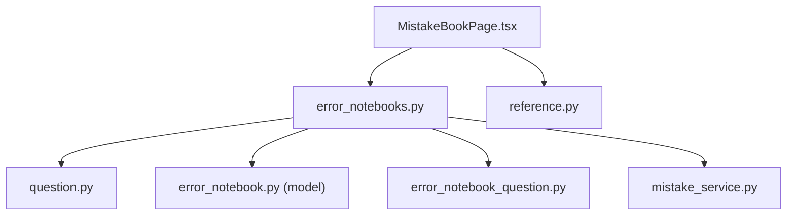

# Manual Entry Process

<cite>
**Referenced Files in This Document**
- [error_notebooks.py](file://backend/app/api/v1/endpoints/error_notebooks.py)
- [MistakeBookPage.tsx](file://frontend/src/pages/mistake-book/MistakeBookPage.tsx)
- [GenerateMistakeBookTab.tsx](file://frontend/src/pages/exam-mistakes/GenerateMistakeBookTab.tsx)
- [PhotoScanTab.tsx](file://frontend/src/pages/exam-mistakes/PhotoScanTab.tsx)
- [error_notebook.py](file://backend/app/schemas/error_notebook.py)
- [error_notebook.py](file://backend/app/models/error_notebook.py)
- [error_notebook_question.py](file://backend/app/models/error_notebook_question.py)
- [question.py](file://backend/app/models/question.py)
- [useReferenceValues.ts](file://frontend/src/hooks/useReferenceValues.ts)
- [reference.py](file://backend/app/api/v1/endpoints/reference.py)
- [QuestionAdminPage.tsx](file://frontend/src/pages/admin/QuestionAdminPage.tsx)
- [mistake_service.py](file://backend/app/services/mistake_service.py)
</cite>

## Table of Contents
1. [Introduction](#introduction)
2. [Project Structure](#project-structure)
3. [Core Components](#core-components)
4. [Architecture Overview](#architecture-overview)
5. [Detailed Component Analysis](#detailed-component-analysis)
6. [Dependency Analysis](#dependency-analysis)
7. [Performance Considerations](#performance-considerations)
8. [Troubleshooting Guide](#troubleshooting-guide)
9. [Conclusion](#conclusion)

## Introduction
This document explains the manual error entry process for students and administrators. It covers:
- Student-driven manual entry workflow via the web interface
- Form-based input capturing question details, student answers, and error classifications
- Validation rules and integration with error notebook generation
- Teacher and administrator correction workflows, including bulk editing and approval processes
- Step-by-step user guides, form field descriptions, error handling, and the relationship between manual entries and automated detection results

## Project Structure
The manual error entry spans frontend UI components and backend APIs:
- Frontend pages for mistake book management and OCR scanning
- Backend endpoints for manual entry, notebook generation, and practice question creation
- Shared reference data for question types, difficulty levels, error types, and subjects
- Data models for error notebooks, notebook questions, and questions

**Diagram sources**
- [MistakeBookPage.tsx:13-637](file://frontend/src/pages/mistake-book/MistakeBookPage.tsx#L13-L637)
- [GenerateMistakeBookTab.tsx:9-131](file://frontend/src/pages/exam-mistakes/GenerateMistakeBookTab.tsx#L9-L131)
- [PhotoScanTab.tsx:11-186](file://frontend/src/pages/exam-mistakes/PhotoScanTab.tsx#L11-L186)
- [useReferenceValues.ts:47-84](file://frontend/src/hooks/useReferenceValues.ts#L47-L84)
- [error_notebooks.py:22-437](file://backend/app/api/v1/endpoints/error_notebooks.py#L22-L437)
- [mistake_service.py:46-75](file://backend/app/services/mistake_service.py#L46-L75)
- [question.py:10-46](file://backend/app/models/question.py#L10-L46)
- [error_notebook.py:8-32](file://backend/app/models/error_notebook.py#L8-L32)
- [error_notebook_question.py:8-29](file://backend/app/models/error_notebook_question.py#L8-L29)
- [reference.py:33-43](file://backend/app/api/v1/endpoints/reference.py#L33-L43)

**Section sources**
- [MistakeBookPage.tsx:13-637](file://frontend/src/pages/mistake-book/MistakeBookPage.tsx#L13-L637)
- [error_notebooks.py:22-437](file://backend/app/api/v1/endpoints/error_notebooks.py#L22-L437)

## Core Components
- Manual entry endpoint: Creates a minimal question and an error notebook with a single entry
- Mistake book page: Provides quick entry modal, batch operations, and integration with OCR scanning
- Reference data: Supplies selectable lists for question types, difficulty levels, error types, and subjects
- Data models: Define the structure and constraints for error notebooks, entries, and questions

**Section sources**
- [error_notebooks.py:389-436](file://backend/app/api/v1/endpoints/error_notebooks.py#L389-L436)
- [MistakeBookPage.tsx:574-633](file://frontend/src/pages/mistake-book/MistakeBookPage.tsx#L574-L633)
- [useReferenceValues.ts:47-84](file://frontend/src/hooks/useReferenceValues.ts#L47-L84)
- [error_notebook.py:8-32](file://backend/app/models/error_notebook.py#L8-L32)
- [error_notebook_question.py:8-29](file://backend/app/models/error_notebook_question.py#L8-L29)
- [question.py:10-46](file://backend/app/models/question.py#L10-L46)

## Architecture Overview
The manual entry process follows a clear flow:
- Student opens the mistake book page and clicks "快速录入" (Quick Entry)
- The frontend validates the form and posts to the manual entry endpoint
- The backend creates a Question, an ErrorNotebook, and an ErrorNotebookQuestion
- The notebook is marked as GENERATED and notifications may be sent
- Teachers/administrators can later review, approve, or generate practice questions

**Diagram sources**
- [MistakeBookPage.tsx:221-237](file://frontend/src/pages/mistake-book/MistakeBookPage.tsx#L221-L237)
- [error_notebooks.py:389-436](file://backend/app/api/v1/endpoints/error_notebooks.py#L389-L436)

## Detailed Component Analysis

### Student Manual Entry Workflow
- UI: The quick entry modal collects question_title, subject, question_type, error_type, student_answer, and correct_answer
- Validation: The frontend enforces required fields for question_title
- Submission: On submit, the frontend calls the manual entry endpoint and displays feedback
- Backend behavior: Creates a minimal Question, an ErrorNotebook with status GENERATED, and an ErrorNotebookQuestion linking them

**Diagram sources**
- [MistakeBookPage.tsx:599-633](file://frontend/src/pages/mistake-book/MistakeBookPage.tsx#L599-L633)
- [error_notebooks.py:389-436](file://backend/app/api/v1/endpoints/error_notebooks.py#L389-L436)

**Section sources**
- [MistakeBookPage.tsx:574-633](file://frontend/src/pages/mistake-book/MistakeBookPage.tsx#L574-L633)
- [error_notebooks.py:389-436](file://backend/app/api/v1/endpoints/error_notebooks.py#L389-L436)

### Teacher/Administrator Correction and Bulk Editing
- Review pending questions: Administrators can review and approve/reject questions via the Question Admin page
- Bulk operations: Approve/reject multiple questions at once
- Practice generation: Teachers/admins can generate practice questions for mistakes in notebooks
- Status transitions: Questions move from PENDING to APPROVED/REJECTED; notebooks can be exported or printed

**Diagram sources**
- [QuestionAdminPage.tsx:399-545](file://frontend/src/pages/admin/QuestionAdminPage.tsx#L399-L545)
- [reference.py:33-43](file://backend/app/api/v1/endpoints/reference.py#L33-L43)

**Section sources**
- [QuestionAdminPage.tsx:399-545](file://frontend/src/pages/admin/QuestionAdminPage.tsx#L399-L545)
- [reference.py:33-43](file://backend/app/api/v1/endpoints/reference.py#L33-L43)

### Data Model Relationships
The manual entry creates three related entities with constraints ensuring referential integrity and data quality.

**Diagram sources**
- [error_notebook.py:8-32](file://backend/app/models/error_notebook.py#L8-L32)
- [error_notebook_question.py:8-29](file://backend/app/models/error_notebook_question.py#L8-L29)
- [question.py:10-46](file://backend/app/models/question.py#L10-L46)

**Section sources**
- [error_notebook.py:8-32](file://backend/app/models/error_notebook.py#L8-L32)
- [error_notebook_question.py:8-29](file://backend/app/models/error_notebook_question.py#L8-L29)
- [question.py:10-46](file://backend/app/models/question.py#L10-L46)

### Relationship Between Manual Entries and Automated Detection
- Manual entries bypass OCR/automated detection and directly create a Question and ErrorNotebook
- Automated generation uses AnswerSubmission and AnswerDetail to classify mistakes and enrich entries
- Both paths produce ErrorNotebookQuestion entries that can be viewed and printed uniformly

**Diagram sources**
- [mistake_service.py:46-75](file://backend/app/services/mistake_service.py#L46-L75)
- [error_notebooks.py:389-436](file://backend/app/api/v1/endpoints/error_notebooks.py#L389-L436)

**Section sources**
- [mistake_service.py:46-75](file://backend/app/services/mistake_service.py#L46-L75)
- [error_notebooks.py:389-436](file://backend/app/api/v1/endpoints/error_notebooks.py#L389-L436)

## Dependency Analysis
- Frontend depends on reference data for form options
- Manual entry endpoint requires STUDENT role and creates minimal Question data
- Notebook retrieval enriches entries with question metadata and student answers
- Practice generation relies on LLM service and links practice questions to entries

**Diagram sources**
- [MistakeBookPage.tsx:13-637](file://frontend/src/pages/mistake-book/MistakeBookPage.tsx#L13-L637)
- [error_notebooks.py:22-437](file://backend/app/api/v1/endpoints/error_notebooks.py#L22-L437)
- [reference.py:33-43](file://backend/app/api/v1/endpoints/reference.py#L33-L43)
- [question.py:10-46](file://backend/app/models/question.py#L10-L46)
- [error_notebook.py:8-32](file://backend/app/models/error_notebook.py#L8-L32)
- [error_notebook_question.py:8-29](file://backend/app/models/error_notebook_question.py#L8-L29)
- [mistake_service.py:46-75](file://backend/app/services/mistake_service.py#L46-L75)

**Section sources**
- [MistakeBookPage.tsx:13-637](file://frontend/src/pages/mistake-book/MistakeBookPage.tsx#L13-L637)
- [error_notebooks.py:22-437](file://backend/app/api/v1/endpoints/error_notebooks.py#L22-L437)

## Performance Considerations
- Minimize database round-trips by batching operations where possible (e.g., bulk approve/reject)
- Use selective queries with indexes on student_id, status, and created_at for efficient notebook listing
- Cache reference data on the frontend to reduce repeated network requests
- Avoid heavy computations in frontend rendering; defer to backend services for LLM-based practice generation

## Troubleshooting Guide
Common issues and resolutions:
- Permission denied: Manual entry is restricted to STUDENT role; ensure the current user is a student
- Missing required fields: The frontend enforces question_title; ensure all required fields are filled
- No OCR results: Photo scan may return mock results if OCR fails; retry upload or use manual entry
- Practice generation failures: LLM service errors are caught and surfaced; check backend logs and retry
- Bulk operations: Ensure rows are selected before approving/rejecting; confirm actions via modals

**Section sources**
- [error_notebooks.py:389-436](file://backend/app/api/v1/endpoints/error_notebooks.py#L389-L436)
- [MistakeBookPage.tsx:239-265](file://frontend/src/pages/mistake-book/MistakeBookPage.tsx#L239-L265)
- [PhotoScanTab.tsx:37-61](file://frontend/src/pages/exam-mistakes/PhotoScanTab.tsx#L37-L61)

## Conclusion
The manual error entry process provides a streamlined pathway for students to log mistakes quickly, while maintaining integration with the broader error notebook ecosystem. Teachers and administrators benefit from robust review, approval, and bulk-editing capabilities, ensuring high-quality, curated content for practice and review.