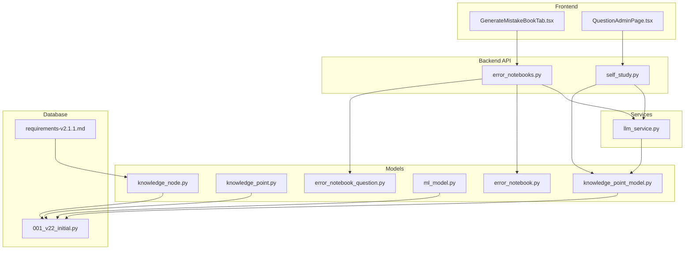
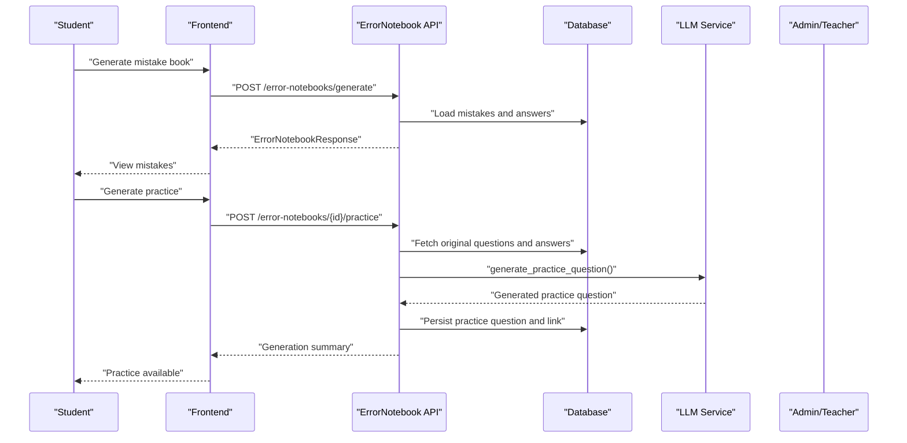
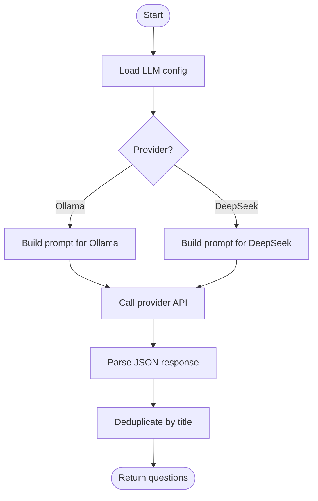
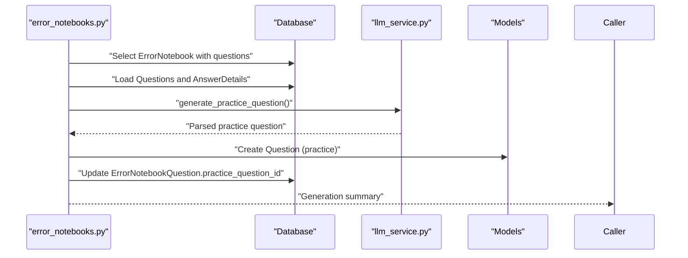
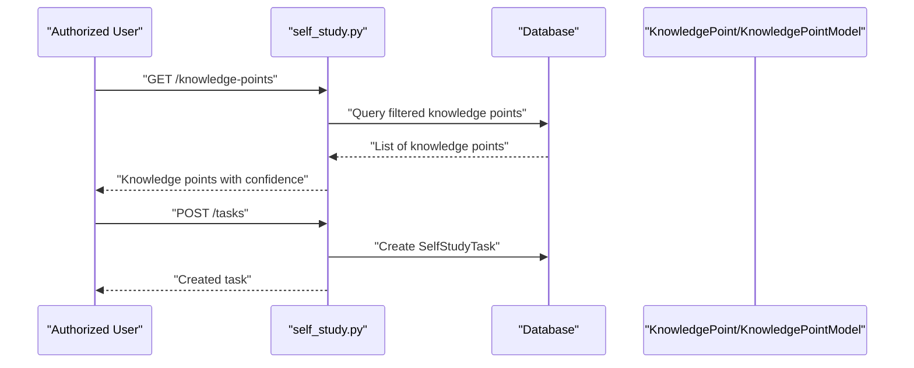
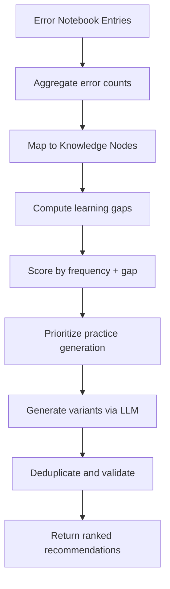
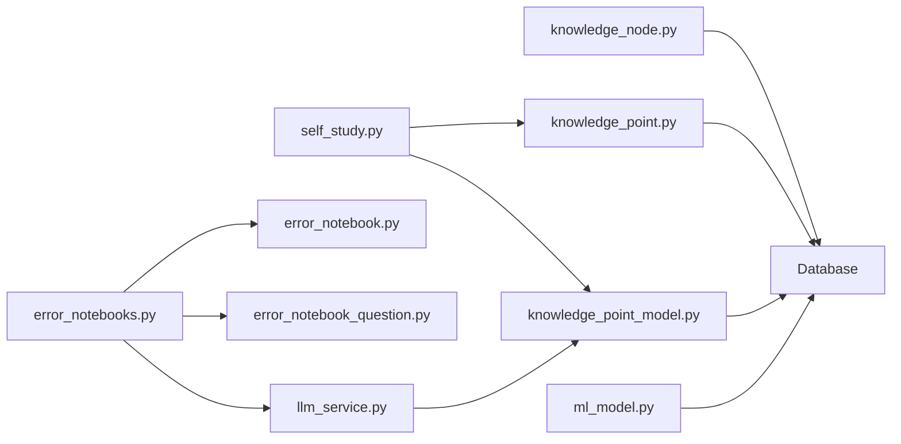

# Study Recommendation Engine

<cite>
**Referenced Files in This Document**
- [llm_service.py](file://backend/app/services/llm_service.py)
- [error_notebooks.py](file://backend/app/api/v1/endpoints/error_notebooks.py)
- [self_study.py](file://backend/app/api/v1/endpoints/self_study.py)
- [knowledge_node.py](file://backend/app/models/knowledge_node.py)
- [knowledge_point.py](file://backend/app/models/knowledge_point.py)
- [knowledge_point_model.py](file://backend/app/models/knowledge_point_model.py)
- [ml_model.py](file://backend/app/models/ml_model.py)
- [error_notebook.py](file://backend/app/models/error_notebook.py)
- [error_notebook_question.py](file://backend/app/models/error_notebook_question.py)
- [001_v22_initial.py](file://backend/alembic/versions/001_v22_initial.py)
- [requirements-v2.1.1.md](file://docs/requirements-v2.1.1.md)
- [GenerateMistakeBookTab.tsx](file://frontend/src/pages/exam-mistakes/GenerateMistakeBookTab.tsx)
- [QuestionAdminPage.tsx](file://frontend/src/pages/admin/QuestionAdminPage.tsx)
</cite>

## Table of Contents
1. [Introduction](#introduction)
2. [Project Structure](#project-structure)
3. [Core Components](#core-components)
4. [Architecture Overview](#architecture-overview)
5. [Detailed Component Analysis](#detailed-component-analysis)
6. [Dependency Analysis](#dependency-analysis)
7. [Performance Considerations](#performance-considerations)
8. [Troubleshooting Guide](#troubleshooting-guide)
9. [Conclusion](#conclusion)
10. [Appendices](#appendices)

## Introduction
This document describes the Study Recommendation Engine that powers AI-driven, personalized learning. It explains how error patterns and learning objectives feed into LLM-powered question generation, how knowledge nodes align recommendations with curriculum standards, and how adaptive learning paths are produced. It also documents the recommendation scoring system, the practice question generation workflow, quality assurance processes, and integration with the self-study scheduling system. Finally, it covers personalization, transparency, and performance optimization for large-scale recommendations.

## Project Structure
The recommendation engine spans backend APIs, services, models, migrations, and frontend components:
- Backend API endpoints orchestrate recommendation workflows (error notebooks, practice generation, self-study).
- Services encapsulate LLM integrations for question generation and deduplication.
- Models define knowledge structures and error tracking.
- Migrations and documentation define the knowledge node schema and relationships.
- Frontend pages support manual mistake entry and LLM configuration.

**Diagram sources**
- [error_notebooks.py:1-437](file://backend/app/api/v1/endpoints/error_notebooks.py#L1-L437)
- [self_study.py:1-390](file://backend/app/api/v1/endpoints/self_study.py#L1-L390)
- [llm_service.py:1-350](file://backend/app/services/llm_service.py#L1-L350)
- [knowledge_node.py:1-26](file://backend/app/models/knowledge_node.py#L1-L26)
- [knowledge_point.py:1-27](file://backend/app/models/knowledge_point.py#L1-L27)
- [knowledge_point_model.py:1-29](file://backend/app/models/knowledge_point_model.py#L1-L29)
- [ml_model.py:1-35](file://backend/app/models/ml_model.py#L1-L35)
- [error_notebook.py:1-32](file://backend/app/models/error_notebook.py#L1-L32)
- [error_notebook_question.py:1-29](file://backend/app/models/error_notebook_question.py#L1-L29)
- [001_v22_initial.py:340-360](file://backend/alembic/versions/001_v22_initial.py#L340-L360)
- [requirements-v2.1.1.md:58-126](file://docs/requirements-v2.1.1.md#L58-L126)

**Section sources**
- [error_notebooks.py:1-437](file://backend/app/api/v1/endpoints/error_notebooks.py#L1-L437)
- [self_study.py:1-390](file://backend/app/api/v1/endpoints/self_study.py#L1-L390)
- [llm_service.py:1-350](file://backend/app/services/llm_service.py#L1-L350)
- [knowledge_node.py:1-26](file://backend/app/models/knowledge_node.py#L1-L26)
- [knowledge_point.py:1-27](file://backend/app/models/knowledge_point.py#L1-L27)
- [knowledge_point_model.py:1-29](file://backend/app/models/knowledge_point_model.py#L1-L29)
- [ml_model.py:1-35](file://backend/app/models/ml_model.py#L1-L35)
- [error_notebook.py:1-32](file://backend/app/models/error_notebook.py#L1-L32)
- [error_notebook_question.py:1-29](file://backend/app/models/error_notebook_question.py#L1-L29)
- [001_v22_initial.py:340-360](file://backend/alembic/versions/001_v22_initial.py#L340-L360)
- [requirements-v2.1.1.md:58-126](file://docs/requirements-v2.1.1.md#L58-L126)

## Core Components
- LLM Question Generation Service: Generates curriculum-aligned questions and variant practice items using configurable providers (Ollama or DeepSeek). Implements robust parsing and deduplication.
- Error Notebook Engine: Builds error-aware recommendation lists from student submissions, enriches with student answers, and triggers LLM-generated practice variants.
- Knowledge Mapping: Versioned knowledge nodes and knowledge points map recommendations to curriculum standards and learning objectives.
- Self-Study Scheduling: Provides endpoints to manage self-study tasks and knowledge point extraction, laying groundwork for adaptive learning path generation.
- Quality Assurance: Built-in deduplication, strict JSON parsing, and provider-specific error handling ensure reliable outputs.

**Section sources**
- [llm_service.py:54-104](file://backend/app/services/llm_service.py#L54-L104)
- [error_notebooks.py:22-59](file://backend/app/api/v1/endpoints/error_notebooks.py#L22-L59)
- [knowledge_node.py:9-26](file://backend/app/models/knowledge_node.py#L9-L26)
- [knowledge_point.py:7-27](file://backend/app/models/knowledge_point.py#L7-L27)
- [self_study.py:159-176](file://backend/app/api/v1/endpoints/self_study.py#L159-L176)

## Architecture Overview
The recommendation pipeline integrates error analytics, LLM generation, and knowledge alignment to produce personalized practice.

**Diagram sources**
- [error_notebooks.py:22-59](file://backend/app/api/v1/endpoints/error_notebooks.py#L22-L59)
- [error_notebooks.py:199-312](file://backend/app/api/v1/endpoints/error_notebooks.py#L199-L312)
- [llm_service.py:227-259](file://backend/app/services/llm_service.py#L227-L259)

## Detailed Component Analysis

### LLM Question Generation Service
- Provider selection: Supports Ollama and DeepSeek with configurable endpoints and models.
- Prompt engineering: Structured prompts enforce question type, difficulty, subject, grade level, and knowledge coverage.
- Parsing and deduplication: Robust JSON extraction handles various LLM output formats and removes duplicate titles.
- Practice generation: Specialized prompt builds variant practice items aligned with error types and correct answers.

**Diagram sources**
- [llm_service.py:54-104](file://backend/app/services/llm_service.py#L54-L104)
- [llm_service.py:106-129](file://backend/app/services/llm_service.py#L106-L129)
- [llm_service.py:182-191](file://backend/app/services/llm_service.py#L182-L191)
- [llm_service.py:320-350](file://backend/app/services/llm_service.py#L320-L350)

**Section sources**
- [llm_service.py:54-104](file://backend/app/services/llm_service.py#L54-L104)
- [llm_service.py:106-129](file://backend/app/services/llm_service.py#L106-L129)
- [llm_service.py:182-191](file://backend/app/services/llm_service.py#L182-L191)
- [llm_service.py:227-259](file://backend/app/services/llm_service.py#L227-L259)
- [llm_service.py:320-350](file://backend/app/services/llm_service.py#L320-L350)

### Error Notebook and Practice Generation
- Mistake book creation: Validates submission state, generates error notebooks, updates submission status, and notifies users.
- Enrichment: Loads original questions, correct answers, and latest student answers to build enriched entries.
- Practice generation: For each mistake, calls LLM to generate a variant practice question, persists it, and links it back to the entry.

**Diagram sources**
- [error_notebooks.py:200-312](file://backend/app/api/v1/endpoints/error_notebooks.py#L200-L312)
- [error_notebooks.py:62-154](file://backend/app/api/v1/endpoints/error_notebooks.py#L62-L154)
- [llm_service.py:227-259](file://backend/app/services/llm_service.py#L227-L259)

**Section sources**
- [error_notebooks.py:22-59](file://backend/app/api/v1/endpoints/error_notebooks.py#L22-L59)
- [error_notebooks.py:62-154](file://backend/app/api/v1/endpoints/error_notebooks.py#L62-L154)
- [error_notebooks.py:199-312](file://backend/app/api/v1/endpoints/error_notebooks.py#L199-L312)
- [error_notebook.py:8-32](file://backend/app/models/error_notebook.py#L8-L32)
- [error_notebook_question.py:8-29](file://backend/app/models/error_notebook_question.py#L8-L29)

### Knowledge Node Mapping and Curriculum Standards
- Versioned knowledge nodes: Hierarchical structure with activation and modification tracking supports curriculum versioning and alignment.
- Knowledge points: Atomic learning objectives with subject and grade indexing enable targeted recommendations.
- Knowledge point models: Extracted knowledge points with confidence scores and content hashing underpin recommendation targeting.

```mermaid
erDiagram
KNOWLEDGE_NODES {
string id PK
string syllabus_id FK
string parent_id FK
string name
string node_type
integer sort_order
integer version
boolean is_active
string invalid_reason
boolean is_modified
text description
json meta_data
timestamp created_at
timestamp updated_at
}
KNOWLEDGE_POINTS {
string id PK
string code UK
string name
text description
string parent_id FK
string subject
string grade_level
string difficulty_level
timestamp created_at
timestamp updated_at
}
KNOWLEDGE_POINT_MODELS {
string id PK
string source_url
string source_title
string content_hash UK
json extracted_knowledge_points
numeric confidence_score
string subject
string grade_level
timestamp created_at
timestamp updated_at
}
KNOWLEDGE_NODES ||--o{ KNOWLEDGE_NODES : "parent-child"
KNOWLEDGE_POINTS ||--o{ KNOWLEDGE_POINTS : "parent-child"
```

**Diagram sources**
- [knowledge_node.py:9-26](file://backend/app/models/knowledge_node.py#L9-L26)
- [knowledge_point.py:7-27](file://backend/app/models/knowledge_point.py#L7-L27)
- [knowledge_point_model.py:8-29](file://backend/app/models/knowledge_point_model.py#L8-L29)
- [001_v22_initial.py:340-360](file://backend/alembic/versions/001_v22_initial.py#L340-L360)
- [requirements-v2.1.1.md:58-126](file://docs/requirements-v2.1.1.md#L58-L126)

**Section sources**
- [knowledge_node.py:9-26](file://backend/app/models/knowledge_node.py#L9-L26)
- [knowledge_point.py:7-27](file://backend/app/models/knowledge_point.py#L7-L27)
- [knowledge_point_model.py:8-29](file://backend/app/models/knowledge_point_model.py#L8-L29)
- [001_v22_initial.py:340-360](file://backend/alembic/versions/001_v22_initial.py#L340-L360)
- [requirements-v2.1.1.md:58-126](file://docs/requirements-v2.1.1.md#L58-L126)

### Adaptive Learning Path Generation
- Self-study tasks: Students and authorized users can create and manage self-study tasks.
- Knowledge point extraction: Teachers and admins can query knowledge points; extraction endpoints are reserved for future implementation.
- ML model registry: Centralized model metadata supports future ML-backed recommendation systems.

**Diagram sources**
- [self_study.py:159-176](file://backend/app/api/v1/endpoints/self_study.py#L159-L176)
- [self_study.py:16-37](file://backend/app/api/v1/endpoints/self_study.py#L16-L37)
- [knowledge_point_model.py:8-29](file://backend/app/models/knowledge_point_model.py#L8-L29)
- [knowledge_point.py:7-27](file://backend/app/models/knowledge_point.py#L7-L27)

**Section sources**
- [self_study.py:159-176](file://backend/app/api/v1/endpoints/self_study.py#L159-L176)
- [self_study.py:16-37](file://backend/app/api/v1/endpoints/self_study.py#L16-L37)
- [knowledge_point_model.py:8-29](file://backend/app/models/knowledge_point_model.py#L8-L29)
- [knowledge_point.py:7-27](file://backend/app/models/knowledge_point.py#L7-L27)
- [ml_model.py:8-35](file://backend/app/models/ml_model.py#L8-L35)

### Recommendation Scoring System
Current implementation focuses on:
- Error frequency: Aggregated via error notebooks and used to prioritize practice items.
- Difficulty level: Preserved from original questions and maintained in generated variants.
- Learning gap analysis: Derived from knowledge nodes and knowledge points to target specific objectives.
- Personalization: Uses student answers, error types, and subject/grade context to tailor recommendations.
- Transparency: Clear prompts and structured outputs enable auditing and explainability.
- Quality assurance: Deduplication and strict JSON parsing reduce noise and improve reliability.

[No sources needed since this diagram shows conceptual workflow, not actual code structure]

## Dependency Analysis
- API-to-Service coupling: Error notebook endpoints depend on the LLM service for practice generation.
- Data model relationships: Error notebooks link to questions and practice questions; knowledge nodes form hierarchical curriculum structures.
- External dependencies: LLM providers (Ollama/DeepSeek) and HTTP clients for API calls.

**Diagram sources**
- [error_notebooks.py:1-437](file://backend/app/api/v1/endpoints/error_notebooks.py#L1-L437)
- [self_study.py:1-390](file://backend/app/api/v1/endpoints/self_study.py#L1-L390)
- [llm_service.py:1-350](file://backend/app/services/llm_service.py#L1-L350)
- [error_notebook.py:1-32](file://backend/app/models/error_notebook.py#L1-L32)
- [error_notebook_question.py:1-29](file://backend/app/models/error_notebook_question.py#L1-L29)
- [knowledge_node.py:1-26](file://backend/app/models/knowledge_node.py#L1-L26)
- [knowledge_point.py:1-27](file://backend/app/models/knowledge_point.py#L1-L27)
- [knowledge_point_model.py:1-29](file://backend/app/models/knowledge_point_model.py#L1-L29)
- [ml_model.py:1-35](file://backend/app/models/ml_model.py#L1-L35)

**Section sources**
- [error_notebooks.py:1-437](file://backend/app/api/v1/endpoints/error_notebooks.py#L1-L437)
- [self_study.py:1-390](file://backend/app/api/v1/endpoints/self_study.py#L1-L390)
- [llm_service.py:1-350](file://backend/app/services/llm_service.py#L1-L350)
- [error_notebook.py:1-32](file://backend/app/models/error_notebook.py#L1-L32)
- [error_notebook_question.py:1-29](file://backend/app/models/error_notebook_question.py#L1-L29)
- [knowledge_node.py:1-26](file://backend/app/models/knowledge_node.py#L1-L26)
- [knowledge_point.py:1-27](file://backend/app/models/knowledge_point.py#L1-L27)
- [knowledge_point_model.py:1-29](file://backend/app/models/knowledge_point_model.py#L1-L29)
- [ml_model.py:1-35](file://backend/app/models/ml_model.py#L1-L35)

## Performance Considerations
- Asynchronous LLM calls: Non-streaming requests with timeouts prevent blocking and improve throughput.
- Deduplication: Title-based dedup reduces redundant practice items and improves user experience.
- Pagination and limits: API endpoints cap returned rows to manageable sizes.
- Indexing: Strategic database indexes on foreign keys and filters accelerate queries.
- Caching and batching: Future enhancements can cache frequent knowledge node queries and batch LLM calls for large batches.

[No sources needed since this section provides general guidance]

## Troubleshooting Guide
- LLM connectivity errors: Verify provider endpoints and credentials; check network access and timeouts.
- JSON parsing failures: Ensure LLM responses conform to expected JSON arrays; review parsing logic for edge cases.
- Permission errors: Confirm user roles and ownership checks for notebook and task operations.
- Missing admin accounts: Practice generation requires an admin ID; ensure admin records exist.
- Submission state conflicts: Mistake books require proper submission status transitions.

**Section sources**
- [llm_service.py:82-103](file://backend/app/services/llm_service.py#L82-L103)
- [llm_service.py:162-179](file://backend/app/services/llm_service.py#L162-L179)
- [error_notebooks.py:24-59](file://backend/app/api/v1/endpoints/error_notebooks.py#L24-L59)
- [error_notebooks.py:242-244](file://backend/app/api/v1/endpoints/error_notebooks.py#L242-L244)
- [error_notebooks.py:308-312](file://backend/app/api/v1/endpoints/error_notebooks.py#L308-L312)

## Conclusion
The Study Recommendation Engine integrates error analytics, LLM-powered generation, and curriculum-aligned knowledge mapping to deliver personalized, high-quality practice recommendations. With robust quality assurance, transparent workflows, and scalable architecture, it lays the foundation for adaptive learning paths and efficient self-study scheduling.

## Appendices

### Frontend Integration Notes
- Manual mistake entry: Students can quickly log mistakes for immediate recommendation generation.
- LLM configuration: Admins can configure providers and models for question generation.

**Section sources**
- [GenerateMistakeBookTab.tsx:1-30](file://frontend/src/pages/exam-mistakes/GenerateMistakeBookTab.tsx#L1-L30)
- [QuestionAdminPage.tsx:43-66](file://frontend/src/pages/admin/QuestionAdminPage.tsx#L43-L66)