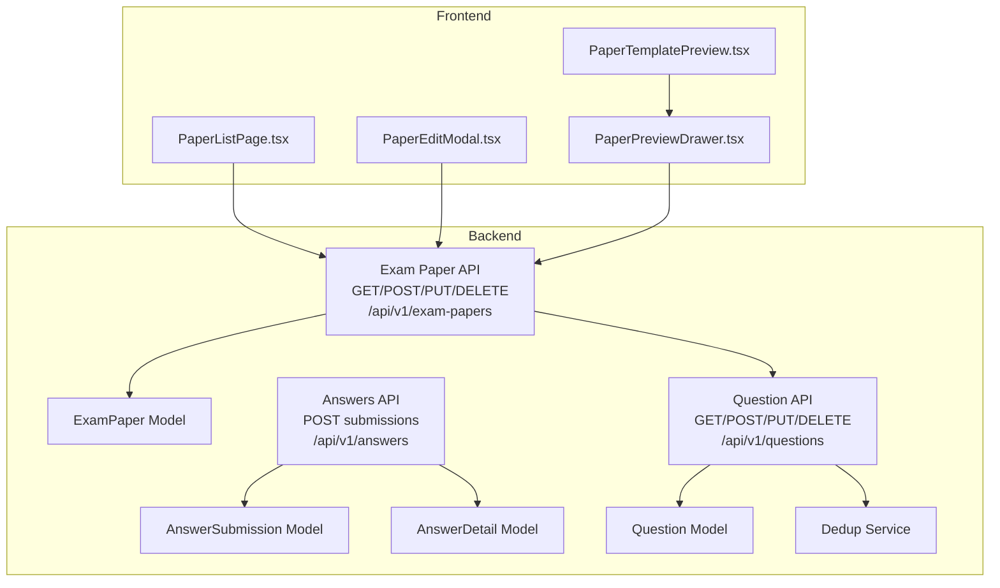
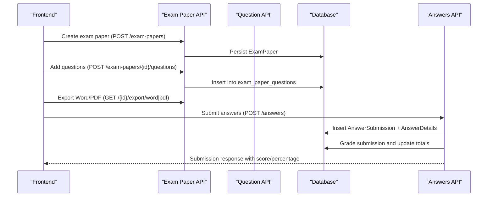
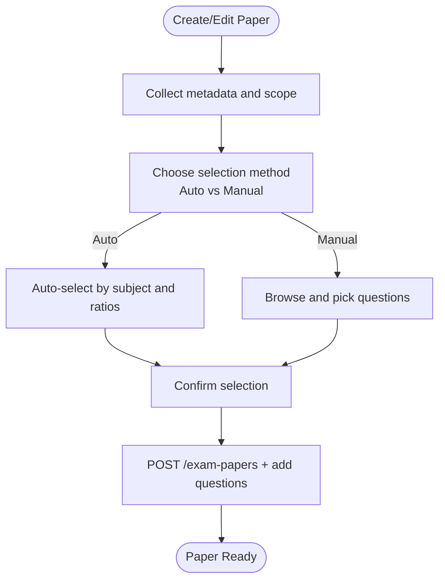
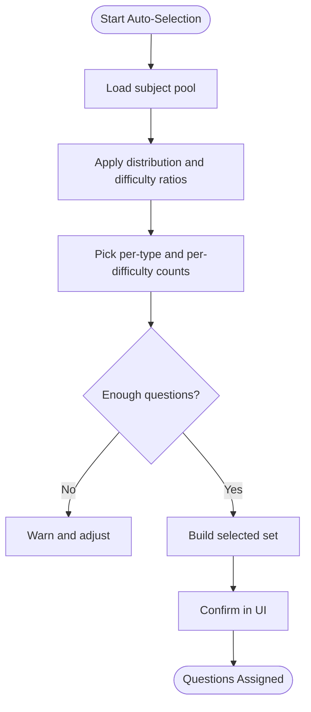
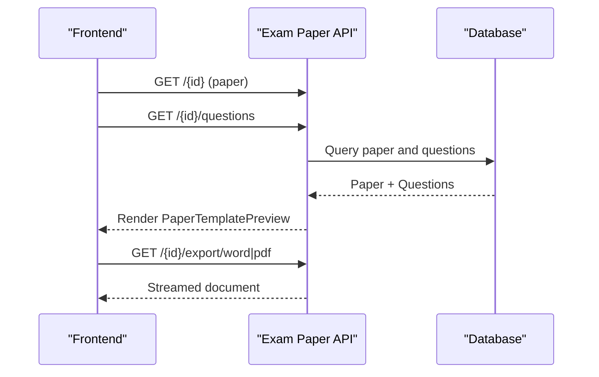
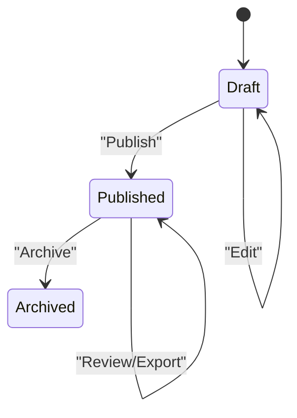
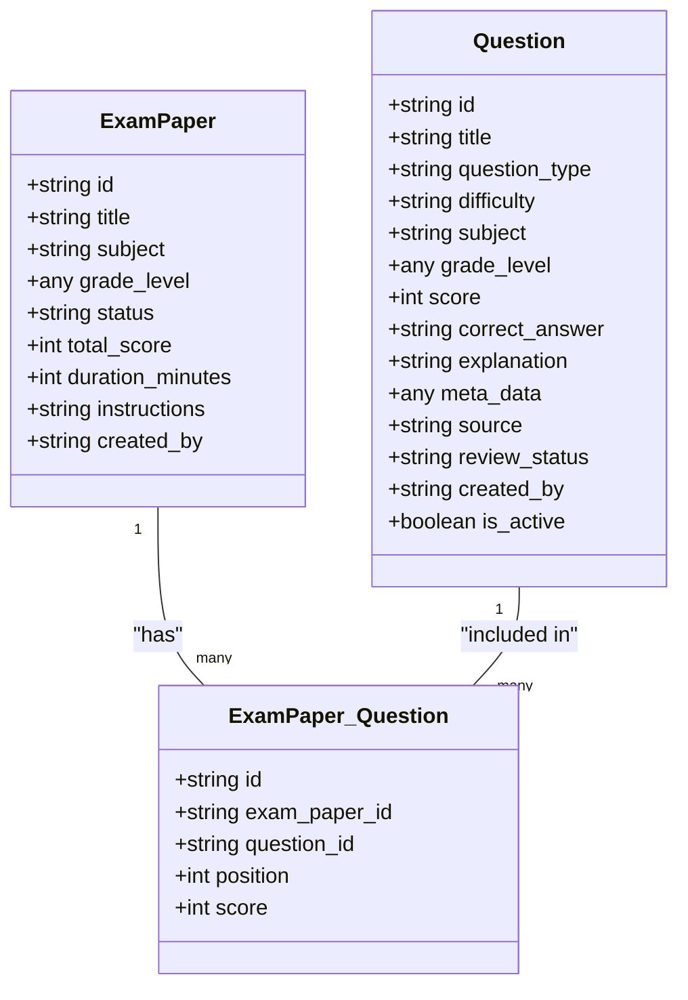
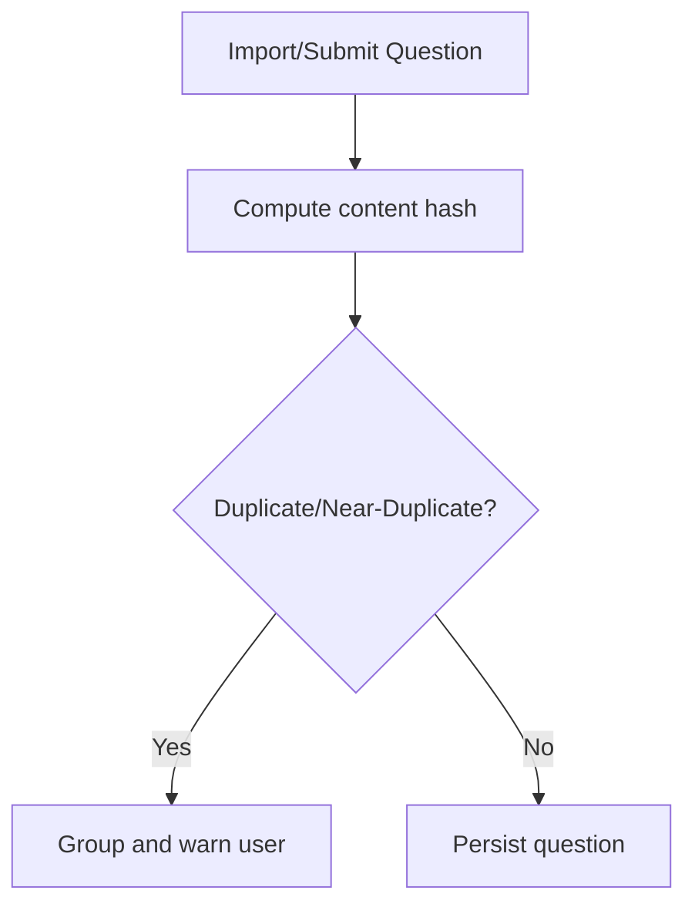
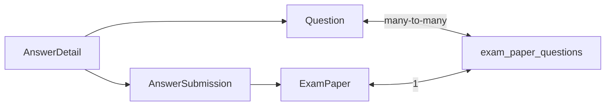

# Exam Administration

<cite>
**Referenced Files in This Document**
- [backend/app/models/exam_paper.py](file://backend/app/models/exam_paper.py)
- [backend/app/schemas/exam_paper.py](file://backend/app/schemas/exam_paper.py)
- [backend/app/api/v1/endpoints/exam_papers.py](file://backend/app/api/v1/endpoints/exam_papers.py)
- [backend/app/models/question.py](file://backend/app/models/question.py)
- [backend/app/schemas/question.py](file://backend/app/schemas/question.py)
- [backend/app/api/v1/endpoints/questions.py](file://backend/app/api/v1/endpoints/questions.py)
- [backend/app/models/answer_submission.py](file://backend/app/models/answer_submission.py)
- [backend/app/models/answer_detail.py](file://backend/app/models/answer_detail.py)
- [backend/app/api/v1/endpoints/answers.py](file://backend/app/api/v1/endpoints/answers.py)
- [backend/app/services/dedup_service.py](file://backend/app/services/dedup_service.py)
- [frontend/src/pages/papers/PaperListPage.tsx](file://frontend/src/pages/papers/PaperListPage.tsx)
- [frontend/src/pages/papers/PaperEditModal.tsx](file://frontend/src/pages/papers/PaperEditModal.tsx)
- [frontend/src/pages/papers/PaperPreviewDrawer.tsx](file://frontend/src/pages/papers/PaperPreviewDrawer.tsx)
- [frontend/src/pages/papers/PaperTemplatePreview.tsx](file://frontend/src/pages/papers/PaperTemplatePreview.tsx)
- [docs/database-design.md](file://docs/database-design.md)
</cite>

## Table of Contents
1. [Introduction](#introduction)
2. [Project Structure](#project-structure)
3. [Core Components](#core-components)
4. [Architecture Overview](#architecture-overview)
5. [Detailed Component Analysis](#detailed-component-analysis)
6. [Dependency Analysis](#dependency-analysis)
7. [Performance Considerations](#performance-considerations)
8. [Troubleshooting Guide](#troubleshooting-guide)
9. [Conclusion](#conclusion)
10. [Appendices](#appendices)

## Introduction
This document describes the complete exam administration lifecycle, from creation to completion, with a focus on exam paper creation, question assignment, template management, publishing workflow, timing controls, instruction management, status management, question randomization, scheduling, integration with the question management system, exam paper validation, and duplicate prevention. It also documents the frontend interfaces for exam creation, question assignment, and paper preview, and provides examples of exam setup workflows, question assignment strategies, and best practices.

## Project Structure
The exam administration system spans backend APIs and models, a dedicated question management subsystem, and frontend pages for authoring and previewing exams.

**Diagram sources**
- [backend/app/api/v1/endpoints/exam_papers.py:1-844](file://backend/app/api/v1/endpoints/exam_papers.py#L1-L844)
- [backend/app/api/v1/endpoints/questions.py:1-431](file://backend/app/api/v1/endpoints/questions.py#L1-L431)
- [backend/app/api/v1/endpoints/answers.py:1-421](file://backend/app/api/v1/endpoints/answers.py#L1-L421)
- [backend/app/models/exam_paper.py:1-51](file://backend/app/models/exam_paper.py#L1-L51)
- [backend/app/models/question.py:1-46](file://backend/app/models/question.py#L1-L46)
- [backend/app/models/answer_submission.py:1-37](file://backend/app/models/answer_submission.py#L1-L37)
- [backend/app/models/answer_detail.py:1-33](file://backend/app/models/answer_detail.py#L1-L33)
- [backend/app/services/dedup_service.py:1-127](file://backend/app/services/dedup_service.py#L1-L127)
- [frontend/src/pages/papers/PaperListPage.tsx:1-169](file://frontend/src/pages/papers/PaperListPage.tsx#L1-L169)
- [frontend/src/pages/papers/PaperEditModal.tsx:1-497](file://frontend/src/pages/papers/PaperEditModal.tsx#L1-L497)
- [frontend/src/pages/papers/PaperPreviewDrawer.tsx:1-59](file://frontend/src/pages/papers/PaperPreviewDrawer.tsx#L1-L59)
- [frontend/src/pages/papers/PaperTemplatePreview.tsx:1-132](file://frontend/src/pages/papers/PaperTemplatePreview.tsx#L1-L132)

**Section sources**
- [backend/app/api/v1/endpoints/exam_papers.py:1-844](file://backend/app/api/v1/endpoints/exam_papers.py#L1-L844)
- [backend/app/api/v1/endpoints/questions.py:1-431](file://backend/app/api/v1/endpoints/questions.py#L1-L431)
- [frontend/src/pages/papers/PaperListPage.tsx:1-169](file://frontend/src/pages/papers/PaperListPage.tsx#L1-L169)

## Core Components
- ExamPaper: Represents an exam paper with metadata (title, subject, grade scope, total score, duration), status, instructions, and many-to-many relationship with Question via an association table.
- Question: Represents a question with type, difficulty, subject, grade scope, score, correct answer, explanation, and metadata.
- AnswerSubmission and AnswerDetail: Track student submissions, statuses, scores, and per-question details.
- Exam Paper API: Provides CRUD, question assignment, sorting, export (Word/PDF), and review endpoints.
- Question API: Provides search, batch import, export, and filtering by subject/grade/scope/type/difficulty.
- Frontend Pages: PaperListPage, PaperEditModal, PaperPreviewDrawer, PaperTemplatePreview for authoring and previewing.

**Section sources**
- [backend/app/models/exam_paper.py:23-51](file://backend/app/models/exam_paper.py#L23-L51)
- [backend/app/schemas/exam_paper.py:7-42](file://backend/app/schemas/exam_paper.py#L7-L42)
- [backend/app/models/question.py:10-46](file://backend/app/models/question.py#L10-L46)
- [backend/app/schemas/question.py:7-52](file://backend/app/schemas/question.py#L7-L52)
- [backend/app/models/answer_submission.py:9-37](file://backend/app/models/answer_submission.py#L9-L37)
- [backend/app/models/answer_detail.py:9-33](file://backend/app/models/answer_detail.py#L9-L33)
- [backend/app/api/v1/endpoints/exam_papers.py:20-844](file://backend/app/api/v1/endpoints/exam_papers.py#L20-L844)
- [backend/app/api/v1/endpoints/questions.py:17-200](file://backend/app/api/v1/endpoints/questions.py#L17-L200)

## Architecture Overview
The system separates concerns across models, schemas, and endpoints, with the frontend interacting with the backend via REST APIs. The exam lifecycle is orchestrated by:
- Authoring: Paper creation and question assignment via PaperEditModal and PaperListPage.
- Validation: Backend validates schema fields and constraints; question deduplication service supports duplicate prevention.
- Publishing: Status transitions and export/printing via PaperListPage and PaperEditModal.
- Submission and Grading: Students submit answers; backend auto-grades and generates notifications and mistake books.

**Diagram sources**
- [backend/app/api/v1/endpoints/exam_papers.py:20-844](file://backend/app/api/v1/endpoints/exam_papers.py#L20-L844)
- [backend/app/api/v1/endpoints/questions.py:17-200](file://backend/app/api/v1/endpoints/questions.py#L17-L200)
- [backend/app/api/v1/endpoints/answers.py:115-196](file://backend/app/api/v1/endpoints/answers.py#L115-L196)

## Detailed Component Analysis

### Exam Paper Creation and Management
- Creation: PaperEditModal collects basic info (title, subject, status, total score, duration, grade scope, notes), computes derived stats, and submits to backend. The backend enforces permissions and persists the paper and optional inline question imports.
- Update/Delete: Authorized users can update or delete papers; deletion cascades associated associations and submissions.
- Listing and Filtering: PaperListPage queries papers with filters (title, status, scope, grade, keyword) and displays question counts.

**Diagram sources**
- [frontend/src/pages/papers/PaperEditModal.tsx:69-187](file://frontend/src/pages/papers/PaperEditModal.tsx#L69-L187)
- [backend/app/api/v1/endpoints/exam_papers.py:20-64](file://backend/app/api/v1/endpoints/exam_papers.py#L20-L64)

**Section sources**
- [frontend/src/pages/papers/PaperEditModal.tsx:69-187](file://frontend/src/pages/papers/PaperEditModal.tsx#L69-L187)
- [backend/app/api/v1/endpoints/exam_papers.py:20-64](file://backend/app/api/v1/endpoints/exam_papers.py#L20-L64)

### Question Assignment Algorithms
- Auto-selection strategy:
  - Load subject pool up to a limit.
  - For each question type, compute counts per difficulty based on configured ratios.
  - Pick from the pool ensuring no duplication and respecting type/level limits.
- Manual selection:
  - Browse questions by type and difficulty, add/remove selections, and confirm.
- Positioning and scoring:
  - Questions are inserted with position and score; sorting and removal endpoints are present but placeholders in current implementation.

**Diagram sources**
- [frontend/src/pages/papers/PaperEditModal.tsx:98-137](file://frontend/src/pages/papers/PaperEditModal.tsx#L98-L137)
- [backend/app/api/v1/endpoints/exam_papers.py:416-471](file://backend/app/api/v1/endpoints/exam_papers.py#L416-L471)

**Section sources**
- [frontend/src/pages/papers/PaperEditModal.tsx:98-137](file://frontend/src/pages/papers/PaperEditModal.tsx#L98-L137)
- [backend/app/api/v1/endpoints/exam_papers.py:416-471](file://backend/app/api/v1/endpoints/exam_papers.py#L416-L471)

### Template Management and Preview
- PaperTemplatePreview renders a structured preview grouped by question type with indices, scores, difficulty tags, and placeholders for fill-in-the-blank and subjective formats.
- PaperPreviewDrawer loads paper and questions and renders read-only previews.
- Export: Word and PDF exports are supported via GET endpoints that stream documents.

**Diagram sources**
- [frontend/src/pages/papers/PaperPreviewDrawer.tsx:21-40](file://frontend/src/pages/papers/PaperPreviewDrawer.tsx#L21-L40)
- [frontend/src/pages/papers/PaperTemplatePreview.tsx:15-132](file://frontend/src/pages/papers/PaperTemplatePreview.tsx#L15-L132)
- [backend/app/api/v1/endpoints/exam_papers.py:566-736](file://backend/app/api/v1/endpoints/exam_papers.py#L566-L736)

**Section sources**
- [frontend/src/pages/papers/PaperTemplatePreview.tsx:15-132](file://frontend/src/pages/papers/PaperTemplatePreview.tsx#L15-L132)
- [frontend/src/pages/papers/PaperPreviewDrawer.tsx:21-40](file://frontend/src/pages/papers/PaperPreviewDrawer.tsx#L21-L40)
- [backend/app/api/v1/endpoints/exam_papers.py:566-736](file://backend/app/api/v1/endpoints/exam_papers.py#L566-L736)

### Publishing Workflow, Timing Controls, and Instructions
- Status management: Papers support DRAFT, PUBLISHED, ARCHIVED; the frontend exposes status selection during creation/editing.
- Instructions: Notes and descriptions are stored with the paper and rendered in previews and exports.
- Timing controls: Duration is captured as minutes; the Answers API sets submission timestamps and grading completion timestamps.

**Diagram sources**
- [backend/app/models/exam_paper.py:31-48](file://backend/app/models/exam_paper.py#L31-L48)
- [backend/app/schemas/exam_paper.py:11-16](file://backend/app/schemas/exam_paper.py#L11-L16)
- [backend/app/api/v1/endpoints/answers.py:129-136](file://backend/app/api/v1/endpoints/answers.py#L129-L136)

**Section sources**
- [backend/app/models/exam_paper.py:31-48](file://backend/app/models/exam_paper.py#L31-L48)
- [backend/app/schemas/exam_paper.py:11-16](file://backend/app/schemas/exam_paper.py#L11-L16)
- [backend/app/api/v1/endpoints/answers.py:129-136](file://backend/app/api/v1/endpoints/answers.py#L129-L136)

### Question Randomization and Scheduling
- Randomization: The database design includes an is_randomized flag on exam papers; however, the current exam paper endpoints do not expose randomization controls or selection logic. Implementations should honor this flag when selecting questions.
- Scheduling: There is no explicit exam scheduling endpoint in the exam papers module. Scheduling could be introduced as a future extension to publish at a future time or repeat periodically.

[No sources needed since this section provides general guidance]

### Integration with Question Management System
- Question search and filtering: The Question API supports subject/grade/scope/type/difficulty filters and keyword matching.
- Batch import/export: Supports bulk operations for question management.
- Deduplication: A SimHash-based deduplication service computes content hashes and detects duplicates or near-duplicates.

**Diagram sources**
- [backend/app/models/question.py:10-46](file://backend/app/models/question.py#L10-L46)
- [backend/app/models/exam_paper.py:23-51](file://backend/app/models/exam_paper.py#L23-L51)
- [docs/database-design.md:182-199](file://docs/database-design.md#L182-L199)

**Section sources**
- [backend/app/api/v1/endpoints/questions.py:39-104](file://backend/app/api/v1/endpoints/questions.py#L39-L104)
- [backend/app/api/v1/endpoints/questions.py:127-156](file://backend/app/api/v1/endpoints/questions.py#L127-L156)
- [backend/app/services/dedup_service.py:55-127](file://backend/app/services/dedup_service.py#L55-L127)

### Exam Paper Validation and Duplicate Prevention
- Backend validation: Pydantic schemas enforce field constraints; database constraints ensure non-negative scores and valid enums.
- Duplicate prevention: The dedup service computes content hashes and groups similar questions; content_hash is also present on the Question model.

**Diagram sources**
- [backend/app/services/dedup_service.py:55-127](file://backend/app/services/dedup_service.py#L55-L127)
- [backend/app/models/question.py:31-31](file://backend/app/models/question.py#L31-L31)

**Section sources**
- [backend/app/schemas/exam_paper.py:7-17](file://backend/app/schemas/exam_paper.py#L7-L17)
- [backend/app/schemas/question.py:7-18](file://backend/app/schemas/question.py#L7-L18)
- [backend/app/models/exam_paper.py:44-48](file://backend/app/models/exam_paper.py#L44-L48)
- [backend/app/models/question.py:38-43](file://backend/app/models/question.py#L38-L43)
- [backend/app/services/dedup_service.py:55-127](file://backend/app/services/dedup_service.py#L55-L127)

### Frontend Interfaces for Exam Creation, Question Assignment, and Preview
- PaperListPage: Lists papers, filters by status/grade/scope/keyword, and provides actions (preview, export Word/PDF, print, delete).
- PaperEditModal: Multi-step wizard for creating papers, choosing selection method, browsing and selecting questions, and previewing the final structure.
- PaperPreviewDrawer and PaperTemplatePreview: Display read-only previews and structured templates.

**Section sources**
- [frontend/src/pages/papers/PaperListPage.tsx:31-95](file://frontend/src/pages/papers/PaperListPage.tsx#L31-L95)
- [frontend/src/pages/papers/PaperEditModal.tsx:69-187](file://frontend/src/pages/papers/PaperEditModal.tsx#L69-L187)
- [frontend/src/pages/papers/PaperPreviewDrawer.tsx:21-40](file://frontend/src/pages/papers/PaperPreviewDrawer.tsx#L21-L40)
- [frontend/src/pages/papers/PaperTemplatePreview.tsx:15-132](file://frontend/src/pages/papers/PaperTemplatePreview.tsx#L15-L132)

### Examples and Best Practices
- Example workflow: Create a paper with subject “Math”, total score 100, duration 60 minutes, grade scope “grade_comprehensive” for grades 8 and 9, and distribution ratios 5 single-choice, 2 multiple-choice, 3 fill-in-blank, 1 subjective. Use auto-selection to pick questions meeting difficulty ratios; confirm and export Word/PDF.
- Question assignment strategies:
  - Prefer auto-selection for balanced difficulty and type distribution.
  - Use manual selection for targeted coverage of specific knowledge points or chapters.
  - Replace questions in preview mode to fine-tune content.
- Best practices:
  - Keep instructions concise and aligned with exam conditions.
  - Validate total score equals sum of question scores.
  - Use export and print preview to catch formatting issues before publishing.
  - Monitor duplicate detection and merge near-duplicates thoughtfully.

[No sources needed since this section provides general guidance]

## Dependency Analysis
- ExamPaper depends on Question via an association table with position and score.
- AnswerSubmission depends on ExamPaper and Student; AnswerDetail depends on AnswerSubmission and Question.
- Frontend components depend on Exam Paper API and Question API.

**Diagram sources**
- [backend/app/models/exam_paper.py:9-20](file://backend/app/models/exam_paper.py#L9-L20)
- [backend/app/models/answer_submission.py:12-14](file://backend/app/models/answer_submission.py#L12-L14)
- [backend/app/models/answer_detail.py:12-14](file://backend/app/models/answer_detail.py#L12-L14)

**Section sources**
- [docs/database-design.md:182-199](file://docs/database-design.md#L182-L199)
- [backend/app/models/exam_paper.py:9-20](file://backend/app/models/exam_paper.py#L9-L20)
- [backend/app/models/answer_submission.py:12-14](file://backend/app/models/answer_submission.py#L12-L14)
- [backend/app/models/answer_detail.py:12-14](file://backend/app/models/answer_detail.py#L12-L14)

## Performance Considerations
- Indexes on frequently filtered fields (subject, grade_level, status, created_by) improve query performance.
- Pagination limits reduce payload sizes for lists and question searches.
- Partitioning large tables (e.g., answer_submissions) by time can improve query performance and manageability.
- Use streaming responses for export endpoints to avoid memory pressure.

[No sources needed since this section provides general guidance]

## Troubleshooting Guide
- Permissions: Many endpoints check user roles; ensure TEACHER, QUESTION_ADMIN, SYS_ADMIN, or STUDENT roles as required.
- Not found errors: Creating/updating/deleting papers or adding questions requires existing entities; verify IDs.
- Submission status updates: Only students can change submission status; only from GENERATED to RE_GRADED.
- Export failures: Ensure authentication token is attached when downloading; check backend logs for exceptions.

**Section sources**
- [backend/app/api/v1/endpoints/exam_papers.py:26-27](file://backend/app/api/v1/endpoints/exam_papers.py#L26-L27)
- [backend/app/api/v1/endpoints/exam_papers.py:340-359](file://backend/app/api/v1/endpoints/exam_papers.py#L340-L359)
- [backend/app/api/v1/endpoints/answers.py:122-123](file://backend/app/api/v1/endpoints/answers.py#L122-L123)

## Conclusion
The exam administration system provides a robust foundation for creating, assigning, validating, publishing, and reviewing exams. The frontend offers guided workflows for authoring and previewing, while the backend enforces validation and integrates with the question management system and grading pipeline. Extending randomization and scheduling capabilities would further enhance the lifecycle management.

## Appendices
- Database design highlights: exam_papers, exam_paper_questions, questions, answer_submissions, answer_details, and deduplication via content_hash.

**Section sources**
- [docs/database-design.md:154-200](file://docs/database-design.md#L154-L200)
- [docs/database-design.md:201-254](file://docs/database-design.md#L201-L254)
- [backend/app/models/question.py:31-31](file://backend/app/models/question.py#L31-L31)