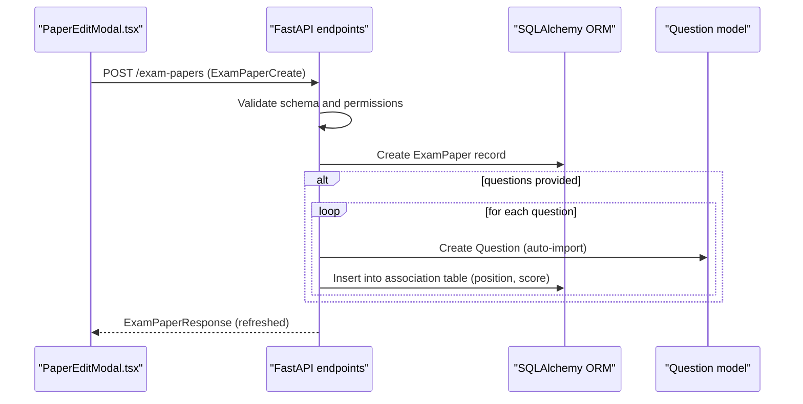
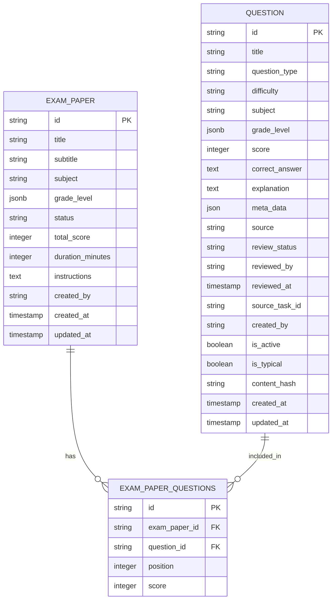
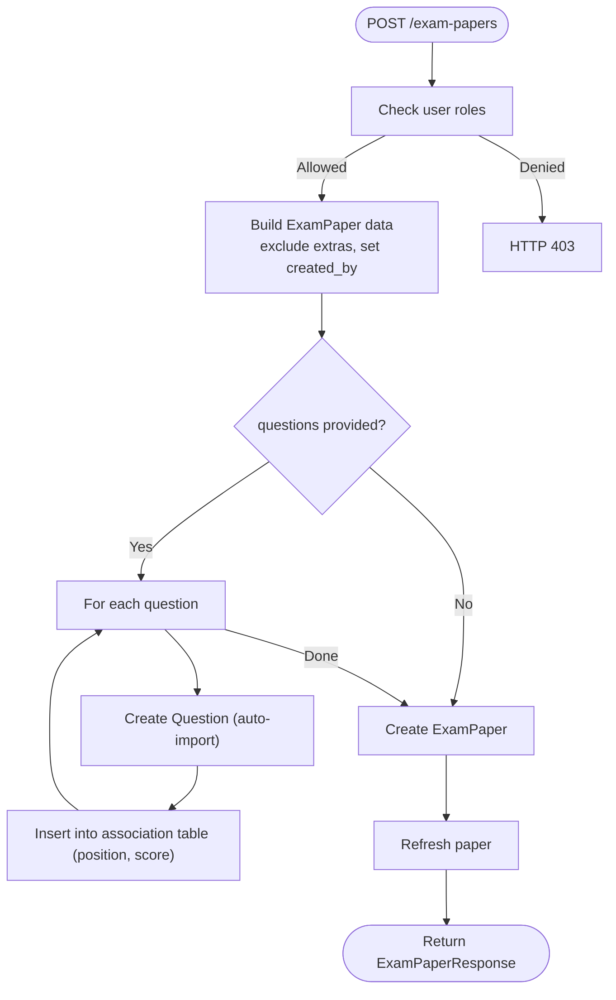
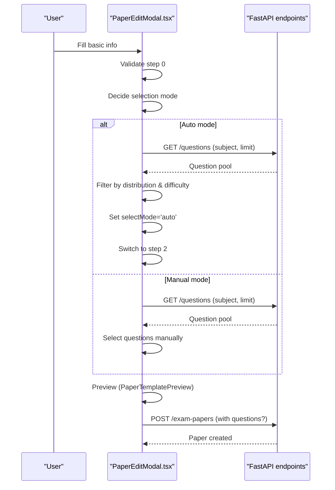
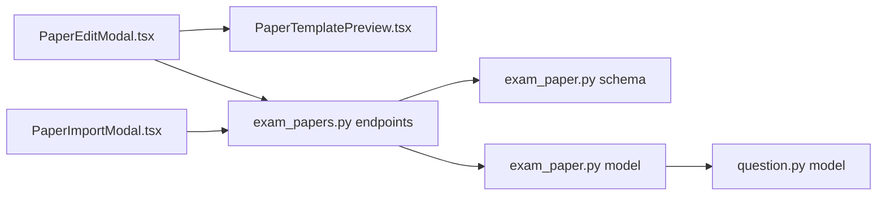

# Exam Paper Creation

<cite>
**Referenced Files in This Document**
- [backend/app/schemas/exam_paper.py](file://backend/app/schemas/exam_paper.py)
- [backend/app/models/exam_paper.py](file://backend/app/models/exam_paper.py)
- [backend/app/models/question.py](file://backend/app/models/question.py)
- [backend/app/api/v1/endpoints/exam_papers.py](file://backend/app/api/v1/endpoints/exam_papers.py)
- [frontend/src/pages/papers/PaperEditModal.tsx](file://frontend/src/pages/papers/PaperEditModal.tsx)
- [frontend/src/pages/papers/PaperImportModal.tsx](file://frontend/src/pages/papers/PaperImportModal.tsx)
- [frontend/src/pages/papers/PaperTemplatePreview.tsx](file://frontend/src/pages/papers/PaperTemplatePreview.tsx)
- [frontend/src/pages/papers/PaperListPage.tsx](file://frontend/src/pages/papers/PaperListPage.tsx)
- [frontend/src/pages/papers/MyPapersPage.tsx](file://frontend/src/pages/papers/MyPapersPage.tsx)
</cite>

## Table of Contents
1. [Introduction](#introduction)
2. [Project Structure](#project-structure)
3. [Core Components](#core-components)
4. [Architecture Overview](#architecture-overview)
5. [Detailed Component Analysis](#detailed-component-analysis)
6. [Dependency Analysis](#dependency-analysis)
7. [Performance Considerations](#performance-considerations)
8. [Troubleshooting Guide](#troubleshooting-guide)
9. [Conclusion](#conclusion)
10. [Appendices](#appendices)

## Introduction
This document explains the complete exam paper creation workflow in the system. It covers the backend schema and persistence model for exam papers, the API endpoints that support creation and management, and the frontend modals that guide educators through manual and automated creation. It also documents paper metadata, validation rules, automatic question import, instruction management, status initialization, and the relationship between papers and questions. Guidance is included for preventing duplicates, managing creator permissions, organizing papers, and leveraging real-time previews during creation.

## Project Structure
The exam paper creation spans backend domain models and schemas, API endpoints, and frontend UI components:
- Backend
  - Schemas define request/response validation for exam papers and questions.
  - Models define the relational structure and constraints for papers and their associations with questions.
  - API endpoints implement creation, updates, deletion, and question management for papers.
- Frontend
  - PaperEditModal guides educators through manual creation and selection of questions.
  - PaperImportModal enables OCR-based bulk import of questions from scanned images.
  - PaperTemplatePreview renders a printable-style preview of the paper structure.
  - PaperListPage and MyPapersPage surface paper lists, actions, and export/print flows.

```mermaid
graph TB
subgraph "Backend"
S1["schemas/exam_paper.py<br/>Pydantic models"]
M1["models/exam_paper.py<br/>SQLAlchemy model"]
Q1["models/question.py<br/>SQLAlchemy model"]
E1["api/v1/endpoints/exam_papers.py<br/>FastAPI endpoints"]
end
subgraph "Frontend"
FE1["PaperEditModal.tsx<br/>Manual creation wizard"]
FE2["PaperImportModal.tsx<br/>OCR-based import"]
FE3["PaperTemplatePreview.tsx<br/>Real-time preview"]
FE4["PaperListPage.tsx<br/>Paper list & actions"]
FE5["MyPapersPage.tsx<br/>Student view & actions"]
end
FE1 --> E1
FE2 --> E1
E1 --> M1
M1 <- --> Q1
FE3 --> FE1
FE4 --> E1
FE5 --> E1
```

**Diagram sources**
- [backend/app/schemas/exam_paper.py:1-42](file://backend/app/schemas/exam_paper.py#L1-L42)
- [backend/app/models/exam_paper.py:23-48](file://backend/app/models/exam_paper.py#L23-L48)
- [backend/app/models/question.py:10-43](file://backend/app/models/question.py#L10-L43)
- [backend/app/api/v1/endpoints/exam_papers.py:20-64](file://backend/app/api/v1/endpoints/exam_papers.py#L20-L64)
- [frontend/src/pages/papers/PaperEditModal.tsx:1-497](file://frontend/src/pages/papers/PaperEditModal.tsx#L1-L497)
- [frontend/src/pages/papers/PaperImportModal.tsx:1-311](file://frontend/src/pages/papers/PaperImportModal.tsx#L1-L311)
- [frontend/src/pages/papers/PaperTemplatePreview.tsx:1-132](file://frontend/src/pages/papers/PaperTemplatePreview.tsx#L1-L132)
- [frontend/src/pages/papers/PaperListPage.tsx:1-169](file://frontend/src/pages/papers/PaperListPage.tsx#L1-L169)
- [frontend/src/pages/papers/MyPapersPage.tsx:1-233](file://frontend/src/pages/papers/MyPapersPage.tsx#L1-L233)

**Section sources**
- [backend/app/schemas/exam_paper.py:1-42](file://backend/app/schemas/exam_paper.py#L1-L42)
- [backend/app/models/exam_paper.py:23-48](file://backend/app/models/exam_paper.py#L23-L48)
- [backend/app/models/question.py:10-43](file://backend/app/models/question.py#L10-L43)
- [backend/app/api/v1/endpoints/exam_papers.py:20-64](file://backend/app/api/v1/endpoints/exam_papers.py#L20-L64)
- [frontend/src/pages/papers/PaperEditModal.tsx:1-497](file://frontend/src/pages/papers/PaperEditModal.tsx#L1-L497)
- [frontend/src/pages/papers/PaperImportModal.tsx:1-311](file://frontend/src/pages/papers/PaperImportModal.tsx#L1-L311)
- [frontend/src/pages/papers/PaperTemplatePreview.tsx:1-132](file://frontend/src/pages/papers/PaperTemplatePreview.tsx#L1-L132)
- [frontend/src/pages/papers/PaperListPage.tsx:1-169](file://frontend/src/pages/papers/PaperListPage.tsx#L1-L169)
- [frontend/src/pages/papers/MyPapersPage.tsx:1-233](file://frontend/src/pages/papers/MyPapersPage.tsx#L1-L233)

## Core Components
- ExamPaperCreate schema
  - Defines the shape of incoming paper creation requests, including metadata, status defaults, and optional question bulk import payload.
  - Validation rules ensure non-negative scores and durations, allowed status values, and length constraints.
- ExamPaper model
  - Stores paper metadata (title, subtitle, subject, grade_level, duration, total_score, instructions, status).
  - Maintains relationships with questions via an association table and enforces constraints on scores/durations/status.
- Question model
  - Represents questions used in papers, including type, difficulty, score, and content metadata.
- API endpoints
  - Create paper with optional embedded question list; import questions automatically when provided.
  - Update/delete papers with permission checks; manage questions per paper.
- Frontend modals
  - PaperEditModal: Manual creation wizard with steps for basic info, selection mode, manual selection, and preview.
  - PaperImportModal: OCR-based import from image uploads with recognition, preview, editing, and confirm/save.
  - PaperTemplatePreview: Real-time rendering of paper structure with sections and placeholders.

**Section sources**
- [backend/app/schemas/exam_paper.py:7-21](file://backend/app/schemas/exam_paper.py#L7-L21)
- [backend/app/models/exam_paper.py:23-48](file://backend/app/models/exam_paper.py#L23-L48)
- [backend/app/models/question.py:10-43](file://backend/app/models/question.py#L10-L43)
- [backend/app/api/v1/endpoints/exam_papers.py:20-64](file://backend/app/api/v1/endpoints/exam_papers.py#L20-L64)
- [frontend/src/pages/papers/PaperEditModal.tsx:69-187](file://frontend/src/pages/papers/PaperEditModal.tsx#L69-L187)
- [frontend/src/pages/papers/PaperImportModal.tsx:110-125](file://frontend/src/pages/papers/PaperImportModal.tsx#L110-L125)
- [frontend/src/pages/papers/PaperTemplatePreview.tsx:15-132](file://frontend/src/pages/papers/PaperTemplatePreview.tsx#L15-L132)

## Architecture Overview
The end-to-end flow for creating a new exam paper with automatic question import:



**Diagram sources**
- [backend/app/api/v1/endpoints/exam_papers.py:20-64](file://backend/app/api/v1/endpoints/exam_papers.py#L20-L64)
- [backend/app/schemas/exam_paper.py:19-21](file://backend/app/schemas/exam_paper.py#L19-L21)
- [backend/app/models/exam_paper.py:9-20](file://backend/app/models/exam_paper.py#L9-L20)
- [backend/app/models/question.py:10-33](file://backend/app/models/question.py#L10-L33)

## Detailed Component Analysis

### Backend Schema: ExamPaperCreate
- Purpose: Define allowed fields and validation rules for paper creation requests.
- Key fields:
  - title, subtitle, description, subject, grade_level, status (default DRAFT), total_score (>=0), duration_minutes (>=0), instructions.
  - questions: optional array of question objects for bulk import.
- Validation highlights:
  - Status constrained to allowed values.
  - Non-negative numeric fields enforced.
  - Length limits applied to string fields.

**Section sources**
- [backend/app/schemas/exam_paper.py:7-21](file://backend/app/schemas/exam_paper.py#L7-L21)

### Backend Model: ExamPaper and Association
- Core attributes:
  - Metadata: title, subtitle, subject, grade_level (JSONB), status, total_score, duration_minutes, instructions, created_by.
  - Constraints: non-negative total_score and duration_minutes; status enum check.
- Relationship:
  - Many-to-many with Question via exam_paper_questions association table.
  - Includes position and score per question in the association table.



**Diagram sources**
- [backend/app/models/exam_paper.py:9-48](file://backend/app/models/exam_paper.py#L9-L48)
- [backend/app/models/question.py:10-43](file://backend/app/models/question.py#L10-L43)

**Section sources**
- [backend/app/models/exam_paper.py:23-48](file://backend/app/models/exam_paper.py#L23-L48)
- [backend/app/models/question.py:10-43](file://backend/app/models/question.py#L10-L43)

### API Endpoint: Create Paper with Automatic Import
- Permissions: TEACHER, QUESTION_ADMIN, SYS_ADMIN only.
- Behavior:
  - Exclude extra fields and set created_by from current user.
  - If questions array is present, create each question and link to the paper with position and score.
  - Commit within a transaction and refresh the paper for response.



**Diagram sources**
- [backend/app/api/v1/endpoints/exam_papers.py:20-64](file://backend/app/api/v1/endpoints/exam_papers.py#L20-L64)

**Section sources**
- [backend/app/api/v1/endpoints/exam_papers.py:20-64](file://backend/app/api/v1/endpoints/exam_papers.py#L20-L64)

### Frontend Modal: PaperEditModal (Manual Creation Wizard)
- Steps:
  - Step 0: Basic info (title, status, subject, total_score, duration, grade scope, subtitle, description, notes).
  - Step 1: Selection mode (auto vs manual) with distribution and difficulty ratio controls.
  - Step 2: Manual selection (browse questions by type, filter by difficulty, add/remove).
  - Step 3: Preview confirmation (PaperTemplatePreview) and final creation.
- Real-time preview:
  - PaperTemplatePreview renders sections (fill-in, single/multiple choice, subjective) with placeholders and scoring.
- Bulk import (auto mode):
  - Queries questions by subject and filters in-memory according to distribution and difficulty ratios.
  - On success, switches to manual selection mode with picked questions.



**Diagram sources**
- [frontend/src/pages/papers/PaperEditModal.tsx:69-187](file://frontend/src/pages/papers/PaperEditModal.tsx#L69-L187)
- [frontend/src/pages/papers/PaperTemplatePreview.tsx:15-132](file://frontend/src/pages/papers/PaperTemplatePreview.tsx#L15-L132)
- [backend/app/api/v1/endpoints/exam_papers.py:20-64](file://backend/app/api/v1/endpoints/exam_papers.py#L20-L64)

**Section sources**
- [frontend/src/pages/papers/PaperEditModal.tsx:69-187](file://frontend/src/pages/papers/PaperEditModal.tsx#L69-L187)
- [frontend/src/pages/papers/PaperTemplatePreview.tsx:15-132](file://frontend/src/pages/papers/PaperTemplatePreview.tsx#L15-L132)

### Frontend Modal: PaperImportModal (OCR-Based Import)
- Workflow:
  - Step 0: Upload image and configure subject/grade scope/grades/chapter/knowledge_points.
  - Step 1: Call backend OCR endpoint to recognize questions (loading state).
  - Step 2: Preview recognized questions; optionally edit.
  - Step 3: Edit mode to adjust question_type, difficulty, score, title, options, correct_answer, explanation.
  - Confirm save to persist questions.
- Integration:
  - Uses form values to construct grade_level JSON for recognition and later question creation.

**Section sources**
- [frontend/src/pages/papers/PaperImportModal.tsx:110-125](file://frontend/src/pages/papers/PaperImportModal.tsx#L110-L125)

### Paper Metadata and Instructions
- Metadata fields:
  - title, subtitle, subject, grade_level (JSONB with scope, grades, optional chapter/knowledge_points), status (DRAFT by default), total_score, duration_minutes, instructions, description.
- Instructions management:
  - Stored on the paper and rendered in templates/previews for student orientation.
- Status initialization:
  - Default status is DRAFT; later can be published/archived by authorized users.

**Section sources**
- [backend/app/schemas/exam_paper.py:7-16](file://backend/app/schemas/exam_paper.py#L7-L16)
- [backend/app/models/exam_paper.py:23-38](file://backend/app/models/exam_paper.py#L23-L38)

### Paper Duplication Prevention and Creator Permissions
- Creator ownership:
  - created_by links papers to the creator; several endpoints check ownership or elevated roles.
- Permission matrix:
  - Creation/update/delete generally require TEACHER, QUESTION_ADMIN, or SYS_ADMIN.
  - Viewing/editing/deleting may allow STUDENT under specific conditions (e.g., own submissions).
- Duplicate prevention:
  - No explicit duplicate detection is implemented in the examined code; best practice is to rely on unique identifiers and content hashing at ingestion points if needed.

**Section sources**
- [backend/app/api/v1/endpoints/exam_papers.py:26-27](file://backend/app/api/v1/endpoints/exam_papers.py#L26-L27)
- [backend/app/api/v1/endpoints/exam_papers.py:249-274](file://backend/app/api/v1/endpoints/exam_papers.py#L249-L274)
- [backend/app/api/v1/endpoints/exam_papers.py:286-330](file://backend/app/api/v1/endpoints/exam_papers.py#L286-L330)
- [backend/app/models/exam_paper.py:36](file://backend/app/models/exam_paper.py#L36)

### Relationship Between Papers and Questions
- Many-to-many via exam_paper_questions:
  - Each paper-question pair stores position and score.
  - Retrieval orders questions by position for consistent rendering.
- Export/print:
  - APIs group questions by type and render them in a structured template.

**Section sources**
- [backend/app/models/exam_paper.py:9-20](file://backend/app/models/exam_paper.py#L9-L20)
- [backend/app/api/v1/endpoints/exam_papers.py:566-582](file://backend/app/api/v1/endpoints/exam_papers.py#L566-L582)
- [backend/app/api/v1/endpoints/exam_papers.py:632-735](file://backend/app/api/v1/endpoints/exam_papers.py#L632-L735)

## Dependency Analysis
- Backend dependencies:
  - Paper endpoints depend on schemas for validation and models for persistence.
  - Paper model depends on Question model via association table.
- Frontend dependencies:
  - PaperEditModal depends on PaperTemplatePreview for rendering.
  - Both modals communicate with backend endpoints to create, import, and manage papers/questions.
- Coupling and cohesion:
  - Strong separation between schema/model and endpoint logic.
  - Frontend modals encapsulate UX flows while delegating data operations to endpoints.



**Diagram sources**
- [frontend/src/pages/papers/PaperEditModal.tsx:1-497](file://frontend/src/pages/papers/PaperEditModal.tsx#L1-L497)
- [frontend/src/pages/papers/PaperTemplatePreview.tsx:1-132](file://frontend/src/pages/papers/PaperTemplatePreview.tsx#L1-L132)
- [frontend/src/pages/papers/PaperImportModal.tsx:1-311](file://frontend/src/pages/papers/PaperImportModal.tsx#L1-L311)
- [backend/app/api/v1/endpoints/exam_papers.py:20-64](file://backend/app/api/v1/endpoints/exam_papers.py#L20-L64)
- [backend/app/schemas/exam_paper.py:1-42](file://backend/app/schemas/exam_paper.py#L1-L42)
- [backend/app/models/exam_paper.py:23-48](file://backend/app/models/exam_paper.py#L23-L48)
- [backend/app/models/question.py:10-43](file://backend/app/models/question.py#L10-L43)

**Section sources**
- [backend/app/api/v1/endpoints/exam_papers.py:20-64](file://backend/app/api/v1/endpoints/exam_papers.py#L20-L64)
- [backend/app/schemas/exam_paper.py:1-42](file://backend/app/schemas/exam_paper.py#L1-L42)
- [backend/app/models/exam_paper.py:23-48](file://backend/app/models/exam_paper.py#L23-L48)
- [backend/app/models/question.py:10-43](file://backend/app/models/question.py#L10-L43)
- [frontend/src/pages/papers/PaperEditModal.tsx:1-497](file://frontend/src/pages/papers/PaperEditModal.tsx#L1-L497)
- [frontend/src/pages/papers/PaperImportModal.tsx:1-311](file://frontend/src/pages/papers/PaperImportModal.tsx#L1-L311)
- [frontend/src/pages/papers/PaperTemplatePreview.tsx:1-132](file://frontend/src/pages/papers/PaperTemplatePreview.tsx#L1-L132)

## Performance Considerations
- Bulk question import:
  - Auto-selection filters questions in-memory; ensure subject queries are efficient and consider pagination limits.
- Transaction boundaries:
  - Creating a paper and linking many questions should occur in a single transaction to avoid partial writes.
- Rendering previews:
  - Grouping questions by type and limiting visible counts improves responsiveness in PaperTemplatePreview.

## Troubleshooting Guide
- Permission denied when creating/updating/deleting:
  - Ensure the current user has roles TEACHER, QUESTION_ADMIN, or SYS_ADMIN.
- Paper not found:
  - Verify the paper ID exists and belongs to the expected scope.
- Question not found during linking:
  - Confirm the question ID exists and is accessible.
- Export/print failures:
  - Check network connectivity and authentication headers for export endpoints.
- OCR import errors:
  - Validate uploaded image quality and retry recognition; inspect returned error messages.

**Section sources**
- [backend/app/api/v1/endpoints/exam_papers.py:26-27](file://backend/app/api/v1/endpoints/exam_papers.py#L26-L27)
- [backend/app/api/v1/endpoints/exam_papers.py:249-274](file://backend/app/api/v1/endpoints/exam_papers.py#L249-L274)
- [backend/app/api/v1/endpoints/exam_papers.py:286-330](file://backend/app/api/v1/endpoints/exam_papers.py#L286-L330)
- [frontend/src/pages/papers/PaperListPage.tsx:67-94](file://frontend/src/pages/papers/PaperListPage.tsx#L67-L94)

## Conclusion
The exam paper creation system combines robust backend validation and persistence with an intuitive frontend wizard. Educators can quickly create papers with either manual selection or OCR-based import, leverage real-time previews, and manage permissions and ownership effectively. The many-to-many relationship between papers and questions, along with position and score tracking, ensures flexible and accurate paper assembly.

## Appendices

### Example Workflows

- Manual creation with real-time preview
  - Fill basic info, choose manual selection, browse and select questions, preview, and confirm.
  - See [PaperEditModal.tsx:69-187](file://frontend/src/pages/papers/PaperEditModal.tsx#L69-L187) and [PaperTemplatePreview.tsx:15-132](file://frontend/src/pages/papers/PaperTemplatePreview.tsx#L15-L132).

- Bulk question import via OCR
  - Upload image, configure scope/grades, trigger recognition, preview/edit, and confirm save.
  - See [PaperImportModal.tsx:110-125](file://frontend/src/pages/papers/PaperImportModal.tsx#L110-125).

- Best practices for paper organization
  - Use grade_scope and grade_level to target appropriate audiences.
  - Keep instructions concise and aligned with exam policies.
  - Distribute question types and difficulty levels thoughtfully for balanced assessment.