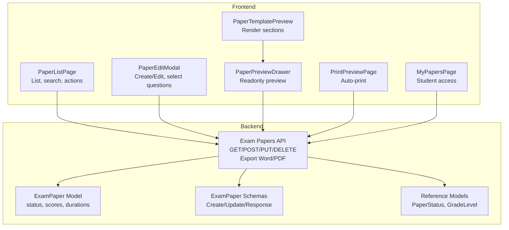
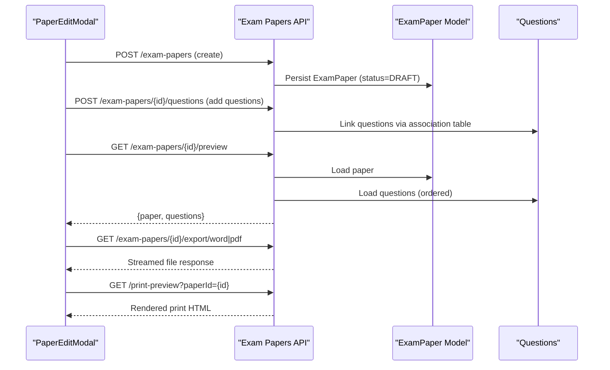
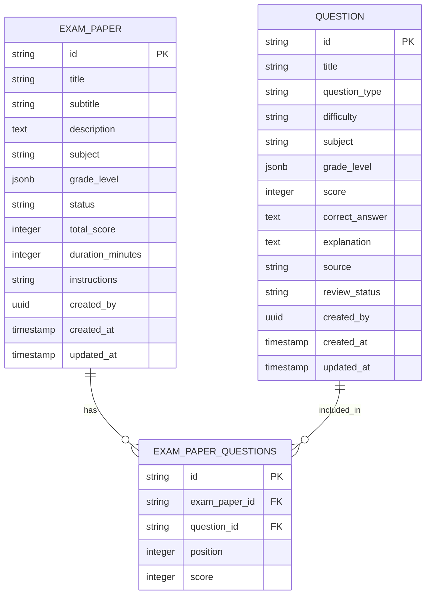
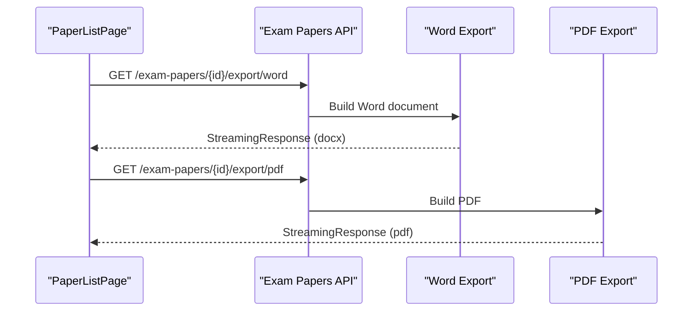
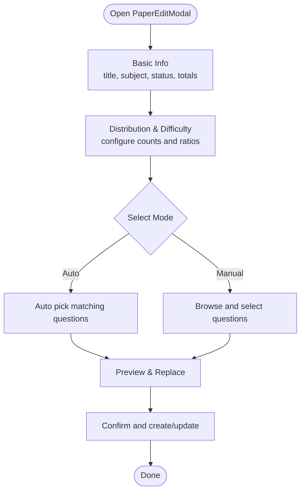
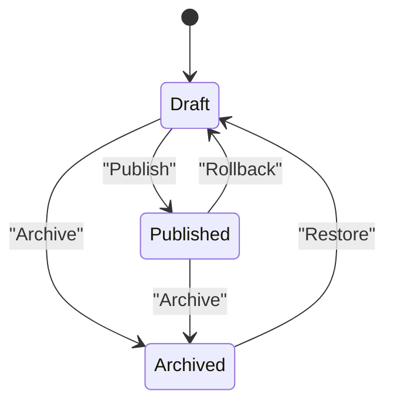
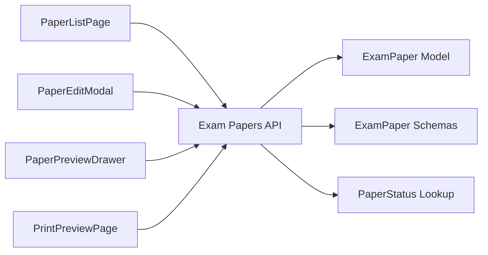

# Exam Publishing

<cite>
**Referenced Files in This Document**
- [backend/app/models/exam_paper.py](file://backend/app/models/exam_paper.py)
- [backend/app/schemas/exam_paper.py](file://backend/app/schemas/exam_paper.py)
- [backend/app/api/v1/endpoints/exam_papers.py](file://backend/app/api/v1/endpoints/exam_papers.py)
- [backend/app/models/reference.py](file://backend/app/models/reference.py)
- [frontend/src/pages/papers/PaperListPage.tsx](file://frontend/src/pages/papers/PaperListPage.tsx)
- [frontend/src/pages/papers/PaperEditModal.tsx](file://frontend/src/pages/papers/PaperEditModal.tsx)
- [frontend/src/pages/papers/PaperPreviewDrawer.tsx](file://frontend/src/pages/papers/PaperPreviewDrawer.tsx)
- [frontend/src/pages/papers/PaperTemplatePreview.tsx](file://frontend/src/pages/papers/PaperTemplatePreview.tsx)
- [frontend/src/pages/papers/PrintPreviewPage.tsx](file://frontend/src/pages/papers/PrintPreviewPage.tsx)
- [frontend/src/pages/papers/MyPapersPage.tsx](file://frontend/src/pages/papers/MyPapersPage.tsx)
</cite>

## Table of Contents
1. [Introduction](#introduction)
2. [Project Structure](#project-structure)
3. [Core Components](#core-components)
4. [Architecture Overview](#architecture-overview)
5. [Detailed Component Analysis](#detailed-component-analysis)
6. [Dependency Analysis](#dependency-analysis)
7. [Performance Considerations](#performance-considerations)
8. [Troubleshooting Guide](#troubleshooting-guide)
9. [Conclusion](#conclusion)
10. [Appendices](#appendices)

## Introduction
This document explains the exam publishing workflow and status management in the system. It covers how a paper transitions from draft to published, validation and prerequisite checks, publishing restrictions, and the frontend publishing interface. It also documents paper preview, export capabilities (Word and PDF), print preparation, status indicators, administrative controls, and the relationship between paper status and student access. Examples of workflows, quality assurance checks, and rollback procedures are included, along with export styling and print optimization features.

## Project Structure
The exam publishing feature spans backend API endpoints and models, and frontend pages/modals/drawers for authoring, previewing, exporting, and printing.

**Diagram sources**
- [backend/app/api/v1/endpoints/exam_papers.py:1-844](file://backend/app/api/v1/endpoints/exam_papers.py#L1-L844)
- [backend/app/models/exam_paper.py:1-51](file://backend/app/models/exam_paper.py#L1-L51)
- [backend/app/schemas/exam_paper.py:1-44](file://backend/app/schemas/exam_paper.py#L1-L44)
- [backend/app/models/reference.py:40-47](file://backend/app/models/reference.py#L40-L47)
- [frontend/src/pages/papers/PaperListPage.tsx:1-169](file://frontend/src/pages/papers/PaperListPage.tsx#L1-L169)
- [frontend/src/pages/papers/PaperEditModal.tsx:1-497](file://frontend/src/pages/papers/PaperEditModal.tsx#L1-L497)
- [frontend/src/pages/papers/PaperPreviewDrawer.tsx:1-59](file://frontend/src/pages/papers/PaperPreviewDrawer.tsx#L1-L59)
- [frontend/src/pages/papers/PaperTemplatePreview.tsx:1-132](file://frontend/src/pages/papers/PaperTemplatePreview.tsx#L1-L132)
- [frontend/src/pages/papers/PrintPreviewPage.tsx:1-104](file://frontend/src/pages/papers/PrintPreviewPage.tsx#L1-L104)
- [frontend/src/pages/papers/MyPapersPage.tsx:1-120](file://frontend/src/pages/papers/MyPapersPage.tsx#L1-L120)

**Section sources**
- [backend/app/models/exam_paper.py:23-48](file://backend/app/models/exam_paper.py#L23-L48)
- [backend/app/schemas/exam_paper.py:9-44](file://backend/app/schemas/exam_paper.py#L9-L44)
- [backend/app/api/v1/endpoints/exam_papers.py:1-844](file://backend/app/api/v1/endpoints/exam_papers.py#L1-L844)
- [frontend/src/pages/papers/PaperListPage.tsx:1-169](file://frontend/src/pages/papers/PaperListPage.tsx#L1-L169)
- [frontend/src/pages/papers/PaperEditModal.tsx:1-497](file://frontend/src/pages/papers/PaperEditModal.tsx#L1-L497)
- [frontend/src/pages/papers/PaperPreviewDrawer.tsx:1-59](file://frontend/src/pages/papers/PaperPreviewDrawer.tsx#L1-L59)
- [frontend/src/pages/papers/PaperTemplatePreview.tsx:1-132](file://frontend/src/pages/papers/PaperTemplatePreview.tsx#L1-L132)
- [frontend/src/pages/papers/PrintPreviewPage.tsx:1-104](file://frontend/src/pages/papers/PrintPreviewPage.tsx#L1-L104)
- [frontend/src/pages/papers/MyPapersPage.tsx:1-120](file://frontend/src/pages/papers/MyPapersPage.tsx#L1-L120)

## Core Components
- Backend ExamPaper model defines status values and numeric constraints (non-negative total score and duration).
- Pydantic schemas enforce status values and field constraints for create/update/response.
- API endpoints support CRUD, question association, preview, and export to Word and PDF.
- Frontend provides authoring (PaperEditModal), listing/searching (PaperListPage), preview (PaperPreviewDrawer), print preview (PrintPreviewPage), and student access (MyPapersPage).

**Section sources**
- [backend/app/models/exam_paper.py:23-48](file://backend/app/models/exam_paper.py#L23-L48)
- [backend/app/schemas/exam_paper.py:9-44](file://backend/app/schemas/exam_paper.py#L9-L44)
- [backend/app/api/v1/endpoints/exam_papers.py:20-844](file://backend/app/api/v1/endpoints/exam_papers.py#L20-L844)
- [frontend/src/pages/papers/PaperListPage.tsx:1-169](file://frontend/src/pages/papers/PaperListPage.tsx#L1-L169)
- [frontend/src/pages/papers/PaperEditModal.tsx:1-497](file://frontend/src/pages/papers/PaperEditModal.tsx#L1-L497)
- [frontend/src/pages/papers/PaperPreviewDrawer.tsx:1-59](file://frontend/src/pages/papers/PaperPreviewDrawer.tsx#L1-L59)
- [frontend/src/pages/papers/PrintPreviewPage.tsx:1-104](file://frontend/src/pages/papers/PrintPreviewPage.tsx#L1-L104)
- [frontend/src/pages/papers/MyPapersPage.tsx:1-120](file://frontend/src/pages/papers/MyPapersPage.tsx#L1-L120)

## Architecture Overview
The publishing workflow integrates frontend UI with backend APIs and models. Teachers/admins create/edit papers, associate questions, preview, export, and print. Students can view their own papers and submissions.

**Diagram sources**
- [backend/app/api/v1/endpoints/exam_papers.py:20-844](file://backend/app/api/v1/endpoints/exam_papers.py#L20-L844)
- [backend/app/models/exam_paper.py:23-48](file://backend/app/models/exam_paper.py#L23-L48)
- [frontend/src/pages/papers/PaperEditModal.tsx:160-187](file://frontend/src/pages/papers/PaperEditModal.tsx#L160-L187)
- [frontend/src/pages/papers/PaperPreviewDrawer.tsx:21-58](file://frontend/src/pages/papers/PaperPreviewDrawer.tsx#L21-L58)
- [frontend/src/pages/papers/PrintPreviewPage.tsx:17-33](file://frontend/src/pages/papers/PrintPreviewPage.tsx#L17-L33)

## Detailed Component Analysis

### Backend Data Model and Constraints
- Status lifecycle: DRAFT, PUBLISHED, ARCHIVED.
- Numeric constraints: total_score and duration_minutes must be non-negative.
- Many-to-many relationship with questions via an association table storing position and score per question.

**Diagram sources**
- [backend/app/models/exam_paper.py:9-20](file://backend/app/models/exam_paper.py#L9-L20)
- [backend/app/models/exam_paper.py:23-48](file://backend/app/models/exam_paper.py#L23-L48)

**Section sources**
- [backend/app/models/exam_paper.py:23-48](file://backend/app/models/exam_paper.py#L23-L48)

### API Endpoints for Publishing and Export
- Create/update/delete papers, manage questions, preview, and export to Word and PDF.
- Export endpoints stream generated documents to clients.

**Diagram sources**
- [backend/app/api/v1/endpoints/exam_papers.py:632-821](file://backend/app/api/v1/endpoints/exam_papers.py#L632-L821)
- [frontend/src/pages/papers/PaperListPage.tsx:67-89](file://frontend/src/pages/papers/PaperListPage.tsx#L67-L89)

**Section sources**
- [backend/app/api/v1/endpoints/exam_papers.py:20-844](file://backend/app/api/v1/endpoints/exam_papers.py#L20-L844)
- [frontend/src/pages/papers/PaperListPage.tsx:67-94](file://frontend/src/pages/papers/PaperListPage.tsx#L67-L94)

### Frontend Publishing Interface
- PaperEditModal: Step-based creation/editing, distribution and difficulty ratio configuration, manual/auto question selection, and preview replacement.
- PaperListPage: Lists papers, filters by status/grade/scope, previews, exports (Word/PDF), prints, and deletes.
- PaperPreviewDrawer: Read-only preview drawer showing paper metadata and ordered questions.
- PaperTemplatePreview: Renders sections (fill-in-the-blank, single/multiple choice, subjective) with placeholders and difficulty tags.
- PrintPreviewPage: Loads paper and questions, groups by type, renders printable HTML, and triggers auto-print.

**Diagram sources**
- [frontend/src/pages/papers/PaperEditModal.tsx:69-187](file://frontend/src/pages/papers/PaperEditModal.tsx#L69-L187)
- [frontend/src/pages/papers/PaperTemplatePreview.tsx:15-132](file://frontend/src/pages/papers/PaperTemplatePreview.tsx#L15-L132)

**Section sources**
- [frontend/src/pages/papers/PaperEditModal.tsx:1-497](file://frontend/src/pages/papers/PaperEditModal.tsx#L1-L497)
- [frontend/src/pages/papers/PaperListPage.tsx:1-169](file://frontend/src/pages/papers/PaperListPage.tsx#L1-L169)
- [frontend/src/pages/papers/PaperPreviewDrawer.tsx:1-59](file://frontend/src/pages/papers/PaperPreviewDrawer.tsx#L1-L59)
- [frontend/src/pages/papers/PaperTemplatePreview.tsx:1-132](file://frontend/src/pages/papers/PaperTemplatePreview.tsx#L1-L132)
- [frontend/src/pages/papers/PrintPreviewPage.tsx:1-104](file://frontend/src/pages/papers/PrintPreviewPage.tsx#L1-L104)

### Status Management and Access Control
- Status values: DRAFT, PUBLISHED, ARCHIVED.
- Reference lookup table for paper statuses supports UI labeling and filtering.
- Student access: MyPapersPage lists papers the student has submitted answers for; status is visible in listings and reviews.

**Diagram sources**
- [backend/app/models/reference.py:40-47](file://backend/app/models/reference.py#L40-L47)
- [backend/app/schemas/exam_paper.py](file://backend/app/schemas/exam_paper.py#L13)
- [backend/app/models/exam_paper.py](file://backend/app/models/exam_paper.py#L31)

**Section sources**
- [backend/app/models/reference.py:40-47](file://backend/app/models/reference.py#L40-L47)
- [backend/app/schemas/exam_paper.py](file://backend/app/schemas/exam_paper.py#L13)
- [backend/app/models/exam_paper.py](file://backend/app/models/exam_paper.py#L31)
- [frontend/src/pages/papers/MyPapersPage.tsx:40-50](file://frontend/src/pages/papers/MyPapersPage.tsx#L40-L50)

### Validation, Prerequisites, and Restrictions
- Backend enforces non-negative numeric fields and status enum via model/table constraints.
- Frontend validates form inputs and warns when auto-selection cannot meet distribution requirements.
- Export endpoints require authentication; downloads are initiated via fetch with bearer token.
- Print preview opens a dedicated page that auto-triggers printing after load.

**Section sources**
- [backend/app/models/exam_paper.py:44-48](file://backend/app/models/exam_paper.py#L44-L48)
- [backend/app/api/v1/endpoints/exam_papers.py:632-821](file://backend/app/api/v1/endpoints/exam_papers.py#L632-L821)
- [frontend/src/pages/papers/PaperEditModal.tsx:100-137](file://frontend/src/pages/papers/PaperEditModal.tsx#L100-L137)
- [frontend/src/pages/papers/PaperListPage.tsx:67-94](file://frontend/src/pages/papers/PaperListPage.tsx#L67-L94)
- [frontend/src/pages/papers/PrintPreviewPage.tsx:28-33](file://frontend/src/pages/papers/PrintPreviewPage.tsx#L28-L33)

### Export Formats, Styling, and Print Optimization
- Word export: Uses a document library to build a structured document with centered title, info line, notes, and grouped question sections with placeholders for blanks and subjective answers.
- PDF export: Uses a PDF library to render the same content with Chinese fonts and aligned text.
- Print preview: Groups questions by type, applies page break hints, and triggers auto-print after DOM is ready.

**Section sources**
- [backend/app/api/v1/endpoints/exam_papers.py:632-821](file://backend/app/api/v1/endpoints/exam_papers.py#L632-L821)
- [frontend/src/pages/papers/PrintPreviewPage.tsx:45-102](file://frontend/src/pages/papers/PrintPreviewPage.tsx#L45-L102)

### Rollback Procedures
- To revert a published paper back to draft, update the paper’s status to DRAFT via the update endpoint.
- Ensure prerequisites (e.g., question linkage) remain intact before publishing again.

**Section sources**
- [backend/app/api/v1/endpoints/exam_papers.py:242-283](file://backend/app/api/v1/endpoints/exam_papers.py#L242-L283)
- [backend/app/schemas/exam_paper.py:25-34](file://backend/app/schemas/exam_paper.py#L25-L34)

## Dependency Analysis
- Backend depends on SQLAlchemy models and Pydantic schemas to enforce data integrity and API contracts.
- Frontend components depend on shared reference values (statuses, grades) and the API client for data fetching and mutations.

**Diagram sources**
- [backend/app/api/v1/endpoints/exam_papers.py:1-844](file://backend/app/api/v1/endpoints/exam_papers.py#L1-L844)
- [backend/app/models/exam_paper.py:23-48](file://backend/app/models/exam_paper.py#L23-L48)
- [backend/app/schemas/exam_paper.py:1-44](file://backend/app/schemas/exam_paper.py#L1-L44)
- [backend/app/models/reference.py:40-47](file://backend/app/models/reference.py#L40-L47)
- [frontend/src/pages/papers/PaperListPage.tsx:1-169](file://frontend/src/pages/papers/PaperListPage.tsx#L1-L169)
- [frontend/src/pages/papers/PaperEditModal.tsx:1-497](file://frontend/src/pages/papers/PaperEditModal.tsx#L1-L497)
- [frontend/src/pages/papers/PaperPreviewDrawer.tsx:1-59](file://frontend/src/pages/papers/PaperPreviewDrawer.tsx#L1-L59)
- [frontend/src/pages/papers/PrintPreviewPage.tsx:1-104](file://frontend/src/pages/papers/PrintPreviewPage.tsx#L1-L104)

**Section sources**
- [backend/app/api/v1/endpoints/exam_papers.py:1-844](file://backend/app/api/v1/endpoints/exam_papers.py#L1-L844)
- [frontend/src/pages/papers/PaperListPage.tsx:1-169](file://frontend/src/pages/papers/PaperListPage.tsx#L1-L169)

## Performance Considerations
- Export endpoints stream responses to avoid loading entire documents into memory.
- Frontend grouping and rendering of questions are client-side; keep question counts reasonable for smooth rendering.
- Use pagination and filters in PaperListPage to reduce initial payload sizes.

## Troubleshooting Guide
- Export failures: Verify authentication token and network connectivity; the frontend uses fetch with Authorization header for downloads.
- Print preview not opening: Ensure pop-ups are allowed; the frontend attempts to open a new window and auto-print after load.
- Auto-selection warnings: Adjust distribution or difficulty ratios if question pools are insufficient.
- Status mismatch: Confirm status values match allowed enums and that numeric fields are non-negative.

**Section sources**
- [frontend/src/pages/papers/PaperListPage.tsx:67-94](file://frontend/src/pages/papers/PaperListPage.tsx#L67-L94)
- [frontend/src/pages/papers/PrintPreviewPage.tsx:28-33](file://frontend/src/pages/papers/PrintPreviewPage.tsx#L28-L33)
- [frontend/src/pages/papers/PaperEditModal.tsx:100-137](file://frontend/src/pages/papers/PaperEditModal.tsx#L100-L137)
- [backend/app/models/exam_paper.py:44-48](file://backend/app/models/exam_paper.py#L44-L48)

## Conclusion
The exam publishing workflow combines robust backend constraints with a flexible frontend authoring experience. Papers progress through DRAFT, PUBLISHED, and ARCHIVED states, with clear UI indicators and administrative controls. Preview, export (Word/PDF), and print preparation are integrated, while student access is controlled via submission-based visibility. Quality assurance relies on backend constraints and frontend validation, with straightforward rollback procedures.

## Appendices

### Example Workflows
- Authoring and publishing:
  - Open PaperEditModal, configure basic info and distribution, select questions, preview and confirm.
  - Export to Word/PDF for review; open PrintPreviewPage for print preparation.
  - Update status to PUBLISHED; students can view their papers and submissions.
- Rollback:
  - Change status back to DRAFT; re-edit as needed; re-publish when ready.

### Quality Assurance Checks
- Backend: Non-negative numeric fields and status enum enforcement.
- Frontend: Auto-selection warnings, distribution vs pool size checks, and readonly previews during editing.

### Timing Controls and Scheduling Integration
- Duration is stored with the paper; integrate scheduling by linking paper IDs to scheduled sessions in higher-level systems as needed.