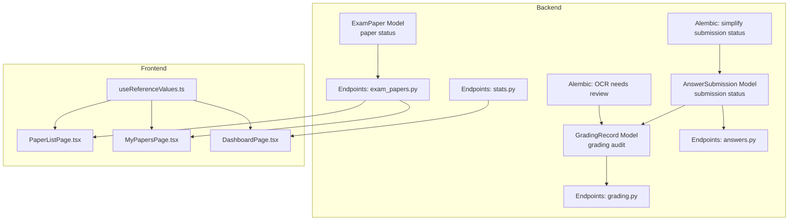
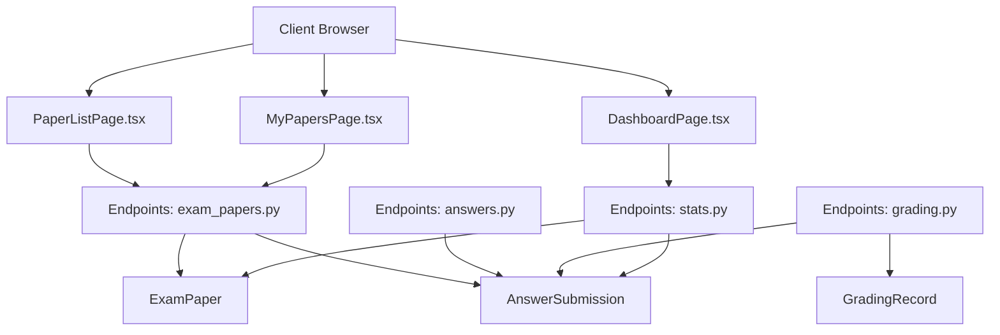
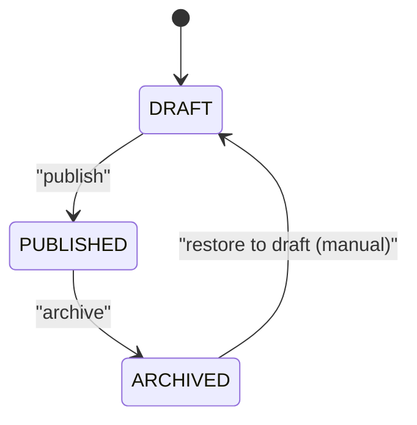
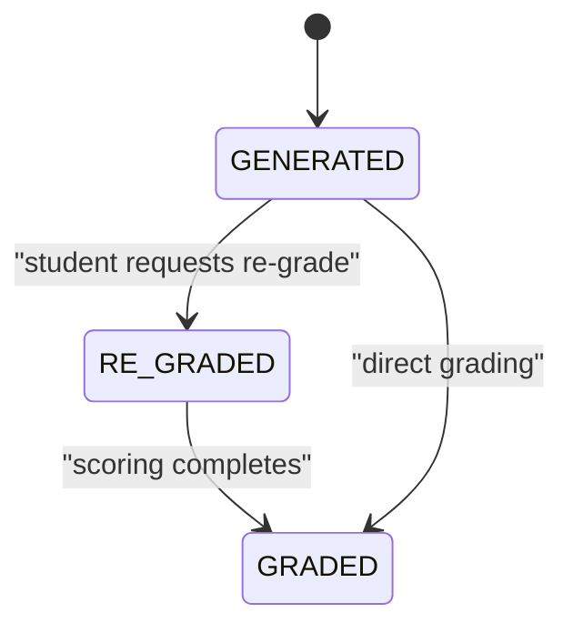
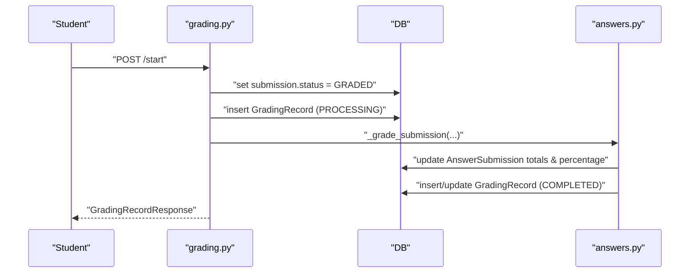
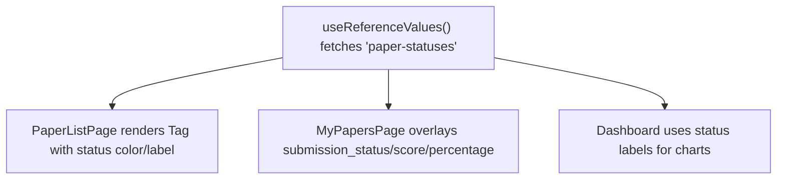
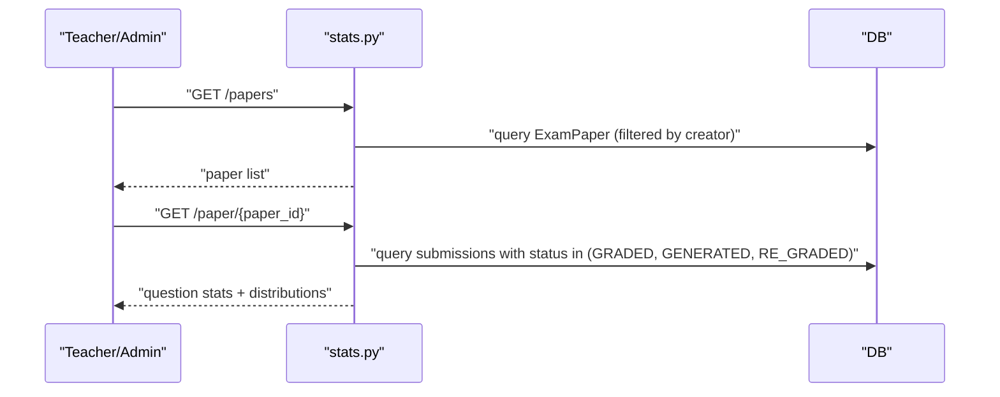
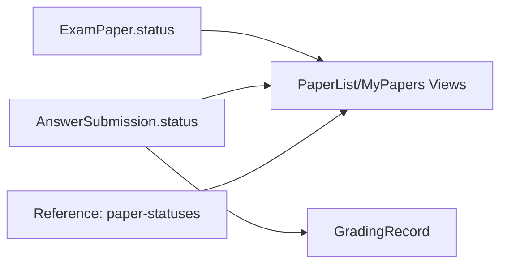

# Exam Status Management

<cite>
**Referenced Files in This Document**
- [backend/app/models/exam_paper.py](file://backend/app/models/exam_paper.py)
- [backend/app/schemas/exam_paper.py](file://backend/app/schemas/exam_paper.py)
- [backend/app/models/answer_submission.py](file://backend/app/models/answer_submission.py)
- [backend/app/models/grading_record.py](file://backend/app/models/grading_record.py)
- [backend/app/models/reference.py](file://backend/app/models/reference.py)
- [backend/app/api/v1/endpoints/exam_papers.py](file://backend/app/api/v1/endpoints/exam_papers.py)
- [backend/app/api/v1/endpoints/answers.py](file://backend/app/api/v1/endpoints/answers.py)
- [backend/app/api/v1/endpoints/grading.py](file://backend/app/api/v1/endpoints/grading.py)
- [backend/app/api/v1/endpoints/stats.py](file://backend/app/api/v1/endpoints/stats.py)
- [backend/alembic/versions/004_simplify_submission_status.py](file://backend/alembic/versions/004_simplify_submission_status.py)
- [backend/alembic/versions/005_add_ocr_needs_review_status.py](file://backend/alembic/versions/005_add_ocr_needs_review_status.py)
- [frontend/src/pages/papers/PaperListPage.tsx](file://frontend/src/pages/papers/PaperListPage.tsx)
- [frontend/src/pages/papers/MyPapersPage.tsx](file://frontend/src/pages/papers/MyPapersPage.tsx)
- [frontend/src/hooks/useReferenceValues.ts](file://frontend/src/hooks/useReferenceValues.ts)
- [frontend/src/pages/dashboard/DashboardPage.tsx](file://frontend/src/pages/dashboard/DashboardPage.tsx)
</cite>

## Table of Contents
1. [Introduction](#introduction)
2. [Project Structure](#project-structure)
3. [Core Components](#core-components)
4. [Architecture Overview](#architecture-overview)
5. [Detailed Component Analysis](#detailed-component-analysis)
6. [Dependency Analysis](#dependency-analysis)
7. [Performance Considerations](#performance-considerations)
8. [Troubleshooting Guide](#troubleshooting-guide)
9. [Conclusion](#conclusion)
10. [Appendices](#appendices)

## Introduction
This document explains the exam status tracking and management system across the exam lifecycle. It covers:
- Paper status enumeration and transitions
- Submission status management for individual students (GENERATED, RE_GRADED, GRADED)
- Relationship between paper status and submission status
- Audit trails and historical tracking
- Frontend status indicators, progress monitoring, and administrative oversight
- Examples of status workflows, bulk operations, and reporting capabilities
- Integration with answer submission, grading workflows, and completion analytics

## Project Structure
The exam status system spans backend models and endpoints, migration scripts, and frontend pages/components that render status indicators and drive administrative actions.

**Diagram sources**
- [backend/app/models/exam_paper.py:23-48](file://backend/app/models/exam_paper.py#L23-L48)
- [backend/app/models/answer_submission.py:9-31](file://backend/app/models/answer_submission.py#L9-L31)
- [backend/app/models/grading_record.py:8-28](file://backend/app/models/grading_record.py#L8-L28)
- [backend/app/api/v1/endpoints/exam_papers.py:67-124](file://backend/app/api/v1/endpoints/exam_papers.py#L67-L124)
- [backend/app/api/v1/endpoints/answers.py:74-112](file://backend/app/api/v1/endpoints/answers.py#L74-L112)
- [backend/app/api/v1/endpoints/grading.py:19-55](file://backend/app/api/v1/endpoints/grading.py#L19-L55)
- [backend/app/api/v1/endpoints/stats.py:17-34](file://backend/app/api/v1/endpoints/stats.py#L17-L34)
- [backend/alembic/versions/004_simplify_submission_status.py:20-42](file://backend/alembic/versions/004_simplify_submission_status.py#L20-L42)
- [backend/alembic/versions/005_add_ocr_needs_review_status.py:16-32](file://backend/alembic/versions/005_add_ocr_needs_review_status.py#L16-L32)
- [frontend/src/pages/papers/PaperListPage.tsx:13-169](file://frontend/src/pages/papers/PaperListPage.tsx#L13-L169)
- [frontend/src/pages/papers/MyPapersPage.tsx:13-50](file://frontend/src/pages/papers/MyPapersPage.tsx#L13-L50)
- [frontend/src/hooks/useReferenceValues.ts:40-83](file://frontend/src/hooks/useReferenceValues.ts#L40-L83)
- [frontend/src/pages/dashboard/DashboardPage.tsx:14-72](file://frontend/src/pages/dashboard/DashboardPage.tsx#L14-L72)

**Section sources**
- [backend/app/models/exam_paper.py:23-48](file://backend/app/models/exam_paper.py#L23-L48)
- [backend/app/models/answer_submission.py:9-31](file://backend/app/models/answer_submission.py#L9-L31)
- [backend/app/models/grading_record.py:8-28](file://backend/app/models/grading_record.py#L8-L28)
- [backend/app/api/v1/endpoints/exam_papers.py:67-124](file://backend/app/api/v1/endpoints/exam_papers.py#L67-L124)
- [backend/app/api/v1/endpoints/answers.py:74-112](file://backend/app/api/v1/endpoints/answers.py#L74-L112)
- [backend/app/api/v1/endpoints/grading.py:19-55](file://backend/app/api/v1/endpoints/grading.py#L19-L55)
- [backend/app/api/v1/endpoints/stats.py:17-34](file://backend/app/api/v1/endpoints/stats.py#L17-L34)
- [backend/alembic/versions/004_simplify_submission_status.py:20-42](file://backend/alembic/versions/004_simplify_submission_status.py#L20-L42)
- [backend/alembic/versions/005_add_ocr_needs_review_status.py:16-32](file://backend/alembic/versions/005_add_ocr_needs_review_status.py#L16-L32)
- [frontend/src/pages/papers/PaperListPage.tsx:13-169](file://frontend/src/pages/papers/PaperListPage.tsx#L13-L169)
- [frontend/src/pages/papers/MyPapersPage.tsx:13-50](file://frontend/src/pages/papers/MyPapersPage.tsx#L13-L50)
- [frontend/src/hooks/useReferenceValues.ts:40-83](file://frontend/src/hooks/useReferenceValues.ts#L40-L83)
- [frontend/src/pages/dashboard/DashboardPage.tsx:14-72](file://frontend/src/pages/dashboard/DashboardPage.tsx#L14-L72)

## Core Components
- Paper status (ExamPaper): DRAFT, PUBLISHED, ARCHIVED
- Submission status (AnswerSubmission): GENERATED, RE_GRADED, GRADED
- Grading audit (GradingRecord): PENDING, PROCESSING, COMPLETED, FAILED
- Reference metadata: paper-statuses, grade-levels, and others for frontend rendering
- Endpoints:
  - Paper listing and filtering with submission overlays
  - Submission status update endpoint (student-only)
  - Grading orchestration and status polling
  - Statistics endpoints for teacher/admin oversight

**Section sources**
- [backend/app/models/exam_paper.py](file://backend/app/models/exam_paper.py#L31)
- [backend/app/schemas/exam_paper.py](file://backend/app/schemas/exam_paper.py#L13)
- [backend/app/models/answer_submission.py](file://backend/app/models/answer_submission.py#L17)
- [backend/app/models/grading_record.py](file://backend/app/models/grading_record.py#L15)
- [backend/app/models/reference.py:40-46](file://backend/app/models/reference.py#L40-L46)
- [backend/app/api/v1/endpoints/exam_papers.py:67-124](file://backend/app/api/v1/endpoints/exam_papers.py#L67-L124)
- [backend/app/api/v1/endpoints/exam_papers.py:333-359](file://backend/app/api/v1/endpoints/exam_papers.py#L333-L359)
- [backend/app/api/v1/endpoints/grading.py:19-55](file://backend/app/api/v1/endpoints/grading.py#L19-L55)
- [backend/app/api/v1/endpoints/stats.py:17-34](file://backend/app/api/v1/endpoints/stats.py#L17-L34)

## Architecture Overview
The system separates concerns between paper lifecycle and student submission lifecycle, with auditing and reporting layered on top.

**Diagram sources**
- [frontend/src/pages/papers/PaperListPage.tsx:13-169](file://frontend/src/pages/papers/PaperListPage.tsx#L13-L169)
- [frontend/src/pages/papers/MyPapersPage.tsx:13-50](file://frontend/src/pages/papers/MyPapersPage.tsx#L13-L50)
- [frontend/src/pages/dashboard/DashboardPage.tsx:14-72](file://frontend/src/pages/dashboard/DashboardPage.tsx#L14-L72)
- [backend/app/api/v1/endpoints/exam_papers.py:67-124](file://backend/app/api/v1/endpoints/exam_papers.py#L67-L124)
- [backend/app/api/v1/endpoints/answers.py:74-112](file://backend/app/api/v1/endpoints/answers.py#L74-L112)
- [backend/app/api/v1/endpoints/grading.py:19-55](file://backend/app/api/v1/endpoints/grading.py#L19-L55)
- [backend/app/api/v1/endpoints/stats.py:17-34](file://backend/app/api/v1/endpoints/stats.py#L17-L34)
- [backend/app/models/exam_paper.py:23-48](file://backend/app/models/exam_paper.py#L23-L48)
- [backend/app/models/answer_submission.py:9-31](file://backend/app/models/answer_submission.py#L9-L31)
- [backend/app/models/grading_record.py:8-28](file://backend/app/models/grading_record.py#L8-L28)

## Detailed Component Analysis

### Paper Status Lifecycle
- Enumerations: DRAFT, PUBLISHED, ARCHIVED
- Constraints enforce allowed values at the database level
- Frontend renders paper status via reference metadata and color mapping

**Diagram sources**
- [backend/app/models/exam_paper.py](file://backend/app/models/exam_paper.py#L31)
- [backend/app/schemas/exam_paper.py](file://backend/app/schemas/exam_paper.py#L13)
- [frontend/src/pages/papers/PaperListPage.tsx:107-109](file://frontend/src/pages/papers/PaperListPage.tsx#L107-L109)
- [frontend/src/hooks/useReferenceValues.ts:67-83](file://frontend/src/hooks/useReferenceValues.ts#L67-L83)

**Section sources**
- [backend/app/models/exam_paper.py](file://backend/app/models/exam_paper.py#L31)
- [backend/app/schemas/exam_paper.py](file://backend/app/schemas/exam_paper.py#L13)
- [frontend/src/pages/papers/PaperListPage.tsx:107-109](file://frontend/src/pages/papers/PaperListPage.tsx#L107-L109)
- [frontend/src/hooks/useReferenceValues.ts:67-83](file://frontend/src/hooks/useReferenceValues.ts#L67-L83)

### Submission Status Lifecycle
- Enumerations: GENERATED, RE_GRADED, GRADED
- Transition rules:
  - Students can request a re-grade only when status is GENERATED
  - Teachers/grading engine sets status to GRADED after scoring
- Submission overlay on paper listing shows latest submission status, score, and percentage

**Diagram sources**
- [backend/app/models/answer_submission.py](file://backend/app/models/answer_submission.py#L17)
- [backend/app/api/v1/endpoints/exam_papers.py:333-359](file://backend/app/api/v1/endpoints/exam_papers.py#L333-L359)
- [backend/app/api/v1/endpoints/answers.py:74-112](file://backend/app/api/v1/endpoints/answers.py#L74-L112)
- [backend/alembic/versions/004_simplify_submission_status.py:20-42](file://backend/alembic/versions/004_simplify_submission_status.py#L20-L42)

**Section sources**
- [backend/app/models/answer_submission.py](file://backend/app/models/answer_submission.py#L17)
- [backend/app/api/v1/endpoints/exam_papers.py:333-359](file://backend/app/api/v1/endpoints/exam_papers.py#L333-L359)
- [backend/app/api/v1/endpoints/answers.py:74-112](file://backend/app/api/v1/endpoints/answers.py#L74-L112)
- [backend/alembic/versions/004_simplify_submission_status.py:20-42](file://backend/alembic/versions/004_simplify_submission_status.py#L20-L42)

### Grading Workflow and Audit Trail
- Start grading marks submission as GRADED and creates a GradingRecord
- Scoring pipeline updates submission totals and percentage, persists audit record
- GradingRecord tracks model, timing, and detailed breakdown

**Diagram sources**
- [backend/app/api/v1/endpoints/grading.py:19-55](file://backend/app/api/v1/endpoints/grading.py#L19-L55)
- [backend/app/api/v1/endpoints/answers.py:74-112](file://backend/app/api/v1/endpoints/answers.py#L74-L112)
- [backend/app/models/grading_record.py](file://backend/app/models/grading_record.py#L15)

**Section sources**
- [backend/app/api/v1/endpoints/grading.py:19-55](file://backend/app/api/v1/endpoints/grading.py#L19-L55)
- [backend/app/api/v1/endpoints/answers.py:74-112](file://backend/app/api/v1/endpoints/answers.py#L74-L112)
- [backend/app/models/grading_record.py](file://backend/app/models/grading_record.py#L15)

### Frontend Status Indicators and Progress Monitoring
- Reference metadata provides paper-statuses and grade-levels
- PaperListPage renders status tags with color mapping
- MyPapersPage overlays submission status/score/percentage for each paper
- Dashboard aggregates system-level stats and displays status labels

**Diagram sources**
- [frontend/src/hooks/useReferenceValues.ts:40-83](file://frontend/src/hooks/useReferenceValues.ts#L40-L83)
- [frontend/src/pages/papers/PaperListPage.tsx:107-109](file://frontend/src/pages/papers/PaperListPage.tsx#L107-L109)
- [frontend/src/pages/papers/MyPapersPage.tsx:32-38](file://frontend/src/pages/papers/MyPapersPage.tsx#L32-L38)
- [frontend/src/pages/dashboard/DashboardPage.tsx:28-31](file://frontend/src/pages/dashboard/DashboardPage.tsx#L28-L31)

**Section sources**
- [frontend/src/hooks/useReferenceValues.ts:40-83](file://frontend/src/hooks/useReferenceValues.ts#L40-L83)
- [frontend/src/pages/papers/PaperListPage.tsx:107-109](file://frontend/src/pages/papers/PaperListPage.tsx#L107-L109)
- [frontend/src/pages/papers/MyPapersPage.tsx:32-38](file://frontend/src/pages/papers/MyPapersPage.tsx#L32-L38)
- [frontend/src/pages/dashboard/DashboardPage.tsx:28-31](file://frontend/src/pages/dashboard/DashboardPage.tsx#L28-L31)

### Administrative Oversight and Reporting
- Teacher/Question Admin/ Sys Admin can view paper stats and question-level analytics
- Stats endpoints filter by teacher-created papers and submission statuses
- Dashboard aggregates administrative metrics

**Diagram sources**
- [backend/app/api/v1/endpoints/stats.py:17-34](file://backend/app/api/v1/endpoints/stats.py#L17-L34)
- [backend/app/api/v1/endpoints/stats.py:37-137](file://backend/app/api/v1/endpoints/stats.py#L37-L137)

**Section sources**
- [backend/app/api/v1/endpoints/stats.py:17-34](file://backend/app/api/v1/endpoints/stats.py#L17-L34)
- [backend/app/api/v1/endpoints/stats.py:37-137](file://backend/app/api/v1/endpoints/stats.py#L37-L137)

### Bulk Operations and Workflows
- Bulk status updates:
  - Submission status change: student can switch GENERATED to RE_GRADED
  - Paper status changes: handled via PUT /exam-papers/{id} with status field
- Bulk reporting:
  - Question-level stats across all submissions
  - Teacher-scoped filtering by created papers

**Section sources**
- [backend/app/api/v1/endpoints/exam_papers.py:333-359](file://backend/app/api/v1/endpoints/exam_papers.py#L333-L359)
- [backend/app/api/v1/endpoints/exam_papers.py:242-283](file://backend/app/api/v1/endpoints/exam_papers.py#L242-L283)
- [backend/app/api/v1/endpoints/stats.py:140-251](file://backend/app/api/v1/endpoints/stats.py#L140-L251)

## Dependency Analysis
- Paper status and submission status are independent but overlaid in views
- Submission status depends on grading workflow and audit records
- Frontend depends on reference metadata for rendering

**Diagram sources**
- [backend/app/models/exam_paper.py](file://backend/app/models/exam_paper.py#L31)
- [backend/app/models/answer_submission.py](file://backend/app/models/answer_submission.py#L17)
- [backend/app/models/grading_record.py](file://backend/app/models/grading_record.py#L15)
- [frontend/src/hooks/useReferenceValues.ts:40-83](file://frontend/src/hooks/useReferenceValues.ts#L40-L83)

**Section sources**
- [backend/app/models/exam_paper.py](file://backend/app/models/exam_paper.py#L31)
- [backend/app/models/answer_submission.py](file://backend/app/models/answer_submission.py#L17)
- [backend/app/models/grading_record.py](file://backend/app/models/grading_record.py#L15)
- [frontend/src/hooks/useReferenceValues.ts:40-83](file://frontend/src/hooks/useReferenceValues.ts#L40-L83)

## Performance Considerations
- Use database constraints to prevent invalid states
- Prefer filtered queries for stats and paper lists
- Cache reference metadata on the frontend to reduce repeated fetches
- Batch operations for bulk status updates where applicable

## Troubleshooting Guide
Common issues and resolutions:
- Submission status not updating:
  - Ensure the latest submission belongs to the current student
  - Verify status is GENERATED before requesting RE_GRADED
- Grading stuck:
  - Confirm submission exists and is accessible by the current user
  - Check GradingRecord status and timestamps
- Stats missing:
  - Ensure submissions are in GRADED/GENERATED/RE_GRADED
  - Teacher filters apply to papers they created

**Section sources**
- [backend/app/api/v1/endpoints/exam_papers.py:333-359](file://backend/app/api/v1/endpoints/exam_papers.py#L333-L359)
- [backend/app/api/v1/endpoints/grading.py:19-55](file://backend/app/api/v1/endpoints/grading.py#L19-L55)
- [backend/app/api/v1/endpoints/stats.py:64-72](file://backend/app/api/v1/endpoints/stats.py#L64-L72)

## Conclusion
The exam status management system cleanly separates paper lifecycle from student submission lifecycle while providing robust auditing and reporting. Students can monitor progress and request re-grades, while administrators and teachers gain visibility through status indicators and analytics.

## Appendices

### Migration Notes
- Submission status normalization to English enums and constraints
- OCR upload status extended with NEEDS_REVIEW

**Section sources**
- [backend/alembic/versions/004_simplify_submission_status.py:20-42](file://backend/alembic/versions/004_simplify_submission_status.py#L20-L42)
- [backend/alembic/versions/005_add_ocr_needs_review_status.py:16-32](file://backend/alembic/versions/005_add_ocr_needs_review_status.py#L16-L32)