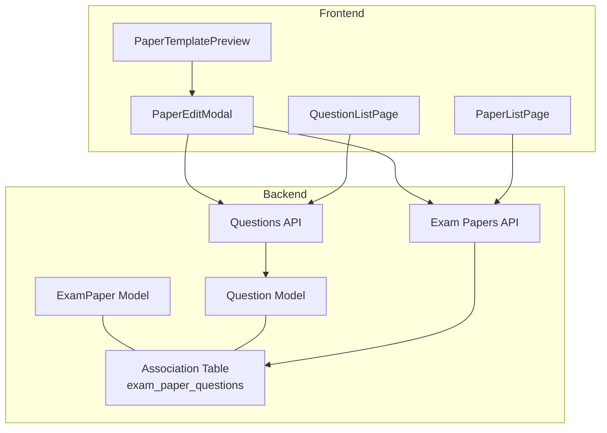
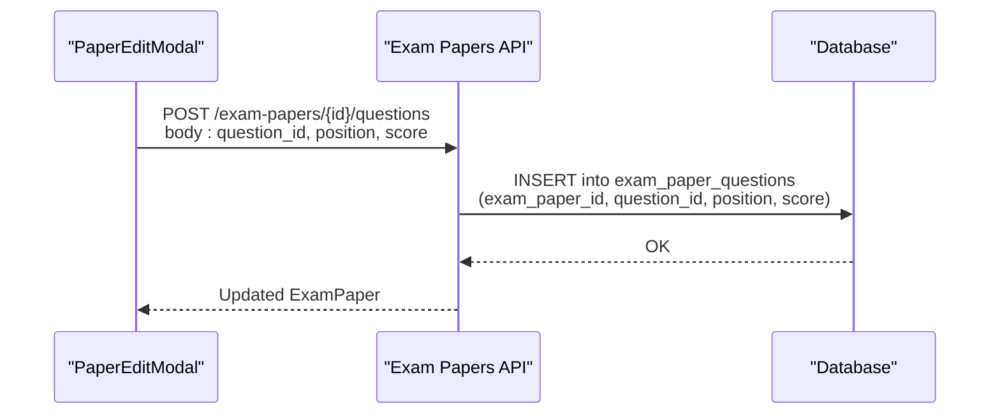
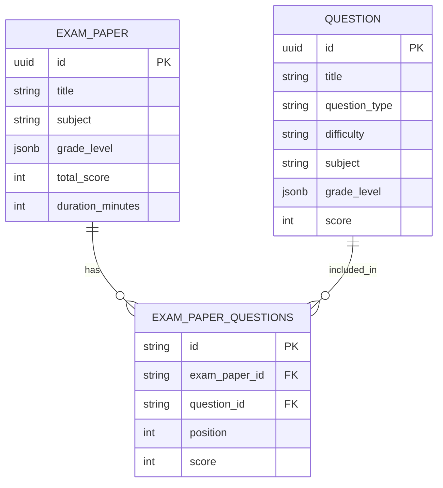
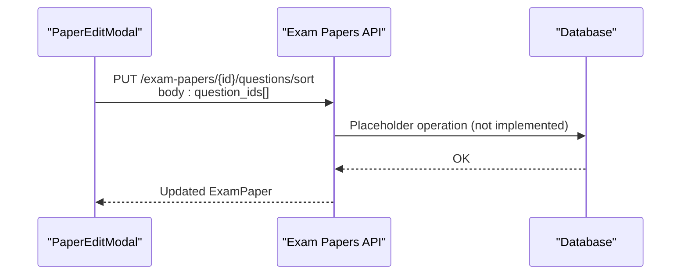
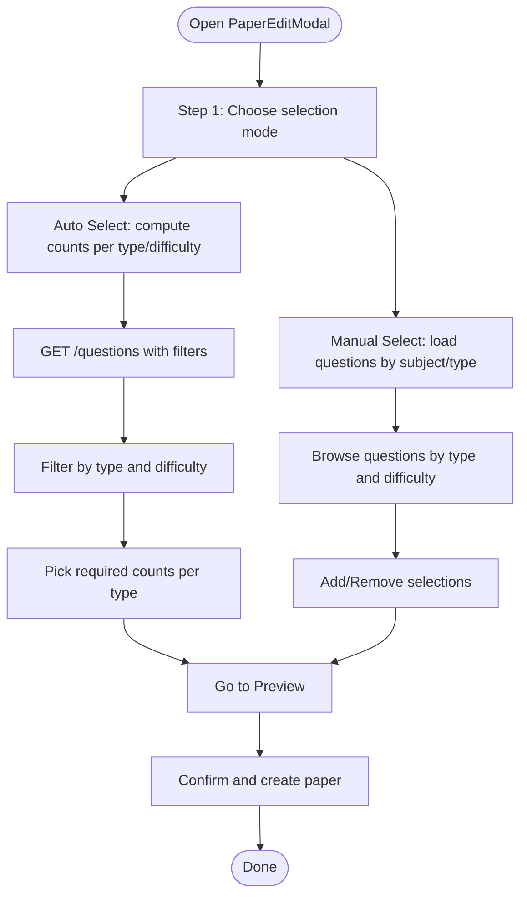
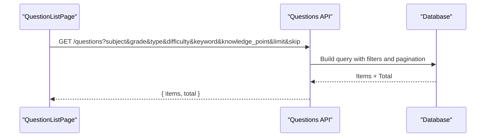
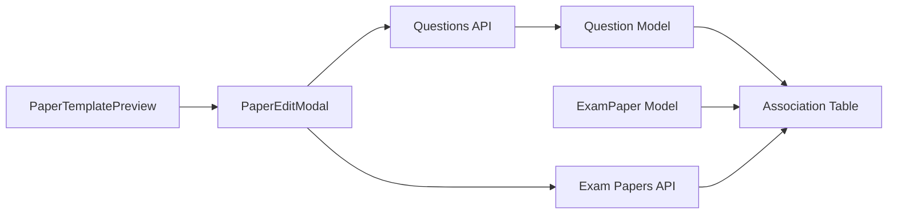

# Question Assignment

<cite>
**Referenced Files in This Document**
- [backend/app/models/exam_paper.py](file://backend/app/models/exam_paper.py)
- [backend/app/models/question.py](file://backend/app/models/question.py)
- [backend/app/schemas/exam_paper.py](file://backend/app/schemas/exam_paper.py)
- [backend/app/schemas/question.py](file://backend/app/schemas/question.py)
- [backend/app/api/v1/endpoints/exam_papers.py](file://backend/app/api/v1/endpoints/exam_papers.py)
- [backend/app/api/v1/endpoints/questions.py](file://backend/app/api/v1/endpoints/questions.py)
- [frontend/src/pages/papers/PaperEditModal.tsx](file://frontend/src/pages/papers/PaperEditModal.tsx)
- [frontend/src/pages/papers/PaperListPage.tsx](file://frontend/src/pages/papers/PaperListPage.tsx)
- [frontend/src/pages/papers/PaperTemplatePreview.tsx](file://frontend/src/pages/papers/PaperTemplatePreview.tsx)
- [frontend/src/pages/questions/QuestionListPage.tsx](file://frontend/src/pages/questions/QuestionListPage.tsx)
- [docs/database-design.md](file://docs/database-design.md)
</cite>

## Table of Contents
1. [Introduction](#introduction)
2. [Project Structure](#project-structure)
3. [Core Components](#core-components)
4. [Architecture Overview](#architecture-overview)
5. [Detailed Component Analysis](#detailed-component-analysis)
6. [Dependency Analysis](#dependency-analysis)
7. [Performance Considerations](#performance-considerations)
8. [Troubleshooting Guide](#troubleshooting-guide)
9. [Conclusion](#conclusion)
10. [Appendices](#appendices)

## Introduction
This document explains how question assignment works within exam papers. It covers the question addition workflow, position management, and scoring assignment per question. It documents the exam_paper_questions association table structure, question ordering algorithms, and position-based sorting mechanisms. It also describes question filtering and search capabilities, knowledge point mapping, difficulty distribution management, and the frontend drag-and-drop interface for arranging questions. Finally, it provides examples of question assignment strategies, randomization techniques, and best practices for creating balanced exam papers, along with the impact of removal and reordering on paper statistics.

## Project Structure
The question assignment feature spans backend models, APIs, and frontend components:
- Backend models define the many-to-many relationship via an association table with position and score.
- Backend endpoints implement adding/removing questions, sorting, and retrieving ordered questions.
- Frontend provides guided creation, manual selection, difficulty-aware browsing, and a live preview.

**Diagram sources**
- [backend/app/models/exam_paper.py:10-20](file://backend/app/models/exam_paper.py#L10-L20)
- [backend/app/models/question.py:10-36](file://backend/app/models/question.py#L10-L36)
- [backend/app/api/v1/endpoints/exam_papers.py:416-471](file://backend/app/api/v1/endpoints/exam_papers.py#L416-L471)
- [backend/app/api/v1/endpoints/questions.py:39-104](file://backend/app/api/v1/endpoints/questions.py#L39-L104)
- [frontend/src/pages/papers/PaperEditModal.tsx:69-187](file://frontend/src/pages/papers/PaperEditModal.tsx#L69-L187)
- [frontend/src/pages/papers/PaperTemplatePreview.tsx:15-131](file://frontend/src/pages/papers/PaperTemplatePreview.tsx#L15-L131)
- [frontend/src/pages/papers/PaperListPage.tsx:31-53](file://frontend/src/pages/papers/PaperListPage.tsx#L31-L53)
- [frontend/src/pages/questions/QuestionListPage.tsx:61-79](file://frontend/src/pages/questions/QuestionListPage.tsx#L61-L79)

**Section sources**
- [backend/app/models/exam_paper.py:10-20](file://backend/app/models/exam_paper.py#L10-L20)
- [backend/app/models/question.py:10-36](file://backend/app/models/question.py#L10-L36)
- [backend/app/api/v1/endpoints/exam_papers.py:416-471](file://backend/app/api/v1/endpoints/exam_papers.py#L416-L471)
- [backend/app/api/v1/endpoints/questions.py:39-104](file://backend/app/api/v1/endpoints/questions.py#L39-L104)
- [frontend/src/pages/papers/PaperEditModal.tsx:69-187](file://frontend/src/pages/papers/PaperEditModal.tsx#L69-L187)
- [frontend/src/pages/papers/PaperTemplatePreview.tsx:15-131](file://frontend/src/pages/papers/PaperTemplatePreview.tsx#L15-L131)
- [frontend/src/pages/papers/PaperListPage.tsx:31-53](file://frontend/src/pages/papers/PaperListPage.tsx#L31-L53)
- [frontend/src/pages/questions/QuestionListPage.tsx:61-79](file://frontend/src/pages/questions/QuestionListPage.tsx#L61-L79)

## Core Components
- Association table structure: The exam_paper_questions table stores the many-to-many relationship between ExamPaper and Question, with position and score fields for ordering and per-paper scoring.
- Position and score: position controls ordering; score sets per-paper point values independent of the base Question.score.
- Ordering retrieval: Queries join questions and exam_paper_questions and order by position to maintain stable presentation.
- Filtering and search: Backend supports rich filters on subject, grade, scope, source, type, difficulty, and keyword; frontend exposes these filters and allows manual selection.
- Difficulty distribution: Frontend computes counts per difficulty and type during automatic selection; backend enforces constraints on position and score.

**Section sources**
- [backend/app/models/exam_paper.py:10-20](file://backend/app/models/exam_paper.py#L10-L20)
- [backend/app/api/v1/endpoints/exam_papers.py:566-582](file://backend/app/api/v1/endpoints/exam_papers.py#L566-L582)
- [backend/app/api/v1/endpoints/questions.py:39-104](file://backend/app/api/v1/endpoints/questions.py#L39-L104)
- [frontend/src/pages/papers/PaperEditModal.tsx:105-130](file://frontend/src/pages/papers/PaperEditModal.tsx#L105-L130)

## Architecture Overview
The backend orchestrates question assignment through explicit endpoints:
- Add question to paper: inserts into exam_paper_questions with position and score.
- Remove question from paper: placeholder endpoint indicates future implementation.
- Sort questions in paper: placeholder endpoint indicates future implementation.
- Retrieve questions ordered by position: joins association table and orders by position.

**Diagram sources**
- [backend/app/api/v1/endpoints/exam_papers.py:416-471](file://backend/app/api/v1/endpoints/exam_papers.py#L416-L471)

**Section sources**
- [backend/app/api/v1/endpoints/exam_papers.py:416-471](file://backend/app/api/v1/endpoints/exam_papers.py#L416-L471)
- [backend/app/api/v1/endpoints/exam_papers.py:524-563](file://backend/app/api/v1/endpoints/exam_papers.py#L524-L563)
- [backend/app/api/v1/endpoints/exam_papers.py:566-582](file://backend/app/api/v1/endpoints/exam_papers.py#L566-L582)

## Detailed Component Analysis

### Association Table: exam_paper_questions
- Fields: id, exam_paper_id, question_id, position, score.
- Constraints: position and score are non-negative.
- Purpose: maintains ordered, scored links between papers and questions.

**Diagram sources**
- [backend/app/models/exam_paper.py:10-20](file://backend/app/models/exam_paper.py#L10-L20)
- [backend/app/models/question.py:10-36](file://backend/app/models/question.py#L10-L36)

**Section sources**
- [backend/app/models/exam_paper.py:10-20](file://backend/app/models/exam_paper.py#L10-L20)
- [docs/database-design.md](file://docs/database-design.md#L136)

### Backend Endpoints: Question Assignment
- Add question to paper: validates permissions and existence, then inserts into the association table with provided position and score.
- Remove question from paper: validates permissions and existence, currently returns a placeholder (TODO).
- Sort questions in paper: validates permissions and existence, currently returns a placeholder (TODO).
- Get questions ordered by position: joins association table and orders by position.

**Diagram sources**
- [backend/app/api/v1/endpoints/exam_papers.py:524-563](file://backend/app/api/v1/endpoints/exam_papers.py#L524-L563)

**Section sources**
- [backend/app/api/v1/endpoints/exam_papers.py:416-471](file://backend/app/api/v1/endpoints/exam_papers.py#L416-L471)
- [backend/app/api/v1/endpoints/exam_papers.py:473-522](file://backend/app/api/v1/endpoints/exam_papers.py#L473-L522)
- [backend/app/api/v1/endpoints/exam_papers.py:524-563](file://backend/app/api/v1/endpoints/exam_papers.py#L524-L563)
- [backend/app/api/v1/endpoints/exam_papers.py:566-582](file://backend/app/api/v1/endpoints/exam_papers.py#L566-L582)

### Frontend: Manual Selection and Preview
- Automatic selection: Computes counts per type and difficulty, queries questions by subject, filters in-memory, and selects matching questions.
- Manual selection: Loads questions filtered by subject and type, allows adding/removing questions, and tracks selected IDs.
- Preview: Renders a structured preview grouped by question type with indices and scores.

**Diagram sources**
- [frontend/src/pages/papers/PaperEditModal.tsx:69-187](file://frontend/src/pages/papers/PaperEditModal.tsx#L69-L187)
- [frontend/src/pages/papers/PaperTemplatePreview.tsx:15-131](file://frontend/src/pages/papers/PaperTemplatePreview.tsx#L15-L131)

**Section sources**
- [frontend/src/pages/papers/PaperEditModal.tsx:69-187](file://frontend/src/pages/papers/PaperEditModal.tsx#L69-L187)
- [frontend/src/pages/papers/PaperTemplatePreview.tsx:15-131](file://frontend/src/pages/papers/PaperTemplatePreview.tsx#L15-L131)

### Question Filtering and Search
- Backend search supports subject, grade, scope, source, question_type, difficulty, keyword, and knowledge_point filters; paginates and returns total count.
- Frontend exposes filters for keyword, type, difficulty, subject, grade, and knowledge_point; integrates with backend endpoints.

**Diagram sources**
- [backend/app/api/v1/endpoints/questions.py:39-104](file://backend/app/api/v1/endpoints/questions.py#L39-L104)
- [frontend/src/pages/questions/QuestionListPage.tsx:61-79](file://frontend/src/pages/questions/QuestionListPage.tsx#L61-L79)

**Section sources**
- [backend/app/api/v1/endpoints/questions.py:39-104](file://backend/app/api/v1/endpoints/questions.py#L39-L104)
- [frontend/src/pages/questions/QuestionListPage.tsx:61-79](file://frontend/src/pages/questions/QuestionListPage.tsx#L61-L79)

### Knowledge Point Mapping and Difficulty Distribution
- Knowledge points: stored in Question.meta_data as an array; frontend exports and filters by knowledge_point; backend’s question export filters knowledge_point in Python for SQLite compatibility.
- Difficulty distribution: frontend computes counts per difficulty and type during auto-selection; backend enforces non-negative position and score.

**Section sources**
- [backend/app/api/v1/endpoints/questions.py:171-214](file://backend/app/api/v1/endpoints/questions.py#L171-L214)
- [frontend/src/pages/papers/PaperEditModal.tsx:105-130](file://frontend/src/pages/papers/PaperEditModal.tsx#L105-L130)
- [backend/app/models/exam_paper.py:18-19](file://backend/app/models/exam_paper.py#L18-L19)

### Position-Based Sorting Mechanisms
- Retrieval: Queries join questions and exam_paper_questions and order by position to preserve order.
- Sorting endpoint: Placeholder indicates future implementation; current behavior returns the paper unchanged.

**Section sources**
- [backend/app/api/v1/endpoints/exam_papers.py:566-582](file://backend/app/api/v1/endpoints/exam_papers.py#L566-L582)
- [backend/app/api/v1/endpoints/exam_papers.py:524-563](file://backend/app/api/v1/endpoints/exam_papers.py#L524-L563)

### Frontend Drag-and-Drop Interface
- Manual selection allows clicking to add/remove questions; difficulty filters apply to unselected lists; preview shows current selection and supports replacing questions.
- Replace action removes a question from preview and returns to selection step.

**Section sources**
- [frontend/src/pages/papers/PaperEditModal.tsx:381-464](file://frontend/src/pages/papers/PaperEditModal.tsx#L381-L464)
- [frontend/src/pages/papers/PaperTemplatePreview.tsx:58-106](file://frontend/src/pages/papers/PaperTemplatePreview.tsx#L58-L106)

### Real-Time Position Updates and Bulk Operations
- Real-time updates: After adding questions, the frontend computes totals and updates preview immediately.
- Bulk operations: Frontend supports selecting multiple questions and exporting them; backend supports batch import and export endpoints.

**Section sources**
- [frontend/src/pages/papers/PaperEditModal.tsx:160-187](file://frontend/src/pages/papers/PaperEditModal.tsx#L160-L187)
- [backend/app/api/v1/endpoints/questions.py:127-155](file://backend/app/api/v1/endpoints/questions.py#L127-L155)
- [backend/app/api/v1/endpoints/questions.py:158-168](file://backend/app/api/v1/endpoints/questions.py#L158-L168)

### Examples of Question Assignment Strategies
- Balanced distribution: Use difficulty sliders to compute counts per difficulty and type; ensure pool has sufficient questions.
- Mixed-type papers: Combine fill-in-the-blank, single-choice, multiple-choice, and subjective questions according to desired proportions.
- Knowledge-point targeting: Filter by knowledge_point to target specific topics.

**Section sources**
- [frontend/src/pages/papers/PaperEditModal.tsx:105-130](file://frontend/src/pages/papers/PaperEditModal.tsx#L105-L130)
- [frontend/src/pages/questions/QuestionListPage.tsx:61-79](file://frontend/src/pages/questions/QuestionListPage.tsx#L61-L79)

### Randomization Techniques
- In-memory filtering: During auto-selection, frontend filters questions by type and difficulty and picks matches; this provides a controlled randomization within constraints.
- Future improvements: Backend could support randomized selection with explicit randomization endpoints.

**Section sources**
- [frontend/src/pages/papers/PaperEditModal.tsx:105-130](file://frontend/src/pages/papers/PaperEditModal.tsx#L105-L130)

### Best Practices for Creating Balanced Exam Papers
- Define clear scope and grade levels; use grade_level JSONB to constrain applicability.
- Maintain balanced difficulty distribution using sliders; verify availability in the question pool.
- Keep total score aligned with number of questions and per-question scores.
- Use knowledge_point filters to focus on targeted learning objectives.

**Section sources**
- [docs/database-design.md:274-316](file://docs/database-design.md#L274-L316)
- [frontend/src/pages/papers/PaperEditModal.tsx:69-130](file://frontend/src/pages/papers/PaperEditModal.tsx#L69-L130)

### Impact of Removal and Reordering on Paper Statistics
- Removal: Removing a question reduces question_count and total_score; current backend endpoint is a placeholder and does not modify the association table.
- Reordering: Retrieval is position-based; sorting endpoint is a placeholder and does not reorder positions until implemented.

**Section sources**
- [backend/app/api/v1/endpoints/exam_papers.py:473-522](file://backend/app/api/v1/endpoints/exam_papers.py#L473-L522)
- [backend/app/api/v1/endpoints/exam_papers.py:524-563](file://backend/app/api/v1/endpoints/exam_papers.py#L524-L563)
- [backend/app/api/v1/endpoints/exam_papers.py:566-582](file://backend/app/api/v1/endpoints/exam_papers.py#L566-L582)

## Dependency Analysis
- Backend models define the association table and constraints.
- Backend endpoints depend on the association table for ordering and scoring.
- Frontend depends on backend endpoints for question search, paper creation, and question assignment.

**Diagram sources**
- [backend/app/models/exam_paper.py:10-20](file://backend/app/models/exam_paper.py#L10-L20)
- [backend/app/models/question.py:10-36](file://backend/app/models/question.py#L10-L36)
- [backend/app/api/v1/endpoints/exam_papers.py:416-471](file://backend/app/api/v1/endpoints/exam_papers.py#L416-L471)
- [backend/app/api/v1/endpoints/questions.py:39-104](file://backend/app/api/v1/endpoints/questions.py#L39-L104)
- [frontend/src/pages/papers/PaperEditModal.tsx:69-187](file://frontend/src/pages/papers/PaperEditModal.tsx#L69-L187)
- [frontend/src/pages/papers/PaperTemplatePreview.tsx:15-131](file://frontend/src/pages/papers/PaperTemplatePreview.tsx#L15-L131)

**Section sources**
- [backend/app/models/exam_paper.py:10-20](file://backend/app/models/exam_paper.py#L10-L20)
- [backend/app/models/question.py:10-36](file://backend/app/models/question.py#L10-L36)
- [backend/app/api/v1/endpoints/exam_papers.py:416-471](file://backend/app/api/v1/endpoints/exam_papers.py#L416-L471)
- [backend/app/api/v1/endpoints/questions.py:39-104](file://backend/app/api/v1/endpoints/questions.py#L39-L104)
- [frontend/src/pages/papers/PaperEditModal.tsx:69-187](file://frontend/src/pages/papers/PaperEditModal.tsx#L69-L187)
- [frontend/src/pages/papers/PaperTemplatePreview.tsx:15-131](file://frontend/src/pages/papers/PaperTemplatePreview.tsx#L15-L131)

## Performance Considerations
- Indexing: The association table includes indexes on exam_paper_id and question_id to speed up joins and lookups.
- Pagination: Backend endpoints cap limit and use offset/limit for efficient retrieval.
- Position retrieval: Ordering by position is straightforward; future sorting operations should leverage indexes and avoid full-table scans.

**Section sources**
- [backend/app/models/exam_paper.py:14-15](file://backend/app/models/exam_paper.py#L14-L15)
- [backend/app/api/v1/endpoints/questions.py:55-104](file://backend/app/api/v1/endpoints/questions.py#L55-L104)
- [backend/app/api/v1/endpoints/exam_papers.py:566-582](file://backend/app/api/v1/endpoints/exam_papers.py#L566-L582)

## Troubleshooting Guide
- Permissions: Many endpoints restrict access to TEACHER, QUESTION_ADMIN, SYS_ADMIN, and optionally STUDENT; ensure the current user has appropriate roles.
- Not found errors: Adding/removal/sorting requires existing exam paper and question IDs; verify IDs and existence.
- Placeholders: Remove and sort endpoints are placeholders; expect no changes until implemented.

**Section sources**
- [backend/app/api/v1/endpoints/exam_papers.py:416-471](file://backend/app/api/v1/endpoints/exam_papers.py#L416-L471)
- [backend/app/api/v1/endpoints/exam_papers.py:473-522](file://backend/app/api/v1/endpoints/exam_papers.py#L473-L522)
- [backend/app/api/v1/endpoints/exam_papers.py:524-563](file://backend/app/api/v1/endpoints/exam_papers.py#L524-L563)

## Conclusion
The question assignment system centers on an association table that preserves per-paper ordering and scoring. The backend provides endpoints for adding questions and retrieving them in order, while the frontend offers guided creation, manual selection, and a live preview. Current sorting and removal endpoints are placeholders and will be implemented to support full drag-and-drop reordering and dynamic adjustments. By leveraging filters, difficulty distributions, and knowledge-point targeting, educators can assemble balanced, focused exams efficiently.

## Appendices
- Example JSON structures for grade_level and correct_answer are documented in the database design document.

**Section sources**
- [docs/database-design.md:274-316](file://docs/database-design.md#L274-L316)
- [docs/database-design.md:197-273](file://docs/database-design.md#L197-L273)