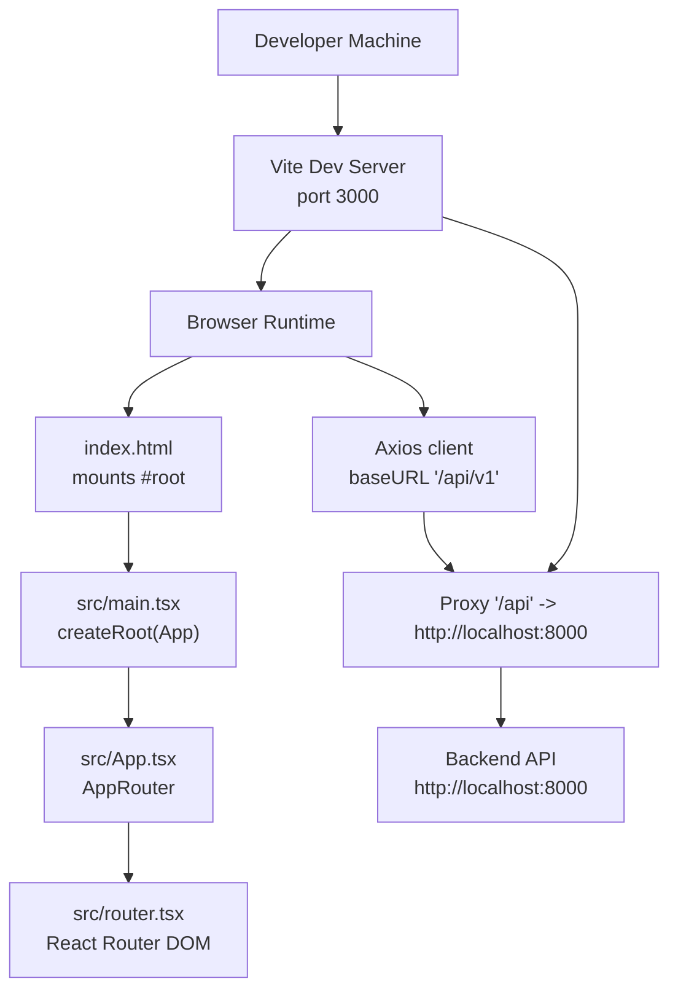
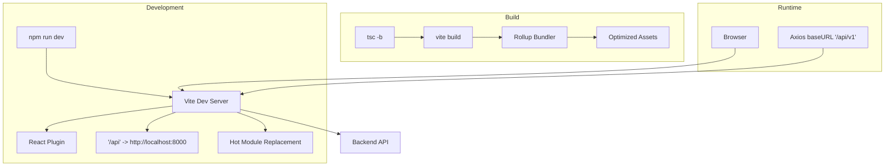
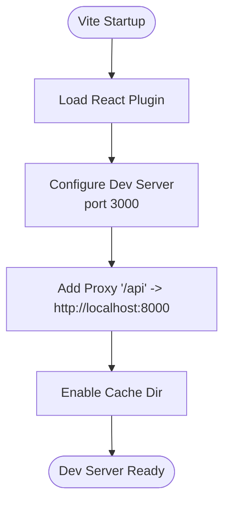
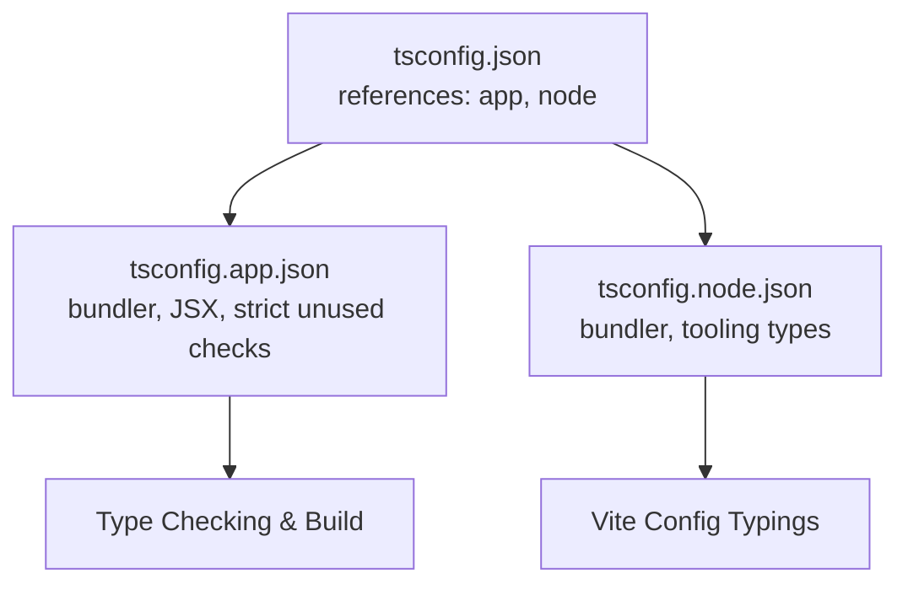
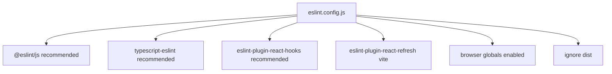
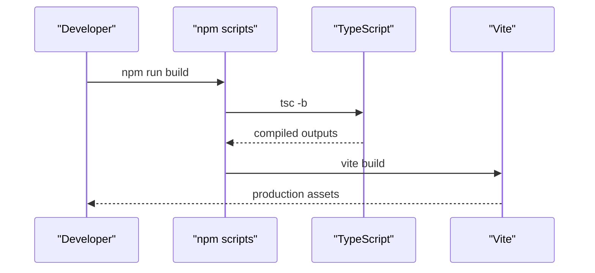
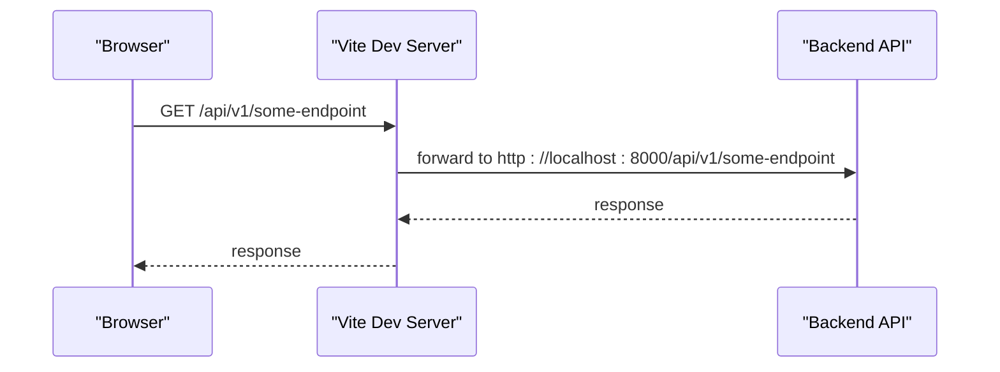
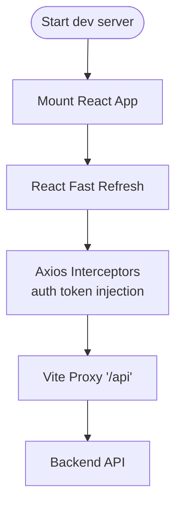
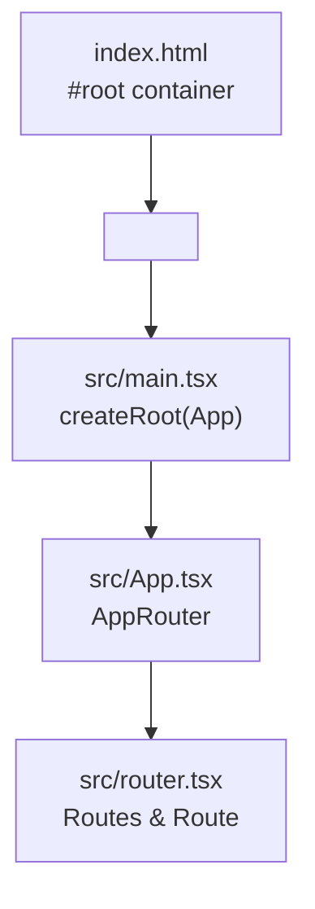
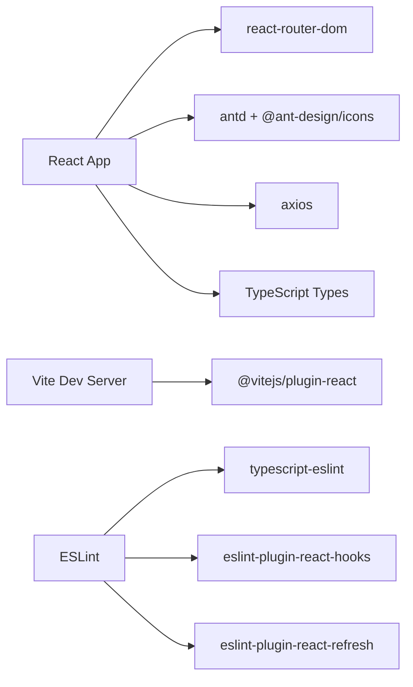

# Build Configuration

<cite>
**Referenced Files in This Document**
- [vite.config.ts](file://frontend/vite.config.ts)
- [package.json](file://frontend/package.json)
- [tsconfig.json](file://frontend/tsconfig.json)
- [tsconfig.app.json](file://frontend/tsconfig.app.json)
- [tsconfig.node.json](file://frontend/tsconfig.node.json)
- [eslint.config.js](file://frontend/eslint.config.js)
- [index.html](file://frontend/index.html)
- [src/main.tsx](file://frontend/src/main.tsx)
- [src/App.tsx](file://frontend/src/App.tsx)
- [src/router.tsx](file://frontend/src/router.tsx)
- [src/api/client.ts](file://frontend/src/api/client.ts)
- [frontend/Dockerfile](file://frontend/Dockerfile)
</cite>

## Table of Contents
1. [Introduction](#introduction)
2. [Project Structure](#project-structure)
3. [Core Components](#core-components)
4. [Architecture Overview](#architecture-overview)
5. [Detailed Component Analysis](#detailed-component-analysis)
6. [Dependency Analysis](#dependency-analysis)
7. [Performance Considerations](#performance-considerations)
8. [Troubleshooting Guide](#troubleshooting-guide)
9. [Conclusion](#conclusion)
10. [Appendices](#appendices)

## Introduction
This document provides comprehensive build configuration documentation for the Vite-based React application. It covers Vite configuration (plugins, server, caching), TypeScript configuration and type-checking setup, ESLint configuration for code quality and React-specific linting, package.json scripts for development, build, and preview workflows, and practical guidance for environment variables, proxy configuration for API requests, and hot module replacement. It also outlines development workflow, debugging configuration, and production build optimization including bundle analysis and performance monitoring.

## Project Structure
The frontend build system centers around Vite, TypeScript, and ESLint. The application entry point is rendered via a standard HTML template and mounts the React root. Routing is handled by React Router DOM, and API communication is performed through an Axios client configured with a base path that proxies through the Vite dev server to the backend.

**Diagram sources**
- [vite.config.ts:6-14](file://frontend/vite.config.ts#L6-L14)
- [index.html:10-11](file://frontend/index.html#L10-L11)
- [src/main.tsx:5-9](file://frontend/src/main.tsx#L5-L9)
- [src/App.tsx:3-5](file://frontend/src/App.tsx#L3-L5)
- [src/router.tsx:44-78](file://frontend/src/router.tsx#L44-L78)
- [src/api/client.ts:4-7](file://frontend/src/api/client.ts#L4-L7)

**Section sources**
- [vite.config.ts:1-17](file://frontend/vite.config.ts#L1-L17)
- [package.json:6-11](file://frontend/package.json#L6-L11)
- [index.html:1-14](file://frontend/index.html#L1-L14)
- [src/main.tsx:1-10](file://frontend/src/main.tsx#L1-L10)
- [src/App.tsx:1-6](file://frontend/src/App.tsx#L1-L6)
- [src/router.tsx:1-79](file://frontend/src/router.tsx#L1-L79)
- [src/api/client.ts:1-55](file://frontend/src/api/client.ts#L1-L55)

## Core Components
- Vite configuration
  - Plugin: React Fast Refresh and JSX transform via @vitejs/plugin-react
  - Dev server: port 3000 with proxy for "/api" targeting backend service
  - Caching: custom cache directory under user home
- TypeScript configuration
  - Root references two TS projects: app and node
  - App project targets modern JS, bundler module resolution, JSX transform, strict unused checks
  - Node project targets tooling and Vite config typing
- ESLint configuration
  - Flat config using @eslint/js recommended, typescript-eslint recommended, React Hooks recommended, and React Refresh Vite integration
  - Global browser environment enabled for linting
- Package scripts
  - dev: start Vite dev server
  - build: compile TS then run Vite build
  - lint: run ESLint across the project
  - preview: serve built assets locally

**Section sources**
- [vite.config.ts:4-16](file://frontend/vite.config.ts#L4-L16)
- [tsconfig.json:1-8](file://frontend/tsconfig.json#L1-L8)
- [tsconfig.app.json:2-25](file://frontend/tsconfig.app.json#L2-L25)
- [tsconfig.node.json:2-24](file://frontend/tsconfig.node.json#L2-L24)
- [eslint.config.js:8-22](file://frontend/eslint.config.js#L8-L22)
- [package.json:6-11](file://frontend/package.json#L6-L11)

## Architecture Overview
The build pipeline integrates TypeScript compilation with Vite’s bundling and dev server. During development, Vite serves the app and proxies API requests to the backend. Production builds leverage Vite’s optimized bundling and asset handling.

**Diagram sources**
- [package.json:7-8](file://frontend/package.json#L7-L8)
- [vite.config.ts:5](file://frontend/vite.config.ts#L5)
- [vite.config.ts:8-13](file://frontend/vite.config.ts#L8-L13)

## Detailed Component Analysis

### Vite Configuration
- Plugins
  - React plugin enables JSX transform and React Fast Refresh during development.
- Dev server
  - Port set to 3000.
  - Proxy configured for "/api" to backend service, enabling local API access without CORS concerns.
- Caching
  - Custom cache directory improves performance and avoids permission issues in CI environments.

**Diagram sources**
- [vite.config.ts:5](file://frontend/vite.config.ts#L5)
- [vite.config.ts:6-15](file://frontend/vite.config.ts#L6-L15)

**Section sources**
- [vite.config.ts:4-16](file://frontend/vite.config.ts#L4-L16)

### TypeScript Configuration
- Root configuration
  - Uses project references to separate app and node configurations.
- App configuration
  - Targets modern JS runtime, uses bundler module resolution, JSX transform, and strict unused checks.
  - No emit for app TS program to rely on Vite for emitting during dev/build.
- Node configuration
  - Targets tooling and Vite config typing, with bundler module resolution and strictness.

**Diagram sources**
- [tsconfig.json:3-6](file://frontend/tsconfig.json#L3-L6)
- [tsconfig.app.json:11-15](file://frontend/tsconfig.app.json#L11-L15)
- [tsconfig.node.json:11-15](file://frontend/tsconfig.node.json#L11-L15)

**Section sources**
- [tsconfig.json:1-8](file://frontend/tsconfig.json#L1-L8)
- [tsconfig.app.json:2-25](file://frontend/tsconfig.app.json#L2-L25)
- [tsconfig.node.json:2-24](file://frontend/tsconfig.node.json#L2-L24)

### ESLint Configuration
- Flat config extends recommended sets for JS, TS, React Hooks, and React Refresh integration with Vite.
- Enables browser globals for linting React components in the browser environment.
- Ignores dist output folder to avoid unnecessary linting of built artifacts.

**Diagram sources**
- [eslint.config.js:8-22](file://frontend/eslint.config.js#L8-L22)

**Section sources**
- [eslint.config.js:1-23](file://frontend/eslint.config.js#L1-L23)

### Package Scripts and Workflows
- Development
  - Starts Vite dev server with React Fast Refresh.
- Build
  - Runs TypeScript project references build, then Vite build for optimized production bundles.
- Preview
  - Serves the production build locally for verification.
- Lint
  - Runs ESLint across the project for code quality.

**Diagram sources**
- [package.json:7-8](file://frontend/package.json#L7-L8)

**Section sources**
- [package.json:6-11](file://frontend/package.json#L6-L11)

### Environment Variables and Proxy Configuration
- Environment variables
  - The Vite configuration reads a cache directory path from the HOME environment variable. Ensure the environment variable is set appropriately in your shell or CI environment.
- Proxy configuration
  - Vite dev server proxies "/api" to the backend service. This allows frontend requests to use absolute paths under "/api" without cross-origin issues.
  - Axios client uses a base path of "/api/v1". Requests are proxied to the backend, which typically exposes API endpoints under "/api/v1".

**Diagram sources**
- [vite.config.ts:8-13](file://frontend/vite.config.ts#L8-L13)
- [src/api/client.ts:4-7](file://frontend/src/api/client.ts#L4-L7)

**Section sources**
- [vite.config.ts:15](file://frontend/vite.config.ts#L15)
- [vite.config.ts:8-13](file://frontend/vite.config.ts#L8-L13)
- [src/api/client.ts:4-7](file://frontend/src/api/client.ts#L4-L7)

### Hot Module Replacement (HMR)
- React Fast Refresh is enabled via the Vite React plugin. This provides fast updates to components without full page reloads during development.

**Section sources**
- [vite.config.ts:5](file://frontend/vite.config.ts#L5)

### Development Workflow and Debugging
- Development server runs on port 3000 with proxy support for API traffic.
- React Fast Refresh accelerates iteration by updating components in place.
- Axios interceptors handle authentication tokens and automatic unwrapping of backend response envelopes.

**Diagram sources**
- [vite.config.ts:5](file://frontend/vite.config.ts#L5)
- [src/api/client.ts:9-15](file://frontend/src/api/client.ts#L9-L15)
- [src/api/client.ts:17-25](file://frontend/src/api/client.ts#L17-L25)

**Section sources**
- [vite.config.ts:6-15](file://frontend/vite.config.ts#L6-L15)
- [src/api/client.ts:1-55](file://frontend/src/api/client.ts#L1-L55)

### Production Build Optimization
- Bundling and asset optimization
  - Vite performs code splitting and tree shaking by default in production builds. Use dynamic imports for route-level code splitting to reduce initial bundle size.
- Bundle analysis and performance monitoring
  - Install and configure a Vite plugin for bundle analysis (e.g., vite-bundle-analyzer) to inspect bundle composition and identify large dependencies.
  - Monitor Largest Contentful Paint (LCP), First Input Delay (FID), and Cumulative Layout Shift (CLS) in production using web vitals collection and analytics.

[No sources needed since this section provides general guidance]

### Asset Loading and Entry Point
- The HTML template defines the root container and loads the module entry script.
- The React root mounts the App component, which renders the routing hierarchy.

**Diagram sources**
- [index.html:10-11](file://frontend/index.html#L10-L11)
- [src/main.tsx:5-9](file://frontend/src/main.tsx#L5-L9)
- [src/App.tsx:3-5](file://frontend/src/App.tsx#L3-L5)
- [src/router.tsx:44-78](file://frontend/src/router.tsx#L44-L78)

**Section sources**
- [index.html:1-14](file://frontend/index.html#L1-L14)
- [src/main.tsx:1-10](file://frontend/src/main.tsx#L1-L10)
- [src/App.tsx:1-6](file://frontend/src/App.tsx#L1-L6)
- [src/router.tsx:1-79](file://frontend/src/router.tsx#L1-L79)

## Dependency Analysis
- Internal dependencies
  - The app depends on React, React Router DOM, Ant Design, and Axios for UI, routing, design system, and HTTP requests.
  - TypeScript configurations depend on bundler module resolution and JSX transform.
  - ESLint configuration depends on flat config extensions and React Refresh integration.
- External dependencies
  - Vite dev server and plugins, TypeScript compiler, and ESLint ecosystem.

**Diagram sources**
- [package.json:12-21](file://frontend/package.json#L12-L21)
- [package.json:23-35](file://frontend/package.json#L23-L35)
- [vite.config.ts:5](file://frontend/vite.config.ts#L5)
- [eslint.config.js:12-16](file://frontend/eslint.config.js#L12-L16)

**Section sources**
- [package.json:12-35](file://frontend/package.json#L12-L35)
- [vite.config.ts:5](file://frontend/vite.config.ts#L5)
- [eslint.config.js:1-23](file://frontend/eslint.config.js#L1-L23)

## Performance Considerations
- Code splitting
  - Prefer dynamic imports for routes and heavy components to achieve lazy loading and smaller initial bundles.
- Tree shaking
  - Use ES modules and avoid side effects where possible. Favor libraries with tree-shaking-friendly distributions.
- Asset optimization
  - Leverage Vite’s built-in asset handling and minification. Compress images and fonts, and consider CDN delivery for static assets.
- Bundle analysis
  - Integrate a bundle analyzer plugin to visualize dependencies and identify optimization opportunities.

[No sources needed since this section provides general guidance]

## Troubleshooting Guide
- Proxy not working
  - Verify the proxy target matches the backend address and port. Confirm the backend is reachable at the specified host/port.
- API requests failing in dev
  - Ensure the Axios baseURL aligns with the proxy path. Requests under "/api/v1" will be forwarded by Vite.
- Cache directory issues
  - If builds fail due to cache permissions, confirm the HOME environment variable is set and the cache directory exists.
- Type errors in dev
  - Run TypeScript checks separately to identify issues; the app TS project is configured for no emit, so type errors surface in dev.
- Lint errors
  - Run ESLint to identify issues; ensure the editor is configured to use the project’s ESLint flat config.

**Section sources**
- [vite.config.ts:8-13](file://frontend/vite.config.ts#L8-L13)
- [src/api/client.ts:4-7](file://frontend/src/api/client.ts#L4-L7)
- [vite.config.ts:15](file://frontend/vite.config.ts#L15)
- [tsconfig.app.json:15](file://frontend/tsconfig.app.json#L15)
- [eslint.config.js:8-22](file://frontend/eslint.config.js#L8-L22)

## Conclusion
The build configuration leverages Vite for a fast development experience with React Fast Refresh and a robust proxy setup for API requests. TypeScript is configured with modern module resolution and strict linting, while ESLint enforces code quality with React-specific rules. The package scripts streamline development, building, and previewing. For production, Vite’s defaults provide effective code splitting and tree shaking; complement with bundle analysis and performance monitoring for continuous optimization.

## Appendices
- Docker development setup
  - The frontend Dockerfile installs dependencies and starts the dev server bound to 0.0.0.0 to enable external access in containerized environments.

**Section sources**
- [frontend/Dockerfile:10](file://frontend/Dockerfile#L10)