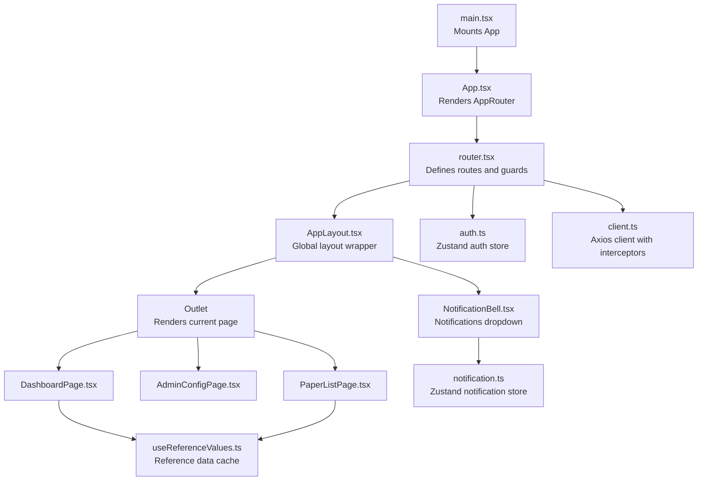
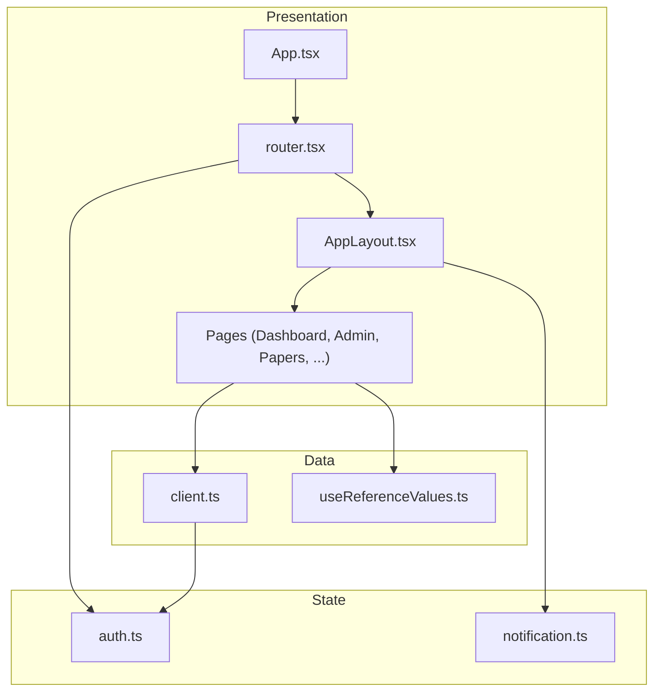
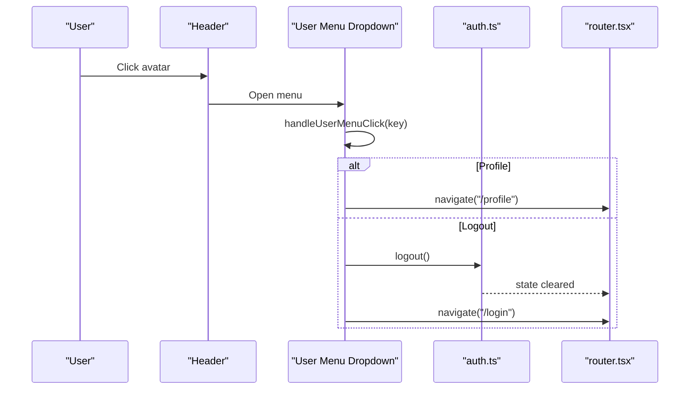
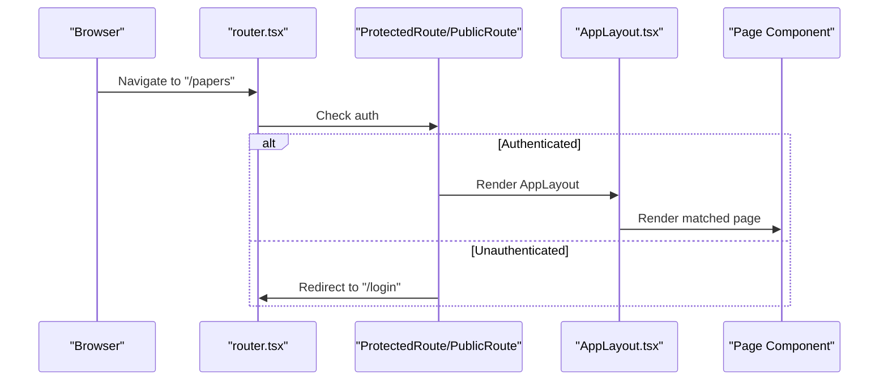
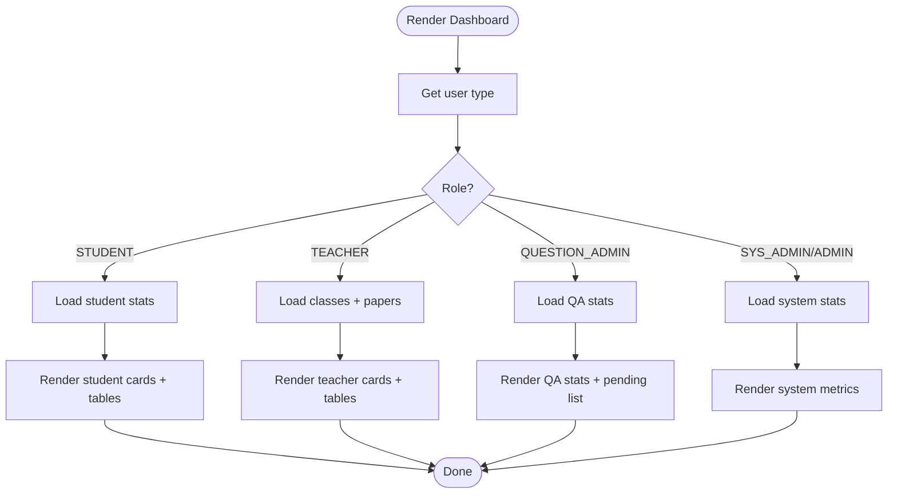
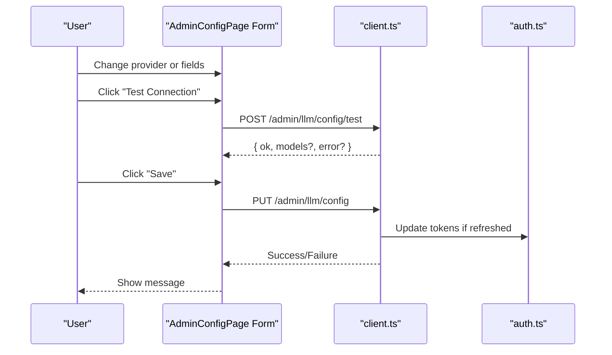
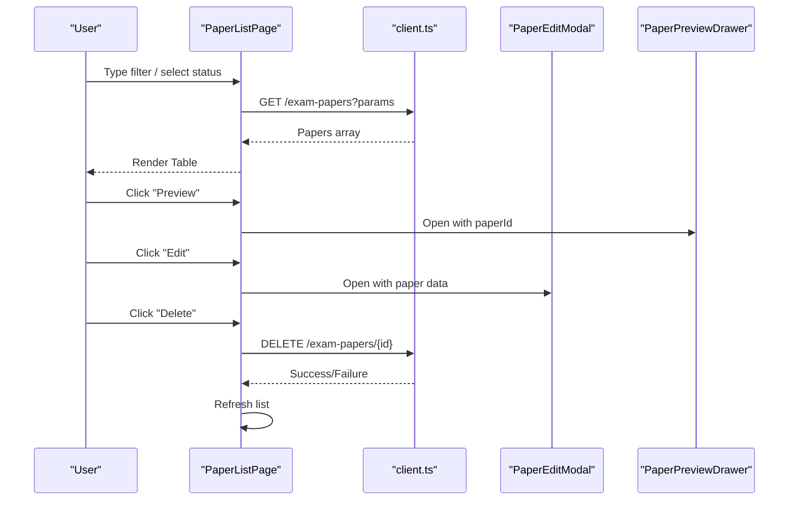
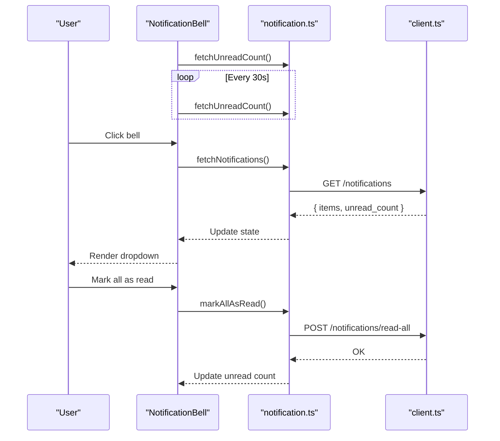
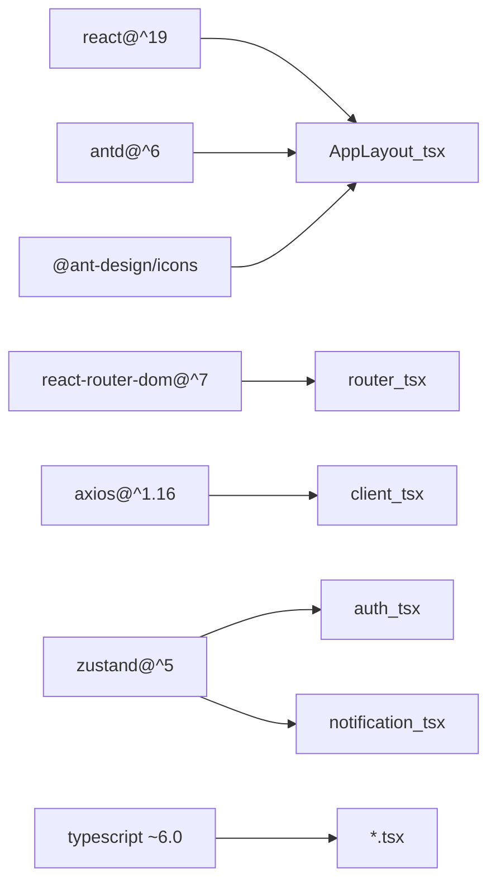

# Component Architecture

<cite>
**Referenced Files in This Document**
- [App.tsx](file://frontend/src/App.tsx)
- [main.tsx](file://frontend/src/main.tsx)
- [router.tsx](file://frontend/src/router.tsx)
- [AppLayout.tsx](file://frontend/src/components/layout/AppLayout.tsx)
- [DashboardPage.tsx](file://frontend/src/pages/dashboard/DashboardPage.tsx)
- [AdminConfigPage.tsx](file://frontend/src/pages/admin/AdminConfigPage.tsx)
- [PaperListPage.tsx](file://frontend/src/pages/papers/PaperListPage.tsx)
- [useReferenceValues.ts](file://frontend/src/hooks/useReferenceValues.ts)
- [client.ts](file://frontend/src/api/client.ts)
- [auth.ts](file://frontend/src/store/auth.ts)
- [notification.ts](file://frontend/src/store/notification.ts)
- [NotificationBell.tsx](file://frontend/src/components/notification/NotificationBell.tsx)
- [package.json](file://frontend/package.json)
- [tsconfig.json](file://frontend/tsconfig.json)
</cite>

## Table of Contents
1. [Introduction](#introduction)
2. [Project Structure](#project-structure)
3. [Core Components](#core-components)
4. [Architecture Overview](#architecture-overview)
5. [Detailed Component Analysis](#detailed-component-analysis)
6. [Dependency Analysis](#dependency-analysis)
7. [Performance Considerations](#performance-considerations)
8. [Troubleshooting Guide](#troubleshooting-guide)
9. [Conclusion](#conclusion)
10. [Appendices](#appendices)

## Introduction
This document describes the component architecture of the React 19 frontend. It focuses on the layout system centered around AppLayout, the page-based organization of features, component composition patterns, prop passing strategies, reusability principles, responsive design, styling approaches, and guidelines for building new components. It also covers lifecycle management, performance optimization via component splitting, and accessibility considerations.

## Project Structure
The frontend is organized by feature and responsibility:
- Root entry renders the application shell and mounts the router.
- Routing defines protected/public routes and nested layouts.
- AppLayout composes the global layout (sidebar, header, content area) and hosts page content via Outlet.
- Pages are grouped under feature folders (e.g., dashboard, admin, papers, questions).
- Shared utilities include a typed API client, Zustand stores for auth and notifications, and reusable hooks for reference data.

**Diagram sources**
- [main.tsx:1-10](file://frontend/src/main.tsx#L1-L10)
- [App.tsx:1-6](file://frontend/src/App.tsx#L1-L6)
- [router.tsx:1-79](file://frontend/src/router.tsx#L1-L79)
- [AppLayout.tsx:1-166](file://frontend/src/components/layout/AppLayout.tsx#L1-L166)
- [DashboardPage.tsx:1-580](file://frontend/src/pages/dashboard/DashboardPage.tsx#L1-L580)
- [AdminConfigPage.tsx:1-401](file://frontend/src/pages/admin/AdminConfigPage.tsx#L1-L401)
- [PaperListPage.tsx:1-169](file://frontend/src/pages/papers/PaperListPage.tsx#L1-L169)
- [useReferenceValues.ts:1-84](file://frontend/src/hooks/useReferenceValues.ts#L1-L84)
- [client.ts:1-55](file://frontend/src/api/client.ts#L1-L55)
- [auth.ts:1-96](file://frontend/src/store/auth.ts#L1-L96)
- [notification.ts:1-80](file://frontend/src/store/notification.ts#L1-L80)
- [NotificationBell.tsx:1-117](file://frontend/src/components/notification/NotificationBell.tsx#L1-L117)

**Section sources**
- [main.tsx:1-10](file://frontend/src/main.tsx#L1-L10)
- [App.tsx:1-6](file://frontend/src/App.tsx#L1-L6)
- [router.tsx:1-79](file://frontend/src/router.tsx#L1-L79)

## Core Components
- App: Minimal renderer delegating to the router.
- AppRouter: Central routing with protected/public routes, nested layout, and dynamic route selection based on user role.
- AppLayout: Global layout with collapsible sidebar, header with user menu and notifications, and content area via Outlet.
- Page components: Feature-specific pages (e.g., DashboardPage, AdminConfigPage, PaperListPage) encapsulate domain logic and UI.
- Hooks and Stores: useReferenceValues for shared reference data caching; auth and notification stores for cross-cutting concerns.

Key composition patterns:
- Layout-first architecture: AppLayout wraps all pages, ensuring consistent navigation and branding.
- Route-driven composition: Pages are mounted inside AppLayout via Outlet, enabling consistent spacing and theming.
- Hook-driven data: useReferenceValues centralizes reference data fetching and memoization.
- Store-driven state: auth and notification stores manage global state with minimal coupling.

**Section sources**
- [App.tsx:1-6](file://frontend/src/App.tsx#L1-L6)
- [router.tsx:1-79](file://frontend/src/router.tsx#L1-L79)
- [AppLayout.tsx:1-166](file://frontend/src/components/layout/AppLayout.tsx#L1-L166)
- [DashboardPage.tsx:1-580](file://frontend/src/pages/dashboard/DashboardPage.tsx#L1-L580)
- [AdminConfigPage.tsx:1-401](file://frontend/src/pages/admin/AdminConfigPage.tsx#L1-L401)
- [PaperListPage.tsx:1-169](file://frontend/src/pages/papers/PaperListPage.tsx#L1-L169)
- [useReferenceValues.ts:1-84](file://frontend/src/hooks/useReferenceValues.ts#L1-L84)
- [auth.ts:1-96](file://frontend/src/store/auth.ts#L1-L96)
- [notification.ts:1-80](file://frontend/src/store/notification.ts#L1-L80)

## Architecture Overview
The system follows a layered, feature-centric architecture:
- Presentation Layer: App, AppRouter, AppLayout, and page components.
- Data Access Layer: Axios client with request/response interceptors.
- State Management: Zustand stores for auth and notifications.
- Shared Utilities: Reference data hook and typed API client.

**Diagram sources**
- [App.tsx:1-6](file://frontend/src/App.tsx#L1-L6)
- [router.tsx:1-79](file://frontend/src/router.tsx#L1-L79)
- [AppLayout.tsx:1-166](file://frontend/src/components/layout/AppLayout.tsx#L1-L166)
- [DashboardPage.tsx:1-580](file://frontend/src/pages/dashboard/DashboardPage.tsx#L1-L580)
- [AdminConfigPage.tsx:1-401](file://frontend/src/pages/admin/AdminConfigPage.tsx#L1-L401)
- [PaperListPage.tsx:1-169](file://frontend/src/pages/papers/PaperListPage.tsx#L1-L169)
- [client.ts:1-55](file://frontend/src/api/client.ts#L1-L55)
- [useReferenceValues.ts:1-84](file://frontend/src/hooks/useReferenceValues.ts#L1-L84)
- [auth.ts:1-96](file://frontend/src/store/auth.ts#L1-L96)
- [notification.ts:1-80](file://frontend/src/store/notification.ts#L1-L80)

## Detailed Component Analysis

### AppLayout: Global Layout and Navigation
Responsibilities:
- Collapsible sidebar with role-aware menu items and nested groups.
- Header with user avatar dropdown and notification bell.
- Content area rendering the current page via Outlet.
- Theme integration via Ant Design tokens.

Composition patterns:
- Uses React Router hooks to manage navigation and selection state.
- Integrates Ant Design components for layout primitives and icons.
- Reads user type from auth store to dynamically render menus.

**Diagram sources**
- [AppLayout.tsx:78-104](file://frontend/src/components/layout/AppLayout.tsx#L78-L104)
- [auth.ts:72-87](file://frontend/src/store/auth.ts#L72-L87)
- [router.tsx:28-36](file://frontend/src/router.tsx#L28-L36)

**Section sources**
- [AppLayout.tsx:1-166](file://frontend/src/components/layout/AppLayout.tsx#L1-L166)

### Router and Route Guards
Responsibilities:
- Defines public and protected routes.
- Protects nested routes under AppLayout.
- Redirects unauthenticated users to login.
- Provides role-based route selection (e.g., PapersPage chooses student vs teacher views).

**Diagram sources**
- [router.tsx:26-36](file://frontend/src/router.tsx#L26-L36)
- [router.tsx:44-78](file://frontend/src/router.tsx#L44-L78)
- [AppLayout.tsx:1-166](file://frontend/src/components/layout/AppLayout.tsx#L1-L166)

**Section sources**
- [router.tsx:1-79](file://frontend/src/router.tsx#L1-L79)

### DashboardPage: Role-Based Feature Composition
Responsibilities:
- Loads and displays role-specific dashboards.
- Uses reference data for labels/colors and renders statistics and tables.
- Handles loading states and conditional rendering per role.

Patterns:
- Conditional rendering based on user type.
- Parallel data fetching for teacher dashboards.
- Reusable reference data mapping utilities.

**Diagram sources**
- [DashboardPage.tsx:32-72](file://frontend/src/pages/dashboard/DashboardPage.tsx#L32-L72)
- [DashboardPage.tsx:14-50](file://frontend/src/pages/dashboard/DashboardPage.tsx#L14-L50)
- [useReferenceValues.ts:67-83](file://frontend/src/hooks/useReferenceValues.ts#L67-L83)

**Section sources**
- [DashboardPage.tsx:1-580](file://frontend/src/pages/dashboard/DashboardPage.tsx#L1-L580)
- [useReferenceValues.ts:1-84](file://frontend/src/hooks/useReferenceValues.ts#L1-L84)

### AdminConfigPage: Form-Driven Configuration
Responsibilities:
- Manages multiple configuration sections (LLM, OCR, Database, Other).
- Uses Ant Design forms with validation and controlled inputs.
- Implements connection testing and saving flows with loading states.

Patterns:
- Section-based tabs for modular configuration editing.
- Controlled form state with Ant Design Form hooks.
- API-driven updates with optimistic UI feedback.

**Diagram sources**
- [AdminConfigPage.tsx:32-93](file://frontend/src/pages/admin/AdminConfigPage.tsx#L32-L93)
- [client.ts:9-52](file://frontend/src/api/client.ts#L9-L52)
- [auth.ts:72-87](file://frontend/src/store/auth.ts#L72-L87)

**Section sources**
- [AdminConfigPage.tsx:1-401](file://frontend/src/pages/admin/AdminConfigPage.tsx#L1-L401)
- [client.ts:1-55](file://frontend/src/api/client.ts#L1-L55)
- [auth.ts:1-96](file://frontend/src/store/auth.ts#L1-L96)

### PaperListPage: Data-Driven Table with Modals
Responsibilities:
- Fetches and filters exam papers with multiple criteria.
- Renders a paginated-like table with action dropdowns and modals.
- Supports preview, edit, delete, export, and print actions.

Patterns:
- Encapsulated state with useState/useEffect/useCallback.
- Controlled search/filter state synchronized to URL-like parameters.
- Action handlers passed down to child components (modals, drawers).

**Diagram sources**
- [PaperListPage.tsx:31-65](file://frontend/src/pages/papers/PaperListPage.tsx#L31-L65)
- [PaperListPage.tsx:96-130](file://frontend/src/pages/papers/PaperListPage.tsx#L96-L130)
- [client.ts:1-55](file://frontend/src/api/client.ts#L1-L55)

**Section sources**
- [PaperListPage.tsx:1-169](file://frontend/src/pages/papers/PaperListPage.tsx#L1-L169)
- [client.ts:1-55](file://frontend/src/api/client.ts#L1-L55)

### NotificationBell: Reactive Notifications
Responsibilities:
- Displays unread count badge.
- Opens a dropdown with a paginated list of notifications.
- Supports marking as read and marking all as read.

Patterns:
- Polling for unread count with intervals.
- Lazy-loading notifications on open.
- Optimistic updates to unread count after actions.

**Diagram sources**
- [NotificationBell.tsx:29-49](file://frontend/src/components/notification/NotificationBell.tsx#L29-L49)
- [NotificationBell.tsx:51-101](file://frontend/src/components/notification/NotificationBell.tsx#L51-L101)
- [notification.ts:32-78](file://frontend/src/store/notification.ts#L32-L78)
- [client.ts:1-55](file://frontend/src/api/client.ts#L1-L55)

**Section sources**
- [NotificationBell.tsx:1-117](file://frontend/src/components/notification/NotificationBell.tsx#L1-L117)
- [notification.ts:1-80](file://frontend/src/store/notification.ts#L1-L80)
- [client.ts:1-55](file://frontend/src/api/client.ts#L1-L55)

## Dependency Analysis
External dependencies and internal relationships:
- React 19 and React Router Dom 7 power routing and component model.
- Ant Design 6 provides UI primitives and icons.
- Axios handles HTTP requests with interceptors.
- Zustand manages global state for auth and notifications.
- TypeScript enforces type safety across stores and hooks.

**Diagram sources**
- [package.json:12-21](file://frontend/package.json#L12-L21)
- [tsconfig.json:1-8](file://frontend/tsconfig.json#L1-L8)

**Section sources**
- [package.json:1-38](file://frontend/package.json#L1-L38)
- [tsconfig.json:1-8](file://frontend/tsconfig.json#L1-L8)

## Performance Considerations
- Component splitting and lazy loading: Split large pages (e.g., AdminConfigPage) into smaller chunks and load on demand to reduce initial bundle size.
- Memoization: Use useMemo/useCallback in heavy pages (e.g., PaperListPage) to prevent unnecessary re-renders during filtering.
- Reference data caching: useReferenceValues caches reference data globally to avoid repeated network calls across pages.
- Virtualized lists: For large datasets, consider virtualizing tables to improve rendering performance.
- Image and asset optimization: Compress images and defer non-critical assets.
- Avoid blocking operations in render: Move heavy computations to effects or background threads.

## Troubleshooting Guide
Common issues and resolutions:
- Authentication errors: The API client intercepts 401 responses and attempts token refresh. If refresh fails, the user is redirected to login. Verify refresh token presence and endpoint availability.
- Network failures: Inspect request/response interceptors and ensure proper error handling in pages.
- State drift: Confirm that auth and notification stores are initialized correctly and persisted in localStorage.
- Reference data not loading: Check the reference data cache initialization and listener mechanism.

**Section sources**
- [client.ts:17-52](file://frontend/src/api/client.ts#L17-L52)
- [auth.ts:47-95](file://frontend/src/store/auth.ts#L47-L95)
- [notification.ts:26-79](file://frontend/src/store/notification.ts#L26-L79)
- [useReferenceValues.ts:35-63](file://frontend/src/hooks/useReferenceValues.ts#L35-L63)

## Conclusion
The application employs a clean, layout-first architecture with clear separation of concerns. AppLayout centralizes navigation and theming, while routing ensures secure and role-aware access to features. Pages encapsulate domain logic, hooks and stores provide reusable cross-cutting capabilities, and Ant Design offers consistent UI primitives. Following the guidelines below will help maintain scalability, performance, and accessibility as the system evolves.

## Appendices

### Guidelines for Creating New Components
- Naming conventions:
  - Use PascalCase for component filenames (e.g., MyFeaturePage.tsx).
  - Keep component names descriptive and scoped to their feature.
- Folder structure:
  - Place page components under pages/<feature>/.
  - Put shared components under components/<category>/.
  - Put hooks under hooks/.
  - Put stores under store/.
- Prop passing:
  - Prefer small, focused props; group related props into objects when appropriate.
  - Use default props sparingly; prefer explicit props from parents.
- Composition:
  - Wrap feature pages in AppLayout via Outlet to inherit consistent layout and navigation.
  - Use Ant Design components for consistency; customize via theme tokens and CSS-in-JS where necessary.
- Accessibility:
  - Ensure semantic HTML and ARIA attributes where needed.
  - Provide keyboard navigation support and focus management.
  - Use meaningful labels and alt texts for icons and images.
- Styling:
  - Prefer Ant Design tokens and CSS-in-JS for theming.
  - Avoid inline styles; use styled components or CSS modules for complex overrides.
- Lifecycle:
  - Initialize data fetching in effects; handle loading and error states.
  - Clean up subscriptions and intervals in cleanup functions.
- Performance:
  - Split large components into smaller ones.
  - Memoize expensive computations and callbacks.
  - Defer non-critical work to idle callbacks or background threads.
- Testing:
  - Write unit tests for hooks and small utilities.
  - Mock API clients and stores for page tests.