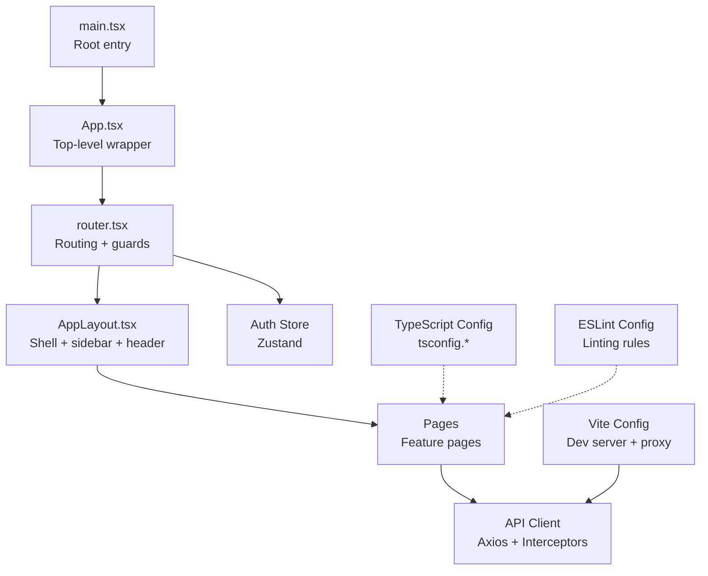
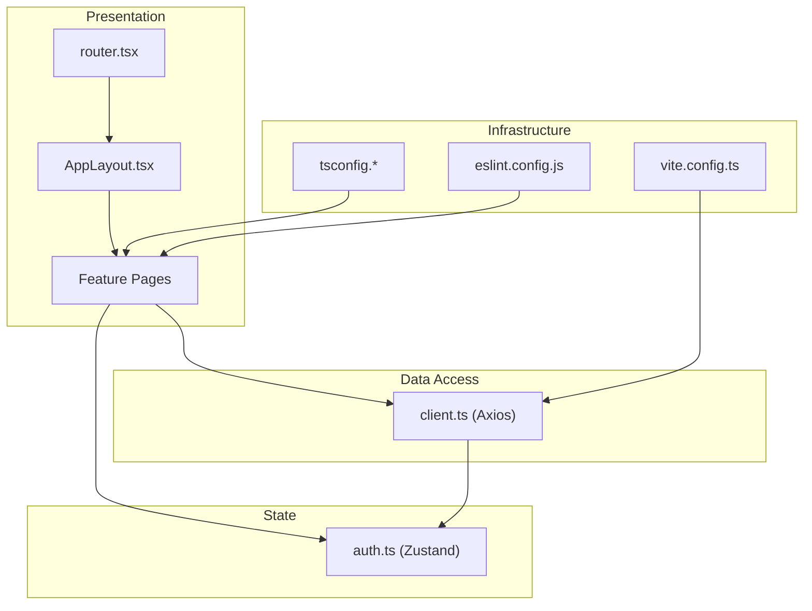
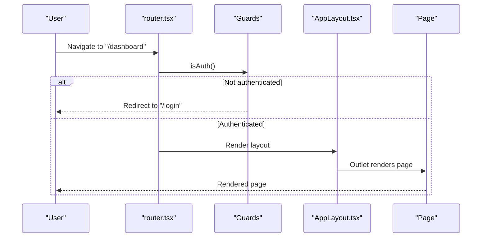
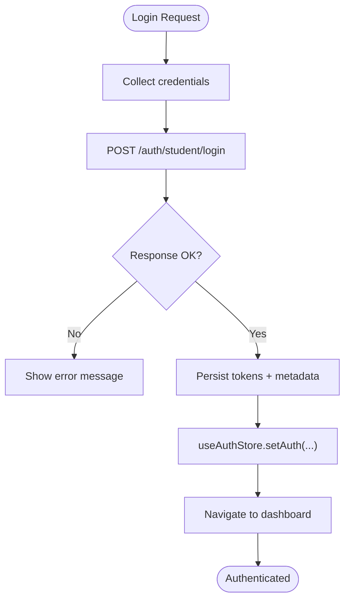
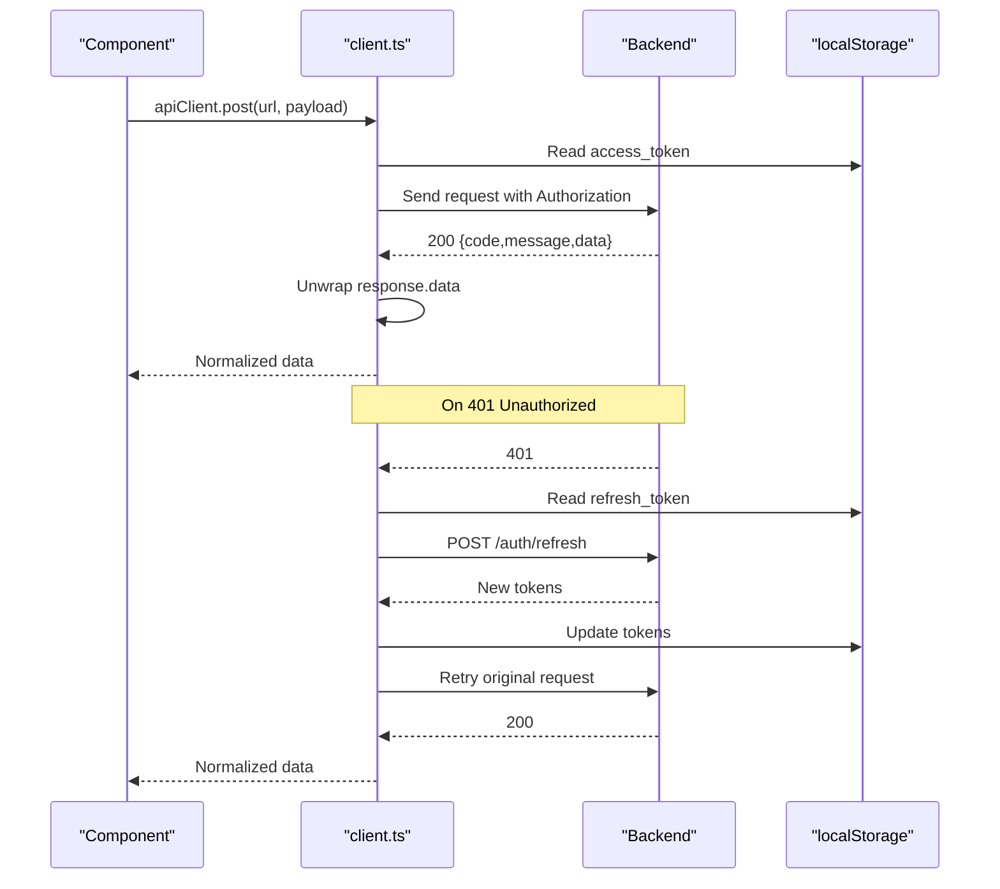
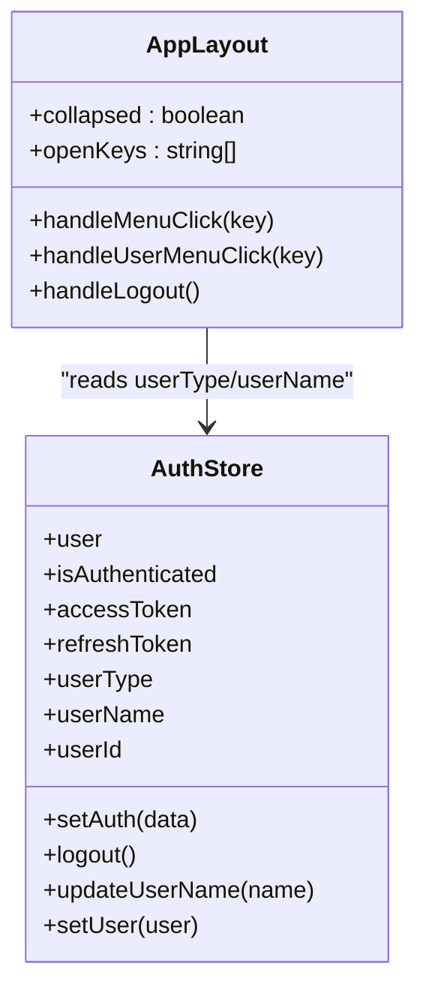
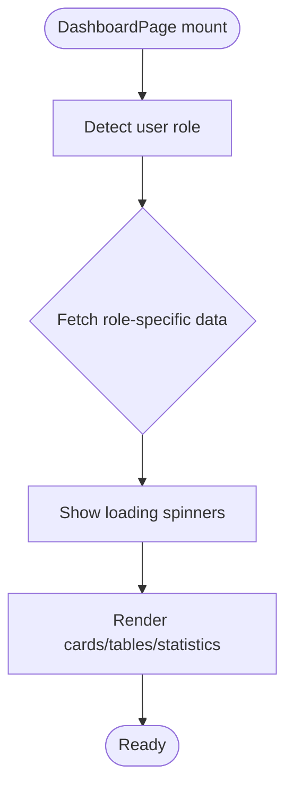
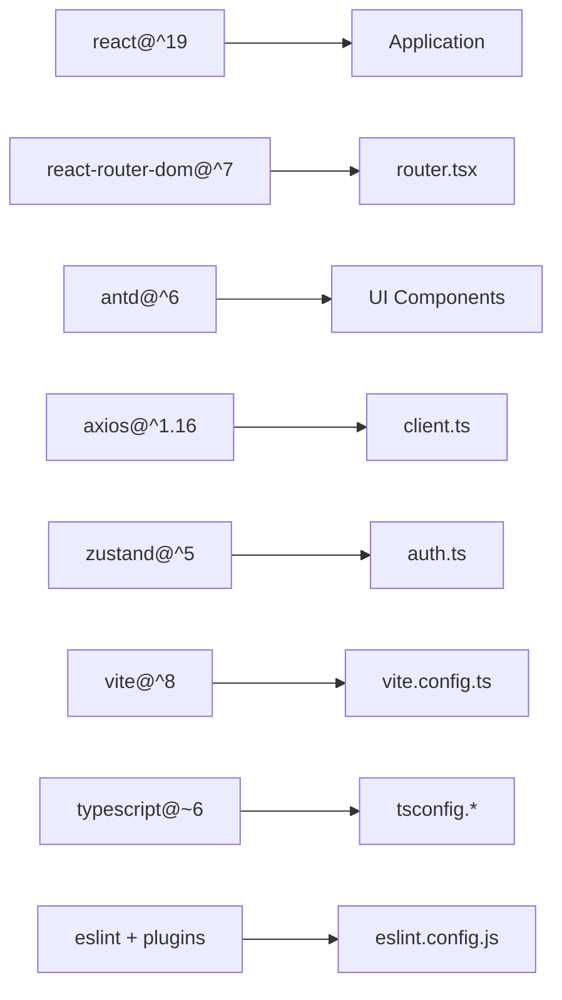

# Frontend Architecture

<cite>
**Referenced Files in This Document**
- [main.tsx](file://frontend/src/main.tsx)
- [App.tsx](file://frontend/src/App.tsx)
- [router.tsx](file://frontend/src/router.tsx)
- [AppLayout.tsx](file://frontend/src/components/layout/AppLayout.tsx)
- [auth.ts](file://frontend/src/store/auth.ts)
- [client.ts](file://frontend/src/api/client.ts)
- [package.json](file://frontend/package.json)
- [vite.config.ts](file://frontend/vite.config.ts)
- [tsconfig.json](file://frontend/tsconfig.json)
- [tsconfig.app.json](file://frontend/tsconfig.app.json)
- [tsconfig.node.json](file://frontend/tsconfig.node.json)
- [eslint.config.js](file://frontend/eslint.config.js)
- [LoginPage.tsx](file://frontend/src/pages/auth/LoginPage.tsx)
- [DashboardPage.tsx](file://frontend/src/pages/dashboard/DashboardPage.tsx)
</cite>

## Table of Contents
1. [Introduction](#introduction)
2. [Project Structure](#project-structure)
3. [Core Components](#core-components)
4. [Architecture Overview](#architecture-overview)
5. [Detailed Component Analysis](#detailed-component-analysis)
6. [Dependency Analysis](#dependency-analysis)
7. [Performance Considerations](#performance-considerations)
8. [Troubleshooting Guide](#troubleshooting-guide)
9. [Conclusion](#conclusion)
10. [Appendices](#appendices)

## Introduction
This document describes the frontend architecture of a React 19 TypeScript application built with modern tooling and design systems. It covers component hierarchy, routing with React Router, state management via Zustand, Ant Design integration, styling and responsiveness, API client architecture, authentication flow, and development workflow. It also provides guidance on reusability, performance optimization, layout and theming, internationalization considerations, component development practices, testing strategies, and deployment pipeline.

## Project Structure
The frontend is organized by feature and responsibility:
- Entry point renders the root application component.
- Routing configuration defines protected/public routes and nested layouts.
- Pages implement domain-specific views.
- Store encapsulates authentication state using Zustand.
- API client centralizes HTTP requests and interceptors.
- Build and linting configurations define development and production behavior.

**Diagram sources**
- [main.tsx:1-10](file://frontend/src/main.tsx#L1-L10)
- [App.tsx:1-6](file://frontend/src/App.tsx#L1-L6)
- [router.tsx:1-79](file://frontend/src/router.tsx#L1-L79)
- [AppLayout.tsx:1-166](file://frontend/src/components/layout/AppLayout.tsx#L1-L166)
- [auth.ts:1-96](file://frontend/src/store/auth.ts#L1-L96)
- [client.ts:1-55](file://frontend/src/api/client.ts#L1-L55)
- [vite.config.ts:1-17](file://frontend/vite.config.ts#L1-L17)
- [tsconfig.app.json:1-26](file://frontend/tsconfig.app.json#L1-L26)
- [eslint.config.js:1-23](file://frontend/eslint.config.js#L1-L23)

**Section sources**
- [main.tsx:1-10](file://frontend/src/main.tsx#L1-L10)
- [App.tsx:1-6](file://frontend/src/App.tsx#L1-L6)
- [router.tsx:1-79](file://frontend/src/router.tsx#L1-L79)
- [vite.config.ts:1-17](file://frontend/vite.config.ts#L1-L17)
- [tsconfig.json:1-8](file://frontend/tsconfig.json#L1-L8)
- [eslint.config.js:1-23](file://frontend/eslint.config.js#L1-L23)

## Core Components
- Root entry and app shell: The application bootstraps React and renders the top-level router component.
- Routing and guards: Routes are grouped under a protected layout, with public-only login routes and dynamic role-based navigation.
- Authentication store: Zustand manages tokens, user metadata, and exposes setters/logouts.
- API client: Axios instance with request/response interceptors for bearer token injection and automatic token refresh on 401.
- Layout: Ant Design Layout with collapsible sidebar, header controls, and outlet rendering child pages.

Key responsibilities:
- Routing: Centralized in a single router module with route guards and nested layout.
- State: Minimal, focused auth store with localStorage persistence helpers.
- API: Centralized client with middleware-like behavior for backend response unpacking and token refresh.
- UI: Ant Design components with ConfigProvider for locale and theme.

**Section sources**
- [main.tsx:1-10](file://frontend/src/main.tsx#L1-L10)
- [App.tsx:1-6](file://frontend/src/App.tsx#L1-L6)
- [router.tsx:1-79](file://frontend/src/router.tsx#L1-L79)
- [auth.ts:1-96](file://frontend/src/store/auth.ts#L1-L96)
- [client.ts:1-55](file://frontend/src/api/client.ts#L1-L55)
- [AppLayout.tsx:1-166](file://frontend/src/components/layout/AppLayout.tsx#L1-L166)

## Architecture Overview
The frontend follows a layered architecture:
- Presentation layer: React components, Ant Design UI primitives, and layout shell.
- Routing layer: React Router with guards and nested routes.
- State layer: Zustand store for authentication state.
- Data access layer: Axios client with interceptors for auth and response normalization.
- Infrastructure: Vite dev server with proxy, TypeScript compilation, ESLint linting.

**Diagram sources**
- [router.tsx:1-79](file://frontend/src/router.tsx#L1-L79)
- [AppLayout.tsx:1-166](file://frontend/src/components/layout/AppLayout.tsx#L1-L166)
- [auth.ts:1-96](file://frontend/src/store/auth.ts#L1-L96)
- [client.ts:1-55](file://frontend/src/api/client.ts#L1-L55)
- [vite.config.ts:1-17](file://frontend/vite.config.ts#L1-L17)
- [tsconfig.app.json:1-26](file://frontend/tsconfig.app.json#L1-L26)
- [eslint.config.js:1-23](file://frontend/eslint.config.js#L1-L23)

## Detailed Component Analysis

### Routing and Guards
The router defines:
- Public routes for login and admin login.
- A protected layout that wraps most routes.
- Dynamic route selection based on user type.
- Global ConfigProvider and Ant Design App wrapper for theme and locale.

**Diagram sources**
- [router.tsx:26-42](file://frontend/src/router.tsx#L26-L42)
- [AppLayout.tsx:67-165](file://frontend/src/components/layout/AppLayout.tsx#L67-L165)

**Section sources**
- [router.tsx:1-79](file://frontend/src/router.tsx#L1-L79)

### Authentication Flow and State Management
The auth store encapsulates:
- Token and user metadata persistence in localStorage.
- Setters for login, logout, profile updates, and direct user assignment.
- Helpers for non-React contexts (e.g., interceptors).

**Diagram sources**
- [LoginPage.tsx:55-71](file://frontend/src/pages/auth/LoginPage.tsx#L55-L71)
- [auth.ts:56-70](file://frontend/src/store/auth.ts#L56-L70)

**Section sources**
- [auth.ts:1-96](file://frontend/src/store/auth.ts#L1-L96)
- [LoginPage.tsx:1-217](file://frontend/src/pages/auth/LoginPage.tsx#L1-L217)

### API Client Architecture
The API client:
- Sets base URL and JSON content type.
- Injects Authorization header from localStorage.
- Normalizes backend responses that wrap data in {code,message,data}.
- Handles 401 by attempting token refresh and retrying the original request.
- On refresh failure, clears tokens and redirects to login.

**Diagram sources**
- [client.ts:9-52](file://frontend/src/api/client.ts#L9-L52)

**Section sources**
- [client.ts:1-55](file://frontend/src/api/client.ts#L1-L55)

### Layout and Navigation
The layout provides:
- Collapsible sidebar with role-aware menu items.
- Header with user dropdown and notifications.
- Outlet rendering the matched page.
- Theme token usage for consistent styling.

**Diagram sources**
- [AppLayout.tsx:67-165](file://frontend/src/components/layout/AppLayout.tsx#L67-L165)
- [auth.ts:47-95](file://frontend/src/store/auth.ts#L47-L95)

**Section sources**
- [AppLayout.tsx:1-166](file://frontend/src/components/layout/AppLayout.tsx#L1-L166)

### Dashboard Page Composition
The dashboard demonstrates:
- Role-based rendering and data fetching.
- Responsive grid using Ant Design Row/Col with breakpoints.
- Conditional loading states and data normalization.
- Integration with reference values and Ant Design components.

**Diagram sources**
- [DashboardPage.tsx:14-50](file://frontend/src/pages/dashboard/DashboardPage.tsx#L14-L50)
- [DashboardPage.tsx:32-72](file://frontend/src/pages/dashboard/DashboardPage.tsx#L32-L72)

**Section sources**
- [DashboardPage.tsx:1-580](file://frontend/src/pages/dashboard/DashboardPage.tsx#L1-L580)

## Dependency Analysis
External libraries and their roles:
- React 19 and React Router DOM for UI and routing.
- Ant Design for UI primitives and theming.
- Axios for HTTP client with interceptors.
- Zustand for lightweight state management.
- Vite for bundling, dev server, and proxy.
- TypeScript for type safety and build configuration.

**Diagram sources**
- [package.json:12-35](file://frontend/package.json#L12-L35)
- [vite.config.ts:1-17](file://frontend/vite.config.ts#L1-L17)
- [tsconfig.app.json:1-26](file://frontend/tsconfig.app.json#L1-L26)
- [eslint.config.js:1-23](file://frontend/eslint.config.js#L1-L23)

**Section sources**
- [package.json:1-38](file://frontend/package.json#L1-L38)

## Performance Considerations
- Lazy loading: Consider lazy-loading heavy pages to reduce initial bundle size.
- Memoization: Use React.memo and useMemo/useCallback for expensive computations and repeated renders.
- Virtualization: For large tables/lists, use virtualized lists to limit DOM nodes.
- Tree shaking: Keep imports granular to benefit from Vite’s tree-shaking.
- Image optimization: Compress images and leverage responsive image attributes.
- Avoid unnecessary re-renders: Prefer local state and minimize store updates.
- Bundle analysis: Use Vite plugin for bundle visualization during development.

[No sources needed since this section provides general guidance]

## Troubleshooting Guide
Common issues and resolutions:
- 401 Unauthorized after token expiry: The client attempts a refresh automatically; if refresh fails, tokens are cleared and the user is redirected to login.
- Route protection failures: Verify guard functions and ensure tokens are persisted in localStorage.
- Locale/theme issues: Confirm ConfigProvider locale and theme tokens are applied at the router level.
- Proxy errors: Ensure Vite proxy targets the correct backend host/port.

**Section sources**
- [client.ts:26-52](file://frontend/src/api/client.ts#L26-L52)
- [router.tsx:44-78](file://frontend/src/router.tsx#L44-L78)
- [vite.config.ts:6-14](file://frontend/vite.config.ts#L6-L14)

## Conclusion
The frontend employs a clean separation of concerns with React Router for navigation, Ant Design for UI, Zustand for minimal state, and Axios for robust data access. The architecture supports role-based navigation, centralized authentication, and a scalable layout. With Vite and TypeScript, the project benefits from fast builds, strong typing, and developer ergonomics. Following the recommended practices will help maintain performance, readability, and extensibility.

[No sources needed since this section summarizes without analyzing specific files]

## Appendices

### Build Configuration with Vite
- Dev server runs on port 3000 with API proxy to backend.
- Cache directory configured for improved rebuild performance.
- React plugin enables JSX transform and Fast Refresh.

**Section sources**
- [vite.config.ts:1-17](file://frontend/vite.config.ts#L1-L17)

### TypeScript Configuration
- References separate app and node configs.
- Bundler module resolution and JSX runtime configured for Vite.
- Strict linting options enabled.

**Section sources**
- [tsconfig.json:1-8](file://frontend/tsconfig.json#L1-L8)
- [tsconfig.app.json:1-26](file://frontend/tsconfig.app.json#L1-L26)
- [tsconfig.node.json:1-25](file://frontend/tsconfig.node.json#L1-L25)

### Development Workflow
- Scripts: dev, build, lint, preview.
- ESLint configuration enforces recommended rules for TS, React Hooks, and React Refresh.

**Section sources**
- [package.json:6-11](file://frontend/package.json#L6-L11)
- [eslint.config.js:1-23](file://frontend/eslint.config.js#L1-L23)

### Component Reusability and Prop Drilling Solutions
- Prefer context-free stores (Zustand) for cross-cutting state.
- Encapsulate shared logic in custom hooks (e.g., reference values).
- Pass only necessary props; avoid deep prop chains by lifting state to stores.

[No sources needed since this section provides general guidance]

### Internationalization Considerations
- Ant Design locale is set to Chinese Simplified globally.
- For multi-language support, externalize strings and switch locales dynamically while keeping Ant Design locale synchronized.

[No sources needed since this section provides general guidance]

### Testing Strategies
- Unit tests: Jest/React Testing Library for isolated component tests.
- Integration tests: Test routing guards and store updates.
- End-to-end tests: Playwright/Cypress for user flows (login, navigation, role-based views).

[No sources needed since this section provides general guidance]

### Deployment Pipeline
- Build artifacts via Vite; serve behind a reverse proxy or static hosting.
- Environment variables managed via Vite env convention.
- CI/CD: Run lint, build, and preview checks; deploy on successful tests.

[No sources needed since this section provides general guidance]