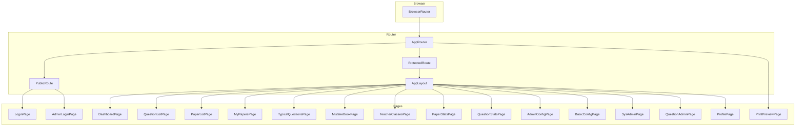
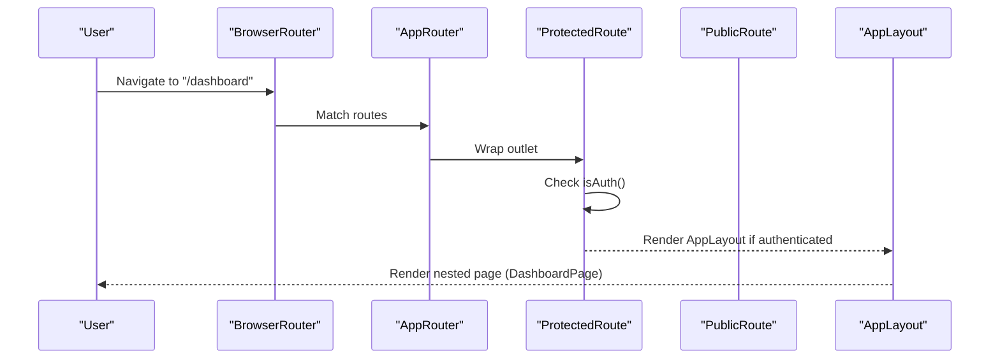
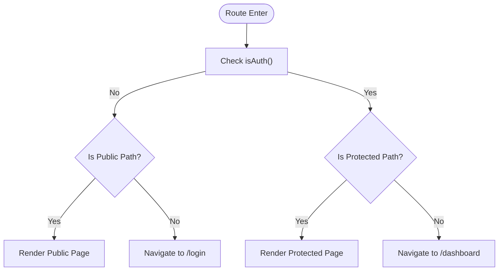
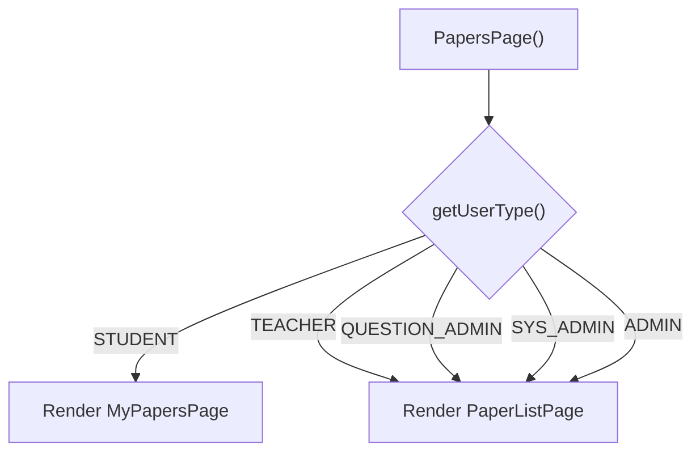
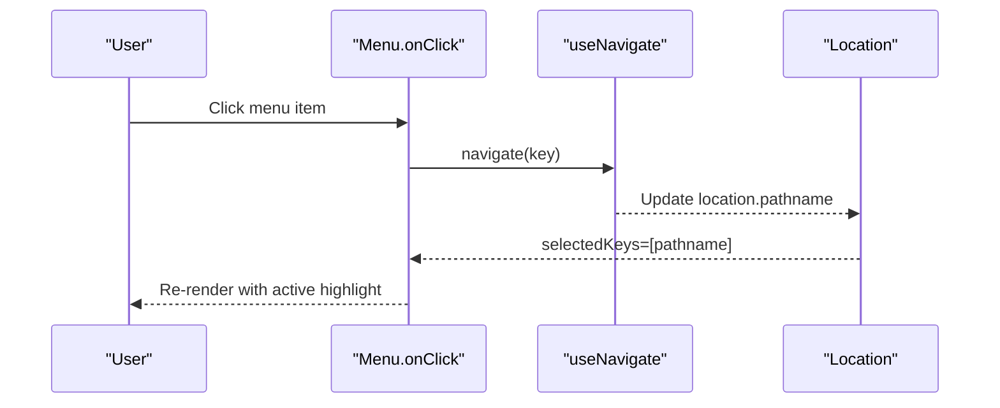
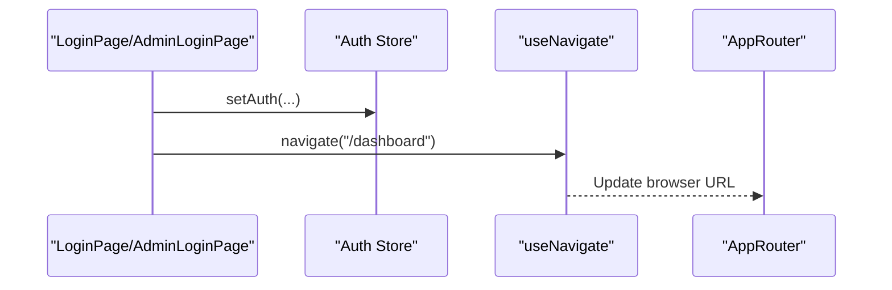
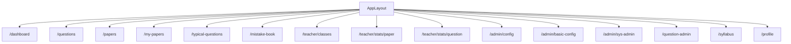
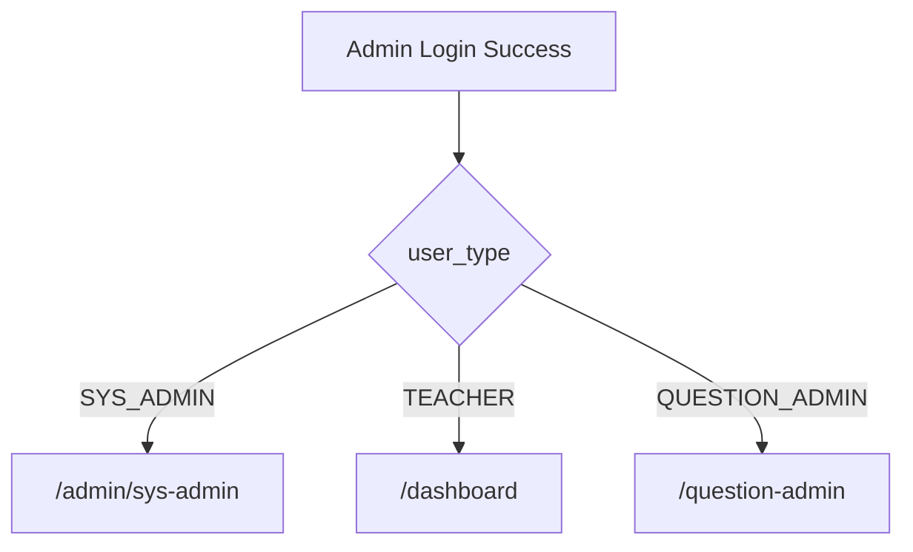
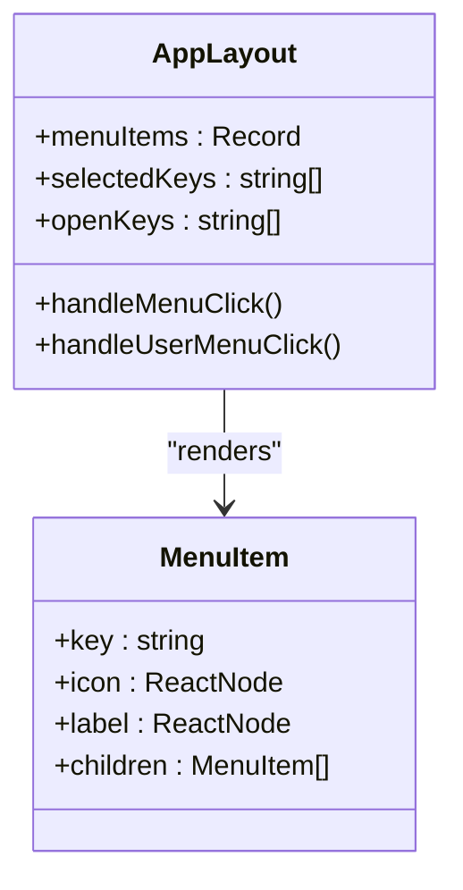
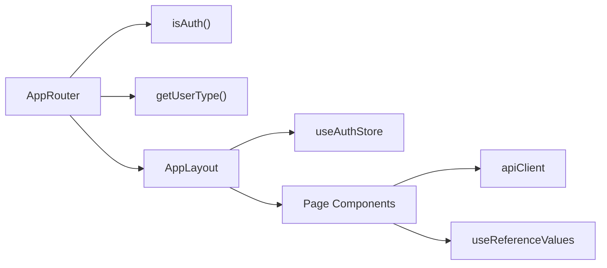

# Routing and Navigation

<cite>
**Referenced Files in This Document**
- [router.tsx](file://frontend/src/router.tsx)
- [AppLayout.tsx](file://frontend/src/components/layout/AppLayout.tsx)
- [auth.ts](file://frontend/src/store/auth.ts)
- [LoginPage.tsx](file://frontend/src/pages/auth/LoginPage.tsx)
- [AdminLoginPage.tsx](file://frontend/src/pages/auth/AdminLoginPage.tsx)
- [ProfilePage.tsx](file://frontend/src/pages/auth/ProfilePage.tsx)
- [DashboardPage.tsx](file://frontend/src/pages/dashboard/DashboardPage.tsx)
- [PaperListPage.tsx](file://frontend/src/pages/papers/PaperListPage.tsx)
- [MyPapersPage.tsx](file://frontend/src/pages/papers/MyPapersPage.tsx)
- [AdminConfigPage.tsx](file://frontend/src/pages/admin/AdminConfigPage.tsx)
- [BasicConfigPage.tsx](file://frontend/src/pages/admin/BasicConfigPage.tsx)
- [SysAdminPage.tsx](file://frontend/src/pages/admin/SysAdminPage.tsx)
- [QuestionAdminPage.tsx](file://frontend/src/pages/admin/QuestionAdminPage.tsx)
</cite>

## Table of Contents
1. [Introduction](#introduction)
2. [Project Structure](#project-structure)
3. [Core Components](#core-components)
4. [Architecture Overview](#architecture-overview)
5. [Detailed Component Analysis](#detailed-component-analysis)
6. [Dependency Analysis](#dependency-analysis)
7. [Performance Considerations](#performance-considerations)
8. [Troubleshooting Guide](#troubleshooting-guide)
9. [Conclusion](#conclusion)
10. [Appendices](#appendices)

## Introduction
This document explains the React Router configuration and navigation system for the frontend. It covers:
- Route structure: public routes (login), protected routes with role-based access, and nested routes under a shared layout
- Navigation patterns: sidebar menu, user dropdown, and programmatic navigation
- Route guards: authentication checks and redirects
- Dynamic route generation: role-aware route selection
- Navigation UX: active link highlighting, breadcrumbs, and responsive behavior
- Guidelines for adding new routes, handling parameters and query strings, and optimizing performance

## Project Structure
The routing is centralized in a single router module that composes nested routes inside a shared layout. Authentication state is managed via a zustand store persisted in localStorage. The layout renders a responsive sidebar menu that adapts to user roles.

**Diagram sources**
- [router.tsx:44-78](file://frontend/src/router.tsx#L44-L78)
- [AppLayout.tsx:67-165](file://frontend/src/components/layout/AppLayout.tsx#L67-L165)
- [LoginPage.tsx:11-216](file://frontend/src/pages/auth/LoginPage.tsx#L11-L216)
- [AdminLoginPage.tsx:14-170](file://frontend/src/pages/auth/AdminLoginPage.tsx#L14-L170)
- [DashboardPage.tsx:14-579](file://frontend/src/pages/dashboard/DashboardPage.tsx#L14-L579)
- [PaperListPage.tsx:13-168](file://frontend/src/pages/papers/PaperListPage.tsx#L13-L168)
- [MyPapersPage.tsx:13-232](file://frontend/src/pages/papers/MyPapersPage.tsx#L13-L232)
- [AdminConfigPage.tsx:8-400](file://frontend/src/pages/admin/AdminConfigPage.tsx#L8-L400)
- [BasicConfigPage.tsx:8-281](file://frontend/src/pages/admin/BasicConfigPage.tsx#L8-L281)
- [SysAdminPage.tsx:22-378](file://frontend/src/pages/admin/SysAdminPage.tsx#L22-L378)
- [QuestionAdminPage.tsx:17-668](file://frontend/src/pages/admin/QuestionAdminPage.tsx#L17-L668)

**Section sources**
- [router.tsx:1-79](file://frontend/src/router.tsx#L1-L79)
- [AppLayout.tsx:1-166](file://frontend/src/components/layout/AppLayout.tsx#L1-L166)

## Core Components
- AppRouter: Defines all routes, public/private wrappers, nested layout, and catch-all fallback
- ProtectedRoute/PublicRoute: Route guards enforcing authentication and preventing access when logged in
- AppLayout: Shared layout with responsive sidebar, user menu, and outlet rendering nested routes
- Auth store: Provides access token, user type, and helpers for guards and menu generation

Key responsibilities:
- Authentication guard: Redirects unauthenticated users to login; prevents authenticated users from accessing login
- Role-aware routing: A dynamic route selects between student and teacher views based on user type
- Nested layout: All authenticated routes render within AppLayout, which manages sidebar and header

**Section sources**
- [router.tsx:26-42](file://frontend/src/router.tsx#L26-L42)
- [AppLayout.tsx:67-165](file://frontend/src/components/layout/AppLayout.tsx#L67-L165)
- [auth.ts:1-96](file://frontend/src/store/auth.ts#L1-L96)

## Architecture Overview
The routing architecture enforces:
- Public area: login pages for students and administrators
- Protected area: authenticated dashboard and feature pages under AppLayout
- Nested routes: feature pages rendered inside AppLayout’s outlet
- Guards: runtime checks via helpers and direct usage in route elements

**Diagram sources**
- [router.tsx:44-70](file://frontend/src/router.tsx#L44-L70)
- [router.tsx:26-36](file://frontend/src/router.tsx#L26-L36)
- [AppLayout.tsx:106-165](file://frontend/src/components/layout/AppLayout.tsx#L106-L165)

## Detailed Component Analysis

### Route Guards and Authentication
- isAuth(): Reads access token from localStorage to determine authentication state
- ProtectedRoute: Wraps nested routes; redirects to login if not authenticated
- PublicRoute: Wraps login routes; redirects to dashboard if already authenticated

**Diagram sources**
- [router.tsx:26-36](file://frontend/src/router.tsx#L26-L36)
- [router.tsx:44-70](file://frontend/src/router.tsx#L44-L70)

**Section sources**
- [router.tsx:26-36](file://frontend/src/router.tsx#L26-L36)
- [auth.ts:10-14](file://frontend/src/store/auth.ts#L10-L14)

### Role-Based Access and Dynamic Routing
- getUserType(): Returns stored user type or defaults to student
- PapersPage(): Dynamically renders either MyPapersPage (student) or PaperListPage (non-student) based on user type
- AppLayout menu: Builds menu items per role using a role-to-menu mapping

**Diagram sources**
- [router.tsx:38-42](file://frontend/src/router.tsx#L38-L42)
- [auth.ts:12-12](file://frontend/src/store/auth.ts#L12-L12)
- [AppLayout.tsx:24-65](file://frontend/src/components/layout/AppLayout.tsx#L24-L65)

**Section sources**
- [router.tsx:38-42](file://frontend/src/router.tsx#L38-L42)
- [AppLayout.tsx:24-65](file://frontend/src/components/layout/AppLayout.tsx#L24-L65)

### Navigation Patterns and Active Link Highlighting
- Sidebar menu: Uses Ant Design Menu with selectedKeys bound to current location pathname
- Open groups: Maintains openKeys for nested menus (e.g., question management, stats)
- User dropdown: Handles profile and logout actions, triggering programmatic navigation

**Diagram sources**
- [AppLayout.tsx:83-88](file://frontend/src/components/layout/AppLayout.tsx#L83-L88)
- [AppLayout.tsx:125-133](file://frontend/src/components/layout/AppLayout.tsx#L125-L133)

**Section sources**
- [AppLayout.tsx:67-165](file://frontend/src/components/layout/AppLayout.tsx#L67-L165)

### Programmatic Navigation
- LoginPage and AdminLoginPage: After successful auth, navigate to appropriate destination
- AppLayout: User menu navigates to profile; logout clears auth and navigates to login
- PaperListPage/MyPapersPage: Preview and print actions open external windows or drawers

**Diagram sources**
- [LoginPage.tsx:55-71](file://frontend/src/pages/auth/LoginPage.tsx#L55-L71)
- [AdminLoginPage.tsx:60-84](file://frontend/src/pages/auth/AdminLoginPage.tsx#L60-L84)
- [AppLayout.tsx:78-81](file://frontend/src/components/layout/AppLayout.tsx#L78-L81)

**Section sources**
- [LoginPage.tsx:55-71](file://frontend/src/pages/auth/LoginPage.tsx#L55-L71)
- [AdminLoginPage.tsx:60-84](file://frontend/src/pages/auth/AdminLoginPage.tsx#L60-L84)
- [AppLayout.tsx:78-81](file://frontend/src/components/layout/AppLayout.tsx#L78-L81)

### Nested Route Organization
- AppLayout wraps all authenticated routes
- Nested routes include dashboards, lists, forms, and admin panels
- Index route redirects to dashboard for clean home behavior

**Diagram sources**
- [router.tsx:52-69](file://frontend/src/router.tsx#L52-L69)

**Section sources**
- [router.tsx:52-69](file://frontend/src/router.tsx#L52-L69)

### Breadcrumb Implementation
- Current implementation does not include explicit breadcrumbs
- Recommendation: Add a breadcrumb bar above content using location segments or a dedicated hook to derive labels from menu items

[No sources needed since this section provides general guidance]

### Redirect Logic for Different User Roles
- Admin login: Routes to role-specific destinations after verification and SMS login
- Student login: Navigates to dashboard upon success
- PublicRoute prevents authenticated users from accessing login pages

**Diagram sources**
- [AdminLoginPage.tsx:77-80](file://frontend/src/pages/auth/AdminLoginPage.tsx#L77-L80)

**Section sources**
- [AdminLoginPage.tsx:77-80](file://frontend/src/pages/auth/AdminLoginPage.tsx#L77-L80)
- [router.tsx:33-36](file://frontend/src/router.tsx#L33-L36)

### Route Parameter Handling and Query Strings
- Query string management: Pages like PaperListPage and MyPapersPage construct API requests with query parameters derived from local state
- Route parameters: Not currently used in the router; pages rely on query strings for filtering and pagination

Recommendations:
- For persistent query strings, consider using URL search params and synchronizing with state
- For route parameters, define path segments (e.g., /papers/:id) and extract with useSearchParams/useParams

**Section sources**
- [PaperListPage.tsx:31-51](file://frontend/src/pages/papers/PaperListPage.tsx#L31-L51)
- [MyPapersPage.tsx:40-52](file://frontend/src/pages/papers/MyPapersPage.tsx#L40-L52)

### Adding New Routes
Guidelines:
- Define route element under AppLayout for authenticated pages
- Wrap public pages with PublicRoute
- Use ProtectedRoute for authenticated-only areas
- Keep nested routes shallow for readability; group related pages under a single route when appropriate
- Update AppLayout menu items to reflect new pages

Example additions:
- Add a new authenticated route under AppLayout
- Add a new public route under AppRouter
- Update menu mapping in AppLayout if the page belongs to a specific role

**Section sources**
- [router.tsx:44-70](file://frontend/src/router.tsx#L44-L70)
- [AppLayout.tsx:24-65](file://frontend/src/components/layout/AppLayout.tsx#L24-L65)

### Navigation Menu Structure and Sidebar Organization
- Menu items are grouped by role with nested children for question management and statistics
- Selected item highlights based on current pathname
- Collapsible sidebar toggles on small screens

**Diagram sources**
- [AppLayout.tsx:24-133](file://frontend/src/components/layout/AppLayout.tsx#L24-L133)

**Section sources**
- [AppLayout.tsx:24-133](file://frontend/src/components/layout/AppLayout.tsx#L24-L133)

### Mobile-Responsive Navigation Patterns
- Collapsible sidebar controlled by a state toggle
- Ant Design Menu supports inline mode suitable for small screens
- Header includes user avatar and notification bell

**Section sources**
- [AppLayout.tsx:106-165](file://frontend/src/components/layout/AppLayout.tsx#L106-L165)

### Print Preview Route
- Dedicated route for print preview with programmatic navigation from paper list actions

**Section sources**
- [router.tsx:71-71](file://frontend/src/router.tsx#L71-L71)
- [PaperListPage.tsx:91-94](file://frontend/src/pages/papers/PaperListPage.tsx#L91-L94)

## Dependency Analysis
- AppRouter depends on:
  - Route guards (isAuth)
  - Auth store (getUserType)
  - AppLayout and page components
- AppLayout depends on:
  - Auth store for user type and logout
  - Ant Design components for layout and menu
- Pages depend on:
  - API client for data fetching
  - Reference values for select options and labels

**Diagram sources**
- [router.tsx:24-26](file://frontend/src/router.tsx#L24-L26)
- [auth.ts:12-14](file://frontend/src/store/auth.ts#L12-L14)
- [AppLayout.tsx:19-73](file://frontend/src/components/layout/AppLayout.tsx#L19-L73)

**Section sources**
- [router.tsx:1-79](file://frontend/src/router.tsx#L1-L79)
- [auth.ts:1-96](file://frontend/src/store/auth.ts#L1-L96)
- [AppLayout.tsx:1-166](file://frontend/src/components/layout/AppLayout.tsx#L1-L166)

## Performance Considerations
- Route guards are lightweight checks against localStorage
- Consider moving heavy initialization (e.g., reference data) to separate loaders or preloads
- For future lazy loading, wrap route components with dynamic imports and Suspense boundaries
- Debounce or batch frequent state updates in pages that build query strings from multiple inputs

[No sources needed since this section provides general guidance]

## Troubleshooting Guide
Common issues and resolutions:
- Stuck on login despite being authenticated
  - Verify access token exists in localStorage and is readable by isAuth
  - Confirm PublicRoute is not wrapping pages that require authentication
- Redirect loops between login and dashboard
  - Ensure ProtectedRoute wraps only authenticated routes
  - Check that index route redirects to a valid authenticated page
- Menu not highlighting active page
  - Confirm selectedKeys is bound to location.pathname
  - Ensure menu item keys match route paths exactly
- Role-specific pages not rendering
  - Verify getUserType returns expected values
  - Confirm PapersPage logic matches actual user types

**Section sources**
- [router.tsx:26-36](file://frontend/src/router.tsx#L26-L36)
- [auth.ts:10-14](file://frontend/src/store/auth.ts#L10-L14)
- [AppLayout.tsx:125-133](file://frontend/src/components/layout/AppLayout.tsx#L125-L133)

## Conclusion
The routing and navigation system centers around a clean separation of public and protected routes, enforced by simple guards. A shared layout provides role-aware navigation and responsive UX. Extending the system involves adding routes under AppLayout, updating the menu mapping, and ensuring guards and redirects behave consistently for each role.

[No sources needed since this section summarizes without analyzing specific files]

## Appendices

### Route Reference
- Public routes
  - /login (student login)
  - /admin/login (admin login)
- Protected routes (nested under AppLayout)
  - /dashboard
  - /questions
  - /papers (dynamic: student vs teacher)
  - /my-papers (student-only)
  - /typical-questions
  - /mistake-book
  - /teacher/classes
  - /teacher/stats/paper
  - /teacher/stats/question
  - /admin/config
  - /admin/basic-config
  - /admin/sys-admin
  - /question-admin
  - /syllabus
  - /profile
- Other
  - /print-preview (standalone)
  - Catch-all fallback to /dashboard

**Section sources**
- [router.tsx:50-72](file://frontend/src/router.tsx#L50-L72)