# State Management

<cite>
**Referenced Files in This Document**
- [auth.ts](file://frontend/src/store/auth.ts)
- [client.ts](file://frontend/src/api/client.ts)
- [LoginPage.tsx](file://frontend/src/pages/auth/LoginPage.tsx)
- [AdminLoginPage.tsx](file://frontend/src/pages/auth/AdminLoginPage.tsx)
- [AppLayout.tsx](file://frontend/src/components/layout/AppLayout.tsx)
- [ProfilePage.tsx](file://frontend/src/pages/auth/ProfilePage.tsx)
- [router.tsx](file://frontend/src/router.tsx)
- [useReferenceValues.ts](file://frontend/src/hooks/useReferenceValues.ts)
- [QuestionListPage.tsx](file://frontend/src/pages/questions/QuestionListPage.tsx)
- [PaperListPage.tsx](file://frontend/src/pages/papers/PaperListPage.tsx)
- [auth_v2.py](file://backend/app/api/v1/endpoints/auth_v2.py)
</cite>

## Table of Contents
1. [Introduction](#introduction)
2. [Project Structure](#project-structure)
3. [Core Components](#core-components)
4. [Architecture Overview](#architecture-overview)
5. [Detailed Component Analysis](#detailed-component-analysis)
6. [Dependency Analysis](#dependency-analysis)
7. [Performance Considerations](#performance-considerations)
8. [Troubleshooting Guide](#troubleshooting-guide)
9. [Conclusion](#conclusion)
10. [Appendices](#appendices)

## Introduction
This document explains the Zustand-based state management solution used in the frontend. It focuses on the authentication store, JWT token handling, role-based access control state, and integration with the Axios-based API client for automatic token refresh and authentication state synchronization. It also documents state persistence strategies, hydration from server responses, error handling, best practices for store composition, avoiding unnecessary re-renders, debugging state changes, and the useReferenceValues hook pattern for caching reference data.

## Project Structure
The state management spans three primary areas:
- Authentication state store implemented with Zustand
- Axios client with request/response interceptors for token injection and refresh
- Global reference data caching via a custom hook

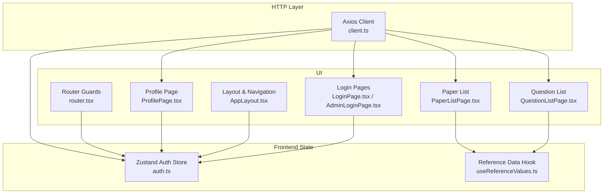

**Diagram sources**
- [auth.ts:47-95](file://frontend/src/store/auth.ts#L47-L95)
- [client.ts:1-55](file://frontend/src/api/client.ts#L1-L55)
- [LoginPage.tsx:1-217](file://frontend/src/pages/auth/LoginPage.tsx#L1-L217)
- [AdminLoginPage.tsx:1-171](file://frontend/src/pages/auth/AdminLoginPage.tsx#L1-L171)
- [AppLayout.tsx:1-166](file://frontend/src/components/layout/AppLayout.tsx#L1-L166)
- [ProfilePage.tsx:1-168](file://frontend/src/pages/auth/ProfilePage.tsx#L1-L168)
- [QuestionListPage.tsx:1-259](file://frontend/src/pages/questions/QuestionListPage.tsx#L1-L259)
- [PaperListPage.tsx:1-169](file://frontend/src/pages/papers/PaperListPage.tsx#L1-L169)
- [router.tsx:1-79](file://frontend/src/router.tsx#L1-L79)
- [useReferenceValues.ts:1-84](file://frontend/src/hooks/useReferenceValues.ts#L1-L84)

**Section sources**
- [auth.ts:1-96](file://frontend/src/store/auth.ts#L1-L96)
- [client.ts:1-55](file://frontend/src/api/client.ts#L1-L55)
- [router.tsx:1-79](file://frontend/src/router.tsx#L1-L79)
- [useReferenceValues.ts:1-84](file://frontend/src/hooks/useReferenceValues.ts#L1-L84)

## Core Components
- Authentication store (Zustand)
  - Stores user identity, JWT tokens, user type, user name, and user ID
  - Provides actions to hydrate state from server responses, update user name, and log out
  - Persists tokens and user metadata to localStorage for cross-session continuity
- Axios client
  - Injects Authorization header for outgoing requests
  - Handles 401 Unauthorized by refreshing tokens via a dedicated endpoint
  - Hydrates the store after successful refresh
- Reference data cache (custom hook)
  - Singleton cache with module-level memory and listeners
  - Fetch-once semantics with promise de-duplication
  - Utility helpers to transform reference lists into label maps, select options, and color maps

Key store shape and actions:
- State fields: user, isAuthenticated, accessToken, refreshToken, userType, userName, userId
- Actions: setAuth(data), logout(), updateUserName(name), setUser(user)

Integration touchpoints:
- Login pages call setAuth with server-provided tokens and user metadata
- Router guards rely on getAccessToken/getUserType for protected/public routing
- Layout reads userType and userName for navigation and user menu
- Profile page updates userName via updateUserName after server-side save
- Reference data hook supplies UI filters and labels

**Section sources**
- [auth.ts:16-45](file://frontend/src/store/auth.ts#L16-L45)
- [auth.ts:47-95](file://frontend/src/store/auth.ts#L47-L95)
- [client.ts:9-52](file://frontend/src/api/client.ts#L9-L52)
- [router.tsx:24-42](file://frontend/src/router.tsx#L24-L42)
- [useReferenceValues.ts:40-63](file://frontend/src/hooks/useReferenceValues.ts#L40-L63)

## Architecture Overview
The authentication lifecycle integrates the store, API client, and UI:

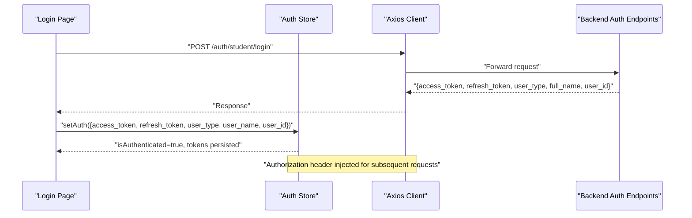

**Diagram sources**
- [LoginPage.tsx:55-71](file://frontend/src/pages/auth/LoginPage.tsx#L55-L71)
- [auth.ts:56-70](file://frontend/src/store/auth.ts#L56-L70)
- [client.ts:9-15](file://frontend/src/api/client.ts#L9-L15)
- [auth_v2.py:188-210](file://backend/app/api/v1/endpoints/auth_v2.py#L188-L210)

## Detailed Component Analysis

### Authentication Store (Zustand)
The store encapsulates:
- Tokens and user metadata in localStorage for persistence
- Authentication state derived from localStorage on initialization
- Actions to synchronize UI and persistence layer

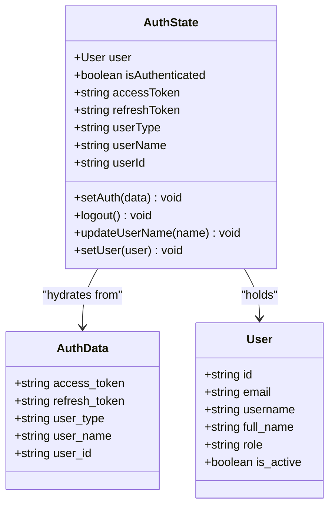

- Hydration on init: Reads tokens and user metadata from localStorage to restore state
- setAuth: Persists tokens and user metadata, flips isAuthenticated, and updates state
- logout: Clears localStorage and resets state
- updateUserName: Updates persisted user name and store state
- setUser: Sets the richer User model for UI rendering

Best practices:
- Keep state minimal and serializable for localStorage compatibility
- Use setters to atomically update related fields
- Avoid storing sensitive data beyond tokens in memory if not needed

**Diagram sources**
- [auth.ts:16-45](file://frontend/src/store/auth.ts#L16-L45)
- [auth.ts:47-95](file://frontend/src/store/auth.ts#L47-L95)

**Section sources**
- [auth.ts:10-14](file://frontend/src/store/auth.ts#L10-L14)
- [auth.ts:47-95](file://frontend/src/store/auth.ts#L47-L95)

### API Client Interceptors and Token Refresh
The Axios client:
- Injects Authorization header for every request using getAccessToken
- On 401 Unauthorized:
  - Attempts refresh via POST /auth/refresh with refresh_token
  - Extracts tokens from ApiResponseMiddleware wrapper
  - Persists new tokens and retries original request
  - Redirects to login on refresh failure

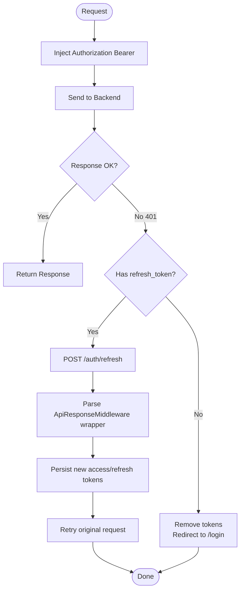

**Diagram sources**
- [client.ts:9-52](file://frontend/src/api/client.ts#L9-L52)

**Section sources**
- [client.ts:9-52](file://frontend/src/api/client.ts#L9-L52)

### Login Pages and Store Hydration
- Student login page:
  - Calls POST /auth/student/login
  - On success, invokes setAuth with tokens and user metadata
  - Navigates to dashboard
- Admin login page:
  - Two-step process: /auth/admin/verify then /auth/admin/login
  - On success, invokes setAuth and navigates to role-specific route

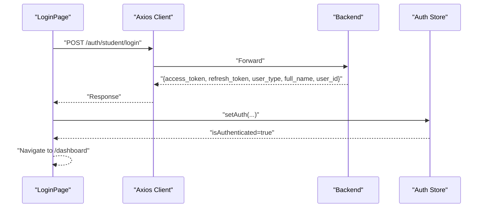

**Diagram sources**
- [LoginPage.tsx:55-71](file://frontend/src/pages/auth/LoginPage.tsx#L55-L71)
- [auth_v2.py:188-210](file://backend/app/api/v1/endpoints/auth_v2.py#L188-L210)
- [auth.ts:56-70](file://frontend/src/store/auth.ts#L56-L70)

**Section sources**
- [LoginPage.tsx:55-71](file://frontend/src/pages/auth/LoginPage.tsx#L55-L71)
- [AdminLoginPage.tsx:60-84](file://frontend/src/pages/auth/AdminLoginPage.tsx#L60-L84)
- [auth_v2.py:91-184](file://backend/app/api/v1/endpoints/auth_v2.py#L91-L184)

### Router Guards and Role-Based Routing
- Authentication guard checks getAccessToken to protect routes
- Public route blocks authenticated users from login pages
- Dynamic route selection based on user_type from localStorage

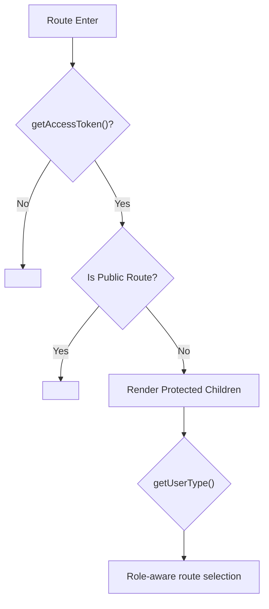

**Diagram sources**
- [router.tsx:26-42](file://frontend/src/router.tsx#L26-L42)
- [auth.ts:12](file://frontend/src/store/auth.ts#L12)

**Section sources**
- [router.tsx:24-42](file://frontend/src/router.tsx#L24-L42)
- [auth.ts:12](file://frontend/src/store/auth.ts#L12)

### Layout and User Menu Integration
- AppLayout reads userType and userName from the store
- Provides role-aware navigation menus and user dropdown actions
- Calls logout and redirects to login on user action

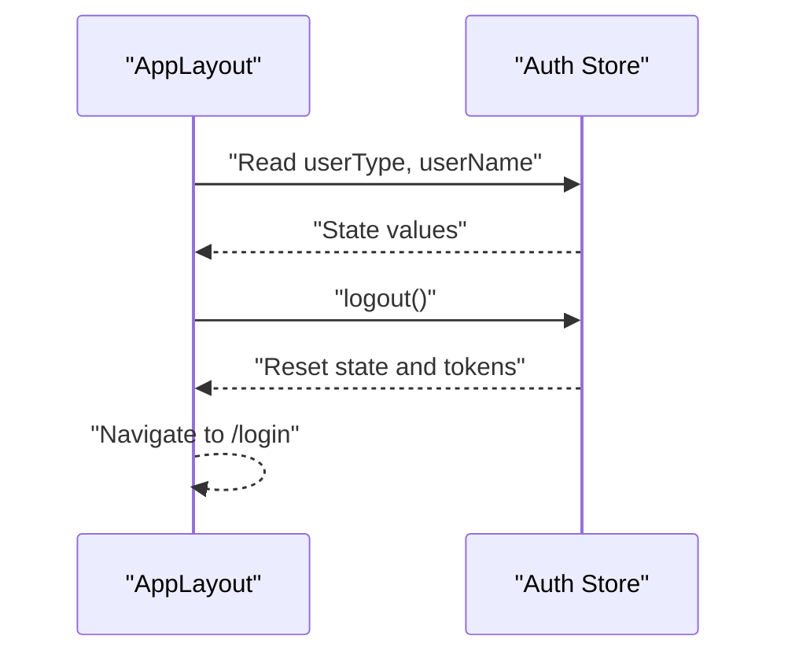

**Diagram sources**
- [AppLayout.tsx:73](file://frontend/src/components/layout/AppLayout.tsx#L73)
- [auth.ts:72-87](file://frontend/src/store/auth.ts#L72-L87)

**Section sources**
- [AppLayout.tsx:67-104](file://frontend/src/components/layout/AppLayout.tsx#L67-L104)
- [auth.ts:72-87](file://frontend/src/store/auth.ts#L72-L87)

### Profile Page and State Synchronization
- Loads profile via GET /auth/profile
- Saves profile via PUT /auth/profile
- On success, calls updateUserName to keep store and UI in sync

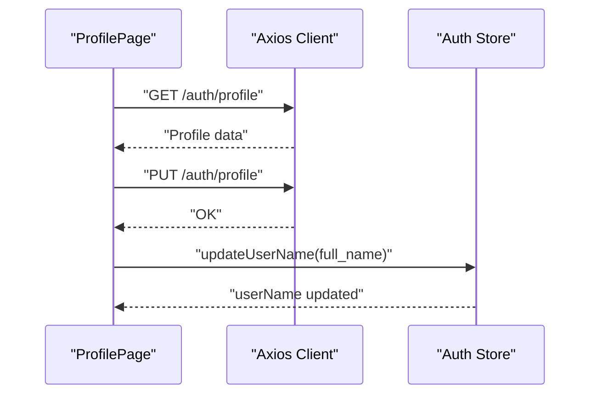

**Diagram sources**
- [ProfilePage.tsx:22-64](file://frontend/src/pages/auth/ProfilePage.tsx#L22-L64)
- [auth.ts:89-92](file://frontend/src/store/auth.ts#L89-L92)

**Section sources**
- [ProfilePage.tsx:18-64](file://frontend/src/pages/auth/ProfilePage.tsx#L18-L64)
- [auth.ts:89-92](file://frontend/src/store/auth.ts#L89-L92)

### Reference Data Caching Hook (useReferenceValues)
- Singleton cache initialized once and reused
- Fetch-once with promise de-duplication
- Listener pattern notifies subscribers when cache populates
- Utility helpers convert raw reference arrays into label maps, select options, and color maps

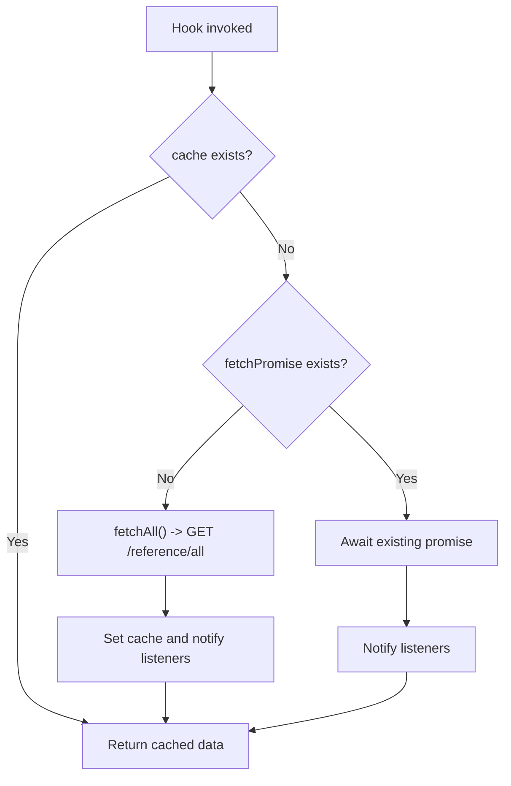

**Diagram sources**
- [useReferenceValues.ts:40-63](file://frontend/src/hooks/useReferenceValues.ts#L40-L63)

**Section sources**
- [useReferenceValues.ts:40-83](file://frontend/src/hooks/useReferenceValues.ts#L40-L83)
- [QuestionListPage.tsx:49-54](file://frontend/src/pages/questions/QuestionListPage.tsx#L49-L54)
- [PaperListPage.tsx:27-29](file://frontend/src/pages/papers/PaperListPage.tsx#L27-L29)

### UI Components Using Reference Data
- QuestionListPage: Uses reference data to build type/difficulty/grade maps and select options
- PaperListPage: Uses reference data to map statuses to labels and colors

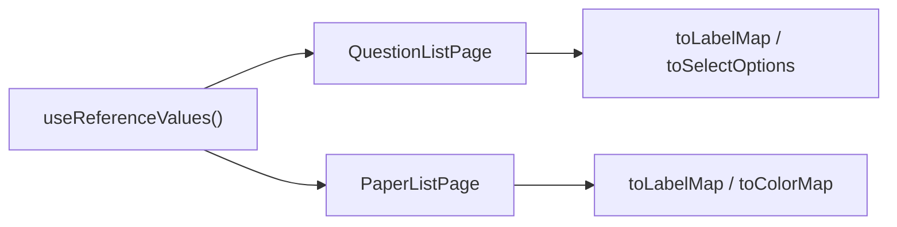

**Diagram sources**
- [QuestionListPage.tsx:49-54](file://frontend/src/pages/questions/QuestionListPage.tsx#L49-L54)
- [PaperListPage.tsx:27-29](file://frontend/src/pages/papers/PaperListPage.tsx#L27-L29)
- [useReferenceValues.ts:67-83](file://frontend/src/hooks/useReferenceValues.ts#L67-L83)

**Section sources**
- [QuestionListPage.tsx:49-54](file://frontend/src/pages/questions/QuestionListPage.tsx#L49-L54)
- [PaperListPage.tsx:27-29](file://frontend/src/pages/papers/PaperListPage.tsx#L27-L29)
- [useReferenceValues.ts:67-83](file://frontend/src/hooks/useReferenceValues.ts#L67-L83)

## Dependency Analysis
- UI components depend on the store for authentication state and on the API client for network operations
- The API client depends on the store for token retrieval and refresh
- Router guards depend on the store for authentication decisions
- Reference data hook is independent but consumed by UI components

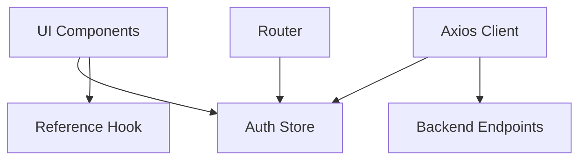

**Diagram sources**
- [auth.ts:47-95](file://frontend/src/store/auth.ts#L47-L95)
- [client.ts:1-55](file://frontend/src/api/client.ts#L1-L55)
- [router.tsx:24-42](file://frontend/src/router.tsx#L24-L42)
- [useReferenceValues.ts:40-63](file://frontend/src/hooks/useReferenceValues.ts#L40-L63)

**Section sources**
- [auth.ts:47-95](file://frontend/src/store/auth.ts#L47-L95)
- [client.ts:1-55](file://frontend/src/api/client.ts#L1-L55)
- [router.tsx:24-42](file://frontend/src/router.tsx#L24-L42)
- [useReferenceValues.ts:40-63](file://frontend/src/hooks/useReferenceValues.ts#L40-L63)

## Performance Considerations
- Minimize re-renders by selecting only required fields from the store
- Prefer memoized computations (e.g., useMemo for label/color maps) to avoid recalculating on each render
- Use shallow equality for primitive fields to reduce unnecessary updates
- Defer heavy UI work until after hydration completes
- Avoid frequent localStorage writes; batch updates when possible

## Troubleshooting Guide
Common issues and resolutions:
- 401 Unauthorized loops after token refresh
  - Ensure refresh endpoint returns tokens in the expected wrapper and that headers are properly set on retry
  - Confirm that localStorage is cleared on refresh failure and navigation to login occurs
- Tokens not persisting across browser sessions
  - Verify that setAuth persists tokens and user metadata to localStorage
  - Check that hydration reads tokens on initial load
- UI not reflecting updated user name
  - Ensure updateUserName is called after successful profile save
- Reference data not appearing in filters
  - Confirm that useReferenceValues is invoked and that listeners trigger re-render after cache population

**Section sources**
- [client.ts:26-52](file://frontend/src/api/client.ts#L26-L52)
- [auth.ts:56-70](file://frontend/src/store/auth.ts#L56-L70)
- [auth.ts:89-92](file://frontend/src/store/auth.ts#L89-L92)
- [useReferenceValues.ts:40-63](file://frontend/src/hooks/useReferenceValues.ts#L40-L63)

## Conclusion
The Zustand-based state management solution cleanly separates authentication concerns from UI logic, with robust token handling and automatic refresh via interceptors. The store’s minimal surface area and localStorage persistence enable reliable hydration across sessions. The reference data hook provides efficient caching and transformation utilities for UI components. Following the best practices outlined here ensures predictable behavior, fewer re-renders, and easier debugging.

## Appendices

### Best Practices for Store Composition and Rendering
- Keep store actions small and focused
- Use selectors to extract only needed slices of state
- Avoid storing large objects in the store; derive UI-specific structures from reference data
- Use memoization for derived data (maps, options) computed from reference data
- Prefer local state for transient UI flags; reserve global state for cross-component shared data

### Debugging State Changes
- Log store updates around setAuth, logout, and updateUserName
- Inspect localStorage keys for access_token, refresh_token, user_type, user_name, user_id
- Temporarily disable interceptors to isolate network vs. state issues
- Verify interceptor behavior by checking Authorization header presence and 401 handling