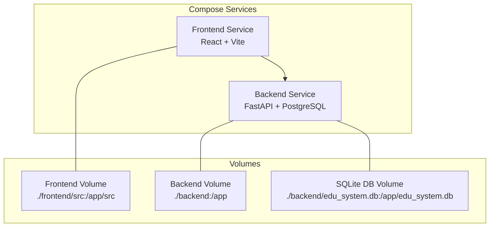
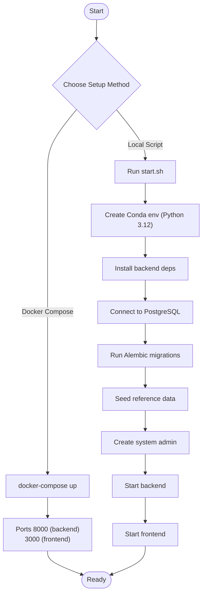
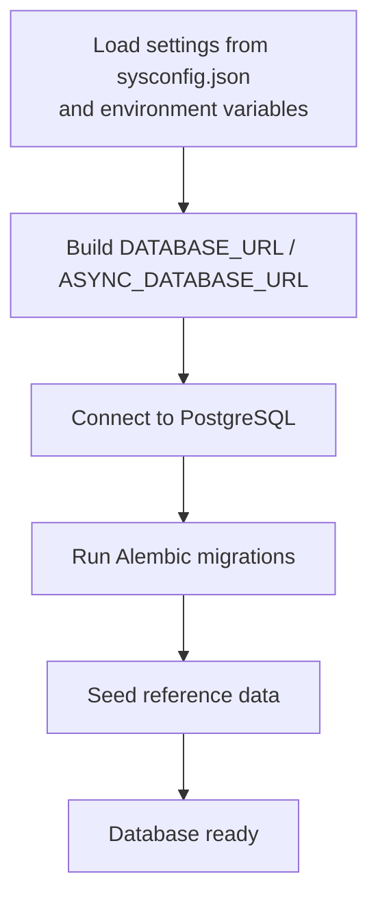
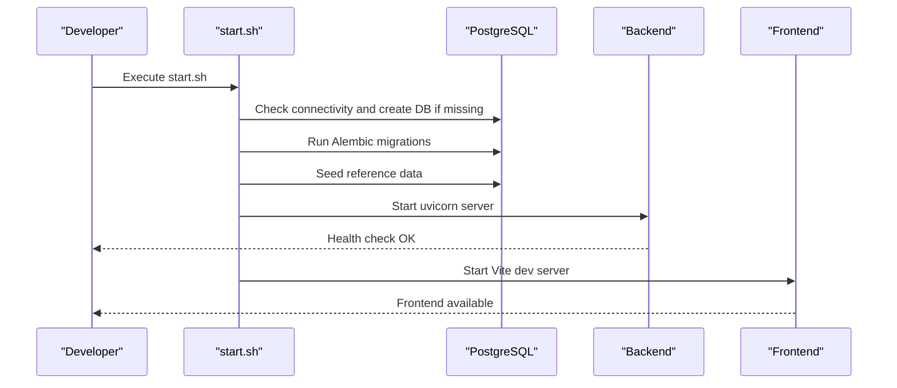
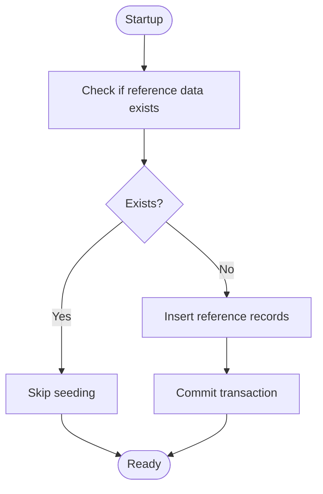
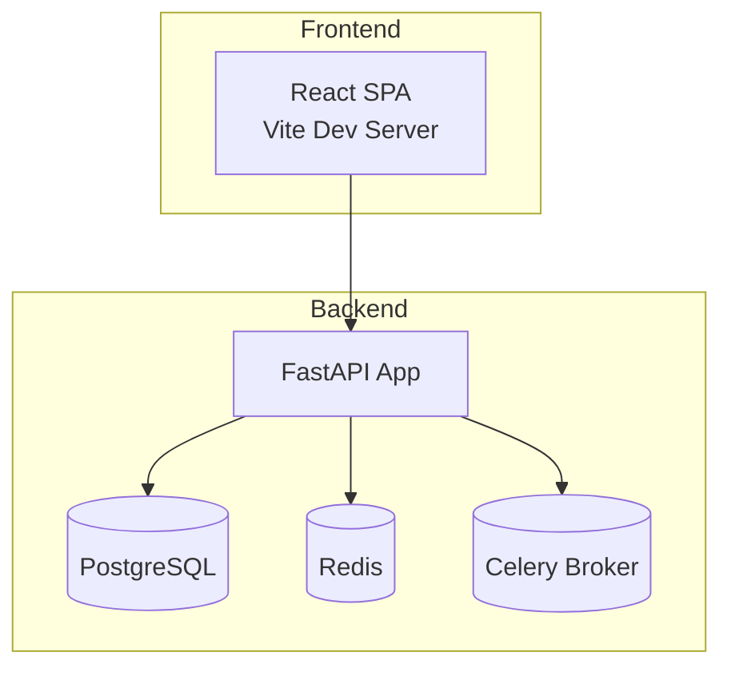
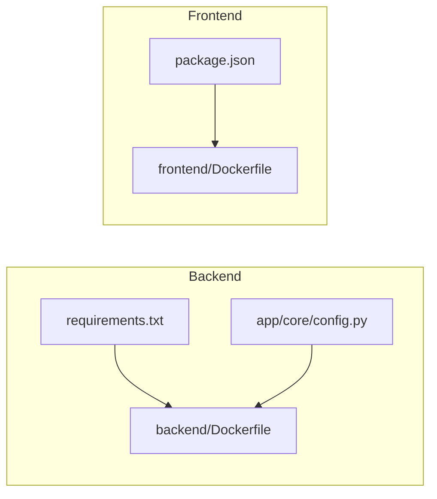

# Getting Started

<cite>
**Referenced Files in This Document**
- [docker-compose.yml](file://docker-compose.yml)
- [start.sh](file://start.sh)
- [backend/Dockerfile](file://backend/Dockerfile)
- [frontend/Dockerfile](file://frontend/Dockerfile)
- [backend/requirements.txt](file://backend/requirements.txt)
- [frontend/package.json](file://frontend/package.json)
- [backend/app/main.py](file://backend/app/main.py)
- [backend/app/core/config.py](file://backend/app/core/config.py)
- [backend/sysconfig.json](file://backend/sysconfig.json)
- [backend/alembic.ini](file://backend/alembic.ini)
- [backend/alembic/env.py](file://backend/alembic/env.py)
- [backend/app/db/base.py](file://backend/app/db/base.py)
- [backend/app/seed_reference.py](file://backend/app/seed_reference.py)
- [docs/project-summary.md](file://docs/project-summary.md)
</cite>

## Table of Contents
1. [Introduction](#introduction)
2. [Project Structure](#project-structure)
3. [Prerequisites](#prerequisites)
4. [Development Environment Setup](#development-environment-setup)
5. [Production Environment Setup](#production-environment-setup)
6. [Environment Variables](#environment-variables)
7. [Database Configuration](#database-configuration)
8. [Initial Project Launch](#initial-project-launch)
9. [Database Seeding](#database-seeding)
10. [Initial User Account Setup](#initial-user-account-setup)
11. [Architecture Overview](#architecture-overview)
12. [Dependency Analysis](#dependency-analysis)
13. [Performance Considerations](#performance-considerations)
14. [Troubleshooting Guide](#troubleshooting-guide)
15. [Conclusion](#conclusion)

## Introduction
This guide helps you install, configure, and run the Ruicheng Educational Management System from repository clone to first successful run. It covers prerequisites, development and production setups, environment configuration, database initialization, seeding, and initial user setup. The project provides both a Docker Compose-based quickstart and a manual setup path via a shell script.

## Project Structure
The system consists of:
- Backend API service built with FastAPI and PostgreSQL (SQLite supported for development)
- Frontend SPA built with React, TypeScript, and Vite
- Docker images for both backend and frontend
- Automated startup script for local development
- Alembic-based database migrations

**Diagram sources**
- [docker-compose.yml:1-33](file://docker-compose.yml#L1-L33)

**Section sources**
- [docker-compose.yml:1-33](file://docker-compose.yml#L1-L33)
- [backend/Dockerfile:1-11](file://backend/Dockerfile#L1-L11)
- [frontend/Dockerfile:1-11](file://frontend/Dockerfile#L1-L11)

## Prerequisites
- Python 3.9+ (the project supports Python 3.12 in containers; local development can use Conda-managed Python 3.12)
- Node.js 22+ for frontend development
- Docker and Docker Compose for containerized setup
- PostgreSQL server for production-grade database
- Git for cloning the repository

Notes:
- The backend Docker image uses Python 3.12.
- The frontend Docker image uses Node.js 22.
- The system can run with SQLite for development (see Alembic configuration and compose file).

**Section sources**
- [backend/Dockerfile:1-11](file://backend/Dockerfile#L1-L11)
- [frontend/Dockerfile:1-11](file://frontend/Dockerfile#L1-L11)
- [backend/requirements.txt:1-27](file://backend/requirements.txt#L1-L27)
- [frontend/package.json:1-38](file://frontend/package.json#L1-L38)
- [docs/project-summary.md:1-87](file://docs/project-summary.md#L1-L87)

## Development Environment Setup
Choose one of the following approaches:

Option A: Docker Compose (recommended for quickstart)
- Build and run services with exposed ports for backend (8000) and frontend (3000)
- The compose file mounts source directories for live reload and persists a local SQLite database file

Option B: Local script (start.sh)
- Creates a Conda environment with Python 3.12
- Installs backend dependencies from requirements.txt
- Checks and connects to PostgreSQL
- Runs Alembic migrations
- Seeds reference data and creates a default system administrator
- Starts backend and frontend with health checks

**Diagram sources**
- [docker-compose.yml:1-33](file://docker-compose.yml#L1-L33)
- [start.sh:1-359](file://start.sh#L1-L359)

**Section sources**
- [docker-compose.yml:1-33](file://docker-compose.yml#L1-L33)
- [start.sh:1-359](file://start.sh#L1-L359)

## Production Environment Setup
- Use PostgreSQL as the primary database
- Configure environment variables for secrets and external services (Redis, Celery broker)
- Build images from Dockerfiles and deploy via Docker Compose or your preferred orchestrator
- Ensure proper firewall and network policies for backend and frontend ports

Key production considerations:
- Replace default secret keys and tokens
- Use HTTPS and secure headers
- Monitor backend health endpoint and frontend availability
- Back up PostgreSQL regularly

**Section sources**
- [backend/Dockerfile:1-11](file://backend/Dockerfile#L1-L11)
- [frontend/Dockerfile:1-11](file://frontend/Dockerfile#L1-L11)
- [backend/app/core/config.py:36-98](file://backend/app/core/config.py#L36-L98)

## Environment Variables
Configure the following environment variables for the backend service. They override values from sysconfig.json where applicable.

Required for backend operation:
- SECRET_KEY: JWT signing key
- DATABASE_PASSWORD: PostgreSQL password
- POSTGRES_SERVER: Database host
- POSTGRES_PORT: Database port
- POSTGRES_DB: Database name
- POSTGRES_USER: Database user

Optional overrides:
- REDIS_HOST, REDIS_PORT, REDIS_DB, REDIS_PASSWORD: Redis cache and queue
- CELERY_BROKER_URL, CELERY_RESULT_BACKEND: Celery broker and result backend
- UPLOAD_DIR: Upload directory path
- OCR_ENGINE, OCR_LANG: OCR engine and language
- MODEL_CACHE_DIR: Model cache directory
- LOG_LEVEL: Logging level

Notes:
- The backend loads configuration from sysconfig.json by default and allows environment overrides for sensitive values.
- The compose file demonstrates typical development-time environment variables.

**Section sources**
- [backend/app/core/config.py:36-98](file://backend/app/core/config.py#L36-L98)
- [backend/sysconfig.json:1-48](file://backend/sysconfig.json#L1-L48)
- [docker-compose.yml:13-20](file://docker-compose.yml#L13-L20)

## Database Configuration
The system supports both SQLite (development) and PostgreSQL (production).

- SQLite (default in development): Alembic configuration points to a local SQLite file; the compose file mounts this file for persistence.
- PostgreSQL (recommended for production): The backend reads credentials from sysconfig.json and environment variables, constructs DATABASE_URL and ASYNC_DATABASE_URL, and uses asyncpg for async connections.

Migration and connection:
- Alembic env.py overrides the SQLAlchemy URL to use the configured PostgreSQL URL from settings.
- The backend startup event seeds reference data automatically.

**Diagram sources**
- [backend/app/core/config.py:56-61](file://backend/app/core/config.py#L56-L61)
- [backend/alembic/env.py:15-20](file://backend/alembic/env.py#L15-L20)
- [backend/alembic.ini:89-90](file://backend/alembic.ini#L89-L90)
- [backend/app/main.py:33-43](file://backend/app/main.py#L33-L43)

**Section sources**
- [backend/alembic.ini:89-90](file://backend/alembic.ini#L89-L90)
- [backend/alembic/env.py:15-20](file://backend/alembic/env.py#L15-L20)
- [backend/app/core/config.py:56-61](file://backend/app/core/config.py#L56-L61)
- [backend/app/main.py:33-43](file://backend/app/main.py#L33-L43)

## Initial Project Launch
Follow these steps to launch the system after setup.

Docker Compose (development):
- Start services: docker-compose up
- Access:
  - Backend API: http://localhost:8000
  - Frontend: http://localhost:3000
  - API docs: http://localhost:8000/docs

Local script (start.sh):
- Run the script to initialize Conda, install dependencies, migrate the database, seed data, and start services
- The script waits for health checks and prints service URLs and default credentials

**Diagram sources**
- [start.sh:187-332](file://start.sh#L187-L332)
- [backend/app/main.py:50-52](file://backend/app/main.py#L50-L52)

**Section sources**
- [docker-compose.yml:1-33](file://docker-compose.yml#L1-L33)
- [start.sh:187-332](file://start.sh#L187-L332)
- [backend/app/main.py:50-52](file://backend/app/main.py#L50-L52)

## Database Seeding
The system seeds reference data automatically on backend startup and during the local script run. Reference data includes question types, difficulty levels, grade levels, paper statuses, error types, question sources, and provinces.

- Automatic seeding occurs on backend startup.
- The local script ensures reference data exists and creates a default system administrator if not present.

**Diagram sources**
- [backend/app/main.py:33-43](file://backend/app/main.py#L33-L43)
- [backend/app/seed_reference.py:61-72](file://backend/app/seed_reference.py#L61-L72)

**Section sources**
- [backend/app/seed_reference.py:1-72](file://backend/app/seed_reference.py#L1-L72)
- [backend/app/main.py:33-43](file://backend/app/main.py#L33-L43)
- [start.sh:219-264](file://start.sh#L219-L264)

## Initial User Account Setup
Default system administrator credentials:
- Username: SYSAdmin
- Password: SYSPass

The local script creates this administrator account if it does not exist. Use the management login page to sign in and manage users and configurations.

Access:
- Student portal login: http://localhost:3000/login
- Admin portal login: http://localhost:3000/admin/login

Notes:
- Change default passwords immediately in production.
- Use the admin interface to create additional users and roles.

**Section sources**
- [start.sh:245-264](file://start.sh#L245-L264)
- [docs/project-summary.md:340-352](file://docs/project-summary.md#L340-L352)

## Architecture Overview
High-level architecture of the system:

**Diagram sources**
- [backend/app/main.py:1-52](file://backend/app/main.py#L1-L52)
- [backend/app/core/config.py:63-76](file://backend/app/core/config.py#L63-L76)

**Section sources**
- [backend/app/main.py:1-52](file://backend/app/main.py#L1-L52)
- [backend/app/core/config.py:63-76](file://backend/app/core/config.py#L63-L76)

## Dependency Analysis
Backend dependencies are declared in requirements.txt. Frontend dependencies are declared in package.json. Dockerfiles define base images and commands for building and running services.

**Diagram sources**
- [backend/requirements.txt:1-27](file://backend/requirements.txt#L1-L27)
- [frontend/package.json:1-38](file://frontend/package.json#L1-L38)
- [backend/Dockerfile:1-11](file://backend/Dockerfile#L1-L11)
- [frontend/Dockerfile:1-11](file://frontend/Dockerfile#L1-L11)

**Section sources**
- [backend/requirements.txt:1-27](file://backend/requirements.txt#L1-L27)
- [frontend/package.json:1-38](file://frontend/package.json#L1-L38)
- [backend/Dockerfile:1-11](file://backend/Dockerfile#L1-L11)
- [frontend/Dockerfile:1-11](file://frontend/Dockerfile#L1-L11)

## Performance Considerations
- Use PostgreSQL in production for better concurrency and reliability compared to SQLite.
- Tune OCR and grading settings in sysconfig.json for performance and accuracy.
- Configure Redis and Celery appropriately for background tasks.
- Monitor backend health endpoint and frontend build/serve performance.

[No sources needed since this section provides general guidance]

## Troubleshooting Guide
Common issues and resolutions:

- Port conflicts:
  - Stop processes using ports 8000 or 3000 before launching services.
  - The local script attempts to clean up existing processes.

- PostgreSQL connection failures:
  - Ensure PostgreSQL is running and reachable with the configured credentials.
  - Verify database existence and permissions.

- Alembic migration errors:
  - Confirm DATABASE_URL matches the target database.
  - The local script falls back to creating tables programmatically if migrations fail.

- Frontend not loading:
  - Allow time for Vite to compile; the script waits and logs readiness.
  - Check browser console for build errors.

- Health checks failing:
  - Verify backend startup logs and ensure migrations succeeded.
  - Confirm environment variables are correctly set.

**Section sources**
- [start.sh:159-196](file://start.sh#L159-L196)
- [start.sh:198-217](file://start.sh#L198-L217)
- [start.sh:288-332](file://start.sh#L288-L332)
- [backend/alembic/env.py:63-80](file://backend/alembic/env.py#L63-L80)

## Conclusion
You now have the steps to install, configure, and run the Ruicheng Educational Management System in development and production environments. Use Docker Compose for a quickstart, or the local script for a guided setup. Ensure PostgreSQL is available for production, configure environment variables, and leverage the automated seeding and health checks to achieve a successful first run.