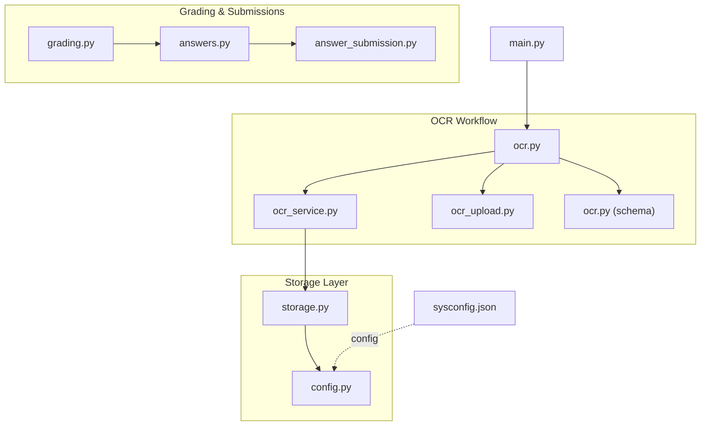
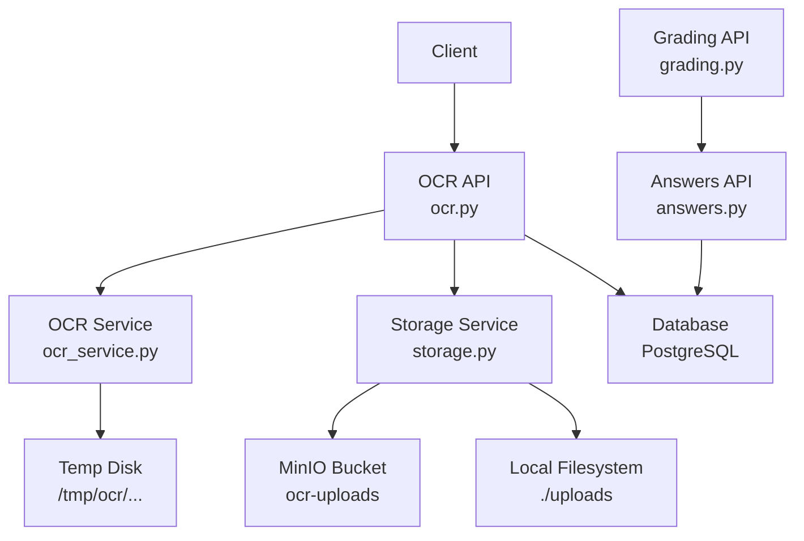
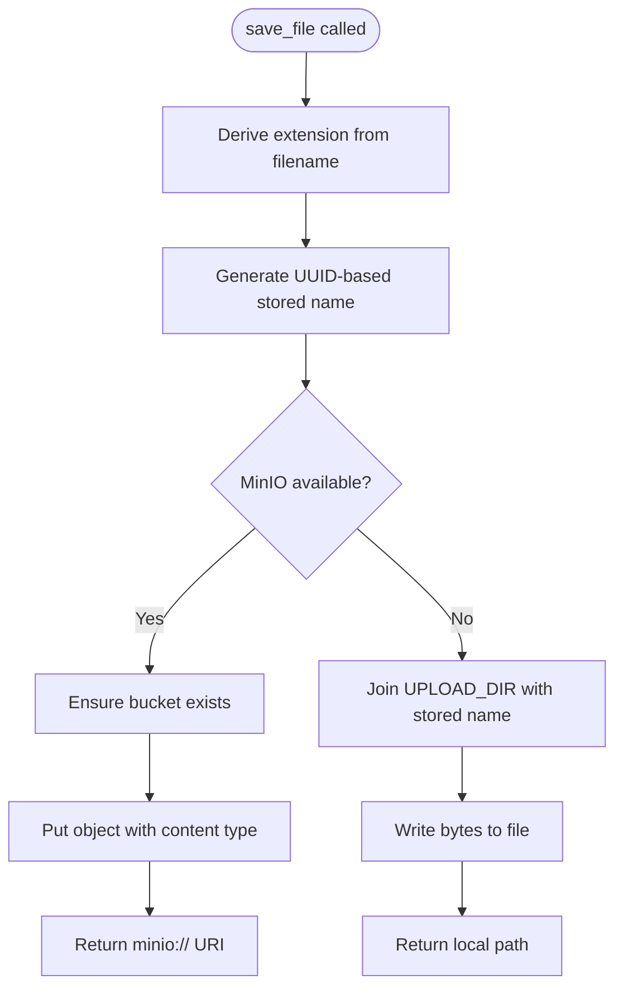
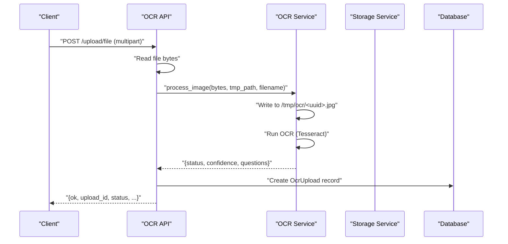
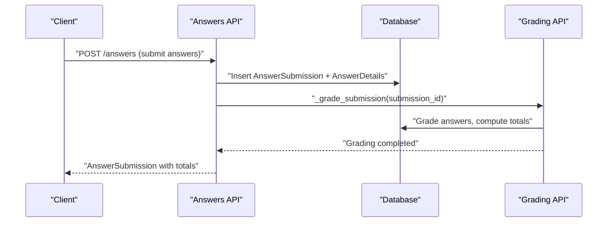
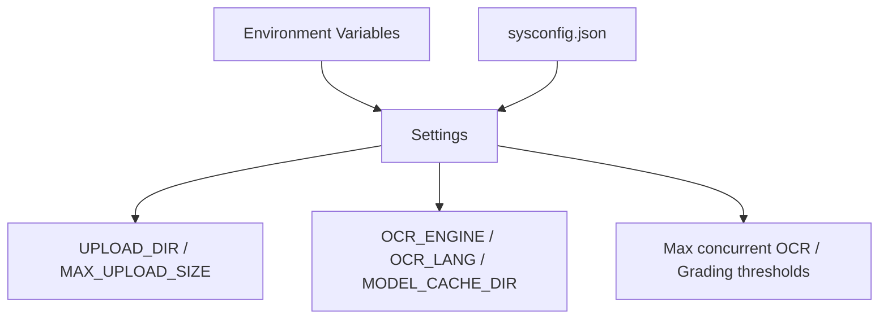
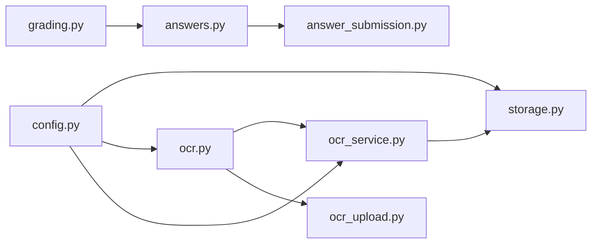

# File Storage Integration

<cite>
**Referenced Files in This Document**
- [storage.py](file://backend/app/services/storage.py)
- [config.py](file://backend/app/core/config.py)
- [ocr.py](file://backend/app/api/v1/endpoints/ocr.py)
- [ocr_service.py](file://backend/app/services/ocr_service.py)
- [ocr_upload.py](file://backend/app/models/ocr_upload.py)
- [ocr.py (schema)](file://backend/app/schemas/ocr.py)
- [grading.py](file://backend/app/api/v1/endpoints/grading.py)
- [answer_submission.py](file://backend/app/models/answer_submission.py)
- [answers.py](file://backend/app/api/v1/endpoints/answers.py)
- [sysconfig.json](file://backend/sysconfig.json)
- [main.py](file://backend/app/main.py)
</cite>

## Table of Contents
1. [Introduction](#introduction)
2. [Project Structure](#project-structure)
3. [Core Components](#core-components)
4. [Architecture Overview](#architecture-overview)
5. [Detailed Component Analysis](#detailed-component-analysis)
6. [Dependency Analysis](#dependency-analysis)
7. [Performance Considerations](#performance-considerations)
8. [Troubleshooting Guide](#troubleshooting-guide)
9. [Conclusion](#conclusion)
10. [Appendices](#appendices)

## Introduction
This document describes the file storage integration for media management, file upload and download workflows, and cloud storage configurations. It explains the storage service architecture, file handling mechanisms, and content delivery optimization. It also documents supported storage backends, file format handling, security considerations for file access, configuration examples for local and cloud storage, and integration with OCR and grading workflows, including temporary file management and cleanup procedures.

## Project Structure
The file storage integration spans several backend modules:
- Storage service: centralized logic for saving files and generating URLs
- OCR endpoints and service: image upload, OCR processing, and temporary file handling
- Grading and answer submission: integration with OCR uploads and grading workflows
- Configuration: environment-driven settings for storage, OCR, and model caching
- System configuration: defaults and feature toggles for OCR and grading

**Diagram sources**
- [storage.py:1-55](file://backend/app/services/storage.py#L1-L55)
- [config.py:77-87](file://backend/app/core/config.py#L77-L87)
- [ocr.py:18-64](file://backend/app/api/v1/endpoints/ocr.py#L18-L64)
- [ocr_service.py:61-126](file://backend/app/services/ocr_service.py#L61-L126)
- [ocr_upload.py:8-36](file://backend/app/models/ocr_upload.py#L8-L36)
- [ocr.py (schema):7-48](file://backend/app/schemas/ocr.py#L7-L48)
- [grading.py:19-55](file://backend/app/api/v1/endpoints/grading.py#L19-L55)
- [answers.py:24-113](file://backend/app/api/v1/endpoints/answers.py#L24-L113)
- [answer_submission.py:9-37](file://backend/app/models/answer_submission.py#L9-L37)
- [sysconfig.json:35-39](file://backend/sysconfig.json#L35-L39)
- [main.py:29-30](file://backend/app/main.py#L29-L30)

**Section sources**
- [storage.py:1-55](file://backend/app/services/storage.py#L1-L55)
- [config.py:77-87](file://backend/app/core/config.py#L77-L87)
- [ocr.py:18-64](file://backend/app/api/v1/endpoints/ocr.py#L18-L64)
- [ocr_service.py:61-126](file://backend/app/services/ocr_service.py#L61-L126)
- [ocr_upload.py:8-36](file://backend/app/models/ocr_upload.py#L8-L36)
- [ocr.py (schema):7-48](file://backend/app/schemas/ocr.py#L7-L48)
- [grading.py:19-55](file://backend/app/api/v1/endpoints/grading.py#L19-L55)
- [answers.py:24-113](file://backend/app/api/v1/endpoints/answers.py#L24-L113)
- [answer_submission.py:9-37](file://backend/app/models/answer_submission.py#L9-L37)
- [sysconfig.json:35-39](file://backend/sysconfig.json#L35-L39)
- [main.py:29-30](file://backend/app/main.py#L29-L30)

## Core Components
- Storage service
  - Provides unified file save and URL generation
  - Supports MinIO-backed storage with automatic bucket creation
  - Falls back to local filesystem when MinIO is unavailable
  - Generates deterministic filenames and returns either MinIO URIs or local paths
- OCR upload and processing
  - Accepts multipart image uploads and runs OCR
  - Stores OCR records with structured results and metadata
  - Uses temporary disk files during OCR processing
- Grading and answer submissions
  - Integrates with OCR uploads via foreign keys
  - Triggers grading workflows after submission
- Configuration
  - Environment-driven settings for upload directory, sizes, OCR engines, and model cache
  - System configuration JSON for defaults and feature toggles

Key responsibilities:
- File persistence and retrieval
- Temporary file lifecycle management
- Access control and URL generation
- Structured metadata for OCR results
- Integration with grading pipeline

**Section sources**
- [storage.py:25-55](file://backend/app/services/storage.py#L25-L55)
- [ocr.py:18-64](file://backend/app/api/v1/endpoints/ocr.py#L18-L64)
- [ocr_service.py:61-126](file://backend/app/services/ocr_service.py#L61-L126)
- [ocr_upload.py:8-36](file://backend/app/models/ocr_upload.py#L8-L36)
- [config.py:77-87](file://backend/app/core/config.py#L77-L87)
- [sysconfig.json:35-39](file://backend/sysconfig.json#L35-L39)

## Architecture Overview
The storage architecture supports two backends:
- MinIO: object storage with pre-signed URLs for secure access
- Local filesystem: simple file serving under an uploads directory

**Diagram sources**
- [ocr.py:18-64](file://backend/app/api/v1/endpoints/ocr.py#L18-L64)
- [ocr_service.py:61-126](file://backend/app/services/ocr_service.py#L61-L126)
- [storage.py:25-55](file://backend/app/services/storage.py#L25-L55)
- [grading.py:19-55](file://backend/app/api/v1/endpoints/grading.py#L19-L55)
- [answers.py:24-113](file://backend/app/api/v1/endpoints/answers.py#L24-L113)

## Detailed Component Analysis

### Storage Service
The storage service encapsulates file persistence and URL generation:
- Deterministic naming: UUID-based filenames with preserved extensions
- Backend selection: attempts MinIO initialization; falls back to local filesystem
- Bucket management: creates bucket automatically if missing
- URL generation: returns MinIO pre-signed URLs or local static paths

**Diagram sources**
- [storage.py:25-45](file://backend/app/services/storage.py#L25-L45)

**Section sources**
- [storage.py:10-22](file://backend/app/services/storage.py#L10-L22)
- [storage.py:25-45](file://backend/app/services/storage.py#L25-L45)
- [storage.py:48-55](file://backend/app/services/storage.py#L48-L55)

### OCR Upload and Processing
OCR endpoints handle image uploads and integrate with the OCR service:
- Authentication and authorization: restricts to students for uploads
- Temporary file handling: writes uploaded image to a temporary path for OCR processing
- Structured result storage: persists OCR metadata and structured data
- Status transitions: PENDING → PROCESSING → COMPLETED/NEEDS_REVIEW/FAILED

**Diagram sources**
- [ocr.py:18-64](file://backend/app/api/v1/endpoints/ocr.py#L18-L64)
- [ocr_service.py:61-126](file://backend/app/services/ocr_service.py#L61-L126)

**Section sources**
- [ocr.py:18-64](file://backend/app/api/v1/endpoints/ocr.py#L18-L64)
- [ocr_service.py:61-126](file://backend/app/services/ocr_service.py#L61-L126)
- [ocr_upload.py:8-36](file://backend/app/models/ocr_upload.py#L8-L36)
- [ocr.py (schema):7-48](file://backend/app/schemas/ocr.py#L7-L48)

### Grading and Answer Submission Integration
Grading integrates with OCR uploads and answer submissions:
- Submission links OCR uploads via foreign keys
- Starts grading workflow upon submission
- Updates submission status and stores grading records

**Diagram sources**
- [answers.py:115-191](file://backend/app/api/v1/endpoints/answers.py#L115-L191)
- [grading.py:19-55](file://backend/app/api/v1/endpoints/grading.py#L19-L55)
- [answer_submission.py:9-37](file://backend/app/models/answer_submission.py#L9-L37)

**Section sources**
- [answers.py:24-113](file://backend/app/api/v1/endpoints/answers.py#L24-L113)
- [grading.py:19-55](file://backend/app/api/v1/endpoints/grading.py#L19-L55)
- [answer_submission.py:9-37](file://backend/app/models/answer_submission.py#L9-L37)

### Configuration and Environment
Configuration is driven by environment variables and system configuration:
- Upload directory and limits
- OCR engine and language settings
- Model cache directory
- System-level defaults for OCR and grading

**Diagram sources**
- [config.py:77-87](file://backend/app/core/config.py#L77-L87)
- [sysconfig.json:35-39](file://backend/sysconfig.json#L35-L39)

**Section sources**
- [config.py:77-87](file://backend/app/core/config.py#L77-L87)
- [sysconfig.json:35-39](file://backend/sysconfig.json#L35-L39)

## Dependency Analysis
- Storage service depends on configuration for upload directory and optional MinIO environment
- OCR endpoints depend on OCR service for processing and on storage service for persistence
- Grading and answers APIs depend on database models and each other for workflow orchestration
- System configuration influences OCR and grading behavior

**Diagram sources**
- [config.py:77-87](file://backend/app/core/config.py#L77-L87)
- [storage.py:25-55](file://backend/app/services/storage.py#L25-L55)
- [ocr.py:18-64](file://backend/app/api/v1/endpoints/ocr.py#L18-L64)
- [ocr_service.py:61-126](file://backend/app/services/ocr_service.py#L61-L126)
- [ocr_upload.py:8-36](file://backend/app/models/ocr_upload.py#L8-L36)
- [grading.py:19-55](file://backend/app/api/v1/endpoints/grading.py#L19-L55)
- [answers.py:24-113](file://backend/app/api/v1/endpoints/answers.py#L24-L113)
- [answer_submission.py:9-37](file://backend/app/models/answer_submission.py#L9-L37)

**Section sources**
- [storage.py:25-55](file://backend/app/services/storage.py#L25-L55)
- [ocr.py:18-64](file://backend/app/api/v1/endpoints/ocr.py#L18-L64)
- [ocr_service.py:61-126](file://backend/app/services/ocr_service.py#L61-L126)
- [ocr_upload.py:8-36](file://backend/app/models/ocr_upload.py#L8-L36)
- [grading.py:19-55](file://backend/app/api/v1/endpoints/grading.py#L19-L55)
- [answers.py:24-113](file://backend/app/api/v1/endpoints/answers.py#L24-L113)
- [answer_submission.py:9-37](file://backend/app/models/answer_submission.py#L9-L37)

## Performance Considerations
- MinIO vs local storage: MinIO offers scalable object storage and pre-signed URLs; local storage is simpler but less scalable
- Upload size limits: enforced by configuration to prevent oversized uploads
- Temporary file handling: ensure sufficient disk space and cleanup policies for OCR temp files
- Concurrency: system configuration defines maximum concurrent OCR and grading operations
- Caching: model cache directory reduces repeated model loading overhead

[No sources needed since this section provides general guidance]

## Troubleshooting Guide
Common issues and resolutions:
- MinIO connectivity failures: verify endpoint, credentials, and bucket availability; fallback to local filesystem is automatic
- Missing Tesseract: OCR processing requires Tesseract installation; the service returns a failure status with guidance
- Permission errors: ensure only authorized users (students) perform uploads; grading endpoints enforce ownership and roles
- Temporary file cleanup: confirm that OCR temp directories are cleaned after processing; monitor disk usage
- URL access: MinIO pre-signed URLs expire after a configurable duration; regenerate URLs as needed

**Section sources**
- [storage.py:10-22](file://backend/app/services/storage.py#L10-L22)
- [ocr_service.py:71-78](file://backend/app/services/ocr_service.py#L71-L78)
- [ocr.py:26-27](file://backend/app/api/v1/endpoints/ocr.py#L26-L27)
- [grading.py:32-33](file://backend/app/api/v1/endpoints/grading.py#L32-L33)

## Conclusion
The file storage integration provides a robust foundation for media management with flexible backend support, secure URL generation, and seamless integration with OCR and grading workflows. By leveraging environment-driven configuration and system defaults, administrators can tailor storage behavior to local or cloud environments while maintaining strong access controls and operational reliability.

[No sources needed since this section summarizes without analyzing specific files]

## Appendices

### Supported Storage Backends
- MinIO: object storage with automatic bucket creation and pre-signed URL generation
- Local filesystem: simple file persistence under configured upload directory

**Section sources**
- [storage.py:10-22](file://backend/app/services/storage.py#L10-L22)
- [storage.py:25-45](file://backend/app/services/storage.py#L25-L45)
- [storage.py:48-55](file://backend/app/services/storage.py#L48-L55)

### File Format Handling
- Deterministic naming: UUID-based filenames with preserved extensions
- Content type propagation: used when storing with MinIO
- Upload size limits: enforced by configuration

**Section sources**
- [storage.py:27-28](file://backend/app/services/storage.py#L27-L28)
- [storage.py:35-39](file://backend/app/services/storage.py#L35-L39)
- [config.py:79](file://backend/app/core/config.py#L79)

### Security Considerations
- Access control: endpoints restrict access based on user roles and ownership
- URL expiration: MinIO pre-signed URLs include expiration parameters
- Temporary file isolation: OCR processing uses isolated temporary paths

**Section sources**
- [ocr.py:26-27](file://backend/app/api/v1/endpoints/ocr.py#L26-L27)
- [ocr.py:106-111](file://backend/app/api/v1/endpoints/ocr.py#L106-L111)
- [storage.py:52-54](file://backend/app/services/storage.py#L52-L54)

### Configuration Examples
- Local storage
  - Set upload directory and limits via environment variables
  - Example keys: UPLOAD_DIR, MAX_UPLOAD_SIZE
- Cloud storage (MinIO)
  - Configure endpoint, access key, and secret key
  - Ensure bucket exists or rely on automatic creation
- OCR configuration
  - Engine and language settings via environment variables
  - System defaults in sysconfig.json influence behavior

**Section sources**
- [config.py:77-87](file://backend/app/core/config.py#L77-L87)
- [storage.py:13-18](file://backend/app/services/storage.py#L13-L18)
- [sysconfig.json:35-39](file://backend/sysconfig.json#L35-L39)

### File Organization and Metadata Management
- OCR uploads persist structured data and metadata for downstream processing
- Answer submissions link to OCR uploads and track grading outcomes
- Database constraints ensure data integrity for statuses and sizes

**Section sources**
- [ocr_upload.py:8-36](file://backend/app/models/ocr_upload.py#L8-L36)
- [answer_submission.py:9-37](file://backend/app/models/answer_submission.py#L9-L37)

### Backup Strategies
- Local filesystem backups: regular snapshotting of the upload directory
- MinIO backups: leverage object storage replication and versioning
- Database backups: maintain regular PostgreSQL backups for metadata

[No sources needed since this section provides general guidance]

### Integration with OCR and Grading Workflows
- OCR endpoints create records with structured results and status
- Grading endpoints trigger scoring and update submission totals
- Temporary files are managed during OCR processing and should be cleaned

**Section sources**
- [ocr.py:18-64](file://backend/app/api/v1/endpoints/ocr.py#L18-L64)
- [ocr_service.py:61-126](file://backend/app/services/ocr_service.py#L61-L126)
- [answers.py:24-113](file://backend/app/api/v1/endpoints/answers.py#L24-L113)
- [grading.py:19-55](file://backend/app/api/v1/endpoints/grading.py#L19-L55)