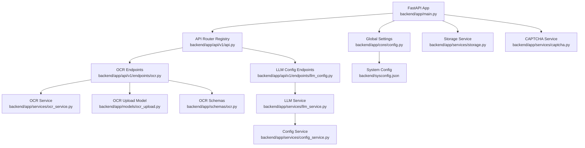
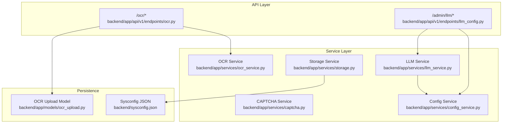
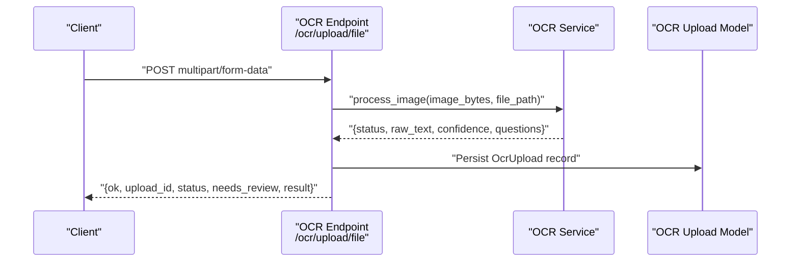
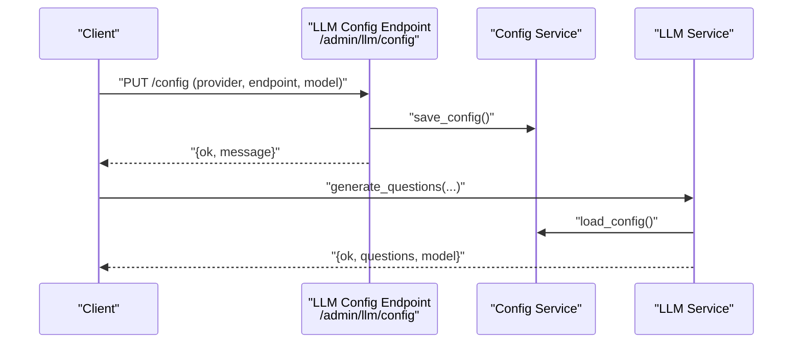
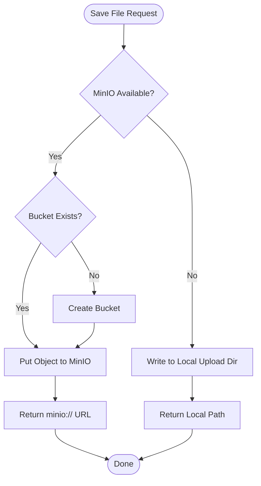
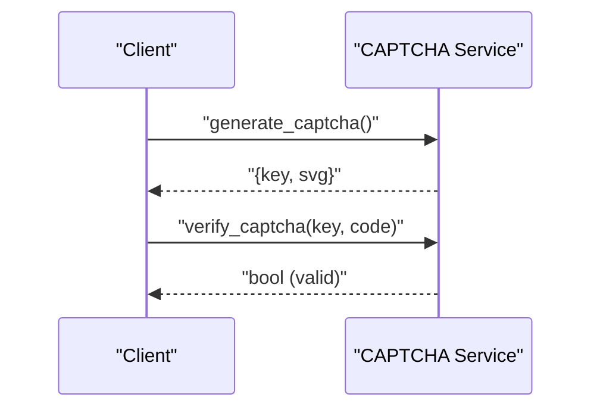
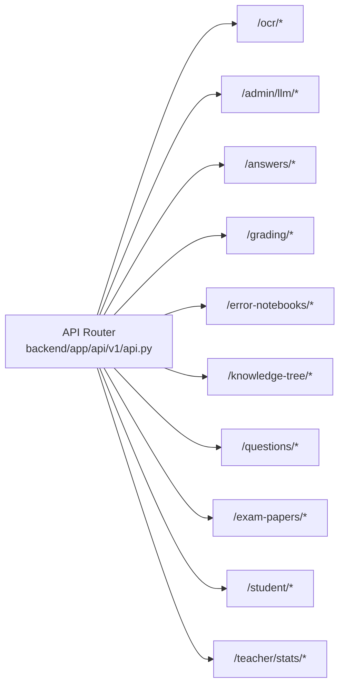
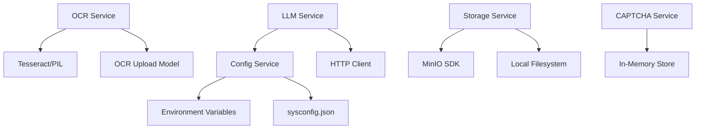
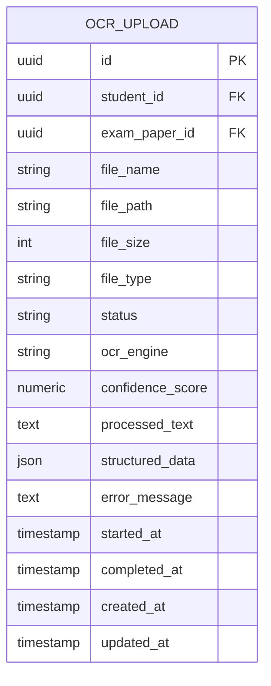

# Integration & Extensions

<cite>
**Referenced Files in This Document**
- [backend/app/main.py](file://backend/app/main.py)
- [backend/app/core/config.py](file://backend/app/core/config.py)
- [backend/app/api/v1/api.py](file://backend/app/api/v1/api.py)
- [backend/app/api/v1/endpoints/ocr.py](file://backend/app/api/v1/endpoints/ocr.py)
- [backend/app/api/v1/endpoints/llm_config.py](file://backend/app/api/v1/endpoints/llm_config.py)
- [backend/app/services/ocr_service.py](file://backend/app/services/ocr_service.py)
- [backend/app/services/llm_service.py](file://backend/app/services/llm_service.py)
- [backend/app/services/storage.py](file://backend/app/services/storage.py)
- [backend/app/services/captcha.py](file://backend/app/services/captcha.py)
- [backend/app/services/config_service.py](file://backend/app/services/config_service.py)
- [backend/app/models/ocr_upload.py](file://backend/app/models/ocr_upload.py)
- [backend/app/schemas/ocr.py](file://backend/app/schemas/ocr.py)
- [backend/sysconfig.json](file://backend/sysconfig.json)
</cite>

## Table of Contents
1. [Introduction](#introduction)
2. [Project Structure](#project-structure)
3. [Core Components](#core-components)
4. [Architecture Overview](#architecture-overview)
5. [Detailed Component Analysis](#detailed-component-analysis)
6. [Dependency Analysis](#dependency-analysis)
7. [Performance Considerations](#performance-considerations)
8. [Troubleshooting Guide](#troubleshooting-guide)
9. [Conclusion](#conclusion)
10. [Appendices](#appendices)

## Introduction
This document explains how the system integrates with third-party services and supports extensibility. It covers:
- OCR engine integration and image processing pipeline
- LLM service integration for question generation and intelligent tutoring
- File storage integration with local and cloud options
- Captcha service integration and security mechanisms
- Plugin architecture and service registration patterns
- Extensibility guidelines for adding new integrations and custom services

## Project Structure
The backend is a FastAPI application with modular routers and service layers. Configuration is centralized, and integrations are encapsulated in dedicated services.

**Diagram sources**
- [backend/app/main.py:11-30](file://backend/app/main.py#L11-L30)
- [backend/app/api/v1/api.py:5-25](file://backend/app/api/v1/api.py#L5-L25)
- [backend/app/api/v1/endpoints/ocr.py:15](file://backend/app/api/v1/endpoints/ocr.py#L15)
- [backend/app/api/v1/endpoints/llm_config.py:7](file://backend/app/api/v1/endpoints/llm_config.py#L7)
- [backend/app/services/ocr_service.py:1](file://backend/app/services/ocr_service.py#L1)
- [backend/app/services/llm_service.py:1](file://backend/app/services/llm_service.py#L1)
- [backend/app/core/config.py:36-97](file://backend/app/core/config.py#L36-L97)
- [backend/app/services/storage.py:1](file://backend/app/services/storage.py#L1)
- [backend/app/services/captcha.py:1](file://backend/app/services/captcha.py#L1)
- [backend/app/services/config_service.py:65-78](file://backend/app/services/config_service.py#L65-L78)
- [backend/app/models/ocr_upload.py:8-36](file://backend/app/models/ocr_upload.py#L8-L36)
- [backend/app/schemas/ocr.py:7-48](file://backend/app/schemas/ocr.py#L7-L48)
- [backend/sysconfig.json:1-48](file://backend/sysconfig.json#L1-L48)

**Section sources**
- [backend/app/main.py:11-30](file://backend/app/main.py#L11-L30)
- [backend/app/api/v1/api.py:5-25](file://backend/app/api/v1/api.py#L5-L25)
- [backend/app/core/config.py:36-97](file://backend/app/core/config.py#L36-L97)

## Core Components
- OCR pipeline: image upload → OCR processing → structured result with confidence and status
- LLM integration: question generation and practice question generation via configurable providers
- Storage: local filesystem or MinIO-backed object storage with signed URLs
- CAPTCHA: in-memory SVG-based challenge with expiration and one-time verification
- Configuration: centralized JSON config with environment overrides for secrets

**Section sources**
- [backend/app/api/v1/endpoints/ocr.py:18-64](file://backend/app/api/v1/endpoints/ocr.py#L18-L64)
- [backend/app/services/ocr_service.py:61-126](file://backend/app/services/ocr_service.py#L61-L126)
- [backend/app/services/llm_service.py:54-104](file://backend/app/services/llm_service.py#L54-L104)
- [backend/app/services/storage.py:25-55](file://backend/app/services/storage.py#L25-L55)
- [backend/app/services/captcha.py:12-40](file://backend/app/services/captcha.py#L12-L40)
- [backend/app/services/config_service.py:65-78](file://backend/app/services/config_service.py#L65-L78)

## Architecture Overview
The system exposes modular APIs grouped by domain. Services encapsulate third-party integrations and are wired into endpoints. Global settings and configuration drive behavior across services.

**Diagram sources**
- [backend/app/api/v1/endpoints/ocr.py:15](file://backend/app/api/v1/endpoints/ocr.py#L15)
- [backend/app/api/v1/endpoints/llm_config.py:7](file://backend/app/api/v1/endpoints/llm_config.py#L7)
- [backend/app/services/ocr_service.py:1](file://backend/app/services/ocr_service.py#L1)
- [backend/app/services/llm_service.py:1](file://backend/app/services/llm_service.py#L1)
- [backend/app/services/storage.py:1](file://backend/app/services/storage.py#L1)
- [backend/app/services/captcha.py:1](file://backend/app/services/captcha.py#L1)
- [backend/app/services/config_service.py:65-78](file://backend/app/services/config_service.py#L65-L78)
- [backend/app/models/ocr_upload.py:8-36](file://backend/app/models/ocr_upload.py#L8-L36)
- [backend/sysconfig.json:1-48](file://backend/sysconfig.json#L1-L48)

## Detailed Component Analysis

### OCR Engine Integration and Image Processing Pipeline
The OCR pipeline accepts uploaded images, runs text recognition, extracts structured questions, computes confidence, and persists metadata.

**Diagram sources**
- [backend/app/api/v1/endpoints/ocr.py:18-64](file://backend/app/api/v1/endpoints/ocr.py#L18-L64)
- [backend/app/services/ocr_service.py:61-126](file://backend/app/services/ocr_service.py#L61-L126)
- [backend/app/models/ocr_upload.py:8-36](file://backend/app/models/ocr_upload.py#L8-L36)

Key behaviors:
- Confidence threshold determines whether results need review
- Structured questions include indices, titles, types, and student answers
- Status transitions are enforced by database constraints

**Section sources**
- [backend/app/api/v1/endpoints/ocr.py:18-64](file://backend/app/api/v1/endpoints/ocr.py#L18-L64)
- [backend/app/services/ocr_service.py:20-126](file://backend/app/services/ocr_service.py#L20-L126)
- [backend/app/models/ocr_upload.py:30-33](file://backend/app/models/ocr_upload.py#L30-L33)

### LLM Service Integration for Automated Grading and Intelligent Tutoring
The LLM service supports two providers (Ollama and DeepSeek) and offers:
- Question generation for a given knowledge point and difficulty
- Practice question generation based on mistakes

**Diagram sources**
- [backend/app/api/v1/endpoints/llm_config.py:28-52](file://backend/app/api/v1/endpoints/llm_config.py#L28-L52)
- [backend/app/services/config_service.py:101-106](file://backend/app/services/config_service.py#L101-L106)
- [backend/app/services/llm_service.py:54-104](file://backend/app/services/llm_service.py#L54-L104)

Additional flows:
- Provider switching and testing connectivity
- Practice question generation with optional DeepSeek/Ollama fallback

**Section sources**
- [backend/app/api/v1/endpoints/llm_config.py:17-106](file://backend/app/api/v1/endpoints/llm_config.py#L17-L106)
- [backend/app/services/llm_service.py:132-180](file://backend/app/services/llm_service.py#L132-L180)
- [backend/app/services/llm_service.py:227-318](file://backend/app/services/llm_service.py#L227-L318)

### File Storage Integration and Media Management
The storage service supports MinIO or local filesystem. It generates unique filenames, stores objects, and provides presigned URLs.

**Diagram sources**
- [backend/app/services/storage.py:25-55](file://backend/app/services/storage.py#L25-L55)

Configuration:
- Environment-driven MinIO endpoint and credentials
- Local fallback with configurable upload directory

**Section sources**
- [backend/app/services/storage.py:10-55](file://backend/app/services/storage.py#L10-L55)
- [backend/app/core/config.py:77-86](file://backend/app/core/config.py#L77-L86)

### CAPTCHA Service Integration and Security Mechanisms
The CAPTCHA service generates SVG images and validates codes with expiration.

**Diagram sources**
- [backend/app/services/captcha.py:12-40](file://backend/app/services/captcha.py#L12-L40)

Security highlights:
- One-time use tokens removed after verification
- Expiration enforced via timestamps
- Suitable for rate-limiting and anti-bot measures at the API gateway level

**Section sources**
- [backend/app/services/captcha.py:12-40](file://backend/app/services/captcha.py#L12-L40)

### Plugin Architecture and Service Registration Patterns
The system uses a modular router registry to include domain-specific endpoints. This pattern enables adding new plugins by:
- Creating a new router module under endpoints
- Adding it to the central router registry
- Wiring it to services and persistence as needed

**Diagram sources**
- [backend/app/api/v1/api.py:5-25](file://backend/app/api/v1/api.py#L5-L25)

Extensibility guidelines:
- Define clear service interfaces for new integrations
- Encapsulate external calls in dedicated service modules
- Add endpoints under appropriate prefixes and tags
- Persist state via SQLAlchemy models when needed

**Section sources**
- [backend/app/api/v1/api.py:5-25](file://backend/app/api/v1/api.py#L5-L25)

## Dependency Analysis
- OCR depends on Tesseract availability and PIL for image handling
- LLM service depends on configuration service and HTTP client for provider APIs
- Storage service conditionally uses MinIO SDK or falls back to local filesystem
- CAPTCHA service uses in-memory storage with expiration checks
- Configuration service loads defaults and injects secrets from environment variables

**Diagram sources**
- [backend/app/services/ocr_service.py:9-14](file://backend/app/services/ocr_service.py#L9-L14)
- [backend/app/models/ocr_upload.py:8-36](file://backend/app/models/ocr_upload.py#L8-L36)
- [backend/app/services/llm_service.py:4](file://backend/app/services/llm_service.py#L4)
- [backend/app/services/config_service.py:65-78](file://backend/app/services/config_service.py#L65-L78)
- [backend/app/services/storage.py:11-22](file://backend/app/services/storage.py#L11-L22)
- [backend/app/services/captcha.py:8-39](file://backend/app/services/captcha.py#L8-L39)

**Section sources**
- [backend/app/services/ocr_service.py:9-14](file://backend/app/services/ocr_service.py#L9-L14)
- [backend/app/services/llm_service.py:4](file://backend/app/services/llm_service.py#L4)
- [backend/app/services/storage.py:11-22](file://backend/app/services/storage.py#L11-L22)
- [backend/app/services/captcha.py:8-39](file://backend/app/services/captcha.py#L8-L39)
- [backend/app/services/config_service.py:65-78](file://backend/app/services/config_service.py#L65-L78)

## Performance Considerations
- OCR confidence scoring and structured extraction are CPU-bound; tune thresholds and consider batching where feasible
- LLM calls are network-bound; configure timeouts and retry policies at the client layer
- Storage operations: MinIO provides horizontal scalability; local storage is simpler but not suitable for multi-instance deployments
- CAPTCHA verification is O(1); ensure rate limiting at ingress to prevent abuse

## Troubleshooting Guide
Common issues and resolutions:
- OCR not available: ensure Tesseract and language packs are installed; verify environment detection
  - Reference: [backend/app/services/ocr_service.py:71-78](file://backend/app/services/ocr_service.py#L71-L78)
- Low OCR confidence: adjust confidence thresholds or improve image quality
  - Reference: [backend/app/services/ocr_service.py:17](file://backend/app/services/ocr_service.py#L17)
- LLM connectivity failures: verify provider endpoints and credentials; test connections via admin endpoints
  - Reference: [backend/app/api/v1/endpoints/llm_config.py:61-106](file://backend/app/api/v1/endpoints/llm_config.py#L61-L106)
- Storage failures: check MinIO endpoint/credentials or switch to local mode
  - Reference: [backend/app/services/storage.py:11-22](file://backend/app/services/storage.py#L11-L22)
- CAPTCHA expired or invalid: confirm one-time use semantics and expiration window
  - Reference: [backend/app/services/captcha.py:32-40](file://backend/app/services/captcha.py#L32-L40)

**Section sources**
- [backend/app/services/ocr_service.py:71-78](file://backend/app/services/ocr_service.py#L71-L78)
- [backend/app/services/ocr_service.py:17](file://backend/app/services/ocr_service.py#L17)
- [backend/app/api/v1/endpoints/llm_config.py:61-106](file://backend/app/api/v1/endpoints/llm_config.py#L61-L106)
- [backend/app/services/storage.py:11-22](file://backend/app/services/storage.py#L11-L22)
- [backend/app/services/captcha.py:32-40](file://backend/app/services/captcha.py#L32-L40)

## Conclusion
The system provides a clean separation of concerns with modular endpoints and service layers. Integrations are encapsulated behind well-defined interfaces, enabling straightforward extension and maintenance. Centralized configuration and environment overrides facilitate deployment flexibility across environments.

## Appendices

### Configuration Reference
- Global settings and environment overrides
  - Reference: [backend/app/core/config.py:36-97](file://backend/app/core/config.py#L36-L97)
- System configuration file (non-sensitive secrets injected from environment)
  - Reference: [backend/sysconfig.json:1-48](file://backend/sysconfig.json#L1-L48)
- Configuration service behavior
  - Reference: [backend/app/services/config_service.py:65-106](file://backend/app/services/config_service.py#L65-L106)

### Data Model for OCR Uploads

**Diagram sources**
- [backend/app/models/ocr_upload.py:8-36](file://backend/app/models/ocr_upload.py#L8-L36)

### API Endpoints Overview
- OCR endpoints: upload, status, results, list, update, delete, config
  - Reference: [backend/app/api/v1/endpoints/ocr.py:18-291](file://backend/app/api/v1/endpoints/ocr.py#L18-L291)
- LLM configuration endpoints: get/update, test, export max, section config
  - Reference: [backend/app/api/v1/endpoints/llm_config.py:17-186](file://backend/app/api/v1/endpoints/llm_config.py#L17-L186)